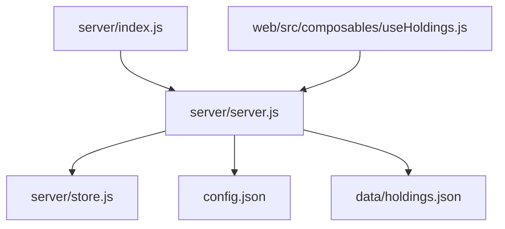
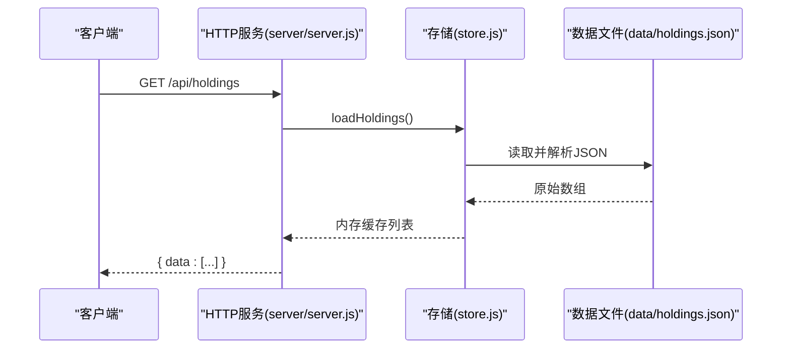
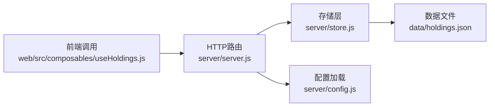

# API参考

<cite>
**本文引用的文件**
- [server/index.js](file://server/index.js)
- [server/server.js](file://server/server.js)
- [server/store.js](file://server/store.js)
- [server/config.js](file://server/config.js)
- [config.json](file://config.json)
- [data/holdings.json](file://data/holdings.json)
- [web/src/composables/useHoldings.js](file://web/src/composables/useHoldings.js)
</cite>

## 目录
1. [简介](#简介)
2. [项目结构](#项目结构)
3. [核心组件](#核心组件)
4. [架构总览](#架构总览)
5. [详细接口说明](#详细接口说明)
6. [依赖关系分析](#依赖关系分析)
7. [性能与并发](#性能与并发)
8. [错误码与错误处理规范](#错误码与错误处理规范)
9. [认证、权限与速率限制](#认证权限与速率限制)
10. [版本管理与兼容性](#版本管理与兼容性)
11. [客户端集成示例](#客户端集成示例)
12. [测试与调试建议](#测试与调试建议)
13. [结论](#结论)

## 简介
本参考文档面向Stock Advisor后端RESTful API，覆盖持仓查询、创建、更新、交易记录管理、CSV导入以及飞书测试消息等能力。所有端点均基于Node.js原生HTTP服务实现，数据持久化到本地JSON文件，并通过内存缓存保证读写一致性。

## 项目结构
- 入口：server/index.js 启动服务器与调度器
- HTTP路由与业务逻辑：server/server.js
- 数据持久化与缓存：server/store.js
- 配置加载：server/config.js + config.json
- 前端调用示例（用于理解请求/响应格式）：web/src/composables/useHoldings.js
- 数据样例：data/holdings.json

图表来源
- [server/index.js:1-17](file://server/index.js#L1-L17)
- [server/server.js:567-594](file://server/server.js#L567-L594)
- [server/store.js:40-70](file://server/store.js#L40-L70)
- [server/config.js:7-10](file://server/config.js#L7-L10)
- [config.json:1-19](file://config.json#L1-L19)
- [web/src/composables/useHoldings.js:15-130](file://web/src/composables/useHoldings.js#L15-L130)

章节来源
- [server/index.js:1-17](file://server/index.js#L1-L17)
- [server/server.js:567-594](file://server/server.js#L567-L594)
- [server/store.js:1-71](file://server/store.js#L1-L71)
- [server/config.js:1-11](file://server/config.js#L1-L11)
- [config.json:1-19](file://config.json#L1-L19)
- [web/src/composables/useHoldings.js:1-154](file://web/src/composables/useHoldings.js#L1-L154)

## 核心组件
- HTTP服务：统一解析URL路径与方法，分发到对应处理器，返回JSON响应
- 存储层：内存缓存+串行写盘，避免并发冲突；支持旧模型迁移
- 配置：从根目录config.json读取服务端口、主机、通知策略等
- 前端调用：Vue组合式函数封装了常用API调用，便于理解请求体与响应结构

章节来源
- [server/server.js:55-87](file://server/server.js#L55-L87)
- [server/store.js:8-70](file://server/store.js#L8-L70)
- [server/config.js:7-10](file://server/config.js#L7-L10)
- [web/src/composables/useHoldings.js:15-130](file://web/src/composables/useHoldings.js#L15-L130)

## 架构总览

图表来源
- [server/server.js:409-414](file://server/server.js#L409-L414)
- [server/store.js:40-59](file://server/store.js#L40-L59)

## 详细接口说明
基础约定
- 基础URL：http://{host}:{port}（默认 host=0.0.0.0, port=3000，见配置文件）
- Content-Type：application/json; charset=utf-8
- 成功响应统一包含 data 字段；错误响应包含 error 字段
- 所有时间字段使用ISO字符串或YYYY-MM-DD日期字符串

### 1) 获取持仓列表
- 方法：GET
- URL：/api/holdings
- 请求参数：无
- 响应：
  - 200 OK：{ data: Array<持有项> }
  - 500：{ error: string }
- 字段说明（部分关键字段）：
  - id, name, code, region, type, status, strategy
  - purchases[]: 买入记录（buyPrice, buyQuantity, buyTime, targetProfitRate, stopLossRate）
  - sells[]: 卖出记录（sellPrice, sellQuantity, sellDate, costPrice, profit, returnRate）
  - 派生字段：cost, buyQuantity, avgCost, marketValue, holdingProfit, todayProfit, targetProfitRate, stopLossRate 等
- 示例（成功）：
  - 响应体结构参考：[data/holdings.json:1-462](file://data/holdings.json#L1-L462)
- 示例（错误）：
  - { "error": "内部异常信息" }

章节来源
- [server/server.js:409-414](file://server/server.js#L409-L414)
- [data/holdings.json:1-462](file://data/holdings.json#L1-L462)

### 2) 创建新持仓（建仓）
- 方法：POST
- URL：/api/holdings
- 请求体：
  - 必填：name, code, region, type
  - 可选：purchases[], strategy, snapshotDate, position, targetProfitRate, stopLossRate, refillDropRate, refillPrice, nextStrategy, dailyDropAlertPct, dailyRiseAlertPct
  - purchases[i]：buyPrice, buyQuantity, buyTime(或date), targetProfitRate, stopLossRate
- 响应：
  - 201 Created：{ data: 持有项(含派生字段) }
  - 400 Bad Request：{ error: "缺少字段: xxx" | "买入价/买入数量必须为正" }
- 示例（成功）：
  - 请求体参考：{"name":"示例基金","code":"005827","region":"sh","type":"股票型基金","purchases":[{"buyPrice":1.2,"buyQuantity":1000,"buyTime":"2026-01-01"}]}
  - 响应体结构参考：[data/holdings.json:1-462](file://data/holdings.json#L1-L462)
- 示例（错误）：
  - { "error": "缺少字段: region" }
  - { "error": "买入价/买入数量必须为正" }

章节来源
- [server/server.js:437-450](file://server/server.js#L437-L450)
- [data/holdings.json:1-462](file://data/holdings.json#L1-L462)

### 3) 更新持仓配置（日涨跌告警阈值等）
- 方法：PATCH
- URL：/api/holdings/:id
- 路径参数：id（持仓ID）
- 请求体：
  - dailyDropAlertPct?: number|null
  - dailyRiseAlertPct?: number|null
- 行为：更新后重置每日告警发送标记，使下次触发可立即推送
- 响应：
  - 200 OK：{ data: 持有项(含派生字段) }
  - 404 Not Found：{ error: "持仓不存在" }
- 示例（成功）：
  - 请求体：{"dailyDropAlertPct": 26, "dailyRiseAlertPct": 15}
  - 响应体结构参考：[data/holdings.json:1-462](file://data/holdings.json#L1-L462)
- 示例（错误）：
  - { "error": "持仓不存在" }

章节来源
- [server/server.js:452-465](file://server/server.js#L452-L465)
- [data/holdings.json:1-462](file://data/holdings.json#L1-L462)

### 4) 追加买入记录
- 方法：POST
- URL：/api/holdings/:id/purchases
- 路径参数：id（持仓ID）
- 请求体：
  - buyPrice, buyQuantity, buyTime(或date), targetProfitRate?, stopLossRate?
- 响应：
  - 200 OK：{ data: 持有项(含派生字段) }
  - 400 Bad Request：{ error: "买入价/买入数量必须为正" }
  - 404 Not Found：{ error: "持仓不存在" }
- 示例（成功）：
  - 请求体：{"buyPrice":1.5,"buyQuantity":500,"buyTime":"2026-08-14"}
  - 响应体结构参考：[data/holdings.json:1-462](file://data/holdings.json#L1-L462)
- 示例（错误）：
  - { "error": "买入价/买入数量必须为正" }

章节来源
- [server/server.js:467-488](file://server/server.js#L467-L488)
- [data/holdings.json:1-462](file://data/holdings.json#L1-L462)

### 5) 修改某条买入记录的止盈/止亏比例或价格/数量/日期
- 方法：PATCH
- URL：/api/holdings/:id/purchases/:pid
- 路径参数：id（持仓ID），pid（买入记录ID）
- 请求体（可选字段）：buyPrice, buyQuantity, buyTime, targetProfitRate, stopLossRate
- 响应：
  - 200 OK：{ data: 持有项(含派生字段) }
  - 404 Not Found：{ error: "持仓不存在" | "买入记录不存在" }
- 示例（成功）：
  - 请求体：{"targetProfitRate": 30, "stopLossRate": 20}
  - 响应体结构参考：[data/holdings.json:1-462](file://data/holdings.json#L1-L462)
- 示例（错误）：
  - { "error": "买入记录不存在" }

章节来源
- [server/server.js:490-513](file://server/server.js#L490-L513)
- [data/holdings.json:1-462](file://data/holdings.json#L1-L462)

### 6) 删除某条买入记录
- 方法：DELETE
- URL：/api/holdings/:id/purchases/:pid
- 路径参数：id（持仓ID），pid（买入记录ID）
- 响应：
  - 200 OK：{ data: 持有项(含派生字段) }
  - 404 Not Found：{ error: "持仓不存在" | "买入记录不存在" }
- 示例（成功）：
  - 响应体结构参考：[data/holdings.json:1-462](file://data/holdings.json#L1-L462)
- 示例（错误）：
  - { "error": "买入记录不存在" }

章节来源
- [server/server.js:515-527](file://server/server.js#L515-L527)
- [data/holdings.json:1-462](file://data/holdings.json#L1-L462)

### 7) 对已有持仓追加买入/卖出记录（兼容旧接口）
- 方法：POST
- URL：/api/holdings/:id/transactions
- 路径参数：id（持仓ID）
- 请求体：
  - type: "BUY" | "SELL"
  - price: number
  - quantity: number
  - date?: string (YYYY-MM-DD)
- 行为：
  - BUY：新增一条买入记录
  - SELL：按LIFO计算成本，写入卖出记录，并更新状态
- 响应：
  - 200 OK：{ data: 持有项(含派生字段) }
  - 400 Bad Request：{ error: "quantity / price 必须为正" | "卖出数量超过持仓数量" | "type 必须为 BUY 或 SELL" }
  - 404 Not Found：{ error: "持仓不存在" }
- 示例（成功）：
  - 请求体：{"type":"SELL","price":38.76,"quantity":100,"date":"2026-08-05"}
  - 响应体结构参考：[data/holdings.json:1-462](file://data/holdings.json#L1-L462)
- 示例（错误）：
  - { "error": "卖出数量超过持仓数量" }

章节来源
- [server/server.js:529-543](file://server/server.js#L529-L543)
- [data/holdings.json:1-462](file://data/holdings.json#L1-L462)

### 8) 导入CSV买卖记录
- 方法：POST
- URL：/api/import-csv
- 请求体：
  - csv: string（CSV文本）
  - createMissing?: boolean（是否自动创建缺失的持仓）
- 规则：
  - 精确匹配 holdings.code 或数字归一化匹配
  - 幂等：以(code, 操作, 日期, 数量, 价格)为唯一键，已存在则忽略
  - 支持BOM、引号包裹、逗号分隔
- 响应：
  - 200 OK：{ data: { added, skipped, created, createdCodes, missing, errors, total } }
  - 400 Bad Request：{ error: "缺少 csv 内容" | CSV表头校验失败或解析错误 }
- 示例（成功）：
  - 请求体：{"csv":"序号,名称,代码,地区,类型,操作,日期,数量,价格\n1,XX,005827,sh,股票型基金,买入,2026-01-01,1000,1.2", "createMissing":true}
  - 响应体：{"data":{"added":1,"skipped":0,"created":0,"createdCodes":[],"missing":[],"errors":[],"total":1}}
- 示例（错误）：
  - { "error": "缺少 csv 内容" }
  - { "error": "CSV 表头缺少必需列（需包含：代码 / 操作 / 日期 / 数量 / 价格）。当前表头：..." }

章节来源
- [server/server.js:416-435](file://server/server.js#L416-L435)

### 9) 发送飞书测试消息
- 方法：POST
- URL：/api/test-feishu
- 请求体：无
- 响应：
  - 200 OK：{ ok: true, data: ... }
  - 502 Bad Gateway：{ error: "飞书推送失败：..." }
- 用途：验证飞书机器人推送是否正常

章节来源
- [server/server.js:545-562](file://server/server.js#L545-L562)

## 依赖关系分析

图表来源
- [server/server.js:409-565](file://server/server.js#L409-L565)
- [server/store.js:40-70](file://server/store.js#L40-L70)
- [server/config.js:7-10](file://server/config.js#L7-L10)
- [web/src/composables/useHoldings.js:15-130](file://web/src/composables/useHoldings.js#L15-L130)

章节来源
- [server/server.js:409-565](file://server/server.js#L409-L565)
- [server/store.js:40-70](file://server/store.js#L40-L70)
- [server/config.js:7-10](file://server/config.js#L7-L10)
- [web/src/composables/useHoldings.js:15-130](file://web/src/composables/useHoldings.js#L15-L130)

## 性能与并发
- 读路径：loadHoldings 使用内存缓存，仅在首次加载或外部文件被修改时重新读盘
- 写路径：saveHoldings 通过Promise链串行写盘，避免并发覆盖
- 适合场景：单机部署、低并发读写；高并发场景建议引入锁或数据库

章节来源
- [server/store.js:8-70](file://server/store.js#L8-L70)

## 错误码与错误处理规范
- 200 OK：常规成功
- 201 Created：创建成功（如新建持仓）
- 400 Bad Request：参数校验失败（缺字段、数值非法、CSV表头缺失等）
- 404 Not Found：资源不存在（持仓或买入记录）
- 500 Internal Server Error：未捕获异常（由全局try/catch返回）
- 502 Bad Gateway：飞书推送失败
- 错误体格式：{ "error": "具体错误信息" }
- 注意：服务端统一通过 sendJSON 输出JSON，Content-Type 固定为 application/json; charset=utf-8

章节来源
- [server/server.js:55-87](file://server/server.js#L55-L87)
- [server/server.js:409-565](file://server/server.js#L409-L565)

## 认证、权限与速率限制
- 当前实现未内置认证与鉴权机制
- 当前实现未内置速率限制
- 建议：在反向代理（如Nginx）或网关层增加鉴权与限流

章节来源
- [server/server.js:567-594](file://server/server.js#L567-L594)

## 版本管理与兼容性
- 当前所有API路径均以 /api/ 前缀暴露，未显式版本号
- 向后兼容：提供 /api/holdings/:id/transactions 作为兼容旧接口的交易入口
- 建议：未来可在路由中引入版本前缀（如 /v1/api/...）以实现平滑升级

章节来源
- [server/server.js:409-565](file://server/server.js#L409-L565)

## 客户端集成示例
以下示例展示如何调用上述API（仅示意，不包含敏感信息）：

- JavaScript（浏览器/Node fetch）
  - 获取持仓：fetch('/api/holdings').then(r=>r.json()).then(console.log)
  - 创建持仓：POST /api/holdings，body 包含 name/code/region/type 及可选 purchases
  - 追加买入：POST /api/holdings/:id/purchases
  - 修改买入记录：PATCH /api/holdings/:id/purchases/:pid
  - 删除买入记录：DELETE /api/holdings/:id/purchases/:pid
  - 交易记录：POST /api/holdings/:id/transactions
  - 导入CSV：POST /api/import-csv，body 包含 csv 与可选 createMissing
  - 测试飞书：POST /api/test-feishu

- Python（requests）
  - 获取持仓：requests.get('http://localhost:3000/api/holdings')
  - 创建持仓：requests.post('http://localhost:3000/api/holdings', json={...})
  - 其他接口类似，设置 headers={'Content-Type':'application/json'}

- cURL
  - GET：curl http://localhost:3000/api/holdings
  - POST：curl -X POST -H 'Content-Type: application/json' -d '{"name":"...","code":"...","region":"...","type":"..."}' http://localhost:3000/api/holdings
  - PATCH：curl -X PATCH -H 'Content-Type: application/json' -d '{"dailyDropAlertPct":26}' http://localhost:3000/api/holdings/{id}
  - DELETE：curl -X DELETE http://localhost:3000/api/holdings/{id}/purchases/{pid}

章节来源
- [web/src/composables/useHoldings.js:15-130](file://web/src/composables/useHoldings.js#L15-L130)

## 测试与调试建议
- 使用浏览器开发者工具或Postman进行接口调试
- 通过 /api/test-feishu 验证飞书机器人连通性
- 检查 data/holdings.json 确认数据落盘是否符合预期
- 关注控制台日志，定位500错误原因

章节来源
- [server/server.js:545-562](file://server/server.js#L545-L562)
- [server/server.js:583-586](file://server/server.js#L583-L586)

## 结论
该API提供了完整的持仓生命周期管理能力，包括查询、创建、更新、交易记录与CSV批量导入，并以简洁的JSON格式交互。当前实现轻量且易于部署，适合个人或小团队使用。后续可按需在网关层加入认证、鉴权与限流，并在路由中引入版本控制以提升可维护性与兼容性。