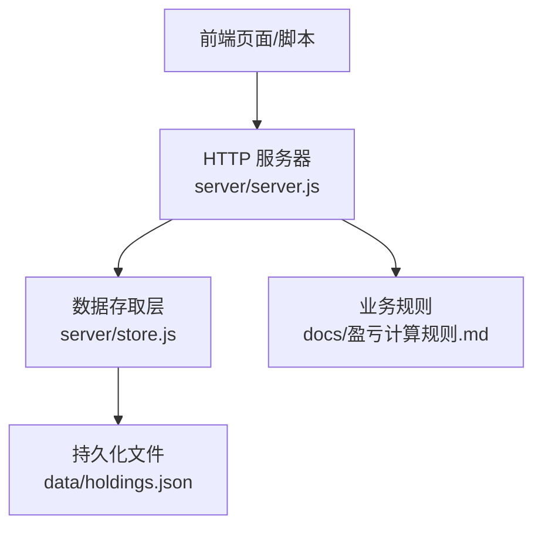
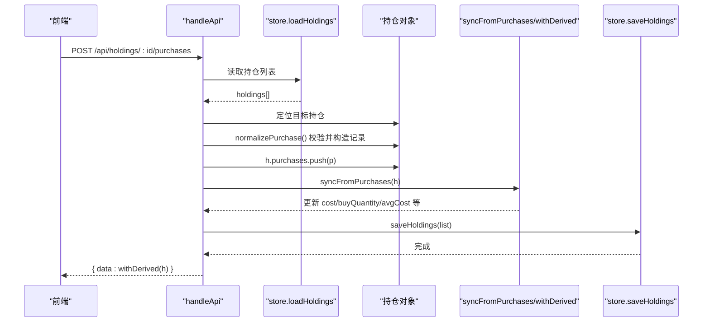
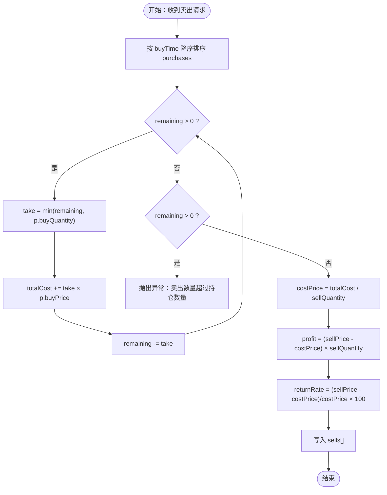
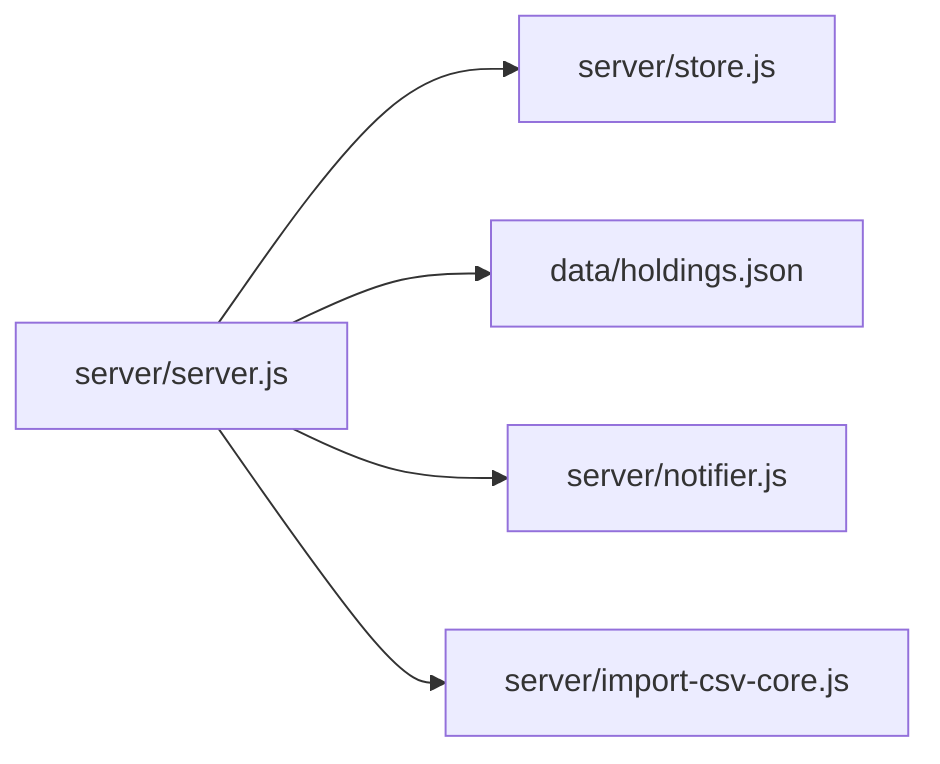

# 交易记录API

<cite>
**本文引用的文件**
- [server/server.js](file://server/server.js)
- [server/store.js](file://server/store.js)
- [data/holdings.json](file://data/holdings.json)
- [docs/盈亏计算规则.md](file://docs/盈亏计算规则.md)
- [web/src/components/BuyRecordModal.vue](file://web/src/components/BuyRecordModal.vue)
- [web/src/components/TransactionModal.vue](file://web/src/components/TransactionModal.vue)
</cite>

## 目录
1. [简介](#简介)
2. [项目结构](#项目结构)
3. [核心组件](#核心组件)
4. [架构总览](#架构总览)
5. [详细组件分析](#详细组件分析)
6. [依赖关系分析](#依赖关系分析)
7. [性能考量](#性能考量)
8. [故障排查指南](#故障排查指南)
9. [结论](#结论)
10. [附录：完整交易流程示例](#附录完整交易流程示例)

## 简介
本文件为 Stock Advisor 的交易记录 API 文档，聚焦买入与卖出记录的增删改查、LIFO 卖出成本计算、持仓数据同步机制、验证与错误处理，以及从建仓到清仓的完整操作流程。读者可据此理解后端接口设计、数据结构与业务规则，并安全地集成前端或自动化脚本。

## 项目结构
- 服务端路由与业务逻辑集中在 server/server.js，负责解析请求、调用存储层、执行交易与派生指标计算。
- 数据持久化通过 server/store.js 提供 loadHoldings/saveHoldings，使用 data/holdings.json 作为唯一数据源，并提供内存缓存与串行写盘。
- 前端交互由 web/src/components 下的 Vue 组件驱动，如 BuyRecordModal.vue（买入记录编辑）、TransactionModal.vue（统一买入/卖出入口）。
- 业务规则在 docs/盈亏计算规则.md 中明确定义，包括 LIFO、剩余仓位、盈亏汇总等。

图表来源
- [server/server.js:409-565](file://server/server.js#L409-L565)
- [server/store.js:40-70](file://server/store.js#L40-L70)
- [docs/盈亏计算规则.md:1-228](file://docs/盈亏计算规则.md#L1-L228)

章节来源
- [server/server.js:409-565](file://server/server.js#L409-L565)
- [server/store.js:40-70](file://server/store.js#L40-L70)
- [data/holdings.json:1-462](file://data/holdings.json#L1-L462)
- [docs/盈亏计算规则.md:1-228](file://docs/盈亏计算规则.md#L1-L228)

## 核心组件
- 路由处理器 handleApi：集中处理 /api/holdings、/api/import-csv、/api/test-feishu 及交易相关路径。
- 交易应用 applyTransaction：统一处理 BUY/SELL，实现 LIFO 成本计算与状态更新。
- 派生计算 withDerived/syncFromPurchases：基于 purchases/sells 实时计算均价、市值、盈亏、今日收益等。
- 存储层 store：loadHoldings/saveHoldings 提供带缓存与串行写入的数据访问。

章节来源
- [server/server.js:346-407](file://server/server.js#L346-L407)
- [server/server.js:146-284](file://server/server.js#L146-L284)
- [server/store.js:40-70](file://server/store.js#L40-L70)

## 架构总览
下图展示一次“添加买入记录”的端到端流程：前端发起 POST 请求，服务端校验并追加到 purchases，随后重新计算并持久化。

图表来源
- [server/server.js:467-488](file://server/server.js#L467-L488)
- [server/server.js:247-284](file://server/server.js#L247-L284)
- [server/store.js:40-70](file://server/store.js#L40-L70)

## 详细组件分析

### 交易记录数据结构
- 买入记录 Purchase
  - id: 字符串，唯一标识
  - buyPrice: 数字，买入单价
  - buyQuantity: 数字，买入数量
  - buyTime: 字符串，日期（YYYY-MM-DD）
  - targetProfitRate: 数字，止盈收益率百分比
  - stopLossRate: 数字，止损收益率百分比
- 卖出记录 Sell
  - id: 字符串，唯一标识
  - sellPrice: 数字，卖出单价
  - sellQuantity: 数字，卖出数量
  - sellDate: 字符串，卖出日期
  - costPrice: 数字，按 LIFO 计算的卖出成本均价
  - profit: 数字，该笔卖出实现的盈亏金额
  - returnRate: 数字，该笔卖出的收益率百分比
- 持仓 Holding（节选）
  - purchases[], sells[]
  - cost, buyQuantity, avgCost, lastBuyPrice
  - marketValue, holdingProfit, holdingReturnRate
  - todayProfit, todayReturnRate
  - targetProfitRate, stopLossRate（加权均值）

章节来源
- [docs/盈亏计算规则.md:21-46](file://docs/盈亏计算规则.md#L21-L46)
- [docs/盈亏计算规则.md:50-93](file://docs/盈亏计算规则.md#L50-L93)
- [server/server.js:146-245](file://server/server.js#L146-L245)

### API 清单与行为说明
- 新增买入记录
  - 方法/路径：POST /api/holdings/:id/purchases
  - 功能：为指定持仓追加一条买入记录；校验通过后写入 purchases，并重新计算持仓指标后返回。
  - 请求体字段：buyPrice、buyQuantity、buyTime（或 date）、targetProfitRate、stopLossRate
  - 响应：包含 withDerived(h) 的完整持仓视图
- 修改买入记录
  - 方法/路径：PATCH /api/holdings/:id/purchases/:pid
  - 功能：更新某条买入记录的 buyPrice、buyQuantity、buyTime、targetProfitRate、stopLossRate；更新后重新计算并保存。
  - 响应：withDerived(h)
- 删除买入记录
  - 方法/路径：DELETE /api/holdings/:id/purchases/:pid
  - 功能：移除指定买入记录；若 purchases 为空则设置状态为已卖出；重新计算并保存。
  - 响应：withDerived(h)
- 兼容旧版交易接口（含卖出）
  - 方法/路径：POST /api/holdings/:id/transactions
  - 功能：支持 type=BUY/SELL；SELL 时按 LIFO 计算成本并写入 sells[]，不修改 purchases[]。
  - 响应：withDerived(h)

章节来源
- [server/server.js:467-527](file://server/server.js#L467-L527)
- [server/server.js:529-543](file://server/server.js#L529-L543)

### LIFO 卖出原则与成本计算
- 卖出时按 buyTime 降序匹配最新买入记录，逐笔扣减数量，累计成本，得到 totalCost。
- 若 remaining > 0，抛出异常（卖出数量超过持仓数量）。
- costPrice = totalCost / sellQuantity；profit = (sellPrice - costPrice) * sellQuantity；returnRate = (sellPrice - costPrice)/costPrice*100。
- 将卖出记录写入 sells[]，不改动任何 purchases[]。

图表来源
- [server/server.js:364-407](file://server/server.js#L364-L407)
- [docs/盈亏计算规则.md:59-80](file://docs/盈亏计算规则.md#L59-L80)

章节来源
- [server/server.js:364-407](file://server/server.js#L364-L407)
- [docs/盈亏计算规则.md:59-80](file://docs/盈亏计算规则.md#L59-L80)

### 交易记录与持仓数据的关联与同步
- 每次写入 purchases/sells 后，调用 syncFromPurchases(h) 重算：
  - 剩余成本 = 总买入成本 - Σ(sell.costPrice × sell.sellQuantity)
  - 剩余数量 = 总买入数量 - Σ(sell.sellQuantity)
  - 剩余均价 = 剩余数量 > 0 ? 剩余成本 / 剩余数量 : 0
  - 最近买入价、加权止盈/止损比例等
- 对外查询 GET /api/holdings 时，使用 withDerived(h) 动态生成 transactions、市值、未实现/已实现盈亏、今日收益等。

章节来源
- [server/server.js:247-284](file://server/server.js#L247-L284)
- [server/server.js:146-245](file://server/server.js#L146-L245)

### 验证规则与错误处理
- 新增/修改买入记录
  - buyPrice、buyQuantity 必须为正数，否则返回 400 错误。
  - buyTime 支持 date 或 buyTime 字段，默认取当天。
- 删除买入记录
  - 若不存在对应 pid，返回 404。
- 卖出
  - quantity/price 必须为正；超出持仓数量抛错；type 必须为 BUY 或 SELL。
- 通用
  - 找不到持仓返回 404；JSON 解析失败返回 400；未命中路由返回 404。
- 异常捕获
  - 全局 try/catch 包裹请求处理，未发送响应头时返回 500 错误信息。

章节来源
- [server/server.js:286-300](file://server/server.js#L286-L300)
- [server/server.js:346-407](file://server/server.js#L346-L407)
- [server/server.js:409-565](file://server/server.js#L409-L565)
- [server/server.js:567-594](file://server/server.js#L567-L594)

### 前端交互要点
- BuyRecordModal.vue：用于添加或修改买入记录，提交字段与后端 normalizePurchase 一致。
- TransactionModal.vue：统一买入/卖出入口，提交 type/price/quantity/date，走兼容接口 /api/holdings/:id/transactions。

章节来源
- [web/src/components/BuyRecordModal.vue:1-94](file://web/src/components/BuyRecordModal.vue#L1-L94)
- [web/src/components/TransactionModal.vue:1-81](file://web/src/components/TransactionModal.vue#L1-L81)

## 依赖关系分析
- server/server.js 依赖 store.js 进行读写，依赖 notifier.js 发送飞书通知，依赖 import-csv-core.js 导入 CSV。
- store.js 维护内存缓存与串行写链，避免并发覆盖。
- 数据模型以 data/holdings.json 为准，首次加载会迁移旧格式至 purchases 数组。

图表来源
- [server/server.js:1-8](file://server/server.js#L1-L8)
- [server/store.js:1-7](file://server/store.js#L1-L7)

章节来源
- [server/server.js:1-8](file://server/server.js#L1-L8)
- [server/store.js:1-71](file://server/store.js#L1-L71)

## 性能考量
- 内存缓存：loadHoldings 仅在首次或文件 mtime 变化时读盘，减少 IO。
- 串行写盘：saveHoldings 使用 Promise 链串行写入，避免调度器与 HTTP 并发写冲突。
- 派生计算：withDerived/syncFromPurchases 在写入后即时计算，查询时仅做轻量映射与排序，适合中小规模数据。
- 建议：对高频写入场景可增加批量合并或增量更新策略；对超大数据集考虑分页或索引。

章节来源
- [server/store.js:8-12](file://server/store.js#L8-L12)
- [server/store.js:40-70](file://server/store.js#L40-L70)

## 故障排查指南
- 400 错误
  - 常见原因：JSON 解析失败、买入价/数量为非正、卖出数量超过持仓数量。
  - 排查：检查请求体字段类型与取值范围；确认当前持仓剩余数量。
- 404 错误
  - 常见原因：持仓 ID 不存在、买入记录 ID 不存在、路由未匹配。
  - 排查：核对 URL 中的 :id 与 :pid；确认数据是否已创建。
- 500 错误
  - 常见原因：未预期的异常；IO 错误。
  - 排查：查看服务端日志；检查磁盘权限与文件完整性。
- 数据不一致
  - 现象：前端显示与预期不符。
  - 排查：确认是否调用了 syncFromPurchases；检查 withDerived 输出；必要时重启服务刷新缓存。

章节来源
- [server/server.js:409-565](file://server/server.js#L409-L565)
- [server/server.js:567-594](file://server/server.js#L567-L594)

## 结论
本系统通过清晰的 API 分层与严格的业务规则，实现了多笔买入记录管理、LIFO 卖出成本计算与持仓指标的实时同步。配合前端组件，用户可便捷地完成建仓、加仓、减仓、清仓等操作。建议在扩展新功能时遵循现有模式：先定义数据模型与规则，再实现路由与派生计算，确保一致性。

## 附录：完整交易流程示例
以下示例演示从建仓到清仓的常用场景，均基于上述 API。

- 建仓（首次买入）
  - 步骤：POST /api/holdings（创建持仓，可选附带 purchases）
  - 结果：status 设为持有，计算初始成本与均价
- 加仓（追加买入）
  - 步骤：POST /api/holdings/:id/purchases
  - 结果：purchases 增加一笔，重算均价与持仓指标
- 减仓（部分卖出）
  - 步骤：POST /api/holdings/:id/transactions（type=SELL）
  - 结果：sells 增加一笔，按 LIFO 计算 costPrice，剩余仓位与均价更新
- 清仓（全部卖出）
  - 步骤：多次卖出直至 totalSold >= totalBought
  - 结果：status 变为全部卖出，剩余数量为 0，已实现盈亏汇总
- 修正历史买入
  - 步骤：PATCH /api/holdings/:id/purchases/:pid（调整价格/数量/日期/止盈止损）
  - 结果：重算剩余成本与均价，保持历史记录不变
- 删除误录买入
  - 步骤：DELETE /api/holdings/:id/purchases/:pid
  - 结果：移除记录并重算；若 purchases 为空，状态置为已卖出

章节来源
- [server/server.js:437-450](file://server/server.js#L437-L450)
- [server/server.js:467-527](file://server/server.js#L467-L527)
- [server/server.js:529-543](file://server/server.js#L529-L543)
- [docs/盈亏计算规则.md:190-218](file://docs/盈亏计算规则.md#L190-L218)