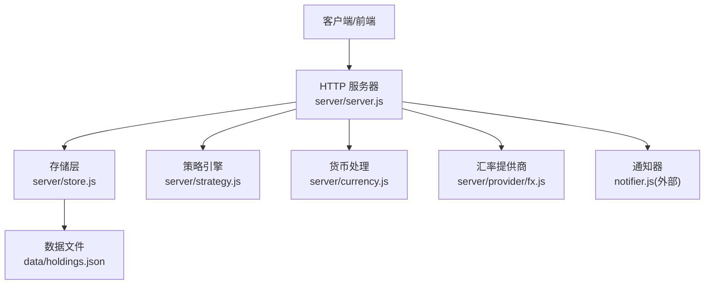
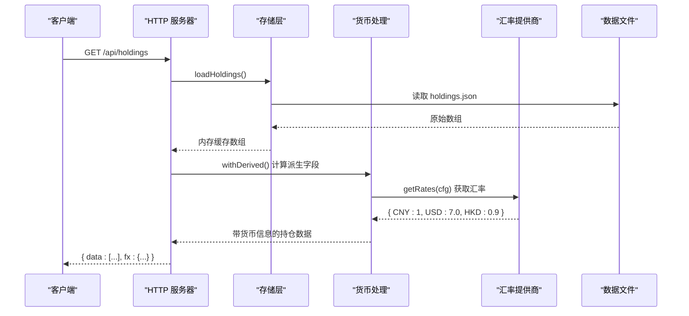
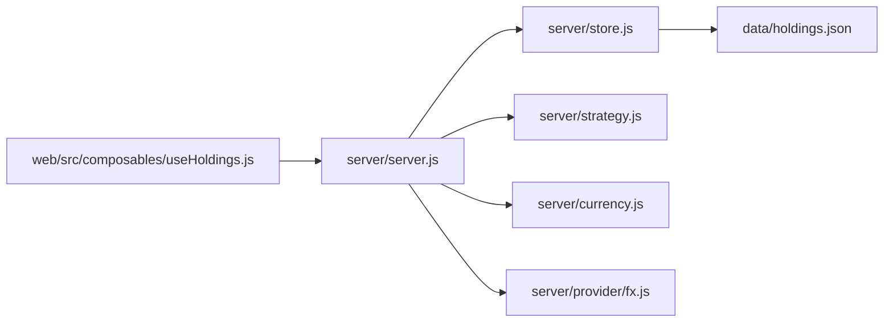

# 持仓管理API

<cite>
**本文引用的文件**
- [server/server.js](file://server/server.js)
- [server/store.js](file://server/store.js)
- [server/strategy.js](file://server/strategy.js)
- [server/currency.js](file://server/currency.js)
- [server/provider/fx.js](file://server/provider/fx.js)
- [data/holdings.json](file://data/holdings.json)
- [config.json](file://config.json)
- [web/src/composables/useHoldings.js](file://web/src/composables/useHoldings.js)
</cite>

## 更新摘要
**变更内容**
- 更新了 /api/holdings 端点响应格式，新增多币种支持
- 添加了 currency 和 currencyCode 字段到每个持仓对象
- 在响应中增加了 fx.rates 汇率配置信息
- 增强了持仓数据的货币信息处理能力

## 目录
1. [简介](#简介)
2. [项目结构](#项目结构)
3. [核心组件](#核心组件)
4. [架构总览](#架构总览)
5. [详细接口说明](#详细接口说明)
6. [依赖关系分析](#依赖关系分析)
7. [性能与一致性](#性能与一致性)
8. [故障排查指南](#故障排查指南)
9. [结论](#结论)
10. [附录：数据模型与字段说明](#附录数据模型与字段说明)

## 简介
本文件为 Stock Advisor 的"持仓管理"后端 API 文档，覆盖所有与持仓相关的 HTTP 端点，包括：
- GET /api/holdings：获取持仓列表（含派生计算字段和多币种支持）
- POST /api/holdings：创建新持仓（支持一次性录入多条买入记录）
- PATCH /api/holdings/:id：更新持仓级配置（如日涨跌告警阈值等）
- POST /api/holdings/:id/purchases：追加买入记录
- PATCH /api/holdings/:id/purchases/:pid：修改某条买入记录的止盈/止损比例、价格、数量、时间等
- DELETE /api/holdings/:id/purchases/:pid：删除某条买入记录
- POST /api/holdings/:id/transactions：提交一笔交易（兼容旧接口，内部统一为买入或卖出）
- POST /api/import-csv：批量导入 CSV 买卖记录（按代码匹配，幂等插入）
- POST /api/test-feishu：测试飞书推送（用于验证通知通道）

每个接口均提供请求方法、URL 模式、参数说明、响应格式、成功与错误示例，并附带数据模型、状态管理与策略配置的详细说明。

**更新** 现在 /api/holdings 端点返回增强版的持仓数据，包含货币信息和当前汇率，支持多币种投资组合管理。

## 项目结构
后端采用 Node.js 原生 http 模块实现路由与业务逻辑，数据持久化到 data/holdings.json，前端通过 Vue 组合式函数调用这些接口。

**图表来源**
- [server/server.js:567-594](file://server/server.js#L567-L594)
- [server/store.js:40-70](file://server/store.js#L40-L70)
- [server/currency.js:1-49](file://server/currency.js#L1-L49)
- [server/provider/fx.js:1-23](file://server/provider/fx.js#L1-L23)

章节来源
- [server/server.js:1-100](file://server/server.js#L1-L100)
- [server/store.js:1-71](file://server/store.js#L1-L71)

## 核心组件
- 路由与处理器：集中处理 /api/* 请求，解析 JSON 体，调用业务函数，返回标准 JSON。
- 存储层：内存缓存 + 串行写盘，避免并发冲突；首次加载或文件被外部修改时重新读盘。
- 策略引擎：基于多次买入记录评估止盈/止损与补仓信号，供调度器使用。
- 货币处理：根据地区自动映射币种（A股人民币/港股港币/美股美元），并提供汇率换算功能。
- 数据模型：持仓对象包含基本信息、多次买入记录、卖出记录、派生计算字段、策略与告警配置，以及多币种支持。

**更新** 新增了货币处理和汇率功能，支持跨市场投资组合的统一管理和展示。

章节来源
- [server/server.js:409-565](file://server/server.js#L409-L565)
- [server/store.js:40-70](file://server/store.js#L40-L70)
- [server/strategy.js:34-90](file://server/strategy.js#L34-L90)
- [server/currency.js:1-49](file://server/currency.js#L1-L49)

## 架构总览

**图表来源**
- [server/server.js:410-423](file://server/server.js#L410-L423)
- [server/store.js:40-58](file://server/store.js#L40-L58)
- [server/currency.js:8-17](file://server/currency.js#L8-L17)
- [server/provider/fx.js:18-23](file://server/provider/fx.js#L18-L23)

## 详细接口说明

### 通用约定
- 内容类型：application/json; charset=utf-8
- 成功响应：{ data: ... }
- 失败响应：{ error: "..." }
- 状态码：200/201/400/404/500/502 等

### 1) 获取持仓列表
- 方法：GET
- URL：/api/holdings
- 请求体：无
- 响应：
  - 200：{ data: Array<HoldingWithDerived>, fx: { rates: Object, source: string } }
  - 500：{ error: "..." }
- 说明：返回所有持仓，并对每条持仓应用 withDerived 计算派生字段（成本、市值、收益、今日盈亏、均价、最近买入价、目标/止损加权值等）。**新增**：每个持仓对象现在包含 currency（币种代码）和 currencyCode（显示代码）字段，响应中还包含 fx.rates 汇率配置。

**更新** 响应格式已增强，现在包含多币种支持信息。

章节来源
- [server/server.js:417-423](file://server/server.js#L417-L423)
- [server/server.js:150-251](file://server/server.js#L150-L251)
- [server/currency.js:8-17](file://server/currency.js#L8-L17)

### 2) 创建新持仓（买入建仓）
- 方法：POST
- URL：/api/holdings
- 请求体：
  - 必填：name, code, region, type
  - 可选：purchases[]（可空，允许先建仓后补明细）、strategy、snapshotDate、snapshotProfit、snapshotReturnRate、position、refillDropRate、refillPrice、nextStrategy、dailyDropAlertPct、dailyRiseAlertPct
- 响应：
  - 201：{ data: HoldingWithDerived }
  - 400：{ error: "缺少字段: ..." | "买入价/买入数量必须为正" }
- 行为：
  - 校验必填字段
  - purchases 中每条记录需满足 buyPrice > 0 且 buyQuantity > 0
  - 生成唯一 id、默认 status=持有、初始化策略与告警字段
  - 保存后返回带派生字段的完整持仓

章节来源
- [server/server.js:467-479](file://server/server.js#L467-L479)
- [server/server.js:308-350](file://server/server.js#L308-L350)

### 3) 更新持仓级配置（日涨跌告警阈值等）
- 方法：PATCH
- URL：/api/holdings/:id
- 路径参数：id（持仓ID）
- 请求体（部分更新）：
  - dailyDropAlertPct：数值或 null（设为 null 表示不告警）
  - dailyRiseAlertPct：数值或 null
- 响应：
  - 200：{ data: HoldingWithDerived }
  - 404：{ error: "持仓不存在" }
- 行为：
  - 仅更新传入字段
  - 重置 dailyAlertSentDate，使下次触发立即推送

章节来源
- [server/server.js:482-494](file://server/server.js#L482-L494)

### 4) 追加买入记录
- 方法：POST
- URL：/api/holdings/:id/purchases
- 路径参数：id（持仓ID）
- 请求体：
  - buyPrice：正数
  - buyQuantity：正数
  - buyTime 或 date：日期字符串（默认当天）
  - targetProfitRate、stopLossRate：数值（默认 0）
- 响应：
  - 200：{ data: HoldingWithDerived }
  - 400：{ error: "买入价/买入数量必须为正" }
  - 404：{ error: "持仓不存在" }
- 行为：
  - 新增一条买入记录
  - 同步更新 cost、buyQuantity、avgCost、lastBuyPrice、加权目标/止损
  - 重置 triggerState 与 notifiedAt

章节来源
- [server/server.js:497-517](file://server/server.js#L497-L517)
- [server/server.js:292-306](file://server/server.js#L292-L306)
- [server/server.js:253-290](file://server/server.js#L253-L290)

### 5) 修改某条买入记录（止盈/止损比例、价格、数量、时间）
- 方法：PATCH
- URL：/api/holdings/:id/purchases/:pid
- 路径参数：id（持仓ID），pid（买入记录ID）
- 请求体（部分更新）：
  - buyPrice、buyQuantity、buyTime、targetProfitRate、stopLossRate
- 响应：
  - 200：{ data: HoldingWithDerived }
  - 404：{ error: "持仓不存在" | "买入记录不存在" }
- 行为：
  - 仅更新传入字段
  - 同步更新汇总字段

章节来源
- [server/server.js:520-542](file://server/server.js#L520-L542)
- [server/server.js:253-290](file://server/server.js#L253-L290)

### 6) 删除某条买入记录
- 方法：DELETE
- URL：/api/holdings/:id/purchases/:pid
- 路径参数：同上
- 响应：
  - 200：{ data: HoldingWithDerived }
  - 404：{ error: "持仓不存在" | "买入记录不存在" }
- 行为：
  - 删除指定买入记录
  - 若该持仓无剩余买入记录，status 置为"已卖出"

章节来源
- [server/server.js:545-556](file://server/server.js#L545-L556)

### 7) 提交交易（兼容旧接口）
- 方法：POST
- URL：/api/holdings/:id/transactions
- 路径参数：id（持仓ID）
- 请求体：
  - type：BUY 或 SELL
  - price：正数
  - quantity：正数
  - date：可选，默认当天
- 响应：
  - 200：{ data: HoldingWithDerived }
  - 400：{ error: "quantity / price 必须为正" | "卖出数量超过持仓数量" | "type 必须为 BUY 或 SELL" }
  - 404：{ error: "持仓不存在" }
- 行为：
  - BUY：新增买入记录，status 置为"持有"
  - SELL：新增卖出记录，按 LIFO 计算成本，更新 status 为"全部卖出"或"持有"
  - 同步更新汇总字段，重置触发态

章节来源
- [server/server.js:352-413](file://server/server.js#L352-L413)
- [server/server.js:559-572](file://server/server.js#L559-L572)

### 8) 批量导入 CSV 买卖记录
- 方法：POST
- URL：/api/import-csv
- 请求体：
  - csv：CSV 文本
  - createMissing：布尔（是否自动新建缺失的持仓）
- 响应：
  - 200：{ data: { added, skipped, created, createdCodes, missing, errors, total } }
  - 400：{ error: "缺少 csv 内容" | "..." }
- 行为：
  - 按代码匹配现有持仓，已有明细忽略（幂等）
  - 支持数字归一化匹配
  - 可自动创建缺失持仓（createMissing=true）

章节来源
- [server/server.js:447-464](file://server/server.js#L447-L464)
- [server/import-csv-core.js:130-156](file://server/import-csv-core.js#L130-L156)
- [server/import-csv-core.js:170-247](file://server/import-csv-core.js#L170-L247)

### 9) 测试飞书推送
- 方法：POST
- URL：/api/test-feishu
- 请求体：无
- 响应：
  - 200：{ ok: true, data: ... }
  - 502：{ error: "飞书推送失败：..." }
- 用途：验证飞书机器人是否正常

章节来源
- [server/server.js:575-591](file://server/server.js#L575-L591)

## 依赖关系分析

**图表来源**
- [server/server.js:567-594](file://server/server.js#L567-L594)
- [server/store.js:40-70](file://server/store.js#L40-L70)
- [server/currency.js:1-49](file://server/currency.js#L1-L49)
- [server/provider/fx.js:1-23](file://server/provider/fx.js#L1-L23)
- [web/src/composables/useHoldings.js:15-29](file://web/src/composables/useHoldings.js#L15-L29)

章节来源
- [server/server.js:409-565](file://server/server.js#L409-L565)
- [server/store.js:40-70](file://server/store.js#L40-L70)
- [web/src/composables/useHoldings.js:67-130](file://web/src/composables/useHoldings.js#L67-L130)

## 性能与一致性
- 内存缓存：loadHoldings 仅在首次或文件 mtime 变化时重读磁盘，减少 I/O。
- 串行写盘：saveHoldings 使用 Promise 链串行写入，避免并发覆盖。
- 派生计算：withDerived 在每次返回列表时计算，保证前端展示一致。
- 汇率缓存：汇率配置从配置源获取，避免频繁网络请求。
- 建议：
  - 高频更新场景下，尽量合并请求（如批量导入）
  - 合理设置刷新间隔，避免频繁拉取
  - 对大文件读写进行监控，必要时分片或归档

[本节为通用指导，无需具体文件引用]

## 故障排查指南
- 400 错误：检查请求体字段是否齐全、数值是否为正、JSON 是否合法
- 404 错误：确认 ID 是否存在（持仓或买入记录）
- 500 错误：查看服务端日志，定位异常堆栈
- 502 错误：检查飞书 webhook 与 secret 配置是否正确
- 数据不一致：确认是否手动修改了 holdings.json，导致缓存失效
- 汇率问题：检查 config.json 中的 fx.rates 配置或环境变量 FX_USD_CNY、FX_HKD_CNY

**更新** 新增了汇率相关问题的排查指南。

章节来源
- [server/server.js:567-594](file://server/server.js#L567-L594)
- [server/store.js:62-70](file://server/store.js#L62-L70)
- [server/provider/fx.js:18-23](file://server/provider/fx.js#L18-L23)

## 结论
本 API 提供了完整的持仓生命周期管理能力，支持多次买入、卖出、策略配置与告警阈值设置，并通过派生字段简化前端展示。**新增的多币种支持**使得系统能够统一管理不同市场的投资组合，自动识别币种并提供汇率换算功能。结合串行写盘与内存缓存，保证了高并发下的数据一致性与性能。建议在生产环境配合定时任务与通知机制，形成闭环的投资辅助流程。

**更新** 强调了新增的多币种支持功能及其在投资组合管理中的重要作用。

[本节为总结性内容，无需具体文件引用]

## 附录：数据模型与字段说明

### 持仓对象（Holding）
- 基本信息
  - id：字符串，唯一标识
  - name：品种名称
  - code：代码（支持数字归一化匹配）
  - region：市场区域（如 sh/hk/美股）
  - type：资产类型（股票/基金等）
  - strategy：投资策略（long/mid/short/highrisk）
  - snapshotDate/snapshotProfit/snapshotReturnRate：快照信息
  - position：初始仓位（可选）
- **新增** 货币信息
  - currency：币种代码（CNY/HKD/USD），根据地区自动映射
  - currencyCode：币种显示代码（如 "HKD"、"USD"、"CNY"）
- 交易明细
  - purchases[]：多次买入记录（见下）
  - sells[]：卖出记录（见下）
- 策略与告警
  - refillDropRate：补仓跌幅阈值（百分比）
  - refillPrice：补仓目标价
  - nextStrategy：下一阶段策略
  - dailyDropAlertPct/dailyRiseAlertPct：日涨跌告警阈值（百分比，null 表示不告警）
  - dailyAlertSentDate：当日告警发送标记
- 派生字段（由 withDerived 计算）
  - cost：剩余成本（总买入成本 - 已卖出部分成本）
  - buyQuantity：未卖出数量
  - sellQuantity：累计卖出数量
  - unsoldQuantity：未卖出数量（冗余）
  - avgCost：均价（剩余成本/未卖出数量）
  - lastBuyPrice：最近一次买入价
  - marketValue：当前市值（currentPrice * 未卖出数量）
  - holdingProfit：持仓总收益（未实现 + 已实现）
  - holdingReturnRate：持仓收益率
  - todayProfit/todayReturnRate：今日盈亏与收益率
  - targetProfitRate/stopLossRate：按成本加权的持仓级目标/止损
  - dropRate：较最近买入价的跌幅
  - transactions：合并后的交易流水（含买入与卖出）

**更新** 新增了货币信息字段，支持多币种投资组合管理。

### 买入记录（Purchase）
- id：唯一标识
- buyPrice：买入价（正数）
- buyQuantity：买入数量（正数）
- buyTime：买入日期（YYYY-MM-DD）
- targetProfitRate：该笔目标止盈（百分比）
- stopLossRate：该笔止损（百分比）

### 卖出记录（Sell）
- id：唯一标识
- sellPrice：卖出价
- sellQuantity：卖出数量
- sellDate：卖出日期
- costPrice：卖出部分的成本价（LIFO 计算）
- profit：该笔盈利
- returnRate：该笔收益率

### 状态与触发
- status：持有/全部卖出/已卖出
- triggerState：IDLE/SELL/BUY（由策略引擎评估）
- notifiedAt：上次通知时间

### 汇率配置（fx）
- rates：汇率对象，包含各币种兑人民币汇率
  - CNY：1（基准）
  - USD：美元兑人民币汇率（如 7.0）
  - HKD：港币兑人民币汇率（如 0.9）
- source：汇率数据来源标识

**新增** 汇率配置信息，用于前端进行多币种金额的统一展示和计算。

章节来源
- [server/server.js:308-350](file://server/server.js#L308-L350)
- [server/server.js:150-251](file://server/server.js#L150-L251)
- [server/server.js:253-290](file://server/server.js#L253-L290)
- [server/currency.js:1-49](file://server/currency.js#L1-L49)
- [server/provider/fx.js:1-23](file://server/provider/fx.js#L1-L23)
- [data/holdings.json:1-462](file://data/holdings.json#L1-L462)
- [config.json:18-20](file://config.json#L18-L20)