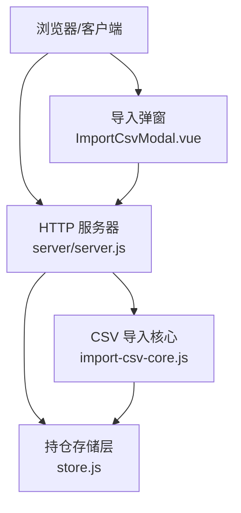
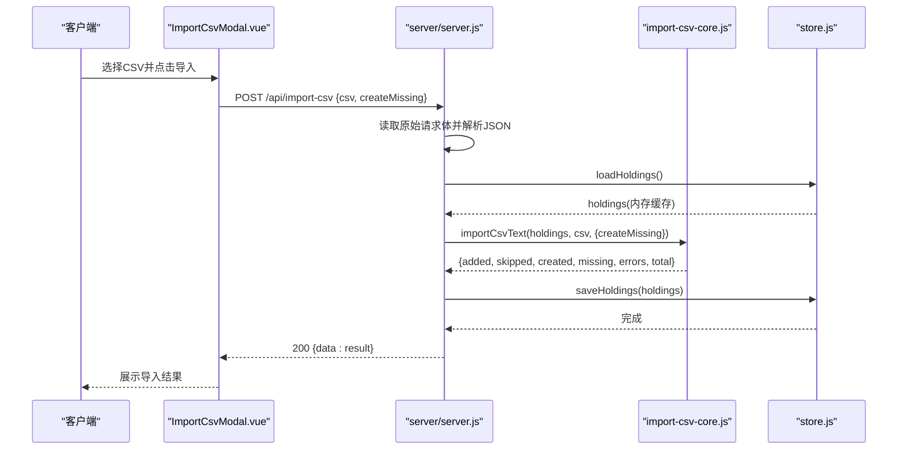
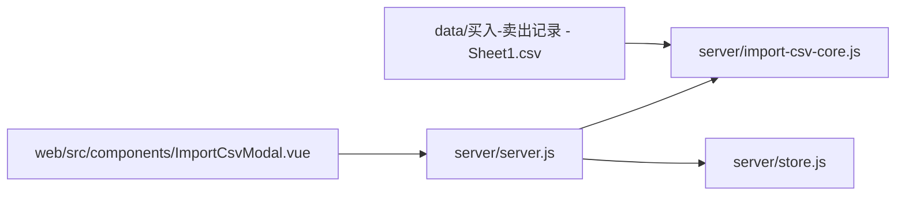

# 数据导入API

<cite>
**本文引用的文件**
- [server/server.js](file://server/server.js)
- [server/import-csv-core.js](file://server/import-csv-core.js)
- [server/import-csv.js](file://server/import-csv.js)
- [web/src/components/ImportCsvModal.vue](file://web/src/components/ImportCsvModal.vue)
- [data/买入-卖出记录 - Sheet1.csv](file://data/买入-卖出记录 - Sheet1.csv)
- [server/store.js](file://server/store.js)
- [config.json](file://config.json)
</cite>

## 目录
1. [简介](#简介)
2. [项目结构](#项目结构)
3. [核心组件](#核心组件)
4. [架构总览](#架构总览)
5. [详细组件分析](#详细组件分析)
6. [依赖关系分析](#依赖关系分析)
7. [性能与最佳实践](#性能与最佳实践)
8. [故障排查指南](#故障排查指南)
9. [结论](#结论)
10. [附录：CSV模板与字段映射](#附录csv模板与字段映射)

## 简介
本文件为 Stock Advisor 的“数据导入API”技术文档，聚焦 POST /api/import-csv 接口的 CSV 批量导入能力。内容涵盖：
- CSV 文件格式规范、字段映射规则
- 代码匹配机制、重复数据处理与缺失记录创建选项（createMissing）
- 数据处理逻辑、数据验证、错误处理与回滚策略
- 完整导入流程说明、最佳实践、性能优化建议与常见问题解决方案

## 项目结构
与导入功能相关的后端与前端关键文件如下：
- server/server.js：HTTP 路由与接口实现，包含 /api/import-csv
- server/import-csv-core.js：CSV 解析、匹配、幂等插入、持仓同步的核心逻辑
- server/import-csv.js：命令行一键导入脚本（与 HTTP 接口共享核心逻辑）
- web/src/components/ImportCsvModal.vue：前端导入弹窗，调用 /api/import-csv
- data/买入-卖出记录 - Sheet1.csv：示例 CSV 文件
- server/store.js：持仓数据的加载与持久化（含并发写保护）
- config.json：服务配置（端口等）

图表来源
- [server/server.js:416-435](file://server/server.js#L416-L435)
- [server/import-csv-core.js:170-306](file://server/import-csv-core.js#L170-L306)
- [server/store.js:40-69](file://server/store.js#L40-L69)
- [web/src/components/ImportCsvModal.vue:49-73](file://web/src/components/ImportCsvModal.vue#L49-L73)

章节来源
- [server/server.js:416-435](file://server/server.js#L416-L435)
- [server/import-csv-core.js:170-306](file://server/import-csv-core.js#L170-L306)
- [server/store.js:40-69](file://server/store.js#L40-L69)
- [web/src/components/ImportCsvModal.vue:49-73](file://web/src/components/ImportCsvModal.vue#L49-L73)

## 核心组件
- HTTP 路由处理器：负责接收请求、读取原始文本、调用核心导入函数并落盘
- CSV 导入核心：解析 CSV、校验表头、归一化日期、代码匹配、幂等去重、新增/更新持仓明细、计算卖出成本、汇总字段同步
- 存储层：内存缓存 + 串行写盘，避免并发覆盖
- 前端弹窗：选择 CSV、传递 createMissing 参数、展示导入结果

章节来源
- [server/server.js:416-435](file://server/server.js#L416-L435)
- [server/import-csv-core.js:170-306](file://server/import-csv-core.js#L170-L306)
- [server/store.js:40-69](file://server/store.js#L40-L69)
- [web/src/components/ImportCsvModal.vue:49-73](file://web/src/components/ImportCsvModal.vue#L49-L73)

## 架构总览
POST /api/import-csv 的整体调用链：
- 前端通过 ImportCsvModal 将 CSV 文本与 createMissing 标志以 JSON 形式发送到 /api/import-csv
- 服务端读取原始请求体，解析 JSON，校验 csv 字段非空
- 从 store 加载 holdings 到内存
- 调用 import-csv-core 的 importCsvText 执行导入
- 成功后调用 saveHoldings 串行写入磁盘
- 返回统计信息（新增、跳过、新建、缺失、错误、总数）

图表来源
- [web/src/components/ImportCsvModal.vue:49-73](file://web/src/components/ImportCsvModal.vue#L49-L73)
- [server/server.js:416-435](file://server/server.js#L416-L435)
- [server/import-csv-core.js:170-306](file://server/import-csv-core.js#L170-L306)
- [server/store.js:40-69](file://server/store.js#L40-L69)

## 详细组件分析

### 接口定义与请求/响应
- 端点：POST /api/import-csv
- Content-Type：application/json
- 请求体：
  - csv: string（必填），CSV 文本内容
  - createMissing: boolean（可选），是否自动创建缺失的持仓
- 成功响应（200）：
  - data.added: number，新增明细条数
  - data.skipped: number，已存在明细忽略条数
  - data.created: number，自动新建持仓只数
  - data.createdCodes: Array，新建持仓对象列表
  - data.missing: Array，未匹配到持仓且未自动新建的记录
  - data.errors: Array，导入出错记录及错误信息
  - data.total: number，CSV 有效记录总数
- 失败响应（400）：
  - error: string，如缺少 csv 内容或 CSV 表头校验失败

章节来源
- [server/server.js:416-435](file://server/server.js#L416-L435)
- [server/import-csv-core.js:170-188](file://server/import-csv-core.js#L170-L188)

### CSV 文件格式与字段映射
- 支持 BOM、引号包裹、逗号分隔；首行为表头，后续为数据行
- 必需列（至少包含以下之一）：
  - 代码：'代码'
  - 操作：'操作'（值为“买入”或“卖出”，系统内部识别为 BUY/SELL）
  - 日期：'买入日期' 或 '卖出日期' 或 '日期'
  - 数量：'买入数量' 或 '卖出数量' 或 '数量'
  - 价格：'买入价' 或 '卖出价' 或 '价格'
- 可选列：
  - 序号：'序号'
  - 名称：'股票/基金名称' 或 '名称'
  - 地区：'地区'
  - 类型：'类型'
- 日期格式：支持 YYYY-MM-DD、YYYY/MM/DD、YYYY.MM.DD，会被归一化为 YYYY-MM-DD
- 数值校验：数量和价格必须为正数；非法行将被跳过

章节来源
- [server/import-csv-core.js:8-23](file://server/import-csv-core.js#L8-L23)
- [server/import-csv-core.js:31-36](file://server/import-csv-core.js#L31-L36)
- [server/import-csv-core.js:175-188](file://server/import-csv-core.js#L175-L188)
- [server/import-csv-core.js:191-210](file://server/import-csv-core.js#L191-L210)

### 代码匹配机制
- 精确匹配：CSV 代码与 holdings.code 完全相等
- 数字归一化匹配：当精确匹配失败时，提取 holdings.code 中的纯数字并与 CSV 代码的数字部分比较（例如 hk00700 → 700）
- 匹配优先级：先尝试精确匹配，再尝试数字归一化匹配

章节来源
- [server/import-csv-core.js:25-28](file://server/import-csv-core.js#L25-L28)
- [server/import-csv-core.js:212-224](file://server/import-csv-core.js#L212-L224)

### 重复数据处理（幂等）
- 唯一键：对每条记录以 (code, 操作, 日期, 数量, 价格) 作为唯一键进行判断
- 若 holdings 中已存在相同键的明细，则跳过该条记录（计入 skipped）
- 日期在比较前会归一化，确保不同书写格式也能正确去重

章节来源
- [server/import-csv-core.js:226-239](file://server/import-csv-core.js#L226-L239)

### 缺失记录创建（createMissing）
- 当 createMissing 为 true 且匹配不到现有持仓时，系统会根据 CSV 的行数据自动创建新持仓
- 新建持仓字段来源：
  - name：来自 CSV 的名称列，否则使用代码
  - code：来自 CSV 的代码列
  - region/type：来自 CSV 的地区/类型列
- 同一代码仅创建一次（去重），并在结果中返回 createdCodes 列表
- 若 createMissing 为 false 或未设置，未匹配的 CSV 记录将出现在 missing 列表中

章节来源
- [server/import-csv-core.js:130-156](file://server/import-csv-core.js#L130-L156)
- [server/import-csv-core.js:249-268](file://server/import-csv-core.js#L249-L268)

### 数据处理逻辑
- 买入记录：
  - 将 CSV 的价格/数量转换为标准买入记录，并附加时间戳 buyTime
  - 继承持仓级止盈/止损比例（targetProfitRate/stopLossRate）
- 卖出记录：
  - 采用 LIFO（后进先出）原则计算卖出部分的成本均价
  - 根据卖出数量与最近买入记录匹配，计算成本价、利润与收益率
  - 若卖出数量超过当前持仓数量，抛出错误并计入 errors
- 同步汇总字段：
  - 每次插入后重新计算持仓的成本、数量、均价、状态、最新买入价、加权止盈/止损等

章节来源
- [server/import-csv-core.js:43-58](file://server/import-csv-core.js#L43-L58)
- [server/import-csv-core.js:60-80](file://server/import-csv-core.js#L60-L80)
- [server/import-csv-core.js:82-128](file://server/import-csv-core.js#L82-L128)
- [server/import-csv-core.js:273-299](file://server/import-csv-core.js#L273-L299)

### 数据验证与错误处理
- 表头校验：缺少必需列时直接抛错（400）
- 数据行校验：跳过空行或数量/价格非正的行
- 业务校验：卖出数量超过持仓数量时报错，记录到 errors
- 异常捕获：导入过程中任何异常都会被捕获并记录，不影响其他记录的继续处理
- 前端展示：错误列表会在导入结果中显示，便于定位问题

章节来源
- [server/import-csv-core.js:175-188](file://server/import-csv-core.js#L175-L188)
- [server/import-csv-core.js:191-210](file://server/import-csv-core.js#L191-L210)
- [server/import-csv-core.js:273-302](file://server/import-csv-core.js#L273-L302)
- [server/server.js:416-435](file://server/server.js#L416-L435)

### 回滚机制
- 当前实现为逐条处理并立即写入 holdings 数组，最终一次性保存
- 若某条记录处理失败，会被记录到 errors，但不会回滚已成功处理的记录
- 如需强一致回滚，可在上层封装事务语义或在应用层增加快照与回滚逻辑

章节来源
- [server/import-csv-core.js:249-302](file://server/import-csv-core.js#L249-L302)
- [server/store.js:62-69](file://server/store.js#L62-L69)

## 依赖关系分析

图表来源
- [server/server.js:416-435](file://server/server.js#L416-L435)
- [server/import-csv-core.js:170-306](file://server/import-csv-core.js#L170-L306)
- [server/store.js:40-69](file://server/store.js#L40-L69)
- [web/src/components/ImportCsvModal.vue:49-73](file://web/src/components/ImportCsvModal.vue#L49-L73)

章节来源
- [server/server.js:416-435](file://server/server.js#L416-L435)
- [server/import-csv-core.js:170-306](file://server/import-csv-core.js#L170-L306)
- [server/store.js:40-69](file://server/store.js#L40-L69)
- [web/src/components/ImportCsvModal.vue:49-73](file://web/src/components/ImportCsvModal.vue#L49-L73)

## 性能与最佳实践
- 批量导入建议
  - 控制单次 CSV 行数，避免超大文件导致内存压力
  - 合理拆分批次，减少单次请求体积
- 幂等性利用
  - 多次导入相同 CSV 是安全的，重复记录会被跳过
- 代码匹配优化
  - 保持 holdings.code 与 CSV 代码尽量一致，优先精确匹配
  - 若使用带前缀的代码（如 hk00700），确保数字部分唯一
- 字段完整性
  - 确保 CSV 包含必需列，避免表头校验失败
  - 日期统一为 YYYY-MM-DD 可减少歧义
- 并发与持久化
  - 存储层已做串行写盘，避免覆盖；但仍建议避免高频并发导入
- createMissing 使用建议
  - 仅在确认 CSV 数据可信时使用，避免误建大量无效持仓
  - 导入后检查 createdCodes 列表，核对新建持仓信息

[本节为通用指导，不直接分析具体文件]

## 故障排查指南
- 常见错误
  - 缺少 csv 内容：检查请求体是否正确传入 csv 字段
  - 表头缺少必需列：检查 CSV 是否包含代码/操作/日期/数量/价格列
  - 卖出数量超过持仓：检查历史买入记录与本次卖出数量是否匹配
  - 数据格式错误：检查数量/价格是否为正数，日期格式是否可识别
- 定位方法
  - 查看返回的 errors 列表，获取具体错误信息与对应记录
  - 检查 missing 列表，确认是否需要启用 createMissing
  - 核对 holdings.json 中是否存在目标代码的持仓
- 解决步骤
  - 修正 CSV 表头与数据格式
  - 调整 createMissing 开关
  - 补充缺失的买入记录后再执行卖出导入

章节来源
- [server/server.js:416-435](file://server/server.js#L416-L435)
- [server/import-csv-core.js:175-188](file://server/import-csv-core.js#L175-L188)
- [server/import-csv-core.js:273-302](file://server/import-csv-core.js#L273-L302)

## 结论
POST /api/import-csv 提供了安全、幂等的 CSV 批量导入能力，支持灵活的代码匹配、严格的字段校验与完善的错误反馈。结合 createMissing 选项，可实现自动化建仓与交易记录补录。建议在大规模导入时遵循分批、校验与监控的最佳实践，确保数据一致性与系统稳定性。

[本节为总结，不直接分析具体文件]

## 附录：CSV模板与字段映射
- 示例文件：data/买入-卖出记录 - Sheet1.csv
- 推荐表头顺序（可省略可选列）：
  - 序号, 股票/基金名称, 代码, 地区, 类型, 操作, 买入日期, 买入数量, 买入价
  - 或使用通用列名：代码, 操作, 日期, 数量, 价格
- 字段映射要点
  - 代码：精确匹配 holdings.code；失败时尝试数字归一化匹配
  - 操作：买入/卖出，系统内部转为 BUY/SELL
  - 日期：YYYY-MM-DD、YYYY/MM/DD、YYYY.MM.DD 均支持
  - 数量/价格：必须为正数
- 导入流程
  - 选择 CSV 文件 → 勾选 createMissing（可选）→ 提交 → 查看导入结果 → 刷新持仓列表

章节来源
- [data/买入-卖出记录 - Sheet1.csv:1-26](file://data/买入-卖出记录 - Sheet1.csv#L1-L26)
- [web/src/components/ImportCsvModal.vue:81-168](file://web/src/components/ImportCsvModal.vue#L81-L168)
- [server/import-csv-core.js:175-210](file://server/import-csv-core.js#L175-L210)