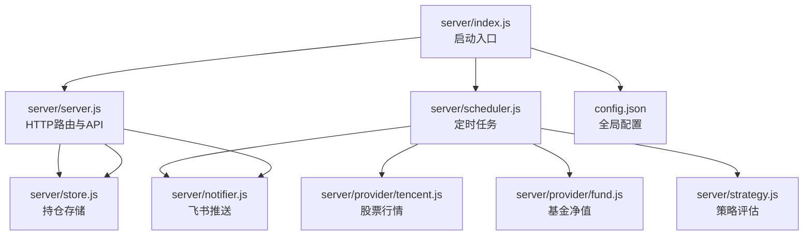
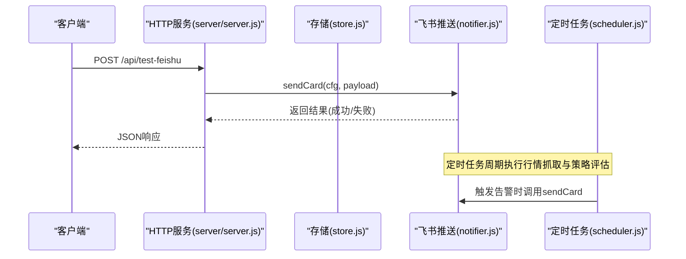
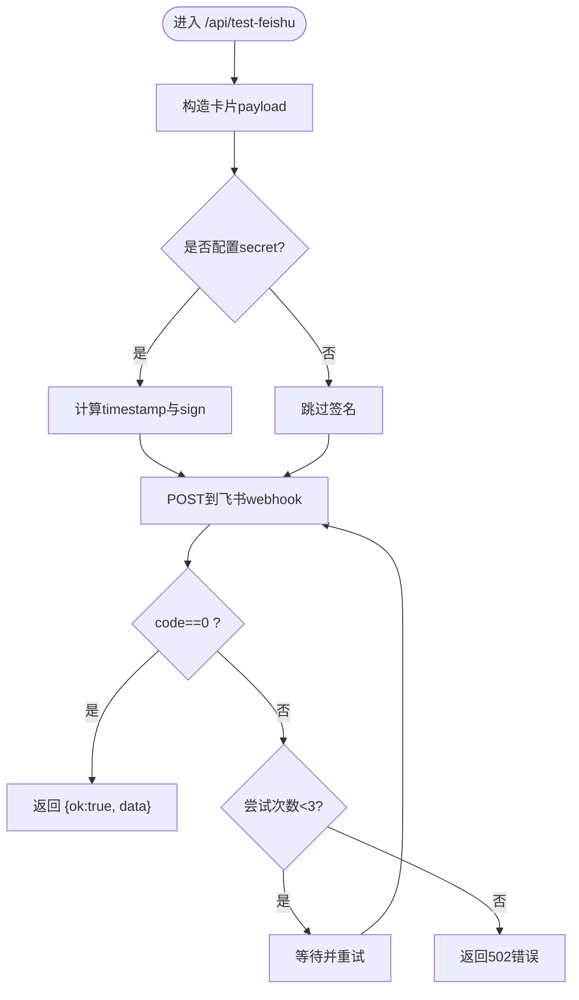
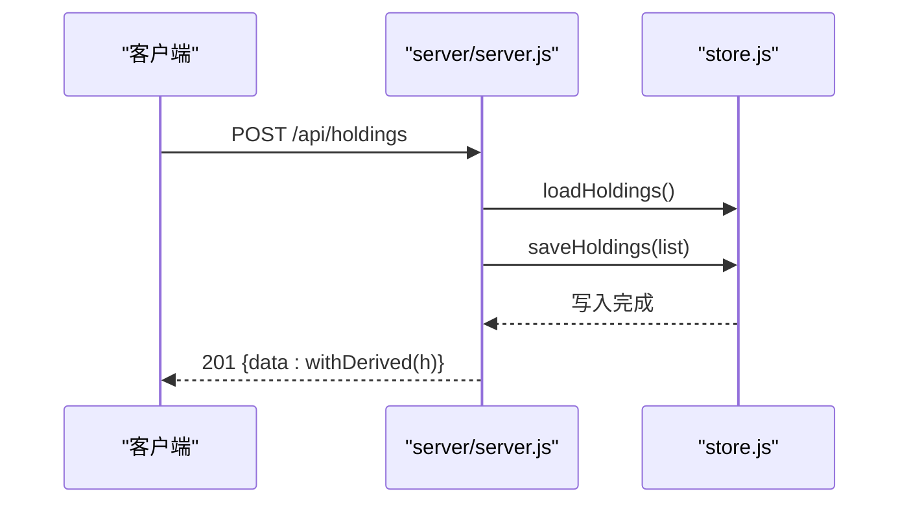
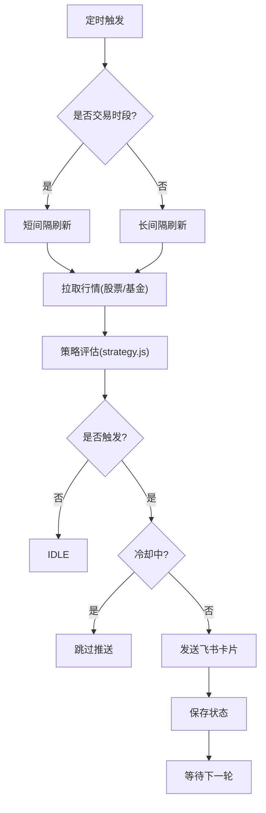
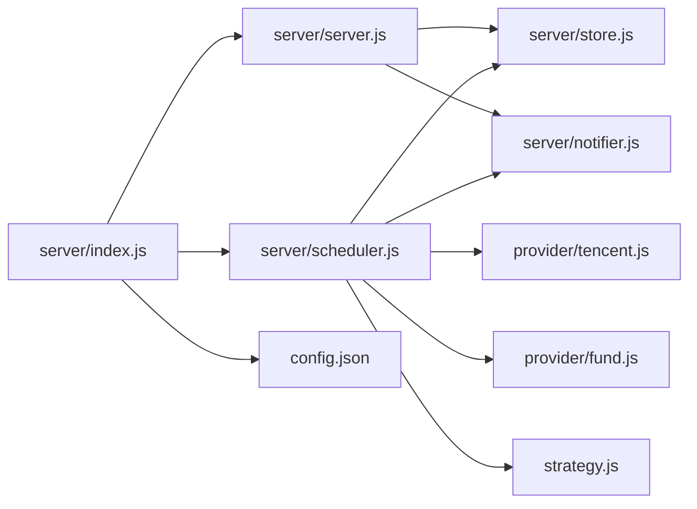

# 系统接口API

<cite>
**本文引用的文件**
- [server/index.js](file://server/index.js)
- [server/server.js](file://server/server.js)
- [server/config.js](file://server/config.js)
- [config.json](file://config.json)
- [server/notifier.js](file://server/notifier.js)
- [server/scheduler.js](file://server/scheduler.js)
- [server/store.js](file://server/store.js)
- [package.json](file://package.json)
</cite>

## 目录
1. [简介](#简介)
2. [项目结构](#项目结构)
3. [核心组件](#核心组件)
4. [架构总览](#架构总览)
5. [详细组件分析](#详细组件分析)
6. [依赖关系分析](#依赖关系分析)
7. [性能与可靠性](#性能与可靠性)
8. [故障排查指南](#故障排查指南)
9. [结论](#结论)
10. [附录：接口清单与配置示例](#附录接口清单与配置示例)

## 简介
本文件为 Stock Advisor（股票秘书）系统的接口API文档，聚焦于系统级功能接口，包括：
- 飞书机器人测试推送接口：POST /api/test-feishu
- 持仓数据管理接口：创建、查询、更新、买入/卖出记录操作、CSV导入
- 系统运行模式与调度说明（交易时段/非交易时段）
- 外部服务连接测试与错误重试策略
- 部署配置、环境变量与安全注意事项
- 监控与日志输出要点（基于控制台日志）

注意：当前代码未提供显式的健康检查或系统状态接口。如需健康检查，可在路由层新增统一入口（例如 GET /health）。

## 项目结构
后端采用 Node.js 原生 HTTP 服务，前端静态资源由 Vite 构建后托管。核心模块职责如下：
- server/index.js：应用启动入口，加载配置、启动HTTP服务与定时调度
- server/server.js：HTTP路由与业务处理（含所有 /api/* 接口）
- server/config.js：读取根目录 config.json
- server/notifier.js：飞书卡片消息构造与发送（支持签名与重试）
- server/scheduler.js：定时任务，拉取行情、评估策略、触发告警
- server/store.js：持仓数据的内存缓存与持久化读写
- config.json：服务器端口、飞书Webhook、通知冷却等配置
- package.json：脚本命令与运行环境要求

图表来源
- [server/index.js:1-17](file://server/index.js#L1-L17)
- [server/server.js:567-593](file://server/server.js#L567-L593)
- [server/scheduler.js:167-177](file://server/scheduler.js#L167-L177)
- [server/notifier.js:80-111](file://server/notifier.js#L80-L111)
- [server/store.js:40-70](file://server/store.js#L40-L70)
- [config.json:1-19](file://config.json#L1-L19)

章节来源
- [server/index.js:1-17](file://server/index.js#L1-L17)
- [server/server.js:567-593](file://server/server.js#L567-L593)
- [config.json:1-19](file://config.json#L1-L19)

## 核心组件
- HTTP服务与路由：server/server.js 暴露 /api/* 系列接口，并托管前端静态页面
- 配置加载：server/config.js 从 config.json 读取运行时参数
- 数据存储：server/store.js 提供内存缓存+磁盘持久化的并发安全读写
- 通知推送：server/notifier.js 负责飞书卡片消息构造、签名与发送（含重试）
- 定时调度：server/scheduler.js 周期性拉取行情、评估策略、触发告警与冷却控制
- 启动流程：server/index.js 加载配置、启动HTTP服务与调度器

章节来源
- [server/server.js:55-87](file://server/server.js#L55-L87)
- [server/config.js:7-10](file://server/config.js#L7-L10)
- [server/store.js:40-70](file://server/store.js#L40-L70)
- [server/notifier.js:80-111](file://server/notifier.js#L80-L111)
- [server/scheduler.js:65-177](file://server/scheduler.js#L65-L177)
- [server/index.js:1-17](file://server/index.js#L1-L17)

## 架构总览
系统以“HTTP API + 定时任务”双通道工作：
- HTTP API：用于前端交互、持仓数据管理、CSV导入、飞书测试推送
- 定时任务：按交易时段/非交易时段切换刷新频率，拉取行情、评估策略、推送告警

图表来源
- [server/server.js:545-562](file://server/server.js#L545-L562)
- [server/notifier.js:80-111](file://server/notifier.js#L80-L111)
- [server/scheduler.js:101-157](file://server/scheduler.js#L101-L157)

## 详细组件分析

### 飞书测试推送接口：POST /api/test-feishu
- 作用：发送一条测试卡片到配置的飞书机器人，验证Webhook与签名是否正确
- 请求体：无
- 响应体：
  - 成功：{ ok: true, data: <飞书API返回> }
  - 失败：{ error: "飞书推送失败：..." }，HTTP 502
- 内部流程：
  - 调用 notifier.sendCard，构造标准卡片payload
  - 若配置了 secret，自动计算时间戳与签名
  - 最多重试3次，指数退避间隔递增
- 错误处理：
  - 网络异常或飞书返回非0码会抛出错误，最终返回502
  - 建议检查 webhook 地址与 secret 配置

图表来源
- [server/server.js:545-562](file://server/server.js#L545-L562)
- [server/notifier.js:80-111](file://server/notifier.js#L80-L111)

章节来源
- [server/server.js:545-562](file://server/server.js#L545-L562)
- [server/notifier.js:80-111](file://server/notifier.js#L80-L111)

### 持仓数据管理接口
- GET /api/holdings
  - 作用：获取全部持仓列表，附带派生字段（成本、均价、盈亏、今日涨跌等）
  - 响应：{ data: [...] }
- POST /api/holdings
  - 作用：新建持仓（可包含初始买入记录）
  - 必填字段：name、code、region、type
  - 可选：purchases[]、targetProfitRate、stopLossRate、refillDropRate、refillPrice、nextStrategy、dailyDropAlertPct、dailyRiseAlertPct
  - 响应：201 + { data: withDerived(h) }
- PATCH /api/holdings/:id
  - 作用：更新持仓级字段（如日涨跌告警阈值），并重置每日告警标记
  - 响应：200 + { data: withDerived(h) }
- POST /api/holdings/:id/purchases
  - 作用：追加买入记录（补仓）
  - 字段：buyPrice、buyQuantity、buyTime/date、targetProfitRate、stopLossRate
  - 响应：200 + { data: withDerived(h) }
- PATCH /api/holdings/:id/purchases/:purchaseId
  - 作用：修改某条买入记录的字段（价格、数量、日期、止盈止损比例）
  - 响应：200 + { data: withDerived(h) }
- DELETE /api/holdings/:id/purchases/:purchaseId
  - 作用：删除某条买入记录；若无剩余买入则状态置为“已卖出”
  - 响应：200 + { data: withDerived(h) }
- POST /api/holdings/:id/transactions
  - 作用：兼容旧接口，追加买入/卖出记录（type=BUY/SELL）
  - 响应：200 + { data: withDerived(h) }
- POST /api/import-csv
  - 作用：批量导入买卖记录（按代码匹配，已有明细忽略，缺失插入）
  - 请求体：{ csv: string, createMissing?: boolean }
  - 响应：200 + { data: result }

图表来源
- [server/server.js:437-450](file://server/server.js#L437-L450)
- [server/store.js:40-70](file://server/store.js#L40-L70)

章节来源
- [server/server.js:410-564](file://server/server.js#L410-L564)
- [server/store.js:40-70](file://server/store.js#L40-L70)

### 定时任务与告警机制
- 刷新频率：
  - 交易时段：使用 schedule.intervalSeconds
  - 非交易时段：使用 schedule.offHoursIntervalSeconds
- 市场判断：根据 region 与时区判断是否在交易时段
- 数据源：
  - 股票：provider/tencent.js
  - 基金：provider/fund.js
- 策略评估：strategy.js 根据持仓与近阈值计算触发态
- 告警类型：
  - BUY/SELL（买点/卖点提醒）
  - DAILY_RISE/DAILY_DROP（日涨跌告警）
- 冷却控制：同一触发态在 cooldownSeconds 内不重复推送
- 持久化：变更时保存 holdings.json

图表来源
- [server/scheduler.js:58-63](file://server/scheduler.js#L58-L63)
- [server/scheduler.js:65-177](file://server/scheduler.js#L65-L177)

章节来源
- [server/scheduler.js:58-63](file://server/scheduler.js#L58-L63)
- [server/scheduler.js:65-177](file://server/scheduler.js#L65-L177)

### 数据存储与并发安全
- 内存缓存：首次加载或文件mtime变化时重新读盘，避免频繁IO
- 串行写盘：writeChain 保证多次写入顺序，防止覆盖
- 迁移逻辑：旧版单条买入模型自动迁移为 purchases 数组模型

章节来源
- [server/store.js:1-70](file://server/store.js#L1-L70)

### 飞书集成机制与错误重试
- 消息构造：buildCard 生成 interactive 卡片，区分日涨跌与买卖提醒
- 签名校验：若配置 secret，自动生成 timestamp 与 sign
- 重试策略：最多3次，每次等待 1s*attempt 的退避
- 错误处理：非0响应抛错，上层捕获并返回502

章节来源
- [server/notifier.js:1-111](file://server/notifier.js#L1-L111)
- [server/server.js:545-562](file://server/server.js#L545-L562)

## 依赖关系分析
- server/server.js 依赖 store.js、notifier.js、import-csv-core.js
- server/scheduler.js 依赖 store.js、provider/tencent.js、provider/fund.js、strategy.js、notifier.js
- server/index.js 聚合 config.js、scheduler.js、server.js
- config.json 提供运行时参数（端口、飞书、通知冷却）

图表来源
- [server/index.js:1-17](file://server/index.js#L1-L17)
- [server/server.js:567-593](file://server/server.js#L567-L593)
- [server/scheduler.js:1-5](file://server/scheduler.js#L1-L5)
- [config.json:1-19](file://config.json#L1-L19)

章节来源
- [server/index.js:1-17](file://server/index.js#L1-L17)
- [server/server.js:567-593](file://server/server.js#L567-L593)
- [server/scheduler.js:1-5](file://server/scheduler.js#L1-L5)
- [config.json:1-19](file://config.json#L1-L19)

## 性能与可靠性
- 刷新频率自适应：交易时段短间隔，非交易时长间隔，降低无效请求
- 并发安全：store.js 通过内存缓存与串行写盘避免竞态
- 重试与退避：notifier.js 对飞书推送进行有限重试，提升鲁棒性
- 冷启动与降级：行情拉取失败不影响其他持仓继续处理，仅记录警告
- 扩展点：
  - provider 层可扩展更多数据源
  - strategy.js 可扩展策略规则
  - notifier.js 可扩展其他通知渠道

[本节为通用性能讨论，无需特定文件引用]

## 故障排查指南
- 飞书推送失败
  - 检查 config.json 中的 feishu.webhook 与 feishu.secret
  - 使用 POST /api/test-feishu 验证连通性与签名
  - 查看服务端控制台日志，关注 [notify-daily]/[notify] 错误信息
- 行情未更新
  - 检查 scheduler 日志，确认是否处于交易时段
  - 查看 provider 拉取错误日志（stock-fetch/fund-fetch）
- 数据不一致
  - 检查 store.js 的 mtime 检测与 writeChain 是否正常工作
  - 确认是否有外部进程同时修改 holdings.json
- 端口冲突
  - 调整 config.json 的 server.port，或确保端口未被占用

章节来源
- [server/notifier.js:80-111](file://server/notifier.js#L80-L111)
- [server/scheduler.js:77-86](file://server/scheduler.js#L77-L86)
- [server/store.js:40-70](file://server/store.js#L40-L70)
- [config.json:6-13](file://config.json#L6-L13)

## 结论
Stock Advisor 提供了完整的持仓管理与飞书告警能力，接口简洁清晰，调度策略合理，具备基本的容错与重试机制。当前版本未内置健康检查接口，可按需扩展。通过合理的配置与日志观察，可实现稳定的自动化交易辅助。

[本节为总结性内容，无需特定文件引用]

## 附录：接口清单与配置示例

### 接口清单
- POST /api/test-feishu：测试飞书推送
- GET /api/holdings：获取持仓列表
- POST /api/holdings：创建持仓
- PATCH /api/holdings/:id：更新持仓级字段
- POST /api/holdings/:id/purchases：追加买入记录
- PATCH /api/holdings/:id/purchases/:purchaseId：修改买入记录
- DELETE /api/holdings/:id/purchases/:purchaseId：删除买入记录
- POST /api/holdings/:id/transactions：追加买入/卖出记录（兼容旧接口）
- POST /api/import-csv：导入CSV买卖记录

章节来源
- [server/server.js:410-564](file://server/server.js#L410-L564)

### 配置示例（config.json）
- schedule.intervalSeconds：交易时段刷新间隔（秒）
- schedule.offHoursIntervalSeconds：非交易时段刷新间隔（秒）
- server.host/server.port：服务监听地址与端口
- feishu.webhook：飞书自定义机器人Webhook地址
- feishu.secret：飞书机器人签名密钥（可选）
- notify.cooldownSeconds：告警冷却窗口（秒）
- notify.nearThresholdPct：近阈值百分比（用于策略评估）

章节来源
- [config.json:1-19](file://config.json#L1-L19)

### 环境变量与启动方式
- ONCE：设置后仅执行一次行情抓取与策略评估，然后退出
- 启动命令：参考 package.json 的 scripts
  - start：node server/index.js
  - dev：vite（开发前端）
  - build：vite build（构建前端）

章节来源
- [server/index.js:11-16](file://server/index.js#L11-L16)
- [package.json:7-14](file://package.json#L7-L14)

### 安全与部署建议
- 将 feishu.secret 替换为真实密钥，避免泄露
- 生产环境建议绑定内网或反向代理，限制公网访问
- 定期备份 data/holdings.json
- 如需健康检查，可在 server/server.js 中添加统一 /health 路由，返回服务状态与依赖连通性

[本节为通用部署建议，无需特定文件引用]