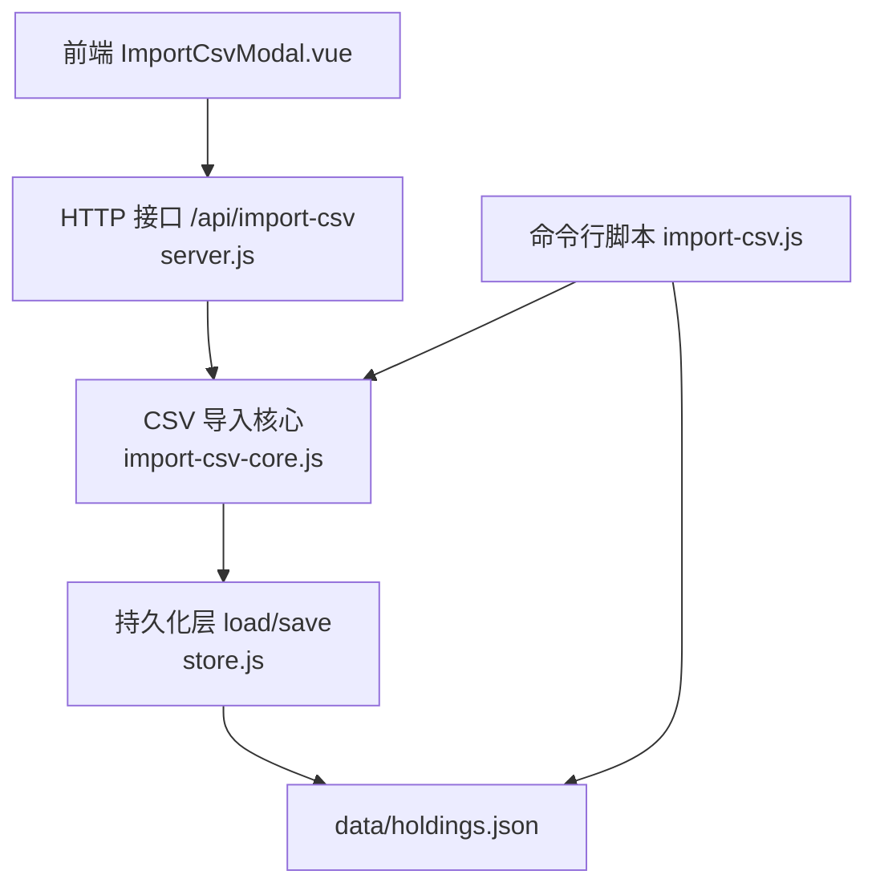
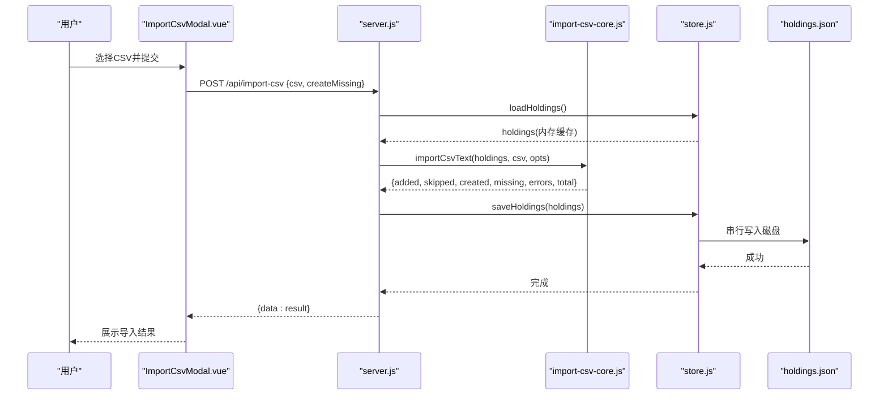
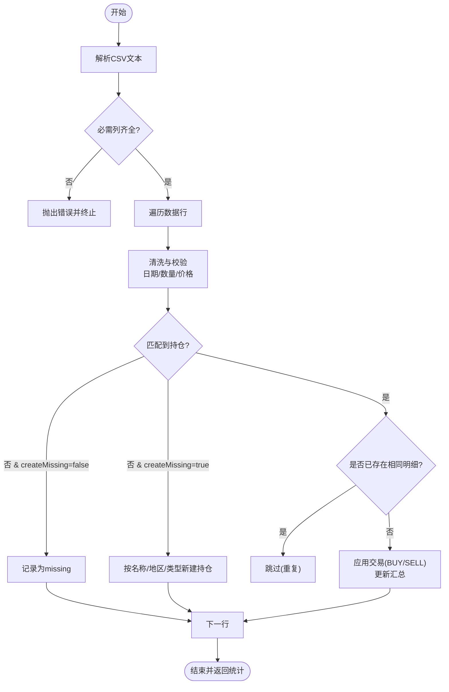
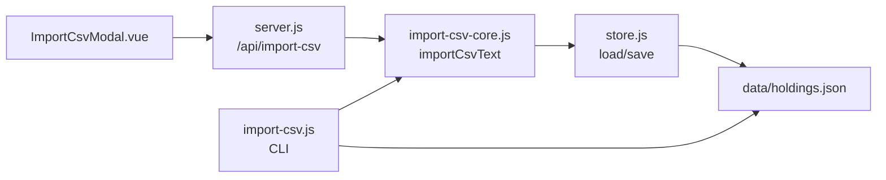

# CSV导入导出

<cite>
**本文引用的文件**
- [server/import-csv-core.js](file://server/import-csv-core.js)
- [server/import-csv.js](file://server/import-csv.js)
- [server/server.js](file://server/server.js)
- [web/src/components/ImportCsvModal.vue](file://web/src/components/ImportCsvModal.vue)
- [data/买入-卖出记录 - Sheet1.csv](file://data/买入-卖出记录 - Sheet1.csv)
- [server/store.js](file://server/store.js)
- [data/holdings.json](file://data/holdings.json)
</cite>

## 目录
1. [简介](#简介)
2. [项目结构](#项目结构)
3. [核心组件](#核心组件)
4. [架构总览](#架构总览)
5. [详细组件分析](#详细组件分析)
6. [依赖关系分析](#依赖关系分析)
7. [性能考量](#性能考量)
8. [故障排查指南](#故障排查指南)
9. [结论](#结论)
10. [附录](#附录)

## 简介
本文件围绕 Stock Advisor 的 CSV 导入导出能力，系统化说明：
- CSV 文件格式规范（列定义、数据格式、编码）
- 批量导入实现（解析、验证、幂等与事务性落盘）
- 字段映射机制（CSV 到内部模型）
- 错误处理（格式错误、数据冲突、回滚策略）
- 前端界面（文件选择、结果反馈）
- 数据清洗与转换（空值、重复项、日期标准化）
- 性能优化（内存、I/O、批处理）
- 模板示例与最佳实践

## 项目结构
CSV 导入功能由“前端交互 + HTTP API + 核心逻辑 + 持久化”四层组成：
- 前端：ImportCsvModal.vue 负责文件读取与提交、结果展示。
- 服务端：server.js 暴露 /api/import-csv 接口，调用核心逻辑并持久化。
- 核心：import-csv-core.js 提供 CSV 解析、匹配、清洗、写入持仓明细的纯函数。
- 存储：store.js 提供并发安全的加载/保存；命令行脚本 import-csv.js 用于离线批量导入。

图表来源
- [web/src/components/ImportCsvModal.vue:49-73](file://web/src/components/ImportCsvModal.vue#L49-L73)
- [server/server.js:416-435](file://server/server.js#L416-L435)
- [server/import-csv-core.js:170-306](file://server/import-csv-core.js#L170-L306)
- [server/store.js:40-70](file://server/store.js#L40-L70)
- [server/import-csv.js:37-79](file://server/import-csv.js#L37-L79)

章节来源
- [web/src/components/ImportCsvModal.vue:1-169](file://web/src/components/ImportCsvModal.vue#L1-L169)
- [server/server.js:409-435](file://server/server.js#L409-L435)
- [server/import-csv-core.js:1-307](file://server/import-csv-core.js#L1-L307)
- [server/store.js:1-71](file://server/store.js#L1-L71)
- [server/import-csv.js:1-87](file://server/import-csv.js#L1-L87)

## 核心组件
- CSV 解析与清洗：支持 BOM、引号包裹、逗号分隔；自动去除空行；日期归一化为 YYYY-MM-DD；数字字段校验。
- 代码匹配：精确匹配 holdings.code；若失败则尝试提取数字进行归一化匹配（如 hk00700 → 700）。
- 幂等插入：以 (code, 操作, 日期, 数量, 价格) 为唯一键，已存在则跳过。
- 交易处理：买入新增 purchases；卖出按 LIFO 计算成本价、盈亏与收益率，并更新持仓汇总字段。
- 可选新建持仓：当 createMissing=true 且未匹配到时，按 CSV 中的名称/地区/类型创建新持仓。
- 持久化：通过 store.js 串行写盘，避免并发覆盖。

章节来源
- [server/import-csv-core.js:7-36](file://server/import-csv-core.js#L7-L36)
- [server/import-csv-core.js:170-306](file://server/import-csv-core.js#L170-L306)
- [server/store.js:40-70](file://server/store.js#L40-L70)

## 架构总览

图表来源
- [web/src/components/ImportCsvModal.vue:49-73](file://web/src/components/ImportCsvModal.vue#L49-L73)
- [server/server.js:416-435](file://server/server.js#L416-L435)
- [server/import-csv-core.js:170-306](file://server/import-csv-core.js#L170-L306)
- [server/store.js:40-70](file://server/store.js#L40-L70)

## 详细组件分析

### CSV 文件格式规范
- 编码：UTF-8（含 BOM 时会被自动去除）。
- 分隔符：逗号；支持双引号包裹字段。
- 表头必需列：代码、操作、日期、数量、价格。系统同时兼容多别名（如“股票/基金名称/名称”、“买入日期/卖出日期/日期”等）。
- 日期格式：YYYY-MM-DD 或 YYYY/M/D 等常见形式，会被归一化为 YYYY-MM-DD。
- 数值：数量与价格必须为正数；否则该行被跳过。
- 示例参考：data/买入-卖出记录 - Sheet1.csv

章节来源
- [server/import-csv-core.js:7-23](file://server/import-csv-core.js#L7-L23)
- [server/import-csv-core.js:30-36](file://server/import-csv-core.js#L30-L36)
- [server/import-csv-core.js:175-198](file://server/import-csv-core.js#L175-L198)
- [data/买入-卖出记录 - Sheet1.csv:1-15](file://data/买入-卖出记录 - Sheet1.csv#L1-L15)

### 数据映射机制
- 列名映射：序号、股票/基金名称/名称、代码、地区、类型、操作、买入日期/卖出日期/日期、买入数量/卖出数量/数量、买入价/卖出价/价格。
- 操作映射：包含“卖”字视为卖出，否则为买入。
- 目标模型：
  - 买入：生成 purchases 条目（id、buyPrice、buyQuantity、buyTime、targetProfitRate、stopLossRate）。
  - 卖出：生成 sells 条目（sellPrice、sellQuantity、sellDate、costPrice、profit、returnRate），并按 LIFO 计算成本。
  - 同步汇总：每次写入后重新计算 cost、buyQuantity、avgCost、lastBuyPrice、targetProfitRate、stopLossRate、status 等。

章节来源
- [server/import-csv-core.js:175-209](file://server/import-csv-core.js#L175-L209)
- [server/import-csv-core.js:43-80](file://server/import-csv-core.js#L43-L80)
- [server/import-csv-core.js:82-128](file://server/import-csv-core.js#L82-L128)

### 批量导入流程与幂等
- 解析：将 CSV 文本转为二维数组，过滤空行。
- 校验：缺失必需列直接抛错；非法行（无代码/操作/日期/数量/价格或数量/价格非正）跳过。
- 匹配：先精确匹配 code，再尝试数字归一化匹配。
- 幂等：对同一持仓的相同 (日期, 数量, 价格) 的交易忽略。
- 写入：逐条写入 purchases/sells，并同步汇总；出错记录收集但不中断整体导入。
- 可选新建：createMissing=true 时，未匹配到的记录可自动创建新持仓。

图表来源
- [server/import-csv-core.js:170-306](file://server/import-csv-core.js#L170-L306)

章节来源
- [server/import-csv-core.js:170-306](file://server/import-csv-core.js#L170-L306)

### 错误处理与回滚机制
- 表头缺失：直接抛错，API 返回 400。
- 单行异常：例如卖出数量超过持仓，会捕获并加入 errors 列表，不影响其他行继续处理。
- 幂等保护：重复明细自动跳过，避免重复计数。
- 事务性：当前实现为“逐行写入+最终统一保存”，并非原子事务；若中间发生异常，可能部分写入。建议在生产环境增加快照/回滚机制或在业务层做前置校验。

章节来源
- [server/import-csv-core.js:186-188](file://server/import-csv-core.js#L186-L188)
- [server/import-csv-core.js:273-302](file://server/import-csv-core.js#L273-L302)
- [server/server.js:416-435](file://server/server.js#L416-L435)

### 前端导入界面
- 文件选择：使用 FileReader 读取 UTF-8 CSV 文本。
- 选项：支持勾选“匹配不到时自动新建持仓”。
- 提交：POST /api/import-csv，携带 csv 字符串与 createMissing 标志。
- 结果展示：新增明细数、已存在忽略数、总记录数；自动新建持仓列表；匹配不到与错误的明细清单。
- 状态控制：导入中禁用关闭按钮，防止中断。

章节来源
- [web/src/components/ImportCsvModal.vue:34-73](file://web/src/components/ImportCsvModal.vue#L34-L73)
- [web/src/components/ImportCsvModal.vue:81-169](file://web/src/components/ImportCsvModal.vue#L81-L169)

### 数据清洗与转换逻辑
- BOM 去除：确保跨平台兼容性。
- 日期归一化：统一为 YYYY-MM-DD，便于幂等比较。
- 数值校验：数量与价格必须为正，否则跳过该行。
- 代码归一化：支持前缀字母与数字混合的代码匹配。
- 汇总字段重算：每次写入后重新计算成本、均价、止盈止损加权等。

章节来源
- [server/import-csv-core.js:7-23](file://server/import-csv-core.js#L7-L23)
- [server/import-csv-core.js:25-36](file://server/import-csv-core.js#L25-L36)
- [server/import-csv-core.js:82-128](file://server/import-csv-core.js#L82-L128)

### 性能优化策略
- 流式处理：当前实现为整段文本解析，适合中小规模 CSV；超大文件建议改为流式分块解析以降低内存占用。
- 内存管理：避免在循环中创建大对象；当前已尽量复用 Map 索引提升匹配效率。
- 批量提交：当前逐行写入后统一保存；可考虑累积一定条数后再批量保存，减少 I/O 次数。
- 并发安全：store.js 使用串行写队列，避免并发覆盖。

章节来源
- [server/import-csv-core.js:212-224](file://server/import-csv-core.js#L212-L224)
- [server/store.js:61-70](file://server/store.js#L61-L70)

## 依赖关系分析

图表来源
- [web/src/components/ImportCsvModal.vue:49-73](file://web/src/components/ImportCsvModal.vue#L49-L73)
- [server/server.js:416-435](file://server/server.js#L416-L435)
- [server/import-csv-core.js:170-306](file://server/import-csv-core.js#L170-L306)
- [server/store.js:40-70](file://server/store.js#L40-L70)
- [server/import-csv.js:37-79](file://server/import-csv.js#L37-L79)

章节来源
- [server/server.js:409-435](file://server/server.js#L409-L435)
- [server/import-csv-core.js:170-306](file://server/import-csv-core.js#L170-L306)
- [server/store.js:40-70](file://server/store.js#L40-L70)
- [server/import-csv.js:37-79](file://server/import-csv.js#L37-L79)

## 性能考量
- 解析复杂度：O(N) 行扫描，Map 索引构建 O(M)，总体线性时间。
- 匹配复杂度：单次匹配近似 O(1)（Map），整体 O(N)。
- I/O 频率：当前每笔交易后仅更新内存，最终一次写盘；可通过批次聚合进一步降低写盘次数。
- 内存峰值：取决于 CSV 大小；建议对超大文件采用流式解析与分批处理。

[本节为通用性能讨论，不直接分析具体文件]

## 故障排查指南
- 表头缺少必需列：检查 CSV 是否包含“代码/操作/日期/数量/价格”或其别名。
- 数据为空或非法：确认数量与价格为正数；日期格式可接受但需能识别。
- 无法匹配持仓：核对代码是否一致；必要时启用“自动新建持仓”或修正 holdings 中的 code。
- 卖出超仓：检查买入记录是否完整；系统会记录错误明细。
- 重复导入：系统会自动跳过重复明细；如需覆盖请先清理历史数据。

章节来源
- [server/import-csv-core.js:186-198](file://server/import-csv-core.js#L186-L198)
- [server/import-csv-core.js:269-302](file://server/import-csv-core.js#L269-L302)
- [server/server.js:416-435](file://server/server.js#L416-L435)

## 结论
该 CSV 导入功能具备清晰的职责划分与稳健的数据处理流程：
- 通过纯函数实现解析、清洗、匹配与写入，易于测试与复用。
- 提供幂等保障与详细的错误报告，便于定位问题。
- 前端交互简洁直观，支持自动新建持仓与结果可视化。
- 存储层保证并发安全，适合生产环境使用。
建议在大数据量场景下引入流式解析与批量提交以提升性能，并在关键路径增加事务回滚机制以增强一致性。

[本节为总结性内容，不直接分析具体文件]

## 附录

### CSV 模板示例
- 参考文件：data/买入-卖出记录 - Sheet1.csv
- 必需列：序号、股票/基金名称/名称、代码、地区、类型、操作、买入日期/卖出日期/日期、买入数量/卖出数量/数量、买入价/卖出价/价格
- 示例行为：支持买入与卖出；日期可为 YYYY/M/D 或 YYYY-MM-DD；数量为整数或小数；价格为正数。

章节来源
- [data/买入-卖出记录 - Sheet1.csv:1-15](file://data/买入-卖出记录 - Sheet1.csv#L1-L15)

### 导入最佳实践
- 保持 CSV 编码为 UTF-8，避免特殊字符导致解析异常。
- 确保“代码”与 holdings.json 中的 code 一致；若不一致可使用数字归一化匹配。
- 首次导入建议开启“自动新建持仓”，后续可关闭以避免误建。
- 定期备份 holdings.json，以防误操作。
- 大批量导入时，先在测试环境验证，再应用到生产数据。

[本节为通用指导，不直接分析具体文件]