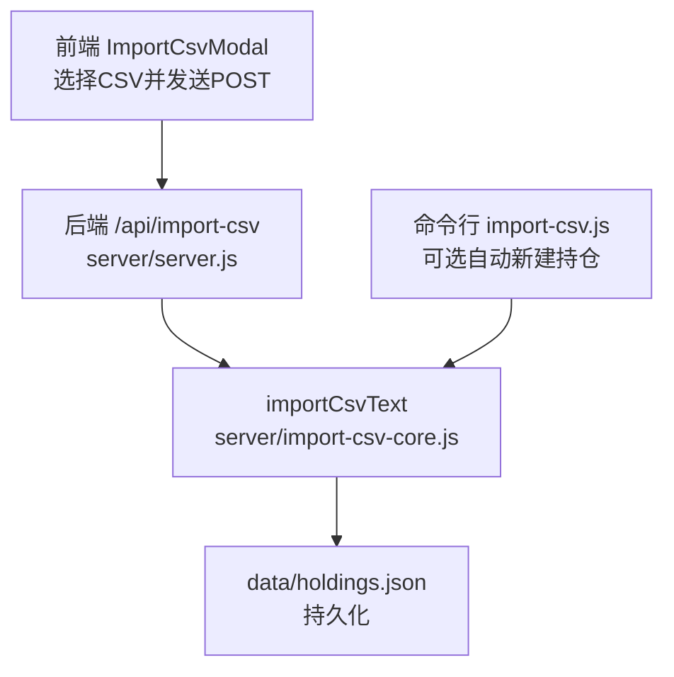
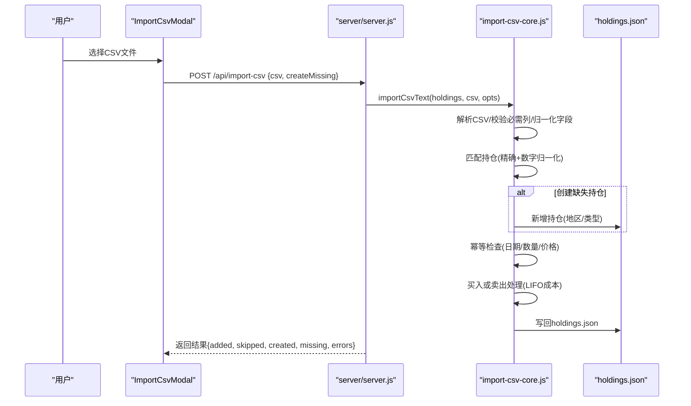
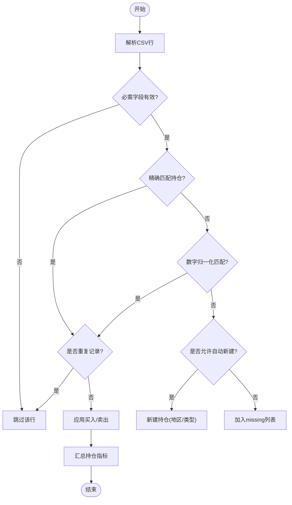
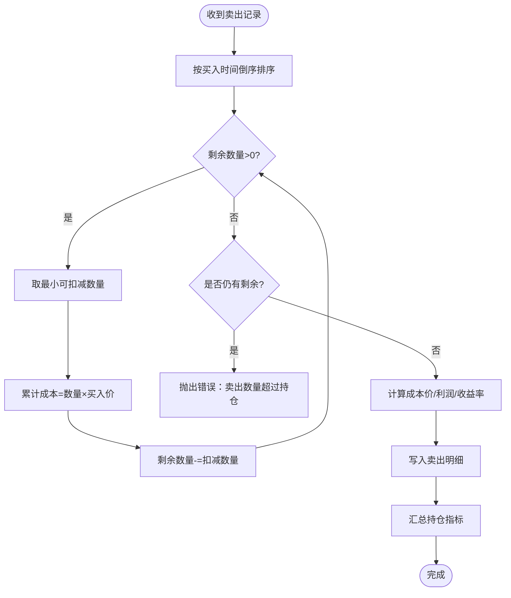
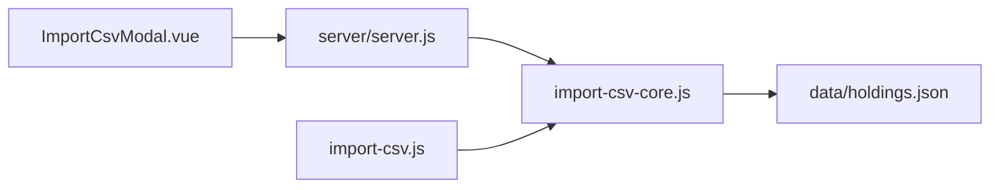

# CSV文件格式规范

<cite>
**本文引用的文件**
- [server/import-csv-core.js](file://server/import-csv-core.js)
- [server/import-csv.js](file://server/import-csv.js)
- [data/买入-卖出记录 - Sheet1.csv](file://data/买入-卖出记录 - Sheet1.csv)
- [web/src/components/ImportCsvModal.vue](file://web/src/components/ImportCsvModal.vue)
- [server/server.js](file://server/server.js)
</cite>

## 目录
1. [简介](#简介)
2. [项目结构](#项目结构)
3. [核心组件](#核心组件)
4. [架构总览](#架构总览)
5. [详细组件分析](#详细组件分析)
6. [依赖关系分析](#依赖关系分析)
7. [性能考虑](#性能考虑)
8. [故障排查指南](#故障排查指南)
9. [结论](#结论)
10. [附录](#附录)

## 简介
本规范定义 Stock Advisor 的 CSV 导入格式与处理规则，覆盖字段定义、数据格式要求、匹配算法、幂等性、错误处理及常见问题的解决方案。该规范适用于 A 股、港股、美股等不同市场的买卖记录导入。

## 项目结构
CSV 导入由前端上传、后端接口解析、核心逻辑处理并持久化到 holdings.json。关键路径如下：
- 前端：选择 CSV 文件并提交至 /api/import-csv
- 后端：接收请求，调用核心模块解析与导入
- 核心：解析 CSV、匹配持仓、写入交易明细、汇总持仓指标
- 存储：data/holdings.json

图表来源
- [web/src/components/ImportCsvModal.vue:49-73](file://web/src/components/ImportCsvModal.vue#L49-L73)
- [server/server.js:416-435](file://server/server.js#L416-L435)
- [server/import-csv-core.js:170-306](file://server/import-csv-core.js#L170-L306)
- [server/import-csv.js:37-79](file://server/import-csv.js#L37-L79)

章节来源
- [web/src/components/ImportCsvModal.vue:49-73](file://web/src/components/ImportCsvModal.vue#L49-L73)
- [server/server.js:416-435](file://server/server.js#L416-L435)
- [server/import-csv-core.js:170-306](file://server/import-csv-core.js#L170-L306)
- [server/import-csv.js:37-79](file://server/import-csv.js#L37-L79)

## 核心组件
- CSV 解析器：支持 BOM、引号包裹、逗号分隔；忽略空行
- 字段映射：识别多种列名变体（如“买入日期/卖出日期/日期”）
- 匹配引擎：精确匹配 + 数字归一化匹配
- 幂等控制：以 (代码, 操作, 日期, 数量, 价格) 为唯一键，重复记录跳过
- 交易处理：买入追加购买明细；卖出按 LIFO 计算成本并生成卖出明细
- 汇总同步：更新持仓成本、数量、状态、目标止盈/止损加权值

章节来源
- [server/import-csv-core.js:8-23](file://server/import-csv-core.js#L8-L23)
- [server/import-csv-core.js:170-306](file://server/import-csv-core.js#L170-L306)

## 架构总览
CSV 导入流程时序如下：

图表来源
- [web/src/components/ImportCsvModal.vue:49-73](file://web/src/components/ImportCsvModal.vue#L49-L73)
- [server/server.js:416-435](file://server/server.js#L416-L435)
- [server/import-csv-core.js:170-306](file://server/import-csv-core.js#L170-L306)

## 详细组件分析

### CSV 列定义与必填项
- 必需列（至少包含以下列之一）：
  - 代码：用于匹配现有持仓
  - 操作：买入或卖出（含“买/卖”字样）
  - 日期：买入日期或卖出日期（也接受“日期”）
  - 数量：买入数量或卖出数量（也接受“数量”）
  - 价格：买入价或卖出价（也接受“价格”）
- 可选列：
  - 序号：仅用于展示，不参与逻辑
  - 股票/基金名称 或 名称：用于显示和自动新建持仓时的名称
  - 地区：用于自动新建持仓时标记市场区域
  - 类型：用于自动新建持仓时标记资产类型

说明：
- 列名支持多别名，系统会优先匹配任一别名。例如“买入日期/卖出日期/日期”均可被识别为日期列。
- 若缺少任一必需列，将抛出错误并终止导入。

章节来源
- [server/import-csv-core.js:175-188](file://server/import-csv-core.js#L175-L188)
- [data/买入-卖出记录 - Sheet1.csv:1-1](file://data/买入-卖出记录 - Sheet1.csv#L1-L1)

### 数据格式要求
- 编码：UTF-8（支持 BOM）
- 日期格式：YYYY-MM-DD、YYYY/MM/DD、YYYY.MM.DD 均会被归一化为 YYYY-MM-DD；非标准格式原样保留但可能影响幂等匹配
- 数字格式：数量和价格必须为正数；非法或非正数将被跳过
- 文本：支持引号包裹字段；逗号作为分隔符；空行会被忽略

章节来源
- [server/import-csv-core.js:8-23](file://server/import-csv-core.js#L8-L23)
- [server/import-csv-core.js:31-36](file://server/import-csv-core.js#L31-L36)
- [server/import-csv-core.js:191-210](file://server/import-csv-core.js#L191-L210)

### 匹配规则与算法
- 精确匹配：CSV 代码与 holdings.code 完全一致
- 数字归一化匹配：当精确匹配失败时，提取 holdings.code 中的纯数字并与 CSV 代码的数字部分比较（例如 hk00700 → 700）
- 幂等键：以 (代码, 操作, 日期, 数量, 价格) 为唯一键，已存在则跳过
- 自动新建持仓：当未匹配到且启用 createMissing 时，按 CSV 的地区/类型新建持仓

图表来源
- [server/import-csv-core.js:212-224](file://server/import-csv-core.js#L212-L224)
- [server/import-csv-core.js:226-239](file://server/import-csv-core.js#L226-L239)
- [server/import-csv-core.js:249-303](file://server/import-csv-core.js#L249-L303)

章节来源
- [server/import-csv-core.js:212-224](file://server/import-csv-core.js#L212-L224)
- [server/import-csv-core.js:226-239](file://server/import-csv-core.js#L226-L239)
- [server/import-csv-core.js:249-303](file://server/import-csv-core.js#L249-L303)

### 交易处理与成本计算
- 买入：追加购买明细，记录买入价、数量、时间，继承持仓的目标止盈/止损比率
- 卖出：按最近买入先出（LIFO）原则计算成本价、利润与收益率；若卖出数量超过持仓数量则报错
- 汇总：根据买入与卖出明细重新计算持仓成本、剩余数量、平均成本、状态（持有/全部卖出）、目标止盈/止损加权值

图表来源
- [server/import-csv-core.js:60-80](file://server/import-csv-core.js#L60-L80)
- [server/import-csv-core.js:285-297](file://server/import-csv-core.js#L285-L297)

章节来源
- [server/import-csv-core.js:60-80](file://server/import-csv-core.js#L60-L80)
- [server/import-csv-core.js:285-297](file://server/import-csv-core.js#L285-L297)

### 完整 CSV 模板示例
以下为基于仓库中示例文件的模板结构，适用于 A 股、港股、美股等多市场：

- 表头（顺序可调整，但需包含必需列）：
  - 序号, 股票/基金名称, 代码, 地区, 类型, 操作, 买入日期, 买入数量, 买入价
- 数据行示例（不同市场）：
  - 港股：小米集团-W, 1810, 港股, 买入, 2026/5/5, 1400, 30.7
  - 港股：南方海力士ETF, 07709, 港股, 卖出, 2026/8/5, 100, 38.76
  - 美股：SK海力士, SKHY, 美股, 买入, 2026/8/13, 9, 167.72

注意：
- “买入日期/卖出日期/日期”三选一即可；“买入数量/卖出数量/数量”三选一；“买入价/卖出价/价格”三选一
- 空行会被忽略；BOM 会被去除；引号包裹字段可包含逗号

章节来源
- [data/买入-卖出记录 - Sheet1.csv:1-15](file://data/买入-卖出记录 - Sheet1.csv#L1-L15)
- [server/import-csv-core.js:175-188](file://server/import-csv-core.js#L175-L188)
- [server/import-csv-core.js:191-210](file://server/import-csv-core.js#L191-L210)

### 字段验证规则与错误处理
- 必需列校验：缺少任一必需列将抛出错误并中止导入
- 数值校验：数量与价格必须为正数；否则该行被跳过
- 卖出超仓：卖出数量超过可用持仓数量将抛出错误
- 幂等重复：相同 (代码, 操作, 日期, 数量, 价格) 的记录将被跳过
- 自动新建：未匹配到持仓且未启用自动新建时，记录进入 missing 列表

错误输出：
- 控制台或前端界面会显示成功导入条数、重复跳过条数、自动新建持仓数量、匹配不到持仓记录、导入出错记录及原因

章节来源
- [server/import-csv-core.js:175-188](file://server/import-csv-core.js#L175-L188)
- [server/import-csv-core.js:191-210](file://server/import-csv-core.js#L191-L210)
- [server/import-csv-core.js:226-239](file://server/import-csv-core.js#L226-L239)
- [server/import-csv-core.js:285-303](file://server/import-csv-core.js#L285-L303)
- [server/import-csv.js:54-79](file://server/import-csv.js#L54-L79)
- [web/src/components/ImportCsvModal.vue:119-160](file://web/src/components/ImportCsvModal.vue#L119-L160)

### 常见格式错误与解决方案
- 缺少必需列：确保包含“代码/操作/日期/数量/价格”任一组合列
- 日期格式不规范：建议使用 YYYY-MM-DD；其他格式可能被归一化或保留原样导致幂等不一致
- 数量为负或零：修正为正数
- 价格为负或零：修正为正数
- 重复导入：系统会自动跳过重复记录；如需覆盖请清理历史或调整日期/数量/价格
- 无法匹配持仓：确认 holdings.code 与 CSV 代码一致；或使用“数字归一化匹配”；或启用“自动新建持仓”
- 卖出超仓：检查买入记录与卖出数量；确保卖出数量不超过可用持仓

章节来源
- [server/import-csv-core.js:175-188](file://server/import-csv-core.js#L175-L188)
- [server/import-csv-core.js:191-210](file://server/import-csv-core.js#L191-L210)
- [server/import-csv-core.js:226-239](file://server/import-csv-core.js#L226-L239)
- [server/import-csv-core.js:285-303](file://server/import-csv-core.js#L285-L303)

## 依赖关系分析
- 前端 ImportCsvModal 通过 POST /api/import-csv 提交 CSV 文本与选项
- 后端 server/server.js 路由到 importCsvText 核心函数
- 核心函数 import-csv-core.js 负责解析、匹配、写入与汇总
- 命令行脚本 import-csv.js 提供批处理方式，支持 --create-missing

图表来源
- [web/src/components/ImportCsvModal.vue:49-73](file://web/src/components/ImportCsvModal.vue#L49-L73)
- [server/server.js:416-435](file://server/server.js#L416-L435)
- [server/import-csv-core.js:170-306](file://server/import-csv-core.js#L170-L306)
- [server/import-csv.js:37-79](file://server/import-csv.js#L37-L79)

章节来源
- [web/src/components/ImportCsvModal.vue:49-73](file://web/src/components/ImportCsvModal.vue#L49-L73)
- [server/server.js:416-435](file://server/server.js#L416-L435)
- [server/import-csv-core.js:170-306](file://server/import-csv-core.js#L170-L306)
- [server/import-csv.js:37-79](file://server/import-csv.js#L37-L79)

## 性能考虑
- 解析复杂度：逐行扫描 CSV，时间复杂度 O(N)，N 为行数
- 匹配复杂度：建立精确与数字归一化映射，查找近似 O(1)
- 幂等检查：对每条记录的 purchases/sells 进行线性扫描，最坏 O(M)，M 为已有明细数
- 建议：
  - 控制单次导入行数，避免超大 CSV
  - 使用标准日期格式以减少归一化开销
  - 批量导入前清洗数据，减少无效行

[本节为通用指导，不直接分析具体文件]

## 故障排查指南
- 导入失败（缺少 csv 内容）：检查前端是否正确传递 csv 字符串
- 表头缺少必需列：核对 CSV 表头是否包含“代码/操作/日期/数量/价格”任一组合
- 重复导入未生效：确认幂等键（日期/数量/价格）是否与已有记录一致
- 卖出超仓：检查买入记录与卖出数量；必要时先补充买入再卖出
- 自动新建未生效：确认是否勾选“自动新建持仓”；检查地区/类型字段是否填写

章节来源
- [server/server.js:416-435](file://server/server.js#L416-L435)
- [server/import-csv-core.js:175-188](file://server/import-csv-core.js#L175-L188)
- [server/import-csv-core.js:285-303](file://server/import-csv-core.js#L285-L303)
- [web/src/components/ImportCsvModal.vue:98-108](file://web/src/components/ImportCsvModal.vue#L98-L108)

## 结论
本规范明确了 Stock Advisor 的 CSV 导入格式、字段要求、数据格式、匹配算法与错误处理机制。遵循本规范可确保跨市场（A 股、港股、美股）的买卖记录稳定导入，并保持持仓数据的准确性与一致性。

## 附录
- 命令行用法：
  - node server/import-csv.js：默认导入 data/买入-卖出记录 - Sheet1.csv
  - node server/import-csv.js <csv路径>：导入指定 CSV
  - node server/import-csv.js --create-missing：匹配不到时自动新建持仓

章节来源
- [server/import-csv.js:3-12](file://server/import-csv.js#L3-L12)
- [server/import-csv.js:37-79](file://server/import-csv.js#L37-L79)