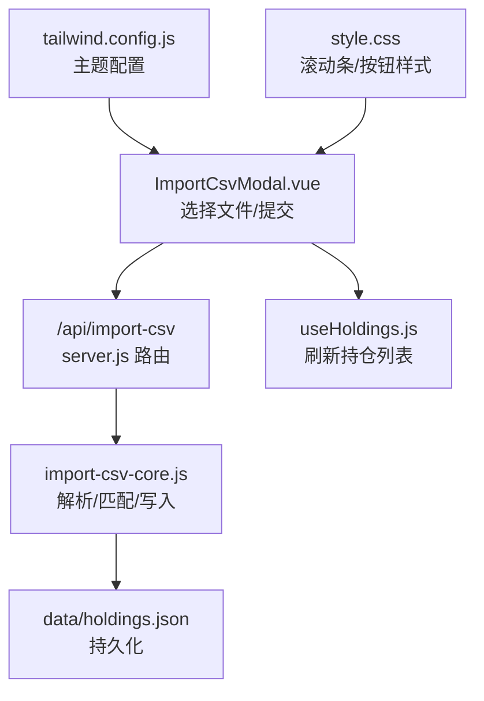
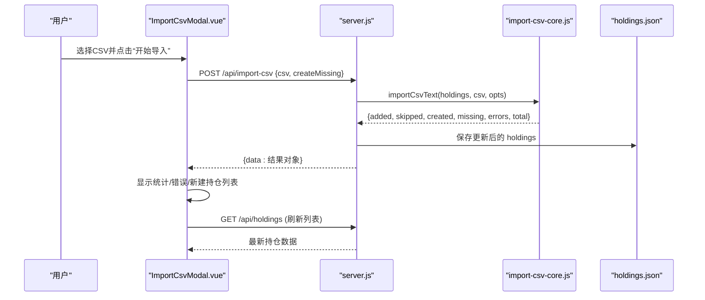
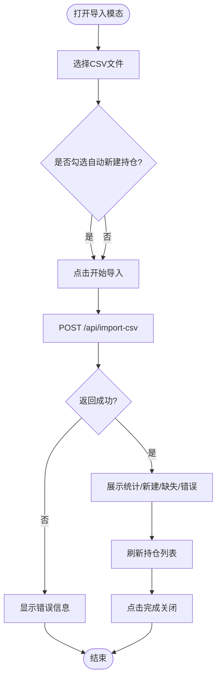
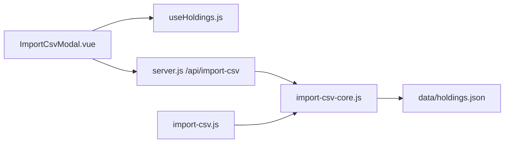

# 前端导入界面

<cite>
**本文引用的文件**
- [ImportCsvModal.vue](file://web/src/components/ImportCsvModal.vue)
- [useHoldings.js](file://web/src/composables/useHoldings.js)
- [server.js](file://server/server.js)
- [import-csv-core.js](file://server/import-csv-core.js)
- [import-csv.js](file://server/import-csv.js)
- [买入-卖出记录 - Sheet1.csv](file://data/买入-卖出记录 - Sheet1.csv)
- [style.css](file://web/src/style.css)
- [tailwind.config.js](file://tailwind.config.js)
</cite>

## 目录
1. [简介](#简介)
2. [项目结构](#项目结构)
3. [核心组件](#核心组件)
4. [架构总览](#架构总览)
5. [详细组件分析](#详细组件分析)
6. [依赖关系分析](#依赖关系分析)
7. [性能与可用性考量](#性能与可用性考量)
8. [故障排查指南](#故障排查指南)
9. [结论](#结论)
10. [附录：CSV 格式与字段说明](#附录csv-格式与字段说明)

## 简介
本用户文档面向使用 Stock Advisor 的投资者，详细说明“CSV 导入”模态界面的使用方法、交互流程、数据验证与错误提示、响应式与主题适配、以及无障碍访问支持。通过该界面，您可以将券商导出的买卖记录 CSV 批量导入到持仓系统中，系统会按代码匹配现有持仓并幂等插入明细，同时提供自动新建持仓、错误汇总与结果统计等能力。

## 项目结构
前端导入功能由 Vue 组件 ImportCsvModal 驱动，调用后端 /api/import-csv 接口完成解析与落盘；后端核心逻辑集中在 import-csv-core.js，命令行脚本 import-csv.js 复用同一核心。样式基于 Tailwind + DaisyUI，支持明暗主题切换。

图表来源
- [ImportCsvModal.vue:49-78](file://web/src/components/ImportCsvModal.vue#L49-L78)
- [server.js:416-435](file://server/server.js#L416-L435)
- [import-csv-core.js:170-306](file://server/import-csv-core.js#L170-L306)
- [useHoldings.js:15-29](file://web/src/composables/useHoldings.js#L15-L29)
- [tailwind.config.js:13-52](file://tailwind.config.js#L13-L52)
- [style.css:24-33](file://web/src/style.css#L24-L33)

章节来源
- [ImportCsvModal.vue:1-169](file://web/src/components/ImportCsvModal.vue#L1-L169)
- [server.js:416-435](file://server/server.js#L416-L435)
- [import-csv-core.js:170-306](file://server/import-csv-core.js#L170-L306)
- [tailwind.config.js:13-52](file://tailwind.config.js#L13-L52)
- [style.css:24-33](file://web/src/style.css#L24-L33)

## 核心组件
- ImportCsvModal.vue：负责文件选择、状态管理、提交请求、结果展示与关闭控制。
- useHoldings.js：统一获取/刷新持仓数据，导入完成后触发列表刷新。
- server.js：HTTP 路由处理 /api/import-csv，读取请求体并调用核心模块。
- import-csv-core.js：CSV 解析、列映射、匹配规则、幂等去重、新增/跳过/错误统计、自动新建持仓。
- import-csv.js：命令行工具，复用核心逻辑，便于离线批量导入。
- tailwind.config.js：定义 stocklight/stockdark 两套主题，配合 darkMode 实现明暗切换。
- style.css：全局样式增强（滚动条、按钮文字等）。

章节来源
- [ImportCsvModal.vue:1-169](file://web/src/components/ImportCsvModal.vue#L1-L169)
- [useHoldings.js:1-154](file://web/src/composables/useHoldings.js#L1-L154)
- [server.js:416-435](file://server/server.js#L416-L435)
- [import-csv-core.js:1-307](file://server/import-csv-core.js#L1-L307)
- [import-csv.js:1-87](file://server/import-csv.js#L1-L87)
- [tailwind.config.js:1-54](file://tailwind.config.js#L1-L54)
- [style.css:1-34](file://web/src/style.css#L1-L34)

## 架构总览
下图展示了从用户点击“开始导入”到数据落盘的完整调用链。

图表来源
- [ImportCsvModal.vue:49-78](file://web/src/components/ImportCsvModal.vue#L49-L78)
- [server.js:416-435](file://server/server.js#L416-L435)
- [import-csv-core.js:170-306](file://server/import-csv-core.js#L170-L306)

## 详细组件分析

### 导入模态框 UI 设计
- 文件选择区域：虚线边框拖拽区，点击可唤起文件选择器，仅接受 .csv/text/csv；选中后显示文件名。
- 选项：勾选“匹配不到现有持仓时自动新建持仓”，用于在找不到对应 code 时创建新持仓。
- 规则提示：明确“已存在相同明细（日期/数量/价格）的记录会忽略”。
- 操作按钮：取消与“开始导入”（导入中禁用），避免重复提交。
- 结果面板：
  - 新增明细、已存在忽略、CSV 总记录三块统计卡片。
  - 自动新建持仓列表（名称+代码）。
  - 匹配不到持仓的明细清单（含操作类型、日期、数量、价格）。
  - 导入出错明细清单（错误消息+记录定位）。
- 关闭行为：导入进行中禁止关闭，防止中断。

章节来源
- [ImportCsvModal.vue:81-168](file://web/src/components/ImportCsvModal.vue#L81-L168)

### 用户交互流程（从选择到完成）
1. 打开导入模态框。
2. 点击文件选择区或隐藏 input[type=file]，选择 CSV 文件。
3. 可选：勾选“自动新建持仓”。
4. 点击“开始导入”，进入 loading 状态，按钮禁用。
5. 前端发送 POST /api/import-csv，携带 CSV 文本与选项。
6. 后端解析、匹配、写入 holdings.json，返回统计结果。
7. 前端展示结果面板，并刷新持仓列表。
8. 点击“完成”关闭模态框。

图表来源
- [ImportCsvModal.vue:34-78](file://web/src/components/ImportCsvModal.vue#L34-L78)
- [server.js:416-435](file://server/server.js#L416-L435)

章节来源
- [ImportCsvModal.vue:34-78](file://web/src/components/ImportCsvModal.vue#L34-L78)
- [server.js:416-435](file://server/server.js#L416-L435)

### 实时预览与数据验证
- 当前实现为“提交后反馈”，并非逐行实时预览。选择文件后会立即读取文本内容，但校验与导入发生在提交阶段。
- 服务器端校验要点：
  - 必需列：代码、操作、日期、数量、价格（支持多种别名）。
  - 数值校验：数量与价格必须为正数。
  - 日期归一化：YYYY-MM-DD 格式，保证幂等匹配。
  - 唯一键：(code, 操作, 日期, 数量, 价格) 作为幂等键，重复记录会被跳过。
  - 卖出成本计算：按 LIFO 匹配最近买入成本，若卖出数量超过持仓则报错。
- 前端错误提示：
  - 未选择文件时提示“请先选择 CSV 文件”。
  - 网络或后端错误时，在模态框内以错误样式显示具体消息。
- 修改建议：
  - 确保 CSV 包含必需列且命名符合支持别名。
  - 检查日期格式、数量为正数。
  - 若出现“匹配不到持仓”，可勾选“自动新建持仓”或手动先创建持仓。

章节来源
- [import-csv-core.js:170-306](file://server/import-csv-core.js#L170-L306)
- [ImportCsvModal.vue:49-78](file://web/src/components/ImportCsvModal.vue#L49-L78)

### 响应式设计
- 模态框容器最大宽度限制，适配桌面与平板。
- 统计卡片采用网格布局，在小屏下自动换行。
- 长列表（缺失/错误明细）设置最大高度并允许滚动，避免遮挡。
- 整体样式基于 Tailwind/DaisyUI，具备移动端友好的间距与排版。

章节来源
- [ImportCsvModal.vue:121-163](file://web/src/components/ImportCsvModal.vue#L121-L163)

### 无障碍访问支持
- 模态框使用原生 <dialog>，浏览器默认提供焦点管理与 ESC 关闭等行为。
- 文件选择通过 label 包裹 input[type=file]，提升键盘可达性。
- 按钮与输入控件具备语义化标签，利于屏幕阅读器识别。
- 建议在后续迭代中补充 aria-* 属性（如 aria-live 用于结果区域动态播报），进一步提升可访问性。

章节来源
- [ImportCsvModal.vue:81-168](file://web/src/components/ImportCsvModal.vue#L81-L168)

### 错误处理与用户反馈机制
- 前端：
  - 空文件检测：提交前校验，失败时显示错误提示。
  - 网络/后端异常：捕获错误并在模态框中以错误样式展示。
  - 导入中禁用关闭与提交，避免并发问题。
- 后端：
  - 缺少 csv 内容：返回 400 与错误消息。
  - 表头缺失必需列：抛出错误并返回给前端。
  - 业务错误（如卖出超仓）：记录到 errors 数组并返回统计。
- 用户可见：
  - 结果面板中的“导入出错”区块列出每条错误及对应记录定位，便于修正。

章节来源
- [ImportCsvModal.vue:49-78](file://web/src/components/ImportCsvModal.vue#L49-L78)
- [server.js:416-435](file://server/server.js#L416-L435)
- [import-csv-core.js:170-306](file://server/import-csv-core.js#L170-L306)

### 界面定制与主题适配
- 主题：Tailwind 启用 class 模式，DaisyUI 配置 stocklight（浅色）与 stockdark（深色）两套主题，随 <html class="dark"> 自动切换。
- 样式增强：
  - 自定义滚动条样式，贴合主题色。
  - 按钮文字统一白色，非主色调按钮增加背景以保证对比度。
- 扩展建议：可在 tailwind.config.js 中新增主题色板，或在 ImportCsvModal.vue 中根据主题调整文案与配色。

章节来源
- [tailwind.config.js:13-52](file://tailwind.config.js#L13-L52)
- [style.css:11-33](file://web/src/style.css#L11-L33)
- [ImportCsvModal.vue:81-168](file://web/src/components/ImportCsvModal.vue#L81-L168)

## 依赖关系分析
- ImportCsvModal.vue 依赖 useHoldings.js 刷新持仓列表。
- server.js 路由 /api/import-csv 依赖 import-csv-core.js 的核心解析与写入逻辑。
- import-csv.js 命令行脚本同样依赖 import-csv-core.js，保证前后端一致的行为。
- 数据持久化目标为 data/holdings.json。

图表来源
- [ImportCsvModal.vue:49-78](file://web/src/components/ImportCsvModal.vue#L49-L78)
- [useHoldings.js:15-29](file://web/src/composables/useHoldings.js#L15-L29)
- [server.js:416-435](file://server/server.js#L416-L435)
- [import-csv-core.js:170-306](file://server/import-csv-core.js#L170-L306)
- [import-csv.js:17-49](file://server/import-csv.js#L17-L49)

章节来源
- [ImportCsvModal.vue:1-169](file://web/src/components/ImportCsvModal.vue#L1-L169)
- [useHoldings.js:1-154](file://web/src/composables/useHoldings.js#L1-L154)
- [server.js:416-435](file://server/server.js#L416-L435)
- [import-csv-core.js:1-307](file://server/import-csv-core.js#L1-L307)
- [import-csv.js:1-87](file://server/import-csv.js#L1-L87)

## 性能与可用性考量
- 解析复杂度：CSV 解析为 O(N)，匹配与写入为 O(M+N) 级别（N 为记录数，M 为持仓数），适合中小规模数据。
- 幂等设计：重复导入不会重复插入，保障多次执行的安全性。
- 前端交互：导入期间禁用按钮与关闭，避免重复提交与状态不一致。
- 列表渲染：结果面板对长列表限制高度并滚动，减少 DOM 压力。
- 主题与可读性：高对比度颜色与统一的按钮样式，提升可读性与一致性。

[本节为通用指导，不直接分析具体文件]

## 故障排查指南
- 无法选择文件或无响应：
  - 确认浏览器允许文件选择，且文件格式为 .csv。
  - 检查控制台是否有跨域或网络错误。
- 提示“缺少 csv 内容”：
  - 确认已成功选择文件并读取文本。
- 表头错误或缺失列：
  - 确保 CSV 包含必需列：代码、操作、日期、数量、价格（支持别名）。
  - 参考示例 CSV 的列名与顺序。
- 匹配不到持仓：
  - 勾选“自动新建持仓”后再导入，或先在系统中创建对应持仓。
- 卖出数量超过持仓：
  - 检查卖出记录的数量与历史买入总量是否匹配。
- 导入后列表未更新：
  - 等待自动刷新或手动刷新页面；确认 /api/holdings 可正常访问。

章节来源
- [ImportCsvModal.vue:49-78](file://web/src/components/ImportCsvModal.vue#L49-L78)
- [server.js:416-435](file://server/server.js#L416-L435)
- [import-csv-core.js:170-306](file://server/import-csv-core.js#L170-L306)

## 结论
Stock Advisor 的前端 CSV 导入界面提供了直观的文件选择、清晰的规则提示、完整的导入结果反馈与错误定位，并通过后端核心模块保证了幂等与一致性。结合响应式设计与主题适配，能够在多设备上获得良好体验。建议后续增强实时预览与无障碍属性，以提升易用性与可访问性。

[本节为总结，不直接分析具体文件]

## 附录：CSV 格式与字段说明
- 推荐列名（支持别名）：
  - 序号、股票/基金名称、代码、地区、类型、操作、买入日期/卖出日期/日期、买入数量/卖出数量/数量、买入价/卖出价/价格。
- 示例文件：data/买入-卖出记录 - Sheet1.csv
- 注意事项：
  - 日期将被归一化为 YYYY-MM-DD。
  - 数量与价格必须为正数。
  - 重复记录（相同 code、操作、日期、数量、价格）会被忽略。
  - 若未匹配到持仓且未勾选“自动新建持仓”，该记录将出现在“匹配不到持仓”列表中。

章节来源
- [买入-卖出记录 - Sheet1.csv:1-26](file://data/买入-卖出记录 - Sheet1.csv#L1-L26)
- [import-csv-core.js:170-306](file://server/import-csv-core.js#L170-L306)