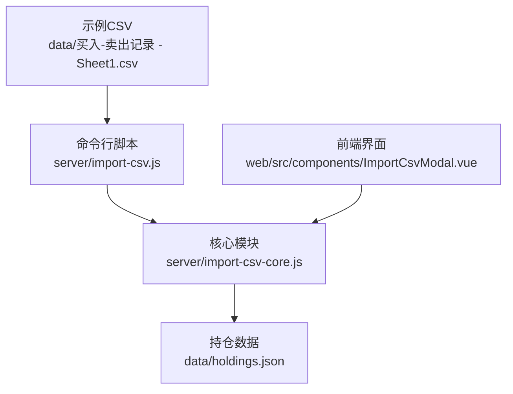
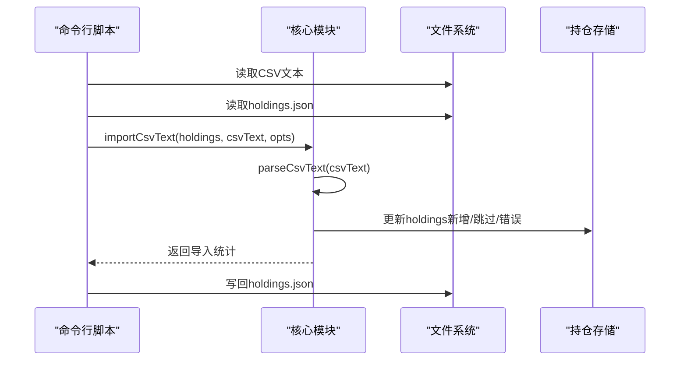
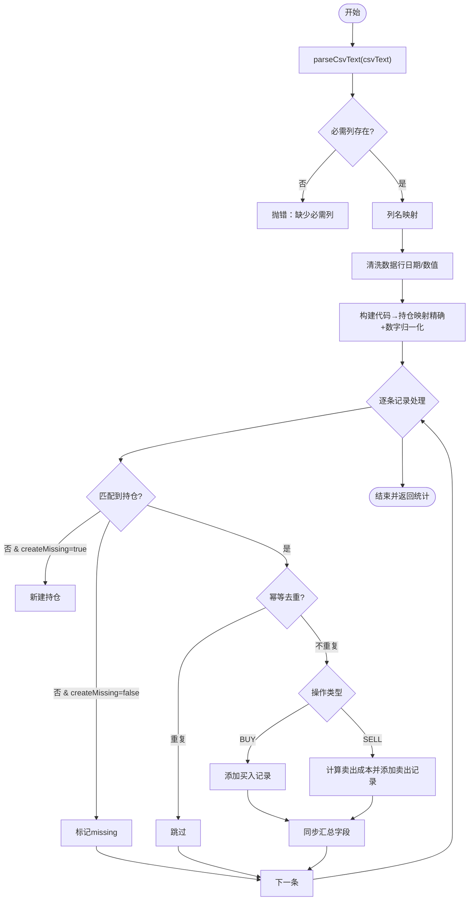
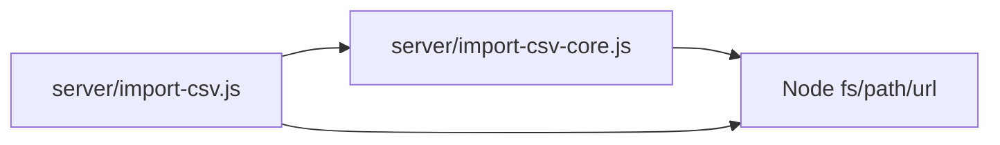

# CSV解析引擎

<cite>
**本文引用的文件**
- [server/import-csv-core.js](file://server/import-csv-core.js)
- [server/import-csv.js](file://server/import-csv.js)
- [data/买入-卖出记录 - Sheet1.csv](file://data/买入-卖出记录 - Sheet1.csv)
- [web/src/components/ImportCsvModal.vue](file://web/src/components/ImportCsvModal.vue)
</cite>

## 目录
1. [简介](#简介)
2. [项目结构](#项目结构)
3. [核心组件](#核心组件)
4. [架构总览](#架构总览)
5. [详细组件分析](#详细组件分析)
6. [依赖关系分析](#依赖关系分析)
7. [性能考量](#性能考量)
8. [故障排查指南](#故障排查指南)
9. [结论](#结论)
10. [附录：CSV格式规范与最佳实践](#附录csv格式规范与最佳实践)

## 简介
本技术文档聚焦Stock Advisor中的CSV解析与导入能力，重点深入解析parseCsvText函数的实现原理，涵盖BOM头处理、引号包裹字段解析、逗号分隔符识别与换行符处理；并系统说明CSV格式支持特性（特殊字符转义、空值处理、编码兼容性）、解析性能优化策略（流式处理、内存管理与大文件支持）、错误处理机制（格式验证、异常捕获与错误报告），以及CSV格式规范与最佳实践。

## 项目结构
本项目将CSV解析与导入逻辑拆分为可复用模块与命令行脚本：
- server/import-csv-core.js：提供CSV文本解析与导入的核心函数（如parseCsvText、importCsvText）及数据归一化、幂等去重、成本计算等逻辑。
- server/import-csv.js：命令行入口，负责读取CSV与holdings.json，调用核心模块执行导入并输出统计信息。
- data/买入-卖出记录 - Sheet1.csv：示例CSV数据，包含表头与多行交易记录。
- web/src/components/ImportCsvModal.vue：前端导入结果展示（错误列表等）。



图表来源
- [server/import-csv.js:14-52](file://server/import-csv.js#L14-L52)
- [server/import-csv-core.js:7-23](file://server/import-csv-core.js#L7-L23)
- [data/买入-卖出记录 - Sheet1.csv:1-15](file://data/买入-卖出记录 - Sheet1.csv#L1-L15)

章节来源
- [server/import-csv.js:14-52](file://server/import-csv.js#L14-L52)
- [server/import-csv-core.js:7-23](file://server/import-csv-core.js#L7-L23)
- [data/买入-卖出记录 - Sheet1.csv:1-15](file://data/买入-卖出记录 - Sheet1.csv#L1-L15)

## 核心组件
- parseCsvText(text)：解析CSV文本为二维数组，支持BOM头去除、按行分割（兼容\r\n与\n）、忽略空白行、基于双引号的字段边界识别与逗号分隔。
- importCsvText(holdings, csvText, opts)：将CSV文本导入到现有holdings数组中，支持列名映射、必需列校验、日期归一化、代码匹配（精确与数字归一化）、幂等去重、可选自动新建持仓、错误收集与汇总返回。

章节来源
- [server/import-csv-core.js:7-23](file://server/import-csv-core.js#L7-L23)
- [server/import-csv-core.js:170-306](file://server/import-csv-core.js#L170-L306)

## 架构总览
CSV导入的整体流程如下：
- 命令行脚本读取CSV文本与holdings.json。
- 调用核心模块的importCsvText进行解析与导入。
- 核心模块内部先通过parseCsvText将文本转为二维数组，再进行列索引映射、数据清洗、匹配与写入。
- 最终写回holdings.json并输出导入统计。



图表来源
- [server/import-csv.js:47-52](file://server/import-csv.js#L47-L52)
- [server/import-csv-core.js:170-306](file://server/import-csv-core.js#L170-L306)

## 详细组件分析

### parseCsvText函数深度解析
- BOM头处理：在解析前移除UTF-8 BOM（\uFEFF），确保首行表头不被污染。
- 换行符处理：使用正则按\r?\n分割，兼容Windows与Unix换行；随后过滤空白行，避免空记录进入后续处理。
- 引号包裹字段解析：采用状态机方式遍历字符，遇到双引号切换inQuotes标志，用于判断当前是否处于引用字段内；仅在非引用状态下遇到逗号才作为分隔符。
- 逗号分隔符识别：仅当不在引号内时，逗号被视为字段分隔符；否则逗号作为字段内容的一部分保留。
- 返回值：二维数组，每行对应一个字段数组。

```mermaid
flowchart TD
Start(["开始"]) --> RemoveBOM["去除BOM头"]
RemoveBOM --> SplitLines["按\\r?\\n分割行"]
SplitLines --> FilterEmpty["过滤空白行"]
FilterEmpty --> ForEachLine{"逐行解析"}
ForEachLine --> InitState["初始化cur='' inQuotes=false"]
InitState --> ForEachChar{"逐字符处理"}
ForEachChar --> IsQuote{"是否为\"?"}
IsQuote --> |是| ToggleQuotes["切换inQuotes"] --> NextChar["继续下一字符"]
IsQuote --> |否| IsComma{"是否为','且不在引号内?"}
IsComma --> |是| PushField["push(cur)并重置cur"] --> NextChar
IsComma --> |否| AppendChar["cur+=ch"] --> NextChar
NextChar --> ForEachChar
ForEachChar --> EndOfLine{"行结束?"}
EndOfLine --> |是| PushLast["push(cur)"] --> NextLine["下一行"]
EndOfLine --> |否| ForEachChar
NextLine --> ForEachLine
ForEachLine --> End(["结束"])
```

图表来源
- [server/import-csv-core.js:7-23](file://server/import-csv-core.js#L7-L23)

章节来源
- [server/import-csv-core.js:7-23](file://server/import-csv-core.js#L7-L23)

### importCsvText导入流程与规则
- 表头校验：要求必须包含“代码”“操作”“日期”“数量”“价格”等列，缺失则抛出错误。
- 列名映射：支持多种别名（如“股票/基金名称”或“名称”，“买入日期/卖出日期/日期”等），提高兼容性。
- 数据清洗：
  - 日期归一化为YYYY-MM-DD，保证幂等比较一致。
  - 数值型字段（数量、价格）需为正数，否则该行被跳过。
- 代码匹配：
  - 优先精确匹配（CSV代码 === holdings.code）。
  - 若未命中，尝试数字归一化匹配（提取纯数字进行比较，如hk00700→700）。
- 幂等去重：以(code, 操作, 日期, 数量, 价格)为唯一键，已存在则跳过。
- 可选自动新建持仓：当createMissing为true且匹配不到时，按地区/类型创建新持仓。
- 错误收集：对每条记录try/catch捕获异常，记录错误明细但不中断整体导入。
- 返回统计：added、skipped、created、createdCodes、missing、errors、total。



图表来源
- [server/import-csv-core.js:170-306](file://server/import-csv-core.js#L170-L306)

章节来源
- [server/import-csv-core.js:170-306](file://server/import-csv-core.js#L170-L306)

### 命令行脚本与前端集成
- 命令行脚本：
  - 参数解析：支持--create-missing选项与显式CSV路径。
  - 文件发现：若默认CSV不存在，自动扫描data目录下非holdings的CSV文件。
  - 导入与持久化：调用importCsvText后写回holdings.json，并打印导入统计。
- 前端展示：
  - ImportCsvModal.vue中展示导入结果，包括错误列表与统计信息。

章节来源
- [server/import-csv.js:24-79](file://server/import-csv.js#L24-L79)
- [web/src/components/ImportCsvModal.vue:154-168](file://web/src/components/ImportCsvModal.vue#L154-L168)

## 依赖关系分析
- 模块耦合：
  - import-csv.js依赖import-csv-core.js提供的importCsvText与parseCsvText。
  - 两者均依赖Node.js文件系统API（fs）与路径工具（path、url）。
- 外部依赖：
  - 无第三方库依赖，全部使用标准库。
- 潜在循环依赖：
  - 当前结构清晰，无循环依赖。



图表来源
- [server/import-csv.js:14-17](file://server/import-csv.js#L14-L17)
- [server/import-csv-core.js:1-6](file://server/import-csv-core.js#L1-L6)

章节来源
- [server/import-csv.js:14-17](file://server/import-csv.js#L14-L17)
- [server/import-csv-core.js:1-6](file://server/import-csv-core.js#L1-L6)

## 性能考量
- 流式处理：
  - 当前实现一次性读取CSV文本并split为行数组，适合中小规模文件。对于超大文件，建议改为流式读取（如ReadableStream或readline）以降低内存峰值。
- 内存管理：
  - parseCsvText会生成完整的二维数组，建议在超大数据场景下按需yield行或分块处理。
  - 代码匹配使用Map建立索引，时间复杂度近似O(1)，提升匹配效率。
- 大文件支持：
  - 可通过分批解析与增量写入holdings.json来降低单次内存占用。
  - 建议在导入过程中增加进度回调与断点续导能力。
- 算法复杂度：
  - 解析阶段为O(N*M)（N行数，M平均行长）。
  - 匹配与去重阶段为O(R*H)（R记录数，H持仓数），但通过Map优化匹配至近似O(R)。

[本节为通用性能指导，不直接分析具体文件]

## 故障排查指南
- 表头缺失：
  - 现象：抛出错误提示缺少必需列。
  - 处理：检查CSV表头是否包含“代码”“操作”“日期”“数量”“价格”。
- 数据行无效：
  - 现象：数量或价格非正数、日期格式异常导致行被跳过。
  - 处理：修正数据格式，确保数量为正、价格为正、日期符合YYYY-MM-DD或可归一化的形式。
- 匹配不到持仓：
  - 现象：记录被标记为missing。
  - 处理：确认代码匹配规则（精确或数字归一化），或使用--create-missing自动新建持仓。
- 导出错误：
  - 现象：errors列表包含具体错误消息。
  - 处理：根据错误消息定位问题记录，修正后再导入。

章节来源
- [server/import-csv-core.js:170-306](file://server/import-csv-core.js#L170-L306)
- [server/import-csv.js:42-79](file://server/import-csv.js#L42-L79)
- [web/src/components/ImportCsvModal.vue:154-168](file://web/src/components/ImportCsvModal.vue#L154-L168)

## 结论
该CSV解析引擎以简洁高效的parseCsvText为核心，结合灵活的列名映射、严格的必需列校验、稳健的日期与数值清洗、智能的代码匹配与幂等去重，提供了稳定可靠的导入能力。通过模块化设计，既支持命令行批量导入，也便于前端集成。针对大文件场景，建议引入流式解析与增量写入以提升性能与稳定性。

[本节为总结性内容，不直接分析具体文件]

## 附录：CSV格式规范与最佳实践
- 支持的CSV特性：
  - BOM头：自动去除UTF-8 BOM，确保表头正确解析。
  - 引号包裹字段：支持双引号包围字段，内部逗号不作为分隔符。
  - 换行符：兼容\r\n与\n，自动过滤空白行。
  - 特殊字符转义：当前实现未处理双引号内的转义序列（如""表示字面量引号），如需严格RFC 4180兼容，可扩展转义逻辑。
  - 空值处理：空字段会被保留为空字符串；数值型字段需为正数，否则该行被跳过。
  - 编码兼容性：以UTF-8读取CSV文本，建议统一使用UTF-8保存CSV文件。
- 推荐的数据组织方式：
  - 表头固定包含：序号、股票/基金名称、代码、地区、类型、操作、买入日期/卖出日期/日期、买入数量/卖出数量/数量、买入价/卖出价/价格。
  - 日期格式建议使用YYYY-MM-DD，或可使用YYYY/MM/DD、YYYY.MM.DD以便自动归一化。
  - 代码尽量与holdings中的code一致，或至少数字部分一致以启用数字归一化匹配。
- 常见陷阱避免：
  - 避免在字段中使用未转义的双引号，以免破坏字段边界。
  - 避免空行或仅有空白字符的行混入数据区。
  - 避免数量或价格为负数或零，会导致记录被跳过。
  - 避免日期格式不一致，影响幂等去重与排序。

章节来源
- [server/import-csv-core.js:7-23](file://server/import-csv-core.js#L7-L23)
- [server/import-csv-core.js:170-306](file://server/import-csv-core.js#L170-L306)
- [data/买入-卖出记录 - Sheet1.csv:1-15](file://data/买入-卖出记录 - Sheet1.csv#L1-L15)