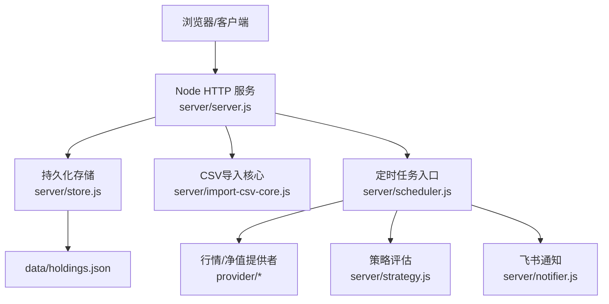
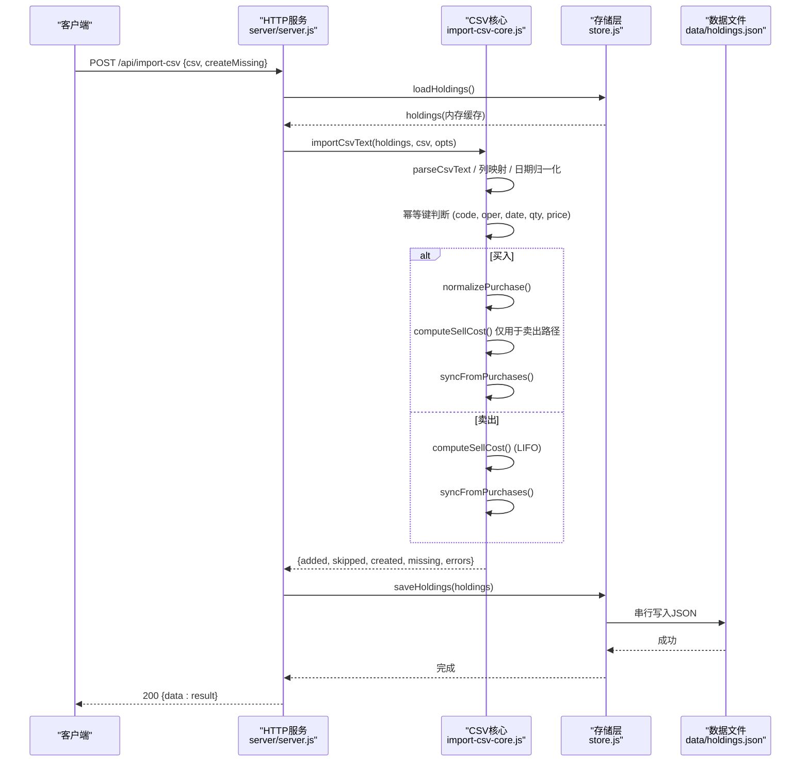
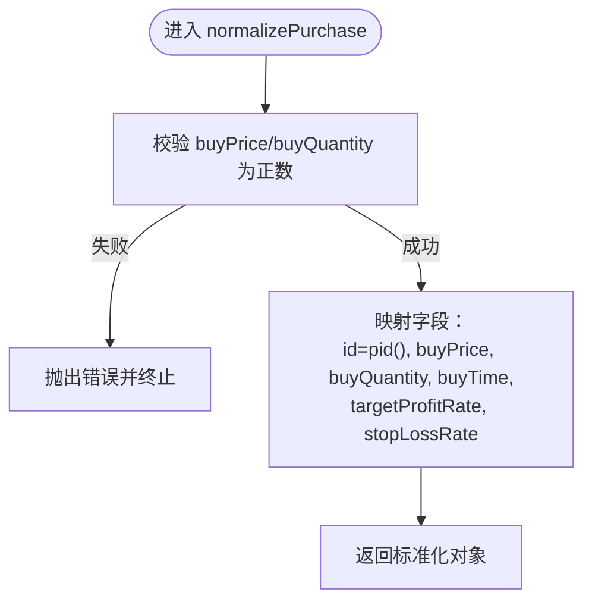
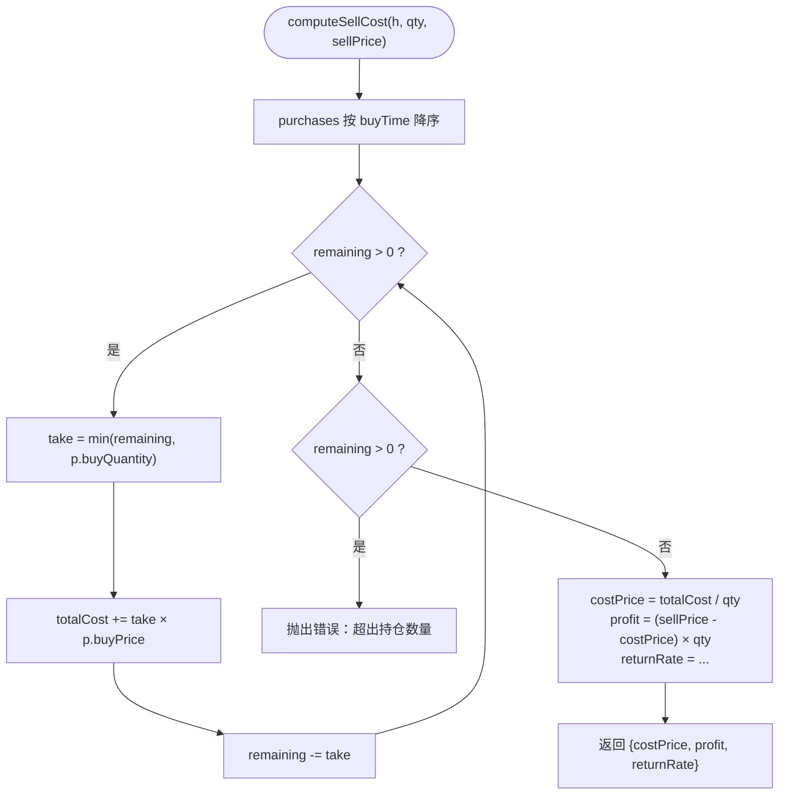
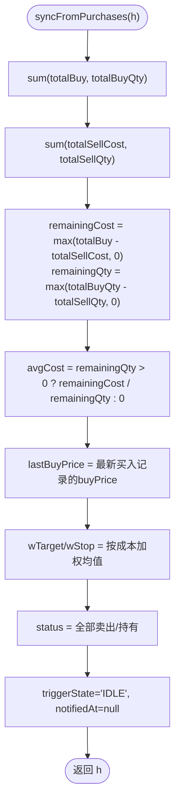
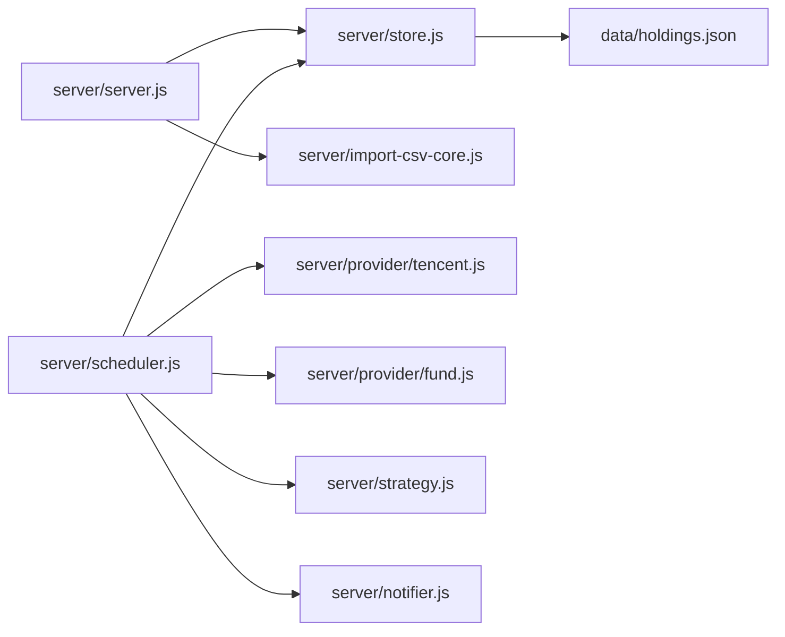

# 事务处理

<cite>
**本文引用的文件**
- [server/import-csv-core.js](file://server/import-csv-core.js)
- [server/server.js](file://server/server.js)
- [server/store.js](file://server/store.js)
- [server/scheduler.js](file://server/scheduler.js)
- [server/notifier.js](file://server/notifier.js)
- [config.json](file://config.json)
- [data/holdings.json](file://data/holdings.json)
- [docs/盈亏计算规则.md](file://docs/盈亏计算规则.md)
</cite>

## 目录
1. [简介](#简介)
2. [项目结构](#项目结构)
3. [核心组件](#核心组件)
4. [架构总览](#架构总览)
5. [详细组件分析](#详细组件分析)
6. [依赖关系分析](#依赖关系分析)
7. [性能考量](#性能考量)
8. [故障排查指南](#故障排查指南)
9. [结论](#结论)
10. [附录](#附录)

## 简介
本技术文档聚焦 Stock Advisor 的“事务处理”能力，围绕买入记录处理、卖出成本计算（LIFO）、持仓同步机制、事务一致性保证、性能优化策略以及监控调试工具进行系统化说明。目标是帮助开发者与运维人员准确理解并可靠地维护交易数据的一致性、可追溯性与可观测性。

## 项目结构
Stock Advisor 采用前后端分离：前端通过 Vite 构建静态资源并由 Node HTTP 服务器托管；后端提供 REST API，负责读取/写入 holdings.json，调度行情抓取、策略评估与飞书通知。

图表来源
- [server/server.js:1-594](file://server/server.js#L1-L594)
- [server/store.js:1-71](file://server/store.js#L1-L71)
- [server/import-csv-core.js:1-307](file://server/import-csv-core.js#L1-L307)
- [server/scheduler.js:1-178](file://server/scheduler.js#L1-L178)
- [server/notifier.js:1-112](file://server/notifier.js#L1-L112)

章节来源
- [server/server.js:1-594](file://server/server.js#L1-L594)
- [server/store.js:1-71](file://server/store.js#L1-L71)
- [server/import-csv-core.js:1-307](file://server/import-csv-core.js#L1-L307)
- [server/scheduler.js:1-178](file://server/scheduler.js#L1-L178)
- [server/notifier.js:1-112](file://server/notifier.js#L1-L112)
- [config.json:1-19](file://config.json#L1-L19)

## 核心组件
- 事务与数据模型
  - 每只持仓持有 purchases[] 与 sells[] 两条独立记录，卖出不修改任何买入记录，确保可审计与可重算。
- 买入归一化
  - normalizePurchase 负责参数校验、字段映射与默认值填充，生成唯一 id、标准化 buyTime 等。
- 卖出成本计算
  - LIFO 原则：按买入时间降序匹配，逐笔扣减数量，累计成本后得出 costPrice、profit、returnRate。
- 持仓同步
  - syncFromPurchases 从明细反推汇总字段：剩余成本/数量/均价、最近买入价、加权止盈止损率、状态等。
- 持久化与并发控制
  - store.js 提供内存缓存与串行写盘，避免并发覆盖；支持外部文件变更检测与旧版数据迁移。
- 调度与通知
  - scheduler.js 周期性拉取行情/净值，执行策略评估，触发飞书通知；notifier.js 封装卡片消息与重试。

章节来源
- [docs/盈亏计算规则.md:1-125](file://docs/盈亏计算规则.md#L1-L125)
- [server/import-csv-core.js:43-128](file://server/import-csv-core.js#L43-L128)
- [server/server.js:286-407](file://server/server.js#L286-L407)
- [server/store.js:24-71](file://server/store.js#L24-L71)
- [server/scheduler.js:65-178](file://server/scheduler.js#L65-L178)
- [server/notifier.js:1-112](file://server/notifier.js#L1-L112)

## 架构总览
下图展示一次“CSV 批量导入买入/卖出记录”的端到端流程，涵盖解析、幂等去重、LIFO 成本计算、同步汇总与持久化。

图表来源
- [server/server.js:416-435](file://server/server.js#L416-L435)
- [server/import-csv-core.js:170-306](file://server/import-csv-core.js#L170-L306)
- [server/store.js:40-71](file://server/store.js#L40-L71)

## 详细组件分析

### 买入记录处理：normalizePurchase
- 参数验证
  - 强制要求 buyPrice > 0 且 buyQuantity > 0，否则抛出错误，阻止非法数据进入系统。
- 字段映射与转换
  - 生成唯一 id（pid），标准化 buyTime（兼容多种输入），将目标止盈/止损比例转为数值并设置默认值。
- 使用位置
  - 在 CSV 导入与追加买入接口中复用，确保数据一致性与幂等性。

图表来源
- [server/import-csv-core.js:43-58](file://server/import-csv-core.js#L43-L58)
- [server/server.js:286-300](file://server/server.js#L286-L300)

章节来源
- [server/import-csv-core.js:43-58](file://server/import-csv-core.js#L43-L58)
- [server/server.js:286-300](file://server/server.js#L286-L300)

### 卖出成本计算：LIFO 原则与收益计算
- LIFO 匹配
  - 将 purchases 按 buyTime 降序排序，逐笔扣减卖出数量，累计成本。
  - 若无法完全匹配（卖出数量超过持仓），抛出错误。
- 成本与收益
  - costPrice = 累计成本 / 卖出数量
  - profit = (sellPrice - costPrice) × sellQuantity
  - returnRate = (sellPrice - costPrice) / costPrice × 100（costPrice > 0）
- 使用位置
  - CSV 导入与旧版 transactions 接口均调用该逻辑，保证一致性。

图表来源
- [server/import-csv-core.js:60-80](file://server/import-csv-core.js#L60-L80)
- [server/server.js:364-392](file://server/server.js#L364-L392)
- [docs/盈亏计算规则.md:59-80](file://docs/盈亏计算规则.md#L59-L80)

章节来源
- [server/import-csv-core.js:60-80](file://server/import-csv-core.js#L60-L80)
- [server/server.js:364-392](file://server/server.js#L364-L392)
- [docs/盈亏计算规则.md:59-80](file://docs/盈亏计算规则.md#L59-L80)

### 持仓同步机制：syncFromPurchases
- 字段更新
  - 计算总买入成本/数量、已卖出成本/数量，推导剩余成本/数量/均价。
  - 更新 lastBuyPrice（最新买入价）。
  - 计算加权平均的 targetProfitRate 与 stopLossRate（按成本权重）。
  - 根据买卖总量更新 status（持有/全部卖出）。
  - 重置 triggerState 与 notifiedAt，以便下一轮重新评估。
- 使用位置
  - CSV 导入、追加买入/卖出、删除买入记录后均需调用，确保汇总字段与明细一致。

图表来源
- [server/import-csv-core.js:82-128](file://server/import-csv-core.js#L82-L128)
- [server/server.js:247-284](file://server/server.js#L247-L284)

章节来源
- [server/import-csv-core.js:82-128](file://server/import-csv-core.js#L82-L128)
- [server/server.js:247-284](file://server/server.js#L247-L284)

### 事务一致性保证
- 错误回滚与部分失败处理
  - CSV 导入对每条记录 try/catch，单条失败不影响其他记录，errors 列表记录异常详情。
  - 幂等键设计：以 (code, 操作, 日期, 数量, 价格) 为唯一键，重复导入自动跳过。
- 数据完整性检查
  - 买入：必须为正的价格与数量。
  - 卖出：严格校验卖出数量不超过持仓，否则抛错。
  - 表头校验：CSV 缺少必需列直接报错，防止脏数据入库。
- 持久化原子性
  - 写盘通过串行队列 writeChain 顺序执行，避免并发覆盖；写后更新 mtime，避免误判外部改动。
  - 首次加载或外部文件变更后重载，并执行旧版数据迁移至 purchases 模型。

章节来源
- [server/import-csv-core.js:170-306](file://server/import-csv-core.js#L170-L306)
- [server/store.js:24-71](file://server/store.js#L24-L71)
- [server/server.js:416-435](file://server/server.js#L416-L435)

### 性能优化策略
- 批量处理
  - CSV 解析一次性读取文本，按行流式处理，减少中间对象创建。
  - 代码匹配使用 Map（精确匹配 + 数字归一化兜底），O(1) 查找。
- 内存管理
  - 内存缓存 holdings 列表，避免频繁 IO；仅在文件 mtime 变化时重新加载。
  - 派生字段（withDerived）按需计算，降低存储体积。
- 并发控制
  - 写盘串行化，避免竞态条件。
  - 调度器在非交易时段降频，减少不必要请求与计算。
- 网络与外部依赖
  - 行情/净值并行获取（Promise.all），提升吞吐。
  - 飞书通知带重试与签名，提高可靠性。

章节来源
- [server/import-csv-core.js:170-306](file://server/import-csv-core.js#L170-L306)
- [server/store.js:40-71](file://server/store.js#L40-L71)
- [server/scheduler.js:65-178](file://server/scheduler.js#L65-L178)
- [server/notifier.js:80-112](file://server/notifier.js#L80-L112)

### 事务监控与调试工具
- 日志与告警
  - 调度器输出 tick 日志，包含模式（交易时段/非交易时段）、持仓数量与更新时间。
  - 飞书通知支持测试消息，便于快速验证推送链路。
- 配置项
  - schedule.intervalSeconds/offHoursIntervalSeconds：调节刷新频率。
  - notify.cooldownSeconds/nearThresholdPct：冷却时间与阈值，避免刷屏。
  - feishu.webhook/secret：通知通道配置。
- 数据快照
  - data/holdings.json 可作为审计与回溯依据；可通过对比备份文件定位异常。

章节来源
- [server/scheduler.js:160-178](file://server/scheduler.js#L160-L178)
- [server/server.js:545-562](file://server/server.js#L545-L562)
- [config.json:1-19](file://config.json#L1-L19)
- [data/holdings.json:1-200](file://data/holdings.json#L1-L200)

## 依赖关系分析

图表来源
- [server/server.js:1-594](file://server/server.js#L1-L594)
- [server/store.js:1-71](file://server/store.js#L1-L71)
- [server/scheduler.js:1-178](file://server/scheduler.js#L1-L178)

章节来源
- [server/server.js:1-594](file://server/server.js#L1-L594)
- [server/store.js:1-71](file://server/store.js#L1-L71)
- [server/scheduler.js:1-178](file://server/scheduler.js#L1-L178)

## 性能考量
- 建议优先使用 CSV 批量导入而非逐条 API 调用，以减少网络与序列化开销。
- 对于高频读场景，利用内存缓存与 withDerived 派生字段，避免重复计算。
- 合理设置调度间隔与冷却时间，平衡实时性与资源消耗。
- 关注 holdings.json 文件大小增长，定期归档历史快照，保持读写性能。

[本节为通用指导，不直接分析具体文件]

## 故障排查指南
- 常见错误
  - “买入价/买入数量必须为正”：检查传入数值类型与范围。
  - “卖出数量超过持仓数量”：核对卖出数量与当前剩余数量。
  - “CSV 表头缺少必需列”：确认列名包含 代码/操作/日期/数量/价格。
- 定位方法
  - 查看 errors 列表（CSV 导入返回体），定位失败记录与原因。
  - 检查 holdings.json 中对应持仓的 purchases/sells 是否完整。
  - 通过飞书测试消息验证通知链路是否正常。
- 恢复步骤
  - 修正数据后重新导入；幂等键会跳过重复记录。
  - 如文件被外部修改，服务会在下次加载时自动重载并迁移。

章节来源
- [server/import-csv-core.js:170-306](file://server/import-csv-core.js#L170-L306)
- [server/server.js:416-435](file://server/server.js#L416-L435)
- [server/notifier.js:80-112](file://server/notifier.js#L80-L112)

## 结论
Stock Advisor 的事务处理以“明细不可变、汇总可重算”为核心原则，通过 normalizePurchase、LIFO 成本计算与 syncFromPurchases 形成闭环；借助内存缓存与串行写盘保障并发安全；配合调度器与通知机制实现自动化监控与提醒。整体设计兼顾准确性、可审计性与可扩展性，适合持续演进与规模化使用。

[本节为总结性内容，不直接分析具体文件]

## 附录
- 关键函数与路径参考
  - 买入归一化：[server/import-csv-core.js:43-58](file://server/import-csv-core.js#L43-L58)、[server/server.js:286-300](file://server/server.js#L286-L300)
  - 卖出成本计算（LIFO）：[server/import-csv-core.js:60-80](file://server/import-csv-core.js#L60-L80)、[server/server.js:364-392](file://server/server.js#L364-L392)
  - 持仓同步：[server/import-csv-core.js:82-128](file://server/import-csv-core.js#L82-L128)、[server/server.js:247-284](file://server/server.js#L247-L284)
  - 持久化与并发：[server/store.js:40-71](file://server/store.js#L40-L71)
  - 调度与通知：[server/scheduler.js:65-178](file://server/scheduler.js#L65-L178)、[server/notifier.js:80-112](file://server/notifier.js#L80-L112)
- 业务规则参考
  - 盈亏计算规则：[docs/盈亏计算规则.md:1-125](file://docs/盈亏计算规则.md#L1-L125)

[本节为索引与参考，不直接分析具体文件]