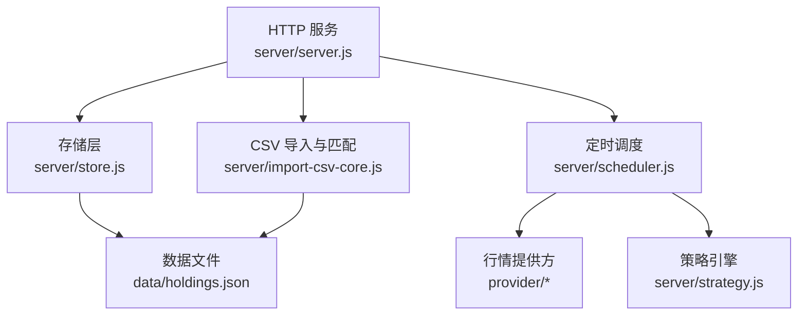
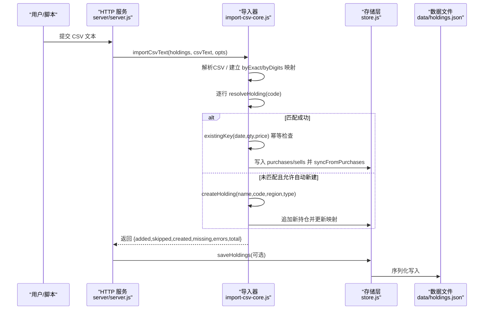
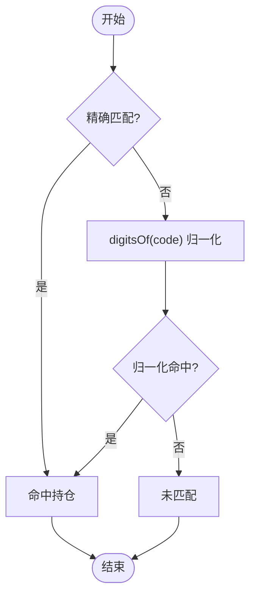
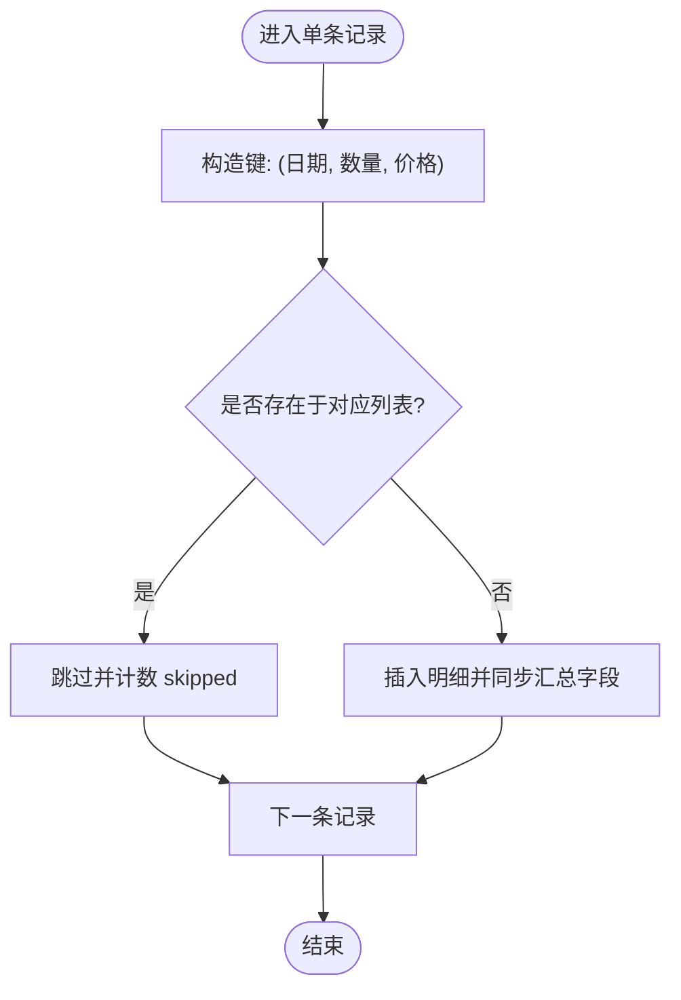
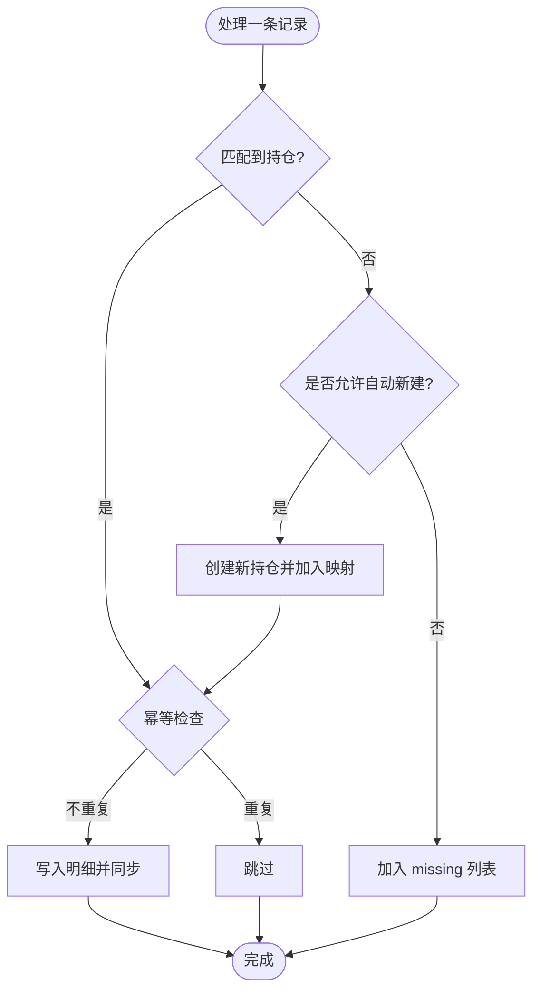
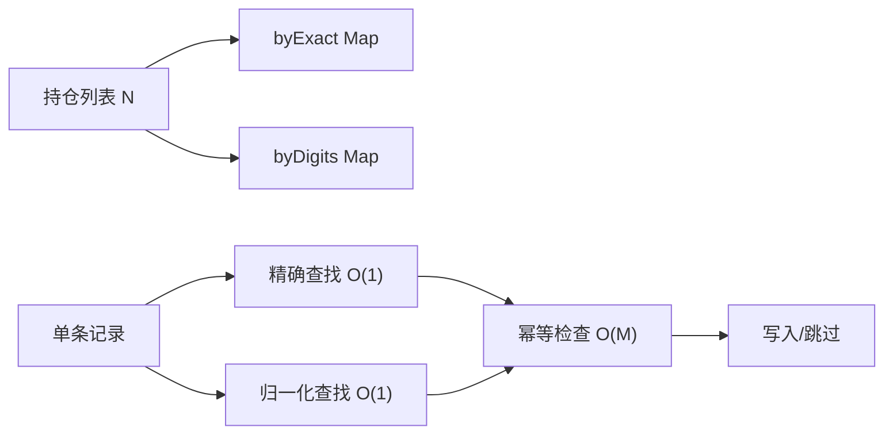
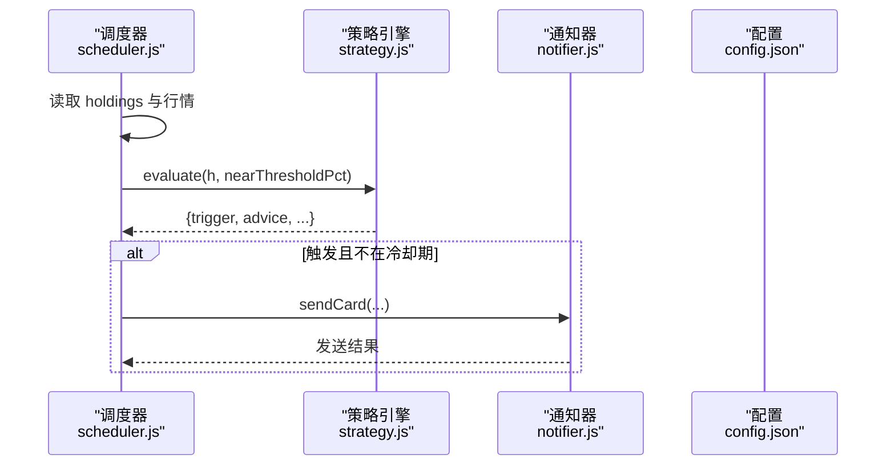
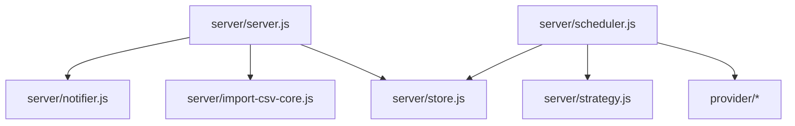

# 匹配算法

<cite>
**本文引用的文件**
- [server/import-csv-core.js](file://server/import-csv-core.js)
- [server/store.js](file://server/store.js)
- [server/scheduler.js](file://server/scheduler.js)
- [server/strategy.js](file://server/strategy.js)
- [server/server.js](file://server/server.js)
- [config.json](file://config.json)
- [data/holdings.json](file://data/holdings.json)
</cite>

## 目录
1. [简介](#简介)
2. [项目结构](#项目结构)
3. [核心组件](#核心组件)
4. [架构总览](#架构总览)
5. [详细组件分析](#详细组件分析)
6. [依赖关系分析](#依赖关系分析)
7. [性能考虑](#性能考虑)
8. [故障排查指南](#故障排查指南)
9. [结论](#结论)
10. [附录](#附录)

## 简介
本技术文档聚焦 Stock Advisor 的“持仓代码匹配算法”，围绕以下目标展开：
- 精确匹配与数字归一化匹配的优先级策略
- digitsOf 函数的实现原理及多市场代码适配
- 幂等性保证机制（重复记录检测键生成与冲突解决）
- 匹配性能优化（索引构建、查找算法、缓存策略）
- 匹配失败处理（缺失记录识别、自动创建选项、错误报告）
- 匹配规则配置与自定义扩展方案

## 项目结构
本项目采用前后端分离，后端以 Node.js HTTP 服务为核心，负责：
- 持仓数据持久化与内存缓存
- CSV 导入与匹配逻辑
- 定时调度与行情获取
- 策略评估与通知

图表来源
- [server/server.js:1-200](file://server/server.js#L1-L200)
- [server/store.js:1-70](file://server/store.js#L1-L70)
- [server/import-csv-core.js:1-307](file://server/import-csv-core.js#L1-L307)
- [server/scheduler.js:1-178](file://server/scheduler.js#L1-L178)
- [server/strategy.js:1-91](file://server/strategy.js#L1-L91)
- [data/holdings.json:1-200](file://data/holdings.json#L1-L200)

章节来源
- [server/server.js:1-200](file://server/server.js#L1-L200)
- [server/store.js:1-70](file://server/store.js#L1-L70)
- [server/import-csv-core.js:1-307](file://server/import-csv-core.js#L1-L307)
- [server/scheduler.js:1-178](file://server/scheduler.js#L1-L178)
- [server/strategy.js:1-91](file://server/strategy.js#L1-L91)
- [data/holdings.json:1-200](file://data/holdings.json#L1-L200)

## 核心组件
- 代码匹配与幂等导入：importCsvText 提供基于“精确匹配优先 + 数字归一化兜底”的匹配流程，并实现幂等插入。
- 存储与缓存：store 模块维护内存缓存与磁盘持久化，支持外部文件变更检测与串行写盘。
- 调度与策略：scheduler 定时拉取行情，调用 strategy 评估止盈/止损/补仓信号，并通过 notifier 发送通知。
- 服务器接口：server 暴露 HTTP 接口，统一入口承载静态资源、持仓读写与 CSV 导入。

章节来源
- [server/import-csv-core.js:170-306](file://server/import-csv-core.js#L170-L306)
- [server/store.js:40-70](file://server/store.js#L40-L70)
- [server/scheduler.js:65-165](file://server/scheduler.js#L65-L165)
- [server/strategy.js:34-90](file://server/strategy.js#L34-L90)
- [server/server.js:1-200](file://server/server.js#L1-L200)

## 架构总览
下图展示从 CSV 导入到持仓更新的全链路交互，包括匹配、幂等、同步与持久化。

图表来源
- [server/import-csv-core.js:170-306](file://server/import-csv-core.js#L170-L306)
- [server/store.js:40-70](file://server/store.js#L40-L70)
- [server/server.js:1-200](file://server/server.js#L1-L200)

## 详细组件分析

### 代码匹配机制：精确匹配优先 + 数字归一化兜底
- 精确匹配：将 CSV 中的 code 与 holdings.code 进行字符串完全相等比较。适用于标准纯数字代码（如 07709、005827）。
- 数字归一化匹配：当精确匹配失败时，提取 code 中的全部数字串进行比较，用于兼容带前缀的多市场代码（如 hk00700 → 700）。
- 优先级：先尝试精确匹配；若失败再尝试数字归一化匹配；均失败则视为未匹配。

图表来源
- [server/import-csv-core.js:212-224](file://server/import-csv-core.js#L212-L224)

章节来源
- [server/import-csv-core.js:212-224](file://server/import-csv-core.js#L212-L224)

### digitsOf 函数：非数字字符过滤与多市场适配
- 实现原理：将输入转为字符串后移除所有非数字字符，仅保留数字序列。
- 多市场适配：对带有地区前缀的代码（如 hk00700），通过去除字母前缀得到纯数字部分，从而与 holdings.code 的数字部分对齐，提升匹配成功率。
- 复杂度：时间 O(n)，空间 O(n)，n 为输入字符串长度。

章节来源
- [server/import-csv-core.js:25-28](file://server/import-csv-core.js#L25-L28)

### 幂等性保证：重复记录检测键生成与冲突解决
- 唯一键构成：对于买入/卖出记录，使用 (日期, 数量, 价格) 作为幂等键。其中日期已做标准化（YYYY-MM-DD），数量与价格使用数值比较并容忍浮点误差。
- 冲突解决：若检测到相同键的记录已存在，则跳过该条导入（计入 skipped），避免重复插入。
- 适用范围：同时覆盖买入与卖出两条明细列表。

图表来源
- [server/import-csv-core.js:226-239](file://server/import-csv-core.js#L226-L239)

章节来源
- [server/import-csv-core.js:226-239](file://server/import-csv-core.js#L226-L239)

### 匹配失败处理：缺失识别、自动创建与错误报告
- 缺失识别：当精确与归一化匹配均未命中时，记录到 missing 列表。
- 自动创建：若启用 createMissing 选项，则为缺失记录按 name/code/region/type 新建持仓，并更新映射表以便后续记录可继续匹配。
- 错误报告：在插入明细过程中发生异常（如卖出数量超过持仓）时，捕获异常并记录到 errors 列表，包含原始记录与错误信息。

图表来源
- [server/import-csv-core.js:249-303](file://server/import-csv-core.js#L249-L303)

章节来源
- [server/import-csv-core.js:249-303](file://server/import-csv-core.js#L249-L303)

### 匹配性能优化：索引构建、查找算法与缓存策略
- 索引构建：
  - byExact：以 holdings.code 为键的 Map，O(1) 精确查找。
  - byDigits：以 digitsOf(holdings.code) 为键的 Map，O(1) 归一化查找。
  - 构建复杂度：O(N)，N 为持仓总数。
- 查找算法：
  - 单次记录匹配：先查 byExact，再查 byDigits，整体 O(1)。
  - 幂等检查：对目标持仓的 purchases/sells 列表线性扫描，最坏 O(M)，M 为该持仓交易记录数。
- 缓存策略：
  - 内存缓存：store 模块维护内存中的 holdings 数组，避免频繁读盘。
  - 文件变更检测：通过 mtime 判断外部修改，必要时重新加载。
  - 串行写盘：writeChain 确保并发写操作顺序执行，防止覆盖。

图表来源
- [server/import-csv-core.js:212-239](file://server/import-csv-core.js#L212-L239)
- [server/store.js:8-12](file://server/store.js#L8-L12)
- [server/store.js:40-70](file://server/store.js#L40-L70)

章节来源
- [server/import-csv-core.js:212-239](file://server/import-csv-core.js#L212-L239)
- [server/store.js:8-12](file://server/store.js#L8-L12)
- [server/store.js:40-70](file://server/store.js#L40-L70)

### 策略评估与告警：与匹配结果的联动
- 策略评估：strategy.evaluate 根据当前价与加权止盈/止损阈值计算触发信号（SELL/BUY/NONE），并输出建议文案。
- 调度联动：scheduler 每轮拉取行情后调用 evaluate，结合冷却时间与告警阈值决定是否推送通知。
- 配置项：nearThresholdPct 控制“接近阈值”的百分比容差；cooldownSeconds 控制同一触发态的冷却时长。

图表来源
- [server/scheduler.js:65-165](file://server/scheduler.js#L65-L165)
- [server/strategy.js:34-90](file://server/strategy.js#L34-L90)
- [config.json:1-19](file://config.json#L1-L19)

章节来源
- [server/scheduler.js:65-165](file://server/scheduler.js#L65-L165)
- [server/strategy.js:34-90](file://server/strategy.js#L34-L90)
- [config.json:1-19](file://config.json#L1-L19)

## 依赖关系分析
- import-csv-core.js 依赖：
  - 无外部模块，纯函数式实现，便于复用。
  - 被 server/server.js 通过 HTTP 接口调用。
- store.js 依赖：
  - Node fs/promises 与 path/url 模块，负责文件读写与路径拼接。
  - 被 scheduler.js 与 server.js 共同使用。
- scheduler.js 依赖：
  - provider/tencent.js 与 provider/fund.js 获取行情。
  - strategy.js 评估信号。
  - notifier.js 发送通知。
- server.js 依赖：
  - store.js、import-csv-core.js、notifier.js。
  - 提供静态资源托管与 JSON API。

图表来源
- [server/server.js:1-200](file://server/server.js#L1-L200)
- [server/scheduler.js:1-178](file://server/scheduler.js#L1-L178)
- [server/store.js:1-70](file://server/store.js#L1-L70)
- [server/import-csv-core.js:1-307](file://server/import-csv-core.js#L1-L307)

章节来源
- [server/server.js:1-200](file://server/server.js#L1-L200)
- [server/scheduler.js:1-178](file://server/scheduler.js#L1-L178)
- [server/store.js:1-70](file://server/store.js#L1-L70)
- [server/import-csv-core.js:1-307](file://server/import-csv-core.js#L1-L307)

## 性能考虑
- 匹配阶段：
  - 通过双 Map 索引实现 O(1) 查找，显著降低大规模持仓下的匹配耗时。
  - 幂等检查为线性扫描，建议在高频导入场景下对单一持仓的交易记录数进行合理控制或引入二级索引（如按日期分桶）。
- 存储阶段：
  - 内存缓存减少磁盘 IO，配合 mtime 检测避免重复加载。
  - 串行写盘避免并发写导致的覆盖问题。
- 调度阶段：
  - 交易时段与非交易时段差异化刷新间隔，降低无效请求。
  - 并行拉取股票与基金行情，缩短整体延迟。

[本节为通用性能讨论，无需特定文件引用]

## 故障排查指南
- CSV 导入失败：
  - 检查表头是否包含必需列（代码、操作、日期、数量、价格）。
  - 查看 errors 列表中的 message，常见原因为卖出数量超过持仓或数值非法。
- 匹配不到持仓：
  - 确认 holdings.code 是否为标准格式；若为带前缀代码，启用数字归一化匹配。
  - 若需自动创建，请开启 createMissing 选项。
- 重复导入：
  - 幂等键由 (日期, 数量, 价格) 组成，若出现 skipped，说明已存在相同记录。
- 通知过多：
  - 调整 config.json 中的 cooldownSeconds 与 nearThresholdPct，避免频繁告警。

章节来源
- [server/import-csv-core.js:170-188](file://server/import-csv-core.js#L170-L188)
- [server/import-csv-core.js:226-303](file://server/import-csv-core.js#L226-L303)
- [config.json:1-19](file://config.json#L1-L19)

## 结论
Stock Advisor 的匹配算法以“精确匹配优先 + 数字归一化兜底”为核心，结合幂等性保证与高性能索引，实现了稳定可靠的 CSV 导入与持仓更新。通过内存缓存与串行写盘，系统在并发场景下具备良好的一致性与性能表现。策略评估与调度机制进一步增强了系统的自动化与可观测性。未来可在幂等检查中引入更高效的索引结构，并在匹配规则上提供更灵活的扩展点。

[本节为总结性内容，无需特定文件引用]

## 附录

### 匹配规则配置与自定义扩展方案
- 配置项：
  - nearThresholdPct：接近阈值百分比，影响“快达到”判定。
  - cooldownSeconds：冷却时长，控制同一触发态的通知频率。
- 扩展点：
  - 在 import-csv-core.js 中扩展 digitsOf 的逻辑，以支持更多市场前缀或特殊编码。
  - 在 resolveHolding 中增加自定义匹配规则（如模糊匹配、正则匹配）。
  - 在 existingKey 中扩展幂等键维度（如增加手续费、账户号等）。
  - 在 strategy.evaluate 中新增策略条件，丰富买卖建议。

章节来源
- [config.json:1-19](file://config.json#L1-L19)
- [server/import-csv-core.js:25-28](file://server/import-csv-core.js#L25-L28)
- [server/import-csv-core.js:212-239](file://server/import-csv-core.js#L212-L239)
- [server/strategy.js:34-90](file://server/strategy.js#L34-L90)