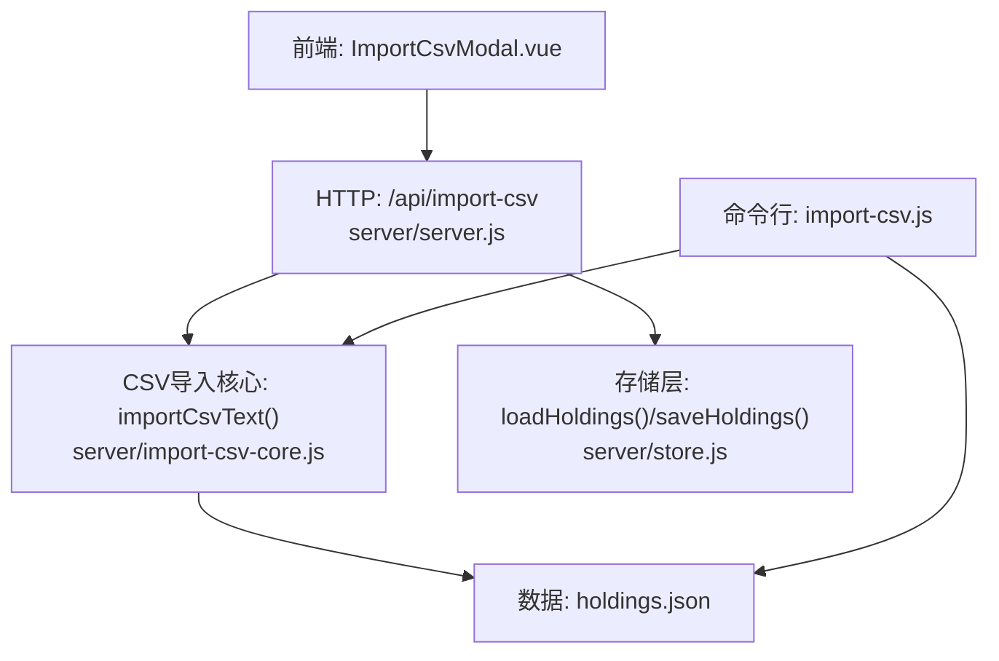
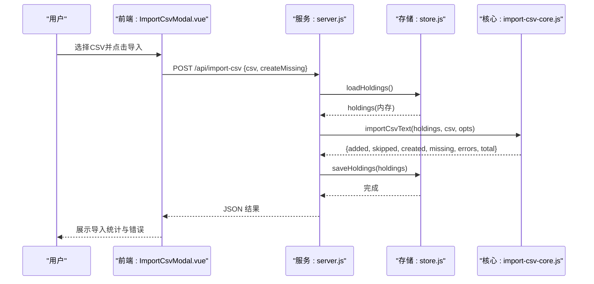
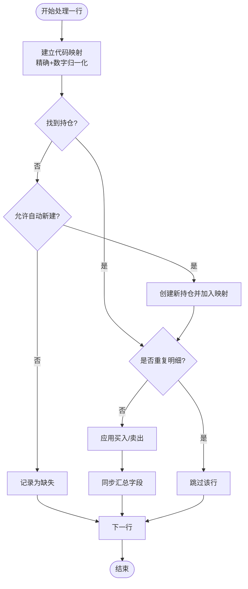
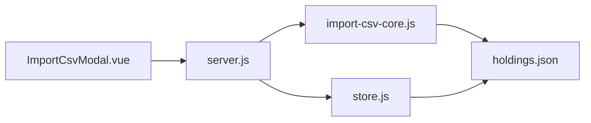

# 批量导入处理

<cite>
**本文引用的文件**
- [server/import-csv-core.js](file://server/import-csv-core.js)
- [server/import-csv.js](file://server/import-csv.js)
- [server/server.js](file://server/server.js)
- [server/store.js](file://server/store.js)
- [web/src/components/ImportCsvModal.vue](file://web/src/components/ImportCsvModal.vue)
- [data/买入-卖出记录 - Sheet1.csv](file://data/买入-卖出记录 - Sheet1.csv)
- [data/holdings.json](file://data/holdings.json)
</cite>

## 目录
1. [简介](#简介)
2. [项目结构](#项目结构)
3. [核心组件](#核心组件)
4. [架构总览](#架构总览)
5. [详细组件分析](#详细组件分析)
6. [依赖关系分析](#依赖关系分析)
7. [性能考量](#性能考量)
8. [故障排查指南](#故障排查指南)
9. [结论](#结论)
10. [附录](#附录)

## 简介
本技术文档聚焦 Stock Advisor 的“批量导入处理”能力，围绕 CSV 文件的解析、数据验证、匹配与幂等、事务一致性、错误处理、性能优化以及监控日志进行系统化说明。目标是帮助开发者与使用者理解从前端选择 CSV 到后端持久化的完整链路，并掌握在大数据量场景下的内存与吞吐优化策略。

## 项目结构
与批量导入直接相关的代码主要分布在以下模块：
- 核心解析与导入逻辑：server/import-csv-core.js
- 命令行一键导入脚本：server/import-csv.js
- HTTP API 入口与请求路由：server/server.js
- 持仓数据的加载与串行写盘：server/store.js
- 前端导入弹窗与交互：web/src/components/ImportCsvModal.vue
- 示例数据：data/买入-卖出记录 - Sheet1.csv、data/holdings.json

图表来源
- [server/server.js:416-435](file://server/server.js#L416-L435)
- [server/import-csv-core.js:170-306](file://server/import-csv-core.js#L170-L306)
- [server/store.js:40-69](file://server/store.js#L40-L69)
- [web/src/components/ImportCsvModal.vue:49-73](file://web/src/components/ImportCsvModal.vue#L49-L73)
- [server/import-csv.js:37-79](file://server/import-csv.js#L37-L79)

章节来源
- [server/import-csv-core.js:170-306](file://server/import-csv-core.js#L170-L306)
- [server/import-csv.js:37-79](file://server/import-csv.js#L37-L79)
- [server/server.js:416-435](file://server/server.js#L416-L435)
- [server/store.js:40-69](file://server/store.js#L40-L69)
- [web/src/components/ImportCsvModal.vue:49-73](file://web/src/components/ImportCsvModal.vue#L49-L73)

## 核心组件
- CSV 文本解析器：支持 BOM、引号包裹、逗号分隔；按行拆分并返回二维数组。
- 字段映射与校验：自动识别多种列名（如“买入日期/卖出日期/日期”），对必需列进行存在性检查，并对数值型字段做正数校验。
- 匹配算法：先精确匹配 code，再数字归一化兜底（去除非数字字符后比较）。
- 幂等控制：以 (code, 操作, 日期, 数量, 价格) 为唯一键，重复明细忽略。
- 交易应用：买入追加购买记录；卖出按 LIFO 计算成本价、盈亏与收益率，并写入卖出记录。
- 汇总同步：每次变更后重新计算持仓的成本、均价、状态、加权止盈止损等。
- 可选新建持仓：当 createMissing=true 且未匹配到时，基于地区/类型创建新持仓。
- 存储层：内存缓存 + 串行写盘，避免并发覆盖；外部文件变更时自动重载。

章节来源
- [server/import-csv-core.js:8-23](file://server/import-csv-core.js#L8-L23)
- [server/import-csv-core.js:170-210](file://server/import-csv-core.js#L170-L210)
- [server/import-csv-core.js:212-239](file://server/import-csv-core.js#L212-L239)
- [server/import-csv-core.js:273-302](file://server/import-csv-core.js#L273-L302)
- [server/import-csv-core.js:82-128](file://server/import-csv-core.js#L82-L128)
- [server/store.js:40-69](file://server/store.js#L40-L69)

## 架构总览
整体流程如下：
- 前端通过 ImportCsvModal 读取本地 CSV 文本，调用 /api/import-csv 接口提交。
- 服务端 server.js 接收请求，调用 store.loadHoldings() 获取内存中的持仓列表。
- 调用 import-csv-core 的 importCsvText 执行解析、校验、匹配、幂等判断、交易应用与汇总。
- 成功后调用 store.saveHoldings() 串行写盘，保证并发安全。
- 返回导入结果（新增、跳过、新建、缺失、错误）给前端展示。

图表来源
- [web/src/components/ImportCsvModal.vue:49-73](file://web/src/components/ImportCsvModal.vue#L49-L73)
- [server/server.js:416-435](file://server/server.js#L416-L435)
- [server/store.js:40-69](file://server/store.js#L40-L69)
- [server/import-csv-core.js:170-306](file://server/import-csv-core.js#L170-L306)

## 详细组件分析

### CSV 解析与流式读取策略
- 当前实现使用 parseCsvText 将整段 CSV 文本按行切分并解析为二维数组，适合中小规模文件。
- 对于大文件场景，建议采用流式读取（例如 Node stream 或 ReadableStream）逐行处理，避免一次性加载全部文本导致内存峰值过高。
- 建议在解析阶段增加行级计数器与阈值控制，达到批大小后进行批次处理与落盘，降低内存占用。

章节来源
- [server/import-csv-core.js:8-23](file://server/import-csv-core.js#L8-L23)

### 数据验证机制
- 表头校验：必须包含“代码/操作/日期/数量/价格”等关键列，否则抛出错误并终止导入。
- 字段完整性：跳过空行与关键字段为空的数据行。
- 数据类型与业务规则：
  - 数量与价格需为正数。
  - 日期统一归一化为 YYYY-MM-DD，确保幂等匹配一致。
  - 买入价/数量必须为正，否则抛出错误。
  - 卖出数量不得超过持仓数量，否则抛出错误。

章节来源
- [server/import-csv-core.js:175-188](file://server/import-csv-core.js#L175-L188)
- [server/import-csv-core.js:190-210](file://server/import-csv-core.js#L190-L210)
- [server/import-csv-core.js:43-58](file://server/import-csv-core.js#L43-L58)
- [server/import-csv-core.js:60-80](file://server/import-csv-core.js#L60-L80)

### 匹配算法与幂等性
- 匹配优先级：
  1) 精确匹配：CSV 代码与 holdings.code 完全相同。
  2) 数字归一化：提取 holdings.code 中的数字部分与 CSV 代码的数字部分比较，兼容前缀/后缀差异。
- 幂等键：以 (code, 操作, 日期, 数量, 价格) 作为唯一键，已存在则跳过，避免重复插入。
- 可选新建持仓：当 createMissing=true 且未匹配到时，依据地区/类型创建新持仓，并加入映射表以便后续记录继续匹配。

图表来源
- [server/import-csv-core.js:212-239](file://server/import-csv-core.js#L212-L239)
- [server/import-csv-core.js:249-302](file://server/import-csv-core.js#L249-L302)

章节来源
- [server/import-csv-core.js:212-239](file://server/import-csv-core.js#L212-L239)
- [server/import-csv-core.js:249-302](file://server/import-csv-core.js#L249-L302)

### 事务处理与一致性
- 当前导入过程在内存中顺序处理每条记录，并在成功完成后一次性调用 saveHoldings() 写盘。
- 存储层通过串行写队列 writeChain 防止并发覆盖，并在写盘后更新 mtime，避免误判外部修改。
- 若需要更强的原子性与回滚能力，可在 importCsvText 内部维护一个临时快照，仅在全部记录处理成功后才替换内存中的 holdings 并写盘；失败时保留原快照。

章节来源
- [server/server.js:416-435](file://server/server.js#L416-L435)
- [server/store.js:40-69](file://server/store.js#L40-L69)

### 错误处理策略
- 部分失败：单条记录异常被捕获并记录到 errors 列表，不影响其他记录继续处理。
- 回滚机制：当前未实现事务回滚；如需强一致，可引入快照与条件提交。
- 错误报告：返回结果中包含 errors 数组，前端会展示具体错误信息与对应记录。

章节来源
- [server/import-csv-core.js:273-302](file://server/import-csv-core.js#L273-L302)
- [web/src/components/ImportCsvModal.vue:154-159](file://web/src/components/ImportCsvModal.vue#L154-L159)

### 性能优化技术
- 批量提交：当前为全量处理后一次写盘；未来可按批大小分批提交，减少单次写盘压力。
- 索引优化：匹配阶段使用 Map 构建精确与数字归一化映射，时间复杂度近似 O(1) 查找。
- 内存管理：
  - 当前 parseCsvText 一次性加载文本；建议改为流式读取以降低峰值内存。
  - 对超大 CSV，可边读边处理，达到阈值后批量写入中间文件或内存池，最后合并到 holdings。
- 并发写保护：store.js 通过串行写队列避免多进程/多线程覆盖。

章节来源
- [server/import-csv-core.js:212-239](file://server/import-csv-core.js#L212-L239)
- [server/store.js:61-69](file://server/store.js#L61-L69)

### 监控与日志记录
- 命令行导入：import-csv.js 输出导入统计（总数、新增、跳过、新建、缺失、错误），便于快速定位问题。
- HTTP 导入：返回结构化结果 data，前端展示统计与错误详情。
- 建议增强：
  - 在服务端增加结构化日志（如 winston/pino），记录每批处理的行数、耗时、错误堆栈。
  - 暴露指标接口（如 Prometheus metrics），监控导入吞吐、错误率、内存使用。

章节来源
- [server/import-csv.js:54-79](file://server/import-csv.js#L54-L79)
- [web/src/components/ImportCsvModal.vue:121-159](file://web/src/components/ImportCsvModal.vue#L121-L159)

## 依赖关系分析
- 前端 ImportCsvModal 依赖 HTTP 接口 /api/import-csv。
- server.js 依赖 store.js 进行数据加载与保存，依赖 import-csv-core.js 执行导入逻辑。
- import-csv-core.js 不依赖文件系统，纯函数式处理，便于复用（命令行与 HTTP 共用）。
- store.js 提供内存缓存与串行写盘，保障并发安全。

图表来源
- [web/src/components/ImportCsvModal.vue:49-73](file://web/src/components/ImportCsvModal.vue#L49-L73)
- [server/server.js:416-435](file://server/server.js#L416-L435)
- [server/import-csv-core.js:170-306](file://server/import-csv-core.js#L170-L306)
- [server/store.js:40-69](file://server/store.js#L40-L69)

章节来源
- [server/server.js:416-435](file://server/server.js#L416-L435)
- [server/import-csv-core.js:170-306](file://server/import-csv-core.js#L170-L306)
- [server/store.js:40-69](file://server/store.js#L40-L69)
- [web/src/components/ImportCsvModal.vue:49-73](file://web/src/components/ImportCsvModal.vue#L49-L73)

## 性能考量
- 解析阶段：建议引入流式读取与行级缓冲，避免大文件一次性加载导致的内存峰值。
- 匹配阶段：Map 映射保证高效查找；对超大规模 holdings，可考虑分片或二级索引。
- 写盘阶段：保持串行写队列；对大批量导入可采用分批提交，降低 IO 压力。
- 监控：增加耗时与内存指标，便于容量规划与瓶颈定位。

[本节为通用指导，无需特定文件引用]

## 故障排查指南
- 表头缺失：检查 CSV 是否包含“代码/操作/日期/数量/价格”，否则会抛出错误。
- 数据非法：数量或价格非正数将被跳过或报错；日期格式需能被归一化。
- 卖出超限：卖出数量超过持仓数量会抛出错误；请核对买入记录与卖出数量。
- 匹配不到：若未启用自动新建持仓，缺失记录会被收集；可开启 createMissing 自动创建。
- 重复导入：同一明细会被跳过；如需覆盖，请先删除旧记录或调整日期/数量/价格。

章节来源
- [server/import-csv-core.js:175-188](file://server/import-csv-core.js#L175-L188)
- [server/import-csv-core.js:190-210](file://server/import-csv-core.js#L190-L210)
- [server/import-csv-core.js:60-80](file://server/import-csv-core.js#L60-L80)
- [server/import-csv-core.js:249-302](file://server/import-csv-core.js#L249-L302)

## 结论
Stock Advisor 的批量导入功能通过清晰的职责划分实现了高内聚低耦合：前端负责交互与上传，服务端负责路由与协调，核心模块专注解析、校验、匹配与幂等，存储层保障并发安全。当前实现已具备完善的字段校验、匹配与幂等机制，并通过串行写盘确保一致性。面向大文件场景，建议引入流式解析与分批提交以提升性能与稳定性；同时可增强事务回滚与监控指标，进一步提升可靠性与可观测性。

[本节为总结性内容，无需特定文件引用]

## 附录
- 示例 CSV 列名与数据样例参考：data/买入-卖出记录 - Sheet1.csv
- 持仓数据结构与多次买入记录模型参考：data/holdings.json

章节来源
- [data/买入-卖出记录 - Sheet1.csv:1-26](file://data/买入-卖出记录 - Sheet1.csv#L1-L26)
- [data/holdings.json:1-200](file://data/holdings.json#L1-L200)