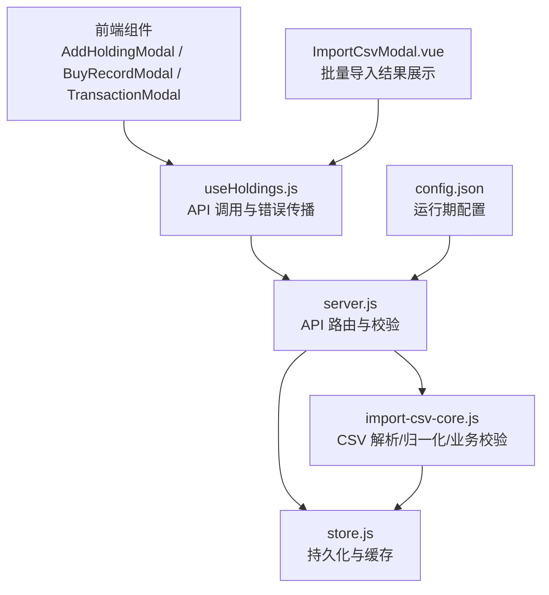
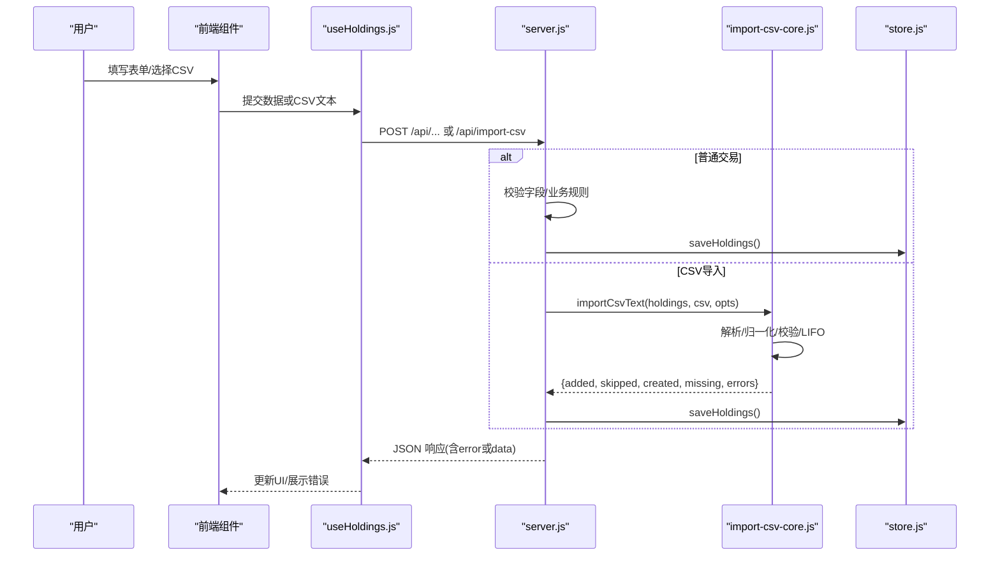
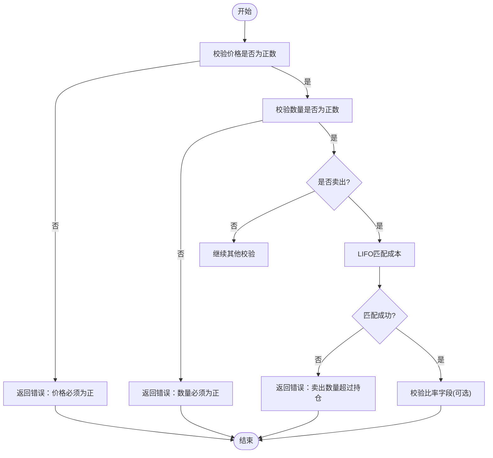
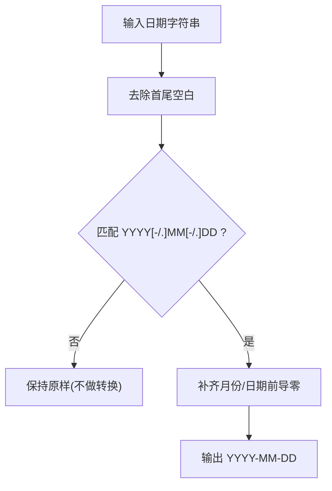
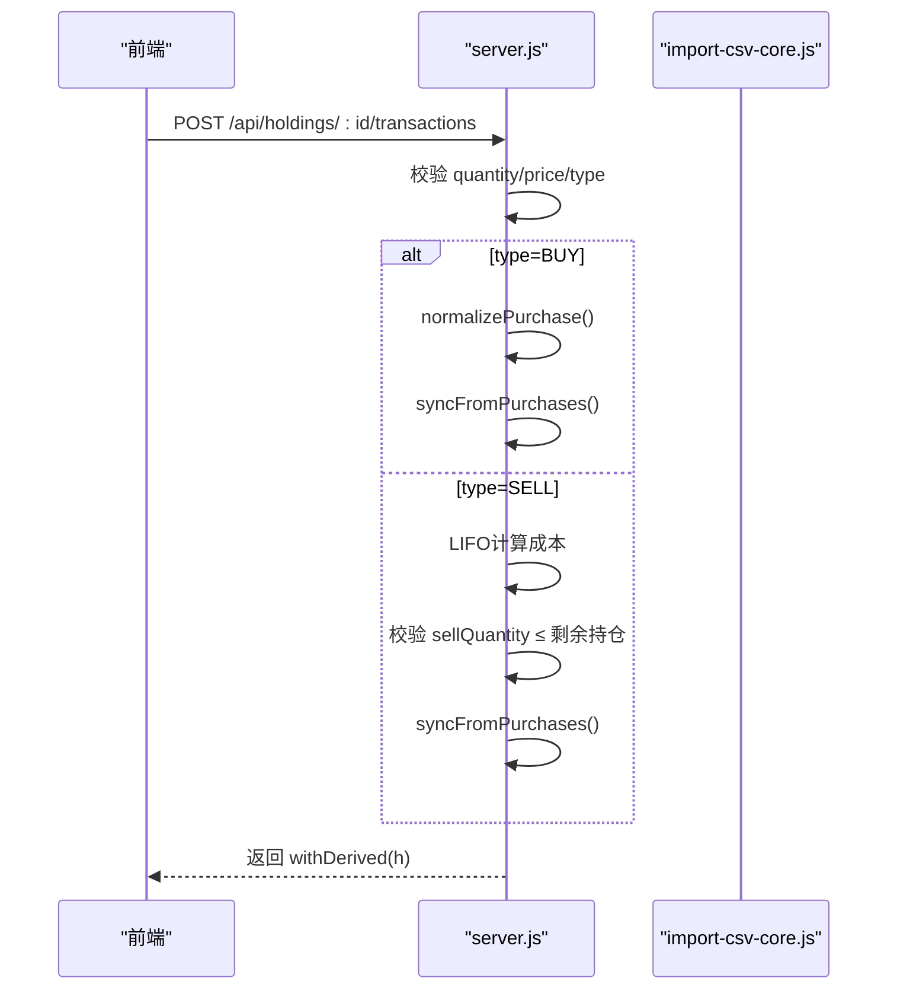
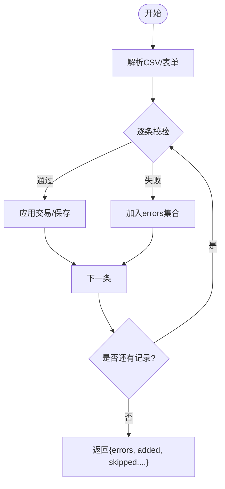
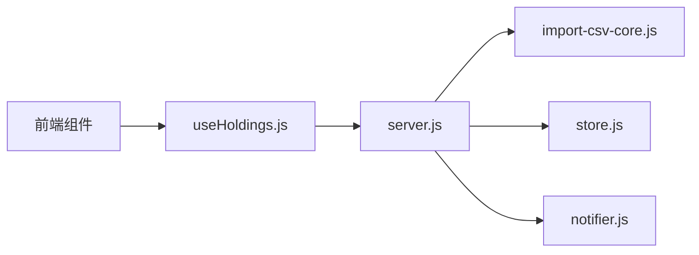
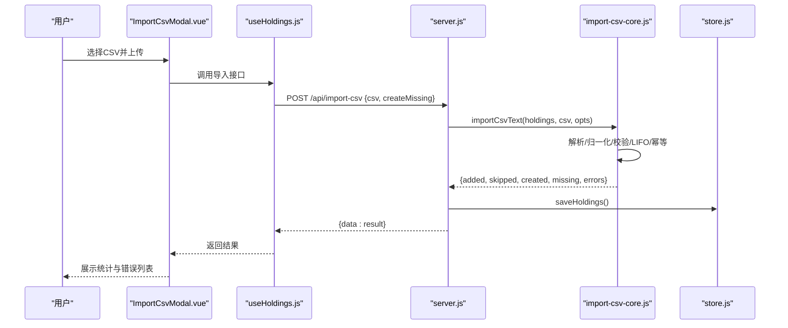

# 数据验证系统

<cite>
**本文引用的文件**
- [server/import-csv-core.js](file://server/import-csv-core.js)
- [server/import-csv.js](file://server/import-csv.js)
- [server/server.js](file://server/server.js)
- [server/store.js](file://server/store.js)
- [config.json](file://config.json)
- [web/src/components/AddHoldingModal.vue](file://web/src/components/AddHoldingModal.vue)
- [web/src/components/BuyRecordModal.vue](file://web/src/components/BuyRecordModal.vue)
- [web/src/components/TransactionModal.vue](file://web/src/components/TransactionModal.vue)
- [web/src/composables/useHoldings.js](file://web/src/composables/useHoldings.js)
- [web/src/components/ImportCsvModal.vue](file://web/src/components/ImportCsvModal.vue)
- [docs/盈亏计算规则.md](file://docs/盈亏计算规则.md)
</cite>

## 目录
1. [简介](#简介)
2. [项目结构](#项目结构)
3. [核心组件](#核心组件)
4. [架构总览](#架构总览)
5. [详细组件分析](#详细组件分析)
6. [依赖关系分析](#依赖关系分析)
7. [性能考虑](#性能考虑)
8. [故障排查指南](#故障排查指南)
9. [结论](#结论)
10. [附录](#附录)

## 简介
本技术文档聚焦 Stock Advisor 的数据验证系统，围绕以下目标展开：
- 字段完整性检查机制：必需字段校验、数据类型校验、业务规则校验。
- 数值验证逻辑：价格范围检查、数量限制、比率验证（止盈/止损等）。
- 日期格式标准化：多格式识别与统一转换。
- 业务规则验证：买卖合法性、持仓状态、交易约束。
- 错误处理策略：错误分类、用户友好提示、批量错误收集。
- 配置与扩展：验证配置项与自定义验证规则的扩展方法。

该系统的验证贯穿前端表单、HTTP API、CSV 导入与持久化层，确保数据在入库前满足一致性、完整性与业务约束。

## 项目结构
与数据验证相关的核心路径与职责如下：
- server/import-csv-core.js：CSV 解析、字段映射、日期归一化、买入/卖出记录规范化、LIFO 成本计算、幂等去重、批量错误收集。
- server/import-csv.js：命令行导入入口，调用核心模块并输出统计与错误信息。
- server/server.js：HTTP API 路由与请求体校验、创建持仓、追加买入/卖出记录、派生字段计算、同步汇总。
- server/store.js：数据持久化与内存缓存、旧模型迁移。
- web 前端组件：AddHoldingModal、BuyRecordModal、TransactionModal、ImportCsvModal 负责表单输入与错误展示；useHoldings 封装 API 调用与错误传播。
- config.json：调度与通知等运行期配置（间接影响触发类验证的阈值）。
- docs/盈亏计算规则.md：成本与收益计算规则，为 LIFO 与卖出约束提供依据。

图表来源
- [server/server.js:409-565](file://server/server.js#L409-L565)
- [server/import-csv-core.js:170-306](file://server/import-csv-core.js#L170-L306)
- [server/store.js:40-70](file://server/store.js#L40-L70)
- [web/src/composables/useHoldings.js:67-130](file://web/src/composables/useHoldings.js#L67-L130)
- [web/src/components/ImportCsvModal.vue:154-168](file://web/src/components/ImportCsvModal.vue#L154-L168)

章节来源
- [server/import-csv-core.js:1-307](file://server/import-csv-core.js#L1-L307)
- [server/import-csv.js:1-87](file://server/import-csv.js#L1-L87)
- [server/server.js:1-594](file://server/server.js#L1-L594)
- [server/store.js:1-71](file://server/store.js#L1-L71)
- [config.json:1-19](file://config.json#L1-L19)
- [web/src/components/AddHoldingModal.vue:1-151](file://web/src/components/AddHoldingModal.vue#L1-L151)
- [web/src/components/BuyRecordModal.vue:1-94](file://web/src/components/BuyRecordModal.vue#L1-L94)
- [web/src/components/TransactionModal.vue:1-81](file://web/src/components/TransactionModal.vue#L1-L81)
- [web/src/composables/useHoldings.js:1-154](file://web/src/composables/useHoldings.js#L1-L154)
- [web/src/components/ImportCsvModal.vue:154-168](file://web/src/components/ImportCsvModal.vue#L154-L168)
- [docs/盈亏计算规则.md:1-218](file://docs/盈亏计算规则.md#L1-L218)

## 核心组件
- CSV 导入核心（import-csv-core.js）
  - 字段完整性检查：表头必需列检测（代码/操作/日期/数量/价格），缺失即抛错。
  - 数据类型校验：数量与价格必须为正数；空行/非法行跳过。
  - 业务规则：买入价/数量必须为正；卖出时按 LIFO 匹配成本，若数量超过持仓则报错。
  - 日期标准化：支持 YYYY-MM-DD、YYYY/MM/DD、YYYY.MM.DD 等，统一转换为 YYYY-MM-DD。
  - 幂等性：以 (code, 操作, 日期, 数量, 价格) 作为唯一键，重复记录忽略。
  - 批量错误收集：每条记录独立 try/catch，错误汇总返回 errors 数组。
- HTTP API 校验（server.js）
  - 新建持仓：必需字段 name/code/region/type 非空校验。
  - 追加买入记录：buyPrice/buyQuantity 必须为正；buyTime 可缺省回退到当天。
  - 交易接口：quantity/price 必须为正；type 仅允许 BUY/SELL；SELL 时校验持仓数量。
  - 派生字段：withDerived/syncFromPurchases 保证 cost、avgCost、status 等一致。
- 持久化与迁移（store.js）
  - 旧版单条买入模型迁移至 purchases[] 模型，确保后续验证基于新结构。
  - 串行写盘避免并发覆盖。
- 前端交互（Vue 组件 + useHoldings）
  - 表单提交后通过 API 返回 error 字段进行用户友好提示。
  - 批量导入结果中集中展示 errors 列表。

章节来源
- [server/import-csv-core.js:170-306](file://server/import-csv-core.js#L170-L306)
- [server/server.js:286-407](file://server/server.js#L286-L407)
- [server/store.js:24-58](file://server/store.js#L24-L58)
- [web/src/components/AddHoldingModal.vue:38-63](file://web/src/components/AddHoldingModal.vue#L38-L63)
- [web/src/components/BuyRecordModal.vue:37-53](file://web/src/components/BuyRecordModal.vue#L37-L53)
- [web/src/components/TransactionModal.vue:30-44](file://web/src/components/TransactionModal.vue#L30-L44)
- [web/src/composables/useHoldings.js:67-130](file://web/src/composables/useHoldings.js#L67-L130)

## 架构总览
数据验证系统由“前端输入 → API 校验 → 核心业务校验 → 持久化”构成闭环。CSV 导入走专用核心模块，复用同一套校验与业务规则。

图表来源
- [server/server.js:409-565](file://server/server.js#L409-L565)
- [server/import-csv-core.js:170-306](file://server/import-csv-core.js#L170-L306)
- [server/store.js:62-70](file://server/store.js#L62-L70)
- [web/src/composables/useHoldings.js:67-130](file://web/src/composables/useHoldings.js#L67-L130)

## 详细组件分析

### 字段完整性检查机制
- 必需字段校验
  - 新建持仓：name、code、region、type 必填且非空白。
  - CSV 表头：必须包含代码/操作/日期/数量/价格任一别名列，否则抛出错误。
- 数据类型校验
  - 价格与数量：必须为正数；CSV 中非正数行直接跳过。
  - 比率字段：targetProfitRate、stopLossRate、refillDropRate 等可为空，默认 0。
- 业务规则检查
  - 买入：buyPrice > 0 且 buyQuantity > 0。
  - 卖出：sellQuantity ≤ 剩余持仓数量；LIFO 匹配失败则报错。
  - 持仓状态：根据累计买入/卖出数量自动维护“持有/全部卖出”。

章节来源
- [server/server.js:302-344](file://server/server.js#L302-L344)
- [server/import-csv-core.js:170-210](file://server/import-csv-core.js#L170-L210)
- [server/import-csv-core.js:273-302](file://server/import-csv-core.js#L273-L302)
- [server/server.js:347-407](file://server/server.js#L347-L407)

### 数值验证逻辑
- 价格范围检查
  - 买入价/卖出价必须为正；修改买入记录时仅接受正数。
- 数量限制
  - 买入数量必须为正；卖出数量不得超过当前剩余持仓数量。
- 比率验证
  - 止盈/止损比例可为空，默认 0；持仓级比率按成本加权均值计算。
  - 日涨跌告警阈值（dailyDropAlertPct/dailyRiseAlertPct）为空表示不告警。

图表来源
- [server/import-csv-core.js:44-80](file://server/import-csv-core.js#L44-L80)
- [server/server.js:286-300](file://server/server.js#L286-L300)
- [server/server.js:347-407](file://server/server.js#L347-L407)

章节来源
- [server/import-csv-core.js:44-80](file://server/import-csv-core.js#L44-L80)
- [server/server.js:286-300](file://server/server.js#L286-L300)
- [server/server.js:347-407](file://server/server.js#L347-L407)

### 日期格式标准化过程
- 支持的输入格式：YYYY-MM-DD、YYYY/MM/DD、YYYY.MM.DD。
- 标准化目标：统一为 YYYY-MM-DD，补前导零。
- 应用场景：CSV 导入、买入记录时间、卖出记录时间。

图表来源
- [server/import-csv-core.js:31-36](file://server/import-csv-core.js#L31-L36)

章节来源
- [server/import-csv-core.js:31-36](file://server/import-csv-core.js#L31-L36)

### 业务规则验证
- 买卖操作合法性
  - type 仅允许 BUY 或 SELL；非法类型直接报错。
  - BUY：新增买入记录，设置 status=持有。
  - SELL：按 LIFO 计算成本，写入 sells[]，不修改 purchases[]。
- 持仓状态验证
  - 根据累计买入/卖出数量自动维护 status：持有/全部卖出。
- 交易约束条件
  - 卖出数量不能超过剩余持仓数量。
  - 幂等性：同 (code, 操作, 日期, 数量, 价格) 的记录重复导入将被忽略。

图表来源
- [server/server.js:347-407](file://server/server.js#L347-L407)
- [server/import-csv-core.js:60-80](file://server/import-csv-core.js#L60-L80)

章节来源
- [server/server.js:347-407](file://server/server.js#L347-L407)
- [server/import-csv-core.js:60-80](file://server/import-csv-core.js#L60-L80)
- [docs/盈亏计算规则.md:59-90](file://docs/盈亏计算规则.md#L59-L90)

### 验证错误处理策略
- 错误分类
  - 表头缺失：CSV 缺少必需列，直接抛错。
  - 数据非法：价格/数量为负或缺失，跳过或抛错。
  - 业务违规：卖出超仓、类型非法等。
- 用户友好提示
  - 前端通过 API 返回的 error 字段显示具体原因。
  - 批量导入结果集中展示 errors 列表，便于定位问题。
- 批量错误收集
  - CSV 导入对每条记录 try/catch，errors 数组累积所有异常及对应记录上下文。

图表来源
- [server/import-csv-core.js:249-306](file://server/import-csv-core.js#L249-L306)
- [web/src/components/ImportCsvModal.vue:154-168](file://web/src/components/ImportCsvModal.vue#L154-L168)

章节来源
- [server/import-csv-core.js:249-306](file://server/import-csv-core.js#L249-L306)
- [web/src/components/ImportCsvModal.vue:154-168](file://web/src/components/ImportCsvModal.vue#L154-L168)

### 验证配置选项与扩展方法
- 配置项
  - schedule.intervalSeconds/offHoursIntervalSeconds：控制行情刷新频率，间接影响触发类验证的评估周期。
  - notify.nearThresholdPct：用于“接近阈值”的判断，影响告警策略。
  - fe.webhook/secret：飞书推送配置（与触发验证后的通知相关）。
- 扩展自定义验证规则
  - 在 server.js 的 createHolding/normalizePurchase/applyTransaction 中添加额外校验逻辑。
  - 在 import-csv-core.js 的 parseCsvText/normalizePurchase/computeSellCost 中增加字段或业务规则。
  - 在前端组件中增加本地校验（如范围、格式提示），提升用户体验。
  - 通过 store.js 的 migrate 函数兼容历史数据结构，确保新规则稳定生效。

章节来源
- [config.json:1-19](file://config.json#L1-L19)
- [server/server.js:302-407](file://server/server.js#L302-L407)
- [server/import-csv-core.js:44-80](file://server/import-csv-core.js#L44-L80)
- [server/store.js:24-58](file://server/store.js#L24-L58)

## 依赖关系分析
- 模块耦合
  - server.js 依赖 import-csv-core.js（CSV 导入）、store.js（持久化）、notifier.js（通知）。
  - import-csv-core.js 内聚了 CSV 解析、归一化、业务校验与汇总同步。
  - 前端 useHoldings.js 封装 API 调用，将后端错误透传到 UI。
- 外部依赖
  - 文件系统读写（store.js）。
  - 网络请求（前端 fetch）。
- 潜在循环依赖
  - 当前无循环依赖；CSV 核心与服务器解耦，便于复用。

图表来源
- [server/server.js:409-565](file://server/server.js#L409-L565)
- [server/import-csv-core.js:170-306](file://server/import-csv-core.js#L170-L306)
- [server/store.js:40-70](file://server/store.js#L40-L70)
- [web/src/composables/useHoldings.js:67-130](file://web/src/composables/useHoldings.js#L67-L130)

章节来源
- [server/server.js:409-565](file://server/server.js#L409-L565)
- [server/import-csv-core.js:170-306](file://server/import-csv-core.js#L170-L306)
- [server/store.js:40-70](file://server/store.js#L40-L70)
- [web/src/composables/useHoldings.js:67-130](file://web/src/composables/useHoldings.js#L67-L130)

## 性能考虑
- 幂等导入减少重复计算：以 (code, 操作, 日期, 数量, 价格) 为唯一键，避免重复插入与冗余校验。
- 内存缓存与串行写盘：store.js 使用内存缓存与串行写链，降低并发写冲突与磁盘 I/O 压力。
- 批量错误收集：CSV 导入过程中逐条捕获错误，避免单次失败导致整体中断，提高导入效率。
- 派生字段按需计算：withDerived 仅在读取时计算，减少写入时的开销。

[本节为通用性能建议，不直接分析具体文件]

## 故障排查指南
- CSV 导入失败
  - 现象：返回 error 或 errors 列表。
  - 排查：确认表头包含必需列；检查价格/数量是否为正；核对日期格式。
  - 参考：[server/import-csv-core.js:170-210](file://server/import-csv-core.js#L170-L210)、[server/import-csv-core.js:249-306](file://server/import-csv-core.js#L249-L306)
- 卖出超仓
  - 现象：提示“卖出数量超过持仓数量”。
  - 排查：检查 purchases 与 sells 累计数量；确认 LIFO 匹配是否正确。
  - 参考：[server/server.js:364-407](file://server/server.js#L364-L407)、[docs/盈亏计算规则.md:59-90](file://docs/盈亏计算规则.md#L59-L90)
- 新建持仓失败
  - 现象：提示“缺少字段: ...”。
  - 排查：确保 name/code/region/type 非空。
  - 参考：[server/server.js:302-344](file://server/server.js#L302-L344)
- 前端错误展示
  - 现象：弹窗或页面显示错误消息。
  - 排查：查看 useHoldings 中的错误捕获与 ImportCsvModal 的错误列表渲染。
  - 参考：[web/src/composables/useHoldings.js:67-130](file://web/src/composables/useHoldings.js#L67-L130)、[web/src/components/ImportCsvModal.vue:154-168](file://web/src/components/ImportCsvModal.vue#L154-L168)

章节来源
- [server/import-csv-core.js:170-210](file://server/import-csv-core.js#L170-L210)
- [server/import-csv-core.js:249-306](file://server/import-csv-core.js#L249-L306)
- [server/server.js:302-407](file://server/server.js#L302-L407)
- [docs/盈亏计算规则.md:59-90](file://docs/盈亏计算规则.md#L59-L90)
- [web/src/composables/useHoldings.js:67-130](file://web/src/composables/useHoldings.js#L67-L130)
- [web/src/components/ImportCsvModal.vue:154-168](file://web/src/components/ImportCsvModal.vue#L154-L168)

## 结论
Stock Advisor 的数据验证系统以“严格的前置校验 + 幂等导入 + 业务规则保障”为核心，覆盖了从前端输入到后端持久化的全链路。通过 CSV 核心模块与 API 层的协同，实现了字段完整性、数据类型、业务规则的多层次验证；同时提供友好的错误反馈与批量错误收集能力。配置项与可扩展的校验点为未来规则演进提供了良好基础。

[本节为总结性内容，不直接分析具体文件]

## 附录
- 关键流程时序图（CSV 导入）

图表来源
- [web/src/components/ImportCsvModal.vue:154-168](file://web/src/components/ImportCsvModal.vue#L154-L168)
- [web/src/composables/useHoldings.js:67-130](file://web/src/composables/useHoldings.js#L67-L130)
- [server/server.js:416-435](file://server/server.js#L416-L435)
- [server/import-csv-core.js:170-306](file://server/import-csv-core.js#L170-L306)
- [server/store.js:62-70](file://server/store.js#L62-L70)