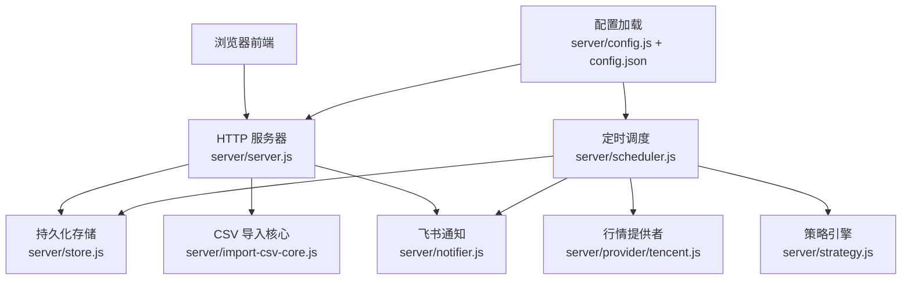
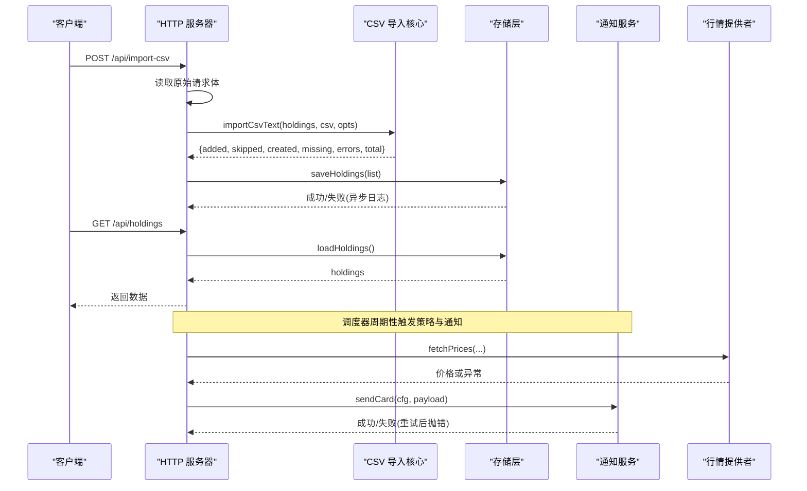
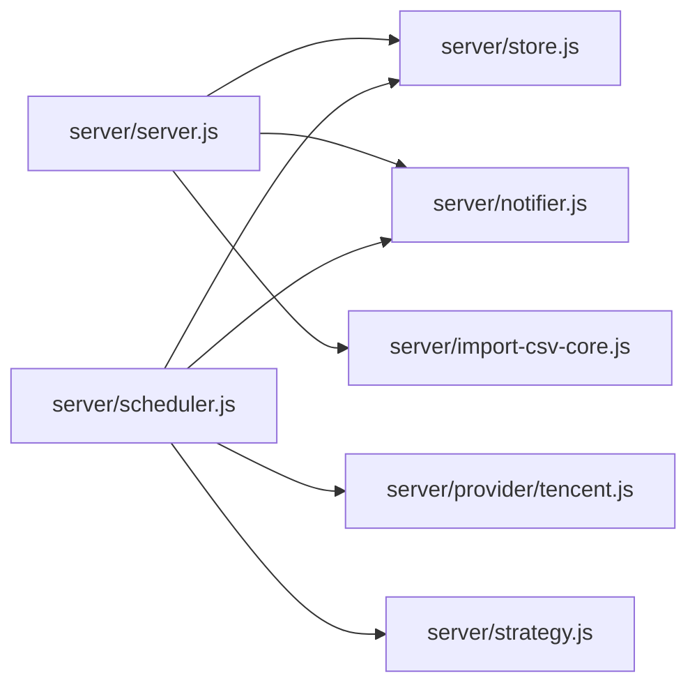

# 错误处理策略

<cite>
**本文引用的文件**
- [server/index.js](file://server/index.js)
- [server/server.js](file://server/server.js)
- [server/import-csv-core.js](file://server/import-csv-core.js)
- [server/store.js](file://server/store.js)
- [server/notifier.js](file://server/notifier.js)
- [server/scheduler.js](file://server/scheduler.js)
- [server/config.js](file://server/config.js)
- [server/strategy.js](file://server/strategy.js)
- [config.json](file://config.json)
- [web/src/composables/useHoldings.js](file://web/src/composables/useHoldings.js)
- [web/src/components/ImportCsvModal.vue](file://web/src/components/ImportCsvModal.vue)
- [server/provider/tencent.js](file://server/provider/tencent.js)
</cite>

## 目录
1. [简介](#简介)
2. [项目结构](#项目结构)
3. [核心组件](#核心组件)
4. [架构总览](#架构总览)
5. [详细组件分析](#详细组件分析)
6. [依赖关系分析](#依赖关系分析)
7. [性能与可靠性考量](#性能与可靠性考量)
8. [故障排除指南](#故障排除指南)
9. [结论](#结论)
10. [附录：错误分类与恢复矩阵](#附录错误分类与恢复矩阵)

## 简介
本技术文档聚焦 Stock Advisor 的错误处理策略，覆盖错误分类（解析错误、验证错误、业务错误、系统错误）、错误恢复机制（部分失败处理、数据回滚、状态恢复）、错误日志记录、用户反馈机制、错误预防策略以及诊断与排障方法。目标是帮助开发者快速定位问题、提升系统健壮性，并为用户提供清晰的错误提示与进度反馈。

## 项目结构
Stock Advisor 采用前后端分离的 Node.js + Vue 架构：
- 后端提供 HTTP API、调度器、数据存储、通知推送、策略评估与外部行情获取。
- 前端负责用户交互、请求封装、错误展示与导入结果可视化。

**图表来源**
- [server/server.js:567-594](file://server/server.js#L567-L594)
- [server/store.js:40-70](file://server/store.js#L40-L70)
- [server/import-csv-core.js:170-306](file://server/import-csv-core.js#L170-L306)
- [server/notifier.js:81-112](file://server/notifier.js#L81-L112)
- [server/scheduler.js:65-178](file://server/scheduler.js#L65-L178)
- [server/provider/tencent.js:6-42](file://server/provider/tencent.js#L6-L42)
- [server/strategy.js:34-91](file://server/strategy.js#L34-L91)
- [server/config.js:7-10](file://server/config.js#L7-L10)
- [config.json:1-19](file://config.json#L1-L19)

**章节来源**
- [server/index.js:1-17](file://server/index.js#L1-L17)
- [server/server.js:567-594](file://server/server.js#L567-L594)
- [server/scheduler.js:65-178](file://server/scheduler.js#L65-L178)
- [server/store.js:40-70](file://server/store.js#L40-L70)

## 核心组件
- HTTP 服务器与路由：统一入口，集中错误响应格式与兜底逻辑。
- 持仓存储：内存缓存 + 串行写盘，避免并发冲突；自动迁移旧模型。
- CSV 导入：幂等导入，支持缺失列校验、匹配规则、增量统计与错误收集。
- 通知推送：飞书卡片消息，带重试与签名。
- 调度器：交易时段感知、批量拉取行情、策略评估、告警冷却与状态落盘。
- 策略引擎：基于多次买入记录的止盈/止损/补仓判断。
- 前端交互：统一错误捕获、进度展示与结果统计。

**章节来源**
- [server/server.js:55-87](file://server/server.js#L55-L87)
- [server/store.js:8-12](file://server/store.js#L8-L12)
- [server/import-csv-core.js:170-306](file://server/import-csv-core.js#L170-L306)
- [server/notifier.js:81-112](file://server/notifier.js#L81-L112)
- [server/scheduler.js:65-178](file://server/scheduler.js#L65-L178)
- [server/strategy.js:34-91](file://server/strategy.js#L34-L91)
- [web/src/composables/useHoldings.js:15-29](file://web/src/composables/useHoldings.js#L15-L29)

## 架构总览
错误处理贯穿“请求进入 → 参数校验 → 业务处理 → 持久化 → 通知 → 响应”的全链路。关键节点包括：
- 请求体解析与 JSON 校验
- 业务参数验证（必填字段、数值范围）
- 业务规则校验（卖出数量不超过持仓、唯一键幂等）
- 外部依赖异常（网络、编码、第三方 API）
- 持久化异常（磁盘写入失败）
- 通知失败（飞书推送）
- 全局未捕获异常兜底

**图表来源**
- [server/server.js:416-435](file://server/server.js#L416-L435)
- [server/import-csv-core.js:170-306](file://server/import-csv-core.js#L170-L306)
- [server/store.js:40-70](file://server/store.js#L40-L70)
- [server/notifier.js:81-112](file://server/notifier.js#L81-L112)
- [server/provider/tencent.js:6-42](file://server/provider/tencent.js#L6-L42)
- [server/scheduler.js:65-178](file://server/scheduler.js#L65-L178)

## 详细组件分析

### 错误分类体系
- 解析错误
  - 定义：请求体 JSON 解析失败、CSV 表头缺失必需列、编码解码异常。
  - 处理方式：立即返回 400 错误信息；CSV 导入时跳过非法行并记录错误项。
  - 示例路径：[server/server.js:60-73](file://server/server.js#L60-L73)、[server/import-csv-core.js:170-188](file://server/import-csv-core.js#L170-L188)、[server/provider/tencent.js:17-23](file://server/provider/tencent.js#L17-L23)。
- 验证错误
  - 定义：必填字段缺失、数值不合法（如买入价/数量为正）、类型不匹配。
  - 处理方式：抛出明确错误消息，接口返回 400；前端显示具体字段问题。
  - 示例路径：[server/server.js:286-307](file://server/server.js#L286-L307)、[server/import-csv-core.js:44-58](file://server/import-csv-core.js#L44-L58)。
- 业务错误
  - 定义：违反业务规则（如卖出数量超过持仓、重复明细忽略）。
  - 处理方式：抛出错误并返回 400；CSV 导入将错误记录到 errors 数组，继续处理其他行。
  - 示例路径：[server/server.js:346-407](file://server/server.js#L346-L407)、[server/import-csv-core.js:60-80](file://server/import-csv-core.js#L60-L80)、[server/import-csv-core.js:226-239](file://server/import-csv-core.js#L226-L239)。
- 系统错误
  - 定义：外部依赖失败（网络超时、HTTP 非 2xx、编码异常）、持久化失败、未知异常。
  - 处理方式：记录日志、降级或重试（通知 3 次重试）、返回 500/502；调度器在异常后继续循环。
  - 示例路径：[server/server.js:583-586](file://server/server.js#L583-L586)、[server/notifier.js:96-110](file://server/notifier.js#L96-L110)、[server/scheduler.js:77-86](file://server/scheduler.js#L77-L86)、[server/store.js:62-69](file://server/store.js#L62-L69)。

**章节来源**
- [server/server.js:60-87](file://server/server.js#L60-L87)
- [server/server.js:286-407](file://server/server.js#L286-L407)
- [server/import-csv-core.js:44-80](file://server/import-csv-core.js#L44-L80)
- [server/import-csv-core.js:170-239](file://server/import-csv-core.js#L170-L239)
- [server/notifier.js:96-110](file://server/notifier.js#L96-L110)
- [server/scheduler.js:77-86](file://server/scheduler.js#L77-L86)
- [server/store.js:62-69](file://server/store.js#L62-L69)
- [server/provider/tencent.js:17-23](file://server/provider/tencent.js#L17-L23)

### 错误恢复机制
- 部分失败处理
  - CSV 导入：对每条记录独立 try/catch，错误记录到 errors，不影响其他行处理；返回统计信息（新增、跳过、创建、缺失、错误数）。
  - 调度器：外部行情拉取失败时记录日志并降级为空映射，继续处理其他持仓。
- 数据回滚
  - 当前实现以“先计算再落盘”为主，未显式事务回滚；但通过串行写盘与内存缓存一致性降低风险。
  - 建议：对复杂多步操作引入事务或快照回滚（例如在应用交易前保存副本，失败则恢复）。
- 状态恢复
  - 存储层：首次加载或检测到外部文件修改时重新读盘；旧模型自动迁移为 purchases 模型并写回。
  - 调度器：异常后继续循环，使用配置间隔重启任务，保证系统自愈。
  - 通知：失败重试 3 次，指数退避，最终抛错由调用方记录。

**章节来源**
- [server/import-csv-core.js:273-303](file://server/import-csv-core.js#L273-L303)
- [server/scheduler.js:77-86](file://server/scheduler.js#L77-L86)
- [server/store.js:40-58](file://server/store.js#L40-L58)
- [server/notifier.js:96-110](file://server/notifier.js#L96-L110)
- [server/scheduler.js:167-178](file://server/scheduler.js#L167-L178)

### 错误日志记录
- 服务端日志
  - 服务器全局 catch：记录未处理异常并返回 500。
  - 调度器：记录行情拉取失败、通知失败、跳过无行情品种。
  - 存储层：写盘失败记录错误日志。
- 上下文捕获
  - CSV 导入：errors 包含原始记录与错误消息，便于定位问题行。
  - 通知：携带品种、代码、市场、类型、当前价与建议，便于追踪触发原因。
- 调试信息输出
  - 启动信息：端口、刷新间隔、模式（交易时段/非交易时段）。
  - 周期日志：tick 时间、模式、持仓数量与更新状态。

**章节来源**
- [server/server.js:583-586](file://server/server.js#L583-L586)
- [server/scheduler.js:77-86](file://server/scheduler.js#L77-L86)
- [server/scheduler.js:161-164](file://server/scheduler.js#L161-L164)
- [server/store.js:62-69](file://server/store.js#L62-L69)
- [server/import-csv-core.js:300-303](file://server/import-csv-core.js#L300-L303)
- [server/notifier.js:81-112](file://server/notifier.js#L81-L112)

### 用户反馈机制
- 错误消息格式化
  - 接口统一返回 { error } 或 { data }，前端根据 res.ok 判断并展示错误。
  - CSV 导入返回结构化统计，前端分区域展示新增、跳过、新建、缺失与错误。
- 进度报告
  - 前端导入模态框显示“导入中…”禁用关闭，完成后展示结果。
  - 自动刷新倒计时，刷新后重置。
- 结果统计
  - CSV 导入结果包含 added、skipped、created、missing、errors、total。
  - 概览汇总：总成本、总市值、持有收益、今日收益等。

**章节来源**
- [web/src/composables/useHoldings.js:15-29](file://web/src/composables/useHoldings.js#L15-L29)
- [web/src/composables/useHoldings.js:67-130](file://web/src/composables/useHoldings.js#L67-L130)
- [web/src/components/ImportCsvModal.vue:49-73](file://web/src/components/ImportCsvModal.vue#L49-L73)
- [web/src/components/ImportCsvModal.vue:120-163](file://web/src/components/ImportCsvModal.vue#L120-L163)
- [server/import-csv-core.js:170-306](file://server/import-csv-core.js#L170-L306)

### 错误预防策略
- 输入预验证
  - 必填字段检查（name、code、region、type），数值范围校验（buyPrice/buyQuantity > 0）。
  - CSV 表头必需列检查（代码、操作、日期、数量、价格）。
- 边界检查
  - 卖出数量不得超过持仓数量；重复明细按唯一键忽略。
  - 价格/昨收为空时跳过计算，避免 NaN 传播。
- 异常防护
  - 外部依赖失败捕获并降级（行情为空映射）。
  - 通知失败重试与签名校验，避免静默失败。
  - 存储层串行写盘，防止并发覆盖。

**章节来源**
- [server/server.js:286-307](file://server/server.js#L286-L307)
- [server/server.js:346-407](file://server/server.js#L346-L407)
- [server/import-csv-core.js:170-188](file://server/import-csv-core.js#L170-L188)
- [server/import-csv-core.js:226-239](file://server/import-csv-core.js#L226-L239)
- [server/scheduler.js:77-86](file://server/scheduler.js#L77-L86)
- [server/notifier.js:96-110](file://server/notifier.js#L96-L110)
- [server/store.js:62-69](file://server/store.js#L62-L69)

### 错误诊断工具与排障指南
- 快速定位
  - 查看 CSV 导入 errors 列表，定位具体记录与错误原因。
  - 检查调度器日志中的 [stock-fetch]、[fund-fetch]、[notify]、[notify-daily] 标记。
  - 确认飞书 webhook 与 secret 配置是否正确。
- 常见问题
  - 行情为空：检查网络、User-Agent/Referer 头、编码解码（GBK/UTF-8）。
  - 写入失败：检查磁盘权限与路径；关注 store 层错误日志。
  - 通知失败：检查回调码非 0 的情况，查看重试次数与错误详情。
- 调试步骤
  - 使用 /api/test-feishu 测试通知通道。
  - 手动上传 CSV 并勾选“自动新建持仓”，观察 missing 与 createdCodes。
  - 调整 notify.cooldownSeconds 与 schedule.intervalSeconds 控制频率与冷却。

**章节来源**
- [server/import-csv-core.js:300-303](file://server/import-csv-core.js#L300-L303)
- [server/scheduler.js:77-86](file://server/scheduler.js#L77-L86)
- [server/scheduler.js:114-123](file://server/scheduler.js#L114-L123)
- [server/server.js:546-562](file://server/server.js#L546-L562)
- [server/provider/tencent.js:6-42](file://server/provider/tencent.js#L6-L42)
- [config.json:1-19](file://config.json#L1-L19)

## 依赖关系分析
- 模块耦合
  - server.js 依赖 store、notifier、import-csv-core。
  - scheduler.js 依赖 store、provider、strategy、notifier。
  - notifier.js 依赖 crypto 与配置。
  - provider/tencent.js 依赖网络与编码解码。
- 外部依赖
  - 腾讯行情 API、飞书机器人 Webhook。
- 潜在循环依赖
  - 当前未发现循环引用；各模块职责清晰。
- 接口契约
  - 接口统一返回 { data } 或 { error }；错误消息简洁明确。
  - CSV 导入返回结构化统计，便于前端展示与排障。

**图表来源**
- [server/server.js:567-594](file://server/server.js#L567-L594)
- [server/scheduler.js:65-178](file://server/scheduler.js#L65-L178)
- [server/store.js:40-70](file://server/store.js#L40-L70)
- [server/notifier.js:81-112](file://server/notifier.js#L81-L112)
- [server/provider/tencent.js:6-42](file://server/provider/tencent.js#L6-L42)
- [server/strategy.js:34-91](file://server/strategy.js#L34-L91)

**章节来源**
- [server/server.js:567-594](file://server/server.js#L567-L594)
- [server/scheduler.js:65-178](file://server/scheduler.js#L65-L178)

## 性能与可靠性考量
- 并发与一致性
  - 存储层串行写盘，避免并发覆盖；内存缓存减少重复 IO。
- 容错与降级
  - 外部依赖失败不中断主流程；通知失败重试；行情为空时跳过计算。
- 资源消耗
  - 非交易时段降频刷新；通知冷却避免刷屏。
- 可扩展性
  - 策略枚举集中管理；CSV 导入支持多种列名兼容；通知模板可复用。

[本节为通用指导，无需特定文件引用]

## 故障排除指南
- 现象：导入 CSV 报错“缺少必需列”
  - 排查：确认表头包含代码、操作、日期、数量、价格；查看错误消息中的当前表头。
  - 参考：[server/import-csv-core.js:170-188](file://server/import-csv-core.js#L170-L188)
- 现象：卖出记录失败“卖出数量超过持仓数量”
  - 排查：核对买入记录总量与卖出数量；检查 LIFO 成本计算是否合理。
  - 参考：[server/server.js:346-407](file://server/server.js#L346-L407)、[server/import-csv-core.js:60-80](file://server/import-csv-core.js#L60-L80)
- 现象：行情为空或价格异常
  - 排查：检查网络连通性、UA/Referer、编码解码；查看 [stock-fetch]/[fund-fetch] 日志。
  - 参考：[server/scheduler.js:77-86](file://server/scheduler.js#L77-L86)、[server/provider/tencent.js:6-42](file://server/provider/tencent.js#L6-L42)
- 现象：飞书通知失败
  - 排查：检查 webhook 与 secret；查看重试后的错误详情；使用 /api/test-feishu 测试。
  - 参考：[server/notifier.js:81-112](file://server/notifier.js#L81-L112)、[server/server.js:546-562](file://server/server.js#L546-L562)
- 现象：数据未持久化或丢失
  - 排查：检查磁盘权限与路径；查看 store 层错误日志；确认串行写盘是否完成。
  - 参考：[server/store.js:62-69](file://server/store.js#L62-L69)

**章节来源**
- [server/import-csv-core.js:170-188](file://server/import-csv-core.js#L170-L188)
- [server/server.js:346-407](file://server/server.js#L346-L407)
- [server/import-csv-core.js:60-80](file://server/import-csv-core.js#L60-L80)
- [server/scheduler.js:77-86](file://server/scheduler.js#L77-L86)
- [server/provider/tencent.js:6-42](file://server/provider/tencent.js#L6-L42)
- [server/notifier.js:81-112](file://server/notifier.js#L81-L112)
- [server/server.js:546-562](file://server/server.js#L546-L562)
- [server/store.js:62-69](file://server/store.js#L62-L69)

## 结论
Stock Advisor 的错误处理策略以“分类清晰、局部恢复、可观测性强”为核心：
- 解析、验证、业务、系统四类错误均有明确的处理路径与用户反馈。
- 部分失败容忍（CSV 导入、行情拉取）与重试机制（通知）提升鲁棒性。
- 日志与上下文捕获便于快速定位问题；前端统计与进度提示改善用户体验。
- 建议在未来引入更严格的事务回滚与单元测试覆盖，进一步提升可靠性与可维护性。

[本节为总结，无需特定文件引用]

## 附录：错误分类与恢复矩阵
- 解析错误
  - 场景：JSON 解析失败、CSV 表头缺失、编码解码异常
  - 处理：立即返回 400；跳过非法行；记录错误上下文
  - 恢复：修正输入或配置；重试解析
- 验证错误
  - 场景：必填字段缺失、数值不合法
  - 处理：抛出错误并返回 400；前端高亮字段
  - 恢复：修正输入；增加前端实时校验
- 业务错误
  - 场景：卖出超量、重复明细、策略阈值不满足
  - 处理：抛出错误并返回 400；CSV 导入记录 errors
  - 恢复：修正业务数据；调整阈值或策略
- 系统错误
  - 场景：网络失败、磁盘写入失败、未知异常
  - 处理：记录日志；降级或重试；返回 500/502
  - 恢复：修复依赖；重试；扩容或切换源

[本节为概念性内容，无需特定文件引用]