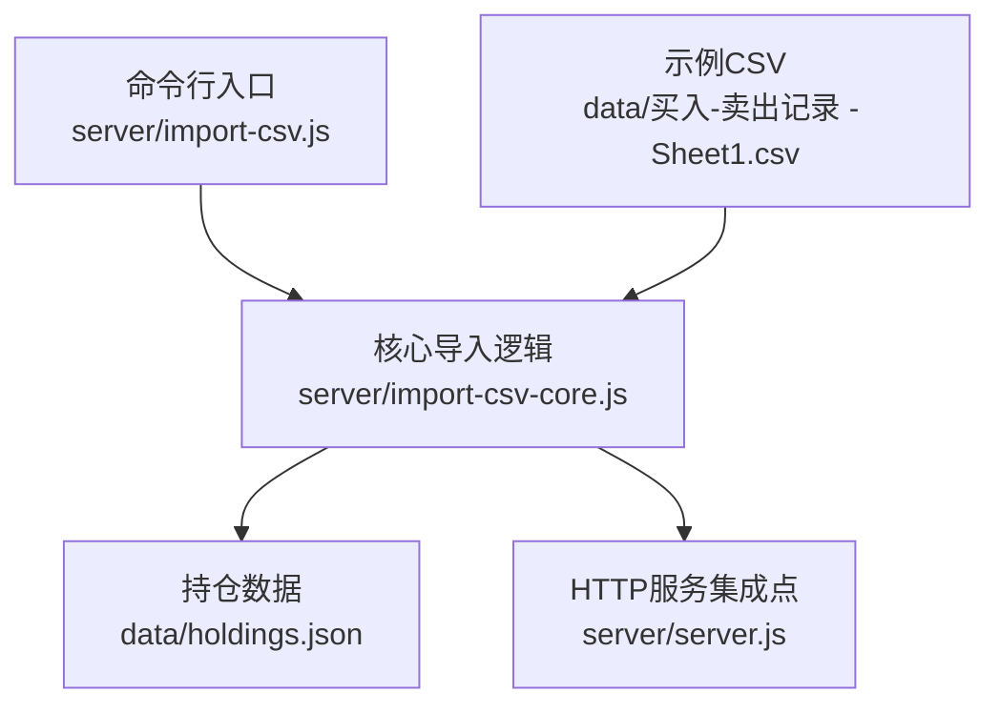
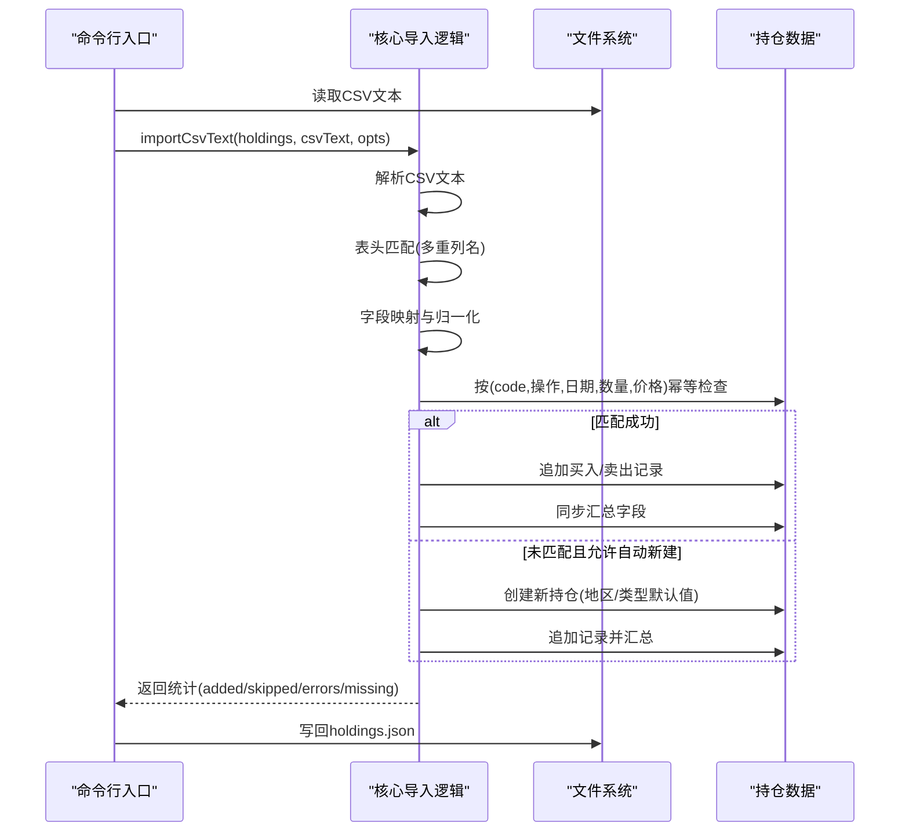
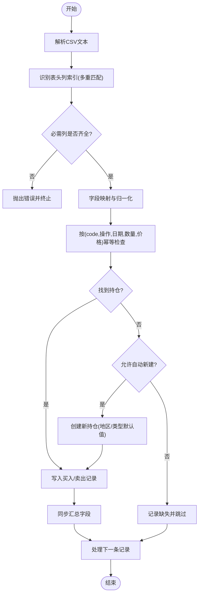
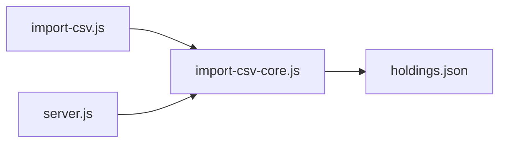

# 字段映射规则

<cite>
**本文引用的文件**
- [import-csv-core.js](file://server/import-csv-core.js)
- [import-csv.js](file://server/import-csv.js)
- [买入-卖出记录 - Sheet1.csv](file://data/买入-卖出记录 - Sheet1.csv)
- [holdings.json](file://data/holdings.json)
- [server.js](file://server/server.js)
</cite>

## 目录
1. [简介](#简介)
2. [项目结构](#项目结构)
3. [核心组件](#核心组件)
4. [架构总览](#架构总览)
5. [详细组件分析](#详细组件分析)
6. [依赖关系分析](#依赖关系分析)
7. [性能考量](#性能考量)
8. [故障排查指南](#故障排查指南)
9. [结论](#结论)
10. [附录：字段映射对照表与配置示例](#附录字段映射对照表与配置示例)

## 简介
本技术文档聚焦 Stock Advisor 的 CSV 导入字段映射机制，系统性解析从 CSV 表头到内部数据模型的映射规则、匹配算法、日期标准化、操作类型映射、元数据处理策略以及幂等性保证。目标是帮助使用者理解并正确准备 CSV 文件，确保批量导入稳定可靠。

## 项目结构
CSV 导入由命令行脚本与 HTTP 接口共享同一套核心逻辑：
- 命令行入口：负责读取 CSV 文本与 holdings 数据，调用核心导入函数，写回结果并输出统计信息。
- 核心逻辑：实现 CSV 解析、表头列名匹配、数据归一化、持仓匹配（精确与数字归一化）、买卖记录写入、汇总同步与错误收集。
- 数据模型：以 holdings.json 为持久化载体，每条记录包含基础信息、交易明细（purchases/sells）及汇总字段。

图表来源
- [import-csv.js:1-87](file://server/import-csv.js#L1-L87)
- [import-csv-core.js:1-307](file://server/import-csv-core.js#L1-L307)
- [server.js:1-200](file://server/server.js#L1-L200)

章节来源
- [import-csv.js:1-87](file://server/import-csv.js#L1-L87)
- [import-csv-core.js:1-307](file://server/import-csv-core.js#L1-L307)

## 核心组件
- CSV 解析器：支持 BOM、引号包裹、逗号分隔；返回二维数组便于后续处理。
- 表头匹配器：通过“多重列名匹配”定位各字段列索引，支持同义列名集合。
- 数据归一化：
  - 日期标准化：统一为 YYYY-MM-DD，兼容多种分隔符。
  - 代码归一化：提取纯数字用于兜底匹配。
- 操作类型映射：将“买入/卖出”文本映射为内部枚举 BUY/SELL。
- 持仓匹配：优先精确匹配 code，其次数字归一化匹配。
- 幂等控制：基于 (code, 操作, 日期, 数量, 价格) 的唯一键去重。
- 汇总同步：根据 purchases/sells 计算成本、均价、状态等汇总字段。

章节来源
- [import-csv-core.js:8-36](file://server/import-csv-core.js#L8-L36)
- [import-csv-core.js:170-307](file://server/import-csv-core.js#L170-L307)

## 架构总览
下图展示从 CSV 到 holdings 的完整导入流程，包括表头识别、字段映射、匹配与写入、汇总更新与结果统计。

图表来源
- [import-csv.js:37-79](file://server/import-csv.js#L37-L79)
- [import-csv-core.js:170-307](file://server/import-csv-core.js#L170-L307)

## 详细组件分析

### 表头匹配与字段映射
- 支持的多重列名匹配：
  - 名称：'股票/基金名称'、'名称'
  - 日期：'买入日期'、'卖出日期'、'日期'
  - 数量：'买入数量'、'卖出数量'、'数量'
  - 价格：'买入价'、'卖出价'、'价格'
- 必需字段校验：必须包含 '代码'、'操作'、'日期'、'数量'、'价格' 五列，否则抛出错误并提示当前表头。
- 可选字段：'序号'、'地区'、'类型' 存在则参与映射，不存在不影响导入。

章节来源
- [import-csv-core.js:170-210](file://server/import-csv-core.js#L170-L210)

### 代码匹配算法与优先级
- 精确匹配：CSV 中的 code 与 holdings 中记录的 code 完全相等时优先命中。
- 数字归一化匹配：当精确匹配失败时，提取 holdings.code 与 CSV code 中的纯数字进行比较，若一致则视为匹配成功。
- 匹配顺序：先精确匹配，再数字归一化匹配；两者均失败则视为缺失（可配置自动新建）。

章节来源
- [import-csv-core.js:212-224](file://server/import-csv-core.js#L212-L224)

### 日期格式标准化
- 输入支持：YYYY-MM-DD、YYYY/MM/DD、YYYY.MM.DD 等常见格式。
- 处理过程：正则识别年-月-日三段，补前导零后统一为 YYYY-MM-DD。
- 目的：保证幂等比较时日期字符串一致，避免重复导入或漏导入。

章节来源
- [import-csv-core.js:30-36](file://server/import-csv-core.js#L30-L36)

### 操作类型映射
- 文本到枚举：
  - 包含“卖”字的操作映射为 SELL
  - 其他情况映射为 BUY
- 影响：决定写入 purchases 还是 sells，并触发不同的成本计算与汇总逻辑。

章节来源
- [import-csv-core.js:205-206](file://server/import-csv-core.js#L205-L206)

### 元数据映射与默认值
- 地区（region）：来自 CSV 的“地区”列；若无则留空。
- 类型（type）：来自 CSV 的“类型”列；若无则留空。
- 自动新建持仓：当 createMissing=true 且匹配不到持仓时，使用 name/code/region/type 创建新持仓；region/type 为空时保持空字符串。

章节来源
- [import-csv-core.js:131-156](file://server/import-csv-core.js#L131-L156)
- [import-csv-core.js:250-264](file://server/import-csv-core.js#L250-L264)

### 幂等性与唯一键
- 唯一键定义：(code, 操作, 日期, 数量, 价格)
- 去重策略：对同一持仓的 purchases/sells 列表逐项比对，数值采用浮点容差比较，日期字符串严格相等。
- 效果：重复导入不会新增重复记录，保障数据一致性。

章节来源
- [import-csv-core.js:226-239](file://server/import-csv-core.js#L226-L239)

### 买入/卖出处理与汇总同步
- 买入：
  - 校验 buyPrice/buyQuantity 为正数
  - 生成 id、buyTime、目标止盈/止损率（继承自持仓）
  - 追加至 purchases
- 卖出：
  - 按 LIFO（最近买入优先）计算成本价、利润、收益率
  - 校验卖出数量不超过剩余持仓
  - 追加至 sells
- 汇总同步：
  - 计算总买入成本、总买入数量、已卖出成本与数量
  - 计算剩余成本、剩余数量、均价、最后买入价
  - 加权平均目标止盈/止损率
  - 更新状态（持有/全部卖出）与触发状态

章节来源
- [import-csv-core.js:43-80](file://server/import-csv-core.js#L43-L80)
- [import-csv-core.js:82-128](file://server/import-csv-core.js#L82-L128)
- [import-csv-core.js:273-299](file://server/import-csv-core.js#L273-L299)

### 流程图：CSV 导入主流程

图表来源
- [import-csv-core.js:170-307](file://server/import-csv-core.js#L170-L307)

## 依赖关系分析
- 模块耦合：
  - import-csv.js 依赖 import-csv-core.js 的核心导入能力
  - server.js 暴露 HTTP 接口时也复用 import-csv-core.js
- 外部依赖：
  - Node.js 文件系统读写
  - JSON 序列化/反序列化
- 数据流：
  - CSV → 解析 → 映射 → 匹配 → 写入 → 汇总 → 持久化

图表来源
- [import-csv.js:14-17](file://server/import-csv.js#L14-L17)
- [server.js:1-10](file://server/server.js#L1-L10)
- [import-csv-core.js:170-307](file://server/import-csv-core.js#L170-L307)

章节来源
- [import-csv.js:14-17](file://server/import-csv.js#L14-L17)
- [server.js:1-10](file://server/server.js#L1-L10)
- [import-csv-core.js:170-307](file://server/import-csv-core.js#L170-L307)

## 性能考量
- 时间复杂度：
  - 解析 CSV：O(N)，N 为行数
  - 构建匹配索引：O(M)，M 为 holdings 数量
  - 逐行处理：O(R*(P+S))，R 为记录数，P/S 为 purchases/sells 长度（幂等检查）
- 空间复杂度：
  - 存储 records 与索引 Map，线性于输入规模
- 优化建议：
  - 大数据量时考虑分批处理与增量索引
  - 幂等检查可引入哈希索引加速
  - 日志与错误聚合减少 I/O 开销

[本节为通用性能讨论，不直接分析具体文件]

## 故障排查指南
- 表头缺少必需列：
  - 现象：导入抛错并提示当前表头
  - 处理：确保 CSV 包含“代码/操作/日期/数量/价格”
- 数据行非法：
  - 现象：空行或数量/价格为非正数被跳过
  - 处理：检查数据完整性与格式
- 卖出数量超过持仓：
  - 现象：抛出错误并记录到 errors
  - 处理：核对卖出数量与历史买入累计
- 匹配不到持仓：
  - 现象：记录进入 missing
  - 处理：开启 --create-missing 自动新建，或手动在 holdings 中添加对应 code

章节来源
- [import-csv-core.js:186-188](file://server/import-csv-core.js#L186-L188)
- [import-csv-core.js:198-199](file://server/import-csv-core.js#L198-L199)
- [import-csv-core.js:265-267](file://server/import-csv-core.js#L265-L267)
- [import-csv-core.js:287-288](file://server/import-csv-core.js#L287-L288)

## 结论
Stock Advisor 的 CSV 导入机制通过灵活的多重列名匹配、严格的必需字段校验、稳健的日期与代码归一化、明确的幂等策略以及完善的汇总同步，实现了高鲁棒性的批量导入能力。配合自动新建持仓与详细的统计输出，用户可高效完成多市场、多类型的交易记录整合。

[本节为总结性内容，不直接分析具体文件]

## 附录：字段映射对照表与配置示例

### 字段映射对照表
- 名称
  - CSV 列名：'股票/基金名称'、'名称'
  - 内部字段：name
  - 说明：用于显示与新建持仓时的名称
- 代码
  - CSV 列名：'代码'
  - 内部字段：code
  - 说明：匹配持仓的关键字段，支持精确与数字归一化匹配
- 地区
  - CSV 列名：'地区'
  - 内部字段：region
  - 说明：可选；新建持仓时若为空则为空字符串
- 类型
  - CSV 列名：'类型'
  - 内部字段：type
  - 说明：可选；新建持仓时若为空则为空字符串
- 操作
  - CSV 列名：'操作'
  - 内部字段：oper（BUY/SELL）
  - 说明：包含“卖”字映射为 SELL，否则 BUY
- 日期
  - CSV 列名：'买入日期'、'卖出日期'、'日期'
  - 内部字段：date（标准化为 YYYY-MM-DD）
  - 说明：用于幂等比较与排序
- 数量
  - CSV 列名：'买入数量'、'卖出数量'、'数量'
  - 内部字段：qty
  - 说明：必须为正数
- 价格
  - CSV 列名：'买入价'、'卖出价'、'价格'
  - 内部字段：price
  - 说明：必须为正数
- 序号
  - CSV 列名：'序号'
  - 内部字段：seq
  - 说明：可选，仅保留原始序号

章节来源
- [import-csv-core.js:176-209](file://server/import-csv-core.js#L176-L209)

### 配置与用法示例
- 命令行参数
  - 默认导入：node server/import-csv.js
  - 指定 CSV：node server/import-csv.js <csv路径>
  - 自动新建持仓：node server/import-csv.js --create-missing
- 行为说明
  - 若默认 CSV 不存在，自动扫描 data 目录下非 holdings 的 .csv
  - 导入完成后写回 holdings.json 并输出统计信息（成功、跳过、新建、缺失、错误）

章节来源
- [import-csv.js:1-12](file://server/import-csv.js#L1-L12)
- [import-csv.js:24-35](file://server/import-csv.js#L24-L35)
- [import-csv.js:37-79](file://server/import-csv.js#L37-L79)

### 示例 CSV 表头
- 参考示例：data/买入-卖出记录 - Sheet1.csv
- 典型列：序号, 股票/基金名称, 代码, 地区, 类型, 操作, 买入日期, 买入数量, 买入价

章节来源
- [买入-卖出记录 - Sheet1.csv:1-1](file://data/买入-卖出记录 - Sheet1.csv#L1-L1)

### 数据模型要点（与映射相关）
- 持仓对象关键字段：id, name, code, region, type, status, purchases[], sells[]
- 买入记录关键字段：id, buyPrice, buyQuantity, buyTime, targetProfitRate, stopLossRate
- 卖出记录关键字段：id, sellPrice, sellQuantity, sellDate, costPrice, profit, returnRate
- 汇总字段：cost, buyQuantity, position, avgCost, lastBuyPrice, targetProfitRate, stopLossRate, status, triggerState, notifiedAt

章节来源
- [holdings.json:1-200](file://data/holdings.json#L1-L200)
- [import-csv-core.js:131-156](file://server/import-csv-core.js#L131-L156)
- [import-csv-core.js:82-128](file://server/import-csv-core.js#L82-L128)