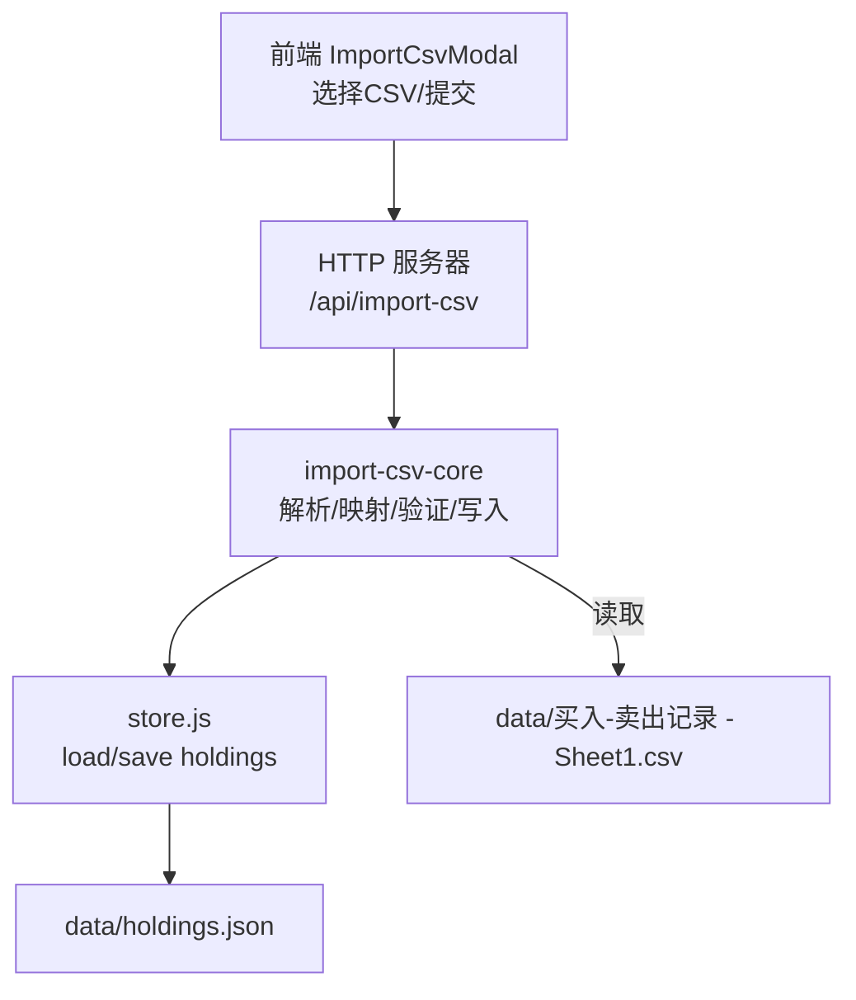
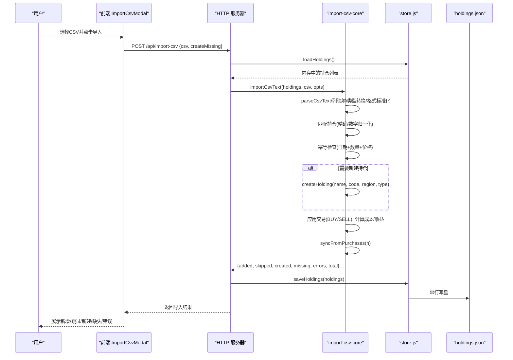
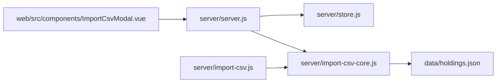
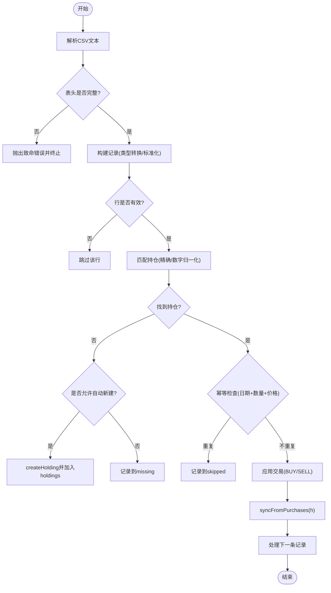

# 数据映射与验证

<cite>
**本文引用的文件**
- [server/import-csv-core.js](file://server/import-csv-core.js)
- [server/import-csv.js](file://server/import-csv.js)
- [server/server.js](file://server/server.js)
- [server/store.js](file://server/store.js)
- [web/src/components/ImportCsvModal.vue](file://web/src/components/ImportCsvModal.vue)
- [data/买入-卖出记录 - Sheet1.csv](file://data/买入-卖出记录 - Sheet1.csv)
- [data/holdings.json](file://data/holdings.json)
- [config.json](file://config.json)
</cite>

## 目录
1. [简介](#简介)
2. [项目结构](#项目结构)
3. [核心组件](#核心组件)
4. [架构总览](#架构总览)
5. [详细组件分析](#详细组件分析)
6. [依赖关系分析](#依赖关系分析)
7. [性能考量](#性能考量)
8. [故障排查指南](#故障排查指南)
9. [结论](#结论)
10. [附录](#附录)

## 简介
本技术文档聚焦 Stock Advisor 的数据映射与验证系统，围绕 CSV 字段到内部数据模型的映射规则、数据验证、清洗机制、转换逻辑、错误分类与处理策略、数据质量检查与报告生成，以及自定义验证规则的扩展方案进行系统化说明。目标是帮助开发者与使用者准确理解并安全扩展导入流程，确保数据一致性与可追溯性。

## 项目结构
系统采用前后端分离的 Node.js + Vue 架构：
- 后端提供 HTTP API，负责持仓数据的持久化、CSV 导入、交易计算与派生指标计算。
- 前端提供交互界面，支持选择 CSV 文件、配置导入选项（如自动新建持仓）、展示导入结果与错误信息。
- 数据以 JSON 文件持久化，通过内存缓存与串行写盘保证并发安全。

图表来源
- [server/server.js:416-435](file://server/server.js#L416-L435)
- [server/import-csv-core.js:170-306](file://server/import-csv-core.js#L170-L306)
- [server/store.js:40-70](file://server/store.js#L40-L70)
- [web/src/components/ImportCsvModal.vue:49-73](file://web/src/components/ImportCsvModal.vue#L49-L73)

章节来源
- [server/server.js:416-435](file://server/server.js#L416-L435)
- [server/import-csv-core.js:170-306](file://server/import-csv-core.js#L170-L306)
- [server/store.js:40-70](file://server/store.js#L40-L70)
- [web/src/components/ImportCsvModal.vue:49-73](file://web/src/components/ImportCsvModal.vue#L49-L73)

## 核心组件
- CSV 解析与映射：将 CSV 文本解析为结构化记录，按列名映射到内部字段，执行类型转换与格式标准化。
- 匹配与幂等：基于代码精确匹配或数字归一化匹配定位持仓；以“操作+日期+数量+价格”作为唯一键避免重复导入。
- 业务计算：买入记录规范化；卖出成本按 LIFO 计算；同步汇总字段（成本、均价、状态、加权止盈止损）。
- 存储与并发：内存缓存 + 串行写盘，外部文件变更检测与迁移兼容旧模型。
- 前端交互：文件选择、参数传递、结果与错误可视化。

章节来源
- [server/import-csv-core.js:7-36](file://server/import-csv-core.js#L7-L36)
- [server/import-csv-core.js:43-128](file://server/import-csv-core.js#L43-L128)
- [server/import-csv-core.js:170-306](file://server/import-csv-core.js#L170-L306)
- [server/store.js:24-70](file://server/store.js#L24-L70)
- [web/src/components/ImportCsvModal.vue:49-73](file://web/src/components/ImportCsvModal.vue#L49-L73)

## 架构总览
CSV 导入端到端流程如下：

图表来源
- [server/server.js:416-435](file://server/server.js#L416-L435)
- [server/import-csv-core.js:170-306](file://server/import-csv-core.js#L170-L306)
- [server/store.js:40-70](file://server/store.js#L40-L70)
- [web/src/components/ImportCsvModal.vue:49-73](file://web/src/components/ImportCsvModal.vue#L49-L73)

## 详细组件分析

### CSV 字段到内部数据模型的映射规则
- 表头识别：支持多别名列名，例如“股票/基金名称”或“名称”，“买入日期/卖出日期/日期”，“买入数量/卖出数量/数量”，“买入价/卖出价/价格”。
- 必填列校验：必须包含“代码”“操作”“日期”“数量”“价格”，否则抛出致命错误并终止导入。
- 行级过滤：空行或关键字段为空/非正数的行被跳过（视为无效数据）。
- 字段转换与标准化：
  - 操作：中文“卖”判定为 SELL，否则为 BUY。
  - 日期：统一为 YYYY-MM-DD，补前导零，提升幂等匹配稳定性。
  - 数量/价格：转换为数值型，要求大于 0。
  - 地区/类型：保留原始字符串用于后续创建持仓或展示。
- 代码匹配：
  - 优先精确匹配 holdings.code。
  - 若不存在，则提取数字部分进行归一化匹配（如 hk00700 → 700）。
- 幂等键：对同一持仓，BUY 使用 buyTime/buyQuantity/buyPrice，SELL 使用 sellDate/sellQuantity/sellPrice 组合判断是否已存在，避免重复导入。

章节来源
- [server/import-csv-core.js:175-209](file://server/import-csv-core.js#L175-L209)
- [server/import-csv-core.js:212-239](file://server/import-csv-core.js#L212-L239)
- [data/买入-卖出记录 - Sheet1.csv:1-15](file://data/买入-卖出记录 - Sheet1.csv#L1-L15)

### 数据验证规则
- 必填字段检查：
  - CSV 表头缺少必需列时抛出致命错误，阻止导入。
  - 单条记录中 code/oper/date/qty/price 任一为空或 qty/price 非正数，该行被跳过（不中断整体导入）。
- 格式验证：
  - 日期正则匹配并标准化为 YYYY-MM-DD。
  - 数量/价格强制数值且大于 0。
- 业务逻辑验证：
  - 买入：buyPrice > 0 且 buyQuantity > 0，否则抛错。
  - 卖出：按 LIFO 匹配成本，若卖出数量超过剩余持仓，抛错并记录错误。
- 异常收集：
  - 每条记录在 try/catch 中执行，捕获的业务错误被收集到 errors 数组，不影响其他记录继续处理。

章节来源
- [server/import-csv-core.js:186-198](file://server/import-csv-core.js#L186-L198)
- [server/import-csv-core.js:43-58](file://server/import-csv-core.js#L43-L58)
- [server/import-csv-core.js:60-80](file://server/import-csv-core.js#L60-L80)
- [server/import-csv-core.js:273-302](file://server/import-csv-core.js#L273-L302)

### 数据清洗机制
- 空值处理：
  - 空行或关键字段为空直接跳过，不计入统计。
  - 可选字段（名称、地区、类型）为空时保留空串，不影响导入。
- 重复项检测：
  - 基于“操作+日期+数量+价格”的幂等键去重，重复记录计入 skipped。
- 格式标准化：
  - 日期统一为 YYYY-MM-DD。
  - 操作标准化为 BUY/SELL。
- 异常值过滤：
  - 数量/价格非正数或无法解析的行被过滤。
  - 卖出超仓等逻辑异常被捕获并记录到 errors。

章节来源
- [server/import-csv-core.js:190-209](file://server/import-csv-core.js#L190-L209)
- [server/import-csv-core.js:226-239](file://server/import-csv-core.js#L226-L239)
- [server/import-csv-core.js:273-302](file://server/import-csv-core.js#L273-L302)

### 数据转换逻辑
- 日期格式转换：normalizeDate 将多种分隔符统一为 YYYY-MM-DD。
- 货币单位统一：当前实现未做币种换算，价格保持原值；如需统一需在此处扩展。
- 地区代码映射：region/type 透传到新创建的持仓对象；如需标准化可在 createHolding 前增加映射表。
- 成本与收益计算：
  - 买入：保存 buyPrice、buyQuantity、buyTime，并继承持仓级 targetProfitRate/stopLossRate。
  - 卖出：按 LIFO 计算 costPrice、profit、returnRate。
  - 同步汇总：cost、buyQuantity、avgCost、lastBuyPrice、targetProfitRate、stopLossRate、status、triggerState、notifiedAt。

章节来源
- [server/import-csv-core.js:30-36](file://server/import-csv-core.js#L30-L36)
- [server/import-csv-core.js:43-80](file://server/import-csv-core.js#L43-L80)
- [server/import-csv-core.js:82-128](file://server/import-csv-core.js#L82-L128)
- [server/import-csv-core.js:130-156](file://server/import-csv-core.js#L130-L156)

### 验证错误的分类与处理策略
- 致命错误（阻断导入）：
  - CSV 表头缺少必需列，直接抛错并终止。
- 警告信息（提示但不阻断）：
  - 匹配不到持仓的记录（missing），可通过 createMissing 自动新建。
  - 重复记录（skipped），无需处理。
- 可修复问题（逐条记录捕获）：
  - 买入价/数量非正、卖出超仓等业务异常，记录到 errors 并继续处理其他记录。
- 输出与反馈：
  - 命令行脚本打印汇总信息与明细。
  - 前端弹窗展示新增、跳过、新建、缺失、错误等信息。

章节来源
- [server/import-csv-core.js:186-188](file://server/import-csv-core.js#L186-L188)
- [server/import-csv-core.js:249-302](file://server/import-csv-core.js#L249-L302)
- [server/import-csv.js:54-79](file://server/import-csv.js#L54-L79)
- [web/src/components/ImportCsvModal.vue:120-159](file://web/src/components/ImportCsvModal.vue#L120-L159)

### 数据质量检查与报告生成机制
- 质量检查：
  - 表头校验、字段非空与正数校验、日期格式标准化、业务逻辑校验（买入/卖出）。
- 报告生成：
  - 返回对象包含 added、skipped、created、createdCodes、missing、errors、total。
  - 命令行脚本输出结构化日志，便于审计与排障。
  - 前端弹窗展示关键指标与明细列表，支持快速定位问题。

章节来源
- [server/import-csv-core.js:170-306](file://server/import-csv-core.js#L170-L306)
- [server/import-csv.js:54-79](file://server/import-csv.js#L54-L79)
- [web/src/components/ImportCsvModal.vue:120-159](file://web/src/components/ImportCsvModal.vue#L120-L159)

### 自定义验证规则的扩展方案与最佳实践
- 扩展点建议：
  - 在 importCsvText 中增加“预校验阶段”，在 records 构建后、匹配前插入自定义规则（如地区白名单、代码前缀校验）。
  - 在 normalizePurchase 或 computeSellCost 中扩展业务规则（如最大单笔数量限制、价格区间校验）。
  - 在 createHolding 前增加地区/类型映射表，统一编码规范。
- 最佳实践：
  - 将规则模块化，便于单元测试与复用。
  - 错误分级：致命错误抛错中止；警告与可修复问题收集到 result 中，便于前端展示与用户修正。
  - 幂等与回滚：导入过程尽量无副作用，失败时不修改 holdings；仅在成功路径写入。
  - 日志与追踪：为每条记录附加 seq 或 id，便于定位问题。

[本节为概念性内容，不直接分析具体文件]

## 依赖关系分析
- 模块耦合：
  - server/server.js 依赖 store.js 进行数据存取，依赖 import-csv-core.js 完成导入逻辑。
  - import-csv-core.js 是核心，独立于 HTTP 层，可被命令行脚本与 API 共用。
  - web/src/components/ImportCsvModal.vue 仅调用 /api/import-csv，与后端解耦。
- 外部依赖：
  - 文件系统读写（Node fs/promises）。
  - 前端静态资源托管（Vite 产物）。

图表来源
- [server/server.js:416-435](file://server/server.js#L416-L435)
- [server/import-csv.js:14-18](file://server/import-csv.js#L14-L18)
- [server/import-csv-core.js:170-306](file://server/import-csv-core.js#L170-L306)
- [server/store.js:40-70](file://server/store.js#L40-L70)

章节来源
- [server/server.js:416-435](file://server/server.js#L416-L435)
- [server/import-csv.js:14-18](file://server/import-csv.js#L14-L18)
- [server/import-csv-core.js:170-306](file://server/import-csv-core.js#L170-L306)
- [server/store.js:40-70](file://server/store.js#L40-L70)

## 性能考量
- 解析与映射：CSV 解析为二维数组，时间复杂度 O(N)，N 为行数；列映射与字段转换线性开销。
- 匹配与幂等：建立 Map 索引（精确与数字归一化），查找 O(1)；幂等检查遍历 purchases/sells，最坏 O(M)。
- 成本计算：LIFO 排序与累加，时间复杂度 O(P log P)（P 为买入记录数）。
- 存储：串行写盘避免并发冲突，写盘频率取决于导入批次大小。
- 优化建议：
  - 大数据量 CSV 可考虑流式解析以降低内存占用。
  - 对频繁访问的 holdings 建立更细粒度索引（如按 region/type）。
  - 批量写入合并减少 I/O 次数。

[本节提供通用指导，不直接分析具体文件]

## 故障排查指南
- 常见错误与处理：
  - 表头缺少必需列：检查 CSV 是否包含“代码/操作/日期/数量/价格”。
  - 匹配不到持仓：确认 holdings.json 是否存在对应代码；或使用 createMissing 自动新建。
  - 重复导入：检查幂等键（日期/数量/价格）是否完全一致。
  - 卖出超仓：核对买入记录总量与卖出数量。
  - 买入价/数量非正：修正 CSV 数值。
- 定位方法：
  - 查看命令行脚本输出的 missing/errors 明细。
  - 在前端弹窗中查看错误列表与对应记录。
  - 检查 holdings.json 中 purchases/sells 是否按预期更新。

章节来源
- [server/import-csv-core.js:186-188](file://server/import-csv-core.js#L186-L188)
- [server/import-csv-core.js:249-302](file://server/import-csv-core.js#L249-L302)
- [server/import-csv.js:54-79](file://server/import-csv.js#L54-L79)
- [web/src/components/ImportCsvModal.vue:120-159](file://web/src/components/ImportCsvModal.vue#L120-L159)

## 结论
Stock Advisor 的数据映射与验证系统通过清晰的字段映射、严格的验证规则、稳健的清洗机制与可靠的转换逻辑，实现了高可用、幂等的 CSV 导入能力。系统在设计上兼顾了可扩展性与可维护性，支持自定义验证规则与扩展点。结合前端友好的结果展示与命令行脚本的审计输出，能够有效支撑日常投资数据管理需求。

[本节总结性内容，不直接分析具体文件]

## 附录

### CSV 列名与内部字段映射表
- 序号 → seq（可选）
- 股票/基金名称/名称 → name（可选）
- 代码 → code（必填）
- 地区 → region（可选）
- 类型 → type（可选）
- 操作 → oper（BUY/SELL，必填）
- 买入日期/卖出日期/日期 → date（YYYY-MM-DD，必填）
- 买入数量/卖出数量/数量 → qty（>0，必填）
- 买入价/卖出价/价格 → price（>0，必填）

章节来源
- [server/import-csv-core.js:175-209](file://server/import-csv-core.js#L175-L209)
- [data/买入-卖出记录 - Sheet1.csv:1-15](file://data/买入-卖出记录 - Sheet1.csv#L1-L15)

### 关键流程图（算法视角）

图表来源
- [server/import-csv-core.js:170-306](file://server/import-csv-core.js#L170-L306)