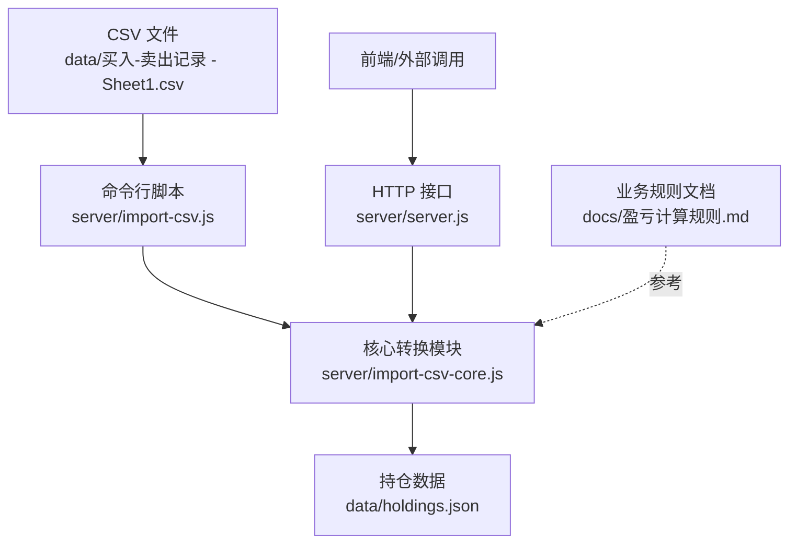
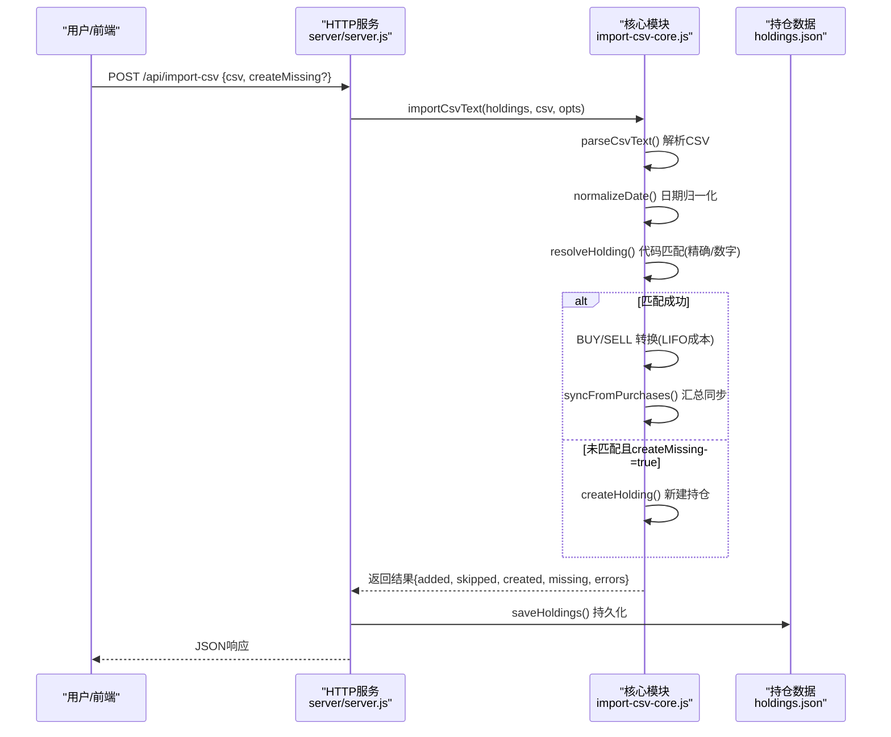
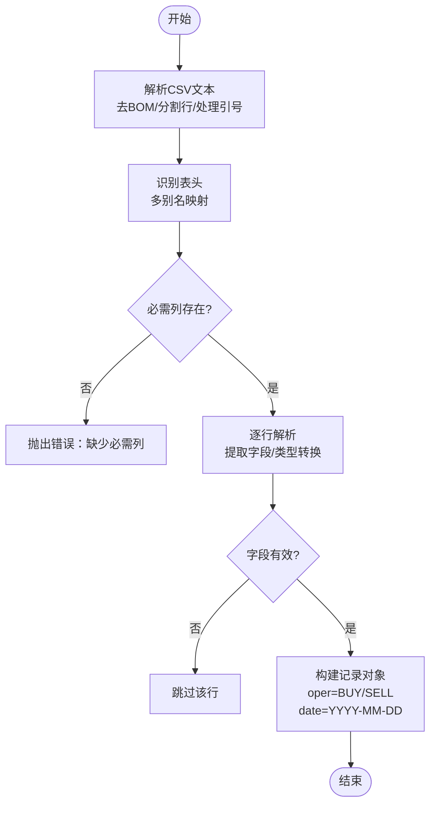
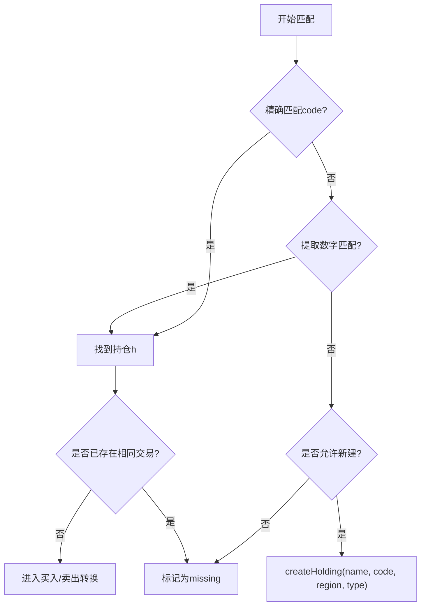
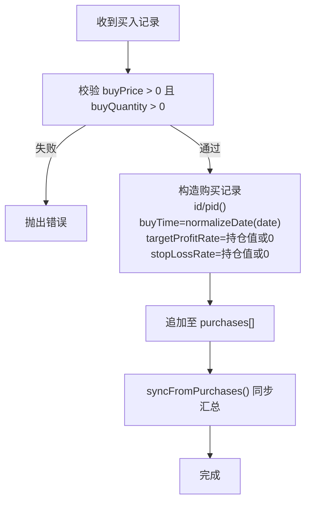
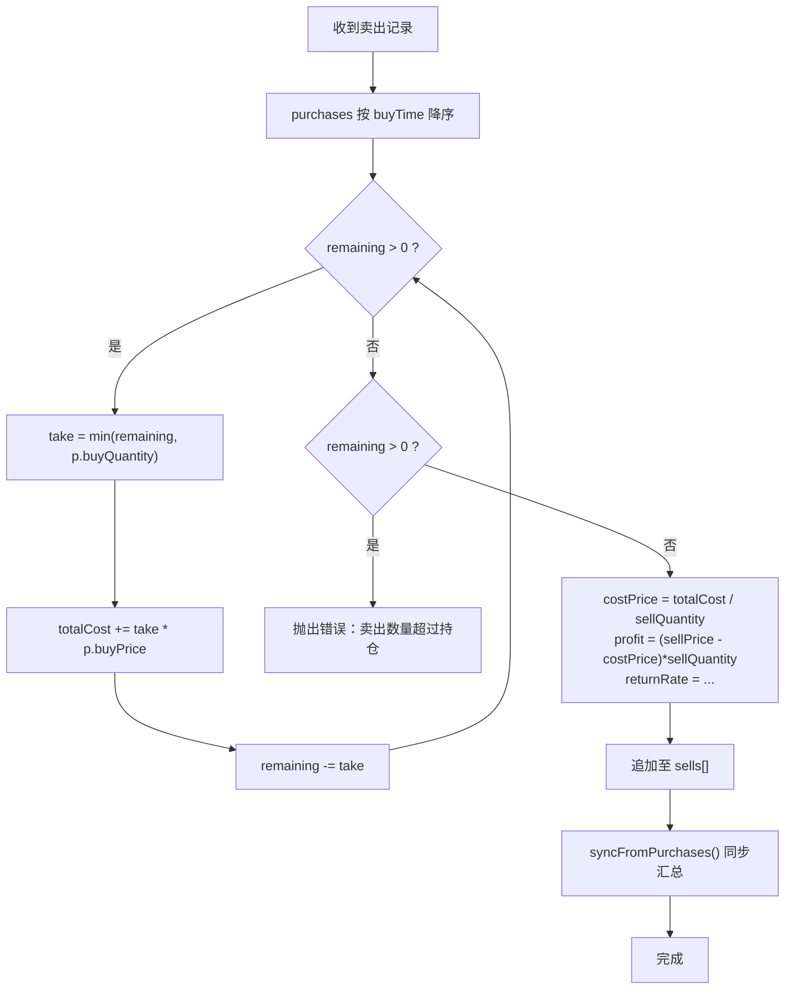
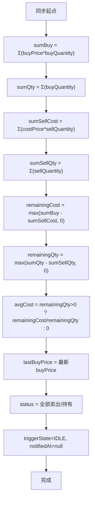
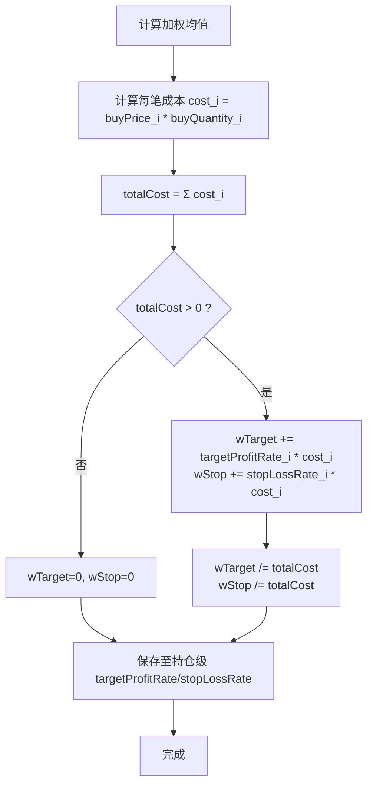
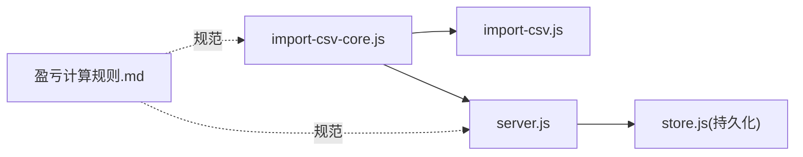

# 数据转换逻辑

<cite>
**本文引用的文件**
- [server/import-csv-core.js](file://server/import-csv-core.js)
- [server/import-csv.js](file://server/import-csv.js)
- [server/server.js](file://server/server.js)
- [config.json](file://config.json)
- [data/买入-卖出记录 - Sheet1.csv](file://data/买入-卖出记录 - Sheet1.csv)
- [data/holdings.json](file://data/holdings.json)
- [docs/盈亏计算规则.md](file://docs/盈亏计算规则.md)
</cite>

## 目录
1. [简介](#简介)
2. [项目结构](#项目结构)
3. [核心组件](#核心组件)
4. [架构总览](#架构总览)
5. [详细组件分析](#详细组件分析)
6. [依赖关系分析](#依赖关系分析)
7. [性能考虑](#性能考虑)
8. [故障排查指南](#故障排查指南)
9. [结论](#结论)
10. [附录：配置与扩展指南](#附录：配置与扩展指南)

## 简介
本技术文档聚焦 Stock Advisor 的 CSV 数据到内部数据模型的转换逻辑，覆盖以下关键点：
- 数值类型转换、字符串标准化与日期格式统一
- 买入记录的转换：成本计算、目标收益率与止损率的继承机制
- 卖出记录的转换算法：LIFO（后进先出）成本结转的实现细节
- 持仓汇总字段的同步计算：总成本、平均成本、持仓状态等的自动更新
- 止盈止损策略的加权平均计算逻辑
- 数据一致性保证机制与幂等性设计
- 转换规则的配置选项与自定义转换函数的开发指南

## 项目结构
本项目将“CSV导入”能力拆分为可复用的核心模块与入口脚本/HTTP接口：
- 核心转换逻辑位于 server/import-csv-core.js，提供解析、匹配、写入与汇总同步
- 命令行入口 server/import-csv.js 负责读取 CSV 与 holdings.json，调用核心逻辑并落盘
- HTTP 接口在 server/server.js 中暴露 /api/import-csv，复用同一核心逻辑
- 配置项集中在 config.json（调度、通知等），不直接参与转换逻辑
- 示例数据位于 data/买入-卖出记录 - Sheet1.csv 与 data/holdings.json
- 业务规则说明见 docs/盈亏计算规则.md

图表来源
- [server/import-csv.js:1-87](file://server/import-csv.js#L1-L87)
- [server/import-csv-core.js:1-307](file://server/import-csv-core.js#L1-L307)
- [server/server.js:416-435](file://server/server.js#L416-L435)
- [data/买入-卖出记录 - Sheet1.csv:1-26](file://data/买入-卖出记录 - Sheet1.csv#L1-L26)
- [data/holdings.json:1-462](file://data/holdings.json#L1-L462)
- [docs/盈亏计算规则.md:1-228](file://docs/盈亏计算规则.md#L1-L228)

章节来源
- [server/import-csv.js:1-87](file://server/import-csv.js#L1-L87)
- [server/import-csv-core.js:1-307](file://server/import-csv-core.js#L1-L307)
- [server/server.js:416-435](file://server/server.js#L416-L435)
- [data/买入-卖出记录 - Sheet1.csv:1-26](file://data/买入-卖出记录 - Sheet1.csv#L1-L26)
- [data/holdings.json:1-462](file://data/holdings.json#L1-L462)
- [docs/盈亏计算规则.md:1-228](file://docs/盈亏计算规则.md#L1-L228)

## 核心组件
- CSV 解析与标准化：支持 BOM、引号包裹、逗号分隔；表头多别名兼容；日期归一化为 YYYY-MM-DD
- 代码匹配：精确匹配 + 数字归一化兜底（如 hk00700 → 700）
- 幂等插入：以 (code, 操作, 日期, 数量, 价格) 为唯一键，重复记录跳过
- 买入记录转换：校验数值、生成 id、继承持仓级止盈/止损率
- 卖出记录转换：LIFO 计算成本均价、实现盈亏与收益率
- 汇总同步：按 purchases/sells 反推剩余成本/数量/均价、最近买入价、持仓状态、触发态重置
- 可选新建持仓：当 createMissing=true 且未匹配到时，按地区/类型新建持仓

章节来源
- [server/import-csv-core.js:7-36](file://server/import-csv-core.js#L7-L36)
- [server/import-csv-core.js:43-80](file://server/import-csv-core.js#L43-L80)
- [server/import-csv-core.js:82-128](file://server/import-csv-core.js#L82-L128)
- [server/import-csv-core.js:130-156](file://server/import-csv-core.js#L130-L156)
- [server/import-csv-core.js:170-307](file://server/import-csv-core.js#L170-L307)

## 架构总览
CSV 导入流程由两条路径驱动：
- 命令行：node server/import-csv.js 读取 data 目录下的 CSV，调用 importCsvText，写回 holdings.json
- HTTP：POST /api/import-csv 接收 csv 文本与可选 createMissing，调用同一核心逻辑并持久化

图表来源
- [server/server.js:416-435](file://server/server.js#L416-L435)
- [server/import-csv-core.js:170-307](file://server/import-csv-core.js#L170-L307)
- [server/import-csv-core.js:7-36](file://server/import-csv-core.js#L7-L36)
- [server/import-csv-core.js:130-156](file://server/import-csv-core.js#L130-L156)

章节来源
- [server/server.js:416-435](file://server/server.js#L416-L435)
- [server/import-csv-core.js:170-307](file://server/import-csv-core.js#L170-L307)

## 详细组件分析

### CSV 解析与字段映射
- 解析器支持 BOM 去除、引号内逗号保留、空行过滤
- 表头多别名兼容：名称、代码、地区、类型、操作、日期、数量、价格均支持多种列名
- 数据行过滤：缺失关键字段或数量/价格非正的行将被跳过

图表来源
- [server/import-csv-core.js:7-23](file://server/import-csv-core.js#L7-L23)
- [server/import-csv-core.js:175-210](file://server/import-csv-core.js#L175-L210)

章节来源
- [server/import-csv-core.js:7-23](file://server/import-csv-core.js#L7-L23)
- [server/import-csv-core.js:175-210](file://server/import-csv-core.js#L175-L210)

### 代码匹配与幂等性
- 匹配策略：优先精确匹配 holdings.code；若失败则提取数字部分进行归一化比较
- 幂等键：(code, 操作, 日期, 数量, 价格) 完全一致视为重复，跳过插入
- 缺失处理：未匹配到持仓时，若 enable createMissing，则按 name/code/region/type 新建持仓

图表来源
- [server/import-csv-core.js:212-224](file://server/import-csv-core.js#L212-L224)
- [server/import-csv-core.js:226-239](file://server/import-csv-core.js#L226-L239)
- [server/import-csv-core.js:249-268](file://server/import-csv-core.js#L249-L268)
- [server/import-csv-core.js:130-156](file://server/import-csv-core.js#L130-L156)

章节来源
- [server/import-csv-core.js:212-239](file://server/import-csv-core.js#L212-L239)
- [server/import-csv-core.js:249-268](file://server/import-csv-core.js#L249-L268)
- [server/import-csv-core.js:130-156](file://server/import-csv-core.js#L130-L156)

### 买入记录转换与收益策略继承
- 数值校验：buyPrice/buyQuantity 必须为正数
- 字段生成：id、buyTime、targetProfitRate、stopLossRate
- 继承机制：新买入记录默认继承当前持仓的目标收益率与止损率（若持仓未设置则为0）

图表来源
- [server/import-csv-core.js:43-58](file://server/import-csv-core.js#L43-L58)
- [server/import-csv-core.js:273-284](file://server/import-csv-core.js#L273-L284)
- [server/import-csv-core.js:82-128](file://server/import-csv-core.js#L82-L128)

章节来源
- [server/import-csv-core.js:43-58](file://server/import-csv-core.js#L43-L58)
- [server/import-csv-core.js:273-284](file://server/import-csv-core.js#L273-L284)
- [server/import-csv-core.js:82-128](file://server/import-csv-core.js#L82-L128)

### 卖出记录转换与 LIFO 成本结转
- LIFO 排序：按 buyTime 降序匹配最新买入
- 成本计算：累计取用数量直至满足 sellQuantity，计算 totalCost 与 costPrice
- 盈亏计算：profit = (sellPrice - costPrice) * sellQuantity；returnRate = (sellPrice - costPrice)/costPrice * 100
- 越界保护：若 remaining > 0 表示卖出数量超过持仓，抛出错误

图表来源
- [server/import-csv-core.js:60-80](file://server/import-csv-core.js#L60-L80)
- [server/import-csv-core.js:285-297](file://server/import-csv-core.js#L285-L297)
- [docs/盈亏计算规则.md:59-90](file://docs/盈亏计算规则.md#L59-L90)

章节来源
- [server/import-csv-core.js:60-80](file://server/import-csv-core.js#L60-L80)
- [server/import-csv-core.js:285-297](file://server/import-csv-core.js#L285-L297)
- [docs/盈亏计算规则.md:59-90](file://docs/盈亏计算规则.md#L59-L90)

### 持仓汇总字段的同步计算
- 总买入成本/数量：对 purchases 求和
- 已卖出成本/数量：对 sells 的 costPrice*sellQuantity 与 sellQuantity 求和
- 剩余成本/数量：max(总买入 - 已卖出, 0)
- 平均成本：剩余数量 > 0 ? 剩余成本 / 剩余数量 : 0
- 最近买入价：按 buyTime 倒序取第一条
- 持仓状态：全部卖出或持有
- 触发态重置：IDLE，通知时间清空

图表来源
- [server/import-csv-core.js:82-128](file://server/import-csv-core.js#L82-L128)
- [server/server.js:247-284](file://server/server.js#L247-L284)

章节来源
- [server/import-csv-core.js:82-128](file://server/import-csv-core.js#L82-L128)
- [server/server.js:247-284](file://server/server.js#L247-L284)

### 止盈止损策略的加权平均计算
- 权重来源：每笔买入的成本（buyPrice * buyQuantity）
- 加权均值：Σ(rate_i * cost_i) / Σ(cost_i)
- 存储位置：持仓级 targetProfitRate / stopLossRate
- 行为：新增买入会重新计算；卖出不会改变该加权均值（因为基于全部买入成本）

图表来源
- [server/import-csv-core.js:107-120](file://server/import-csv-core.js#L107-L120)
- [server/server.js:213-221](file://server/server.js#L213-L221)
- [docs/盈亏计算规则.md:178-187](file://docs/盈亏计算规则.md#L178-L187)

章节来源
- [server/import-csv-core.js:107-120](file://server/import-csv-core.js#L107-L120)
- [server/server.js:213-221](file://server/server.js#L213-L221)
- [docs/盈亏计算规则.md:178-187](file://docs/盈亏计算规则.md#L178-L187)

### 数据一致性保证机制
- 幂等性：重复交易（相同 code/操作/日期/数量/价格）会被跳过
- 类型安全：所有数值字段强制 Number 转换并校验范围
- 日期统一：normalizeDate 确保 YYYY-MM-DD，避免匹配不一致
- 异常隔离：单条记录出错不影响其他记录，errors 列表收集
- 状态一致性：每次写入后执行 syncFromPurchases，保证汇总字段与明细一致

章节来源
- [server/import-csv-core.js:226-239](file://server/import-csv-core.js#L226-L239)
- [server/import-csv-core.js:273-302](file://server/import-csv-core.js#L273-L302)
- [server/import-csv-core.js:82-128](file://server/import-csv-core.js#L82-L128)

## 依赖关系分析
- 核心模块 import-csv-core.js 被命令行脚本与 HTTP 服务共同复用，保证逻辑一致
- server/server.js 还包含展示层派生逻辑 withDerived，用于 API 返回合并的交易流水与汇总指标
- 业务规则文档 docs/盈亏计算规则.md 作为权威依据，指导实现与验证

图表来源
- [server/import-csv.js:14-18](file://server/import-csv.js#L14-L18)
- [server/server.js:5-7](file://server/server.js#L5-L7)
- [docs/盈亏计算规则.md:1-228](file://docs/盈亏计算规则.md#L1-L228)

章节来源
- [server/import-csv.js:14-18](file://server/import-csv.js#L14-L18)
- [server/server.js:5-7](file://server/server.js#L5-L7)
- [docs/盈亏计算规则.md:1-228](file://docs/盈亏计算规则.md#L1-L228)

## 性能考虑
- CSV 解析为 O(n)，n 为行数；匹配使用 Map 索引，近似 O(1) 查找
- LIFO 成本计算需对 purchases 排序，复杂度 O(m log m)，m 为买入记录数
- 汇总同步遍历 purchases 与 sells，复杂度 O(m + k)，k 为卖出记录数
- 建议：对于超大 CSV，可分批导入；对频繁更新的持仓，避免重复全量重算

[本节为通用性能讨论，不直接分析具体文件]

## 故障排查指南
- 表头缺失：若缺少代码/操作/日期/数量/价格任一列，将抛出错误并中止导入
- 数值非法：买入价/数量为非正数会报错；卖出数量超过持仓会报错
- 匹配不到：未匹配到持仓且未开启 createMissing，记录将列入 missing
- 重复导入：相同交易键的记录会被跳过，可在输出中看到 skipped 计数
- 错误收集：errors 数组包含每条失败记录的详细信息，便于定位问题

章节来源
- [server/import-csv-core.js:186-188](file://server/import-csv-core.js#L186-L188)
- [server/import-csv-core.js:47-49](file://server/import-csv-core.js#L47-L49)
- [server/import-csv-core.js:73-75](file://server/import-csv-core.js#L73-L75)
- [server/import-csv-core.js:265-268](file://server/import-csv-core.js#L265-L268)
- [server/import-csv-core.js:300-302](file://server/import-csv-core.js#L300-L302)

## 结论
本系统通过清晰的分层设计与可复用的核心模块，实现了稳健的 CSV 数据到内部模型转换。关键特性包括：
- 强一致的数值与日期规范化
- 幂等性与健壮的错误处理
- LIFO 成本结转与准确的盈亏计算
- 持仓汇总字段的实时同步
- 灵活的配置与可扩展的转换函数接口

这些设计确保了数据质量与系统稳定性，同时为后续扩展提供了良好基础。

[本节为总结性内容，不直接分析具体文件]

## 附录：配置与扩展指南

### 转换规则的配置选项
- createMissing：是否在未匹配到持仓时自动新建（命令行参数 --create-missing 或 HTTP body.createMissing）
- 表头别名：名称、日期、数量、价格等列支持多种命名，便于兼容不同导出格式
- 日期格式：支持 YYYY-MM-DD、YYYY/MM/DD、YYYY.MM.DD 等常见格式，统一归一化

章节来源
- [server/import-csv.js:37-49](file://server/import-csv.js#L37-L49)
- [server/import-csv-core.js:175-210](file://server/import-csv-core.js#L175-L210)
- [server/import-csv-core.js:30-36](file://server/import-csv-core.js#L30-L36)

### 自定义转换函数的开发指南
- 新增字段映射：在 parseCsvText 后的 records 构建阶段增加字段提取与清洗
- 自定义匹配策略：扩展 digitsOf 或新增匹配函数，并在 resolveHolding 中集成
- 自定义校验：在 normalizePurchase 或 computeSellCost 中添加业务规则校验
- 自定义汇总：在 syncFromPurchases 中扩展字段计算逻辑，保持幂等与一致性
- 测试建议：准备最小 CSV 用例，覆盖边界条件（空行、非法数值、重复交易、超卖）

章节来源
- [server/import-csv-core.js:190-210](file://server/import-csv-core.js#L190-L210)
- [server/import-csv-core.js:212-224](file://server/import-csv-core.js#L212-L224)
- [server/import-csv-core.js:43-58](file://server/import-csv-core.js#L43-L58)
- [server/import-csv-core.js:60-80](file://server/import-csv-core.js#L60-L80)
- [server/import-csv-core.js:82-128](file://server/import-csv-core.js#L82-L128)