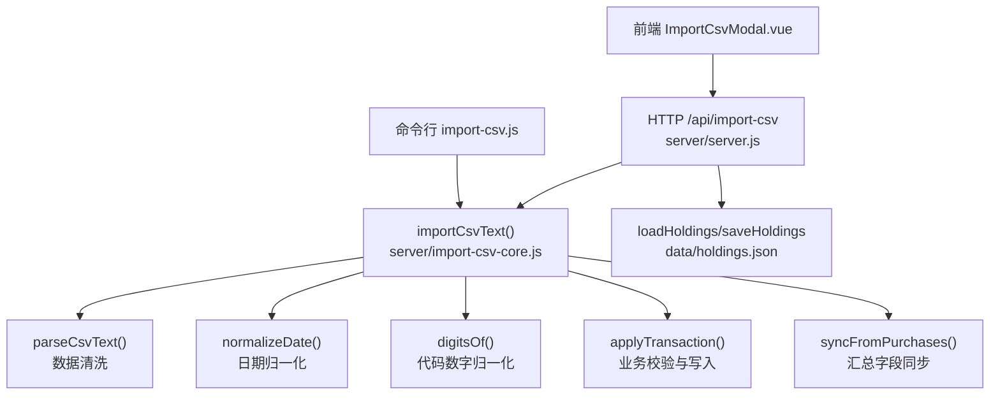
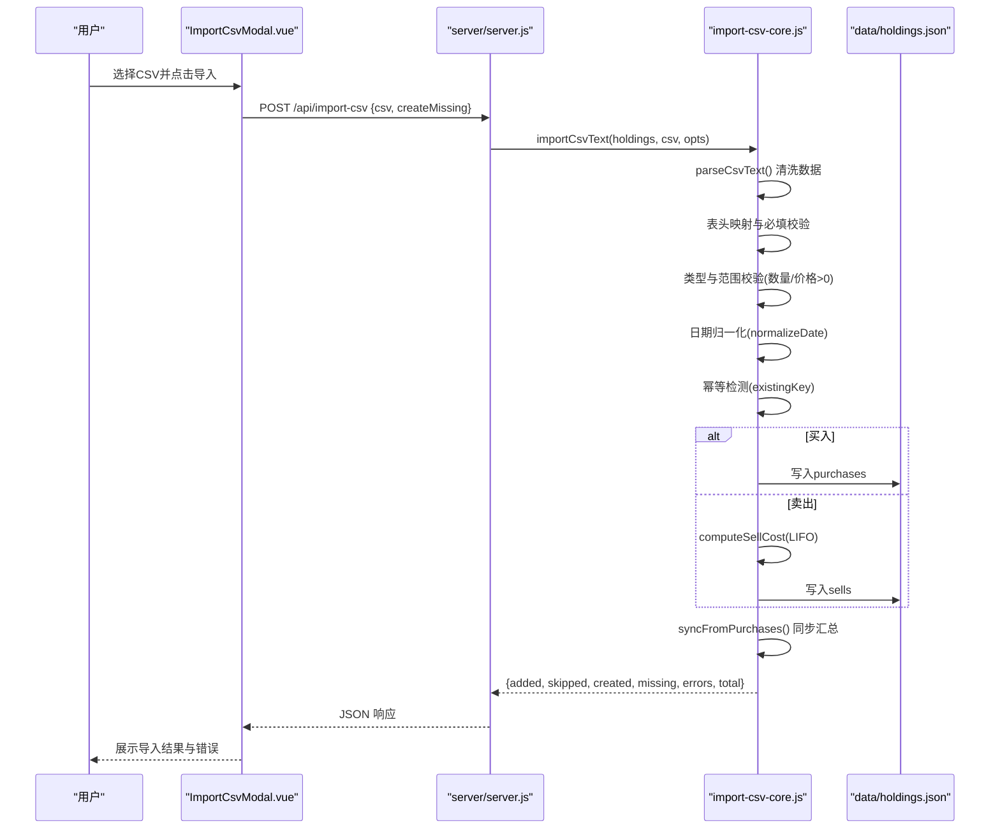
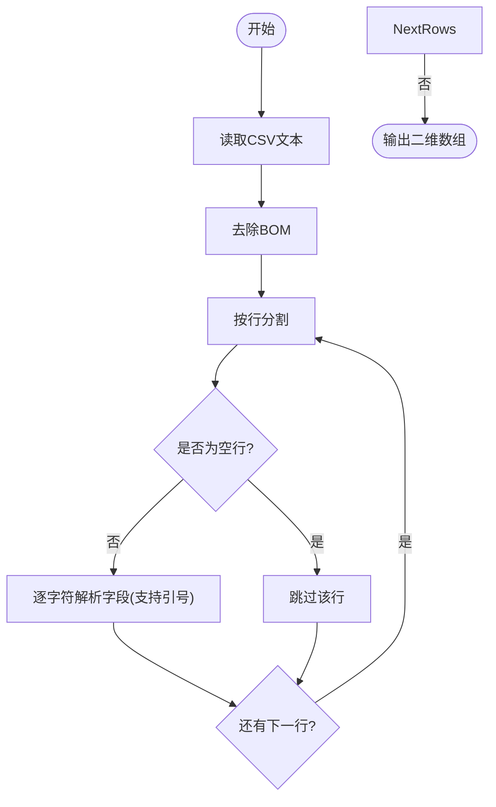
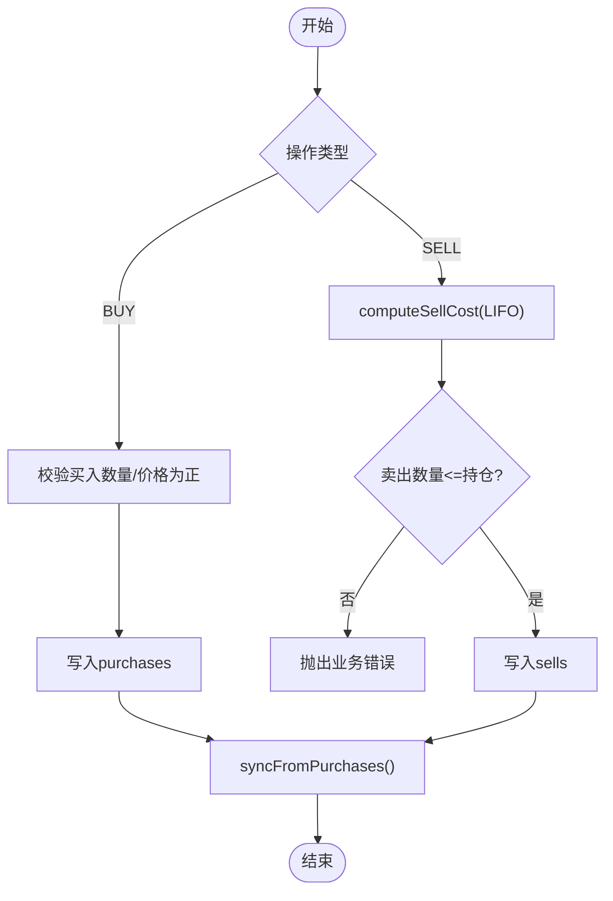
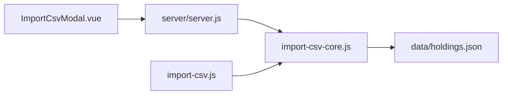

# 数据验证规则

<cite>
**本文引用的文件**
- [server/import-csv-core.js](file://server/import-csv-core.js)
- [server/import-csv.js](file://server/import-csv.js)
- [server/server.js](file://server/server.js)
- [web/src/components/ImportCsvModal.vue](file://web/src/components/ImportCsvModal.vue)
- [data/买入-卖出记录 - Sheet1.csv](file://data/买入-卖出记录 - Sheet1.csv)
- [data/holdings.json](file://data/holdings.json)
</cite>

## 目录
1. [简介](#简介)
2. [项目结构](#项目结构)
3. [核心组件](#核心组件)
4. [架构总览](#架构总览)
5. [详细组件分析](#详细组件分析)
6. [依赖关系分析](#依赖关系分析)
7. [性能考量](#性能考量)
8. [故障排查指南](#故障排查指南)
9. [结论](#结论)
10. [附录](#附录)

## 简介
本技术文档聚焦 Stock Advisor 的数据验证系统，围绕 CSV 导入流程中的“数据清洗、必填校验、类型与范围校验、业务逻辑校验、幂等性控制、错误分类与处理策略”进行系统化说明。文档同时给出可配置的扩展点与最佳实践，帮助开发者在保持幂等与健壮性的前提下，持续演进验证规则。

## 项目结构
CSV 导入验证的核心位于服务端模块，前端仅负责选择文件并调用接口；命令行脚本提供离线批量导入能力。关键路径如下：
- 核心解析与验证：server/import-csv-core.js
- 命令行入口：server/import-csv.js
- HTTP 接口封装：server/server.js（/api/import-csv）
- 前端交互：web/src/components/ImportCsvModal.vue
- 示例数据：data/买入-卖出记录 - Sheet1.csv
- 持久化存储：data/holdings.json

图表来源
- [server/import-csv-core.js:8-36](file://server/import-csv-core.js#L8-L36)
- [server/import-csv-core.js:170-306](file://server/import-csv-core.js#L170-L306)
- [server/server.js:416-435](file://server/server.js#L416-L435)
- [server/import-csv.js:37-79](file://server/import-csv.js#L37-L79)

章节来源
- [server/import-csv-core.js:1-306](file://server/import-csv-core.js#L1-L306)
- [server/import-csv.js:1-87](file://server/import-csv.js#L1-L87)
- [server/server.js:416-435](file://server/server.js#L416-L435)
- [web/src/components/ImportCsvModal.vue:49-73](file://web/src/components/ImportCsvModal.vue#L49-L73)

## 核心组件
- CSV 解析与清洗：支持 BOM、引号包裹、逗号分隔；自动过滤空行与空白行。
- 表头映射：支持多种列名变体（如“买入日期/卖出日期/日期”、“数量/买入数量/卖出数量”等）。
- 必填字段检查：代码、操作、日期、数量、价格必须存在且有效。
- 数据类型与数值范围：数量与价格需为正数；日期格式归一化为 YYYY-MM-DD。
- 业务逻辑校验：买入数量必须为正；卖出数量不能超过持仓可用数量（基于 LIFO 成本匹配）。
- 幂等性机制：以 (代码, 操作, 日期, 数量, 价格) 为唯一键，重复记录跳过。
- 错误分类与处理：致命错误（如缺少必需列）、警告信息（匹配不到持仓）、可跳过记录（非法行或重复）。
- 配置与扩展：通过 createMissing 选项控制是否自动新建缺失持仓；可在核心模块中扩展校验规则。

章节来源
- [server/import-csv-core.js:8-36](file://server/import-csv-core.js#L8-L36)
- [server/import-csv-core.js:170-210](file://server/import-csv-core.js#L170-L210)
- [server/import-csv-core.js:226-306](file://server/import-csv-core.js#L226-L306)

## 架构总览
CSV 导入的端到端流程包括：前端上传 CSV → 后端接收请求 → 解析与清洗 → 校验与幂等判断 → 写入交易明细 → 同步汇总字段 → 返回结果。命令行脚本复用同一核心逻辑，直接读取本地 CSV 与 holdings.json。

图表来源
- [server/server.js:416-435](file://server/server.js#L416-L435)
- [server/import-csv-core.js:170-306](file://server/import-csv-core.js#L170-L306)
- [web/src/components/ImportCsvModal.vue:49-73](file://web/src/components/ImportCsvModal.vue#L49-L73)

## 详细组件分析

### CSV 解析与数据清洗
- 支持 UTF-8 BOM 去除、引号内逗号保留、按换行分割并过滤空白行。
- 将每行拆分为字段数组，便于后续表头映射与字段提取。
- 清洗后进入必填校验与类型转换阶段。

图表来源
- [server/import-csv-core.js:8-23](file://server/import-csv-core.js#L8-L23)

章节来源
- [server/import-csv-core.js:8-23](file://server/import-csv-core.js#L8-L23)

### 表头映射与必填字段检查
- 支持的列名变体：
  - 代码：代码
  - 操作：操作
  - 日期：买入日期 / 卖出日期 / 日期
  - 数量：买入数量 / 卖出数量 / 数量
  - 价格：买入价 / 卖出价 / 价格
- 若缺少任一必需列，抛出致命错误并终止导入。
- 可选列：序号、名称、地区、类型（用于自动新建持仓时填充）。

章节来源
- [server/import-csv-core.js:175-188](file://server/import-csv-core.js#L175-L188)

### 数据类型与数值范围校验
- 数量与价格必须为正数；否则该行被跳过（视为可跳过记录）。
- 日期字符串会被尝试归一化为 YYYY-MM-DD 格式，保证幂等比较一致。
- 非数字或无法解析的值将被忽略，不会中断整体导入流程。

章节来源
- [server/import-csv-core.js:190-210](file://server/import-csv-core.js#L190-L210)
- [server/import-csv-core.js:30-36](file://server/import-csv-core.js#L30-L36)

### 业务逻辑验证
- 买入：
  - 数量与价格必须为正；否则抛出业务错误。
  - 新增到 purchases 列表，并生成唯一 id。
- 卖出：
  - 使用 LIFO（后进先出）从最近买入记录中匹配成本，计算成本价、利润与收益率。
  - 若卖出数量超过可用持仓数量，抛出业务错误。
  - 新增到 sells 列表，并更新持仓状态。
- 同步汇总字段：
  - 根据 purchases 与 sells 重新计算成本、数量、均价、状态、目标止盈/止损加权值等。

图表来源
- [server/import-csv-core.js:43-80](file://server/import-csv-core.js#L43-L80)
- [server/import-csv-core.js:273-299](file://server/import-csv-core.js#L273-L299)
- [server/import-csv-core.js:82-128](file://server/import-csv-core.js#L82-L128)

章节来源
- [server/import-csv-core.js:43-80](file://server/import-csv-core.js#L43-L80)
- [server/import-csv-core.js:82-128](file://server/import-csv-core.js#L82-L128)
- [server/import-csv-core.js:273-299](file://server/import-csv-core.js#L273-L299)

### 幂等性验证机制
- 唯一键：(代码, 操作, 日期, 数量, 价格)。
- 对买入与卖出分别在其对应列表中比对：
  - 买入：比较 buyTime、buyQuantity、buyPrice
  - 卖出：比较 sellDate、sellQuantity、sellPrice
- 浮点数比较采用极小误差阈值，避免精度问题导致误判。
- 重复记录将被跳过，不计入新增。

章节来源
- [server/import-csv-core.js:226-239](file://server/import-csv-core.js#L226-L239)

### 数据清洗规则总结
- 空行过滤：解析阶段自动过滤空白行。
- 非法字符处理：引号包裹的字段支持逗号；其他非法字符不影响解析。
- 空白字符修剪：所有关键字段在提取后进行 trim。
- 日期归一化：统一为 YYYY-MM-DD，提升幂等匹配稳定性。

章节来源
- [server/import-csv-core.js:8-23](file://server/import-csv-core.js#L8-L23)
- [server/import-csv-core.js:190-210](file://server/import-csv-core.js#L190-L210)
- [server/import-csv-core.js:30-36](file://server/import-csv-core.js#L30-L36)

### 验证错误的分类与处理策略
- 致命错误（终止导入）：
  - 缺少必需列（代码/操作/日期/数量/价格），抛出异常。
- 警告信息（可继续导入）：
  - 匹配不到持仓（missing），提示可通过 createMissing 自动新建。
- 可跳过记录（不影响整体）：
  - 非法行（数量或价格非正、日期无效等）直接跳过。
  - 重复记录（幂等）跳过。
- 业务错误（单条失败）：
  - 卖出数量超过持仓数量，记录错误但不中断其他记录导入。

章节来源
- [server/import-csv-core.js:175-188](file://server/import-csv-core.js#L175-L188)
- [server/import-csv-core.js:249-306](file://server/import-csv-core.js#L249-L306)
- [server/import-csv.js:65-76](file://server/import-csv.js#L65-L76)

### 配置与自定义验证扩展方案
- createMissing 选项：
  - 当 CSV 中的代码在 holdings 中不存在时，可选择自动创建新持仓（包含名称、地区、类型）。
- 可扩展点：
  - 在 importCsvText 中增加新的校验函数，并在 records 构建阶段或 applyTransaction 前调用。
  - 在 normalizePurchase 或 computeSellCost 中扩展业务规则（例如限制最大单笔数量、价格区间等）。
  - 在 existingKey 中调整幂等键策略（例如加入更多维度）。
- 前端开关：
  - ImportCsvModal.vue 提供 createMissing 复选框，允许用户在 UI 层决定是否自动新建持仓。

章节来源
- [server/import-csv-core.js:158-168](file://server/import-csv-core.js#L158-L168)
- [server/import-csv-core.js:249-268](file://server/import-csv-core.js#L249-L268)
- [web/src/components/ImportCsvModal.vue:98-108](file://web/src/components/ImportCsvModal.vue#L98-L108)

## 依赖关系分析
- server/server.js 依赖 import-csv-core.js 提供的 importCsvText 实现 CSV 导入。
- server/import-csv.js 作为命令行入口，同样依赖 import-csv-core.js。
- web/src/components/ImportCsvModal.vue 通过 HTTP 调用 server/server.js 的 /api/import-csv 接口。
- data/holdings.json 作为持久化存储，被加载与保存。

图表来源
- [server/server.js:416-435](file://server/server.js#L416-L435)
- [server/import-csv.js:37-79](file://server/import-csv.js#L37-L79)
- [server/import-csv-core.js:170-306](file://server/import-csv-core.js#L170-L306)

章节来源
- [server/server.js:416-435](file://server/server.js#L416-L435)
- [server/import-csv.js:37-79](file://server/import-csv.js#L37-L79)
- [server/import-csv-core.js:170-306](file://server/import-csv-core.js#L170-L306)

## 性能考量
- CSV 解析为 O(n) 线性扫描，适合常规规模数据。
- 幂等检测对每条记录遍历对应列表，时间复杂度 O(m)，m 为已有交易记录数；建议定期归档历史数据以降低 m。
- LIFO 成本计算需要对买入记录排序，复杂度 O(k log k)，k 为买入记录数；建议在大批量导入时考虑分批处理。
- 同步汇总字段涉及多次 reduce，复杂度 O(p + s)，p、s 分别为买入与卖出记录数；导入完成后集中计算一次即可。

[本节为通用性能讨论，不直接引用具体文件]

## 故障排查指南
- 致命错误：
  - 缺少必需列：检查 CSV 表头是否包含“代码/操作/日期/数量/价格”。
  - 解决方案：修正表头或导出模板。
- 业务错误：
  - 卖出数量超过持仓数量：检查是否存在足够买入记录；必要时先补录买入。
  - 解决方案：调整卖出数量或补充买入记录。
- 警告信息：
  - 匹配不到持仓：确认 holdings.json 中是否存在该代码；或使用 createMissing 自动新建。
  - 解决方案：勾选“自动新建持仓”或手动添加持仓。
- 可跳过记录：
  - 数量或价格非正、日期无效：检查原始数据；修正后再导入。
  - 重复记录：幂等已生效，无需处理。

章节来源
- [server/import-csv-core.js:175-188](file://server/import-csv-core.js#L175-L188)
- [server/import-csv-core.js:249-306](file://server/import-csv-core.js#L249-L306)
- [server/import-csv.js:65-76](file://server/import-csv.js#L65-L76)

## 结论
Stock Advisor 的数据验证系统以 CSV 为核心输入，通过严格的数据清洗、必填与类型校验、业务逻辑验证与幂等性控制，确保导入过程的稳健性与一致性。错误分类清晰，支持致命错误阻断、警告提示与可跳过记录三种策略。通过 createMissing 与可扩展的校验函数，系统具备良好的可配置性与扩展性，满足未来业务规则的演进需求。

[本节为总结性内容，不直接引用具体文件]

## 附录
- 示例 CSV 结构参考：data/买入-卖出记录 - Sheet1.csv
- 持仓数据结构参考：data/holdings.json

章节来源
- [data/买入-卖出记录 - Sheet1.csv:1-26](file://data/买入-卖出记录 - Sheet1.csv#L1-L26)
- [data/holdings.json:1-200](file://data/holdings.json#L1-L200)