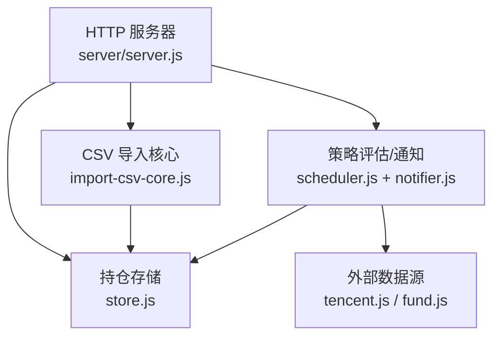
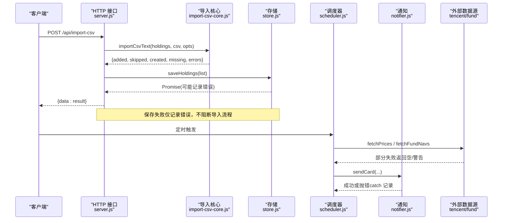
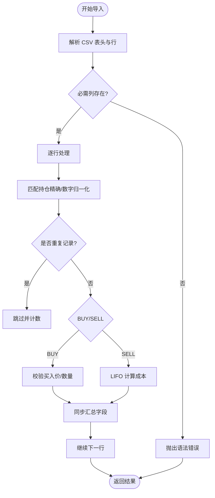
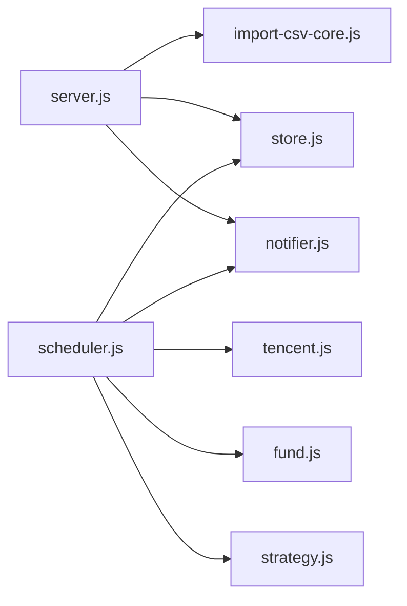

# 错误处理机制

<cite>
**本文引用的文件**
- [server/import-csv-core.js](file://server/import-csv-core.js)
- [server/import-csv.js](file://server/import-csv.js)
- [server/server.js](file://server/server.js)
- [server/store.js](file://server/store.js)
- [server/notifier.js](file://server/notifier.js)
- [server/scheduler.js](file://server/scheduler.js)
- [server/provider/tencent.js](file://server/provider/tencent.js)
- [server/provider/fund.js](file://server/provider/fund.js)
- [config.json](file://config.json)
</cite>

## 目录
1. [简介](#简介)
2. [项目结构](#项目结构)
3. [核心组件](#核心组件)
4. [架构总览](#架构总览)
5. [详细组件分析](#详细组件-analysis)
6. [依赖关系分析](#依赖关系分析)
7. [性能考量](#性能考量)
8. [故障排查指南](#故障排查指南)
9. [结论](#结论)
10. [附录：配置与扩展](#附录：配置与扩展)

## 简介
本技术文档聚焦 Stock Advisor 的“错误处理机制”，围绕导入过程中的错误分类、捕获与报告、异常恢复、重试与降级、日志与监控告警，以及常见错误的诊断与解决方案进行系统化说明。目标是帮助开发者理解并增强系统在批量导入、外部数据获取、持久化写入等关键环节的健壮性与可观测性。

## 项目结构
Stock Advisor 的错误处理贯穿以下模块：
- CSV 导入核心逻辑（解析、校验、业务规则）
- HTTP 接口层（请求解析、统一错误响应）
- 存储层（并发写保护、落盘失败处理）
- 调度器（定时任务中的网络请求容错、通知失败降级）
- 通知服务（飞书推送的重试与错误上报）
- 外部数据源（腾讯行情、基金净值接口的异常处理）

图表来源
- [server/server.js:416-435](file://server/server.js#L416-L435)
- [server/import-csv-core.js:170-306](file://server/import-csv-core.js#L170-L306)
- [server/store.js:40-70](file://server/store.js#L40-L70)
- [server/scheduler.js:65-177](file://server/scheduler.js#L65-L177)
- [server/notifier.js:81-111](file://server/notifier.js#L81-L111)
- [server/provider/tencent.js:6-41](file://server/provider/tencent.js#L6-L41)
- [server/provider/fund.js:6-54](file://server/provider/fund.js#L6-L54)

章节来源
- [server/server.js:1-594](file://server/server.js#L1-L594)
- [server/import-csv-core.js:1-307](file://server/import-csv-core.js#L1-L307)
- [server/import-csv.js:1-87](file://server/import-csv.js#L1-L87)
- [server/store.js:1-71](file://server/store.js#L1-L71)
- [server/scheduler.js:1-178](file://server/scheduler.js#L1-L178)
- [server/notifier.js:1-112](file://server/notifier.js#L1-L112)
- [server/provider/tencent.js:1-42](file://server/provider/tencent.js#L1-L42)
- [server/provider/fund.js:1-55](file://server/provider/fund.js#L1-L55)
- [config.json:1-19](file://config.json#L1-L19)

## 核心组件
- CSV 导入核心：负责解析 CSV、字段校验、匹配持仓、幂等去重、买入/卖出记录应用、汇总字段同步，并在单条记录级别捕获错误，返回结构化结果。
- HTTP 接口层：统一读取请求体、路由到具体处理器，对导入接口进行 try/catch 包裹，将错误以 JSON 形式返回；全局中间层捕获未处理异常并返回 500。
- 存储层：内存缓存 + 串行写队列，避免并发覆盖；写失败时记录错误但不中断调用链。
- 调度器：按交易时段选择刷新频率，批量拉取行情/基金净值，单个数据源失败不影响整体；触发通知失败时降级为日志。
- 通知服务：飞书卡片消息发送，内置指数退避重试（最多 3 次），失败抛错由上层 catch 记录。
- 外部数据源：行情与基金净值接口在失败时抛出或记录警告，调度器侧做容错聚合。

章节来源
- [server/import-csv-core.js:170-306](file://server/import-csv-core.js#L170-L306)
- [server/server.js:416-435](file://server/server.js#L416-L435)
- [server/store.js:62-70](file://server/store.js#L62-L70)
- [server/scheduler.js:65-177](file://server/scheduler.js#L65-L177)
- [server/notifier.js:81-111](file://server/notifier.js#L81-L111)
- [server/provider/tencent.js:6-41](file://server/provider/tencent.js#L6-L41)
- [server/provider/fund.js:6-54](file://server/provider/fund.js#L6-L54)

## 架构总览
下图展示了从 HTTP 请求到数据存储与通知的全链路错误处理路径，包括部分失败场景下的降级与恢复。

图表来源
- [server/server.js:416-435](file://server/server.js#L416-L435)
- [server/import-csv-core.js:170-306](file://server/import-csv-core.js#L170-L306)
- [server/store.js:62-70](file://server/store.js#L62-L70)
- [server/scheduler.js:65-177](file://server/scheduler.js#L65-L177)
- [server/notifier.js:81-111](file://server/notifier.js#L81-L111)
- [server/provider/tencent.js:6-41](file://server/provider/tencent.js#L6-L41)
- [server/provider/fund.js:6-54](file://server/provider/fund.js#L6-L54)

## 详细组件分析

### 导入错误分类体系
- 语法错误（CSV 表头/格式）
  - 缺失必需列（代码/操作/日期/数量/价格）会直接抛出错误，阻止后续处理。
  - 行级非法数据（空值、非正数）会被跳过，不计入成功或失败统计。
- 验证错误（数值合法性）
  - 买入价/买入数量必须为正，否则抛出错误。
  - 卖出数量超过持仓数量，抛出错误。
- 业务逻辑错误（匹配与一致性）
  - 无法匹配到持仓且未开启自动新建，记录为 missing。
  - 幂等键重复（相同 code/操作/日期/数量/价格）会被跳过。
- 数据一致性错误（计算与同步）
  - 卖出成本按 LIFO 计算，若剩余数量无法匹配则报错。
  - 同步汇总字段（成本、均价、状态等）基于买入/卖出记录重新计算。

章节来源
- [server/import-csv-core.js:170-306](file://server/import-csv-core.js#L170-L306)

### 错误捕获与报告机制
- 结构化输出
  - 导入结果包含 added、skipped、created、missing、errors、total 等字段，便于前端展示与审计。
  - errors 数组中每条记录包含原始记录上下文与错误信息，便于定位问题。
- 错误上下文保留
  - 每条出错记录附带 rec.code、rec.date、rec.qty、rec.price 等关键字段，结合 message 快速定位。
- 调试信息收集
  - 命令行脚本打印导入摘要与错误明细；HTTP 接口返回结构化错误对象。
  - 存储层写失败通过 console.error 记录错误，便于日志系统采集。

图表来源
- [server/import-csv-core.js:170-306](file://server/import-csv-core.js#L170-L306)

章节来源
- [server/import-csv-core.js:170-306](file://server/import-csv-core.js#L170-L306)
- [server/import-csv.js:37-86](file://server/import-csv.js#L37-L86)
- [server/server.js:416-435](file://server/server.js#L416-L435)
- [server/store.js:62-70](file://server/store.js#L62-L70)

### 异常恢复策略（部分失败场景）
- 导入过程
  - 单条记录错误被捕获并加入 errors，不影响其他记录处理；最终返回完整结果，支持部分成功。
  - 未匹配到的记录标记为 missing，可通过 createMissing 选项自动新建持仓。
- 存储写入
  - 使用串行写队列避免并发覆盖；写失败仅记录错误，不中断主流程。
- 调度器
  - 股票行情与基金净值分别 try/catch，任一失败不影响另一类数据的更新。
  - 通知失败通过 catch 记录错误，不中断后续持仓状态更新。
- 通知服务
  - 飞书推送内置 3 次重试，指数退避；全部失败后抛错，由上层记录。

章节来源
- [server/import-csv-core.js:273-302](file://server/import-csv-core.js#L273-L302)
- [server/store.js:62-70](file://server/store.js#L62-L70)
- [server/scheduler.js:77-86](file://server/scheduler.js#L77-L86)
- [server/scheduler.js:114-153](file://server/scheduler.js#L114-L153)
- [server/notifier.js:96-111](file://server/notifier.js#L96-L111)

### 错误重试机制与降级处理
- 通知重试
  - sendCard 内部循环最多 3 次，每次失败等待递增时间后重试；全部失败抛出错误。
- 数据源降级
  - 腾讯行情失败抛出错误，调度器 catch 并记录日志，返回空映射，不影响其他品种。
  - 基金净值逐个查询，单个失败记录警告并继续，最终返回可用数据集合。
- 导入降级
  - 缺少必需列直接终止；行级非法数据跳过；匹配不到可选自动新建；单条业务错误记录并继续。

章节来源
- [server/notifier.js:96-111](file://server/notifier.js#L96-L111)
- [server/provider/tencent.js:6-41](file://server/provider/tencent.js#L6-L41)
- [server/provider/fund.js:6-54](file://server/provider/fund.js#L6-L54)
- [server/scheduler.js:77-86](file://server/scheduler.js#L77-L86)
- [server/import-csv-core.js:170-306](file://server/import-csv-core.js#L170-L306)

### 错误日志记录与监控告警
- 日志位置
  - 存储层写失败：console.error('[store] save error', e.message)。
  - 数据源失败：console.error('[stock-fetch]', e.message)、console.warn('[fund] ...')。
  - 通知失败：console.error('[notify-daily]', e.message)、console.error('[notify]', e.message)。
  - 服务器全局异常：console.error('[server]', e.message)，并返回 500。
- 监控告警
  - 通过飞书通知实现业务告警（日涨跌、买点/卖点）。
  - 通知失败作为系统健康信号，需接入日志平台进行指标采集与告警。

章节来源
- [server/store.js:62-70](file://server/store.js#L62-L70)
- [server/scheduler.js:77-86](file://server/scheduler.js#L77-L86)
- [server/scheduler.js:114-153](file://server/scheduler.js#L114-L153)
- [server/server.js:583-586](file://server/server.js#L583-L586)

### 常见错误场景的诊断与解决
- 数据格式问题
  - 现象：导入时报“缺少必需列”或“买入价/数量必须为正”。
  - 诊断：检查 CSV 表头是否包含代码/操作/日期/数量/价格；核对数值是否为正。
  - 解决：修正表头与数据格式；必要时启用 createMissing 自动新建持仓。
- 网络连接异常
  - 现象：行情/基金净值拉取失败，调度器记录错误并跳过该品种。
  - 诊断：查看控制台日志中的 stock-fetch/fund 相关错误；确认网络与目标站点可达。
  - 解决：重试或更换网络环境；关注通知重试次数与失败原因。
- 权限不足
  - 现象：存储写入失败（如磁盘权限、路径不可写）。
  - 诊断：查看 store 层错误日志；确认 data/holdings.json 的可写权限。
  - 解决：调整文件或目录权限；确保运行用户具备写权限。
- 业务逻辑冲突
  - 现象：卖出数量超过持仓数量。
  - 诊断：核对买入/卖出记录的日期、数量、价格；检查是否存在重复或缺失。
  - 解决：修正数据；利用幂等键避免重复导入。

章节来源
- [server/import-csv-core.js:170-306](file://server/import-csv-core.js#L170-L306)
- [server/provider/tencent.js:6-41](file://server/provider/tencent.js#L6-L41)
- [server/provider/fund.js:6-54](file://server/provider/fund.js#L6-L54)
- [server/store.js:62-70](file://server/store.js#L62-L70)

## 依赖关系分析
- 低耦合高内聚
  - 导入核心独立于 HTTP 与存储，便于复用与测试。
  - 存储层提供 load/save 抽象，屏蔽并发与迁移细节。
  - 调度器组合多个外部提供者，失败隔离。
- 直接依赖
  - server.js 依赖 import-csv-core、store、notifier。
  - scheduler.js 依赖 store、provider、strategy、notifier。
  - notifier.js 依赖 crypto 与外部 webhook。
- 潜在风险
  - 外部数据源不稳定可能导致通知频繁失败；需加强重试与熔断策略。
  - 存储层串行写虽避免覆盖，但高并发下可能成为瓶颈；可考虑异步批写与错误重试队列。

图表来源
- [server/server.js:1-594](file://server/server.js#L1-L594)
- [server/scheduler.js:1-178](file://server/scheduler.js#L1-L178)
- [server/import-csv-core.js:1-307](file://server/import-csv-core.js#L1-L307)
- [server/store.js:1-71](file://server/store.js#L1-L71)
- [server/notifier.js:1-112](file://server/notifier.js#L1-L112)
- [server/provider/tencent.js:1-42](file://server/provider/tencent.js#L1-L42)
- [server/provider/fund.js:1-55](file://server/provider/fund.js#L1-L55)

章节来源
- [server/server.js:1-594](file://server/server.js#L1-L594)
- [server/scheduler.js:1-178](file://server/scheduler.js#L1-L178)
- [server/import-csv-core.js:1-307](file://server/import-csv-core.js#L1-L307)
- [server/store.js:1-71](file://server/store.js#L1-L71)
- [server/notifier.js:1-112](file://server/notifier.js#L1-L112)
- [server/provider/tencent.js:1-42](file://server/provider/tencent.js#L1-L42)
- [server/provider/fund.js:1-55](file://server/provider/fund.js#L1-L55)

## 性能考量
- 导入性能
  - 解析 CSV 采用流式字符处理，避免额外库开销；幂等键判断使用 Map 提升匹配效率。
  - 单条记录错误捕获避免整批失败，提高吞吐。
- 存储性能
  - 串行写队列减少竞争，但高并发下建议引入批写与重试队列。
- 网络性能
  - 腾讯行情批量请求，减少连接开销；基金净值逐个请求，注意速率限制。
- 通知性能
  - 指数退避重试降低瞬时压力；冷却窗口避免刷屏。

[本节为通用指导，无需特定文件引用]

## 故障排查指南
- 导入失败
  - 检查 CSV 表头与数据格式；查看 errors 数组中的 message 与 rec 上下文。
  - 若 missing 较多，考虑启用 createMissing 或补充持仓。
- 行情/净值拉取失败
  - 查看 stock-fetch/fund 相关日志；确认网络与目标站点可用性。
  - 关注调度器是否因无数据而跳过品种。
- 通知失败
  - 检查飞书 webhook 与 secret 配置；查看 notify 相关错误日志。
  - 确认重试次数与冷却时间设置。
- 存储写入失败
  - 检查 data/holdings.json 权限与磁盘空间；查看 store 错误日志。
  - 确认是否有其他进程同时写入导致锁竞争。

章节来源
- [server/import-csv-core.js:170-306](file://server/import-csv-core.js#L170-L306)
- [server/scheduler.js:77-86](file://server/scheduler.js#L77-L86)
- [server/notifier.js:96-111](file://server/notifier.js#L96-L111)
- [server/store.js:62-70](file://server/store.js#L62-L70)

## 结论
Stock Advisor 的错误处理机制在导入、存储、调度与通知各环节实现了分层防护与部分失败容忍。通过结构化结果、上下文保留、重试与降级策略，系统在外部依赖不稳定与数据不一致场景下仍保持基本可用性。未来可进一步增强：
- 导入错误分类细化（增加错误码与严重级别）
- 存储层引入批写与重试队列
- 外部数据源增加熔断与回退策略
- 日志与监控接入统一平台，实现指标采集与告警

[本节为总结，无需特定文件引用]

## 附录：配置与扩展
- 配置项
  - schedule.intervalSeconds/offHoursIntervalSeconds：控制刷新频率。
  - server.host/port：服务监听地址与端口。
  - feishu.webhook/secret：飞书机器人推送配置。
  - notify.cooldownSeconds/nearThresholdPct：通知冷却与阈值灵敏度。
- 自定义错误处理器
  - 可在 HTTP 层封装统一错误响应格式，增加错误码与追踪 ID。
  - 在导入核心中定义错误类型枚举，便于前端分类展示。
  - 在存储层增加重试队列与死信队列，持久化失败记录以便人工干预。

章节来源
- [config.json:1-19](file://config.json#L1-L19)