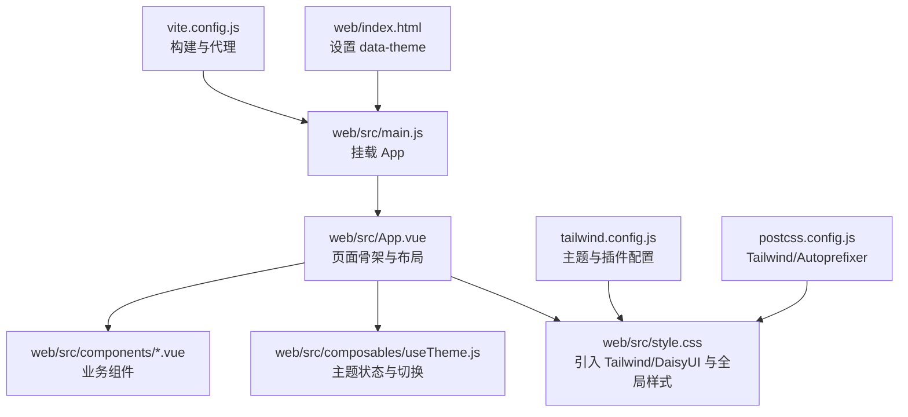
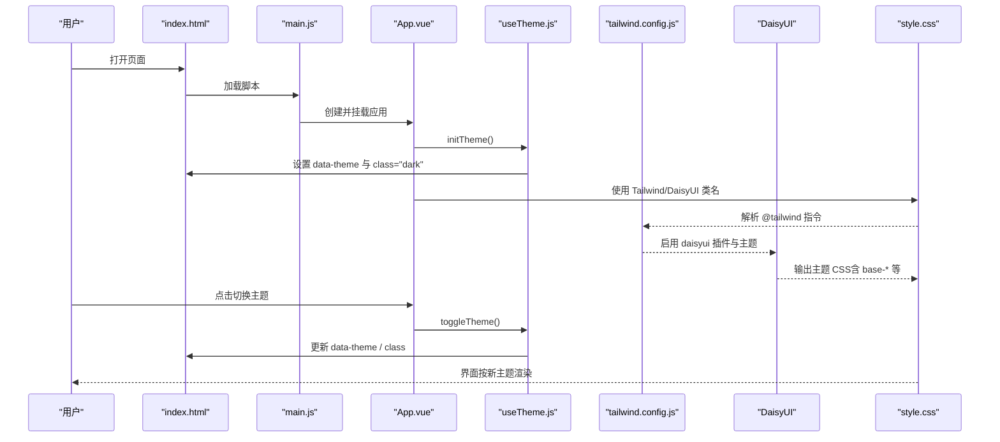
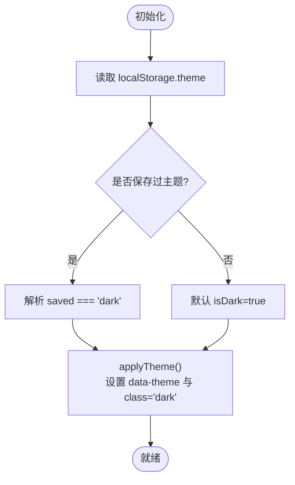
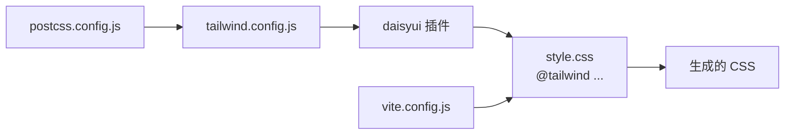
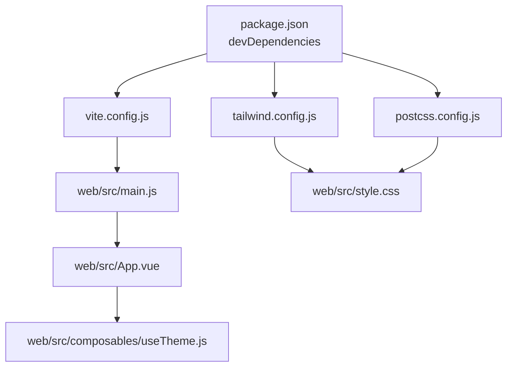

# UI设计与样式

<cite>
**本文引用的文件**
- [tailwind.config.js](file://tailwind.config.js)
- [postcss.config.js](file://postcss.config.js)
- [vite.config.js](file://vite.config.js)
- [package.json](file://package.json)
- [web/index.html](file://web/index.html)
- [web/src/main.js](file://web/src/main.js)
- [web/src/style.css](file://web/src/style.css)
- [web/src/App.vue](file://web/src/App.vue)
- [web/src/composables/useTheme.js](file://web/src/composables/useTheme.js)
- [web/src/components/AppHeader.vue](file://web/src/components/AppHeader.vue)
- [web/src/components/OverviewCards.vue](file://web/src/components/OverviewCards.vue)
- [web/src/components/HoldingList.vue](file://web/src/components/HoldingList.vue)
- [web/src/components/HoldingCard.vue](file://web/src/components/HoldingCard.vue)
- [web/src/components/RefreshRing.vue](file://web/src/components/RefreshRing.vue)
- [web/src/composables/useFormat.js](file://web/src/composables/useFormat.js)
</cite>

## 目录
1. [简介](#简介)
2. [项目结构](#项目结构)
3. [核心组件](#核心组件)
4. [架构总览](#架构总览)
5. [详细组件分析](#详细组件分析)
6. [依赖关系分析](#依赖关系分析)
7. [性能考虑](#性能考虑)
8. [故障排查指南](#故障排查指南)
9. [结论](#结论)
10. [附录](#附录)

## 简介
本文件系统性梳理 Stock Advisor 的 UI 设计与样式实现，重点覆盖：
- Tailwind CSS 与 DaisyUI 的配置、主题定制与响应式策略
- CSS 模块化组织与样式优先级管理
- 暗色模式原理与主题切换机制
- 移动端适配与可访问性要点
- 样式性能优化技巧、CSS 变量使用与自定义组件开发指南
- 具体样式示例与设计规范，帮助构建一致的用户体验

## 项目结构
前端基于 Vue 3 + Vite，源码位于 web/ 子目录；Tailwind 与 PostCSS 在根目录配置，DaisyUI 作为插件集成。入口 HTML 设置 data-theme，应用通过 composable 维护主题状态并同步到 DOM。

图表来源
- [web/index.html:1-13](file://web/index.html#L1-L13)
- [web/src/main.js:1-6](file://web/src/main.js#L1-L6)
- [web/src/App.vue:1-197](file://web/src/App.vue#L1-L197)
- [web/src/style.css:1-34](file://web/src/style.css#L1-L34)
- [web/src/composables/useTheme.js:1-26](file://web/src/composables/useTheme.js#L1-L26)
- [tailwind.config.js:1-54](file://tailwind.config.js#L1-L54)
- [postcss.config.js:1-7](file://postcss.config.js#L1-L7)
- [vite.config.js:1-26](file://vite.config.js#L1-L26)

章节来源
- [web/index.html:1-13](file://web/index.html#L1-L13)
- [web/src/main.js:1-6](file://web/src/main.js#L1-L6)
- [web/src/App.vue:1-197](file://web/src/App.vue#L1-L197)
- [web/src/style.css:1-34](file://web/src/style.css#L1-L34)
- [tailwind.config.js:1-54](file://tailwind.config.js#L1-L54)
- [postcss.config.js:1-7](file://postcss.config.js#L1-L7)
- [vite.config.js:1-26](file://vite.config.js#L1-L26)

## 核心组件
- 主题系统：useTheme composable 负责读取本地存储、设置 data-theme 与 dark class，配合 Tailwind 的 class 模式与 DaisyUI 的 darkTheme 完成主题切换。
- 页面骨架：App.vue 组织头部、概览卡片、持仓列表与弹窗，统一使用 base-* 语义化颜色与响应式栅格。
- 业务组件：AppHeader、OverviewCards、HoldingList、HoldingCard、RefreshRing 等，均基于 Tailwind 原子类与 DaisyUI 组件类组合而成。
- 格式化与徽章：useFormat 提供金额、价格、数量、百分比、收益红绿与地区/策略/触发态徽章映射，确保展示一致性。

章节来源
- [web/src/composables/useTheme.js:1-26](file://web/src/composables/useTheme.js#L1-L26)
- [web/src/App.vue:1-197](file://web/src/App.vue#L1-L197)
- [web/src/components/AppHeader.vue:1-64](file://web/src/components/AppHeader.vue#L1-L64)
- [web/src/components/OverviewCards.vue:1-41](file://web/src/components/OverviewCards.vue#L1-L41)
- [web/src/components/HoldingList.vue:1-36](file://web/src/components/HoldingList.vue#L1-L36)
- [web/src/components/HoldingCard.vue:1-161](file://web/src/components/HoldingCard.vue#L1-L161)
- [web/src/components/RefreshRing.vue:1-24](file://web/src/components/RefreshRing.vue#L1-L24)
- [web/src/composables/useFormat.js:1-70](file://web/src/composables/useFormat.js#L1-L70)

## 架构总览
下图展示了从 HTML 到样式生成与主题切换的整体流程，包括构建链路与运行时主题控制。

图表来源
- [web/index.html:1-13](file://web/index.html#L1-L13)
- [web/src/main.js:1-6](file://web/src/main.js#L1-L6)
- [web/src/App.vue:1-197](file://web/src/App.vue#L1-L197)
- [web/src/composables/useTheme.js:1-26](file://web/src/composables/useTheme.js#L1-L26)
- [tailwind.config.js:1-54](file://tailwind.config.js#L1-L54)
- [web/src/style.css:1-34](file://web/src/style.css#L1-L34)

## 详细组件分析

### 主题系统与暗色模式
- 主题配置：Tailwind 开启 class 模式，DaisyUI 定义 stocklight 与 stockdark 两套主题，并指定 darkTheme 为 stockdark。
- 运行时切换：useTheme 根据本地存储决定初始主题，设置 documentElement 的 data-theme 与 class="dark"，使 Tailwind 的 dark: 前缀与 DaisyUI 的 darkTheme 同时生效。
- 入口默认：index.html 设置 data-theme="stockdark"，保证首屏即深色。

图表来源
- [web/src/composables/useTheme.js:1-26](file://web/src/composables/useTheme.js#L1-L26)
- [web/index.html:1-13](file://web/index.html#L1-L13)
- [tailwind.config.js:1-54](file://tailwind.config.js#L1-L54)

章节来源
- [web/src/composables/useTheme.js:1-26](file://web/src/composables/useTheme.js#L1-L26)
- [web/index.html:1-13](file://web/index.html#L1-L13)
- [tailwind.config.js:1-54](file://tailwind.config.js#L1-L54)

### Tailwind CSS 与 DaisyUI 集成
- 构建链路：PostCSS 启用 tailwindcss 与 autoprefixer；Vite 以 web/ 为 root，构建产物输出至 dist/。
- 内容扫描：tailwind.config 指定 content 包含 index.html 与 web/src 下的 .vue/.js，确保按需生成工具类。
- 主题扩展：通过 DaisyUI themes 注入品牌色板与基础色阶，darkTheme 与 class 模式联动。
- 全局样式：style.css 引入 @tailwind base/components/utilities，并补充滚动条与按钮样式增强。

图表来源
- [postcss.config.js:1-7](file://postcss.config.js#L1-L7)
- [tailwind.config.js:1-54](file://tailwind.config.js#L1-L54)
- [web/src/style.css:1-34](file://web/src/style.css#L1-L34)
- [vite.config.js:1-26](file://vite.config.js#L1-L26)

章节来源
- [postcss.config.js:1-7](file://postcss.config.js#L1-L7)
- [tailwind.config.js:1-54](file://tailwind.config.js#L1-L54)
- [web/src/style.css:1-34](file://web/src/style.css#L1-L34)
- [vite.config.js:1-26](file://vite.config.js#L1-L26)

### 响应式设计与布局
- 栅格与间距：使用 grid-cols-2/sm:grid-cols-3/lg:grid-cols-5 等断点实现多列自适应；mx-auto、max-w-7xl、px-6、py-6 控制容器宽度与内边距。
- 组件级响应：OverviewCards、HoldingCard 内部采用 flex-wrap、gap、sm: 前缀等实现小屏堆叠、大屏并排。
- 粘性布局：AppHeader 使用 sticky top-0 z-10 保持顶部固定，背景半透明与 backdrop-blur 提升可读性。

章节来源
- [web/src/components/OverviewCards.vue:1-41](file://web/src/components/OverviewCards.vue#L1-L41)
- [web/src/components/HoldingCard.vue:1-161](file://web/src/components/HoldingCard.vue#L1-L161)
- [web/src/components/AppHeader.vue:1-64](file://web/src/components/AppHeader.vue#L1-L64)
- [web/src/App.vue:1-197](file://web/src/App.vue#L1-L197)

### 样式模块化与优先级管理
- 模块边界：style.css 仅承担全局样式与框架引入；业务样式尽量以 Tailwind 原子类与 DaisyUI 组件类表达，减少自定义 CSS。
- 优先级策略：
  - 优先使用语义化基色（base-100/base-200/base-content），避免硬编码颜色。
  - 对 DaisyUI 组件进行最小化覆盖（如按钮文字与中性按钮底色），仅在必要时添加局部样式。
  - 使用 scoped 或组件内 class 限定作用域，避免全局污染。
- 可维护性：将展示逻辑（数字格式、徽章映射）抽离到 useFormat，组件只关注结构与样式组合。

章节来源
- [web/src/style.css:1-34](file://web/src/style.css#L1-L34)
- [web/src/composables/useFormat.js:1-70](file://web/src/composables/useFormat.js#L1-L70)
- [web/src/components/AppHeader.vue:1-64](file://web/src/components/AppHeader.vue#L1-L64)

### 移动端适配与可访问性
- 移动端适配：
  - 视口与缩放：index.html 设置 viewport 确保正确缩放。
  - 栅格断点：利用 sm:/lg: 等断点在不同屏幕下调整列数与间距。
  - 触摸友好：按钮尺寸与间距满足手指操作。
- 可访问性：
  - 语义化标签：header、h1、button 等用于结构化与键盘导航。
  - 提示与状态：title 属性、aria 相关可通过后续扩展；当前已使用语义化文本与对比度良好的主题色。
  - 色彩语义：收益正负使用 error/success 语义色，结合 profitCls 保持一致。

章节来源
- [web/index.html:1-13](file://web/index.html#L1-L13)
- [web/src/components/AppHeader.vue:1-64](file://web/src/components/AppHeader.vue#L1-L64)
- [web/src/composables/useFormat.js:1-70](file://web/src/composables/useFormat.js#L1-L70)

### 样式性能优化
- 构建期优化：
  - 使用 Tailwind 的内容扫描白名单，仅包含必要路径，减少无用类生成。
  - 通过 PostCSS 自动补全与压缩，减少浏览器兼容成本。
- 运行期优化：
  - 主题切换通过 data-theme 与 class 切换，避免重绘大量节点。
  - 使用 CSS 变量（由 DaisyUI 主题提供）与语义化类，减少重复样式。
- 建议：
  - 谨慎使用 !important 与深层选择器，优先通过层级与命名空间控制优先级。
  - 将动画与过渡限制在小范围元素（如 RefreshRing），避免全局回流。

章节来源
- [tailwind.config.js:1-54](file://tailwind.config.js#L1-L54)
- [postcss.config.js:1-7](file://postcss.config.js#L1-L7)
- [web/src/components/RefreshRing.vue:1-24](file://web/src/components/RefreshRing.vue#L1-L24)

### 自定义组件开发指南
- 组件职责单一：每个组件聚焦一个功能（如 HoldingCard 负责单条持仓展示与编辑）。
- 样式约定：
  - 使用 base-* 色系与语义化类（badge、btn、input 等）。
  - 通过 props/emit 传递数据与事件，避免在组件内直接操作 DOM。
- 复用与扩展：
  - 将通用展示逻辑（金额、百分比、徽章）放入 useFormat。
  - 新增主题时，仅需在 tailwind.config 中扩展 DaisyUI 主题对象，无需改动组件样式。

章节来源
- [web/src/components/HoldingCard.vue:1-161](file://web/src/components/HoldingCard.vue#L1-L161)
- [web/src/composables/useFormat.js:1-70](file://web/src/composables/useFormat.js#L1-L70)
- [tailwind.config.js:1-54](file://tailwind.config.js#L1-L54)

## 依赖关系分析
- 构建依赖：Vite 驱动 Vue 插件与开发服务器；PostCSS 串联 Tailwind 与 Autoprefixer。
- 运行时依赖：Vue 3 组件体系；DaisyUI 提供组件与主题；Tailwind 提供原子类。
- 主题依赖：useTheme 与 index.html 的 data-theme 共同决定最终主题；Tailwind 的 class 模式与 DaisyUI 的 darkTheme 协同工作。

图表来源
- [package.json:1-32](file://package.json#L1-L32)
- [vite.config.js:1-26](file://vite.config.js#L1-L26)
- [tailwind.config.js:1-54](file://tailwind.config.js#L1-L54)
- [postcss.config.js:1-7](file://postcss.config.js#L1-L7)
- [web/src/main.js:1-6](file://web/src/main.js#L1-L6)
- [web/src/App.vue:1-197](file://web/src/App.vue#L1-L197)
- [web/src/composables/useTheme.js:1-26](file://web/src/composables/useTheme.js#L1-L26)
- [web/src/style.css:1-34](file://web/src/style.css#L1-L34)

章节来源
- [package.json:1-32](file://package.json#L1-L32)
- [vite.config.js:1-26](file://vite.config.js#L1-L26)
- [tailwind.config.js:1-54](file://tailwind.config.js#L1-L54)
- [postcss.config.js:1-7](file://postcss.config.js#L1-L7)
- [web/src/main.js:1-6](file://web/src/main.js#L1-L6)
- [web/src/App.vue:1-197](file://web/src/App.vue#L1-L197)
- [web/src/composables/useTheme.js:1-26](file://web/src/composables/useTheme.js#L1-L26)
- [web/src/style.css:1-34](file://web/src/style.css#L1-L34)

## 性能考虑
- 构建阶段：
  - 精确 content 路径，避免扫描无关文件。
  - 使用 Purge/Tailwind 的 Tree Shaking 能力，减少 CSS 体积。
- 运行阶段：
  - 主题切换不触发重排大段 DOM，仅变更属性与类。
  - 使用语义化颜色与 DaisyUI 变量，减少重复计算。
- 交互反馈：
  - 倒计时环形进度使用 SVG stroke-dashoffset，轻量且流畅。
  - 列表与卡片采用懒展开（如 HoldingCard 明细折叠），降低初始渲染压力。

[本节为通用指导，不直接分析具体文件]

## 故障排查指南
- 主题未生效：
  - 检查 index.html 是否设置了 data-theme。
  - 确认 useTheme 是否正确写入 localStorage 并调用 applyTheme。
  - 验证 tailwind.config 中 darkMode 是否为 class，以及 daisyui.darkTheme 是否匹配。
- 样式缺失：
  - 检查 postcss.config 是否启用 tailwindcss 与 autoprefixer。
  - 确认 tailwind.config 的 content 包含 web/src 下的 .vue/.js。
- 按钮文字不可见：
  - 若使用中性/ghost 按钮，需确保背景与文字对比度足够；当前已在 style.css 中对非主色按钮增加浅色底承载白字。
- 移动端显示异常：
  - 检查 viewport 设置与断点类名是否正确。
  - 确认父容器宽度与 padding/margin 未导致溢出。

章节来源
- [web/src/composables/useTheme.js:1-26](file://web/src/composables/useTheme.js#L1-L26)
- [web/index.html:1-13](file://web/index.html#L1-L13)
- [tailwind.config.js:1-54](file://tailwind.config.js#L1-L54)
- [postcss.config.js:1-7](file://postcss.config.js#L1-L7)
- [web/src/style.css:1-34](file://web/src/style.css#L1-L34)

## 结论
本项目以 Tailwind + DaisyUI 为核心，构建了清晰的主题系统与一致的 UI 风格。通过 class 模式的暗色主题、语义化颜色与响应式栅格，实现了跨设备的一致体验。样式组织遵循“原子类为主、少量全局样式为辅”的原则，提升了可维护性与可扩展性。建议在后续迭代中继续强化可访问性（如 aria 标注）、完善主题文档与组件库，进一步提升团队效率与用户体验。

[本节为总结性内容，不直接分析具体文件]

## 附录
- 设计规范要点
  - 颜色：使用 base-100/200/300 与 primary/success/warning/error/info 语义色，避免硬编码。
  - 字体与字号：标题使用 semibold，正文使用默认字重；数值使用 tabular-nums 对齐。
  - 间距：统一使用 Tailwind 间距尺度，保持视觉节奏一致。
  - 圆角与边框：卡片与输入框使用 rounded-xl 与 border-base-300，形成统一层次。
- 常用样式示例（路径参考）
  - 主题切换：[web/src/composables/useTheme.js:1-26](file://web/src/composables/useTheme.js#L1-L26)
  - 概览卡片栅格：[web/src/components/OverviewCards.vue:1-41](file://web/src/components/OverviewCards.vue#L1-L41)
  - 持仓卡片指标与徽章：[web/src/components/HoldingCard.vue:1-161](file://web/src/components/HoldingCard.vue#L1-L161)
  - 按钮样式增强：[web/src/style.css:24-34](file://web/src/style.css#L24-L34)
  - 主题配置与暗色模式：[tailwind.config.js:1-54](file://tailwind.config.js#L1-L54)

[本节为参考信息，不直接分析具体文件]