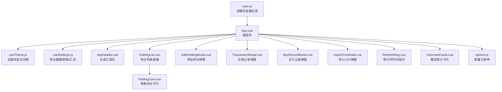
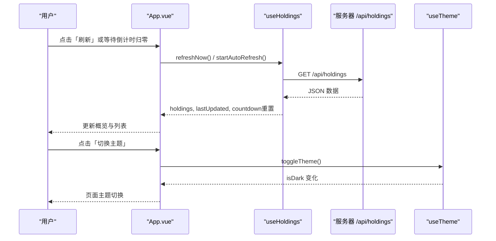
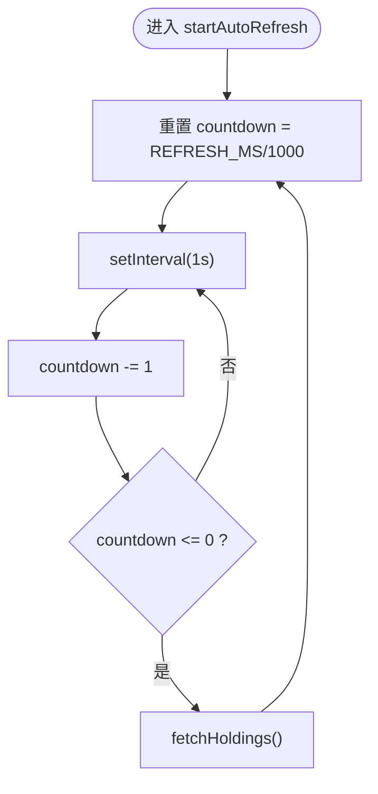
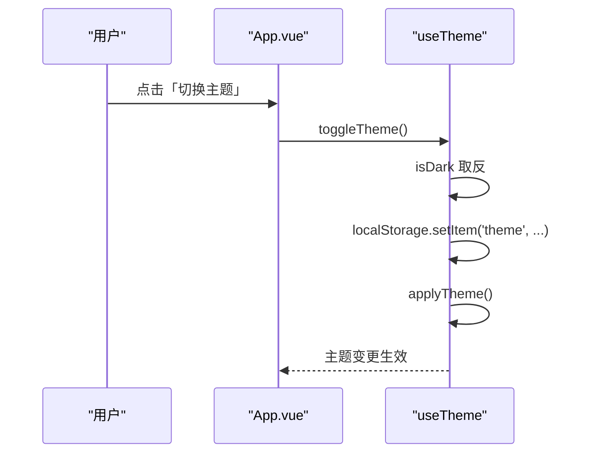
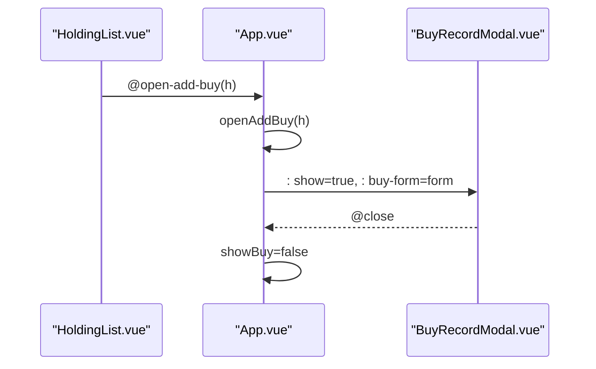
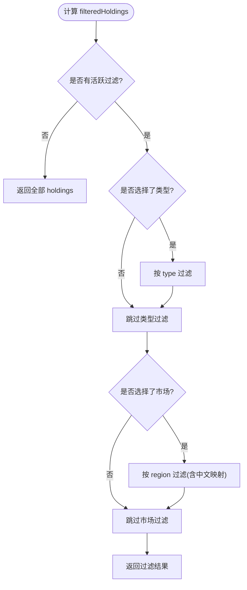
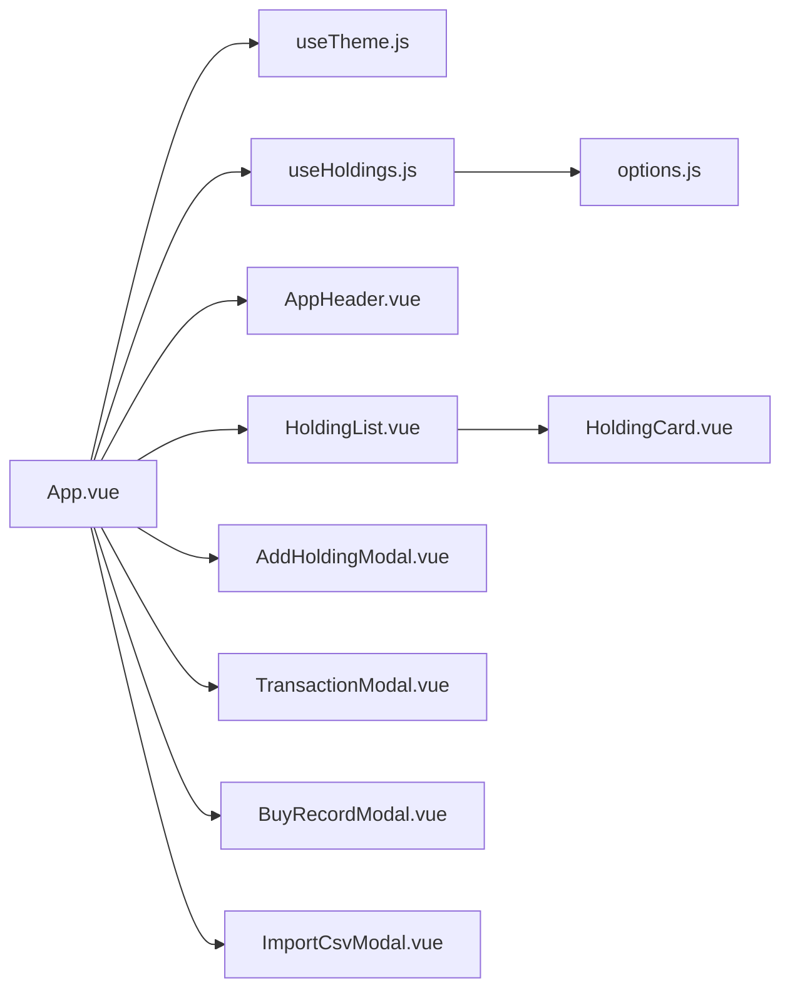

# App主组件

<cite>
**本文引用的文件**
- [App.vue](file://web/src/App.vue)
- [useHoldings.js](file://web/src/composables/useHoldings.js)
- [useTheme.js](file://web/src/composables/useTheme.js)
- [options.js](file://web/src/constants/options.js)
- [AppHeader.vue](file://web/src/components/AppHeader.vue)
- [HoldingList.vue](file://web/src/components/HoldingList.vue)
- [AddHoldingModal.vue](file://web/src/components/AddHoldingModal.vue)
- [main.js](file://web/src/main.js)
</cite>

## 目录
1. [简介](#简介)
2. [项目结构](#项目结构)
3. [核心组件与职责](#核心组件与职责)
4. [架构总览](#架构总览)
5. [详细组件分析](#详细组件分析)
6. [依赖关系分析](#依赖关系分析)
7. [性能考量](#性能考量)
8. [故障排查指南](#故障排查指南)
9. [结论](#结论)
10. [附录：关键数据流与事件表](#附录：关键数据流与事件表)

## 简介
本文件聚焦于应用根组件 App.vue，系统性解析其作为应用入口的职责边界与控制流，包括：
- 应用初始化与生命周期管理（挂载/卸载、自动刷新启停）
- 状态协调（主题、持仓数据、倒计时、弹窗状态）
- 事件处理机制（用户交互、子组件事件透传）
- useHoldings 组合式函数的集成使用（数据获取、自动刷新、倒计时、汇总计算、写操作）
- 主题切换实现原理（深色模式切换、CSS 变量与 class 管理）
- 弹窗状态管理（添加持仓、交易记录、买入记录、CSV导入等模态框的显示控制）
- 多选标签过滤功能（类型与市场维度筛选逻辑）
并提供最佳实践建议，帮助开发者理解整体架构与数据流。

## 项目结构
前端采用 Vue 3 + Composition API 的单页应用结构，根组件为 App.vue，通过 composables 组织业务逻辑，components 组织视图与交互，constants 提供统一常量。

图表来源
- [main.js:1-6](file://web/src/main.js#L1-L6)
- [App.vue:1-197](file://web/src/App.vue#L1-L197)
- [useTheme.js:1-26](file://web/src/composables/useTheme.js#L1-L26)
- [useHoldings.js:1-154](file://web/src/composables/useHoldings.js#L1-L154)
- [AppHeader.vue:1-64](file://web/src/components/AppHeader.vue#L1-L64)
- [HoldingList.vue:1-36](file://web/src/components/HoldingList.vue#L1-L36)
- [AddHoldingModal.vue:1-151](file://web/src/components/AddHoldingModal.vue#L1-L151)
- [options.js:1-33](file://web/src/constants/options.js#L1-L33)

章节来源
- [main.js:1-6](file://web/src/main.js#L1-L6)
- [App.vue:1-197](file://web/src/App.vue#L1-L197)

## 核心组件与职责
- App.vue（根组件）
  - 负责应用初始化：主题初始化、首次拉取持仓、启动自动刷新
  - 管理全局状态：主题开关、持仓数据、加载/错误、倒计时、各弹窗显隐
  - 编排事件：将头部按钮、列表项操作、弹窗提交等事件转发到对应逻辑
  - 提供过滤能力：按“类型”和“市场”的多选标签过滤持仓列表
- useHoldings（组合式函数）
  - 维护模块级单例状态：holdings、lastUpdated、loading、error、countdown
  - 数据获取：fetchHoldings、refreshNow
  - 自动刷新：startAutoRefresh/stopAutoRefresh（基于固定间隔的心跳递减，归零触发刷新）
  - 汇总计算：totalCost、totalMarket、totalHoldingProfit、totalTodayProfit
  - 写操作：addHolding、submitTransaction、savePurchase、deletePurchase、updateHolding
- useTheme（组合式函数）
  - 维护 isDark 状态，持久化至 localStorage
  - 同步设置 documentElement 的 data-theme 与 dark class，驱动 Tailwind/DaisyUI 主题
- AppHeader（头部组件）
  - 展示更新时间、加载状态、错误信息、倒计时环形进度
  - 暴露事件：切换主题、刷新、测试飞书、添加持仓、导入CSV
- HoldingList（列表容器）
  - 渲染 HoldingCard 列表，并将子组件事件向上透传到 App.vue
- AddHoldingModal（添加持仓弹窗）
  - 表单输入与校验，调用 useHoldings.addHolding 提交后关闭弹窗

章节来源
- [App.vue:1-197](file://web/src/App.vue#L1-L197)
- [useHoldings.js:1-154](file://web/src/composables/useHoldings.js#L1-L154)
- [useTheme.js:1-26](file://web/src/composables/useTheme.js#L1-L26)
- [AppHeader.vue:1-64](file://web/src/components/AppHeader.vue#L1-L64)
- [HoldingList.vue:1-36](file://web/src/components/HoldingList.vue#L1-L36)
- [AddHoldingModal.vue:1-151](file://web/src/components/AddHoldingModal.vue#L1-L151)

## 架构总览
应用以 App.vue 为中心，通过 composables 解耦状态与副作用，组件仅关注 UI 与事件转发。数据流遵循“单向数据流 + 事件冒泡”的模式：
- 数据源：后端 /api/holdings 及子资源接口
- 状态层：useHoldings 维护单一事实来源（SSOT），所有组件通过响应式引用消费
- 视图层：App.vue 组合多个子组件，传递 props 与监听事件
- 副作用：网络请求、定时器、本地存储由 composables 集中管理

图表来源
- [App.vue:121-129](file://web/src/App.vue#L121-L129)
- [useHoldings.js:15-49](file://web/src/composables/useHoldings.js#L15-L49)
- [useTheme.js:10-21](file://web/src/composables/useTheme.js#L10-L21)

## 详细组件分析

### App.vue：根组件职责与控制流
- 初始化与生命周期
  - onMounted：initTheme()、fetchHoldings()、startAutoRefresh()
  - onUnmounted：stopAutoRefresh()、清理测试消息定时器
- 主题集成
  - 通过 useTheme 暴露 isDark/initTheme/toggleTheme，绑定到 AppHeader 的事件
- 持仓数据与刷新
  - 通过 useHoldings 获取 holdings、loading、error、countdown、汇总指标
  - 提供 refreshNow/startAutoRefresh/stopAutoRefresh 供头部触发
- 倒计时可视化
  - 基于 REFRESH_MS 与 countdown 计算环形进度偏移
- 弹窗状态管理
  - showAdd/showTxn/showBuy/showImport 控制模态框显隐
  - txn/buyForm 作为临时表单数据载体
  - openTxn/openAddBuy/openEditBuy/handleDeleteBuy 封装打开与删除逻辑
- 多选标签过滤
  - FILTER_GROUPS 定义“类型”和“市场”两个维度
  - activeFilters 维护当前选中值数组
  - filteredHoldings 根据 type 与 region 进行交集过滤，region 支持中文短码映射
- 事件分发
  - 向 AppHeader 派发 toggle-theme/refresh/test-feishu/add/import-csv
  - 向 HoldingList 派发 open-txn/open-add-buy/edit-buy/delete-buy

章节来源
- [App.vue:1-197](file://web/src/App.vue#L1-L197)
- [options.js:1-33](file://web/src/constants/options.js#L1-L33)

### useHoldings：持仓数据与自动刷新
- 状态设计
  - 模块级 ref 保证跨组件共享同一份数据（SSOT）
  - loading/error/countdown 用于 UI 反馈与刷新节奏控制
- 数据获取
  - fetchHoldings：GET /api/holdings，成功后更新 holdings、lastUpdated、重置倒计时
  - refreshNow：直接调用 fetchHoldings
- 自动刷新
  - startAutoRefresh：每秒心跳递减 countdown，归零时触发 fetchHoldings；避免多定时器漂移
  - stopAutoRefresh：清理定时器
- 汇总计算
  - totalCost/totalMarket/totalHoldingProfit/totalTodayProfit 通过 computed 聚合 holdings
- 写操作
  - addHolding：POST /api/holdings，成功后刷新列表
  - submitTransaction：POST /api/holdings/{id}/transactions，成功后刷新列表
  - savePurchase：POST/PATCH /api/holdings/{id}/purchases[/{pid}]，成功后刷新列表
  - deletePurchase：DELETE /api/holdings/{id}/purchases/{pid}，确认后刷新列表
  - updateHolding：PATCH /api/holdings/{id}，成功后刷新列表

图表来源
- [useHoldings.js:35-49](file://web/src/composables/useHoldings.js#L35-L49)
- [useHoldings.js:15-29](file://web/src/composables/useHoldings.js#L15-L29)

章节来源
- [useHoldings.js:1-154](file://web/src/composables/useHoldings.js#L1-L154)

### useTheme：主题切换与样式管理
- 状态与持久化
  - isDark 默认 true，读取 localStorage 中的 theme 键
- 样式同步
  - applyTheme：设置 document.documentElement.dataset.theme 为 stockdark/stocklight，并切换 dark class
- 切换流程
  - toggleTheme：翻转 isDark，写入 localStorage，调用 applyTheme

图表来源
- [useTheme.js:10-21](file://web/src/composables/useTheme.js#L10-L21)
- [App.vue:15-16](file://web/src/App.vue#L15-L16)

章节来源
- [useTheme.js:1-26](file://web/src/composables/useTheme.js#L1-L26)

### 弹窗状态管理：添加持仓、交易记录、买入记录、导入CSV
- 状态定义
  - showAdd/showTxn/showBuy/showImport 控制四个模态框显隐
  - txn/buyForm 作为表单数据载体，包含 id/name/type/price/quantity/date 等字段
- 打开与关闭
  - openTxn：初始化 txn 并打开 TransactionModal
  - openAddBuy/openEditBuy：初始化 buyForm 并打开 BuyRecordModal
  - handleDeleteBuy：调用 useHoldings.deletePurchase 删除后刷新
- 事件流
  - 子组件通过 emit 触发 close，App.vue 将对应 showX 置为 false

图表来源
- [App.vue:48-74](file://web/src/App.vue#L48-L74)
- [HoldingList.vue:10-13](file://web/src/components/HoldingList.vue#L10-L13)

章节来源
- [App.vue:48-74](file://web/src/App.vue#L48-L74)
- [HoldingList.vue:1-36](file://web/src/components/HoldingList.vue#L1-L36)

### 多选标签过滤：类型与市场维度
- 维度定义
  - 类型：['股票','股票型基金','债券型基金','货币型基金','ETF']
  - 市场：['hk','us','sh','sz']，并通过 REGION_LABEL 显示中文名
- 状态与交互
  - activeFilters：{type:[], region:[]} 维护当前选中集合
  - toggleFilter：切换某选项的选中状态
  - clearFilters：清空所有过滤条件
- 过滤逻辑
  - filteredHoldings：当任一维度有选择时，对 holdings 进行交集过滤
  - normRegion：兼容数据中地区字段的两种格式（中文短码与短代码）

图表来源
- [App.vue:76-119](file://web/src/App.vue#L76-L119)
- [options.js:11-29](file://web/src/constants/options.js#L11-L29)

章节来源
- [App.vue:76-119](file://web/src/App.vue#L76-L119)
- [options.js:1-33](file://web/src/constants/options.js#L1-L33)

### 主题切换功能的实现原理
- 深色模式切换
  - 通过 isDark 控制主题类名与 data-theme 属性，适配 DaisyUI/Tailwind 的主题系统
- CSS 变量管理
  - 依赖框架主题变量，通过切换 data-theme 与 dark class 动态替换颜色变量
- 持久化
  - 将主题偏好写入 localStorage，下次加载时恢复

章节来源
- [useTheme.js:1-26](file://web/src/composables/useTheme.js#L1-L26)
- [App.vue:15-16](file://web/src/App.vue#L15-L16)

### 事件处理机制与最佳实践
- 事件冒泡
  - 子组件通过 emit 上报事件，父组件统一处理并协调状态
- 副作用隔离
  - 网络请求、定时器、本地存储集中在 composables，组件保持纯 UI 职责
- 可维护性
  - 常量集中管理（options.js），避免硬编码
  - 过滤逻辑使用 computed 派生，保证响应式与性能

章节来源
- [App.vue:1-197](file://web/src/App.vue#L1-L197)
- [useHoldings.js:1-154](file://web/src/composables/useHoldings.js#L1-L154)
- [options.js:1-33](file://web/src/constants/options.js#L1-L33)

## 依赖关系分析
- 组件依赖
  - App.vue 依赖 useTheme、useHoldings、AppHeader、HoldingList、各类 Modal
  - HoldingList 依赖 HoldingCard，并透传事件
- 组合式函数依赖
  - useHoldings 依赖 constants/options（REFRESH_MS）
  - useTheme 依赖 localStorage 与 DOM API
- 外部依赖
  - 后端 API：/api/holdings 及其子资源
  - 第三方样式：Tailwind/DaisyUI（通过主题变量与 class 切换）

图表来源
- [App.vue:1-197](file://web/src/App.vue#L1-L197)
- [useHoldings.js:1-154](file://web/src/composables/useHoldings.js#L1-L154)
- [useTheme.js:1-26](file://web/src/composables/useTheme.js#L1-L26)
- [options.js:1-33](file://web/src/constants/options.js#L1-L33)

章节来源
- [App.vue:1-197](file://web/src/App.vue#L1-L197)
- [useHoldings.js:1-154](file://web/src/composables/useHoldings.js#L1-L154)

## 性能考量
- 自动刷新策略
  - 使用单一 setInterval 心跳递减，避免多定时器导致的抖动与内存泄漏
  - 刷新完成后重置 countdown，确保 UI 与状态一致
- 计算优化
  - 汇总指标使用 computed，仅在 holdings 变化时重算
  - 过滤逻辑使用 computed 派生 filteredHoldings，减少重复计算
- 网络请求
  - 写操作后统一调用 fetchHoldings 刷新，保证数据一致性
- 主题切换
  - 通过切换 class/data-theme 而非大量样式重写，提升渲染效率

## 故障排查指南
- 无法获取持仓数据
  - 检查 /api/holdings 接口可达性与返回格式
  - 查看 error 状态提示，定位具体错误信息
- 自动刷新不工作
  - 确认 startAutoRefresh 已调用且未重复创建定时器
  - 检查 countdown 是否归零并触发 fetchHoldings
- 主题切换无效
  - 确认 documentElement 的 data-theme 与 dark class 是否正确设置
  - 检查 localStorage 中的 theme 键值
- 过滤不生效
  - 检查 activeFilters 是否正确更新
  - 确认 normRegion 映射是否覆盖数据中的地区格式

章节来源
- [useHoldings.js:15-29](file://web/src/composables/useHoldings.js#L15-L29)
- [useHoldings.js:35-49](file://web/src/composables/useHoldings.js#L35-L49)
- [useTheme.js:10-21](file://web/src/composables/useTheme.js#L10-L21)
- [App.vue:76-119](file://web/src/App.vue#L76-L119)

## 结论
App.vue 作为应用根组件，承担了初始化、状态协调、事件分发与过滤的核心职责。通过 useHoldings 与 useTheme 的组合式函数，实现了数据与主题的解耦与复用。整体架构清晰、职责明确，具备良好的可维护性与扩展性。建议在后续迭代中继续遵循“状态集中、副作用隔离、常量统一管理”的原则，以提升代码质量与团队协作效率。

## 附录：关键数据流与事件表
- 数据流
  - 获取：App.vue -> useHoldings.fetchHoldings -> /api/holdings -> holdings/lastUpdated/countdown
  - 写操作：App.vue -> useHoldings.addHolding/submitTransaction/savePurchase/deletePurchase/updateHolding -> 相应接口 -> 刷新列表
- 事件表
  - AppHeader -> App.vue：toggle-theme、refresh、test-feishu、add、import-csv
  - HoldingList -> App.vue：open-txn、open-add-buy、edit-buy、delete-buy
  - Modals -> App.vue：close（关闭弹窗）

章节来源
- [App.vue:1-197](file://web/src/App.vue#L1-L197)
- [useHoldings.js:1-154](file://web/src/composables/useHoldings.js#L1-L154)
- [AppHeader.vue:1-64](file://web/src/components/AppHeader.vue#L1-L64)
- [HoldingList.vue:1-36](file://web/src/components/HoldingList.vue#L1-L36)