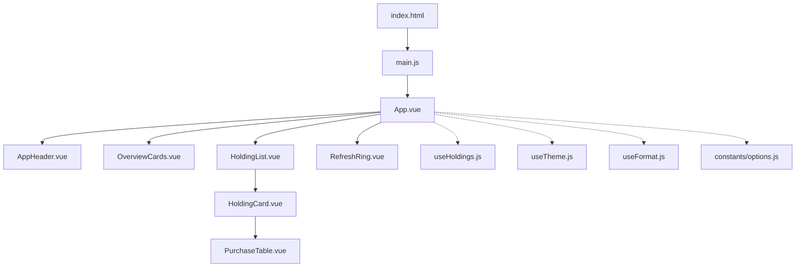
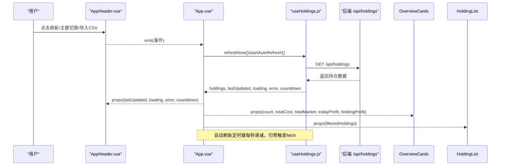
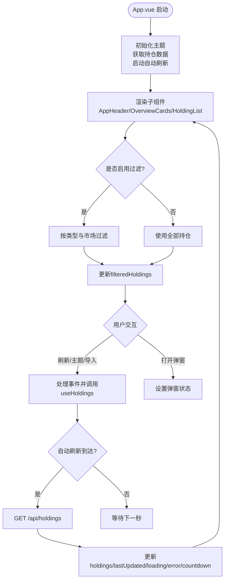
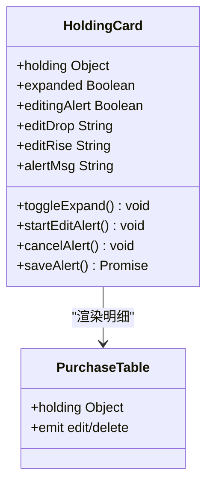
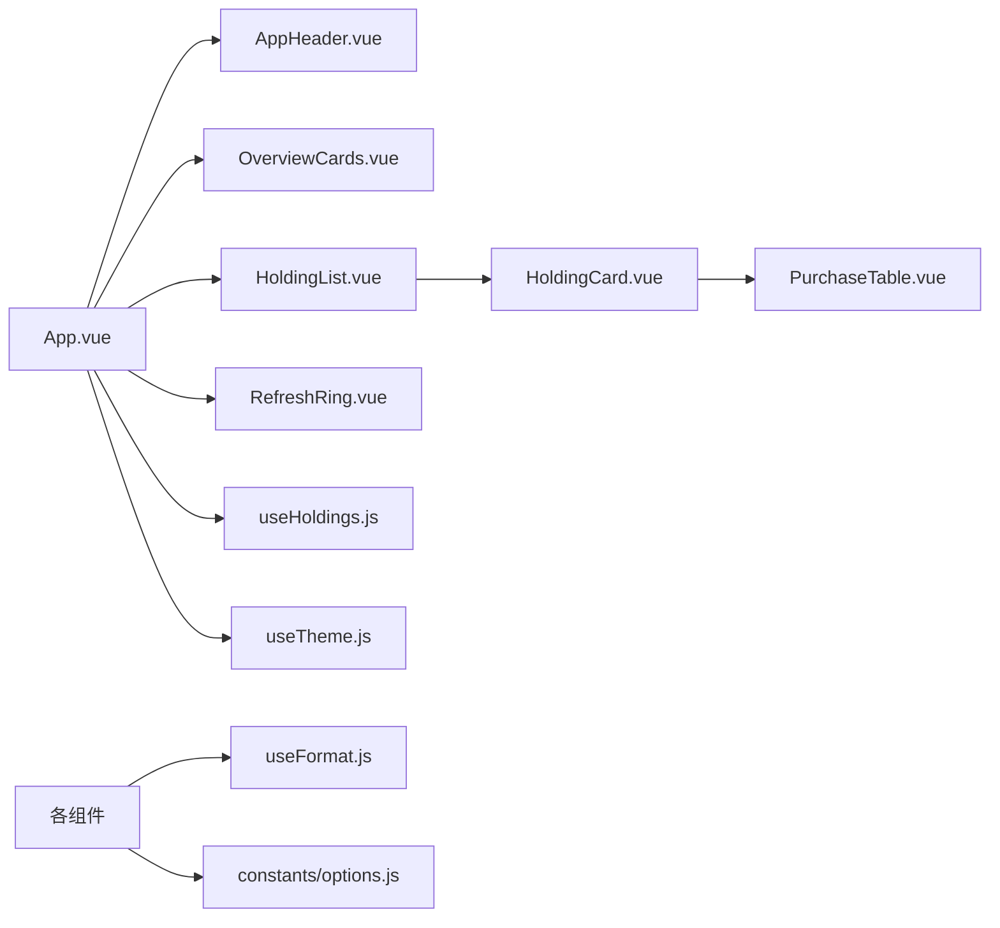

# Vue组件体系

<cite>
**本文引用的文件**
- [web/src/App.vue](file://web/src/App.vue)
- [web/src/components/AppHeader.vue](file://web/src/components/AppHeader.vue)
- [web/src/components/OverviewCards.vue](file://web/src/components/OverviewCards.vue)
- [web/src/components/HoldingList.vue](file://web/src/components/HoldingList.vue)
- [web/src/components/HoldingCard.vue](file://web/src/components/HoldingCard.vue)
- [web/src/components/PurchaseTable.vue](file://web/src/components/PurchaseTable.vue)
- [web/src/components/RefreshRing.vue](file://web/src/components/RefreshRing.vue)
- [web/src/composables/useHoldings.js](file://web/src/composables/useHoldings.js)
- [web/src/composables/useTheme.js](file://web/src/composables/useTheme.js)
- [web/src/composables/useFormat.js](file://web/src/composables/useFormat.js)
- [web/src/constants/options.js](file://web/src/constants/options.js)
- [web/src/main.js](file://web/src/main.js)
- [web/index.html](file://web/index.html)
</cite>

## 目录
1. [简介](#简介)
2. [项目结构](#项目结构)
3. [核心组件](#核心组件)
4. [架构总览](#架构总览)
5. [详细组件分析](#详细组件分析)
6. [依赖关系分析](#依赖关系分析)
7. [性能与优化](#性能与优化)
8. [故障排查指南](#故障排查指南)
9. [结论](#结论)
10. [附录：开发指南与最佳实践](#附录：开发指南与最佳实践)

## 简介
本文件面向Stock Advisor的前端Vue应用，系统性解析以App.vue为主容器的组件体系，涵盖主容器职责、生命周期管理、UI组件功能（HoldingCard、OverviewCards、AppHeader、HoldingList等）、组件通信机制（props、事件发射、状态提升）、响应式设计与DaisyUI集成、组件复用策略、性能优化技巧与最佳实践。文档提供可视化架构图与流程图，帮助开发者快速理解并扩展界面功能。

## 项目结构
前端采用Vue 3 + Composition API组织代码，核心入口为main.js挂载App.vue；页面布局由App.vue组合头部、概览卡片、持仓列表及多个弹窗；数据与状态通过composables集中管理；样式基于Tailwind CSS与DaisyUI主题系统。

图表来源
- [web/index.html:1-13](file://web/index.html#L1-L13)
- [web/src/main.js:1-6](file://web/src/main.js#L1-L6)
- [web/src/App.vue:1-197](file://web/src/App.vue#L1-L197)
- [web/src/components/AppHeader.vue:1-64](file://web/src/components/AppHeader.vue#L1-L64)
- [web/src/components/OverviewCards.vue:1-41](file://web/src/components/OverviewCards.vue#L1-L41)
- [web/src/components/HoldingList.vue:1-36](file://web/src/components/HoldingList.vue#L1-L36)
- [web/src/components/HoldingCard.vue:1-161](file://web/src/components/HoldingCard.vue#L1-L161)
- [web/src/components/PurchaseTable.vue:1-79](file://web/src/components/PurchaseTable.vue#L1-L79)
- [web/src/components/RefreshRing.vue:1-24](file://web/src/components/RefreshRing.vue#L1-L24)
- [web/src/composables/useHoldings.js:1-154](file://web/src/composables/useHoldings.js#L1-L154)
- [web/src/composables/useTheme.js:1-26](file://web/src/composables/useTheme.js#L1-L26)
- [web/src/composables/useFormat.js:1-70](file://web/src/composables/useFormat.js#L1-L70)
- [web/src/constants/options.js:1-33](file://web/src/constants/options.js#L1-L33)

章节来源
- [web/src/main.js:1-6](file://web/src/main.js#L1-L6)
- [web/index.html:1-13](file://web/index.html#L1-L13)
- [web/src/App.vue:1-197](file://web/src/App.vue#L1-L197)

## 核心组件
- App.vue：应用主容器，负责主题初始化、数据获取与自动刷新、过滤逻辑、弹窗状态管理，以及子组件装配与事件分发。
- AppHeader.vue：顶部导航栏，展示更新时间、加载状态、倒计时环形进度，并提供主题切换、刷新、导入CSV、测试飞书、添加持仓等操作入口。
- OverviewCards.vue：投资组合概览，汇总显示持仓数、总成本、总市值、今日收益、持仓收益。
- HoldingList.vue：持仓列表容器，渲染HoldingCard并透传事件至父级。
- HoldingCard.vue：单个持仓卡片，展示基本信息、指标、告警阈值设置、买入明细折叠区，触发交易与买入记录操作。
- PurchaseTable.vue：买入/卖出明细表格，展示每笔交易的日期、类型、价格、数量、成本、市值、收益与止盈止损配置。
- RefreshRing.vue：倒计时环形进度指示器，配合AppHeader展示剩余秒数。

章节来源
- [web/src/App.vue:1-197](file://web/src/App.vue#L1-L197)
- [web/src/components/AppHeader.vue:1-64](file://web/src/components/AppHeader.vue#L1-L64)
- [web/src/components/OverviewCards.vue:1-41](file://web/src/components/OverviewCards.vue#L1-L41)
- [web/src/components/HoldingList.vue:1-36](file://web/src/components/HoldingList.vue#L1-L36)
- [web/src/components/HoldingCard.vue:1-161](file://web/src/components/HoldingCard.vue#L1-L161)
- [web/src/components/PurchaseTable.vue:1-79](file://web/src/components/PurchaseTable.vue#L1-L79)
- [web/src/components/RefreshRing.vue:1-24](file://web/src/components/RefreshRing.vue#L1-L24)

## 架构总览
整体采用“状态提升 + 组合式函数”模式：
- 状态集中在useHoldings.js中，作为模块级单例，所有组件共享同一份持仓数据与计算结果。
- App.vue作为协调者，订阅状态变化，驱动子组件渲染与交互。
- UI组件通过props接收数据，通过emit向上抛出事件，保持单向数据流。
- 主题状态由useTheme.js统一管理，持久化到localStorage并同步到DOM属性与类名。
- 格式化与徽章映射由useFormat.js提供纯函数，避免副作用，便于复用与测试。

图表来源
- [web/src/components/AppHeader.vue:1-64](file://web/src/components/AppHeader.vue#L1-L64)
- [web/src/App.vue:1-197](file://web/src/App.vue#L1-L197)
- [web/src/composables/useHoldings.js:1-154](file://web/src/composables/useHoldings.js#L1-L154)

章节来源
- [web/src/App.vue:1-197](file://web/src/App.vue#L1-L197)
- [web/src/composables/useHoldings.js:1-154](file://web/src/composables/useHoldings.js#L1-L154)
- [web/src/composables/useTheme.js:1-26](file://web/src/composables/useTheme.js#L1-L26)

## 详细组件分析

### App.vue：主容器与生命周期管理
- 职责
  - 初始化主题与数据：在mounted钩子中调用initTheme、fetchHoldings、startAutoRefresh。
  - 管理全局弹窗状态：AddHoldingModal、TransactionModal、BuyRecordModal、ImportCsvModal的显隐。
  - 维护多选标签过滤：按类型与市场筛选持仓，提供清除过滤能力。
  - 组装子组件并传递props：将lastUpdated、loading、error、countdown、isDark等传递给AppHeader；将汇总指标传递给OverviewCards；将filteredHoldings传递给HoldingList。
  - 处理子组件事件：转发open-txn、open-add-buy、edit-buy、delete-buy等事件到对应处理函数。
  - 自动刷新与清理：onUnmounted中停止定时器与清理计时器，避免内存泄漏。
- 关键流程
  - 自动刷新：使用setInterval每秒递减countdown，归零时调用fetchHoldings；刷新后重置countdown。
  - 过滤逻辑：根据activeFilters中的type与region进行过滤，支持地区中文名与短码映射。
  - 飞书测试：调用/api/test-feishu发送测试消息，显示成功或错误信息并在超时后隐藏。

图表来源
- [web/src/App.vue:1-197](file://web/src/App.vue#L1-L197)
- [web/src/composables/useHoldings.js:1-154](file://web/src/composables/useHoldings.js#L1-L154)

章节来源
- [web/src/App.vue:1-197](file://web/src/App.vue#L1-L197)
- [web/src/composables/useHoldings.js:1-154](file://web/src/composables/useHoldings.js#L1-L154)

### AppHeader.vue：用户交互入口
- 职责
  - 展示更新时间、加载状态、倒计时环形进度。
  - 提供主题切换、刷新、导入CSV、测试飞书、添加持仓按钮。
  - 通过emit向父组件传递事件，如toggle-theme、refresh、test-feishu、add、import-csv。
- 设计要点
  - 使用DaisyUI按钮与图标，保持简洁一致的交互风格。
  - 结合RefreshRing组件实现倒计时可视化。
  - 错误提示与测试消息动态显示，提升用户体验。

章节来源
- [web/src/components/AppHeader.vue:1-64](file://web/src/components/AppHeader.vue#L1-L64)
- [web/src/components/RefreshRing.vue:1-24](file://web/src/components/RefreshRing.vue#L1-L24)

### OverviewCards.vue：投资组合概览
- 职责
  - 展示持仓数、总成本、总市值、今日收益、持仓收益。
  - 使用格式化函数与收益颜色类，直观呈现盈亏情况。
- 设计要点
  - 响应式网格布局，适配不同屏幕尺寸。
  - 通过props接收汇总数据，保持无状态与可复用性。

章节来源
- [web/src/components/OverviewCards.vue:1-41](file://web/src/components/OverviewCards.vue#L1-L41)
- [web/src/composables/useFormat.js:1-70](file://web/src/composables/useFormat.js#L1-L70)

### HoldingList.vue：持仓列表容器
- 职责
  - 遍历holdings数组渲染HoldingCard。
  - 将子组件的事件带上对应的holding对象向上透传给父组件。
  - 空状态提示，引导用户添加持仓。
- 设计要点
  - 事件转发封装forward函数，简化模板中的事件绑定。
  - key使用holding.id确保列表渲染稳定性。

章节来源
- [web/src/components/HoldingList.vue:1-36](file://web/src/components/HoldingList.vue#L1-L36)

### HoldingCard.vue：单个持仓信息
- 职责
  - 展示持仓基本信息（名称、状态、市场、类型、策略、触发状态）。
  - 展示汇总指标（市值/数量、成本/现价、今日收益/收益率、持仓收益/收益率、止盈止损、补仓参数、日涨跌告警阈值）。
  - 提供展开/收起买入明细的功能。
  - 内联编辑日涨跌告警阈值，调用updateHolding保存。
  - 触发交易与买入记录操作，通过emit向父组件传递事件。
- 设计要点
  - 使用DaisyUI badge与input样式，统一视觉语言。
  - 使用useFormat提供的格式化与颜色类，保证一致性。
  - 内联编辑包含输入校验与错误提示，提升可用性。

图表来源
- [web/src/components/HoldingCard.vue:1-161](file://web/src/components/HoldingCard.vue#L1-L161)
- [web/src/components/PurchaseTable.vue:1-79](file://web/src/components/PurchaseTable.vue#L1-L79)

章节来源
- [web/src/components/HoldingCard.vue:1-161](file://web/src/components/HoldingCard.vue#L1-L161)
- [web/src/components/PurchaseTable.vue:1-79](file://web/src/components/PurchaseTable.vue#L1-L79)

### PurchaseTable.vue：买入/卖出明细表格
- 职责
  - 展示每笔交易的日期、类型、价格、数量、成本、市值、收益与收益率。
  - 对买入记录显示止盈与止损百分比，卖出记录显示收益。
  - 提供下阶段策略提示。
- 设计要点
  - 使用格式化函数与收益颜色类，保持一致的数值展示。
  - 空状态提示，增强可读性。

章节来源
- [web/src/components/PurchaseTable.vue:1-79](file://web/src/components/PurchaseTable.vue#L1-L79)
- [web/src/composables/useFormat.js:1-70](file://web/src/composables/useFormat.js#L1-L70)

### RefreshRing.vue：倒计时环形进度
- 职责
  - 根据ringC与offset计算环形进度，展示剩余刷新时间。
- 设计要点
  - 使用SVG circle与stroke-dasharray/stroke-dashoffset实现动画效果。
  - 与AppHeader配合，提供直观的刷新倒计时反馈。

章节来源
- [web/src/components/RefreshRing.vue:1-24](file://web/src/components/RefreshRing.vue#L1-L24)

## 依赖关系分析
- 组件耦合度
  - App.vue与子组件之间通过props与emit解耦，职责清晰。
  - useHoldings.js作为状态中心，被App.vue与HoldingCard.vue等组件引用，形成松耦合的数据流。
  - useFormat.js提供纯函数，被多个组件复用，降低重复逻辑。
- 外部依赖
  - Tailwind CSS与DaisyUI用于样式与组件库。
  - 后端API：/api/holdings、/api/holdings/:id/transactions、/api/holdings/:id/purchases、/api/test-feishu。
- 潜在循环依赖
  - 当前结构未发现循环依赖，组件间依赖方向明确。

图表来源
- [web/src/App.vue:1-197](file://web/src/App.vue#L1-L197)
- [web/src/components/AppHeader.vue:1-64](file://web/src/components/AppHeader.vue#L1-L64)
- [web/src/components/OverviewCards.vue:1-41](file://web/src/components/OverviewCards.vue#L1-L41)
- [web/src/components/HoldingList.vue:1-36](file://web/src/components/HoldingList.vue#L1-L36)
- [web/src/components/HoldingCard.vue:1-161](file://web/src/components/HoldingCard.vue#L1-L161)
- [web/src/components/PurchaseTable.vue:1-79](file://web/src/components/PurchaseTable.vue#L1-L79)
- [web/src/components/RefreshRing.vue:1-24](file://web/src/components/RefreshRing.vue#L1-L24)
- [web/src/composables/useHoldings.js:1-154](file://web/src/composables/useHoldings.js#L1-L154)
- [web/src/composables/useTheme.js:1-26](file://web/src/composables/useTheme.js#L1-L26)
- [web/src/composables/useFormat.js:1-70](file://web/src/composables/useFormat.js#L1-L70)
- [web/src/constants/options.js:1-33](file://web/src/constants/options.js#L1-L33)

章节来源
- [web/src/App.vue:1-197](file://web/src/App.vue#L1-L197)
- [web/src/composables/useHoldings.js:1-154](file://web/src/composables/useHoldings.js#L1-L154)

## 性能与优化
- 状态集中与计算缓存
  - useHoldings.js中使用computed聚合总成本、总市值、总收益等，避免重复计算。
  - 模块级单例状态确保跨组件数据一致性与最小化重渲染。
- 自动刷新与定时器管理
  - 单一定时器心跳递减，避免多定时器漂移；在onUnmounted中清理定时器，防止内存泄漏。
- 列表渲染优化
  - 使用key绑定holding.id，提高diff效率。
  - 过滤逻辑在父组件中计算，减少子组件不必要的渲染。
- 样式与主题
  - 使用DaisyUI主题变量与Tailwind原子类，减少自定义CSS，提升构建与运行时性能。
- 网络请求
  - 写操作后统一调用fetchHoldings刷新列表，保证数据一致性；错误处理统一捕获并提示。

[本节为通用性能建议，不直接分析具体文件]

## 故障排查指南
- 数据获取失败
  - 检查loading与error状态，查看控制台错误信息；确认后端/api/holdings接口可用。
  - 参考路径：[web/src/composables/useHoldings.js:15-29](file://web/src/composables/useHoldings.js#L15-L29)
- 自动刷新异常
  - 确认startAutoRefresh已调用且未重复创建定时器；检查onUnmounted是否正确清理。
  - 参考路径：[web/src/composables/useHoldings.js:35-50](file://web/src/composables/useHoldings.js#L35-L50)
- 主题切换无效
  - 检查localStorage中theme值与应用逻辑；确认document.documentElement的data-theme与classList更新。
  - 参考路径：[web/src/composables/useTheme.js:5-21](file://web/src/composables/useTheme.js#L5-L21)
- 表单提交错误
  - 查看API返回的error字段；确认请求体结构与Content-Type设置正确。
  - 参考路径：[web/src/composables/useHoldings.js:67-130](file://web/src/composables/useHoldings.js#L67-L130)
- 飞书测试失败
  - 检查/api/test-feishu接口响应；确认testing状态与消息显示逻辑。
  - 参考路径：[web/src/App.vue:27-46](file://web/src/App.vue#L27-L46)

章节来源
- [web/src/composables/useHoldings.js:15-50](file://web/src/composables/useHoldings.js#L15-L50)
- [web/src/composables/useTheme.js:5-21](file://web/src/composables/useTheme.js#L5-L21)
- [web/src/App.vue:27-46](file://web/src/App.vue#L27-L46)

## 结论
该Vue组件体系以App.vue为核心，结合useHoldings与useTheme等组合式函数，实现了清晰的状态管理与组件通信。通过props与emit的单向数据流，保证了组件的可维护性与可测试性。响应式设计与DaisyUI集成提供了良好的用户体验。未来可扩展更多弹窗与业务逻辑，同时保持现有架构的简洁与高效。

[本节为总结性内容，不直接分析具体文件]

## 附录：开发指南与最佳实践
- 组件通信
  - 使用props向下传递数据，使用emit向上抛出事件，避免直接修改父组件状态。
  - 在HoldingList中封装forward函数，简化事件透传。
- 状态管理
  - 将共享状态放入composables，使用ref与computed管理响应式数据。
  - 写操作后统一刷新列表，确保数据一致性。
- 样式与主题
  - 使用DaisyUI的badge、btn、input等组件，保持视觉一致性。
  - 通过useTheme管理主题切换，并持久化到localStorage。
- 性能优化
  - 使用computed缓存计算结果，减少重复计算。
  - 合理拆分组件，避免大组件导致渲染性能下降。
- 错误处理
  - 统一捕获API错误并提示用户，提升用户体验。
  - 在组件卸载时清理定时器与监听器，防止内存泄漏。

[本节为通用开发指南，不直接分析具体文件]