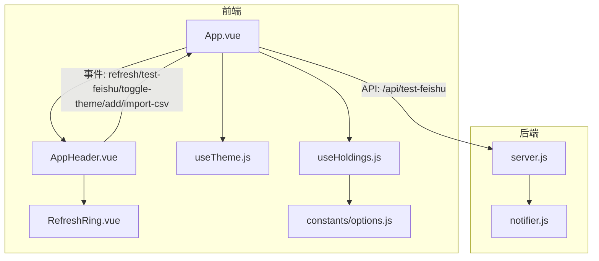
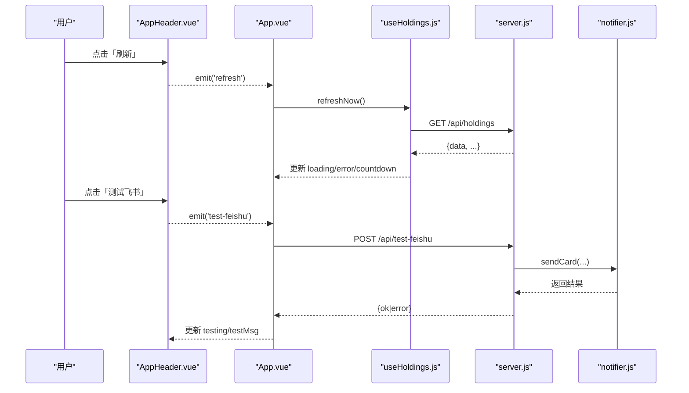
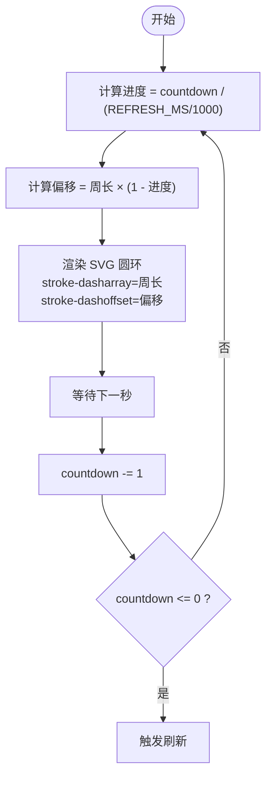
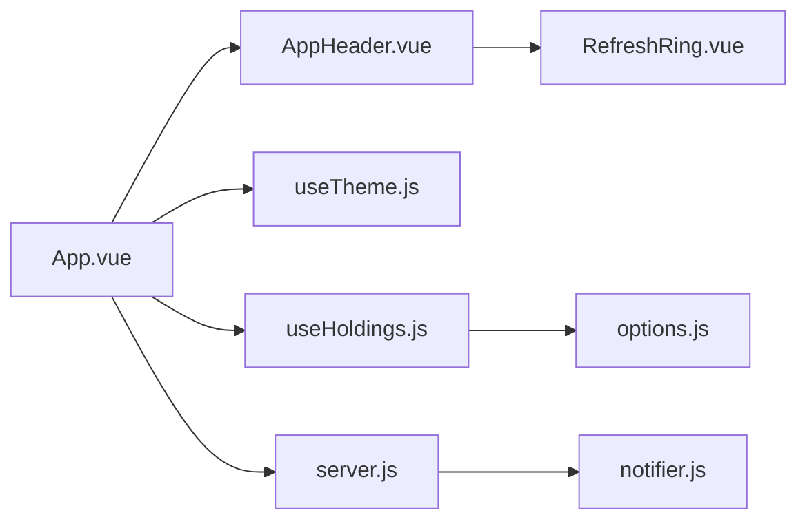

# 应用头部组件

<cite>
**本文引用的文件**
- [AppHeader.vue](file://web/src/components/AppHeader.vue)
- [RefreshRing.vue](file://web/src/components/RefreshRing.vue)
- [useTheme.js](file://web/src/composables/useTheme.js)
- [useHoldings.js](file://web/src/composables/useHoldings.js)
- [options.js](file://web/src/constants/options.js)
- [App.vue](file://web/src/App.vue)
- [server.js](file://server/server.js)
- [notifier.js](file://server/notifier.js)
</cite>

## 目录
1. [简介](#简介)
2. [项目结构](#项目结构)
3. [核心组件](#核心组件)
4. [架构总览](#架构总览)
5. [详细组件分析](#详细组件分析)
6. [依赖关系分析](#依赖关系分析)
7. [性能考量](#性能考量)
8. [故障排查指南](#故障排查指南)
9. [结论](#结论)
10. [附录：定制与扩展指南](#附录：定制与扩展指南)

## 简介
本文件聚焦于“应用头部组件”（AppHeader）的实现与使用，覆盖以下主题：
- 顶部导航栏功能：标题显示、更新时间、加载状态、错误提示、倒计时环形进度条、主题切换按钮、刷新控制、飞书测试通知、导入CSV入口、添加持仓入口。
- 倒计时环形进度条实现原理：SVG绘制、动画效果与实时更新逻辑。
- 用户交互处理：按钮点击事件、状态切换与用户反馈机制。
- 响应式设计与移动端优化：布局与触摸友好交互。
- 与父组件通信模式：Props传递、事件发射与状态同步。
- 错误处理与加载状态的视觉反馈：网络异常提示与加载指示器。
- 组件定制化与扩展：如何新增头部功能或修改现有行为。

## 项目结构
头部组件位于前端 Vue 应用中，由 App.vue 作为根容器进行组合；倒计时环形进度条为独立子组件；主题切换通过可复用的组合式函数 useTheme 管理；自动刷新与倒计时由 useHoldings 组合式函数驱动；飞书测试消息通过后端 API 发送。

图表来源
- [App.vue:132-149](file://web/src/App.vue#L132-L149)
- [AppHeader.vue:1-64](file://web/src/components/AppHeader.vue#L1-L64)
- [RefreshRing.vue:1-24](file://web/src/components/RefreshRing.vue#L1-L24)
- [useTheme.js:1-26](file://web/src/composables/useTheme.js#L1-L26)
- [useHoldings.js:1-154](file://web/src/composables/useHoldings.js#L1-L154)
- [options.js:1-33](file://web/src/constants/options.js#L1-L33)
- [server.js:545-562](file://server/server.js#L545-L562)
- [notifier.js:1-112](file://server/notifier.js#L1-L112)

章节来源
- [App.vue:132-149](file://web/src/App.vue#L132-L149)
- [AppHeader.vue:1-64](file://web/src/components/AppHeader.vue#L1-L64)
- [RefreshRing.vue:1-24](file://web/src/components/RefreshRing.vue#L1-L24)
- [useTheme.js:1-26](file://web/src/composables/useTheme.js#L1-L26)
- [useHoldings.js:1-154](file://web/src/composables/useHoldings.js#L1-L154)
- [options.js:1-33](file://web/src/constants/options.js#L1-L33)
- [server.js:545-562](file://server/server.js#L545-L562)
- [notifier.js:1-112](file://server/notifier.js#L1-L112)

## 核心组件
- AppHeader.vue：应用头部展示与交互入口，接收来自父组件的状态与配置，并通过事件向父组件广播操作意图。
- RefreshRing.vue：基于 SVG 的倒计时环形进度条，根据传入的周长与偏移量实时渲染进度。
- useTheme.js：主题状态与切换逻辑，持久化到 localStorage，并动态设置文档级主题属性与类名。
- useHoldings.js：持仓数据获取、自动刷新定时器、倒计时更新、错误与加载状态管理。
- options.js：全局常量，如自动刷新间隔 REFRESH_MS。
- App.vue：组合上述能力，计算环形进度偏移，绑定事件处理器，协调弹窗与数据流。
- server.js + notifier.js：提供 /api/test-feishu 接口，构造并发送飞书卡片消息。

章节来源
- [AppHeader.vue:1-64](file://web/src/components/AppHeader.vue#L1-L64)
- [RefreshRing.vue:1-24](file://web/src/components/RefreshRing.vue#L1-L24)
- [useTheme.js:1-26](file://web/src/composables/useTheme.js#L1-L26)
- [useHoldings.js:1-154](file://web/src/composables/useHoldings.js#L1-L154)
- [options.js:1-33](file://web/src/constants/options.js#L1-L33)
- [App.vue:22-46](file://web/src/App.vue#L22-L46)
- [server.js:545-562](file://server/server.js#L545-L562)
- [notifier.js:1-112](file://server/notifier.js#L1-L112)

## 架构总览
头部组件通过 props 接收父组件提供的状态（如 lastUpdated、loading、error、countdown、isDark、testing、testMsg），以及用于渲染环形进度的 ringC 与 ringOffset。用户交互触发 emit 事件，由父组件统一处理业务逻辑（刷新、切换主题、打开弹窗、调用后端 API）。

图表来源
- [AppHeader.vue:36-54](file://web/src/components/AppHeader.vue#L36-L54)
- [App.vue:27-46](file://web/src/App.vue#L27-L46)
- [useHoldings.js:15-33](file://web/src/composables/useHoldings.js#L15-L33)
- [server.js:545-562](file://server/server.js#L545-L562)
- [notifier.js:80-112](file://server/notifier.js#L80-L112)

## 详细组件分析

### AppHeader.vue：头部导航与交互
- 标题与描述：显示应用名称、功能说明、最后更新时间、加载状态、倒计时秒数与环形进度图标。
- 主题切换：按钮触发 toggle-theme 事件，由父组件切换 isDark 并持久化主题。
- 刷新控制：按钮触发 refresh 事件，由父组件调用刷新逻辑。
- 飞书测试通知：按钮触发 test-feishu 事件，父组件发起请求并在成功后显示成功消息，失败时显示错误信息；支持禁用态与发送中提示。
- 导入 CSV 与添加持仓：分别触发 import-csv 与 add 事件，由父组件打开对应弹窗。
- 错误提示：当 error 存在时，以文本形式在头部右侧显示错误信息。
- 响应式布局：使用 flex 布局与间距控制，适配不同屏幕尺寸；按钮采用紧凑样式，便于移动端点击。

章节来源
- [AppHeader.vue:1-64](file://web/src/components/AppHeader.vue#L1-L64)

### RefreshRing.vue：倒计时环形进度条
- SVG 绘制：两个圆环，背景圆环使用低透明度描边，前景圆环使用主题色与圆头端点，通过 stroke-dasharray 与 stroke-dashoffset 控制进度。
- 参数：ringC 为圆周长（2πr），offset 为当前偏移量；父组件根据 countdown 与 REFRESH_MS 计算 progress 与 offset。
- 动画效果：随着 countdown 递减，offset 线性变化，形成从满圈到空圈的倒计时动画。
- 实时更新：父组件每秒更新 countdown，从而驱动 offset 变化，达到平滑动画。

图表来源
- [App.vue:22-25](file://web/src/App.vue#L22-L25)
- [RefreshRing.vue:1-24](file://web/src/components/RefreshRing.vue#L1-L24)
- [useHoldings.js:35-43](file://web/src/composables/useHoldings.js#L35-L43)
- [options.js:31-33](file://web/src/constants/options.js#L31-L33)

章节来源
- [RefreshRing.vue:1-24](file://web/src/components/RefreshRing.vue#L1-L24)
- [App.vue:22-25](file://web/src/App.vue#L22-L25)
- [useHoldings.js:35-43](file://web/src/composables/useHoldings.js#L35-L43)
- [options.js:31-33](file://web/src/constants/options.js#L31-L33)

### 主题切换：useTheme.js
- 状态管理：使用 ref 维护 isDark，默认深色。
- 应用主题：设置 documentElement 的 data-theme 与 dark class，切换浅色/深色主题。
- 初始化：从 localStorage 读取已保存的主题，若不存在则使用默认深色。
- 切换逻辑：toggleTheme 翻转 isDark，写入 localStorage，并重新应用主题。

章节来源
- [useTheme.js:1-26](file://web/src/composables/useTheme.js#L1-L26)

### 自动刷新与倒计时：useHoldings.js
- 数据获取：fetchHoldings 调用 /api/holdings，更新 holdings、lastUpdated、loading、error，并重置 countdown。
- 立即刷新：refreshNow 直接调用 fetchHoldings。
- 自动刷新：startAutoRefresh 启动每秒心跳定时器，countdown 递减至 0 时触发刷新；stopAutoRefresh 清理定时器。
- 汇总计算：totalCost、totalMarket、totalHoldingProfit、totalTodayProfit 等派生值。

章节来源
- [useHoldings.js:1-154](file://web/src/composables/useHoldings.js#L1-L154)

### 父组件通信：App.vue
- 环形进度计算：RING_C 为固定周长，progress 由 countdown 与 REFRESH_MS 计算，ringOffset 为周长乘以剩余比例。
- 飞书测试：testFeishu 调用 /api/test-feishu，设置 testing 与 testMsg，并在完成后清除计时器与消息。
- 事件绑定：将 AppHeader 的事件映射到父组件方法（toggle-theme、refresh、test-feishu、add、import-csv）。
- 生命周期：onMounted 初始化主题、获取数据、启动自动刷新；onUnmounted 停止刷新与清理计时器。

章节来源
- [App.vue:22-46](file://web/src/App.vue#L22-L46)
- [App.vue:121-129](file://web/src/App.vue#L121-L129)
- [App.vue:132-149](file://web/src/App.vue#L132-L149)

### 后端接口与飞书推送：server.js + notifier.js
- /api/test-feishu：POST 请求，调用 sendCard 构造并发送飞书卡片消息，支持 secret 签名与重试机制。
- sendCard：构建 interactive 卡片，支持日涨跌告警与买卖提醒模板，封装 HTTP 请求与错误处理。

章节来源
- [server.js:545-562](file://server/server.js#L545-L562)
- [notifier.js:1-112](file://server/notifier.js#L1-L112)

## 依赖关系分析
- AppHeader 依赖 RefreshRing 用于倒计时可视化。
- AppHeader 通过 Props 接收 App 的状态，通过 emit 与 App 通信。
- App 依赖 useTheme 与 useHoldings，负责主题与数据刷新逻辑。
- App 通过 fetch 调用后端 /api/test-feishu，后端通过 notifier 发送飞书消息。
- 常量 REFRESH_MS 在 App 与 useHoldings 中共同使用，确保前后端刷新节奏一致。

图表来源
- [App.vue:132-149](file://web/src/App.vue#L132-L149)
- [AppHeader.vue:1-64](file://web/src/components/AppHeader.vue#L1-L64)
- [RefreshRing.vue:1-24](file://web/src/components/RefreshRing.vue#L1-L24)
- [useTheme.js:1-26](file://web/src/composables/useTheme.js#L1-L26)
- [useHoldings.js:1-154](file://web/src/composables/useHoldings.js#L1-L154)
- [options.js:1-33](file://web/src/constants/options.js#L1-L33)
- [server.js:545-562](file://server/server.js#L545-L562)
- [notifier.js:1-112](file://server/notifier.js#L1-L112)

章节来源
- [App.vue:132-149](file://web/src/App.vue#L132-L149)
- [AppHeader.vue:1-64](file://web/src/components/AppHeader.vue#L1-L64)
- [RefreshRing.vue:1-24](file://web/src/components/RefreshRing.vue#L1-L24)
- [useTheme.js:1-26](file://web/src/composables/useTheme.js#L1-L26)
- [useHoldings.js:1-154](file://web/src/composables/useHoldings.js#L1-L154)
- [options.js:1-33](file://web/src/constants/options.js#L1-L33)
- [server.js:545-562](file://server/server.js#L545-L562)
- [notifier.js:1-112](file://server/notifier.js#L1-L112)

## 性能考量
- 环形进度条仅依赖两个 SVG 圆环与 CSS 类，渲染开销极低；通过 stroke-dashoffset 更新实现高效动画。
- 自动刷新使用单一 setInterval，避免多定时器漂移；每秒递减一次，归零即刷新，减少频繁 DOM 操作。
- 主题切换通过一次性设置 documentElement 属性与类名，避免重复计算。
- 网络请求集中在 useHoldings 与 App 的 testFeishu，错误路径快速回退并更新 UI。

[本节为通用性能建议，不直接分析具体代码文件]

## 故障排查指南
- 刷新失败：检查 /api/holdings 是否可达；查看 useHoldings.fetchHoldings 的错误分支，确认 error 状态是否正确显示。
- 倒计时不更新：确认 startAutoRefresh 已调用且未重复创建定时器；检查 countdown 是否在每秒递减。
- 环形进度异常：核对 RING_C 与 ringOffset 的计算；确保 REFRESH_MS 与 countdown 单位一致。
- 主题未生效：检查 useTheme.initTheme 是否执行；确认 localStorage 中的 theme 值与 applyTheme 逻辑。
- 飞书测试失败：查看 /api/test-feishu 返回；检查 notifier.sendCard 的重试与错误信息；确认 webhook 与 secret 配置正确。

章节来源
- [useHoldings.js:15-33](file://web/src/composables/useHoldings.js#L15-L33)
- [useHoldings.js:35-43](file://web/src/composables/useHoldings.js#L35-L43)
- [App.vue:22-25](file://web/src/App.vue#L22-L25)
- [useTheme.js:10-21](file://web/src/composables/useTheme.js#L10-L21)
- [server.js:545-562](file://server/server.js#L545-L562)
- [notifier.js:80-112](file://server/notifier.js#L80-L112)

## 结论
AppHeader 作为应用的头部入口，提供了清晰的标题、状态提示与常用操作按钮；结合 RefreshRing 实现了直观的倒计时进度；通过事件与 Props 与父组件解耦协作；配合 useTheme 与 useHoldings 完成主题切换与自动刷新；后端接口与飞书推送完善了通知能力。整体设计简洁、可扩展性强，适合进一步定制与扩展。

[本节为总结性内容，不直接分析具体代码文件]

## 附录：定制与扩展指南
- 新增头部按钮：
  - 在 AppHeader.vue 中添加按钮元素，绑定 @click 并 emit 新事件。
  - 在 App.vue 中监听该事件并实现相应逻辑（如打开弹窗、调用 API）。
- 修改环形进度样式：
  - 调整 RefreshRing.vue 的 SVG 尺寸、颜色与端点样式；必要时修改 ringC 与 offset 的计算方式。
- 自定义刷新间隔：
  - 修改 options.js 中的 REFRESH_MS，并确保 App 与 useHoldings 使用该常量。
- 扩展主题：
  - 在 useTheme.js 中增加更多主题选项，或在 App.vue 中扩展 toggleTheme 逻辑。
- 增强错误提示：
  - 在 AppHeader.vue 中为 error 提供更丰富的视觉反馈（如图标、链接）；在 App.vue 中细化错误来源与重试策略。
- 集成其他通知渠道：
  - 在后端 server.js 中新增接口，复用 notifier.js 的消息构造逻辑，或扩展新的通知模块。

[本节为通用指导，不直接分析具体代码文件]