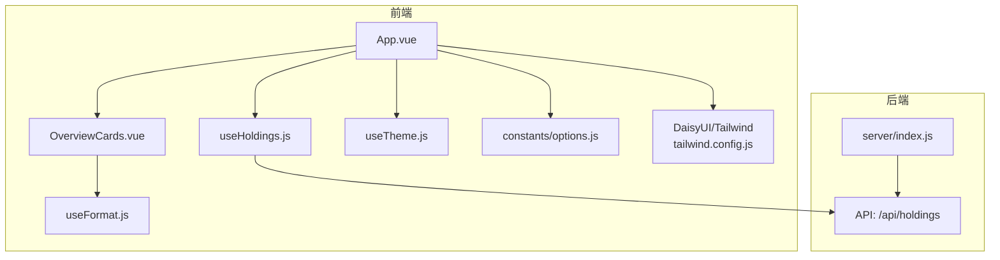
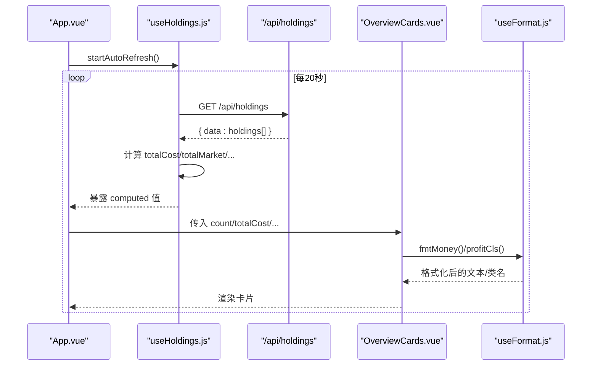
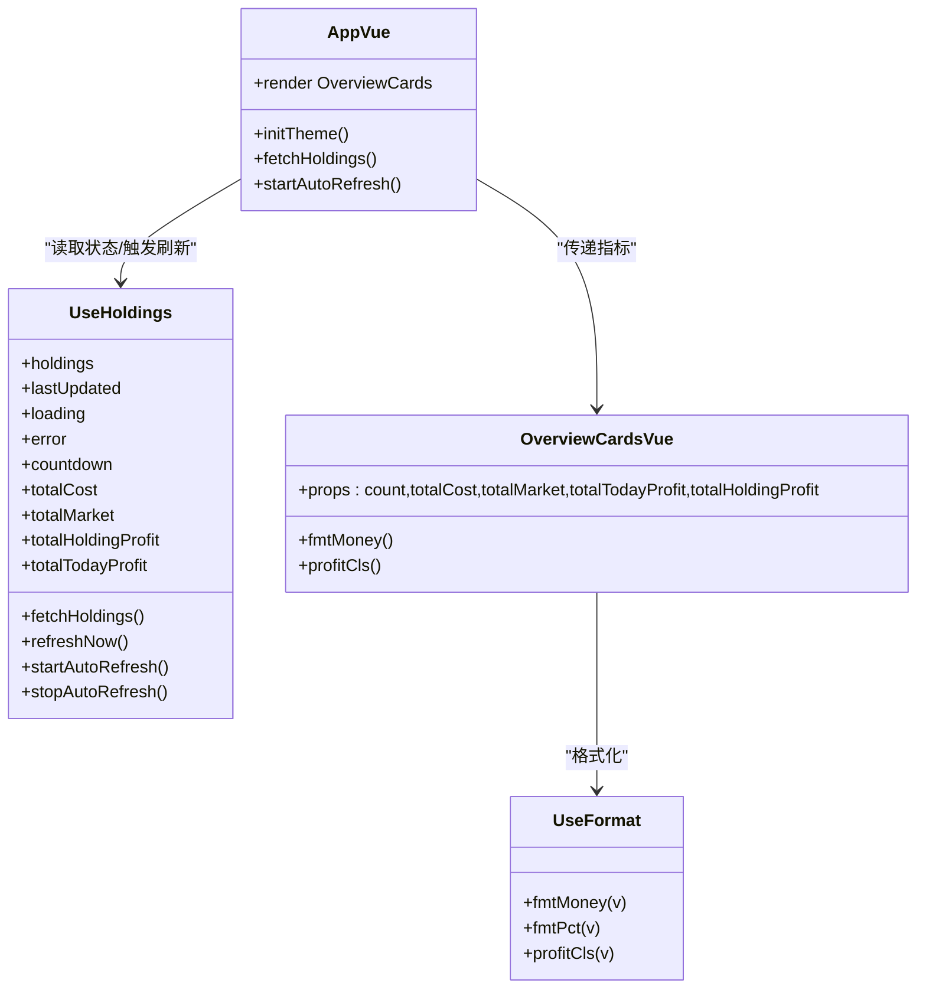
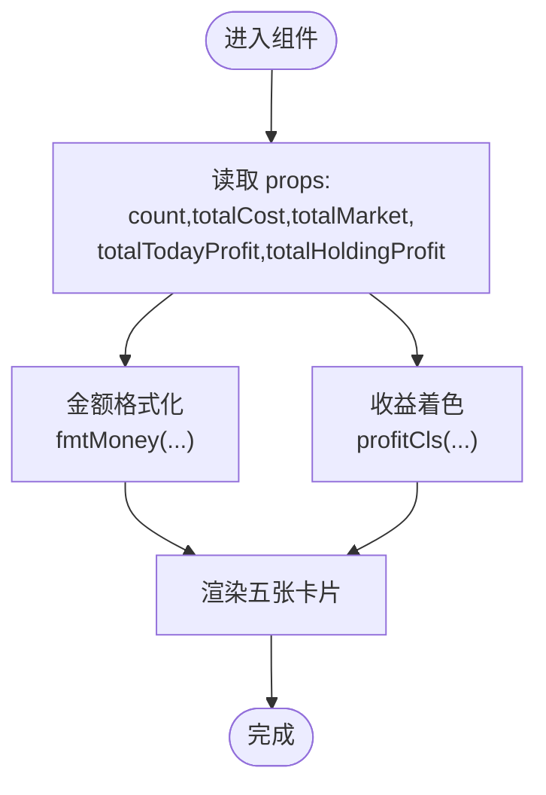
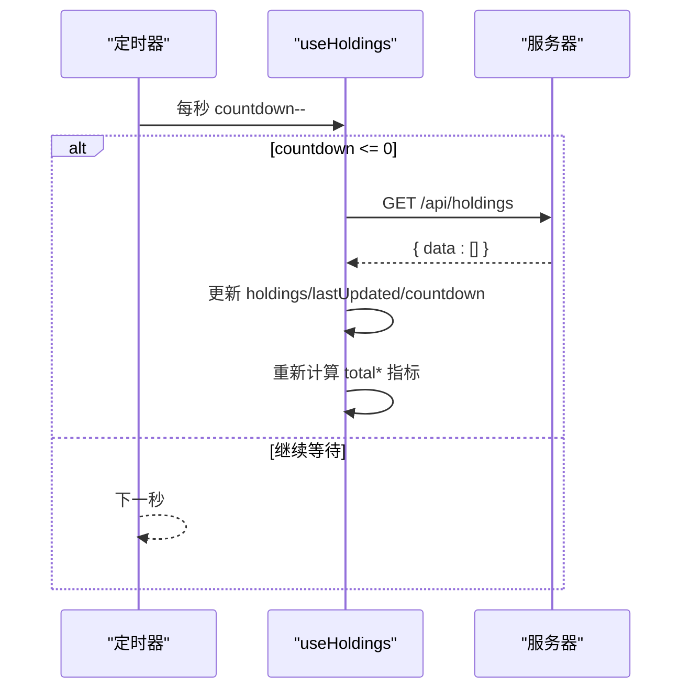
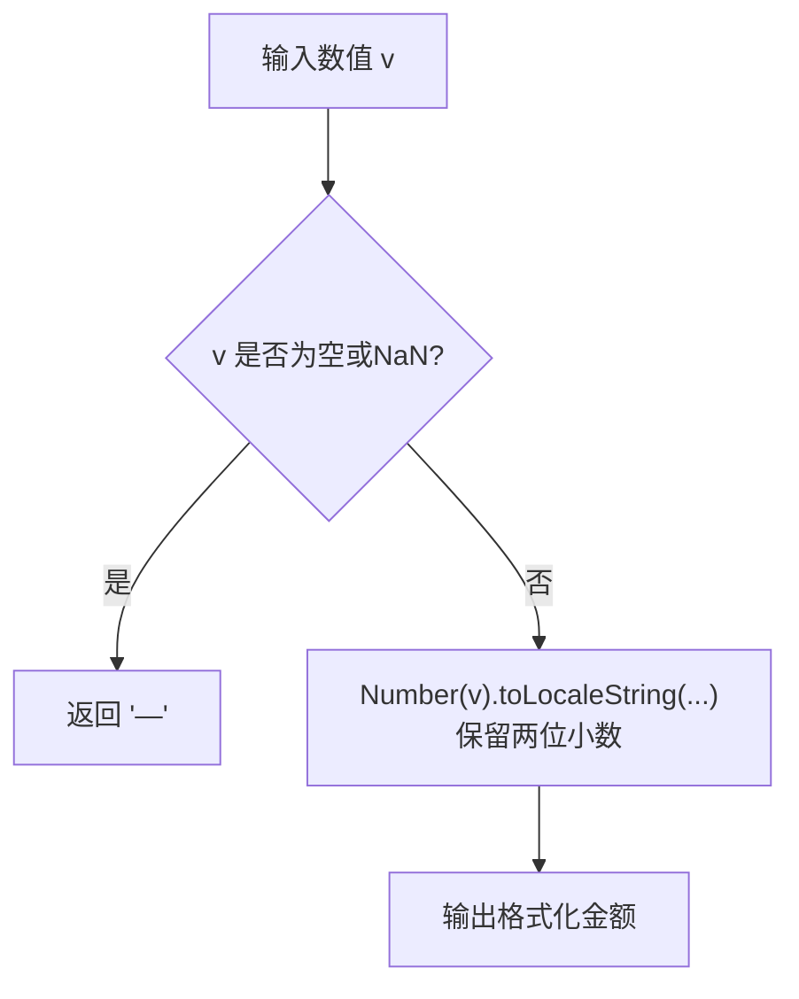
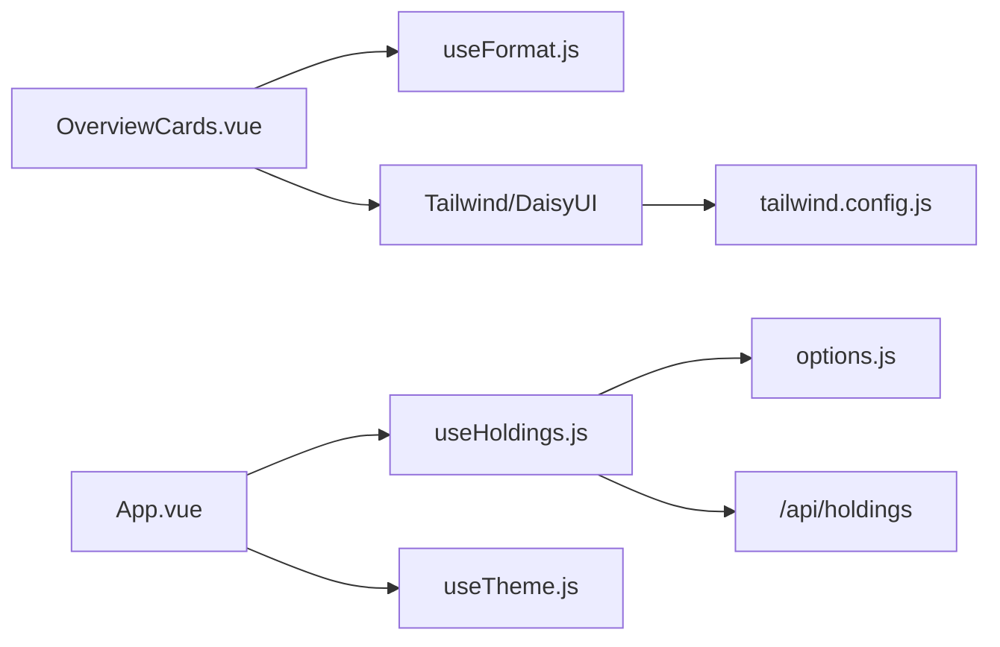

# 投资组合概览卡片

<cite>
**本文引用的文件**
- [OverviewCards.vue](file://web/src/components/OverviewCards.vue)
- [useFormat.js](file://web/src/composables/useFormat.js)
- [useHoldings.js](file://web/src/composables/useHoldings.js)
- [App.vue](file://web/src/App.vue)
- [options.js](file://web/src/constants/options.js)
- [tailwind.config.js](file://tailwind.config.js)
- [style.css](file://web/src/style.css)
- [index.js](file://server/index.js)
</cite>

## 目录
1. [简介](#简介)
2. [项目结构](#项目结构)
3. [核心组件与数据流](#核心组件与数据流)
4. [架构总览](#架构总览)
5. [详细组件分析](#详细组件分析)
6. [依赖关系分析](#依赖关系分析)
7. [性能与可维护性](#性能与可维护性)
8. [故障排查指南](#故障排查指南)
9. [结论](#结论)
10. [附录：样式定制与扩展](#附录样式定制与扩展)

## 简介
本文件面向“投资组合概览卡片”（OverviewCards）的完整技术文档，聚焦以下目标：
- 可视化展示持仓总数、总成本、总市值、今日盈亏、持有盈亏等关键指标。
- 说明金额数字格式化（千分位分隔）、百分比显示、货币单位处理。
- 解释响应式布局在不同屏幕尺寸下的卡片排列与自适应效果。
- 描述 DaisyUI 主题与样式集成方式，包括卡片样式、图标与主题适配。
- 阐述数据更新机制：自动刷新、倒计时、错误提示与动画过渡。
- 提供样式定制选项与扩展方法，帮助开发者自定义概览界面外观与行为。

## 项目结构
概览卡片位于前端 Vue 应用中，由 App 根组件编排，使用组合式函数管理数据与状态，并通过 Tailwind + DaisyUI 实现主题化与响应式布局。

图表来源
- [App.vue:152-158](file://web/src/App.vue#L152-L158)
- [OverviewCards.vue:1-41](file://web/src/components/OverviewCards.vue#L1-L41)
- [useHoldings.js:15-29](file://web/src/composables/useHoldings.js#L15-L29)
- [tailwind.config.js:1-54](file://tailwind.config.js#L1-L54)
- [index.js:8-9](file://server/index.js#L8-L9)

章节来源
- [App.vue:1-197](file://web/src/App.vue#L1-L197)
- [OverviewCards.vue:1-41](file://web/src/components/OverviewCards.vue#L1-L41)
- [useHoldings.js:1-154](file://web/src/composables/useHoldings.js#L1-L154)
- [useFormat.js:1-70](file://web/src/composables/useFormat.js#L1-L70)
- [options.js:1-33](file://web/src/constants/options.js#L1-L33)
- [tailwind.config.js:1-54](file://tailwind.config.js#L1-L54)
- [style.css:1-34](file://web/src/style.css#L1-L34)
- [index.js:1-17](file://server/index.js#L1-L17)

## 核心组件与数据流
- OverviewCards 负责渲染五个关键指标卡片：持仓数、总成本、总市值、今日收益、持仓收益。
- useHoldings 聚合所有持仓数据，计算汇总指标，并提供自动刷新与手动刷新能力。
- useFormat 提供统一的数值格式化能力：金额、价格、数量、百分比、收益颜色类名等。
- App 作为编排层，初始化主题、加载并定时刷新数据，将汇总指标传递给 OverviewCards。

图表来源
- [useHoldings.js:35-43](file://web/src/composables/useHoldings.js#L35-L43)
- [useHoldings.js:53-64](file://web/src/composables/useHoldings.js#L53-L64)
- [App.vue:121-125](file://web/src/App.vue#L121-L125)
- [OverviewCards.vue:13-39](file://web/src/components/OverviewCards.vue#L13-L39)
- [useFormat.js:8-12](file://web/src/composables/useFormat.js#L8-L12)
- [useFormat.js:34-41](file://web/src/composables/useFormat.js#L34-L41)

章节来源
- [useHoldings.js:1-154](file://web/src/composables/useHoldings.js#L1-L154)
- [App.vue:121-158](file://web/src/App.vue#L121-L158)
- [OverviewCards.vue:1-41](file://web/src/components/OverviewCards.vue#L1-L41)
- [useFormat.js:1-70](file://web/src/composables/useFormat.js#L1-L70)

## 架构总览
- 数据源：后端通过 /api/holdings 返回持仓数组，包含成本、市值、今日涨跌、持有盈亏等字段。
- 状态管理：useHoldings 以模块级 ref 保存 holdings、loading、error、countdown 等状态，并导出汇总 computed。
- 视图层：App 在挂载时初始化主题、拉取数据并启动自动刷新；OverviewCards 仅做展示与格式化。
- 样式系统：Tailwind + DaisyUI 提供响应式网格、语义化色板与主题切换；自定义 stocklight/stockdark 主题。

图表来源
- [App.vue:15-20](file://web/src/App.vue#L15-L20)
- [App.vue:121-158](file://web/src/App.vue#L121-L158)
- [useHoldings.js:1-154](file://web/src/composables/useHoldings.js#L1-L154)
- [OverviewCards.vue:1-41](file://web/src/components/OverviewCards.vue#L1-L41)
- [useFormat.js:1-70](file://web/src/composables/useFormat.js#L1-L70)

## 详细组件分析

### OverviewCards 组件
- 职责：接收汇总指标并渲染为五张卡片，分别展示持仓数、总成本、总市值、今日收益、持仓收益。
- 布局：使用响应式网格 grid-cols-2/sm:grid-cols-3/lg:grid-cols-5，在小屏两列、中屏三列、大屏五列自适应。
- 格式化：
  - 金额：调用 fmtMoney，输出带千分位分隔且保留两位小数的字符串。
  - 收益颜色：调用 profitCls，根据正负值应用不同语义色（A股习惯：涨红跌绿）。
  - 数字排版：对收益数字启用 tabular-nums 保证对齐。
- 主题：卡片背景、边框、文字颜色基于 base-100/base-300/base-content 等语义变量，随主题切换自动适配。

图表来源
- [OverviewCards.vue:4-10](file://web/src/components/OverviewCards.vue#L4-L10)
- [OverviewCards.vue:13-39](file://web/src/components/OverviewCards.vue#L13-L39)
- [useFormat.js:8-12](file://web/src/composables/useFormat.js#L8-L12)
- [useFormat.js:34-41](file://web/src/composables/useFormat.js#L34-L41)

章节来源
- [OverviewCards.vue:1-41](file://web/src/components/OverviewCards.vue#L1-L41)
- [useFormat.js:1-70](file://web/src/composables/useFormat.js#L1-L70)

### 数据聚合与刷新机制（useHoldings）
- 数据获取：GET /api/holdings，成功后更新 holdings、lastUpdated、重置倒计时。
- 自动刷新：单一定时器每秒递减 countdown，归零时再次请求，避免多定时器漂移。
- 汇总计算：
  - totalCost：累加各持仓 cost。
  - totalMarket：累加各持仓 marketValue。
  - totalHoldingProfit：累加各持仓 holdingProfit。
  - totalTodayProfit：累加各持仓 todayProfit。
- 写操作：添加持仓、交易、保存买入记录、删除买入记录、更新持仓字段后均会重新拉取数据以保持一致性。

图表来源
- [useHoldings.js:35-43](file://web/src/composables/useHoldings.js#L35-L43)
- [useHoldings.js:15-29](file://web/src/composables/useHoldings.js#L15-L29)
- [useHoldings.js:53-64](file://web/src/composables/useHoldings.js#L53-L64)

章节来源
- [useHoldings.js:1-154](file://web/src/composables/useHoldings.js#L1-L154)
- [options.js:31-33](file://web/src/constants/options.js#L31-L33)

### 格式化与主题（useFormat + tailwind.config）
- 金额格式化：fmtMoney 使用 toLocaleString('en-US') 输出千分位分隔，保留两位小数。
- 百分比格式化：fmtPct 输出带 +/- 前缀的百分比字符串。
- 收益颜色：profitCls 返回语义类名，正值用 error（红色），负值用 success（绿色），空值用低透明度内容色。
- 主题：tailwind.config 定义 stocklight/stockdark 两套主题，App 通过 useTheme 切换 <html> 的 dark 类与 data-theme，使卡片背景、边框、文字颜色自动适配。

图表来源
- [useFormat.js:8-12](file://web/src/composables/useFormat.js#L8-L12)
- [useFormat.js:26-28](file://web/src/composables/useFormat.js#L26-L28)
- [useFormat.js:34-41](file://web/src/composables/useFormat.js#L34-L41)
- [tailwind.config.js:13-52](file://tailwind.config.js#L13-L52)

章节来源
- [useFormat.js:1-70](file://web/src/composables/useFormat.js#L1-L70)
- [tailwind.config.js:1-54](file://tailwind.config.js#L1-L54)
- [useTheme.js:1-26](file://web/src/composables/useTheme.js#L1-L26)

## 依赖关系分析
- OverviewCards 依赖 useFormat 进行格式化，依赖 Tailwind/DaisyUI 的语义类名实现主题与布局。
- App 依赖 useHoldings 提供数据与刷新控制，依赖 useTheme 管理主题。
- useHoldings 依赖 options 中的 REFRESH_MS 控制刷新频率，依赖后端 /api/holdings。
- 主题配置集中在 tailwind.config.js，通过 daisyui 插件生效。

图表来源
- [OverviewCards.vue:1-41](file://web/src/components/OverviewCards.vue#L1-L41)
- [useFormat.js:1-70](file://web/src/composables/useFormat.js#L1-L70)
- [App.vue:1-197](file://web/src/App.vue#L1-L197)
- [useHoldings.js:1-154](file://web/src/composables/useHoldings.js#L1-L154)
- [options.js:1-33](file://web/src/constants/options.js#L1-L33)
- [tailwind.config.js:1-54](file://tailwind.config.js#L1-L54)

章节来源
- [App.vue:1-197](file://web/src/App.vue#L1-L197)
- [useHoldings.js:1-154](file://web/src/composables/useHoldings.js#L1-L154)
- [OverviewCards.vue:1-41](file://web/src/components/OverviewCards.vue#L1-L41)
- [useFormat.js:1-70](file://web/src/composables/useFormat.js#L1-L70)
- [options.js:1-33](file://web/src/constants/options.js#L1-L33)
- [tailwind.config.js:1-54](file://tailwind.config.js#L1-L54)

## 性能与可维护性
- 计算开销：汇总指标使用 computed 惰性求值，仅在 holdings 变化时重算，避免重复计算。
- 网络请求：统一使用单一定时器驱动刷新，减少并发请求与抖动；失败时设置 loading=false 并记录错误信息。
- 渲染优化：OverviewCards 仅做展示，无副作用逻辑；使用语义化类名与条件类绑定，减少复杂样式分支。
- 可测试性：格式化函数纯函数化，便于单元测试；数据获取与状态管理集中在 useHoldings，利于模拟与断言。
- 可扩展性：新增指标可在 useHoldings 中增加 computed，并在 OverviewCards 中新增卡片，保持关注点分离。

[本节为通用指导，不直接分析具体代码行]

## 故障排查指南
- 数据为空或显示“—”：检查 /api/holdings 是否返回有效数据；确认 holdings.value 已赋值。
- 刷新不生效：确认 startAutoRefresh 已调用，REFRESH_MS 配置正确；检查浏览器控制台是否有网络错误。
- 主题不切换：确认 useTheme 的 toggleTheme 被调用，<html> 的 class="dark" 与 data-theme 是否正确设置。
- 样式异常：确认 Tailwind/DaisyUI 构建正常，tailwind.config 中 themes 配置未缺失；检查 style.css 的全局覆盖是否冲突。
- 收益颜色不符合预期：确认 profitCls 的正负判断逻辑与业务一致（A股习惯：涨红跌绿）。

章节来源
- [useHoldings.js:15-29](file://web/src/composables/useHoldings.js#L15-L29)
- [useHoldings.js:35-43](file://web/src/composables/useHoldings.js#L35-L43)
- [useTheme.js:5-21](file://web/src/composables/useTheme.js#L5-L21)
- [tailwind.config.js:13-52](file://tailwind.config.js#L13-L52)
- [useFormat.js:34-41](file://web/src/composables/useFormat.js#L34-L41)

## 结论
OverviewCards 通过简洁的 props 接口与纯函数格式化，结合 useHoldings 的集中式数据管理与自动刷新机制，实现了稳定、可维护的投资组合概览展示。响应式网格与 DaisyUI 主题确保了跨设备的一致体验。未来可通过扩展 computed 指标、新增卡片与主题变量快速迭代。

[本节为总结性内容，不直接分析具体代码行]

## 附录：样式定制与扩展
- 主题定制：在 tailwind.config.js 的 daisyui.themes 中添加或修改 color tokens（如 primary/success/error/base-*），即可全局影响卡片背景、边框与文字颜色。
- 布局调整：在 OverviewCards 的容器上调整 grid 列数与间距（如 sm/md/lg 断点），以适应不同业务需求。
- 格式化扩展：在 useFormat.js 中新增格式化函数（如币种符号、本地化区域），并在组件中复用。
- 动画过渡：可为卡片数值变化添加过渡类（如 transition-colors/transition-opacity），提升视觉反馈。
- 图标集成：可使用 DaisyUI 内置图标或引入第三方图标库，在卡片标题旁展示状态指示（如加载中、错误提示）。

章节来源
- [tailwind.config.js:13-52](file://tailwind.config.js#L13-L52)
- [OverviewCards.vue:13-39](file://web/src/components/OverviewCards.vue#L13-L39)
- [useFormat.js:1-70](file://web/src/composables/useFormat.js#L1-L70)
- [style.css:1-34](file://web/src/style.css#L1-L34)