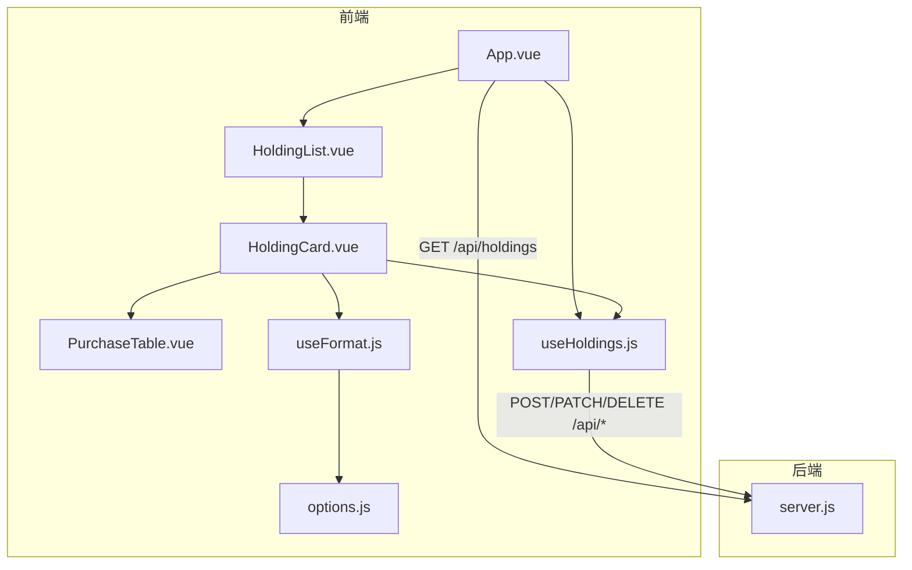
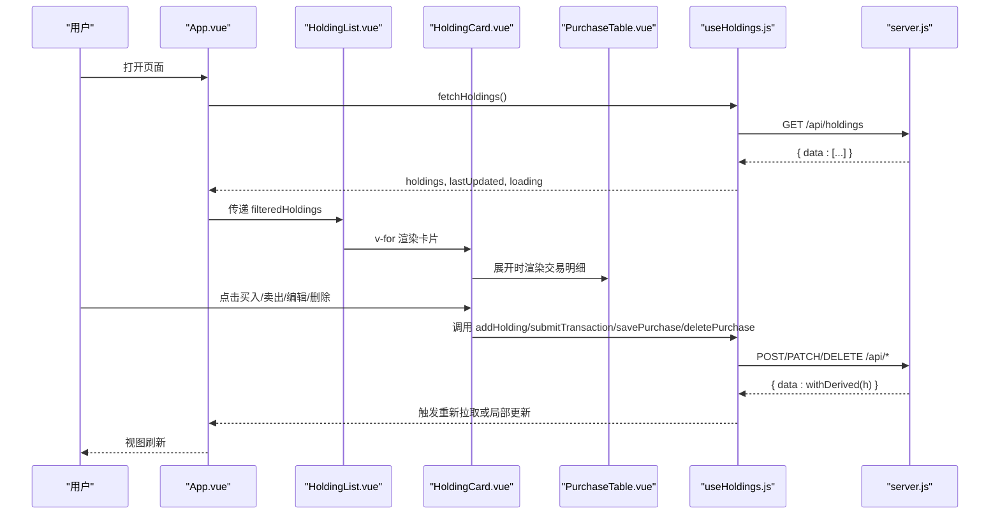
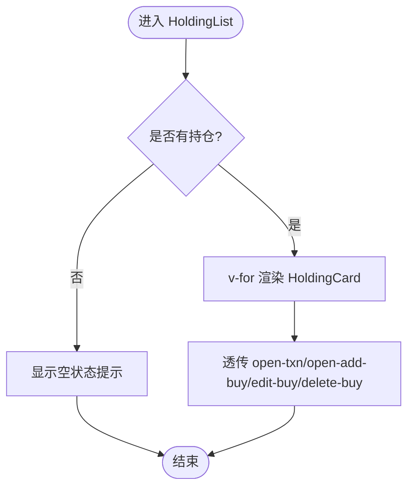
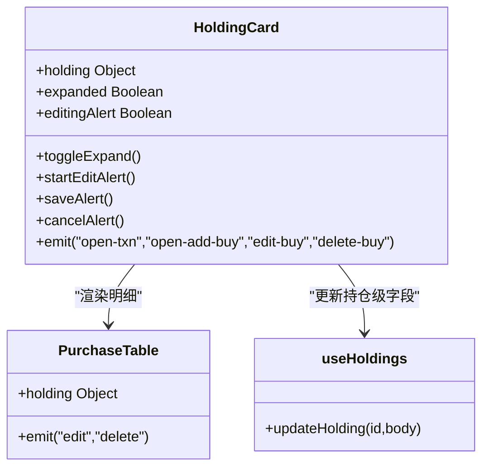
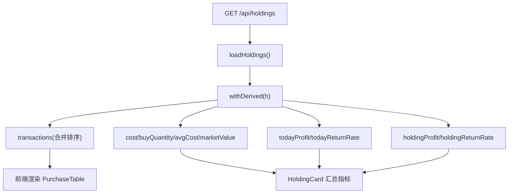
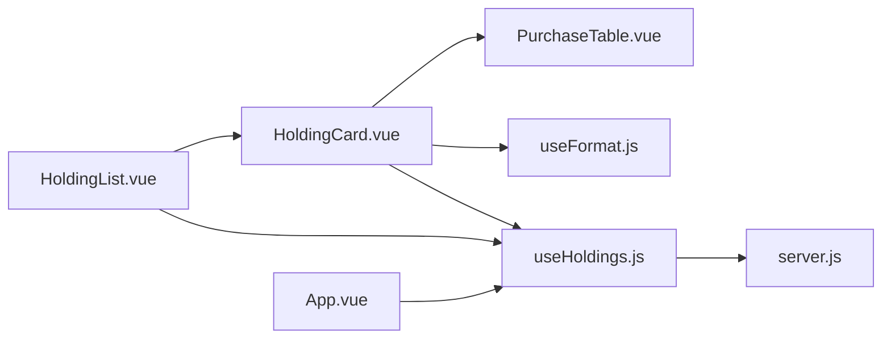

# 持仓列表组件

<cite>
**本文引用的文件**
- [HoldingList.vue](file://web/src/components/HoldingList.vue)
- [HoldingCard.vue](file://web/src/components/HoldingCard.vue)
- [PurchaseTable.vue](file://web/src/components/PurchaseTable.vue)
- [useHoldings.js](file://web/src/composables/useHoldings.js)
- [useFormat.js](file://web/src/composables/useFormat.js)
- [options.js](file://web/src/constants/options.js)
- [App.vue](file://web/src/App.vue)
- [server.js](file://server/server.js)
- [holdings.json](file://data/holdings.json)
</cite>

## 目录
1. [简介](#简介)
2. [项目结构](#项目结构)
3. [核心组件](#核心组件)
4. [架构总览](#架构总览)
5. [详细组件分析](#详细组件分析)
6. [依赖关系分析](#依赖关系分析)
7. [性能考量](#性能考量)
8. [故障排查指南](#故障排查指南)
9. [结论](#结论)
10. [附录：扩展与定制](#附录：扩展与定制)

## 简介
本文件围绕“持仓列表”能力，系统性说明批量展示与管理、空状态处理、搜索过滤、性能优化、子组件通信、可访问性支持以及定制化扩展点。该功能由前端 Vue 组件与后端 Node 服务共同实现，数据通过 REST API 同步，并在前端进行计算与渲染。

## 项目结构
- 前端采用 Vue 单文件组件组织，核心视图位于 web/src/components；状态与副作用逻辑集中在 composables；常量与枚举在 constants；应用入口为 App.vue。
- 后端使用原生 Node HTTP 服务暴露 /api/* 接口，负责持久化、派生计算与业务规则（如收益计算、交易处理）。
- 示例数据位于 data/holdings.json，便于本地调试与演示。

图表来源
- [App.vue:1-197](file://web/src/App.vue#L1-L197)
- [HoldingList.vue:1-36](file://web/src/components/HoldingList.vue#L1-L36)
- [HoldingCard.vue:1-161](file://web/src/components/HoldingCard.vue#L1-L161)
- [PurchaseTable.vue:1-79](file://web/src/components/PurchaseTable.vue#L1-L79)
- [useHoldings.js:1-154](file://web/src/composables/useHoldings.js#L1-L154)
- [useFormat.js:1-70](file://web/src/composables/useFormat.js#L1-L70)
- [options.js:1-33](file://web/src/constants/options.js#L1-L33)
- [server.js:409-565](file://server/server.js#L409-L565)

章节来源
- [App.vue:1-197](file://web/src/App.vue#L1-L197)
- [server.js:409-565](file://server/server.js#L409-L565)

## 核心组件
- HoldingList：接收父级传入的 holdings 数组，逐条渲染 HoldingCard，透传事件，并提供空状态提示。
- HoldingCard：展示单个持仓的汇总指标、标签、操作按钮，内嵌可折叠的买入明细表 PurchaseTable，并支持日涨跌告警阈值行内编辑。
- PurchaseTable：以表格形式展示合并后的交易记录（买入/卖出），并进行格式化与颜色区分。
- useHoldings：集中管理持仓数据的获取、自动刷新、写操作（添加、交易、修改买入记录、删除）与全局汇总计算。
- useFormat：纯函数格式化与徽章映射，无副作用，便于复用。
- options：策略、地区、类型等枚举与刷新间隔常量。

章节来源
- [HoldingList.vue:1-36](file://web/src/components/HoldingList.vue#L1-L36)
- [HoldingCard.vue:1-161](file://web/src/components/HoldingCard.vue#L1-L161)
- [PurchaseTable.vue:1-79](file://web/src/components/PurchaseTable.vue#L1-L79)
- [useHoldings.js:1-154](file://web/src/composables/useHoldings.js#L1-L154)
- [useFormat.js:1-70](file://web/src/composables/useFormat.js#L1-L70)
- [options.js:1-33](file://web/src/constants/options.js#L1-L33)

## 架构总览
前端通过 useHoldings 发起网络请求获取持仓数据，App 层维护过滤后的列表并传递给 HoldingList。HoldingList 将每个持仓项交给 HoldingCard 渲染，HoldingCard 内部再调用 PurchaseTable 展示明细。所有写操作统一经 useHoldings 调用后端 /api/* 接口，服务端完成数据校验、派生计算与持久化后返回最新数据，前端刷新视图。

图表来源
- [App.vue:121-186](file://web/src/App.vue#L121-L186)
- [useHoldings.js:15-130](file://web/src/composables/useHoldings.js#L15-L130)
- [server.js:409-565](file://server/server.js#L409-L565)

## 详细组件分析

### HoldingList：批量渲染与空状态
- 职责
  - 接收父级传入的 holdings 数组，按 id 作为 key 渲染 HoldingCard。
  - 将子组件的事件（开交易弹窗、新增买入、编辑买入、删除买入）带上对应 holding 对象向上透传。
  - 当 holdings 为空时，显示友好的空状态提示，引导用户添加持仓。
- 关键点
  - 事件透传：通过 forward 方法将事件名与 payload 一并 emit，避免重复绑定。
  - 空状态：基于 holdings.length 判断，提供明确文案与视觉样式。

图表来源
- [HoldingList.vue:1-36](file://web/src/components/HoldingList.vue#L1-L36)

章节来源
- [HoldingList.vue:1-36](file://web/src/components/HoldingList.vue#L1-L36)

### HoldingCard：汇总指标、标签与行内编辑
- 职责
  - 展示持仓基本信息（名称、代码、状态、区域、类型、策略、触发态）。
  - 汇总指标：市值/数量、成本/现价、今日收益/收益率、持仓收益/收益率、止盈止损、补仓计划、日涨跌告警阈值。
  - 提供买入/卖出记录入口，支持展开查看 PurchaseTable。
  - 支持日涨跌告警阈值的行内编辑与保存。
- 关键点
  - 使用 useFormat 提供的格式化函数与徽章映射，保证一致性与可读性。
  - 通过 useHoldings.updateHolding 更新持仓级字段，成功后关闭编辑态并清空错误消息。
  - 事件冒泡：emit 到父级，由 App 层统一处理弹窗与后续流程。

图表来源
- [HoldingCard.vue:1-161](file://web/src/components/HoldingCard.vue#L1-L161)
- [PurchaseTable.vue:1-79](file://web/src/components/PurchaseTable.vue#L1-L79)
- [useHoldings.js:120-130](file://web/src/composables/useHoldings.js#L120-L130)

章节来源
- [HoldingCard.vue:1-161](file://web/src/components/HoldingCard.vue#L1-L161)
- [useHoldings.js:120-130](file://web/src/composables/useHoldings.js#L120-L130)

### PurchaseTable：交易明细表格
- 职责
  - 展示合并后的交易记录（买入/卖出），包含日期、价格、数量、成本、市值/成交额、收益/收益率、止盈止损比例。
  - 对买入记录隐藏收益列，仅显示 "-- / --"。
  - 当无交易记录时，显示占位提示。
- 关键点
  - 数据来源：来自持有对象的 transactions 字段（由后端 withDerived 生成）。
  - 格式化：使用 useFormat 的 fmtDate、fmtPrice、fmtQty、fmtMoney、fmtPct、profitCls。

章节来源
- [PurchaseTable.vue:1-79](file://web/src/components/PurchaseTable.vue#L1-L79)
- [useFormat.js:1-70](file://web/src/composables/useFormat.js#L1-L70)

### 数据流与后端派生计算
- 后端 server.js 的 withDerived 负责：
  - 合并买入与卖出记录为 transactions，并按时间倒序排列。
  - 计算剩余仓位、均价、未实现与已实现收益、持仓收益与收益率、今日收益与收益率等。
  - 计算加权止盈/止损比例、最近买入价等。
- 前端 App.vue 通过 useHoldings.fetchHoldings 拉取数据，并使用 computed 做过滤与汇总。

图表来源
- [server.js:146-245](file://server/server.js#L146-L245)
- [useHoldings.js:15-29](file://web/src/composables/useHoldings.js#L15-L29)
- [HoldingCard.vue:91-149](file://web/src/components/HoldingCard.vue#L91-L149)
- [PurchaseTable.vue:30-72](file://web/src/components/PurchaseTable.vue#L30-L72)

章节来源
- [server.js:146-245](file://server/server.js#L146-L245)
- [useHoldings.js:15-29](file://web/src/composables/useHoldings.js#L15-L29)

## 依赖关系分析
- 组件耦合
  - HoldingList 仅负责渲染与事件透传，低耦合。
  - HoldingCard 依赖 useFormat 与 useHoldings，承担主要交互与展示逻辑。
  - PurchaseTable 依赖 useFormat，只关注展示。
- 状态共享
  - useHoldings 提供模块级单例状态，所有组件共享同一份 holdings 数据，确保一致性。
- 外部依赖
  - 后端 server.js 提供 REST API，负责数据持久化与派生计算。
  - 常量 options.js 定义刷新间隔与枚举值，前后端保持一致。

图表来源
- [HoldingList.vue:1-36](file://web/src/components/HoldingList.vue#L1-L36)
- [HoldingCard.vue:1-161](file://web/src/components/HoldingCard.vue#L1-L161)
- [PurchaseTable.vue:1-79](file://web/src/components/PurchaseTable.vue#L1-L79)
- [useHoldings.js:1-154](file://web/src/composables/useHoldings.js#L1-L154)
- [server.js:409-565](file://server/server.js#L409-L565)

章节来源
- [useHoldings.js:1-154](file://web/src/composables/useHoldings.js#L1-L154)
- [server.js:409-565](file://server/server.js#L409-L565)

## 性能考量
当前实现要点与建议：
- 虚拟滚动
  - 现状：未实现虚拟滚动，直接 v-for 渲染全部持仓项。
  - 建议：当持仓数量较大时，引入虚拟滚动（如 vue-virtual-scroller）以减少 DOM 节点数量，提升渲染性能。
- 懒加载
  - 现状：PurchaseTable 默认收起，仅在用户展开时渲染明细，属于按需加载。
  - 建议：保持该设计；若明细内容复杂，可进一步拆分懒加载子组件。
- 内存管理
  - 现状：useHoldings 使用 ref 存储数据，定时器用于自动刷新；组件卸载时停止定时器，避免泄漏。
  - 建议：对大对象进行浅拷贝或选择性字段传输，减少内存占用；必要时对历史数据进行归档。
- 网络请求
  - 现状：每 20 秒自动刷新一次，手动刷新按钮可立即拉取。
  - 建议：增加请求去抖与失败重试机制；对长列表分页加载（见下节）。
- 计算开销
  - 现状：汇总指标通过 computed 计算，开销较小。
  - 建议：对复杂计算可考虑 Web Worker 或后端预计算。

[本节为通用性能指导，不直接分析具体文件]

## 故障排查指南
- 无法获取持仓数据
  - 检查后端是否启动且 /api/holdings 可访问。
  - 检查浏览器控制台是否有跨域或网络错误。
  - 确认 useHoldings.fetchHoldings 是否正确调用与捕获异常。
- 写入失败（添加/交易/修改/删除）
  - 检查请求体字段是否符合后端校验（如买入价/数量必须为正）。
  - 查看后端返回的错误信息，定位具体原因。
- 自动刷新不生效
  - 检查 REFRESH_MS 配置与 startAutoRefresh 是否被调用。
  - 确认 onUnmounted 中 stopAutoRefresh 是否执行。
- 空状态误显
  - 确认父级是否正确传递 filteredHoldings。
  - 检查过滤条件是否过于严格导致结果为空。

章节来源
- [useHoldings.js:15-29](file://web/src/composables/useHoldings.js#L15-L29)
- [useHoldings.js:67-130](file://web/src/composables/useHoldings.js#L67-L130)
- [App.vue:121-129](file://web/src/App.vue#L121-L129)
- [server.js:437-543](file://server/server.js#L437-L543)

## 结论
持仓列表组件通过清晰的组件分层与集中式状态管理，实现了批量展示、空状态友好提示、事件透传与后端数据同步。当前版本已具备基础筛选与自动刷新能力，未来可在分页、虚拟滚动、搜索高亮等方面进一步增强体验与性能。

[本节为总结性内容，不直接分析具体文件]

## 附录：扩展与定制

### 列表渲染与分页
- 现状
  - 列表渲染：HoldingList 使用 v-for 遍历 holdings。
  - 分页：未实现分页，所有数据一次性渲染。
- 扩展建议
  - 在前端增加分页状态（页码、每页条数），结合后端分页接口实现。
  - 或使用无限滚动方案，提升大数据量下的浏览体验。

章节来源
- [HoldingList.vue:16-34](file://web/src/components/HoldingList.vue#L16-L34)
- [useHoldings.js:15-29](file://web/src/composables/useHoldings.js#L15-L29)

### 排序逻辑
- 现状
  - 后端 withDerived 对 transactions 按时间倒序排列。
  - 前端未提供排序控制。
- 扩展建议
  - 在前端增加排序选项（如按成本、收益率、日期等），对 filteredHoldings 进行排序后再传给 HoldingList。
  - 注意保持与后端排序的一致性，避免歧义。

章节来源
- [server.js:146-163](file://server/server.js#L146-L163)
- [App.vue:111-119](file://web/src/App.vue#L111-L119)

### 搜索与过滤
- 现状
  - 多选标签过滤：App.vue 中根据 type 与 region 过滤 holdings，生成 filteredHoldings。
  - 关键词搜索：未实现文本关键词匹配与结果高亮。
- 扩展建议
  - 增加关键词输入框，对 name/code/type/region 等字段进行模糊匹配。
  - 对匹配片段进行高亮显示（可使用正则替换包裹标签）。
  - 将关键词与多选过滤组合，形成多维度筛选。

章节来源
- [App.vue:76-119](file://web/src/App.vue#L76-L119)

### 子组件通信机制
- 事件冒泡
  - HoldingCard 通过 emit 向父级抛出 open-txn、open-add-buy、edit-buy、delete-buy 等事件。
  - HoldingList 通过 forward 方法将事件与 holding 对象透传到 App 层。
- 状态提升
  - App 层维护弹窗状态与表单数据，统一管理业务流程。
- 数据同步
  - 写操作统一经 useHoldings 调用后端接口，成功后重新拉取数据，保证视图与数据一致。

章节来源
- [HoldingCard.vue:14-157](file://web/src/components/HoldingCard.vue#L14-L157)
- [HoldingList.vue:10-13](file://web/src/components/HoldingList.vue#L10-L13)
- [App.vue:56-74](file://web/src/App.vue#L56-L74)
- [useHoldings.js:67-130](file://web/src/composables/useHoldings.js#L67-L130)

### 可访问性支持
- 键盘导航
  - 按钮与输入框默认支持 Tab 导航与 Enter/Escape 键操作（如编辑告警阈值时的回车保存与取消）。
- 屏幕阅读器兼容
  - 为关键按钮提供 title 属性，辅助描述用途。
- 焦点管理
  - 编辑模式下使用 nextTick 聚焦输入框，提升可用性。
- 建议增强
  - 为列表项添加 aria-label，便于读屏器识别。
  - 为展开/收起按钮添加 aria-expanded 状态。

章节来源
- [HoldingCard.vue:18-36](file://web/src/components/HoldingCard.vue#L18-L36)
- [HoldingCard.vue:62-69](file://web/src/components/HoldingCard.vue#L62-L69)

### 列表定制化的方法与扩展点
- 样式定制
  - 使用 Tailwind 类名与 DaisyUI 组件类，可通过主题变量与自定义 CSS 覆盖样式。
- 行为扩展
  - 在 HoldingCard 中添加新的操作按钮与事件，透传到父级处理。
  - 在 useHoldings 中新增业务方法，封装新的 API 调用与状态更新。
- 数据扩展
  - 在后端 withDerived 中增加新字段，前端相应展示与格式化。
  - 在 options.js 中新增枚举项，保持前后端一致。

章节来源
- [HoldingCard.vue:57-159](file://web/src/components/HoldingCard.vue#L57-L159)
- [useHoldings.js:132-153](file://web/src/composables/useHoldings.js#L132-L153)
- [options.js:1-33](file://web/src/constants/options.js#L1-L33)
- [server.js:146-245](file://server/server.js#L146-L245)