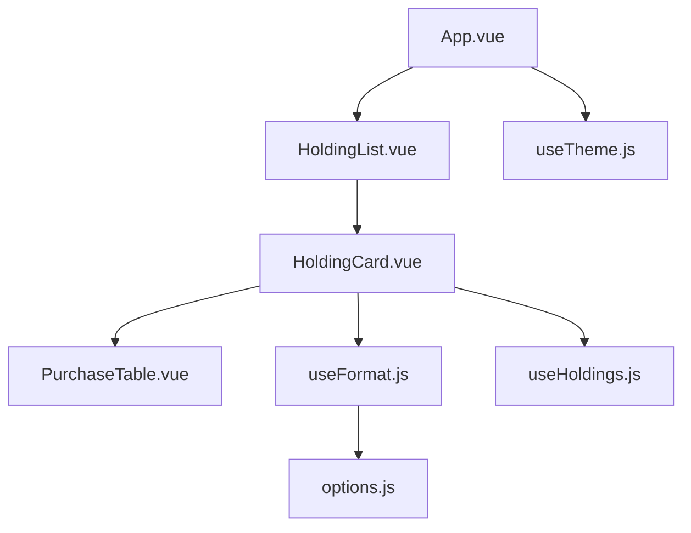
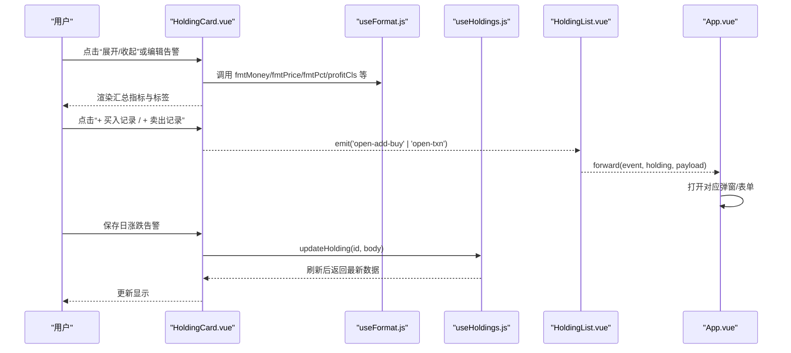
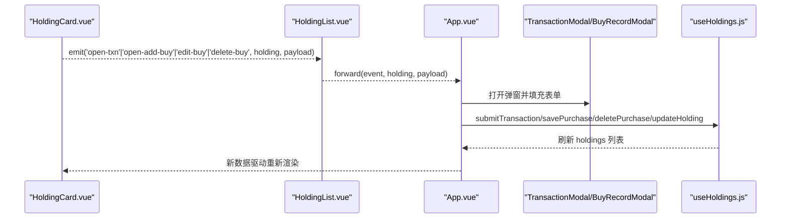
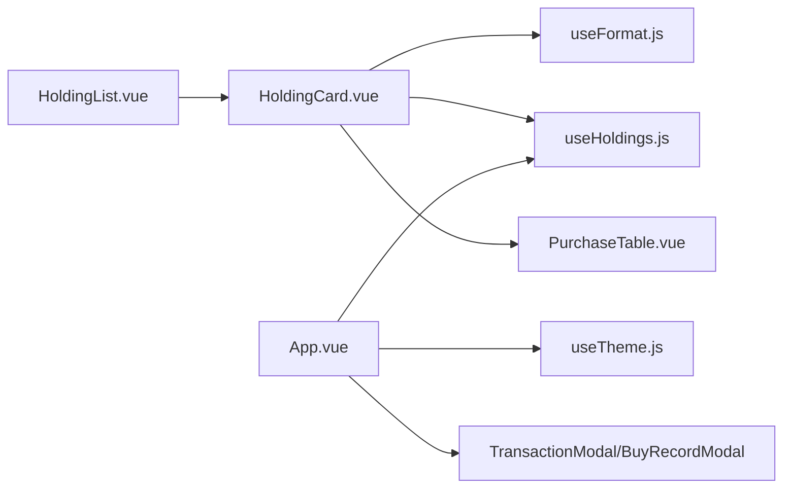

# 持仓卡片组件

<cite>
**本文引用的文件**
- [HoldingCard.vue](file://web/src/components/HoldingCard.vue)
- [HoldingList.vue](file://web/src/components/HoldingList.vue)
- [PurchaseTable.vue](file://web/src/components/PurchaseTable.vue)
- [useHoldings.js](file://web/src/composables/useHoldings.js)
- [useFormat.js](file://web/src/composables/useFormat.js)
- [useTheme.js](file://web/src/composables/useTheme.js)
- [options.js](file://web/src/constants/options.js)
- [App.vue](file://web/src/App.vue)
- [盈亏计算规则.md](file://docs/盈亏计算规则.md)
</cite>

## 目录
1. [简介](#简介)
2. [项目结构](#项目结构)
3. [核心组件与职责](#核心组件与职责)
4. [架构总览](#架构总览)
5. [详细组件分析](#详细组件分析)
6. [依赖关系分析](#依赖关系分析)
7. [性能考量](#性能考量)
8. [故障排查指南](#故障排查指南)
9. [结论](#结论)
10. [附录：数据模型与接口约定](#附录数据模型与接口约定)

## 简介
本文件围绕 HoldingCard 持仓卡片组件，系统化解析单个持仓项目的展示逻辑、交互行为、颜色主题与响应式适配、数据绑定与事件通信机制，以及与父组件的协作方式。同时提供扩展与定制指南，帮助开发者按需调整样式与行为。

## 项目结构
HoldingCard 位于 web/src/components 下，作为列表项渲染单个持仓的概览与关键指标；其子组件 PurchaseTable 用于展开后的交易明细表格；数据与状态通过 composables（useHoldings、useFormat、useTheme）和常量 options 统一管理；父级 App.vue 负责全局状态、弹窗与事件路由。

图表来源
- [App.vue:1-197](file://web/src/App.vue#L1-L197)
- [HoldingList.vue:1-36](file://web/src/components/HoldingList.vue#L1-L36)
- [HoldingCard.vue:1-161](file://web/src/components/HoldingCard.vue#L1-L161)
- [PurchaseTable.vue:1-79](file://web/src/components/PurchaseTable.vue#L1-L79)
- [useFormat.js:1-70](file://web/src/composables/useFormat.js#L1-L70)
- [useHoldings.js:1-154](file://web/src/composables/useHoldings.js#L1-L154)
- [useTheme.js:1-26](file://web/src/composables/useTheme.js#L1-L26)
- [options.js:1-33](file://web/src/constants/options.js#L1-L33)

章节来源
- [App.vue:1-197](file://web/src/App.vue#L1-L197)
- [HoldingList.vue:1-36](file://web/src/components/HoldingList.vue#L1-L36)
- [HoldingCard.vue:1-161](file://web/src/components/HoldingCard.vue#L1-L161)

## 核心组件与职责
- HoldingCard：展示单个持仓的基本信息、汇总指标（市值/数量、成本/现价、今日收益/收益率、持仓收益/收益率、止盈止损、补仓阈值）、日涨跌告警设置、买入记录展开/收起，以及交易操作入口（买入/卖出）。
- PurchaseTable：在展开区域显示该持仓的交易流水（合并排序），标注类型、价格、数量、成本、市值/成交额、收益/收益率、止盈/止损等。
- useHoldings：提供持仓数据的获取、自动刷新、写操作（添加/修改/删除买入记录、提交交易、更新持仓字段）与汇总计算。
- useFormat：纯函数格式化与徽章映射，包含金额、价格、数量、百分比、日期格式，以及 A 股习惯的涨跌颜色类名 profitCls。
- useTheme：管理深色/浅色主题切换，持久化到 localStorage，并同步到根节点 data-theme 与 dark class。
- options：策略、地区、类型枚举与刷新间隔等常量。

章节来源
- [HoldingCard.vue:1-161](file://web/src/components/HoldingCard.vue#L1-L161)
- [PurchaseTable.vue:1-79](file://web/src/components/PurchaseTable.vue#L1-L79)
- [useHoldings.js:1-154](file://web/src/composables/useHoldings.js#L1-L154)
- [useFormat.js:1-70](file://web/src/composables/useFormat.js#L1-L70)
- [useTheme.js:1-26](file://web/src/composables/useTheme.js#L1-L26)
- [options.js:1-33](file://web/src/constants/options.js#L1-L33)

## 架构总览
HoldingCard 通过 props 接收单个持仓对象，使用 useFormat 进行数值与标签格式化，使用 useHoldings 提供的 updateHolding 等方法完成数据写入与刷新。事件通过 emit 向上透传到 HoldingList，再由 App.vue 统一处理弹窗与业务逻辑。

图表来源
- [HoldingCard.vue:1-161](file://web/src/components/HoldingCard.vue#L1-L161)
- [HoldingList.vue:1-36](file://web/src/components/HoldingList.vue#L1-L36)
- [useHoldings.js:1-154](file://web/src/composables/useHoldings.js#L1-L154)
- [useFormat.js:1-70](file://web/src/composables/useFormat.js#L1-L70)
- [App.vue:1-197](file://web/src/App.vue#L1-L197)

## 详细组件分析

### HoldingCard 展示逻辑
- 基本信息：名称、代码、状态、地区、类型、策略、触发状态，均通过 props.holding 与 useFormat 的 regionBadge/strategyBadge/triggerBadge 渲染。
- 汇总指标：
  - 市值/数量：使用 fmtMoney(holding.marketValue) 与 fmtQty(holding.buyQuantity)。
  - 成本/现价：使用 fmtPrice(holding.avgCost) 与 fmtPrice(holding.currentPrice)。
  - 今日收益/收益率：使用 fmtMoney(holding.todayProfit) 与 fmtPct(holding.todayReturnRate)，并以 profitCls 着色。
  - 持仓收益/收益率：使用 fmtMoney(holding.holdingProfit) 与 fmtPct(holding.holdingReturnRate)，并以 profitCls 着色。
  - 止盈%/止损%：分别以正负号与 profitCls 呈现。
  - 补仓%/补仓价：跌幅提示与价格展示。
  - 日跌/日涨告警：支持行内编辑与保存，调用 updateHolding 更新阈值。
- 交互：
  - 展开/收起：控制 expanded 状态，决定是否渲染 PurchaseTable。
  - 交易入口：emit('open-add-buy') 与 emit('open-txn', 'SELL') 由父组件接管。
  - 编辑告警：startEditAlert/saveAlert/cancelAlert 流程，支持键盘快捷键与错误提示。

章节来源
- [HoldingCard.vue:10-158](file://web/src/components/HoldingCard.vue#L10-L158)
- [useFormat.js:4-49](file://web/src/composables/useFormat.js#L4-L49)
- [useHoldings.js:120-130](file://web/src/composables/useHoldings.js#L120-L130)

### 实时价格更新与倒计时
- 自动刷新：useHoldings.startAutoRefresh 启动单一定时器，每秒递减 countdown，归零时调用 fetchHoldings 拉取最新数据。
- 手动刷新：refreshNow 立即触发一次拉取。
- 顶部环形进度条：App.vue 根据 REFRESH_MS 与 countdown 计算进度与偏移，直观展示下次刷新时间。

章节来源
- [useHoldings.js:10-43](file://web/src/composables/useHoldings.js#L10-L43)
- [App.vue:22-25](file://web/src/App.vue#L22-L25)
- [options.js:31-33](file://web/src/constants/options.js#L31-L33)

### 盈亏计算与百分比变化展示
- 计算规则遵循文档定义：
  - 市值 = currentPrice × 剩余数量。
  - 未实现盈亏 = (currentPrice − 剩余均价) × 剩余数量。
  - 已实现盈亏 = Σ(sells[].profit)。
  - 持仓总盈亏 = 未实现盈亏 + 已实现盈亏；收益率分母为总买入成本。
  - 今日盈亏 = (currentPrice − prevClose) × 剩余数量；今日收益率基于昨收。
- 展示层：
  - 今日收益/收益率与持仓收益/收益率通过 profitCls 着色，符合 A 股“涨红跌绿”习惯。
  - 百分比统一使用 fmtPct 输出，带正号前缀。

章节来源
- [盈亏计算规则.md:96-144](file://docs/盈亏计算规则.md#L96-L144)
- [useFormat.js:34-41](file://web/src/composables/useFormat.js#L34-L41)
- [HoldingCard.vue:91-128](file://web/src/components/HoldingCard.vue#L91-L128)

### 颜色主题系统与应用
- 主题切换：useTheme 维护 isDark，应用 stockdark/stocklight 主题与 dark class，并持久化到 localStorage。
- 涨跌颜色：profitCls 将正值映射为 error（红色），负值映射为 success（绿色），契合 A 股习惯。
- 响应式布局：HoldingCard 使用 Tailwind 栅格与间距，在不同屏幕尺寸下自适应列数与排版。

章节来源
- [useTheme.js:1-26](file://web/src/composables/useTheme.js#L1-L26)
- [useFormat.js:34-41](file://web/src/composables/useFormat.js#L34-L41)
- [HoldingCard.vue:57-158](file://web/src/components/HoldingCard.vue#L57-L158)

### 数据绑定机制
- Props：holding 为必需对象，承载当前持仓的所有字段。
- 计算属性派生：汇总指标直接读取 holding 字段并通过 useFormat 格式化；列表级汇总（如 totalCost、totalMarket 等）由 useHoldings 计算。
- 事件发射：HoldingCard 通过 emit 暴露 open-txn、open-add-buy、edit-buy、delete-buy 四个事件，供父组件监听。

章节来源
- [HoldingCard.vue:10-14](file://web/src/components/HoldingCard.vue#L10-L14)
- [useHoldings.js:52-64](file://web/src/composables/useHoldings.js#L52-L64)

### 与父组件的通信方式
- HoldingList 将 HoldingCard 的事件带上 holding 对象转发给 App.vue。
- App.vue 根据事件打开对应弹窗（TransactionModal/BuyRecordModal），并调用 useHoldings 的写操作方法完成数据变更与刷新。

图表来源
- [HoldingList.vue:10-13](file://web/src/components/HoldingList.vue#L10-L13)
- [App.vue:56-74](file://web/src/App.vue#L56-L74)
- [useHoldings.js:67-130](file://web/src/composables/useHoldings.js#L67-L130)

### 交互功能详解
- 点击展开详情：expanded 控制 PurchaseTable 的渲染。
- 编辑操作：日涨跌告警阈值行内编辑，支持 Enter 保存、Esc 取消。
- 删除确认：删除买入记录由 useHoldings.deletePurchase 弹出浏览器 confirm 确认后再执行。
- 交易操作：点击“+ 买入记录”“+ 卖出记录”触发父组件弹窗，完成交易后自动刷新。

章节来源
- [HoldingCard.vue:18-54](file://web/src/components/HoldingCard.vue#L18-L54)
- [useHoldings.js:106-118](file://web/src/composables/useHoldings.js#L106-L118)
- [App.vue:56-74](file://web/src/App.vue#L56-L74)

### 组件定制化与扩展指南
- 样式定制：
  - 涨跌颜色：如需自定义涨跌色，可修改 useFormat 中的 profitCls 映射或使用 CSS 变量覆盖。
  - 主题：通过 useTheme 切换 stockdark/stocklight，或在 tailwind.config 中扩展主题。
  - 布局：HoldingCard 使用 Tailwind 栅格，可按需调整 grid-cols-* 与间距。
- 行为扩展：
  - 新增字段：在 HoldingCard 模板中添加展示逻辑，并在 useHoldings.updateHolding 中支持后端字段更新。
  - 新增告警：可在行内编辑区增加更多阈值输入与校验。
  - 事件扩展：在 HoldingCard 中新增 emit，并在 HoldingList 与 App.vue 中转发与处理。
- 数据源扩展：
  - 若接入新的行情源，保持 HoldingCard 对 holding 字段的契约不变，仅在后端聚合层补充字段即可。

章节来源
- [useFormat.js:34-41](file://web/src/composables/useFormat.js#L34-L41)
- [useTheme.js:5-21](file://web/src/composables/useTheme.js#L5-L21)
- [HoldingCard.vue:91-148](file://web/src/components/HoldingCard.vue#L91-L148)
- [useHoldings.js:120-130](file://web/src/composables/useHoldings.js#L120-L130)

## 依赖关系分析
- HoldingCard 依赖：
  - useFormat：格式化与徽章映射。
  - useHoldings：数据读写与刷新。
  - PurchaseTable：明细表格。
- HoldingList 依赖：
  - HoldingCard：渲染列表项。
- App 依赖：
  - useTheme：主题管理。
  - useHoldings：全局数据与刷新。
  - 各弹窗组件：交易与导入等。

图表来源
- [HoldingCard.vue:1-161](file://web/src/components/HoldingCard.vue#L1-L161)
- [HoldingList.vue:1-36](file://web/src/components/HoldingList.vue#L1-L36)
- [App.vue:1-197](file://web/src/App.vue#L1-L197)
- [useFormat.js:1-70](file://web/src/composables/useFormat.js#L1-L70)
- [useHoldings.js:1-154](file://web/src/composables/useHoldings.js#L1-L154)
- [useTheme.js:1-26](file://web/src/composables/useTheme.js#L1-L26)

## 性能考量
- 单一定时器：useHoldings 使用单一定时器避免多定时器漂移，保证刷新稳定。
- 最小化重渲染：HoldingCard 仅依赖本地 expanded 状态与 props，减少不必要的 re-render。
- 格式化函数无副作用：useFormat 为纯函数，便于缓存与测试。
- 列表过滤：App.vue 使用 computed 过滤 holdings，提升大列表下的交互性能。

[本节为通用指导，不直接分析具体文件]

## 故障排查指南
- 无法刷新数据：
  - 检查网络请求是否成功，查看 useHoldings.fetchHoldings 的错误分支。
  - 确认 REFRESH_MS 配置是否正确。
- 涨跌颜色异常：
  - 检查 profitCls 的返回值与数据正负是否符合预期。
- 主题不生效：
  - 确认 useTheme.initTheme 已在 App 挂载时调用，且 localStorage 中 theme 键值正确。
- 告警保存失败：
  - 查看 updateHolding 的响应与错误消息，必要时增加日志定位。

章节来源
- [useHoldings.js:15-29](file://web/src/composables/useHoldings.js#L15-L29)
- [useHoldings.js:120-130](file://web/src/composables/useHoldings.js#L120-L130)
- [useFormat.js:34-41](file://web/src/composables/useFormat.js#L34-L41)
- [useTheme.js:10-21](file://web/src/composables/useTheme.js#L10-L21)

## 结论
HoldingCard 以清晰的 props/emit 模式组织展示与交互，结合 useFormat 与 useHoldings 提供稳定的数据与格式化能力，配合 useTheme 实现主题与响应式体验。通过统一的父组件事件路由，实现了交易操作的闭环与状态同步。按本文档的扩展指南，可便捷地定制样式与行为以满足不同业务需求。

[本节为总结性内容，不直接分析具体文件]

## 附录：数据模型与接口约定
- 持仓对象关键字段（示例）：id、name、code、status、region、type、strategy、triggerState、marketValue、buyQuantity、avgCost、currentPrice、todayProfit、todayReturnRate、holdingProfit、holdingReturnRate、targetProfitRate、stopLossRate、refillDropRate、refillPrice、dailyDropAlertPct、dailyRiseAlertPct、transactions、nextStrategy。
- 交易记录字段（合并排序后）：id、type(BUY/SELL)、buyTime/sellDate、buyPrice/sellPrice、buyQuantity/sellQuantity、cost、marketValue、profit、returnRate、targetProfitRate、stopLossRate。
- 服务端接口：
  - GET /api/holdings：获取持仓列表与汇总指标。
  - POST /api/holdings：新增持仓。
  - PATCH /api/holdings/:id：更新持仓字段（如告警阈值）。
  - POST /api/holdings/:id/transactions：提交交易（BUY/SELL）。
  - POST/PATCH/DELETE /api/holdings/:id/purchases：增改删买入记录。

章节来源
- [盈亏计算规则.md:9-46](file://docs/盈亏计算规则.md#L9-L46)
- [盈亏计算规则.md:147-175](file://docs/盈亏计算规则.md#L147-L175)
- [useHoldings.js:67-130](file://web/src/composables/useHoldings.js#L67-L130)