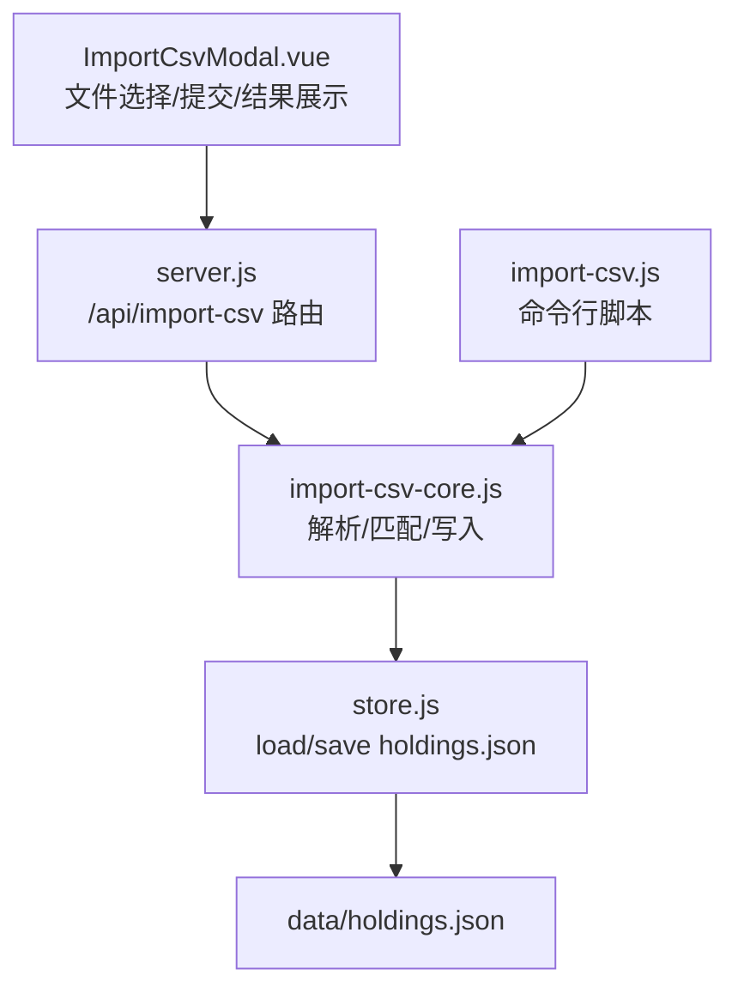
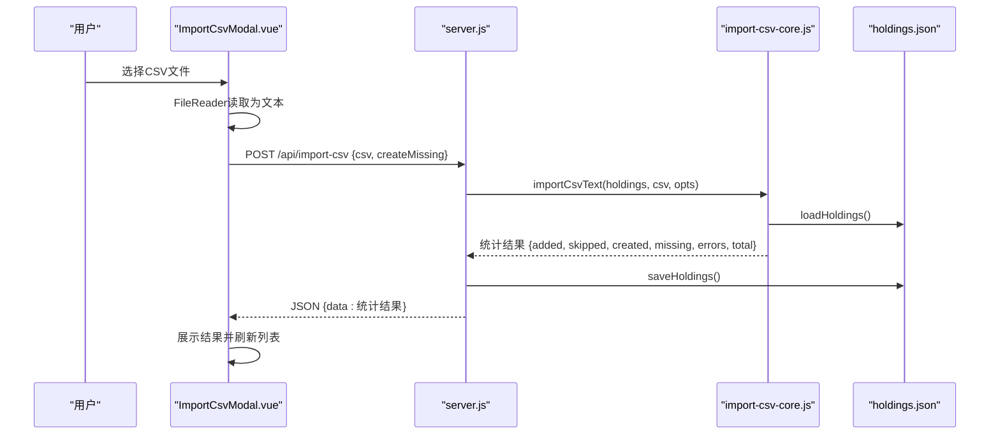
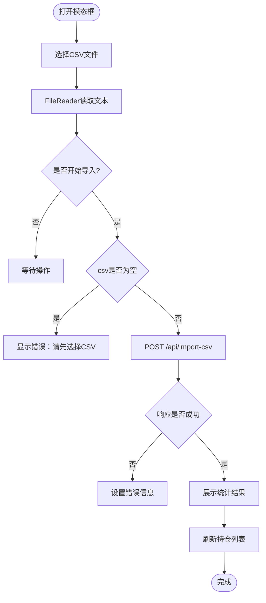
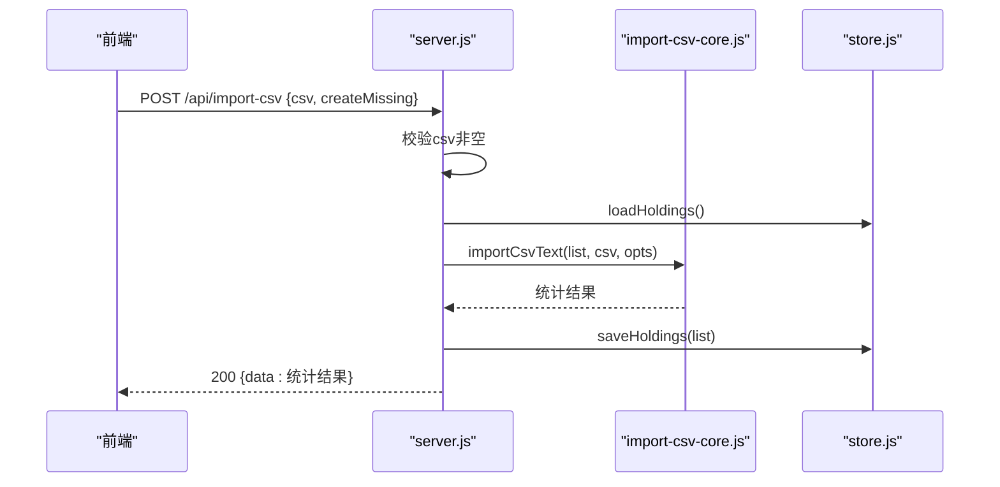
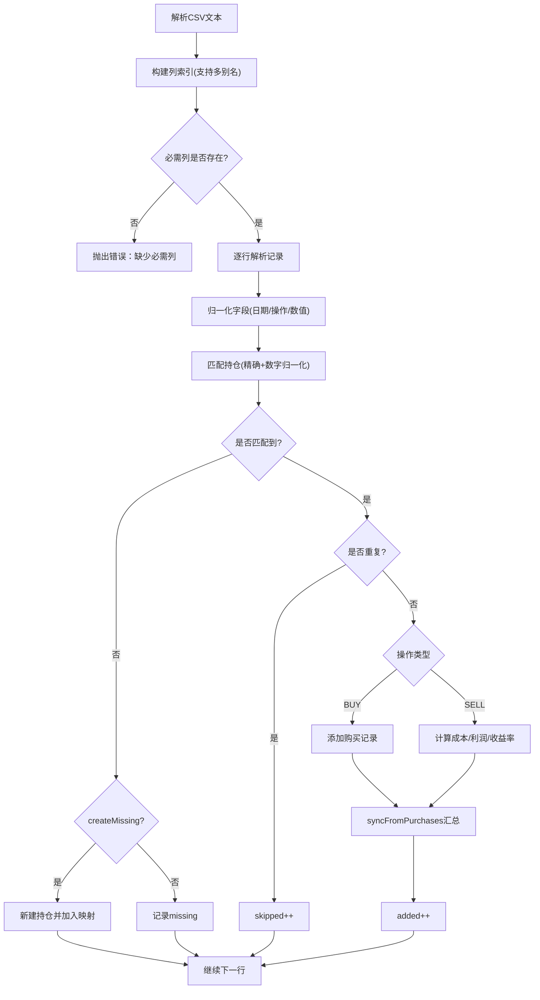
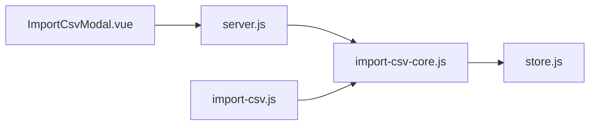

# CSV导入模态框

<cite>
**本文引用的文件**
- [ImportCsvModal.vue](file://web/src/components/ImportCsvModal.vue)
- [server.js](file://server/server.js)
- [import-csv-core.js](file://server/import-csv-core.js)
- [import-csv.js](file://server/import-csv.js)
- [useHoldings.js](file://web/src/composables/useHoldings.js)
- [买入-卖出记录 - Sheet1.csv](file://data/买入-卖出记录 - Sheet1.csv)
</cite>

## 目录
1. [简介](#简介)
2. [项目结构](#项目结构)
3. [核心组件](#核心组件)
4. [架构总览](#架构总览)
5. [详细组件分析](#详细组件分析)
6. [依赖关系分析](#依赖关系分析)
7. [性能与可扩展性](#性能与可扩展性)
8. [故障排查指南](#故障排查指南)
9. [结论](#结论)
10. [附录：CSV模板规范与示例](#附录csv模板规范与示例)

## 简介
本文件面向“CSV导入模态框”功能，系统性说明前端 ImportCsvModal 组件的文件上传、格式校验、后端交互、数据解析与映射、错误处理、进度反馈与结果展示，并提供CSV模板规范与常见问题解决方案。目标是帮助使用者正确准备CSV数据并理解导入流程的每个环节。

## 项目结构
CSV导入涉及前后端协作：
- 前端：ImportCsvModal 负责文件选择、文本读取、提交到后端、展示导入结果。
- 后端：HTTP 路由接收请求，调用核心解析逻辑 import-csv-core，持久化 holdings.json，返回统计结果。
- 命令行工具：import-csv.js 提供离线批量导入能力，复用同一核心逻辑。

图表来源
- [ImportCsvModal.vue:49-73](file://web/src/components/ImportCsvModal.vue#L49-L73)
- [server.js:416-435](file://server/server.js#L416-L435)
- [import-csv-core.js:170-306](file://server/import-csv-core.js#L170-L306)
- [import-csv.js:37-79](file://server/import-csv.js#L37-L79)

章节来源
- [ImportCsvModal.vue:1-169](file://web/src/components/ImportCsvModal.vue#L1-L169)
- [server.js:416-435](file://server/server.js#L416-L435)
- [import-csv-core.js:1-307](file://server/import-csv-core.js#L1-L307)
- [import-csv.js:1-87](file://server/import-csv.js#L1-L87)

## 核心组件
- ImportCsvModal.vue：用户界面与交互入口，负责文件读取、状态管理、错误提示、结果汇总展示。
- server.js：HTTP服务，定义 /api/import-csv 接口，负责参数校验、调用核心逻辑、持久化与响应。
- import-csv-core.js：可复用的CSV解析与导入核心，包含列映射、数据归一化、幂等去重、持仓新建、成本计算与汇总。
- import-csv.js：命令行一键导入脚本，复用核心逻辑，便于离线批量处理。
- useHoldings.js：前端数据获取与刷新，导入完成后拉取最新持仓列表。

章节来源
- [ImportCsvModal.vue:1-169](file://web/src/components/ImportCsvModal.vue#L1-L169)
- [server.js:416-435](file://server/server.js#L416-L435)
- [import-csv-core.js:1-307](file://server/import-csv-core.js#L1-L307)
- [import-csv.js:1-87](file://server/import-csv.js#L1-L87)
- [useHoldings.js:15-29](file://web/src/composables/useHoldings.js#L15-L29)

## 架构总览
CSV导入端到端流程如下：
1. 用户在模态框中选择CSV文件（支持点击选择；拖拽上传可通过浏览器原生事件扩展）。
2. 前端使用 FileReader 读取为UTF-8文本。
3. 将CSV文本与选项（是否自动新建持仓）POST到 /api/import-csv。
4. 服务端读取请求体，调用 importCsvText 进行解析与导入。
5. 核心逻辑按列名映射字段、归一化日期、匹配持仓、幂等去重、计算成本、更新汇总。
6. 持久化 holdings.json 并返回统计结果（新增、跳过、新建、缺失、错误）。
7. 前端展示结果并刷新持仓列表。

图表来源
- [ImportCsvModal.vue:49-73](file://web/src/components/ImportCsvModal.vue#L49-L73)
- [server.js:416-435](file://server/server.js#L416-L435)
- [import-csv-core.js:170-306](file://server/import-csv-core.js#L170-L306)

## 详细组件分析

### ImportCsvModal.vue 文件上传与交互
- 文件选择：通过隐藏的 input[type=file] 触发系统文件对话框，accept 限制为 .csv/text/csv。
- 文本读取：FileReader 以 UTF-8 读取文件内容为字符串，用于后续提交。
- 状态管理：fileName、csvText、createMissing、importing、error、result 等响应式变量控制UI与流程。
- 提交逻辑：校验非空后发送POST请求，成功后重置状态并刷新持仓列表。
- 结果展示：新增明细、已存在忽略、CSV总记录、自动新建持仓、匹配不到持仓、导入出错等分类展示。
- 关闭保护：导入中禁止关闭，避免中断。

图表来源
- [ImportCsvModal.vue:34-78](file://web/src/components/ImportCsvModal.vue#L34-L78)
- [ImportCsvModal.vue:81-168](file://web/src/components/ImportCsvModal.vue#L81-L168)

章节来源
- [ImportCsvModal.vue:34-78](file://web/src/components/ImportCsvModal.vue#L34-L78)
- [ImportCsvModal.vue:81-168](file://web/src/components/ImportCsvModal.vue#L81-L168)

### 后端API：/api/import-csv
- 请求体：JSON对象，包含 csv（字符串）与可选 createMissing（布尔）。
- 参数校验：若缺少csv内容，返回400错误。
- 核心调用：加载当前 holdings，调用 importCsvText，捕获异常并返回错误。
- 持久化：保存修改后的 holdings 到磁盘。
- 响应：返回统计结果 data，供前端展示。

图表来源
- [server.js:416-435](file://server/server.js#L416-L435)

章节来源
- [server.js:416-435](file://server/server.js#L416-L435)

### 核心解析与导入：import-csv-core.js
- CSV解析：parseCsvText 支持BOM、引号包裹、逗号分隔，返回二维数组。
- 列映射：根据表头名称映射到内部字段，支持多别名（如“代码”、“操作”、“日期”、“数量”、“价格”等）。
- 数据归一化：
  - 日期归一化为 YYYY-MM-DD，保证幂等匹配一致。
  - 操作映射为 BUY/SELL。
  - 数值类型转换与合法性检查（数量、价格必须为正）。
- 持仓匹配：
  - 精确匹配：CSV code === holdings.code。
  - 数字归一化兜底：提取数字部分匹配（如 hk00700 → 700）。
- 幂等去重：以 (code, 操作, 日期, 数量, 价格) 为唯一键，重复记录跳过。
- 新建持仓：当 createMissing 为真且未匹配到时，按 name/code/region/type 创建新持仓。
- 交易处理：
  - 买入：生成购买记录，带目标止盈/止损比例继承。
  - 卖出：按LIFO计算成本价、利润与收益率，超出持仓则报错。
- 汇总同步：更新成本、数量、均价、状态、触发状态等字段。
- 错误收集：每条记录的处理异常被捕获并记录，不影响其他记录。

图表来源
- [import-csv-core.js:8-36](file://server/import-csv-core.js#L8-L36)
- [import-csv-core.js:170-306](file://server/import-csv-core.js#L170-L306)

章节来源
- [import-csv-core.js:8-36](file://server/import-csv-core.js#L8-L36)
- [import-csv-core.js:170-306](file://server/import-csv-core.js#L170-L306)

### 命令行导入：import-csv.js
- 用途：离线批量导入CSV到 holdings.json，便于自动化或调试。
- 参数：
  - 默认路径：data/买入-卖出记录 - Sheet1.csv。
  - 指定路径：node server/import-csv.js <csv路径>。
  - 自动新建：--create-missing。
- 行为：读取CSV与holdings，调用核心逻辑，写盘并输出统计摘要。

章节来源
- [import-csv.js:1-87](file://server/import-csv.js#L1-L87)

### 前端数据刷新：useHoldings.js
- 导入完成后调用 fetchHoldings 拉取最新持仓列表，确保UI与数据一致。
- 支持自动刷新倒计时与手动刷新。

章节来源
- [useHoldings.js:15-29](file://web/src/composables/useHoldings.js#L15-L29)

## 依赖关系分析
- ImportCsvModal.vue 依赖 useHoldings 刷新数据，依赖后端 /api/import-csv。
- server.js 依赖 import-csv-core 与 store.js（load/save holdings.json）。
- import-csv-core.js 不依赖外部模块，纯函数实现，具备高内聚与可测试性。
- import-csv.js 复用 core，降低重复逻辑。

图表来源
- [ImportCsvModal.vue:49-73](file://web/src/components/ImportCsvModal.vue#L49-L73)
- [server.js:416-435](file://server/server.js#L416-L435)
- [import-csv-core.js:170-306](file://server/import-csv-core.js#L170-L306)
- [import-csv.js:37-79](file://server/import-csv.js#L37-L79)

章节来源
- [ImportCsvModal.vue:49-73](file://web/src/components/ImportCsvModal.vue#L49-L73)
- [server.js:416-435](file://server/server.js#L416-L435)
- [import-csv-core.js:170-306](file://server/import-csv-core.js#L170-L306)
- [import-csv.js:37-79](file://server/import-csv.js#L37-L79)

## 性能与可扩展性
- 解析复杂度：CSV解析为线性时间 O(N)，N为行数；匹配与去重使用Map与集合，近似O(1)查找，整体接近O(N)。
- 内存占用：核心逻辑在内存中处理文本与数据结构，适合中小规模CSV；超大文件建议分块或流式处理。
- 幂等设计：重复导入不会重复插入，保障多次执行的安全性。
- 可扩展点：
  - 列映射支持更多别名，便于不同导出源兼容。
  - 新增字段时可在 normalizePurchase/syncFromPurchases 中扩展。
  - 对超大CSV可考虑分页或异步任务队列。

[本节为通用指导，不直接分析具体文件]

## 故障排查指南
- 文件格式错误
  - 现象：后端返回400错误，提示缺少必需列。
  - 原因：CSV表头不包含“代码/操作/日期/数量/价格”或其别名。
  - 解决：检查并修正表头，确保至少包含必需列。
  - 参考：[import-csv-core.js:175-188](file://server/import-csv-core.js#L175-L188)

- 数据验证失败
  - 现象：导入出错列表中出现错误消息，如“买入价/买入数量必须为正”或“卖出数量超过持仓数量”。
  - 原因：数值非法或卖出数量大于可用持仓。
  - 解决：修正CSV中的数值；检查持仓余额后再卖出。
  - 参考：[import-csv-core.js:44-80](file://server/import-csv-core.js#L44-L80)

- 重复记录忽略
  - 现象：统计中 skipped 增加，对应记录未插入。
  - 原因：相同(code, 操作, 日期, 数量, 价格)已存在。
  - 解决：确认是否需要调整日期/数量/价格以避免重复。
  - 参考：[import-csv-core.js:226-239](file://server/import-csv-core.js#L226-L239)

- 匹配不到持仓
  - 现象：missing 列表出现，提示无法匹配。
  - 原因：代码未匹配到现有持仓。
  - 解决：勾选“自动新建持仓”或在系统中先创建该持仓。
  - 参考：[import-csv-core.js:212-268](file://server/import-csv-core.js#L212-L268)

- 前端错误提示
  - 现象：模态框显示错误信息。
  - 原因：网络错误或后端返回错误。
  - 解决：检查网络连接与后端日志；确认请求体格式。
  - 参考：[ImportCsvModal.vue:49-73](file://web/src/components/ImportCsvModal.vue#L49-L73)

章节来源
- [import-csv-core.js:44-80](file://server/import-csv-core.js#L44-L80)
- [import-csv-core.js:175-188](file://server/import-csv-core.js#L175-L188)
- [import-csv-core.js:212-268](file://server/import-csv-core.js#L212-L268)
- [import-csv-core.js:226-239](file://server/import-csv-core.js#L226-L239)
- [ImportCsvModal.vue:49-73](file://web/src/components/ImportCsvModal.vue#L49-L73)

## 结论
CSV导入模态框通过简洁的前端交互与稳健的后端核心逻辑，实现了从文件选择、格式校验、列映射、数据转换、幂等去重到结果展示的完整闭环。其设计强调可复用性与健壮性，既支持在线导入也支持命令行批量处理。遵循CSV模板规范与常见问题的解决方案，可显著提升导入成功率与用户体验。

[本节为总结，不直接分析具体文件]

## 附录：CSV模板规范与示例
- 必需列（支持别名）：
  - 代码：代码
  - 操作：操作（值包含“买/卖”，映射为BUY/SELL）
  - 日期：买入日期/卖出日期/日期（归一化为YYYY-MM-DD）
  - 数量：买入数量/卖出数量/数量（必须为正数）
  - 价格：买入价/卖出价/价格（必须为正数）
- 可选列：
  - 序号：用于标识顺序
  - 股票/基金名称/名称：用于新建持仓时的名称
  - 地区：用于新建持仓的地区信息
  - 类型：用于新建持仓的类型信息
- 示例文件：data/买入-卖出记录 - Sheet1.csv
  - 包含多行买入与卖出记录，演示了港股与美股场景。
  - 注意：空行会被忽略，非法行也会被跳过。

章节来源
- [import-csv-core.js:175-210](file://server/import-csv-core.js#L175-L210)
- [买入-卖出记录 - Sheet1.csv:1-16](file://data/买入-卖出记录 - Sheet1.csv#L1-L16)