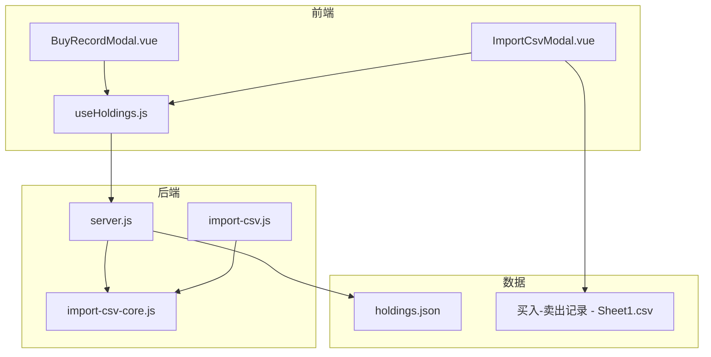
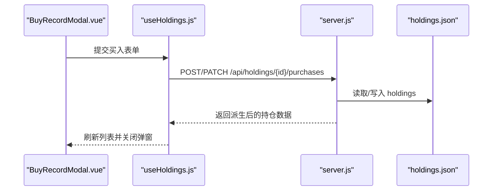
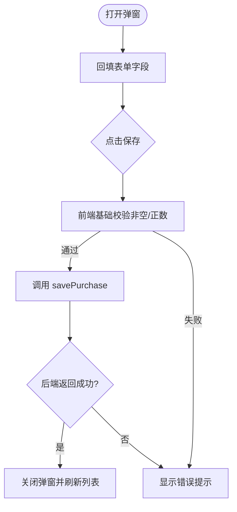
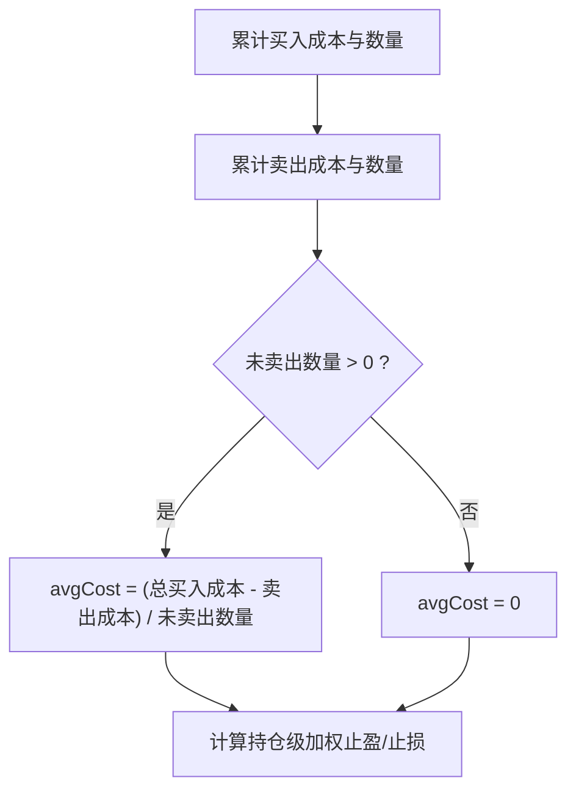
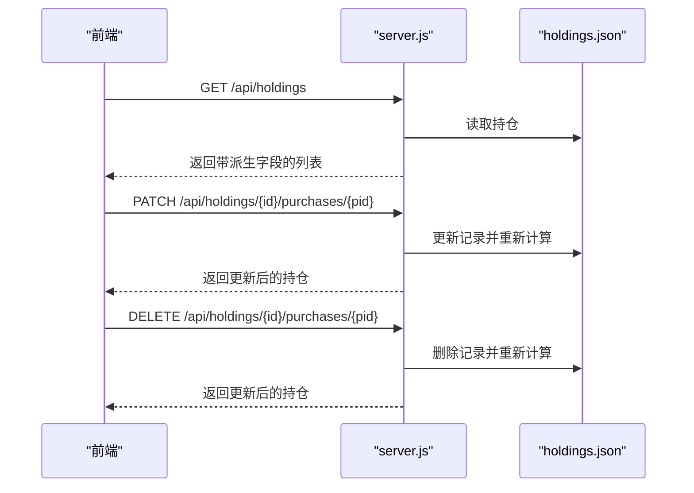
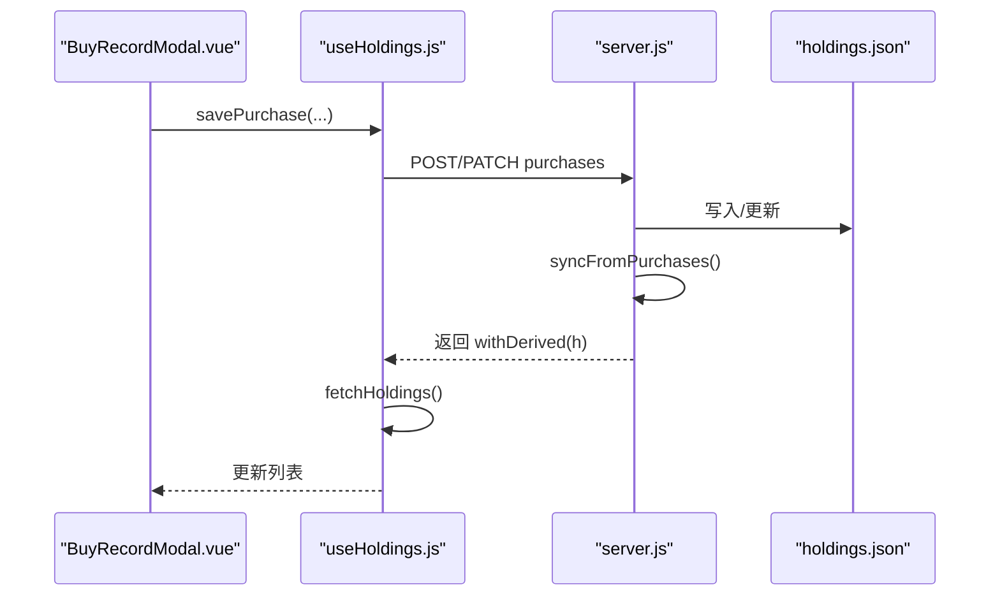
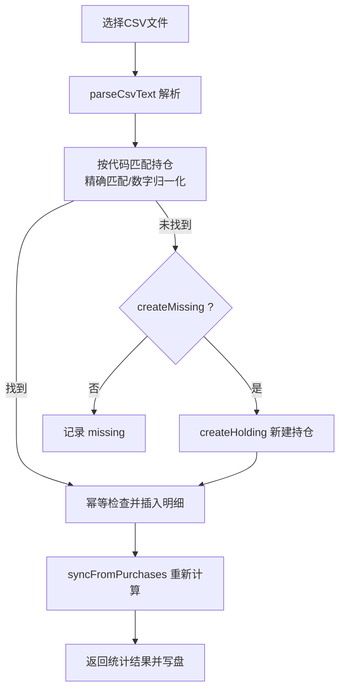
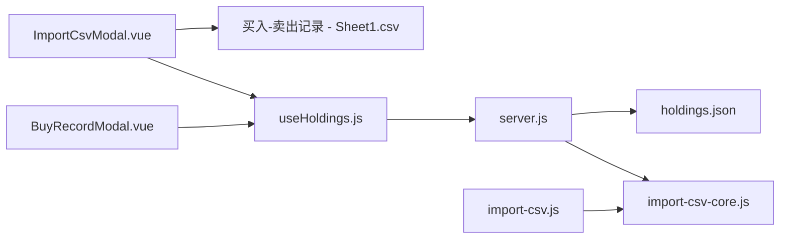

# 买入记录模态框

<cite>
**本文引用的文件**
- [BuyRecordModal.vue](file://web/src/components/BuyRecordModal.vue)
- [useHoldings.js](file://web/src/composables/useHoldings.js)
- [server.js](file://server/server.js)
- [import-csv-core.js](file://server/import-csv-core.js)
- [import-csv.js](file://server/import-csv.js)
- [ImportCsvModal.vue](file://web/src/components/ImportCsvModal.vue)
- [holdings.json](file://data/holdings.json)
- [买入-卖出记录 - Sheet1.csv](file://data/买入-卖出记录 - Sheet1.csv)
</cite>

## 目录
1. [简介](#简介)
2. [项目结构](#项目结构)
3. [核心组件](#核心组件)
4. [架构总览](#架构总览)
5. [详细组件分析](#详细组件分析)
6. [依赖关系分析](#依赖关系分析)
7. [性能考量](#性能考量)
8. [故障排查指南](#故障排查指南)
9. [结论](#结论)
10. [附录：数据模型与API规范](#附录数据模型与api规范)

## 简介
本文件围绕“买入记录模态框”展开，聚焦 BuyRecordModal 组件的专门化功能，系统说明买入记录的字段录入、校验、保存流程；解释加权平均成本的计算与多次买入的成本聚合；阐述买入记录的历史管理（查看、编辑、删除）以及与持仓数据的同步机制；并说明批量导入 CSV 的实现方式与数据映射规则。最后提供买入记录的数据模型与 API 接口规范，便于开发者扩展买入管理功能。

## 项目结构
本项目采用前后端分离的结构：
- 前端 Vue 组件负责用户交互与表单提交，包括买入记录模态框与 CSV 导入模态框。
- 后端 Node.js 服务提供 RESTful API，处理买入记录的增删改查、CSV 批量导入、以及持仓汇总与派生计算。
- 数据持久化使用 JSON 文件 holdings.json，通过服务端 store 模块读写。

图表来源
- [BuyRecordModal.vue:1-94](file://web/src/components/BuyRecordModal.vue#L1-L94)
- [ImportCsvModal.vue:1-169](file://web/src/components/ImportCsvModal.vue#L1-L169)
- [useHoldings.js:1-154](file://web/src/composables/useHoldings.js#L1-L154)
- [server.js:409-565](file://server/server.js#L409-L565)
- [import-csv-core.js:1-307](file://server/import-csv-core.js#L1-L307)
- [import-csv.js:1-87](file://server/import-csv.js#L1-L87)

章节来源
- [BuyRecordModal.vue:1-94](file://web/src/components/BuyRecordModal.vue#L1-L94)
- [useHoldings.js:1-154](file://web/src/composables/useHoldings.js#L1-L154)
- [server.js:409-565](file://server/server.js#L409-L565)
- [import-csv-core.js:1-307](file://server/import-csv-core.js#L1-L307)
- [import-csv.js:1-87](file://server/import-csv.js#L1-L87)

## 核心组件
- 买入记录模态框（BuyRecordModal.vue）：提供买入价、数量、日期、止盈比例、止损比例的录入与提交，支持新增与编辑两种模式。
- 持仓状态与API封装（useHoldings.js）：统一调用后端 /api/holdings/* 接口，封装添加买入记录、修改买入记录、删除买入记录等操作，并在成功后刷新列表。
- 后端路由与业务逻辑（server.js）：实现买入记录的创建、更新、删除，以及交易后的持仓汇总与派生计算。
- CSV 批量导入（ImportCsvModal.vue + import-csv-core.js + import-csv.js）：支持从 CSV 解析并导入买入/卖出记录，按代码匹配持仓，幂等插入，自动新建缺失持仓（可选）。

章节来源
- [BuyRecordModal.vue:1-94](file://web/src/components/BuyRecordModal.vue#L1-L94)
- [useHoldings.js:67-118](file://web/src/composables/useHoldings.js#L67-L118)
- [server.js:467-527](file://server/server.js#L467-L527)
- [ImportCsvModal.vue:1-169](file://web/src/components/ImportCsvModal.vue#L1-L169)
- [import-csv-core.js:170-307](file://server/import-csv-core.js#L170-L307)
- [import-csv.js:1-87](file://server/import-csv.js#L1-L87)

## 架构总览
前端通过 useHoldings 发起 HTTP 请求到后端 server.js，后端对买入记录进行校验、落盘，并重新计算持仓汇总字段（成本、均价、止盈止损加权等），返回派生后的数据供前端展示。CSV 导入由 ImportCsvModal 触发，后端使用 import-csv-core 解析 CSV，按代码匹配或自动新建持仓，幂等插入明细，再写回 holdings.json。

图表来源
- [BuyRecordModal.vue:37-53](file://web/src/components/BuyRecordModal.vue#L37-L53)
- [useHoldings.js:94-104](file://web/src/composables/useHoldings.js#L94-L104)
- [server.js:467-513](file://server/server.js#L467-L513)
- [server.js:247-284](file://server/server.js#L247-L284)

## 详细组件分析

### 买入记录模态框（BuyRecordModal.vue）
- 字段结构
  - 买入价：数值型，用于计算单笔成本与收益。
  - 买入数量：整数型，表示本次买入的股数或份额。
  - 买入日期：日期型，用于排序与 LIFO 成本匹配。
  - 止盈收益率%：百分比，用于计算目标价与持仓级加权止盈。
  - 止损收益率%：百分比，用于计算止损价与持仓级加权止损。
- 行为与验证
  - 打开弹窗时根据 buyForm 回填字段，支持新增与编辑两种场景。
  - 提交时调用 savePurchase，将表单数据发送至后端；若后端返回错误，显示错误信息。
- 与持仓同步
  - 成功后通过 useHoldings 刷新整体持仓列表，确保均价、成本、止盈止损等派生字段实时更新。

图表来源
- [BuyRecordModal.vue:23-53](file://web/src/components/BuyRecordModal.vue#L23-L53)
- [useHoldings.js:94-104](file://web/src/composables/useHoldings.js#L94-L104)

章节来源
- [BuyRecordModal.vue:1-94](file://web/src/components/BuyRecordModal.vue#L1-L94)
- [useHoldings.js:94-104](file://web/src/composables/useHoldings.js#L94-L104)

### 加权平均成本与多次买入的成本聚合
- 成本聚合
  - 总买入成本 = 所有买入记录的 buyPrice × buyQuantity 之和。
  - 剩余成本 = 总买入成本 - 已卖出部分的成本（每笔卖出的 costPrice × sellQuantity）。
  - 未卖出数量 = 总买入数量 - 总卖出数量。
  - 加权均价 avgCost = 剩余成本 / 未卖出数量（若未卖出数量为 0，则均价为 0）。
- 止盈止损加权
  - 持仓级止盈/止损按各次买入的成本权重计算：以每次买入的成本作为权重，累加后除以总成本得到加权平均值。
- 卖出成本计算（LIFO）
  - 卖出时按最近买入优先（时间倒序）匹配成本，逐条扣减数量，直至满足卖出数量，从而得出该笔卖出的成本价与盈亏。

图表来源
- [server.js:247-284](file://server/server.js#L247-L284)
- [import-csv-core.js:60-128](file://server/import-csv-core.js#L60-L128)

章节来源
- [server.js:247-284](file://server/server.js#L247-L284)
- [import-csv-core.js:60-128](file://server/import-csv-core.js#L60-L128)

### 买入记录的历史管理（查看、编辑、删除）
- 查看
  - 后端在获取持仓列表时对每条买入记录进行派生计算（成本、市值、收益、目标价、止损价），并按时间倒序排列，前端统一展示。
- 编辑
  - 通过 PATCH /api/holdings/{id}/purchases/{pid} 更新某条买入记录的字段（价格、数量、日期、止盈/止损比例），后端重新计算并保存。
- 删除
  - 通过 DELETE /api/holdings/{id}/purchases/{pid} 删除某条买入记录，后端重新计算并保存；若无买入记录，持仓状态可能变为“已卖出”。

图表来源
- [server.js:410-414](file://server/server.js#L410-L414)
- [server.js:490-527](file://server/server.js#L490-L527)
- [useHoldings.js:106-118](file://web/src/composables/useHoldings.js#L106-L118)

章节来源
- [server.js:410-414](file://server/server.js#L410-L414)
- [server.js:490-527](file://server/server.js#L490-L527)
- [useHoldings.js:106-118](file://web/src/composables/useHoldings.js#L106-L118)

### 与持仓数据的同步机制
- 同步时机
  - 每次新增、修改或删除买入记录后，后端调用 syncFromPurchases 重新计算持仓汇总字段（cost、buyQuantity、avgCost、targetProfitRate、stopLossRate、status 等），并持久化到 holdings.json。
- 前端刷新
  - useHoldings 在保存成功后调用 fetchHoldings 拉取最新数据，保证界面展示的均价、成本、收益等实时一致。

图表来源
- [useHoldings.js:94-104](file://web/src/composables/useHoldings.js#L94-L104)
- [server.js:467-513](file://server/server.js#L467-L513)
- [server.js:247-284](file://server/server.js#L247-L284)

章节来源
- [useHoldings.js:94-104](file://web/src/composables/useHoldings.js#L94-L104)
- [server.js:467-513](file://server/server.js#L467-L513)
- [server.js:247-284](file://server/server.js#L247-L284)

### 批量导入功能（CSV 解析与数据映射）
- 入口与交互
  - ImportCsvModal.vue 提供文件选择与文本粘贴，支持勾选“自动新建持仓”，提交至 /api/import-csv。
- 解析与匹配
  - import-csv-core.js 解析 CSV 文本，提取列（代码、操作、日期、数量、价格等），按代码精确匹配或数字归一化匹配现有持仓。
  - 幂等规则：以（代码、操作、日期、数量、价格）为唯一键，重复记录忽略。
  - 可选 createMissing：当匹配不到持仓时自动新建持仓（包含名称、地区、类型）。
- 写入与结果
  - 导入完成后写回 holdings.json，返回统计信息（新增、跳过、新建、缺失、错误）。

图表来源
- [ImportCsvModal.vue:49-73](file://web/src/components/ImportCsvModal.vue#L49-L73)
- [import-csv-core.js:170-307](file://server/import-csv-core.js#L170-L307)
- [import-csv.js:37-79](file://server/import-csv.js#L37-L79)

章节来源
- [ImportCsvModal.vue:49-73](file://web/src/components/ImportCsvModal.vue#L49-L73)
- [import-csv-core.js:170-307](file://server/import-csv-core.js#L170-L307)
- [import-csv.js:37-79](file://server/import-csv.js#L37-L79)

## 依赖关系分析
- 前端依赖
  - BuyRecordModal.vue 依赖 useHoldings.js 提供的 savePurchase、deletePurchase 等方法。
  - ImportCsvModal.vue 依赖 useHoldings.js 的 fetchHoldings 用于导入后刷新。
- 后端依赖
  - server.js 依赖 import-csv-core.js 的 importCsvText、normalizePurchase、syncFromPurchases 等函数。
  - import-csv.js 作为命令行脚本，复用 import-csv-core.js 的核心逻辑。
- 数据依赖
  - holdings.json 存储持仓及买入/卖出明细，被后端读写。
  - CSV 文件作为批量导入的数据源。

图表来源
- [BuyRecordModal.vue:1-94](file://web/src/components/BuyRecordModal.vue#L1-L94)
- [useHoldings.js:1-154](file://web/src/composables/useHoldings.js#L1-L154)
- [server.js:409-565](file://server/server.js#L409-L565)
- [import-csv-core.js:1-307](file://server/import-csv-core.js#L1-L307)
- [import-csv.js:1-87](file://server/import-csv.js#L1-L87)

章节来源
- [BuyRecordModal.vue:1-94](file://web/src/components/BuyRecordModal.vue#L1-L94)
- [useHoldings.js:1-154](file://web/src/composables/useHoldings.js#L1-L154)
- [server.js:409-565](file://server/server.js#L409-L565)
- [import-csv-core.js:1-307](file://server/import-csv-core.js#L1-L307)
- [import-csv.js:1-87](file://server/import-csv.js#L1-L87)

## 性能考量
- 前端
  - 使用单一定时器实现自动刷新，避免多定时器漂移带来的性能问题。
  - 表单提交前进行基础校验，减少无效请求。
- 后端
  - CSV 解析与匹配采用 Map 索引，提升查找效率。
  - 幂等插入避免重复计算与写入。
  - 交易后仅执行必要的 syncFromPurchases 与 withDerived 计算，控制开销。
- 数据
  - holdings.json 为轻量级 JSON，适合中小规模数据；大数据量时可考虑数据库迁移。

[本节为通用指导，不直接分析具体文件]

## 故障排查指南
- 前端错误
  - 保存失败：检查后端返回的错误消息，常见原因为必填字段缺失或数值非法。
  - 导入失败：确认 CSV 表头包含必需列（代码、操作、日期、数量、价格），并检查文件格式与编码。
- 后端错误
  - 买入价/数量必须为正：确保输入值大于 0。
  - 卖出数量超过持仓数量：检查 LIFO 匹配是否足够覆盖卖出数量。
  - 缺少必需字段：创建持仓时需包含 name、code、region、type。
- 数据一致性
  - 若出现均价异常，检查是否存在重复或错误的买入/卖出记录，必要时清理后重新导入。

章节来源
- [server.js:286-300](file://server/server.js#L286-L300)
- [server.js:346-407](file://server/server.js#L346-L407)
- [import-csv-core.js:170-188](file://server/import-csv-core.js#L170-L188)

## 结论
BuyRecordModal 提供了直观的买入记录录入与编辑能力，结合 useHoldings 与后端 API，实现了买入记录的持久化与持仓数据的实时同步。加权平均成本与 LIFO 卖出成本计算确保了成本核算的准确性。CSV 批量导入功能提升了历史数据的导入效率，并通过幂等规则保障数据一致性。整体架构清晰、职责分明，便于后续扩展与维护。

[本节为总结性内容，不直接分析具体文件]

## 附录：数据模型与API规范

### 数据模型（买入记录）
- 字段
  - id：字符串，唯一标识。
  - buyPrice：数值，买入价。
  - buyQuantity：数值，买入数量。
  - buyTime：字符串，日期（YYYY-MM-DD）。
  - targetProfitRate：数值，止盈收益率（%）。
  - stopLossRate：数值，止损收益率（%）。
- 示例路径
  - [holdings.json:14-22](file://data/holdings.json#L14-L22)

章节来源
- [holdings.json:14-22](file://data/holdings.json#L14-L22)

### API 接口规范
- 新增买入记录
  - 方法：POST
  - 路径：/api/holdings/{id}/purchases
  - 请求体：{ buyPrice, buyQuantity, buyTime, targetProfitRate, stopLossRate }
  - 响应：返回派生后的持仓数据
  - 参考：[server.js:467-488](file://server/server.js#L467-L488)
- 修改买入记录
  - 方法：PATCH
  - 路径：/api/holdings/{id}/purchases/{pid}
  - 请求体：可更新 buyPrice、buyQuantity、buyTime、targetProfitRate、stopLossRate
  - 响应：返回派生后的持仓数据
  - 参考：[server.js:490-513](file://server/server.js#L490-L513)
- 删除买入记录
  - 方法：DELETE
  - 路径：/api/holdings/{id}/purchases/{pid}
  - 响应：返回派生后的持仓数据
  - 参考：[server.js:515-527](file://server/server.js#L515-L527)
- 批量导入 CSV
  - 方法：POST
  - 路径：/api/import-csv
  - 请求体：{ csv: string, createMissing?: boolean }
  - 响应：{ added, skipped, created, createdCodes, missing, errors, total }
  - 参考：[server.js:416-435](file://server/server.js#L416-L435)
  - 参考：[ImportCsvModal.vue:49-73](file://web/src/components/ImportCsvModal.vue#L49-L73)
  - 参考：[import-csv-core.js:170-307](file://server/import-csv-core.js#L170-L307)

章节来源
- [server.js:416-435](file://server/server.js#L416-L435)
- [server.js:467-527](file://server/server.js#L467-L527)
- [ImportCsvModal.vue:49-73](file://web/src/components/ImportCsvModal.vue#L49-L73)
- [import-csv-core.js:170-307](file://server/import-csv-core.js#L170-L307)