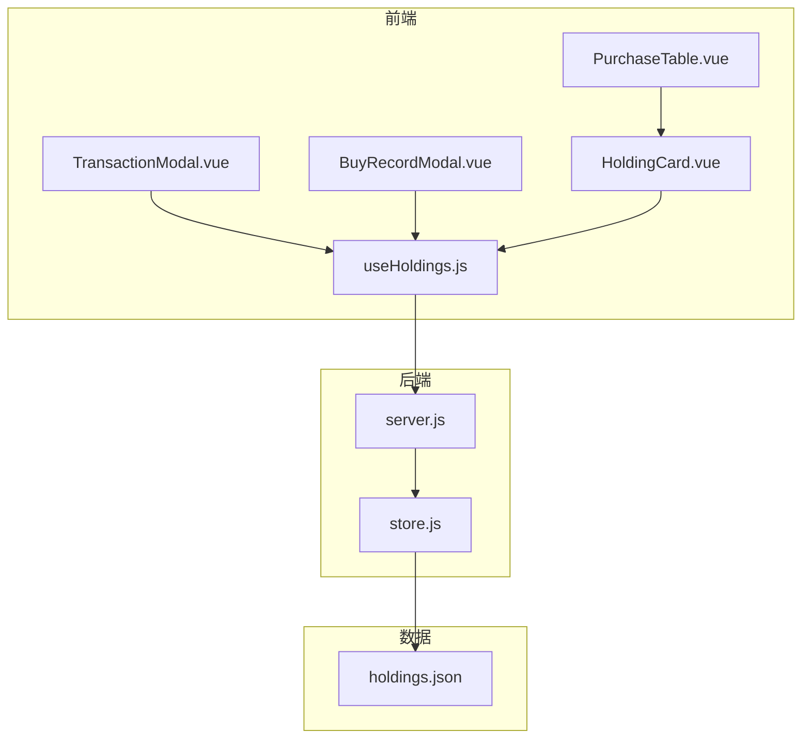
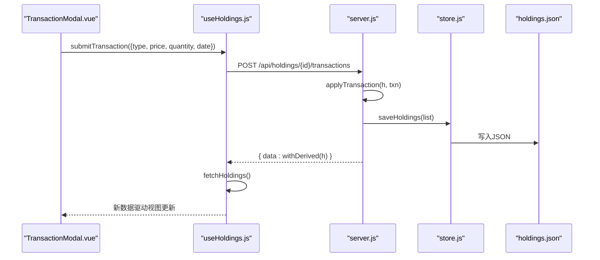
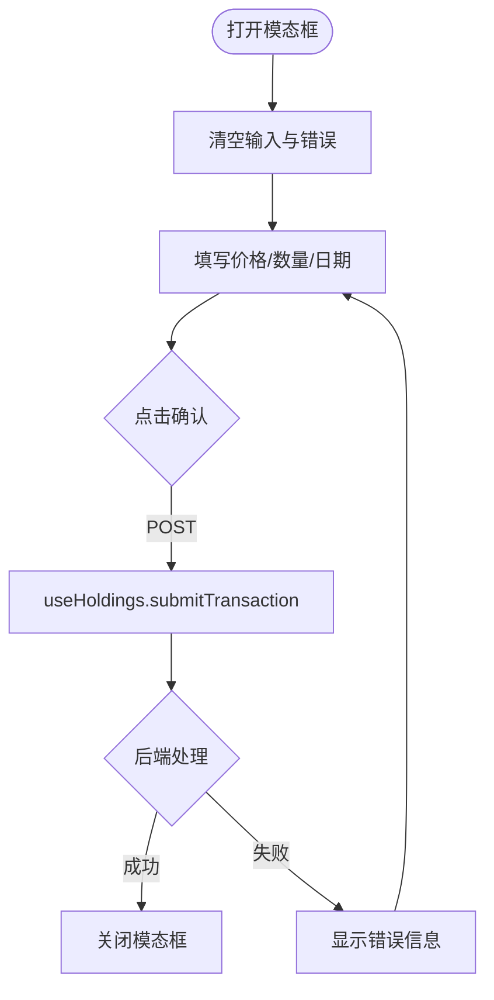
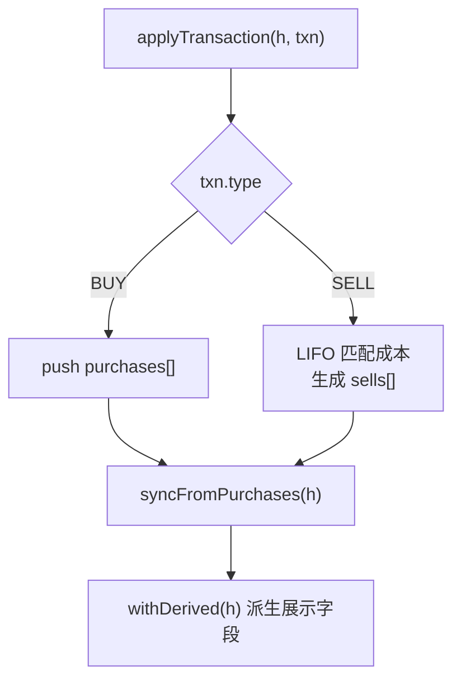
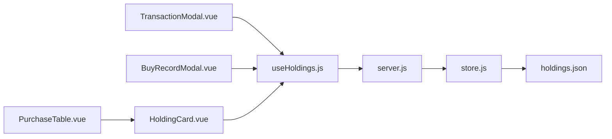

# 交易记录模态框

<cite>
**本文引用的文件**
- [TransactionModal.vue](file://web/src/components/TransactionModal.vue)
- [BuyRecordModal.vue](file://web/src/components/BuyRecordModal.vue)
- [useHoldings.js](file://web/src/composables/useHoldings.js)
- [server.js](file://server/server.js)
- [store.js](file://server/store.js)
- [holdings.json](file://data/holdings.json)
- [HoldingCard.vue](file://web/src/components/HoldingCard.vue)
- [PurchaseTable.vue](file://web/src/components/PurchaseTable.vue)
- [盈亏计算规则.md](file://docs/盈亏计算规则.md)
</cite>

## 目录
1. [简介](#简介)
2. [项目结构](#项目结构)
3. [核心组件](#核心组件)
4. [架构总览](#架构总览)
5. [详细组件分析](#详细组件分析)
6. [依赖关系分析](#依赖关系分析)
7. [性能与一致性](#性能与一致性)
8. [故障排查指南](#故障排查指南)
9. [结论](#结论)
10. [附录：数据结构与API](#附录数据结构与api)

## 简介
本文件围绕“交易记录模态框”展开，系统性解析 TransactionModal 组件如何统一处理买入与卖出操作、如何与持仓数据联动、以及后端如何基于 LIFO 原则计算成本与收益。文档同时覆盖数据模型、API 接口、错误处理、实时刷新机制与常见问题的定位方法，帮助开发者快速理解并扩展交易管理流程。

## 项目结构
前端以 Vue 单文件组件组织，交易相关的主要入口为：
- 交易记录模态框：TransactionModal.vue（统一提交买入/卖出）
- 买入记录模态框：BuyRecordModal.vue（维护多次买入明细）
- 状态与网络层：useHoldings.js（封装 fetch 调用与自动刷新）
- 页面展示：HoldingCard.vue、PurchaseTable.vue（汇总指标与交易流水表）

后端提供 HTTP API，核心逻辑集中在 server.js，持久化由 store.js 负责读写 holdings.json。

图表来源
- [TransactionModal.vue:1-81](file://web/src/components/TransactionModal.vue#L1-L81)
- [BuyRecordModal.vue:1-94](file://web/src/components/BuyRecordModal.vue#L1-L94)
- [useHoldings.js:1-154](file://web/src/composables/useHoldings.js#L1-L154)
- [server.js:409-565](file://server/server.js#L409-L565)
- [store.js:40-71](file://server/store.js#L40-L71)

章节来源
- [TransactionModal.vue:1-81](file://web/src/components/TransactionModal.vue#L1-L81)
- [BuyRecordModal.vue:1-94](file://web/src/components/BuyRecordModal.vue#L1-L94)
- [useHoldings.js:1-154](file://web/src/composables/useHoldings.js#L1-L154)
- [server.js:409-565](file://server/server.js#L409-L565)
- [store.js:40-71](file://server/store.js#L40-L71)

## 核心组件
- TransactionModal.vue：统一的买入/卖出输入表单，根据传入的 type 动态渲染标题与按钮文案；提交时调用 useHoldings.submitTransaction。
- BuyRecordModal.vue：用于新增或修改某只资产的买入记录（支持多笔买入），字段包括买入价、数量、日期、止盈/止损比例。
- useHoldings.js：集中管理持仓数据的读取、写入与自动刷新；封装了 addHolding、submitTransaction、savePurchase、deletePurchase、updateHolding 等方法。
- HoldingCard.vue：展示单个持仓的汇总指标，并提供“+ 买入记录”“+ 卖出记录”等入口，触发对应模态框。
- PurchaseTable.vue：将买入与卖出合并成一条时间线，按日期倒序展示，买入项不显示收益，卖出项显示实现盈亏与收益率。

章节来源
- [TransactionModal.vue:1-81](file://web/src/components/TransactionModal.vue#L1-L81)
- [BuyRecordModal.vue:1-94](file://web/src/components/BuyRecordModal.vue#L1-L94)
- [useHoldings.js:67-154](file://web/src/composables/useHoldings.js#L67-L154)
- [HoldingCard.vue:1-161](file://web/src/components/HoldingCard.vue#L1-L161)
- [PurchaseTable.vue:1-79](file://web/src/components/PurchaseTable.vue#L1-L79)

## 架构总览
交易记录的完整生命周期如下：
- 用户在 TransactionModal 中输入价格、数量、日期并提交。
- useHoldings.submitTransaction 通过 POST /api/holdings/:id/transactions 将交易请求发送到后端。
- 后端 server.js 根据 type 执行 applyTransaction：
  - BUY：追加到 purchases[]，并同步剩余成本/数量/均价。
  - SELL：按 LIFO 从最新买入匹配成本，生成 sells[] 记录，更新状态与均价。
- 后端保存 holdings.json，并通过 withDerived 派生 transactions、avgCost、holdingProfit 等展示字段。
- 前端收到响应后重新拉取列表，界面实时更新。

图表来源
- [useHoldings.js:78-92](file://web/src/composables/useHoldings.js#L78-L92)
- [server.js:346-407](file://server/server.js#L346-L407)
- [server.js:529-543](file://server/server.js#L529-L543)
- [store.js:62-71](file://server/store.js#L62-L71)

## 详细组件分析

### TransactionModal 组件
- 功能要点
  - 接收 props.show 控制显隐，props.txn 包含 id、name、type（BUY/SELL）。
  - 表单字段：价格、数量、日期（可选）。
  - 打开时清空输入与错误信息；提交时调用 useHoldings.submitTransaction。
  - 成功关闭弹窗；失败时将错误消息渲染在表单下方。
- 交互流程
  - 用户点击“确认买入/卖出”→ 校验非空 → 发起网络请求 → 成功后关闭。
- 与持仓关联
  - 通过 txn.id 定位目标资产，后端根据该 id 找到对应持仓并应用交易。
- 错误处理
  - 捕获服务端返回的错误信息并展示给用户。

图表来源
- [TransactionModal.vue:18-44](file://web/src/components/TransactionModal.vue#L18-L44)
- [useHoldings.js:78-92](file://web/src/composables/useHoldings.js#L78-L92)

章节来源
- [TransactionModal.vue:1-81](file://web/src/components/TransactionModal.vue#L1-L81)
- [useHoldings.js:78-92](file://web/src/composables/useHoldings.js#L78-L92)

### BuyRecordModal 组件
- 功能要点
  - 支持新增与修改买入记录；当存在 pid 时为修改，否则新增。
  - 字段：买入价、买入数量、买入日期、止盈收益率%、止损收益率%。
  - 提交时调用 useHoldings.savePurchase，内部根据是否存在 pid 选择 POST 或 PATCH。
- 与持仓关联
  - 通过 buyForm.id 定位持仓，buyForm.pid 定位具体买入记录。
- 错误处理
  - 捕获并展示错误信息。

章节来源
- [BuyRecordModal.vue:1-94](file://web/src/components/BuyRecordModal.vue#L1-L94)
- [useHoldings.js:94-104](file://web/src/composables/useHoldings.js#L94-L104)

### 使用组合式函数 useHoldings
- 关键方法
  - fetchHoldings：GET /api/holdings，获取并缓存持仓列表。
  - submitTransaction：POST /api/holdings/:id/transactions，提交买入/卖出。
  - savePurchase：POST/PATCH /api/holdings/:id/purchases[/:pid]，新增或修改买入记录。
  - deletePurchase：DELETE /api/holdings/:id/purchases/:pid，删除买入记录。
  - updateHolding：PATCH /api/holdings/:id，更新持仓级字段（如告警阈值）。
- 自动刷新
  - startAutoRefresh 启动定时器，倒计时归零时刷新数据，避免多定时器漂移。
- 错误处理
  - 所有写操作失败抛出错误，由调用方捕获并提示。

章节来源
- [useHoldings.js:1-154](file://web/src/composables/useHoldings.js#L1-L154)

### 后端交易处理与成本计算
- 交易应用 applyTransaction
  - BUY：向 purchases[] 追加一条标准化后的买入记录，并同步剩余成本/数量/均价。
  - SELL：按 LIFO 从最新买入开始匹配，计算卖出部分的成本均价，生成 sells[] 记录，更新状态与均价。
- 派生字段 withDerived
  - 合并买入与卖出记录为 transactions，按日期倒序排列。
  - 计算 avgCost、marketValue、holdingProfit、todayProfit 等汇总指标。
- 同步逻辑 syncFromPurchases
  - 每次写入前根据 purchases 与 sells 反推剩余成本/数量/均价，保证落盘数据一致。

图表来源
- [server.js:346-407](file://server/server.js#L346-L407)
- [server.js:146-245](file://server/server.js#L146-L245)
- [server.js:247-284](file://server/server.js#L247-L284)

章节来源
- [server.js:346-407](file://server/server.js#L346-L407)
- [server.js:146-245](file://server/server.js#L146-L245)
- [server.js:247-284](file://server/server.js#L247-L284)

### 数据持久化与并发安全
- store.js 维护内存缓存 cache，首次加载或检测到外部文件变更时重新读盘。
- 写操作串行化 writeChain，防止调度器与 HTTP 接口并发写导致覆盖。
- 写盘后更新 mtime，避免误判为外部改动而重复重载。

章节来源
- [store.js:8-12](file://server/store.js#L8-L12)
- [store.js:40-71](file://server/store.js#L40-L71)

## 依赖关系分析
- 前端组件依赖 useHoldings 提供的网络方法与状态。
- useHoldings 依赖后端 REST API，并在写操作后主动刷新列表。
- 后端 server.js 依赖 store.js 进行数据持久化，依赖 withDerived/syncFromPurchases 保证数据一致性。
- 展示层 HoldingCard 与 PurchaseTable 消费 withDerived 的结果，呈现交易流水与汇总指标。

图表来源
- [useHoldings.js:67-154](file://web/src/composables/useHoldings.js#L67-L154)
- [server.js:409-565](file://server/server.js#L409-L565)
- [store.js:40-71](file://server/store.js#L40-L71)

章节来源
- [useHoldings.js:67-154](file://web/src/composables/useHoldings.js#L67-L154)
- [server.js:409-565](file://server/server.js#L409-L565)
- [store.js:40-71](file://server/store.js#L40-L71)

## 性能与一致性
- 前端自动刷新采用单一定时器，避免多定时器导致的抖动与重复请求。
- 后端写操作串行化，确保 holdings.json 的一致性。
- withDerived 在每次读取时派生展示字段，减少前端计算负担。
- 建议
  - 对大列表分页或虚拟滚动以提升渲染性能。
  - 对频繁更新的指标可考虑增量更新而非全量刷新。
  - 在网络不稳定时增加重试与退避策略。

## 故障排查指南
- 常见问题
  - 交易失败：检查后端返回 error 字段，确认 price/quantity 是否为正数。
  - 卖出数量超过持仓：后端会报错，需检查当前未卖出数量。
  - 数据不同步：确认是否触发了 fetchHoldings 刷新。
- 定位步骤
  - 查看浏览器网络面板，确认请求路径与参数是否正确。
  - 检查 holdings.json 中 purchases/sells 是否按预期更新。
  - 核对 withDerived 输出是否符合预期（avgCost、holdingProfit、todayProfit）。
- 日志与调试
  - 后端 console.error 输出存储错误。
  - 前端 try/catch 捕获错误并展示给用户。

章节来源
- [server.js:346-407](file://server/server.js#L346-L407)
- [useHoldings.js:78-118](file://web/src/composables/useHoldings.js#L78-L118)
- [store.js:62-71](file://server/store.js#L62-L71)

## 结论
TransactionModal 作为统一的交易入口，结合 useHoldings 的后端封装，实现了买入与卖出的统一处理。后端通过 LIFO 原则精确计算成本与收益，并通过 withDerived 派生展示字段，确保前端能直观看到交易流水与汇总指标。store.js 的串行写与内存缓存保证了数据的一致性与性能。整体架构清晰、职责分明，便于后续扩展与维护。

## 附录：数据结构与API

### 数据结构
- 持仓 Holding
  - id、name、code、region、type、strategy、status
  - purchases[]：买入记录数组
  - sells[]：卖出记录数组
  - cost、buyQuantity、sellQuantity、unsoldQuantity、avgCost、lastBuyPrice
  - marketValue、holdingProfit、holdingReturnRate、todayProfit、todayReturnRate
  - targetProfitRate、stopLossRate、refillDropRate、refillPrice、nextStrategy
  - currentPrice、prevClose、lastUpdated、triggerState、notifiedAt
- 买入记录 Purchase
  - id、buyPrice、buyQuantity、buyTime、targetProfitRate、stopLossRate
- 卖出记录 Sell
  - id、sellPrice、sellQuantity、sellDate、costPrice、profit、returnRate

章节来源
- [holdings.json:1-462](file://data/holdings.json#L1-L462)
- [server.js:146-245](file://server/server.js#L146-L245)
- [server.js:247-284](file://server/server.js#L247-L284)
- [盈亏计算规则.md:9-46](file://docs/盈亏计算规则.md#L9-L46)

### API 接口说明
- GET /api/holdings
  - 作用：获取所有持仓及派生字段
  - 响应：{ data: [...] }
- POST /api/holdings
  - 作用：新建持仓（建仓）
  - 请求体：包含 name、code、region、type 等必填字段
  - 响应：{ data: withDerived(h) }
- PATCH /api/holdings/:id
  - 作用：更新持仓级字段（如日涨跌告警阈值）
  - 请求体：dailyDropAlertPct、dailyRiseAlertPct 等
  - 响应：{ data: withDerived(h) }
- POST /api/holdings/:id/purchases
  - 作用：追加买入记录
  - 请求体：buyPrice、buyQuantity、buyTime、targetProfitRate、stopLossRate
  - 响应：{ data: withDerived(h) }
- PATCH /api/holdings/:id/purchases/:pid
  - 作用：修改某条买入记录
  - 请求体：同上字段按需更新
  - 响应：{ data: withDerived(h) }
- DELETE /api/holdings/:id/purchases/:pid
  - 作用：删除某条买入记录
  - 响应：{ data: withDerived(h) }
- POST /api/holdings/:id/transactions
  - 作用：统一提交买入/卖出
  - 请求体：type（BUY/SELL）、price、quantity、date（可选）
  - 响应：{ data: withDerived(h) }

章节来源
- [server.js:409-565](file://server/server.js#L409-L565)
- [useHoldings.js:67-154](file://web/src/composables/useHoldings.js#L67-L154)

### 交易成本与收益计算规则
- 买入成本：sum(buyPrice × buyQuantity)
- 卖出成本（LIFO）：从最新买入开始匹配，计算卖出部分成本均价
- 剩余仓位：剩余成本 = max(总买入成本 − 已卖出成本, 0)；剩余数量 = max(总买入数量 − 已卖出数量, 0)；剩余均价 = 剩余数量 > 0 ? 剩余成本 / 剩余数量 : 0
- 市值：currentPrice × 剩余数量
- 未实现盈亏：(currentPrice − 剩余均价) × 剩余数量
- 已实现盈亏：sum(sells[].profit)
- 持仓总盈亏：未实现盈亏 + 已实现盈亏
- 今日盈亏：(currentPrice − prevClose) × 剩余数量

章节来源
- [server.js:146-245](file://server/server.js#L146-L245)
- [server.js:247-284](file://server/server.js#L247-L284)
- [盈亏计算规则.md:50-144](file://docs/盈亏计算规则.md#L50-L144)