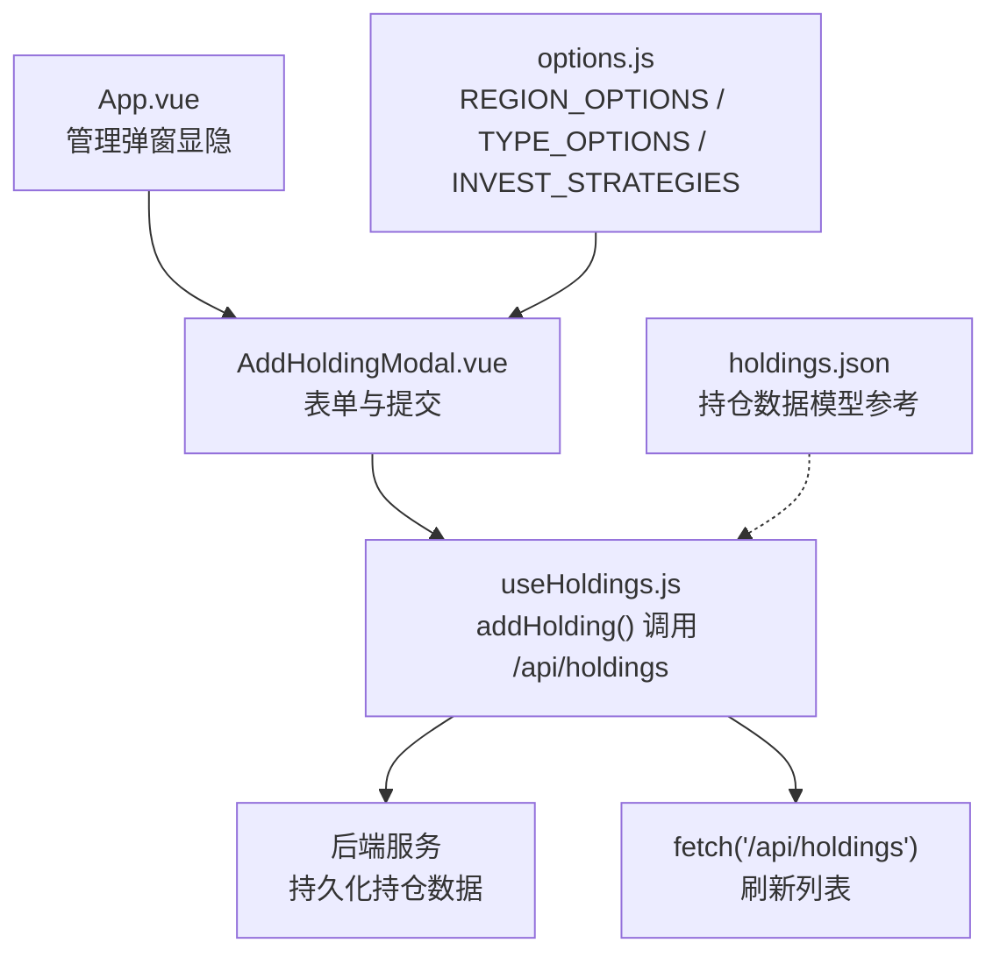
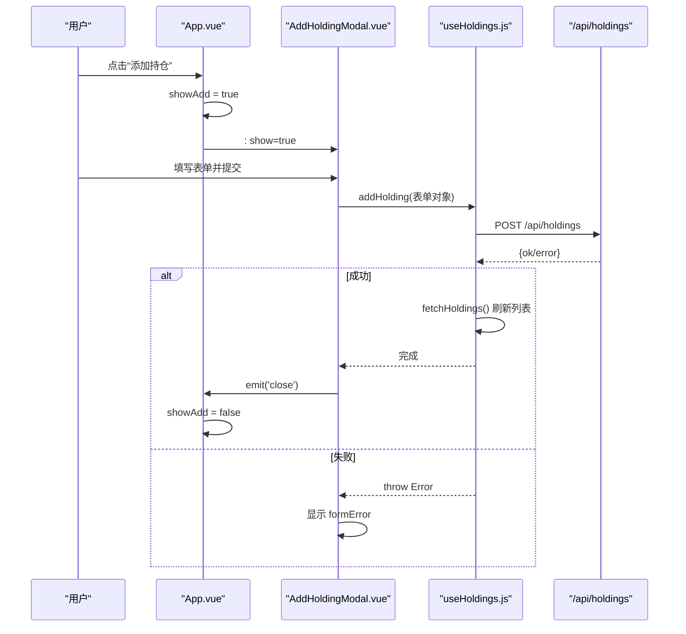
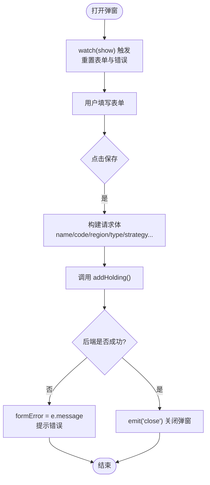
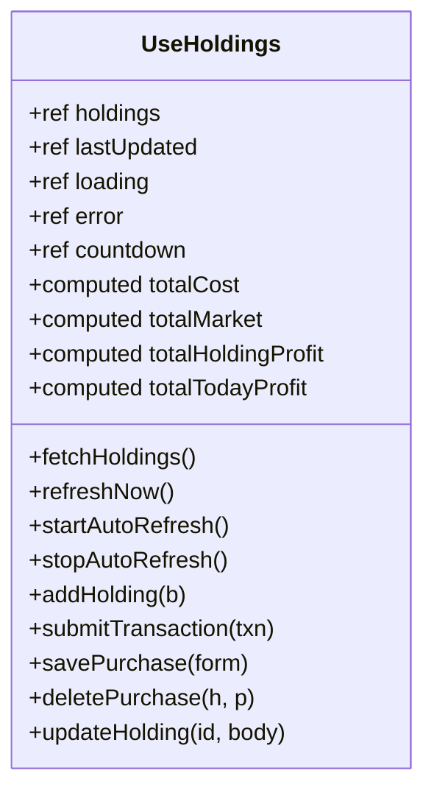
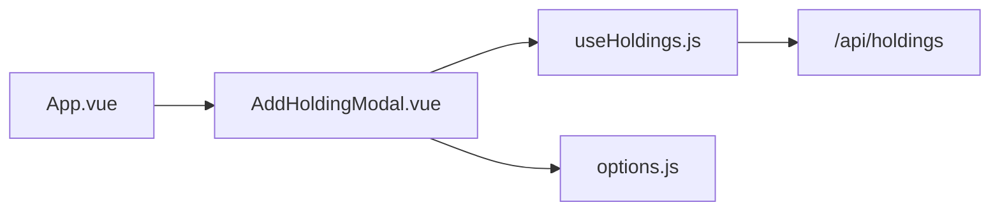

# 新增持仓模态框

<cite>
**本文引用的文件**
- [AddHoldingModal.vue](file://web/src/components/AddHoldingModal.vue)
- [useHoldings.js](file://web/src/composables/useHoldings.js)
- [options.js](file://web/src/constants/options.js)
- [App.vue](file://web/src/App.vue)
- [holdings.json](file://data/holdings.json)
</cite>

## 目录
1. [简介](#简介)
2. [项目结构](#项目结构)
3. [核心组件与职责](#核心组件与职责)
4. [架构总览](#架构总览)
5. [详细组件分析](#详细组件分析)
6. [依赖关系分析](#依赖关系分析)
7. [性能与可用性考虑](#性能与可用性考虑)
8. [故障排查指南](#故障排查指南)
9. [结论](#结论)
10. [附录：表单字段与策略配置说明](#附录表单字段与策略配置说明)

## 简介
本文件围绕“新增持仓”模态框（AddHoldingModal）进行系统化文档化，覆盖表单字段设计、数据验证与错误处理、提交流程、表单重置机制、与 useHoldings 组合式函数的集成方式、响应式双向绑定、以及策略配置项（止盈止损、补仓计划、告警阈值等）。同时提供流程图和时序图，帮助开发者快速理解从用户操作到后端持久化的完整业务流程。

## 项目结构
- 前端组件层：AddHoldingModal 负责展示新增持仓的对话框与表单交互。
- 组合式函数层：useHoldings 封装了持仓数据的读取、写入、刷新与自动轮询逻辑。
- 常量配置层：options.js 集中管理地区、类型、投资策略等枚举选项。
- 应用入口层：App.vue 管理弹窗显隐状态并挂载 AddHoldingModal。
- 数据模型参考：data/holdings.json 展示了持仓数据结构与策略相关字段。

图表来源
- [App.vue:132-196](file://web/src/App.vue#L132-L196)
- [AddHoldingModal.vue:1-151](file://web/src/components/AddHoldingModal.vue#L1-L151)
- [useHoldings.js:1-154](file://web/src/composables/useHoldings.js#L1-L154)
- [options.js:1-33](file://web/src/constants/options.js#L1-L33)
- [holdings.json:1-462](file://data/holdings.json#L1-L462)

章节来源
- [App.vue:132-196](file://web/src/App.vue#L132-L196)
- [AddHoldingModal.vue:1-151](file://web/src/components/AddHoldingModal.vue#L1-L151)
- [useHoldings.js:1-154](file://web/src/composables/useHoldings.js#L1-L154)
- [options.js:1-33](file://web/src/constants/options.js#L1-L33)
- [holdings.json:1-462](file://data/holdings.json#L1-L462)

## 核心组件与职责
- AddHoldingModal.vue
  - 负责新增持仓表单的展示与交互，包含名称、代码、地区、类型、投资策略、止盈止损、补仓计划、日涨跌告警阈值、仓位与下阶段策略等字段。
  - 通过 watch 监听 show 属性变化，在每次打开时重置表单与错误信息。
  - 提交时构造请求体并调用 useHoldings.addHolding，成功后关闭弹窗。
- useHoldings.js
  - 提供 addHolding 方法，向 /api/holdings 发起 POST 请求，并在成功或失败后统一刷新列表。
  - 统一管理持仓数据、加载状态、错误信息与自动刷新倒计时。
- options.js
  - 集中维护地区、类型、投资策略等下拉选项，保证前后端枚举一致。
- App.vue
  - 管理弹窗显示状态 showAdd，并将 AddHoldingModal 挂载到根视图。

章节来源
- [AddHoldingModal.vue:1-151](file://web/src/components/AddHoldingModal.vue#L1-L151)
- [useHoldings.js:1-154](file://web/src/composables/useHoldings.js#L1-L154)
- [options.js:1-33](file://web/src/constants/options.js#L1-L33)
- [App.vue:132-196](file://web/src/App.vue#L132-L196)

## 架构总览
新增持仓的核心流程如下：
- 用户在 App.vue 中触发添加按钮，设置 showAdd = true。
- AddHoldingModal 接收 show 为 true 时渲染对话框，并通过 v-model 双向绑定表单字段。
- 用户填写表单后点击保存，submitAdd 将表单值映射为请求体并调用 addHolding。
- useHoldings.addHolding 调用 /api/holdings POST 接口，成功后再次 fetch 列表以刷新 UI。
- 若后端返回错误，AddHoldingModal 捕获异常并显示错误消息。

图表来源
- [App.vue:132-196](file://web/src/App.vue#L132-L196)
- [AddHoldingModal.vue:38-63](file://web/src/components/AddHoldingModal.vue#L38-L63)
- [useHoldings.js:67-76](file://web/src/composables/useHoldings.js#L67-L76)

## 详细组件分析

### AddHoldingModal 组件分析
- 表单字段设计
  - 基础信息：名称、代码、地区、类型、投资策略。
  - 交易与策略：止盈收益率、止损收益率、补仓降幅、补仓价格、仓位（参考）、下阶段策略。
  - 告警阈值：日跌告警百分比、日涨告警百分比（留空表示不告警）。
  - 买入记录：建仓阶段仅登记股票信息，买入价/数量/日期由后续“买入记录”补充，因此提交时 purchases 初始为空数组。
- 响应式绑定
  - 使用 v-model 对每个输入项进行双向绑定，确保表单状态与视图同步更新。
- 表单重置机制
  - 通过 watch 监听 props.show，当弹窗打开时调用 blankForm 重置所有字段，并清空 formError，避免历史数据残留。
- 提交流程与错误处理
  - submitAdd 将表单值转换为请求体，调用 addHolding；成功后关闭弹窗；失败时将错误消息写入 formError 并保留弹窗以便修正。
- 用户体验优化建议
  - 为必填字段增加占位提示与校验反馈（如名称、代码必填）。
  - 对数值型字段限制最小值与步长，防止非法输入。
  - 在提交过程中加入 loading 状态，禁用保存按钮避免重复提交。
  - 对可选字段（如告警阈值）提供“留空=不告警”的明确提示。

图表来源
- [AddHoldingModal.vue:16-36](file://web/src/components/AddHoldingModal.vue#L16-L36)
- [AddHoldingModal.vue:38-63](file://web/src/components/AddHoldingModal.vue#L38-L63)

章节来源
- [AddHoldingModal.vue:1-151](file://web/src/components/AddHoldingModal.vue#L1-L151)

### useHoldings 组合式函数分析
- addHolding 方法
  - 向 /api/holdings 发送 POST 请求，携带新增持仓的请求体。
  - 如果响应非 ok，抛出错误；否则调用 fetchHoldings 刷新列表。
- 列表刷新与自动轮询
  - fetchHoldings 获取最新持仓数据，更新 lastUpdated 与 countdown，并处理错误。
  - startAutoRefresh 启动单一定时器，每秒递减 countdown，归零时触发刷新，避免多定时器漂移。
- 其他写操作
  - submitTransaction、savePurchase、deletePurchase、updateHolding 等方法统一通过 fetch 调用后端并刷新列表，保持数据一致性。

图表来源
- [useHoldings.js:1-154](file://web/src/composables/useHoldings.js#L1-L154)

章节来源
- [useHoldings.js:1-154](file://web/src/composables/useHoldings.js#L1-L154)

### 选项与枚举（options.js）
- 投资策略：长期持有、中线持有、短线持有、高风险博弈。
- 地区：港股、美股、A股(沪)、A股(深)。
- 类型：股票、股票型基金、债券型基金、货币型基金、ETF。
- 自动刷新间隔：REFRESH_MS 用于控制前端自动刷新频率。

章节来源
- [options.js:1-33](file://web/src/constants/options.js#L1-L33)

### 数据模型参考（holdings.json）
- 持仓对象包含 id、name、code、region、type、strategy、purchases、refillDropRate、refillPrice、nextStrategy、dailyDropAlertPct、dailyRiseAlertPct 等字段。
- purchases 数组包含每笔买入记录的 buyPrice、buyQuantity、buyTime、targetProfitRate、stopLossRate。
- 该模型与 AddHoldingModal 提交的字段保持一致，便于前后端对接。

章节来源
- [holdings.json:1-462](file://data/holdings.json#L1-L462)

## 依赖关系分析
- AddHoldingModal 依赖 useHoldings 提供的 addHolding 方法，以及 options.js 中的枚举选项。
- App.vue 管理弹窗显隐状态，并将 AddHoldingModal 作为子组件挂载。
- useHoldings 依赖后端 /api/holdings 接口，负责数据读写与刷新。

图表来源
- [App.vue:132-196](file://web/src/App.vue#L132-L196)
- [AddHoldingModal.vue:1-151](file://web/src/components/AddHoldingModal.vue#L1-L151)
- [useHoldings.js:1-154](file://web/src/composables/useHoldings.js#L1-L154)
- [options.js:1-33](file://web/src/constants/options.js#L1-L33)

章节来源
- [App.vue:132-196](file://web/src/App.vue#L132-L196)
- [AddHoldingModal.vue:1-151](file://web/src/components/AddHoldingModal.vue#L1-L151)
- [useHoldings.js:1-154](file://web/src/composables/useHoldings.js#L1-L154)
- [options.js:1-33](file://web/src/constants/options.js#L1-L33)

## 性能与可用性考虑
- 自动刷新：使用单一定时器控制 countdown，避免多定时器导致的抖动与资源浪费。
- 表单体验：
  - 打开弹窗即重置表单，避免脏数据影响。
  - 提交失败保留弹窗与错误提示，提升可修复性。
  - 数值字段设置 step 与占位符，降低输入错误率。
- 网络健壮性：
  - 统一错误捕获，将后端错误信息透传到前端展示。
  - 成功后立即刷新列表，保证 UI 与数据一致。

[本节为通用指导，无需特定文件引用]

## 故障排查指南
- 提交失败
  - 检查后端 /api/holdings 响应是否为 ok，若非 ok，查看错误消息并定位问题（如参数缺失、格式错误）。
  - 确认 AddHoldingModal 的 formError 是否正确显示错误信息。
- 列表未刷新
  - 确认 addHolding 成功后是否调用了 fetchHoldings。
  - 检查自动刷新是否被 stopAutoRefresh 停止。
- 表单状态异常
  - 确认 watch(show) 是否在弹窗打开时正确重置表单与错误信息。
  - 检查 v-model 绑定字段是否与 blankForm 默认值一致。

章节来源
- [AddHoldingModal.vue:27-63](file://web/src/components/AddHoldingModal.vue#L27-L63)
- [useHoldings.js:15-76](file://web/src/composables/useHoldings.js#L15-L76)

## 结论
AddHoldingModal 通过清晰的表单设计与响应式绑定，结合 useHoldings 的统一数据流管理，实现了稳健的新增持仓流程。配合 options.js 的枚举管理与 holdins.json 的数据模型参考，前后端契约清晰，易于扩展与维护。建议在后续迭代中增强前端校验与加载状态，进一步提升用户体验与系统健壮性。

[本节为总结性内容，无需特定文件引用]

## 附录：表单字段与策略配置说明
- 基础字段
  - 名称：持仓名称，建议必填。
  - 代码：资产代码，建议必填。
  - 地区：港股、美股、A股(沪)、A股(深)。
  - 类型：股票、股票型基金、债券型基金、货币型基金、ETF。
  - 投资策略：长期持有、中线持有、短线持有、高风险博弈。
- 交易与策略
  - 止盈收益率 %：达到该比例触发止盈。
  - 止损收益率 %：跌破该比例触发止损。
  - 补仓降幅 %：跌幅达到该比例触发补仓。
  - 补仓价格：指定补仓目标价（可为空）。
  - 仓位（参考）：当前仓位参考值。
  - 下阶段策略：下一阶段的操作策略描述。
- 告警阈值
  - 日跌告警 %：当日跌幅超过该阈值触发告警（留空=不告警）。
  - 日涨告警 %：当日涨幅超过该阈值触发告警（留空=不告警）。
- 买入记录
  - 建仓阶段不在此处录入买入价/数量/日期，后续通过“买入记录”模块补充。

章节来源
- [AddHoldingModal.vue:66-151](file://web/src/components/AddHoldingModal.vue#L66-L151)
- [options.js:1-33](file://web/src/constants/options.js#L1-L33)
- [holdings.json:1-462](file://data/holdings.json#L1-L462)