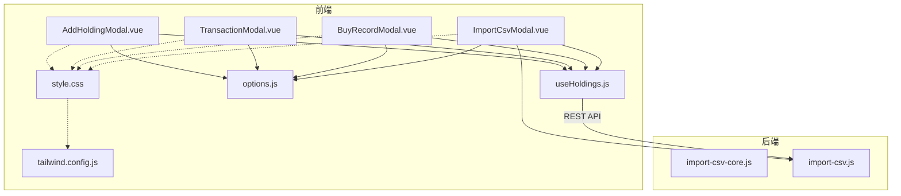
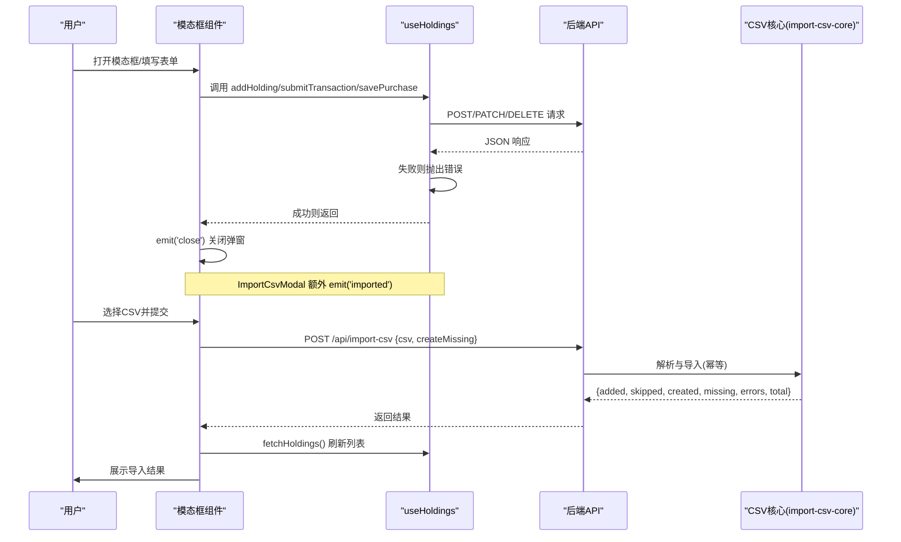
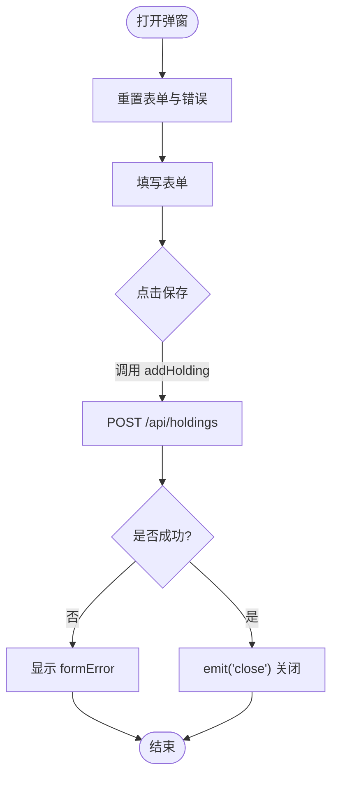
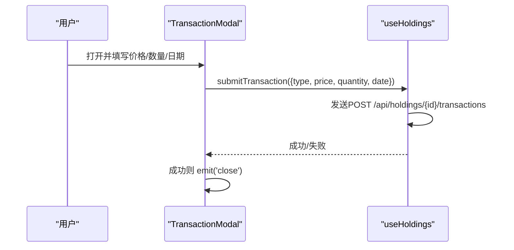
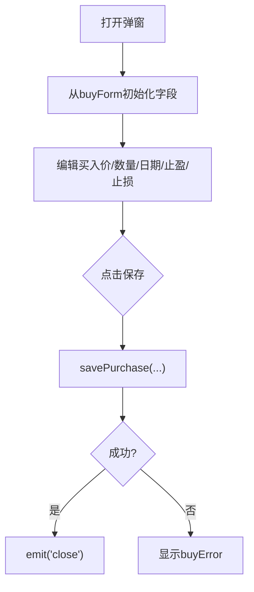
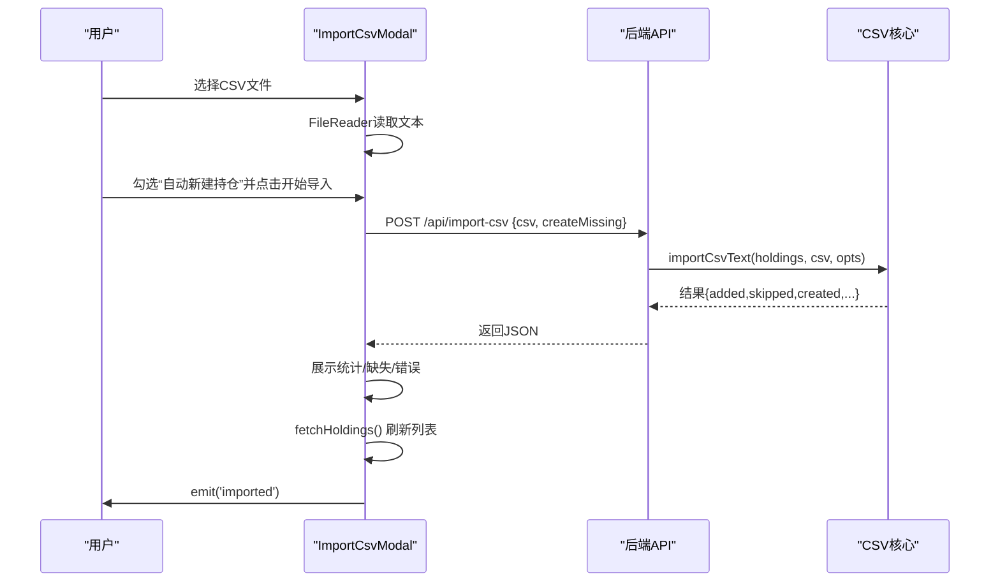
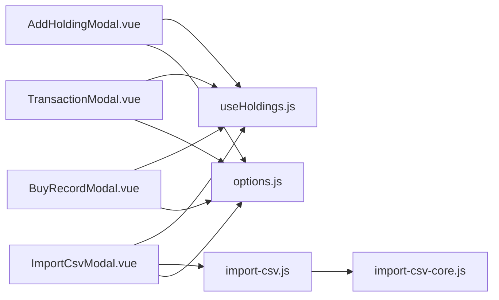

# 模态框组件集合

<cite>
**本文引用的文件**
- [AddHoldingModal.vue](file://web/src/components/AddHoldingModal.vue)
- [TransactionModal.vue](file://web/src/components/TransactionModal.vue)
- [BuyRecordModal.vue](file://web/src/components/BuyRecordModal.vue)
- [ImportCsvModal.vue](file://web/src/components/ImportCsvModal.vue)
- [useHoldings.js](file://web/src/composables/useHoldings.js)
- [options.js](file://web/src/constants/options.js)
- [import-csv-core.js](file://server/import-csv-core.js)
- [import-csv.js](file://server/import-csv.js)
- [style.css](file://web/src/style.css)
- [tailwind.config.js](file://tailwind.config.js)
</cite>

## 目录
1. [简介](#简介)
2. [项目结构](#项目结构)
3. [核心组件](#核心组件)
4. [架构总览](#架构总览)
5. [详细组件分析](#详细组件分析)
6. [依赖关系分析](#依赖关系分析)
7. [性能考量](#性能考量)
8. [故障排查指南](#故障排查指南)
9. [结论](#结论)
10. [附录：扩展与定制指南](#附录：扩展与定制指南)

## 简介
本仓库提供一套基于 Vue 的模态框组件集合，覆盖持仓新增、交易记录（买入/卖出）、买入记录管理与 CSV 批量导入四大场景。组件统一使用原生 dialog 元素承载，结合 Tailwind + DaisyUI 完成响应式布局与主题切换；数据层通过 composable 封装与后端 API 交互，CSV 导入由服务端核心逻辑保证幂等与一致性。文档将深入解析表单验证、错误提示、提交流程、生命周期管理、文件上传处理、父子通信模式、响应式与无障碍支持，并提供扩展新业务模态框的实践指南。

## 项目结构
前端模态框位于 web/src/components，状态与网络请求集中在 web/src/composables/useHoldings.js，常量选项在 web/src/constants/options.js。CSV 导入的核心算法在服务端 server/import-csv-core.js，HTTP 入口在 server/import-csv.js。样式与主题通过 tailwind.config.js 与 style.css 配置。

图表来源
- [AddHoldingModal.vue:1-151](file://web/src/components/AddHoldingModal.vue#L1-L151)
- [TransactionModal.vue:1-81](file://web/src/components/TransactionModal.vue#L1-L81)
- [BuyRecordModal.vue:1-94](file://web/src/components/BuyRecordModal.vue#L1-L94)
- [ImportCsvModal.vue:1-169](file://web/src/components/ImportCsvModal.vue#L1-L169)
- [useHoldings.js:1-154](file://web/src/composables/useHoldings.js#L1-L154)
- [options.js:1-33](file://web/src/constants/options.js#L1-L33)
- [import-csv-core.js:1-307](file://server/import-csv-core.js#L1-L307)
- [import-csv.js:1-87](file://server/import-csv.js#L1-L87)
- [style.css:1-34](file://web/src/style.css#L1-L34)
- [tailwind.config.js:1-54](file://tailwind.config.js#L1-L54)

章节来源
- [AddHoldingModal.vue:1-151](file://web/src/components/AddHoldingModal.vue#L1-L151)
- [TransactionModal.vue:1-81](file://web/src/components/TransactionModal.vue#L1-L81)
- [BuyRecordModal.vue:1-94](file://web/src/components/BuyRecordModal.vue#L1-L94)
- [ImportCsvModal.vue:1-169](file://web/src/components/ImportCsvModal.vue#L1-L169)
- [useHoldings.js:1-154](file://web/src/composables/useHoldings.js#L1-L154)
- [options.js:1-33](file://web/src/constants/options.js#L1-L33)
- [import-csv-core.js:1-307](file://server/import-csv-core.js#L1-L307)
- [import-csv.js:1-87](file://server/import-csv.js#L1-L87)
- [style.css:1-34](file://web/src/style.css#L1-L34)
- [tailwind.config.js:1-54](file://tailwind.config.js#L1-L54)

## 核心组件
- AddHoldingModal：新增持仓项目，包含名称、代码、地区、类型、策略、补仓参数、告警阈值、仓位参考与下阶段策略等字段，提交后调用 addHolding 并刷新列表。
- TransactionModal：处理单笔买入或卖出交易，填写价格、数量、日期（可选），提交后调用 submitTransaction 并刷新列表。
- BuyRecordModal：管理买入记录（可新增或修改），支持多次买入分别设置止盈/止损比例，提交后调用 savePurchase 并刷新列表。
- ImportCsvModal：CSV 文件导入，支持选择文件、读取文本、发送到 /api/import-csv，展示导入结果（新增、跳过、新建持仓、缺失、错误）并刷新列表。

章节来源
- [AddHoldingModal.vue:1-151](file://web/src/components/AddHoldingModal.vue#L1-L151)
- [TransactionModal.vue:1-81](file://web/src/components/TransactionModal.vue#L1-L81)
- [BuyRecordModal.vue:1-94](file://web/src/components/BuyRecordModal.vue#L1-L94)
- [ImportCsvModal.vue:1-169](file://web/src/components/ImportCsvModal.vue#L1-L169)

## 架构总览
四个模态框均通过 props.show 控制显示，内部维护本地表单状态，提交时调用 useHoldings 暴露的方法进行网络请求，成功后触发 close 事件关闭弹窗，并在 ImportCsvModal 中额外发射 imported 事件通知父组件刷新。useHoldings 集中管理 holdings 列表、自动刷新倒计时、汇总计算与写操作，所有写操作完成后统一调用 fetchHoldings 拉取最新数据。CSV 导入走服务端 import-csv.js -> import-csv-core.js，确保幂等与一致性。

图表来源
- [ImportCsvModal.vue:49-73](file://web/src/components/ImportCsvModal.vue#L49-L73)
- [useHoldings.js:67-104](file://web/src/composables/useHoldings.js#L67-L104)
- [import-csv-core.js:170-306](file://server/import-csv-core.js#L170-L306)
- [import-csv.js:37-79](file://server/import-csv.js#L37-L79)

## 详细组件分析

### AddHoldingModal（新增持仓）
- 表单字段：名称、代码、地区、类型、投资策略、补仓降幅/价格、日跌/日涨告警阈值、仓位参考、下阶段策略。
- 生命周期：watch show 重置表单与错误；提交时构造对象并调用 addHolding；成功后 emit('close')。
- 表单验证：基础校验在后端或 useHoldings 中统一处理；前端捕获异常并显示 formError。
- 数据流：提交到 /api/holdings，成功后刷新 holdings 列表。

图表来源
- [AddHoldingModal.vue:27-63](file://web/src/components/AddHoldingModal.vue#L27-L63)
- [useHoldings.js:67-76](file://web/src/composables/useHoldings.js#L67-L76)

章节来源
- [AddHoldingModal.vue:1-151](file://web/src/components/AddHoldingModal.vue#L1-L151)
- [useHoldings.js:67-76](file://web/src/composables/useHoldings.js#L67-L76)

### TransactionModal（买卖交易记录）
- 功能：根据传入 txn.type 动态显示“买入”或“卖出”，收集价格、数量、日期（可选）。
- 生命周期：watch show 清空输入与错误；提交调用 submitTransaction；成功后关闭。
- 数据流：POST /api/holdings/{id}/transactions，成功后刷新列表。

图表来源
- [TransactionModal.vue:18-44](file://web/src/components/TransactionModal.vue#L18-L44)
- [useHoldings.js:78-92](file://web/src/composables/useHoldings.js#L78-L92)

章节来源
- [TransactionModal.vue:1-81](file://web/src/components/TransactionModal.vue#L1-L81)
- [useHoldings.js:78-92](file://web/src/composables/useHoldings.js#L78-L92)

### BuyRecordModal（买入记录管理）
- 功能：新增或修改买入记录，支持同一股票多次买入，各自设置止盈/止损比例。
- 生命周期：watch show 初始化表单值（来自 buyForm）；提交调用 savePurchase；成功后关闭。
- 数据流：新增为 POST /api/holdings/{id}/purchases，修改为 PATCH /api/holdings/{id}/purchases/{pid}，成功后刷新列表。

图表来源
- [BuyRecordModal.vue:23-53](file://web/src/components/BuyRecordModal.vue#L23-L53)
- [useHoldings.js:94-104](file://web/src/composables/useHoldings.js#L94-L104)

章节来源
- [BuyRecordModal.vue:1-94](file://web/src/components/BuyRecordModal.vue#L1-L94)
- [useHoldings.js:94-104](file://web/src/composables/useHoldings.js#L94-L104)

### ImportCsvModal（CSV文件导入）
- 功能：选择 CSV 文件，读取文本，发送到 /api/import-csv，支持“匹配不到时自动新建持仓”选项；展示导入统计与明细。
- 生命周期：watch show 重置状态；handleFile 读取文件内容；submit 发起请求并处理结果；导入中禁止关闭。
- 数据流：POST /api/import-csv 返回 {added, skipped, created, createdCodes, missing, errors, total}；成功后调用 fetchHoldings 刷新列表并 emit('imported')。

图表来源
- [ImportCsvModal.vue:34-78](file://web/src/components/ImportCsvModal.vue#L34-L78)
- [useHoldings.js:15-29](file://web/src/composables/useHoldings.js#L15-L29)
- [import-csv-core.js:170-306](file://server/import-csv-core.js#L170-L306)

章节来源
- [ImportCsvModal.vue:1-169](file://web/src/components/ImportCsvModal.vue#L1-L169)
- [useHoldings.js:15-29](file://web/src/composables/useHoldings.js#L15-L29)
- [import-csv-core.js:170-306](file://server/import-csv-core.js#L170-L306)

## 依赖关系分析
- 组件依赖 useHoldings 提供的读写方法，避免直接耦合网络细节。
- 常量 options.js 提供下拉选项与刷新间隔，确保前后端枚举一致。
- CSV 导入由服务端 import-csv-core.js 提供幂等逻辑，import-csv.js 作为 HTTP 入口。
- 样式与主题通过 tailwind.config.js 与 style.css 统一。

图表来源
- [AddHoldingModal.vue:1-151](file://web/src/components/AddHoldingModal.vue#L1-L151)
- [TransactionModal.vue:1-81](file://web/src/components/TransactionModal.vue#L1-L81)
- [BuyRecordModal.vue:1-94](file://web/src/components/BuyRecordModal.vue#L1-L94)
- [ImportCsvModal.vue:1-169](file://web/src/components/ImportCsvModal.vue#L1-L169)
- [useHoldings.js:1-154](file://web/src/composables/useHoldings.js#L1-L154)
- [options.js:1-33](file://web/src/constants/options.js#L1-L33)
- [import-csv.js:1-87](file://server/import-csv.js#L1-L87)
- [import-csv-core.js:1-307](file://server/import-csv-core.js#L1-L307)

章节来源
- [useHoldings.js:1-154](file://web/src/composables/useHoldings.js#L1-L154)
- [options.js:1-33](file://web/src/constants/options.js#L1-L33)
- [import-csv-core.js:1-307](file://server/import-csv-core.js#L1-L307)
- [import-csv.js:1-87](file://server/import-csv.js#L1-L87)

## 性能考量
- 统一刷新：所有写操作完成后调用 fetchHoldings 拉取最新数据，避免多源状态不一致。
- 自动刷新：useHoldings 提供单一定时器心跳递减，归零即刷新，减少定时器漂移与重复请求。
- CSV 幂等：服务端按 (code, 操作, 日期, 数量, 价格) 唯一键去重，避免重复导入导致的数据膨胀。
- 大文件处理：ImportCsvModal 使用 FileReader 读取文本，适合中小规模 CSV；超大文件建议分片或服务端流式处理。

[本节为通用指导，不直接分析具体文件]

## 故障排查指南
- 添加持仓失败：检查后端返回 error 字段，前端会捕获并显示 formError。
- 交易失败：确认 id、type、price、quantity 是否正确；查看后端错误信息并显示 txnError。
- 买入记录保存失败：确认 pid（修改时）与必填字段；查看后端错误并显示 buyError。
- CSV 导入失败：
  - 表头缺少必需列：后端会抛错，前端 error 显示。
  - 匹配不到持仓：若未勾选“自动新建持仓”，将在 result.missing 中列出。
  - 导出错误：result.errors 包含每条出错记录的 message 与上下文。
- 导入中无法关闭：ImportCsvModal 在 importing 状态下阻止关闭，避免中断。

章节来源
- [AddHoldingModal.vue:38-63](file://web/src/components/AddHoldingModal.vue#L38-L63)
- [TransactionModal.vue:30-44](file://web/src/components/TransactionModal.vue#L30-L44)
- [BuyRecordModal.vue:37-53](file://web/src/components/BuyRecordModal.vue#L37-L53)
- [ImportCsvModal.vue:49-78](file://web/src/components/ImportCsvModal.vue#L49-L78)
- [import-csv-core.js:170-306](file://server/import-csv-core.js#L170-L306)

## 结论
该模态框组件集合以清晰的职责划分与统一的通信模式，实现了持仓新增、交易记录、买入记录管理与 CSV 批量导入的全流程闭环。通过 useHoldings 集中管理状态与网络请求，配合服务端的幂等导入逻辑，保证了数据的一致性与可靠性。组件采用原生 dialog 与 Tailwind/DaisyUI 构建，具备良好的可访问性与主题适配能力。后续可扩展更多业务模态框，复用现有模式即可快速落地。

[本节为总结性内容，不直接分析具体文件]

## 附录：扩展与定制指南
- 新增业务模态框步骤：
  - 创建组件文件，使用 <dialog class="modal"> 结构，props.show 控制显隐，emit('close') 关闭。
  - 如需与父组件通信，定义自定义事件（如 'imported'），在适当时机发射。
  - 表单状态使用 ref 管理，watch show 重置状态，提交时调用 useHoldings 对应方法。
  - 错误处理：捕获异常并显示在组件内错误区域。
  - 样式：沿用 Tailwind 类名，必要时在 style.css 补充全局样式。
- 表单验证机制：
  - 前端：基础非空与数值范围校验可在组件内实现；复杂规则建议下沉至 useHoldings 或后端统一校验。
  - 后端：对必填字段、数值合法性、业务约束进行校验，返回 error 消息供前端展示。
- 生命周期管理：
  - 打开：watch show 初始化表单与错误状态。
  - 关闭：emit('close')；ImportCsvModal 在导入中禁止关闭。
  - ESC 退出：原生 dialog 支持 ESC 关闭，无需额外实现；如需自定义行为，可在组件内监听 keydown 事件。
  - 焦点管理：原生 dialog 会在打开时聚焦第一个可聚焦元素；如需自定义焦点顺序，可使用 tabindex 与 focus()。
- 文件上传处理：
  - 拖拽上传：可在 ImportCsvModal 基础上增加 dragover/drop 事件，读取 e.dataTransfer.files。
  - 格式验证：限制 accept=".csv,text/csv"，并在 handleFile 中校验后缀与 MIME。
  - 进度反馈：对于大文件，可引入分块上传与服务端进度回调；当前实现为一次性读取文本。
- 与父组件通信：
  - 事件发射：close 用于关闭弹窗；imported 用于通知父组件刷新或跳转。
  - 数据传递：通过 props 传入必要数据（如 txn、buyForm），子组件仅负责展示与提交。
  - 状态同步：所有写操作完成后统一调用 fetchHoldings 刷新列表，保证视图与数据一致。
- 响应式设计与用户体验优化：
  - 移动端适配：使用 Tailwind 栅格与 DaisyUI 组件，确保在小屏上布局合理。
  - 键盘导航：原生 dialog 支持 Tab/Shift+Tab 与 ESC；可结合 aria-modal 提升可访问性。
  - 无障碍支持：为输入框添加 label，错误信息使用语义化元素；按钮具备明确文案。
- 主题与样式定制：
  - 在 tailwind.config.js 中扩展 DaisyUI 主题色板，保持品牌一致性。
  - 在 style.css 中补充全局样式（如滚动条、按钮文字颜色）。

章节来源
- [ImportCsvModal.vue:81-169](file://web/src/components/ImportCsvModal.vue#L81-L169)
- [tailwind.config.js:1-54](file://tailwind.config.js#L1-L54)
- [style.css:1-34](file://web/src/style.css#L1-L34)