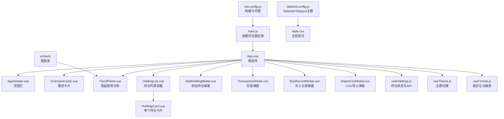
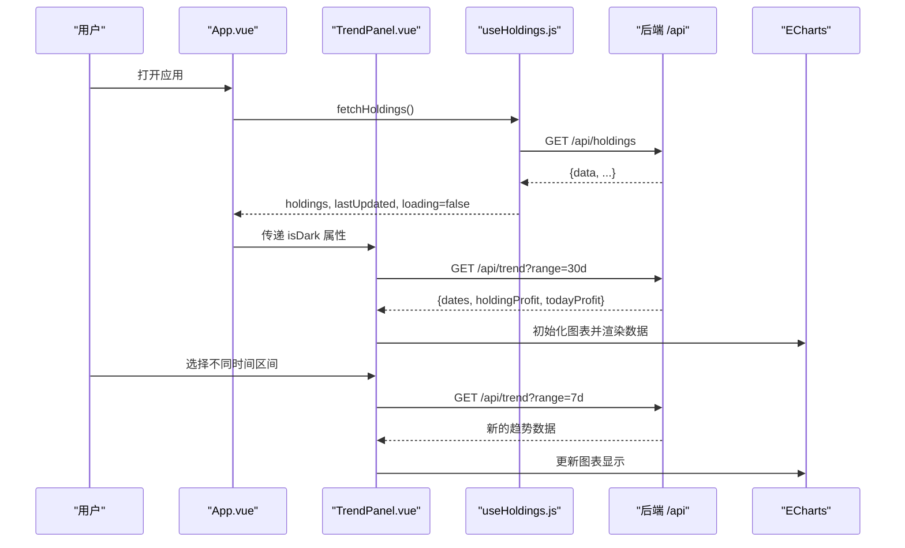
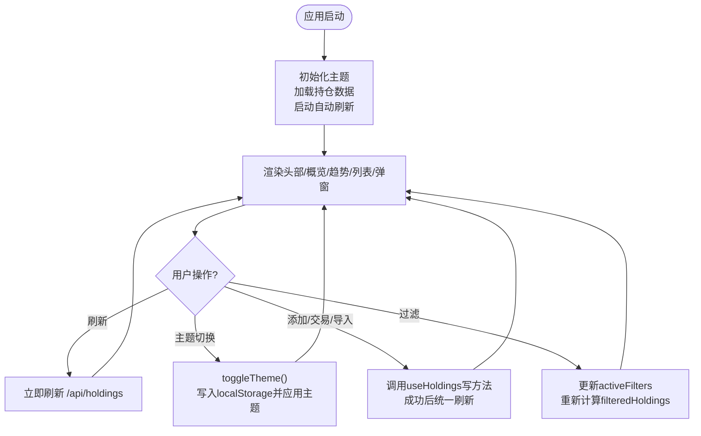
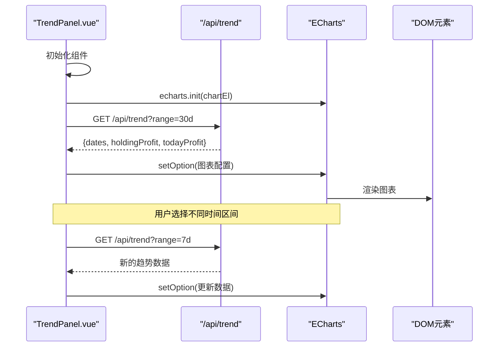
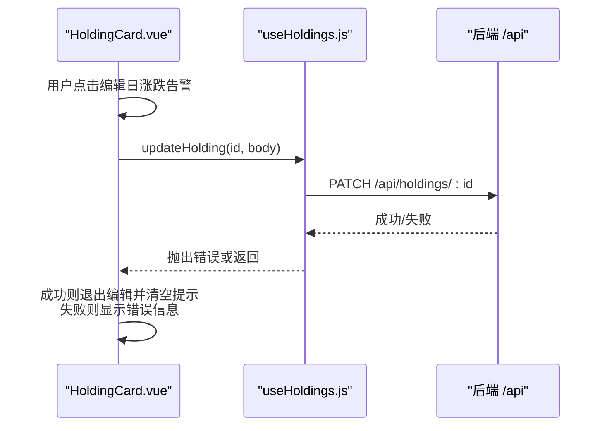
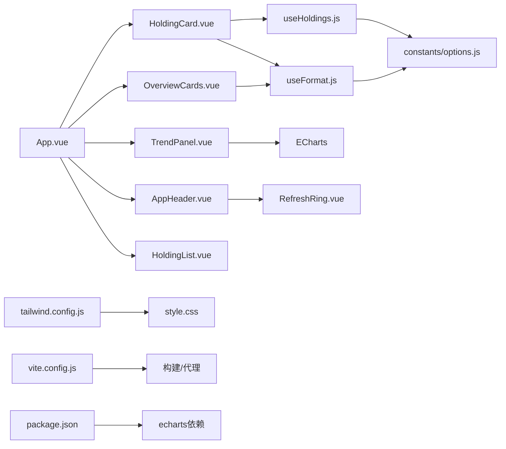

# 前端架构

<cite>
**本文引用的文件**
- [web/src/App.vue](file://web/src/App.vue)
- [web/src/main.js](file://web/src/main.js)
- [web/src/components/HoldingCard.vue](file://web/src/components/HoldingCard.vue)
- [web/src/components/OverviewCards.vue](file://web/src/components/OverviewCards.vue)
- [web/src/components/TrendPanel.vue](file://web/src/components/TrendPanel.vue)
- [web/src/components/AppHeader.vue](file://web/src/components/AppHeader.vue)
- [web/src/components/HoldingList.vue](file://web/src/components/HoldingList.vue)
- [web/src/composables/useHoldings.js](file://web/src/composables/useHoldings.js)
- [web/src/composables/useTheme.js](file://web/src/composables/useTheme.js)
- [web/src/composables/useFormat.js](file://web/src/composables/useFormat.js)
- [web/src/constants/options.js](file://web/src/constants/options.js)
- [tailwind.config.js](file://tailwind.config.js)
- [vite.config.js](file://vite.config.js)
- [web/src/style.css](file://web/src/style.css)
- [package.json](file://package.json)
</cite>

## 更新摘要
**所做更改**
- 新增 TrendPanel.vue 组件章节，详细介绍收益趋势分析功能
- 更新核心组件部分，包含新的趋势面板组件
- 更新架构图表，展示新组件的集成方式
- 添加 ECharts 图表库的依赖和配置说明
- 更新性能考量部分，包含图表渲染优化策略

## 目录
1. [简介](#简介)
2. [项目结构](#项目结构)
3. [核心组件](#核心组件)
4. [架构总览](#架构总览)
5. [详细组件分析](#详细组件分析)
6. [依赖关系分析](#依赖关系分析)
7. [性能考量](#性能考量)
8. [故障排查指南](#故障排查指南)
9. [结论](#结论)
10. [附录：开发指南与最佳实践](#附录开发指南与最佳实践)

## 简介
本文件为 Stock Advisor 前端（Vue 3 + Vite + Tailwind CSS + DaisyUI）的架构文档。重点解析 Composition API 的使用模式、组合式函数的设计理念与状态管理、核心组件体系（App.vue、HoldingCard、OverviewCards、TrendPanel）、响应式数据绑定、组件通信与事件处理、DaisyUI 主题集成与可访问性支持，以及组件复用策略、性能优化技巧与扩展建议。

## 项目结构
前端源码位于 web/ 子目录，采用按功能划分的目录组织：
- components：页面级与业务级 UI 组件，包括新增的收益趋势分析面板
- composables：基于 Vue 3 Composition API 的组合式函数，封装状态与逻辑
- constants：枚举与常量配置
- style.css：全局样式与 Tailwind/DaisyUI 引入
- App.vue：应用根组件，编排布局与全局状态
- main.js：应用入口，挂载根组件

构建与运行由 Vite 驱动，生产产物输出到 dist/，由后端 Node 服务托管；开发时通过代理将 /api 转发至本地后端。

**图表来源**
- [web/src/main.js:1-6](file://web/src/main.js#L1-L6)
- [web/src/App.vue:1-207](file://web/src/App.vue#L1-L207)
- [web/src/components/TrendPanel.vue:1-183](file://web/src/components/TrendPanel.vue#L1-L183)
- [tailwind.config.js:1-54](file://tailwind.config.js#L1-L54)
- [vite.config.js:1-33](file://vite.config.js#L1-L33)

**章节来源**
- [web/src/main.js:1-6](file://web/src/main.js#L1-L6)
- [web/src/App.vue:1-207](file://web/src/App.vue#L1-L207)
- [tailwind.config.js:1-54](file://tailwind.config.js#L1-L54)
- [vite.config.js:1-33](file://vite.config.js#L1-L33)

## 核心组件
- App.vue：应用入口，负责初始化主题、加载持仓数据、启动自动刷新、聚合过滤与弹窗控制，并将状态与事件传递给子组件。
- HoldingCard：展示单个持仓的汇总指标、告警阈值编辑、买入明细折叠面板，并通过事件向父层透传操作。
- OverviewCards：以卡片形式展示持仓数、总成本、总市值、今日收益、持仓收益等关键指标。
- **TrendPanel**：**新增** 收益趋势分析面板，使用 ECharts 提供交互式图表界面，支持按时间区间（今天、近7天、近30天、全部）查看收益趋势。
- AppHeader：顶部导航栏，显示更新时间、加载状态、倒计时环形进度、主题切换、刷新、飞书测试消息、添加持仓与导入 CSV 等操作入口。
- HoldingList：持有项列表容器，负责渲染 HoldingCard 并向上透传事件。

**章节来源**
- [web/src/App.vue:1-207](file://web/src/App.vue#L1-L207)
- [web/src/components/HoldingCard.vue:1-161](file://web/src/components/HoldingCard.vue#L1-L161)
- [web/src/components/OverviewCards.vue:1-41](file://web/src/components/OverviewCards.vue#L1-L41)
- [web/src/components/TrendPanel.vue:1-183](file://web/src/components/TrendPanel.vue#L1-L183)
- [web/src/components/AppHeader.vue:1-64](file://web/src/components/AppHeader.vue#L1-L64)
- [web/src/components/HoldingList.vue:1-36](file://web/src/components/HoldingList.vue#L1-L36)

## 架构总览
整体采用"组合式函数集中状态 + 组件按需消费"的模式：
- useHoldings：模块级单例状态，统一管理持仓数据、加载态、错误信息、倒计时与自动刷新；提供读取与写操作的统一入口，所有写操作后统一拉取最新数据以保持状态一致。
- useTheme：管理深色/浅色主题，持久化到 localStorage，并通过设置 html 的 data-theme 与 class 实现主题切换。
- useFormat：纯函数库，提供金额、价格、数量、百分比、日期格式化及徽章映射，无副作用便于复用与测试。

数据流：
- 初始化：App.vue 在 mounted 中调用 initTheme、fetchHoldings、startAutoRefresh。
- 自动刷新：useHoldings 内部使用 setInterval 每秒递减 countdown，归零时触发 fetchHoldings。
- 用户交互：组件通过 props/emits 与 App.vue 通信，App.vue 调用 useHoldings 提供的写方法，最终统一刷新数据。
- **趋势数据流**：TrendPanel 组件独立获取趋势数据，通过 `/api/trend?range=xxx` 接口获取指定时间区间的收益趋势数据。

**图表来源**
- [web/src/App.vue:124-132](file://web/src/App.vue#L124-L132)
- [web/src/components/TrendPanel.vue:45-58](file://web/src/components/TrendPanel.vue#L45-L58)
- [web/src/composables/useHoldings.js:15-49](file://web/src/composables/useHoldings.js#L15-L49)

**章节来源**
- [web/src/App.vue:124-132](file://web/src/App.vue#L124-L132)
- [web/src/components/TrendPanel.vue:45-58](file://web/src/components/TrendPanel.vue#L45-L58)
- [web/src/composables/useHoldings.js:15-49](file://web/src/composables/useHoldings.js#L15-L49)

## 详细组件分析

### App.vue：应用编排与状态协调
- 职责：初始化主题、获取并维护持仓数据、控制自动刷新、计算过滤后的持仓列表、管理弹窗状态与表单数据、聚合各子组件事件。
- 响应式与计算：
  - 使用 ref/computed 管理倒计时环形进度、过滤条件与筛选结果。
  - 地区标签兼容中文与短代码映射，确保过滤正确。
- 事件与通信：
  - 通过 props 向下传递数据（如 lastUpdated、loading、error、countdown、isDark）。
  - 通过 emits 向上接收子组件事件（如 toggle-theme、refresh、test-feishu、add、import-csv），并在 App.vue 中分发到具体逻辑。
- 生命周期：
  - onMounted：initTheme、fetchHoldings、startAutoRefresh。
  - onUnmounted：stopAutoRefresh、清理定时器。
- **新增集成**：在模板中引入并渲染 TrendPanel 组件，传递 isDark 属性以支持主题切换。

**图表来源**
- [web/src/App.vue:124-132](file://web/src/App.vue#L124-L132)
- [web/src/App.vue:79-122](file://web/src/App.vue#L79-L122)
- [web/src/App.vue:135-207](file://web/src/App.vue#L135-L207)

**章节来源**
- [web/src/App.vue:1-207](file://web/src/App.vue#L1-L207)

### TrendPanel：收益趋势分析面板
- **职责**：提供交互式收益趋势图表，支持按不同时间区间（今天、近7天、近30天、全部）查看持仓收益和每日收益走势。
- **核心功能**：
  - 时间区间选择：通过按钮切换 day、7d、30d、all 四种时间范围
  - 实时数据加载：调用 `/api/trend?range=xxx` 获取趋势数据
  - ECharts 图表渲染：使用折线图展示持仓收益和今日收益曲线
  - 主题适配：根据 isDark 属性动态调整图表颜色方案
  - 区间统计：显示区间内持仓收益变化和今日收益合计
- **技术实现**：
  - 使用 ECharts 的模块化导入，仅引入必要的组件以减少包体积
  - 响应式设计：监听窗口大小变化自动调整图表尺寸
  - 错误处理：完善的加载状态、错误提示和无数据状态显示
  - 内存管理：组件卸载时正确清理图表实例和事件监听器

**图表来源**
- [web/src/components/TrendPanel.vue:129-138](file://web/src/components/TrendPanel.vue#L129-L138)
- [web/src/components/TrendPanel.vue:45-58](file://web/src/components/TrendPanel.vue#L45-L58)
- [web/src/components/TrendPanel.vue:60-119](file://web/src/components/TrendPanel.vue#L60-L119)

**章节来源**
- [web/src/components/TrendPanel.vue:1-183](file://web/src/components/TrendPanel.vue#L1-L183)

### HoldingCard：持仓详情与内联编辑
- 职责：展示单个持仓的关键指标、买入明细折叠面板、日涨跌告警阈值内联编辑。
- 事件透传：通过 emit('open-txn', 'SELL')、emit('open-add-buy')、emit('edit-buy', p)、emit('delete-buy', p) 将操作交由父层处理。
- 内联编辑流程：
  - 点击编辑按钮进入编辑模式，填充当前值。
  - 保存时构造 body 并调用 updateHolding(id, body)，成功后退出编辑模式并清空提示。
  - 失败时显示错误信息。

**图表来源**
- [web/src/components/HoldingCard.vue:23-54](file://web/src/components/HoldingCard.vue#L23-L54)
- [web/src/composables/useHoldings.js:120-130](file://web/src/composables/useHoldings.js#L120-L130)

**章节来源**
- [web/src/components/HoldingCard.vue:1-161](file://web/src/components/HoldingCard.vue#L1-L161)
- [web/src/composables/useHoldings.js:120-130](file://web/src/composables/useHoldings.js#L120-L130)

### OverviewCards：投资组合概览
- 职责：以卡片网格展示持仓数、总成本、总市值、今日收益、持仓收益。
- 数据源：来自 App.vue 传入的 props（count、totalCost、totalMarket、totalTodayProfit、totalHoldingProfit）。
- 样式：使用 Tailwind 栅格与 DaisyUI 卡片风格，收益正负通过 profitCls 动态着色。

**章节来源**
- [web/src/components/OverviewCards.vue:1-41](file://web/src/components/OverviewCards.vue#L1-L41)
- [web/src/composables/useFormat.js:34-41](file://web/src/composables/useFormat.js#L34-L41)

### AppHeader：顶部栏与交互入口
- 职责：显示标题、更新时间、加载状态、倒计时环形进度、主题切换、刷新、飞书测试消息、添加持仓与导入 CSV。
- 事件：通过 emits 将用户操作回传给 App.vue。
- 可访问性：按钮具备 title 属性，图标按钮使用圆形样式，文本清晰表达意图。

**章节来源**
- [web/src/components/AppHeader.vue:1-64](file://web/src/components/AppHeader.vue#L1-L64)

### HoldingList：列表容器与事件透传
- 职责：遍历 holdings 渲染 HoldingCard，并将子组件事件带上 holding 对象透传给父层。
- 空状态：当 holdings 为空时显示引导文案。

**章节来源**
- [web/src/components/HoldingList.vue:1-36](file://web/src/components/HoldingList.vue#L1-L36)

## 依赖关系分析
- 组件依赖：
  - App.vue 依赖多个子组件与组合式函数，**新增对 TrendPanel 的依赖**。
  - HoldingCard 依赖 useFormat、useHoldings、PurchaseTable。
  - OverviewCards 依赖 useFormat。
  - **TrendPanel 依赖 ECharts 图表库**。
  - AppHeader 依赖 RefreshRing。
- 组合式函数依赖：
  - useHoldings 依赖 constants/options 中的 REFRESH_MS。
  - useTheme 直接操作 DOM 的 data-theme 与 class。
  - useFormat 依赖 constants/options 中的 INVEST_STRATEGIES、REGION_LABEL。
- 构建与样式：
  - tailwind.config.js 启用 daisyui 插件并定义 stocklight/stockdark 两套主题，darkTheme 设置为 stockdark。
  - vite.config.js 设置 root 为 web，构建输出到 ../dist，开发时代理 /api 到 http://127.0.0.1:3000，**新增 ECharts 的单独打包配置**。
  - style.css 引入 Tailwind 指令并自定义滚动条与按钮样式。
- **新增依赖**：
  - package.json 中添加 echarts 作为运行时依赖。
  - vite.config.js 中配置 ECharts 的 manualChunks 以优化构建性能。

**图表来源**
- [web/src/App.vue:1-207](file://web/src/App.vue#L1-L207)
- [web/src/components/TrendPanel.vue:1-183](file://web/src/components/TrendPanel.vue#L1-L183)
- [web/src/components/HoldingCard.vue:1-161](file://web/src/components/HoldingCard.vue#L1-L161)
- [web/src/components/OverviewCards.vue:1-41](file://web/src/components/OverviewCards.vue#L1-L41)
- [web/src/components/AppHeader.vue:1-64](file://web/src/components/AppHeader.vue#L1-L64)
- [web/src/composables/useHoldings.js:1-154](file://web/src/composables/useHoldings.js#L1-L154)
- [web/src/composables/useFormat.js:1-70](file://web/src/composables/useFormat.js#L1-L70)
- [web/src/constants/options.js:1-33](file://web/src/constants/options.js#L1-L33)
- [tailwind.config.js:1-54](file://tailwind.config.js#L1-L54)
- [vite.config.js:1-33](file://vite.config.js#L1-L33)
- [package.json:20-22](file://package.json#L20-L22)

**章节来源**
- [web/src/App.vue:1-207](file://web/src/App.vue#L1-L207)
- [web/src/components/TrendPanel.vue:1-183](file://web/src/components/TrendPanel.vue#L1-L183)
- [web/src/composables/useHoldings.js:1-154](file://web/src/composables/useHoldings.js#L1-L154)
- [web/src/composables/useFormat.js:1-70](file://web/src/composables/useFormat.js#L1-L70)
- [web/src/constants/options.js:1-33](file://web/src/constants/options.js#L1-L33)
- [tailwind.config.js:1-54](file://tailwind.config.js#L1-L54)
- [vite.config.js:1-33](file://vite.config.js#L1-L33)
- [package.json:20-22](file://package.json#L20-L22)

## 性能考量
- 单一自动刷新定时器：useHoldings 使用单一定时器每秒递减 countdown，避免多定时器漂移与重复请求。
- 计算属性缓存：概览汇总 totalCost、totalMarket、totalHoldingProfit、totalTodayProfit 使用 computed，仅在 holdings 变化时重算。
- 列表渲染优化：HoldingList 使用 key 绑定唯一 id，提升 diff 效率。
- 最小化重绘：主题切换通过设置 data-theme 与 class，避免频繁修改大量节点样式。
- 网络请求节流：自动刷新间隔为固定周期，手动刷新仅触发一次请求，避免高频请求。
- **图表性能优化**：
  - ECharts 模块化导入：仅引入必要的组件（LineChart、GridComponent、TooltipComponent、LegendComponent、CanvasRenderer）以减少包体积。
  - 单独打包：通过 vite.config.js 的 manualChunks 配置将 ECharts 单独拆包，避免阻塞首屏加载。
  - 响应式图表：监听窗口大小变化自动调整图表尺寸，确保在不同屏幕下的良好显示效果。
  - 内存管理：组件卸载时正确清理图表实例和事件监听器，防止内存泄漏。
- 建议：
  - 对大列表考虑虚拟滚动或分页（当前规模较小，暂不需要）。
  - 对复杂计算可进一步拆分或使用 useMemo 等价策略（Vue 已内置 computed）。
  - 对图片等资源进行懒加载与压缩。
  - 对图表数据进行适当的缓存和去重，避免重复请求。

**章节来源**
- [web/src/components/TrendPanel.vue:129-138](file://web/src/components/TrendPanel.vue#L129-L138)
- [vite.config.js:13-20](file://vite.config.js#L13-L20)
- [package.json:20-22](file://package.json#L20-L22)

## 故障排查指南
- 无法获取持仓数据：
  - 检查浏览器控制台是否有网络错误，确认 /api/holdings 是否可达。
  - 查看 useHoldings 中 error 状态是否为非空，定位错误信息。
- 自动刷新不工作：
  - 检查 startAutoRefresh 是否被调用，stopAutoRefresh 是否在卸载时被清理。
  - 确认 countdown 是否递减至 0，并触发 fetchHoldings。
- 主题切换无效：
  - 检查 useTheme 是否正确设置 document.documentElement.dataset.theme 与 class。
  - 确认 tailwind.config.js 中 darkMode 与 daisyui 的 darkTheme 配置一致。
- 表单提交失败：
  - 检查 AddHoldingModal 提交的字段是否符合后端期望。
  - 查看 useHoldings 中对应写方法的错误分支，捕获并显示错误信息。
- **趋势图表问题**：
  - 检查 ECharts 是否正确初始化，确认 chartEl 元素存在且可见。
  - 验证 `/api/trend` 接口是否正常返回数据，检查 network 面板中的请求状态。
  - 确认时间区间参数格式正确（day、7d、30d、all）。
  - 检查浏览器控制台是否有 ECharts 相关的 JavaScript 错误。
  - 验证图表容器高度是否足够，确保图表能够正常渲染。

**章节来源**
- [web/src/composables/useHoldings.js:15-29](file://web/src/composables/useHoldings.js#L15-L29)
- [web/src/composables/useHoldings.js:35-50](file://web/src/composables/useHoldings.js#L35-L50)
- [web/src/composables/useTheme.js:10-21](file://web/src/composables/useTheme.js#L10-L21)
- [web/src/components/AddHoldingModal.vue:38-63](file://web/src/components/AddHoldingModal.vue#L38-L63)
- [web/src/components/TrendPanel.vue:45-58](file://web/src/components/TrendPanel.vue#L45-L58)

## 结论
Stock Advisor 前端采用清晰的组合式函数与组件分层架构：useHoldings 集中管理与后端交互的状态，useTheme 管理主题，useFormat 提供无副作用的格式化能力；App.vue 作为编排中心协调各组件与事件；HoldingCard、OverviewCards、**TrendPanel** 等组件职责明确、易于扩展。**新增的收益趋势分析功能**通过 ECharts 提供了直观的数据可视化体验，支持多种时间区间的收益趋势查看。结合 Tailwind CSS 与 DaisyUI 的主题系统，实现了美观且可访问的界面。整体设计具备良好的可维护性与可扩展性，适合持续迭代与功能增强。

## 附录：开发指南与最佳实践

- 组合式函数设计原则
  - 单一职责：每个组合式函数聚焦一个领域（如持仓、主题、格式化）。
  - 无副作用：格式化函数保持纯函数特性，便于测试与复用。
  - 状态共享：模块级 ref 作为单例状态，确保跨组件一致性。
  - 统一写操作：所有写操作后统一拉取最新数据，避免状态不一致。

- 组件间通信与事件处理
  - 父到子：props 传递数据（如 OverviewCards 的指标、AppHeader 的控制参数、**TrendPanel 的主题属性**）。
  - 子到父：emits 上报事件（如 HoldingCard 的操作事件、AppHeader 的用户动作）。
  - 事件透传：HoldingList 将 HoldingCard 的事件带上 holding 对象继续向上传递。

- 响应式数据绑定
  - 使用 ref 管理可变状态（如弹窗显隐、表单数据、倒计时、**图表数据**）。
  - 使用 computed 派生状态（如过滤后的持仓列表、概览汇总、**图表统计信息**）。
  - 模板中使用 v-model、v-if、v-for 等指令进行双向绑定与条件渲染。

- DaisyUI 与 Tailwind CSS 集成
  - 在 tailwind.config.js 中启用 daisyui 插件并定义 stocklight/stockdark 主题。
  - 通过 useTheme 设置 html 的 data-theme 与 class 实现主题切换。
  - 在 style.css 中引入 @tailwind base/components/utilities 并自定义滚动条与按钮样式。

- **图表库集成与优化**
  - 使用 ECharts 的模块化导入，仅引入必要的组件以减少包体积。
  - 通过 vite.config.js 的 manualChunks 配置将大型库单独打包，优化首屏加载性能。
  - 实现响应式图表，监听窗口大小变化自动调整图表尺寸。
  - 正确处理图表实例的生命周期，在组件卸载时清理资源。

- 主题切换与可访问性
  - 主题切换按钮提供 title 描述，图标按钮使用圆形样式。
  - 颜色对比度遵循品牌色板，确保可读性。
  - 表单控件使用语义化标签与占位符，提升可访问性。
  - **图表主题适配**：根据 isDark 属性动态调整图表颜色方案，确保在深色模式下也有良好的视觉效果。

- 组件复用策略
  - 将通用逻辑抽离为组合式函数（如 useHoldings、useTheme、useFormat）。
  - 将通用 UI 抽象为独立组件（如 RefreshRing、PurchaseTable、**TrendPanel**）。
  - 通过 props/emits 解耦组件，提高复用性。

- 性能优化技巧
  - 使用 computed 缓存计算结果。
  - 列表渲染使用唯一 key。
  - 避免不必要的 re-render，合理使用 v-show/v-if。
  - 减少网络请求频率，使用统一的自动刷新机制。
  - **图表性能优化**：合理配置 ECharts 选项，避免频繁的图表重建，使用增量更新而非完全重绘。

- 扩展建议
  - 新增持仓类型或地区时，同步更新 constants/options.js 与 useFormat 的映射。
  - 新增写操作时，在 useHoldings 中统一封装并保证 fetchHoldings 刷新。
  - 新增弹窗时，在 App.vue 中集中管理显隐状态与表单数据。
  - **新增图表功能时**：遵循 TrendPanel 的实现模式，使用模块化导入、响应式设计和完善的错误处理。

**章节来源**
- [web/src/composables/useHoldings.js:1-154](file://web/src/composables/useHoldings.js#L1-L154)
- [web/src/composables/useTheme.js:1-26](file://web/src/composables/useTheme.js#L1-L26)
- [web/src/composables/useFormat.js:1-70](file://web/src/composables/useFormat.js#L1-L70)
- [web/src/constants/options.js:1-33](file://web/src/constants/options.js#L1-L33)
- [tailwind.config.js:1-54](file://tailwind.config.js#L1-L54)
- [web/src/style.css:1-34](file://web/src/style.css#L1-L34)
- [web/src/App.vue:1-207](file://web/src/App.vue#L1-L207)
- [web/src/components/TrendPanel.vue:1-183](file://web/src/components/TrendPanel.vue#L1-L183)
- [vite.config.js:13-20](file://vite.config.js#L13-L20)
- [package.json:20-22](file://package.json#L20-L22)