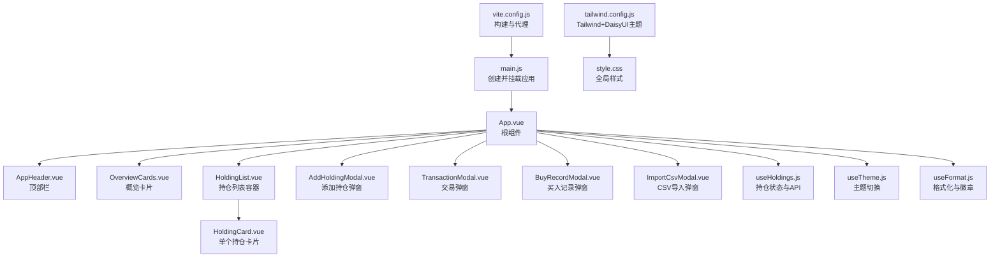
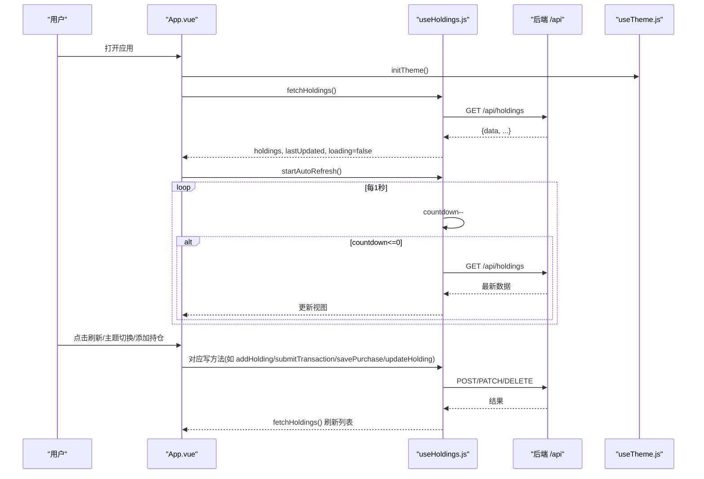
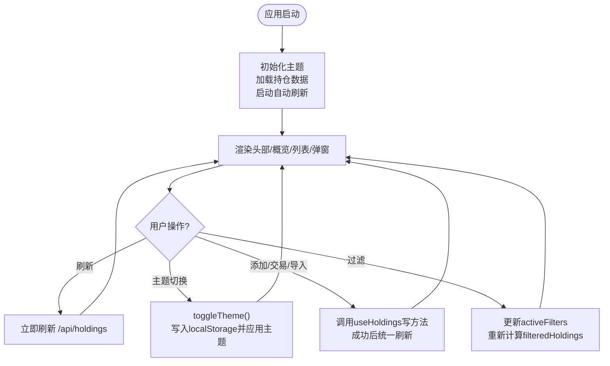
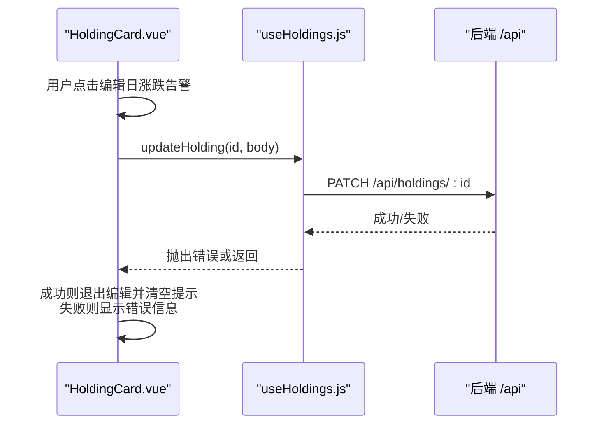
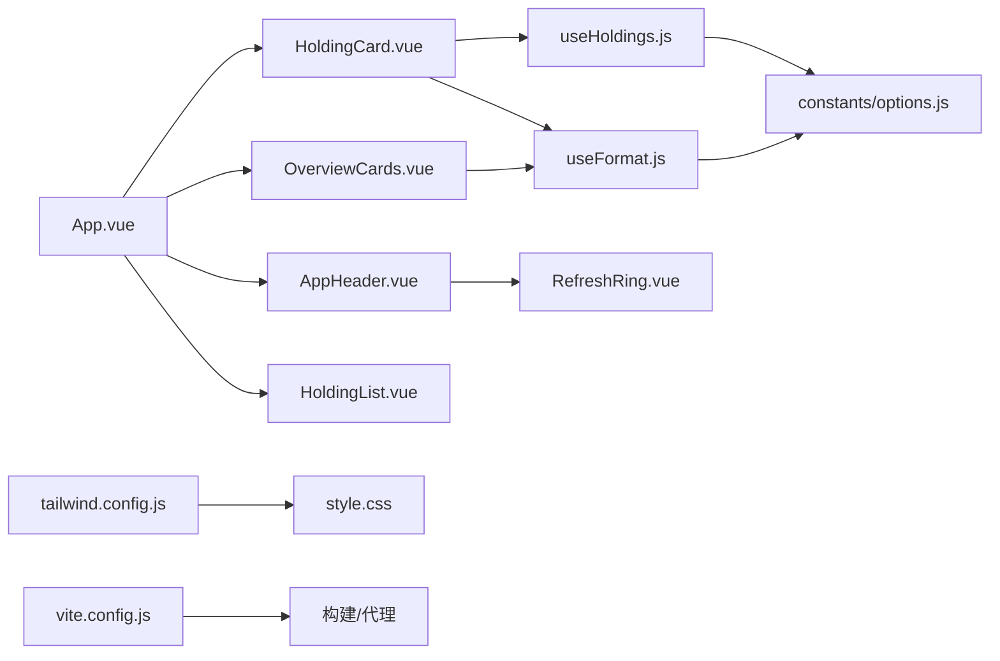

# 前端架构

<cite>
**本文引用的文件**
- [web/src/App.vue](file://web/src/App.vue)
- [web/src/main.js](file://web/src/main.js)
- [web/src/components/HoldingCard.vue](file://web/src/components/HoldingCard.vue)
- [web/src/components/OverviewCards.vue](file://web/src/components/OverviewCards.vue)
- [web/src/components/AppHeader.vue](file://web/src/components/AppHeader.vue)
- [web/src/components/HoldingList.vue](file://web/src/components/HoldingList.vue)
- [web/src/composables/useHoldings.js](file://web/src/composables/useHoldings.js)
- [web/src/composables/useTheme.js](file://web/src/composables/useTheme.js)
- [web/src/composables/useFormat.js](file://web/src/composables/useFormat.js)
- [web/src/constants/options.js](file://web/src/constants/options.js)
- [tailwind.config.js](file://tailwind.config.js)
- [vite.config.js](file://vite.config.js)
- [web/src/style.css](file://web/src/style.css)
</cite>

## 目录
1. [简介](#简介)
2. [项目结构](#项目结构)
3. [核心组件](#核心组件)
4. [架构总览](#架构总览)
5. [详细组件分析](#详细组件分析)
6. [依赖关系分析](#依赖关系分析)
7. [性能考量](#性能考量)
8. [故障排查指南](#故障排查指南)
9. [结论](#结论)
10. [附录：开发指南与最佳实践](#附录开发指南与最佳实践)

## 简介
本文件为 Stock Advisor 前端（Vue 3 + Vite + Tailwind CSS + DaisyUI）的架构文档。重点解析 Composition API 的使用模式、组合式函数的设计理念与状态管理、核心组件体系（App.vue、HoldingCard、OverviewCards）、响应式数据绑定、组件通信与事件处理、DaisyUI 主题集成与可访问性支持，以及组件复用策略、性能优化技巧与扩展建议。

## 项目结构
前端源码位于 web/ 子目录，采用按功能划分的目录组织：
- components：页面级与业务级 UI 组件
- composables：基于 Vue 3 Composition API 的组合式函数，封装状态与逻辑
- constants：枚举与常量配置
- style.css：全局样式与 Tailwind/DaisyUI 引入
- App.vue：应用根组件，编排布局与全局状态
- main.js：应用入口，挂载根组件

构建与运行由 Vite 驱动，生产产物输出到 dist/，由后端 Node 服务托管；开发时通过代理将 /api 转发至本地后端。

图表来源
- [web/src/main.js:1-6](file://web/src/main.js#L1-L6)
- [web/src/App.vue:1-197](file://web/src/App.vue#L1-L197)
- [tailwind.config.js:1-54](file://tailwind.config.js#L1-L54)
- [vite.config.js:1-26](file://vite.config.js#L1-L26)

章节来源
- [web/src/main.js:1-6](file://web/src/main.js#L1-L6)
- [web/src/App.vue:1-197](file://web/src/App.vue#L1-L197)
- [tailwind.config.js:1-54](file://tailwind.config.js#L1-L54)
- [vite.config.js:1-26](file://vite.config.js#L1-L26)

## 核心组件
- App.vue：应用入口，负责初始化主题、加载持仓数据、启动自动刷新、聚合过滤与弹窗控制，并将状态与事件传递给子组件。
- HoldingCard：展示单个持仓的汇总指标、告警阈值编辑、买入明细折叠面板，并通过事件向父层透传操作。
- OverviewCards：以卡片形式展示持仓数、总成本、总市值、今日收益、持仓收益等关键指标。
- AppHeader：顶部导航栏，显示更新时间、加载状态、倒计时环形进度、主题切换、刷新、飞书测试消息、添加持仓与导入 CSV 等操作入口。
- HoldingList：持有项列表容器，负责渲染 HoldingCard 并向上透传事件。

章节来源
- [web/src/App.vue:1-197](file://web/src/App.vue#L1-L197)
- [web/src/components/HoldingCard.vue:1-161](file://web/src/components/HoldingCard.vue#L1-L161)
- [web/src/components/OverviewCards.vue:1-41](file://web/src/components/OverviewCards.vue#L1-L41)
- [web/src/components/AppHeader.vue:1-64](file://web/src/components/AppHeader.vue#L1-L64)
- [web/src/components/HoldingList.vue:1-36](file://web/src/components/HoldingList.vue#L1-L36)

## 架构总览
整体采用“组合式函数集中状态 + 组件按需消费”的模式：
- useHoldings：模块级单例状态，统一管理持仓数据、加载态、错误信息、倒计时与自动刷新；提供读取与写操作的统一入口，所有写操作后统一拉取最新数据以保持状态一致。
- useTheme：管理深色/浅色主题，持久化到 localStorage，并通过设置 html 的 data-theme 与 class 实现主题切换。
- useFormat：纯函数库，提供金额、价格、数量、百分比、日期格式化及徽章映射，无副作用便于复用与测试。

数据流：
- 初始化：App.vue 在 mounted 中调用 initTheme、fetchHoldings、startAutoRefresh。
- 自动刷新：useHoldings 内部使用 setInterval 每秒递减 countdown，归零时触发 fetchHoldings。
- 用户交互：组件通过 props/emits 与 App.vue 通信，App.vue 调用 useHoldings 提供的写方法，最终统一刷新数据。

图表来源
- [web/src/App.vue:121-129](file://web/src/App.vue#L121-L129)
- [web/src/composables/useHoldings.js:15-49](file://web/src/composables/useHoldings.js#L15-L49)
- [web/src/composables/useTheme.js:10-21](file://web/src/composables/useTheme.js#L10-L21)

章节来源
- [web/src/App.vue:121-129](file://web/src/App.vue#L121-L129)
- [web/src/composables/useHoldings.js:15-49](file://web/src/composables/useHoldings.js#L15-L49)
- [web/src/composables/useTheme.js:10-21](file://web/src/composables/useTheme.js#L10-L21)

## 详细组件分析

### App.vue：应用编排与状态协调
- 职责：初始化主题、获取并维护持仓数据、控制自动刷新、计算过滤后的持仓列表、管理弹窗状态与表单数据、聚合各子组件事件。
- 响应式与计算：
  - 使用 ref/computed 管理倒计时环形进度、过滤条件与筛选结果。
  - 地区标签兼容中文与短代码映射，确保过滤正确。
- 事件与通信：
  - 通过 props 向下传递数据（如 lastUpdated、loading、error、countdown、isDark）。
  - 通过 emits 向上接收子组件事件（如 toggle-theme、refresh、test-feishu、add、import-csv），并在 App.vue 中分发到具体逻辑。
- 生命周期：
  - onMounted：initTheme、fetchHoldings、startAutoRefresh。
  - onUnmounted：stopAutoRefresh、清理定时器。

图表来源
- [web/src/App.vue:121-129](file://web/src/App.vue#L121-L129)
- [web/src/App.vue:76-119](file://web/src/App.vue#L76-L119)
- [web/src/App.vue:132-196](file://web/src/App.vue#L132-L196)

章节来源
- [web/src/App.vue:1-197](file://web/src/App.vue#L1-L197)

### HoldingCard：持仓详情与内联编辑
- 职责：展示单个持仓的关键指标、买入明细折叠面板、日涨跌告警阈值内联编辑。
- 事件透传：通过 emit('open-txn', 'SELL')、emit('open-add-buy')、emit('edit-buy', p)、emit('delete-buy', p) 将操作交由父层处理。
- 内联编辑流程：
  - 点击编辑按钮进入编辑模式，填充当前值。
  - 保存时构造 body 并调用 updateHolding(id, body)，成功后退出编辑模式并清空提示。
  - 失败时显示错误信息。

图表来源
- [web/src/components/HoldingCard.vue:23-54](file://web/src/components/HoldingCard.vue#L23-L54)
- [web/src/composables/useHoldings.js:120-130](file://web/src/composables/useHoldings.js#L120-L130)

章节来源
- [web/src/components/HoldingCard.vue:1-161](file://web/src/components/HoldingCard.vue#L1-L161)
- [web/src/composables/useHoldings.js:120-130](file://web/src/composables/useHoldings.js#L120-L130)

### OverviewCards：投资组合概览
- 职责：以卡片网格展示持仓数、总成本、总市值、今日收益、持仓收益。
- 数据源：来自 App.vue 传入的 props（count、totalCost、totalMarket、totalTodayProfit、totalHoldingProfit）。
- 样式：使用 Tailwind 栅格与 DaisyUI 卡片风格，收益正负通过 profitCls 动态着色。

章节来源
- [web/src/components/OverviewCards.vue:1-41](file://web/src/components/OverviewCards.vue#L1-L41)
- [web/src/composables/useFormat.js:34-41](file://web/src/composables/useFormat.js#L34-L41)

### AppHeader：顶部栏与交互入口
- 职责：显示标题、更新时间、加载状态、倒计时环形进度、主题切换、刷新、飞书测试消息、添加持仓与导入 CSV。
- 事件：通过 emits 将用户操作回传给 App.vue。
- 可访问性：按钮具备 title 属性，图标按钮使用圆形样式，文本清晰表达意图。

章节来源
- [web/src/components/AppHeader.vue:1-64](file://web/src/components/AppHeader.vue#L1-L64)

### HoldingList：列表容器与事件透传
- 职责：遍历 holdings 渲染 HoldingCard，并将子组件事件带上 holding 对象透传给父层。
- 空状态：当 holdings 为空时显示引导文案。

章节来源
- [web/src/components/HoldingList.vue:1-36](file://web/src/components/HoldingList.vue#L1-L36)

## 依赖关系分析
- 组件依赖：
  - App.vue 依赖多个子组件与组合式函数。
  - HoldingCard 依赖 useFormat、useHoldings、PurchaseTable。
  - OverviewCards 依赖 useFormat。
  - AppHeader 依赖 RefreshRing。
- 组合式函数依赖：
  - useHoldings 依赖 constants/options 中的 REFRESH_MS。
  - useTheme 直接操作 DOM 的 data-theme 与 class。
  - useFormat 依赖 constants/options 中的 INVEST_STRATEGIES、REGION_LABEL。
- 构建与样式：
  - tailwind.config.js 启用 daisyui 插件并定义 stocklight/stockdark 两套主题，darkTheme 设置为 stockdark。
  - vite.config.js 设置 root 为 web，构建输出到 ../dist，开发时代理 /api 到 http://127.0.0.1:3000。
  - style.css 引入 Tailwind 指令并自定义滚动条与按钮样式。

图表来源
- [web/src/App.vue:1-197](file://web/src/App.vue#L1-L197)
- [web/src/components/HoldingCard.vue:1-161](file://web/src/components/HoldingCard.vue#L1-L161)
- [web/src/components/OverviewCards.vue:1-41](file://web/src/components/OverviewCards.vue#L1-L41)
- [web/src/components/AppHeader.vue:1-64](file://web/src/components/AppHeader.vue#L1-L64)
- [web/src/composables/useHoldings.js:1-154](file://web/src/composables/useHoldings.js#L1-L154)
- [web/src/composables/useFormat.js:1-70](file://web/src/composables/useFormat.js#L1-L70)
- [web/src/constants/options.js:1-33](file://web/src/constants/options.js#L1-L33)
- [tailwind.config.js:1-54](file://tailwind.config.js#L1-L54)
- [vite.config.js:1-26](file://vite.config.js#L1-L26)

章节来源
- [web/src/App.vue:1-197](file://web/src/App.vue#L1-L197)
- [web/src/composables/useHoldings.js:1-154](file://web/src/composables/useHoldings.js#L1-L154)
- [web/src/composables/useFormat.js:1-70](file://web/src/composables/useFormat.js#L1-L70)
- [web/src/constants/options.js:1-33](file://web/src/constants/options.js#L1-L33)
- [tailwind.config.js:1-54](file://tailwind.config.js#L1-L54)
- [vite.config.js:1-26](file://vite.config.js#L1-L26)

## 性能考量
- 单一自动刷新定时器：useHoldings 使用单一定时器每秒递减 countdown，避免多定时器漂移与重复请求。
- 计算属性缓存：概览汇总 totalCost、totalMarket、totalHoldingProfit、totalTodayProfit 使用 computed，仅在 holdings 变化时重算。
- 列表渲染优化：HoldingList 使用 key 绑定唯一 id，提升 diff 效率。
- 最小化重绘：主题切换通过设置 data-theme 与 class，避免频繁修改大量节点样式。
- 网络请求节流：自动刷新间隔为固定周期，手动刷新仅触发一次请求，避免高频请求。
- 建议：
  - 对大列表考虑虚拟滚动或分页（当前规模较小，暂不需要）。
  - 对复杂计算可进一步拆分或使用 useMemo 等价策略（Vue 已内置 computed）。
  - 对图片等资源进行懒加载与压缩。

[本节为通用性能讨论，不直接分析具体文件]

## 故障排查指南
- 无法获取持仓数据：
  - 检查浏览器控制台是否有网络错误，确认 /api/holdings 是否可达。
  - 查看 useHoldings 中 error 状态是否为非空，定位错误信息。
- 自动刷新不工作：
  - 检查 startAutoRefresh 是否被调用，stopAutoRefresh 是否在卸载时被清理。
  - 确认 countdown 是否递减至 0，并触发 fetchHoldings。
- 主题切换无效：
  - 检查 useTheme 是否正确设置 document.documentElement.dataset.theme 与 class。
  - 确认 tailwind.config.js 中 darkMode 与 daisyui 的 darkTheme 配置一致。
- 表单提交失败：
  - 检查 AddHoldingModal 提交的字段是否符合后端期望。
  - 查看 useHoldings 中对应写方法的错误分支，捕获并显示错误信息。

章节来源
- [web/src/composables/useHoldings.js:15-29](file://web/src/composables/useHoldings.js#L15-L29)
- [web/src/composables/useHoldings.js:35-50](file://web/src/composables/useHoldings.js#L35-L50)
- [web/src/composables/useTheme.js:10-21](file://web/src/composables/useTheme.js#L10-L21)
- [web/src/components/AddHoldingModal.vue:38-63](file://web/src/components/AddHoldingModal.vue#L38-L63)

## 结论
Stock Advisor 前端采用清晰的组合式函数与组件分层架构：useHoldings 集中管理与后端交互的状态，useTheme 管理主题，useFormat 提供无副作用的格式化能力；App.vue 作为编排中心协调各组件与事件；HoldingCard、OverviewCards、AppHeader 等组件职责明确、易于扩展。结合 Tailwind CSS 与 DaisyUI 的主题系统，实现了美观且可访问的界面。整体设计具备良好的可维护性与可扩展性，适合持续迭代与功能增强。

[本节为总结性内容，不直接分析具体文件]

## 附录：开发指南与最佳实践

- 组合式函数设计原则
  - 单一职责：每个组合式函数聚焦一个领域（如持仓、主题、格式化）。
  - 无副作用：格式化函数保持纯函数特性，便于测试与复用。
  - 状态共享：模块级 ref 作为单例状态，确保跨组件一致性。
  - 统一写操作：所有写操作后统一拉取最新数据，避免状态不一致。

- 组件间通信与事件处理
  - 父到子：props 传递数据（如 OverviewCards 的指标、AppHeader 的控制参数）。
  - 子到父：emits 上报事件（如 HoldingCard 的操作事件、AppHeader 的用户动作）。
  - 事件透传：HoldingList 将 HoldingCard 的事件带上 holding 对象继续向上传递。

- 响应式数据绑定
  - 使用 ref 管理可变状态（如弹窗显隐、表单数据、倒计时）。
  - 使用 computed 派生状态（如过滤后的持仓列表、概览汇总）。
  - 模板中使用 v-model、v-if、v-for 等指令进行双向绑定与条件渲染。

- DaisyUI 与 Tailwind CSS 集成
  - 在 tailwind.config.js 中启用 daisyui 插件并定义 stocklight/stockdark 主题。
  - 通过 useTheme 设置 html 的 data-theme 与 class 实现主题切换。
  - 在 style.css 中引入 @tailwind base/components/utilities 并自定义滚动条与按钮样式。

- 主题切换与可访问性
  - 主题切换按钮提供 title 描述，图标按钮使用圆形样式。
  - 颜色对比度遵循品牌色板，确保可读性。
  - 表单控件使用语义化标签与占位符，提升可访问性。

- 组件复用策略
  - 将通用逻辑抽离为组合式函数（如 useHoldings、useTheme、useFormat）。
  - 将通用 UI 抽象为独立组件（如 RefreshRing、PurchaseTable）。
  - 通过 props/emits 解耦组件，提高复用性。

- 性能优化技巧
  - 使用 computed 缓存计算结果。
  - 列表渲染使用唯一 key。
  - 避免不必要的 re-render，合理使用 v-show/v-if。
  - 减少网络请求频率，使用统一的自动刷新机制。

- 扩展建议
  - 新增持仓类型或地区时，同步更新 constants/options.js 与 useFormat 的映射。
  - 新增写操作时，在 useHoldings 中统一封装并保证 fetchHoldings 刷新。
  - 新增弹窗时，在 App.vue 中集中管理显隐状态与表单数据。

章节来源
- [web/src/composables/useHoldings.js:1-154](file://web/src/composables/useHoldings.js#L1-L154)
- [web/src/composables/useTheme.js:1-26](file://web/src/composables/useTheme.js#L1-L26)
- [web/src/composables/useFormat.js:1-70](file://web/src/composables/useFormat.js#L1-L70)
- [web/src/constants/options.js:1-33](file://web/src/constants/options.js#L1-L33)
- [tailwind.config.js:1-54](file://tailwind.config.js#L1-L54)
- [web/src/style.css:1-34](file://web/src/style.css#L1-L34)
- [web/src/App.vue:1-197](file://web/src/App.vue#L1-L197)