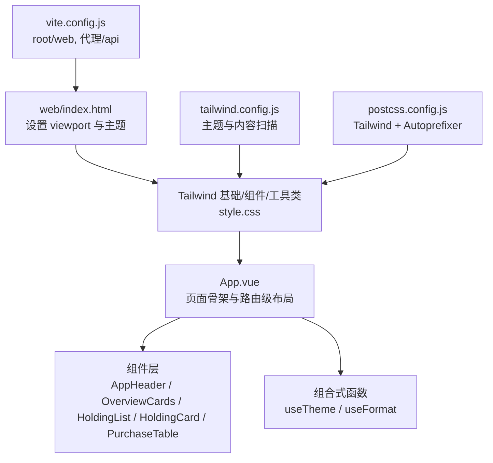
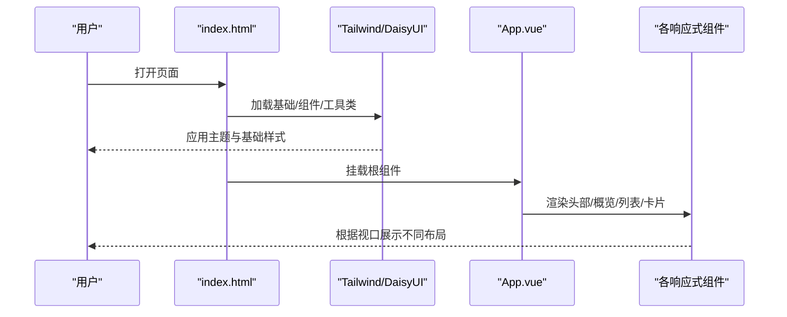
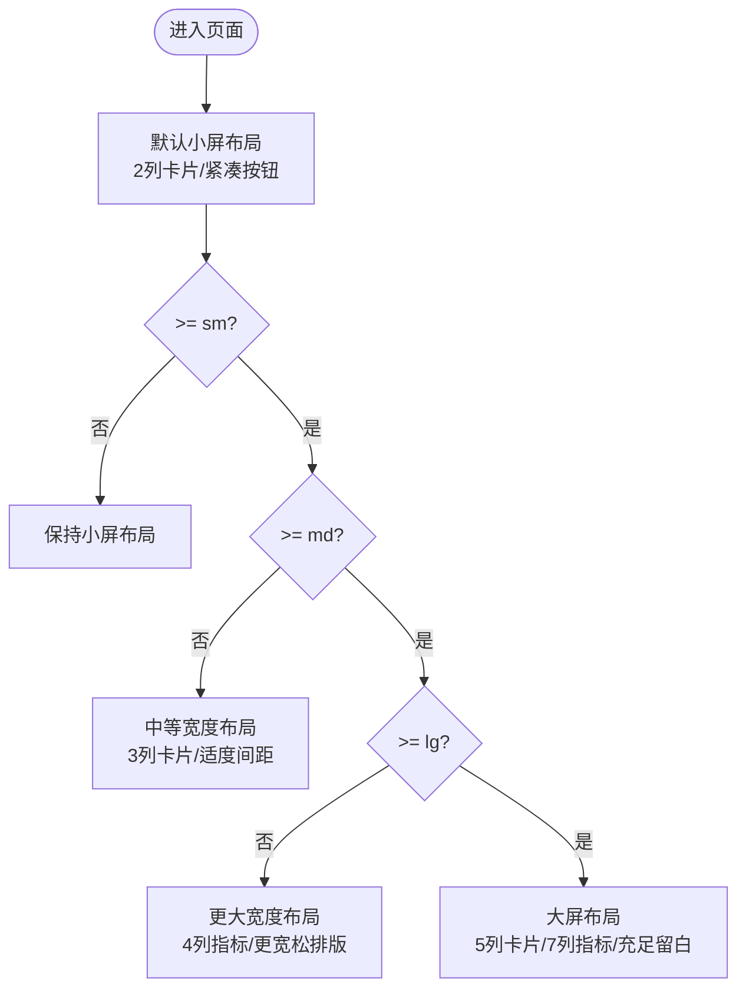
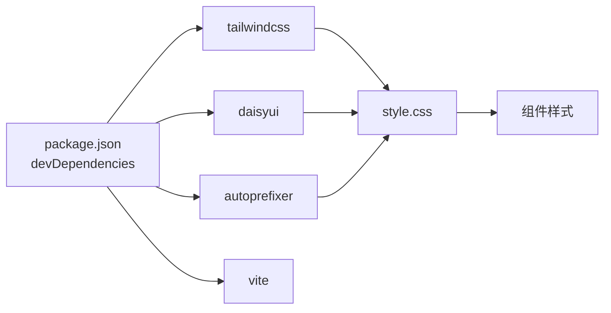

# 响应式设计

<cite>
**本文引用的文件**
- [tailwind.config.js](file://tailwind.config.js)
- [postcss.config.js](file://postcss.config.js)
- [vite.config.js](file://vite.config.js)
- [web/index.html](file://web/index.html)
- [web/src/style.css](file://web/src/style.css)
- [web/src/App.vue](file://web/src/App.vue)
- [web/src/components/AppHeader.vue](file://web/src/components/AppHeader.vue)
- [web/src/components/OverviewCards.vue](file://web/src/components/OverviewCards.vue)
- [web/src/components/HoldingList.vue](file://web/src/components/HoldingList.vue)
- [web/src/components/HoldingCard.vue](file://web/src/components/HoldingCard.vue)
- [web/src/components/PurchaseTable.vue](file://web/src/components/PurchaseTable.vue)
- [web/src/composables/useTheme.js](file://web/src/composables/useTheme.js)
- [web/src/composables/useFormat.js](file://web/src/composables/useFormat.js)
- [package.json](file://package.json)
</cite>

## 目录
1. [简介](#简介)
2. [项目结构](#项目结构)
3. [核心组件](#核心组件)
4. [架构总览](#架构总览)
5. [详细组件分析](#详细组件分析)
6. [依赖关系分析](#依赖关系分析)
7. [性能与可访问性优化](#性能与可访问性优化)
8. [故障排查指南](#故障排查指南)
9. [结论](#结论)
10. [附录：断点与最佳实践清单](#附录：断点与最佳实践清单)

## 简介
本文件聚焦 Stock Advisor 的响应式设计实现，围绕“移动端优先”的理念，系统梳理 Tailwind CSS 断点体系、媒体查询最佳实践、不同屏幕尺寸下的布局适配（网格、弹性、流式）、触摸交互优化、字体与间距自适应、以及性能优化策略。文档同时提供具体组件示例与测试方法，确保在各类设备上获得一致的用户体验。

## 项目结构
前端基于 Vue 3 + Vite，样式采用 Tailwind CSS 与 DaisyUI 主题系统；构建入口位于 web/ 子目录，由根目录 tailwind.config.js 统一配置主题与内容扫描范围。关键要点：
- 移动端优先：通过 viewport meta 启用缩放基准，结合 Tailwind 的响应式前缀在不同断点下逐步增强布局。
- 主题与暗色模式：通过 data-theme 与 class="dark" 切换主题，DaisyUI 自动应用对应主题变量。
- 构建与代理：Vite 开发服务器绑定 0.0.0.0，便于局域网设备调试；/api 请求代理至本地后端。

图表来源
- [web/index.html:1-13](file://web/index.html#L1-L13)
- [web/src/style.css:1-34](file://web/src/style.css#L1-L34)
- [web/src/App.vue:132-197](file://web/src/App.vue#L132-L197)
- [tailwind.config.js:1-54](file://tailwind.config.js#L1-L54)
- [postcss.config.js:1-7](file://postcss.config.js#L1-L7)
- [vite.config.js:1-26](file://vite.config.js#L1-L26)

章节来源
- [web/index.html:1-13](file://web/index.html#L1-L13)
- [tailwind.config.js:1-54](file://tailwind.config.js#L1-L54)
- [postcss.config.js:1-7](file://postcss.config.js#L1-L7)
- [vite.config.js:1-26](file://vite.config.js#L1-L26)

## 核心组件
- AppHeader：顶部导航与操作区，使用粘性定位与毛玻璃背景，按钮在小屏紧凑排列，在大屏增加间距。
- OverviewCards：概览指标卡片，采用响应式网格，从 2 列逐步扩展到 5 列，保证信息密度随宽度提升。
- HoldingList：持仓列表容器，垂直堆叠卡片，空态提示清晰。
- HoldingCard：单条持仓卡片，内部指标区域使用响应式网格，小屏 2 列，中屏 4 列，大屏 7 列；支持展开/收起交易明细。
- PurchaseTable：交易明细表格，外层包裹横向滚动容器，避免小屏溢出。

章节来源
- [web/src/components/AppHeader.vue:19-64](file://web/src/components/AppHeader.vue#L19-L64)
- [web/src/components/OverviewCards.vue:13-41](file://web/src/components/OverviewCards.vue#L13-L41)
- [web/src/components/HoldingList.vue:16-36](file://web/src/components/HoldingList.vue#L16-L36)
- [web/src/components/HoldingCard.vue:57-161](file://web/src/components/HoldingCard.vue#L57-L161)
- [web/src/components/PurchaseTable.vue:13-79](file://web/src/components/PurchaseTable.vue#L13-L79)

## 架构总览
响应式架构由三层构成：
- 基础层：viewport、主题与全局样式，确保缩放与色彩一致性。
- 布局层：Tailwind 响应式网格与弹性布局，按断点调整列数、间距与排版。
- 交互层：触摸友好的按钮尺寸、折叠面板、横向滚动表格，保障小屏可用性。

图表来源
- [web/index.html:1-13](file://web/index.html#L1-L13)
- [web/src/style.css:1-34](file://web/src/style.css#L1-L34)
- [web/src/App.vue:132-197](file://web/src/App.vue#L132-L197)
- [web/src/components/OverviewCards.vue:13-41](file://web/src/components/OverviewCards.vue#L13-L41)
- [web/src/components/HoldingCard.vue:57-161](file://web/src/components/HoldingCard.vue#L57-L161)

## 详细组件分析

### 移动端优先与断点体系
- 移动端优先：默认样式针对小屏设计，通过 sm/md/lg/xl 等断点逐步增强布局与信息密度。
- 断点使用示例：
  - 概览卡片：小屏 2 列，中屏 3 列，大屏 5 列，充分利用空间。
  - 持仓卡片指标：小屏 2 列，中屏 4 列，大屏 7 列，保证可读性与数据密度平衡。
  - 表格：外层容器允许横向滚动，避免换行导致的信息丢失。

图表来源
- [web/src/components/OverviewCards.vue:13-41](file://web/src/components/OverviewCards.vue#L13-L41)
- [web/src/components/HoldingCard.vue:91-149](file://web/src/components/HoldingCard.vue#L91-L149)

章节来源
- [web/src/components/OverviewCards.vue:13-41](file://web/src/components/OverviewCards.vue#L13-L41)
- [web/src/components/HoldingCard.vue:91-149](file://web/src/components/HoldingCard.vue#L91-L149)

### 网格系统与弹性布局
- 网格系统：使用 Tailwind 的 grid-cols-* 与 gap-* 控制列数与间距，配合断点实现渐进式布局。
- 弹性布局：头部与卡片头使用 flex 进行对齐与分布，gap 控制元素间距，wrap 处理多标签过滤区的换行。
- 流式布局：表格使用 overflow-x-auto 包裹，确保小屏可水平滚动查看完整数据。

章节来源
- [web/src/components/AppHeader.vue:19-64](file://web/src/components/AppHeader.vue#L19-L64)
- [web/src/components/OverviewCards.vue:13-41](file://web/src/components/OverviewCards.vue#L13-L41)
- [web/src/components/HoldingCard.vue:57-161](file://web/src/components/HoldingCard.vue#L57-L161)
- [web/src/components/PurchaseTable.vue:13-79](file://web/src/components/PurchaseTable.vue#L13-L79)

### 触摸交互优化与手势支持
- 按钮尺寸：使用 btn-sm/btn-xs 等尺寸类，保证手指点击热区足够大。
- 折叠面板：HoldingCard 的展开/收起通过按钮切换 expanded 状态，减少小屏信息过载。
- 输入框与键盘事件：编辑告警阈值时支持回车保存、Esc 取消，提升键盘可达性。
- 横向滚动：表格容器允许滑动浏览，符合移动端习惯。

章节来源
- [web/src/components/AppHeader.vue:34-60](file://web/src/components/AppHeader.vue#L34-L60)
- [web/src/components/HoldingCard.vue:18-55](file://web/src/components/HoldingCard.vue#L18-L55)
- [web/src/components/PurchaseTable.vue:13-79](file://web/src/components/PurchaseTable.vue#L13-L79)

### 字体大小、间距与视觉层次
- 字体层级：标题使用 text-xl 与 font-semibold，正文使用 text-xs/text-sm，数字使用 tabular-nums 保证对齐。
- 间距控制：使用 p-4/m-*/gap-* 等实用类，保持呼吸感与节奏。
- 颜色与对比度：通过 DaisyUI 主题变量与 profitCls 函数统一收益红绿语义，确保可读性。

章节来源
- [web/src/components/AppHeader.vue:22-33](file://web/src/components/AppHeader.vue#L22-L33)
- [web/src/components/OverviewCards.vue:13-41](file://web/src/components/OverviewCards.vue#L13-L41)
- [web/src/composables/useFormat.js:34-41](file://web/src/composables/useFormat.js#L34-L41)

### 主题与暗色模式
- 主题切换：通过 useTheme 组合式函数读写 localStorage，并同步 documentElement 的 data-theme 与 class="dark"。
- 主题定义：tailwind.config.js 中配置 stocklight/stockdark 两套主题，DaisyUI 自动应用。
- 默认主题：index.html 指定 data-theme="stockdark"，首次加载即深色模式。

章节来源
- [web/src/composables/useTheme.js:1-26](file://web/src/composables/useTheme.js#L1-L26)
- [tailwind.config.js:13-52](file://tailwind.config.js#L13-L52)
- [web/index.html:1-13](file://web/index.html#L1-L13)

## 依赖关系分析
- 样式依赖：style.css 引入 Tailwind 基础/组件/工具类；postcss.config.js 启用 Tailwind 与 Autoprefixer。
- 主题依赖：tailwind.config.js 声明 content 路径以扫描 web/index.html 与 web/src 下的 Vue/JS 文件，确保按需生成样式。
- 构建依赖：vite.config.js 将 root 指向 web，构建产物输出到 ../dist，并在开发环境代理 /api 到本地后端。

图表来源
- [package.json:22-30](file://package.json#L22-L30)
- [postcss.config.js:1-7](file://postcss.config.js#L1-L7)
- [web/src/style.css:1-34](file://web/src/style.css#L1-L34)

章节来源
- [package.json:22-30](file://package.json#L22-L30)
- [postcss.config.js:1-7](file://postcss.config.js#L1-L7)
- [web/src/style.css:1-34](file://web/src/style.css#L1-L34)

## 性能与可访问性优化
- 图片懒加载：当前代码未直接包含图片资源，建议在新增图片时使用 loading="lazy" 与合适的宽高占位，避免布局抖动。
- 资源压缩：Vite 构建默认对 JS/CSS 进行压缩；Tailwind 通过 content 扫描仅生成使用的样式，减小体积。
- 首屏性能：使用最小必要样式与组件，避免过度嵌套；表格使用横向滚动而非强制换行，降低重排成本。
- 可访问性：为按钮添加 title 属性，提供语义化文本；数字使用 tabular-nums 提升可读性；主题切换保留用户偏好。

章节来源
- [vite.config.js:10-13](file://vite.config.js#L10-L13)
- [tailwind.config.js:4-12](file://tailwind.config.js#L4-L12)
- [web/src/components/AppHeader.vue:36-54](file://web/src/components/AppHeader.vue#L36-L54)
- [web/src/components/HoldingCard.vue:91-149](file://web/src/components/HoldingCard.vue#L91-L149)

## 故障排查指南
- 样式未生效：检查 tailwind.config.js 的 content 是否覆盖 web/index.html 与 web/src/**/*.{vue,js}；确认 postcss.config.js 已启用 tailwindcss 与 autoprefixer。
- 主题不切换：确认 useTheme 正确写入 localStorage 并更新 documentElement 的 data-theme 与 class；检查 index.html 的初始 data-theme。
- 表格在小屏溢出：确保表格外层容器使用 overflow-x-auto；避免固定宽度导致无法滚动。
- 构建产物缺失：确认 vite.config.js 的 root 指向 web，outDir 指向 ../dist；构建后由后端服务托管 dist 目录。

章节来源
- [tailwind.config.js:4-12](file://tailwind.config.js#L4-L12)
- [postcss.config.js:1-7](file://postcss.config.js#L1-L7)
- [web/src/composables/useTheme.js:5-21](file://web/src/composables/useTheme.js#L5-L21)
- [web/src/components/PurchaseTable.vue:13-79](file://web/src/components/PurchaseTable.vue#L13-L79)
- [vite.config.js:7-13](file://vite.config.js#L7-L13)

## 结论
本项目以移动端优先为核心，借助 Tailwind 的响应式网格与弹性布局，在不同屏幕尺寸下实现了良好的信息密度与可读性。通过 DaisyUI 主题系统统一视觉语言，结合 useTheme 实现暗色模式切换。表格横向滚动与折叠面板提升了小屏可用性。建议后续在新增图片时加入懒加载与占位，进一步优化首屏性能与用户体验。

## 附录：断点与最佳实践清单
- 断点使用
  - 概览卡片：grid-cols-2 → sm:grid-cols-3 → lg:grid-cols-5
  - 持仓指标：grid-cols-2 → sm:grid-cols-4 → lg:grid-cols-7
  - 头部按钮：flex-wrap + gap 控制换行与间距
- 媒体查询最佳实践
  - 优先使用 Tailwind 响应式前缀，避免手写 @media
  - 小屏默认简洁，逐步增强布局与密度
  - 表格使用横向滚动，避免强制换行破坏阅读
- 触摸交互
  - 按钮尺寸不小于 btn-sm，热区足够
  - 折叠面板减少信息过载
  - 输入框支持回车/Esc 快捷操作
- 字体与间距
  - 标题/正文/数字层级清晰
  - 使用 tabular-nums 对齐数字
  - 合理留白，避免拥挤
- 性能
  - 使用 content 扫描仅生成必要样式
  - 图片懒加载与占位
  - 构建产物压缩

章节来源
- [web/src/components/OverviewCards.vue:13-41](file://web/src/components/OverviewCards.vue#L13-L41)
- [web/src/components/HoldingCard.vue:91-149](file://web/src/components/HoldingCard.vue#L91-L149)
- [web/src/components/AppHeader.vue:19-64](file://web/src/components/AppHeader.vue#L19-L64)
- [tailwind.config.js:4-12](file://tailwind.config.js#L4-L12)