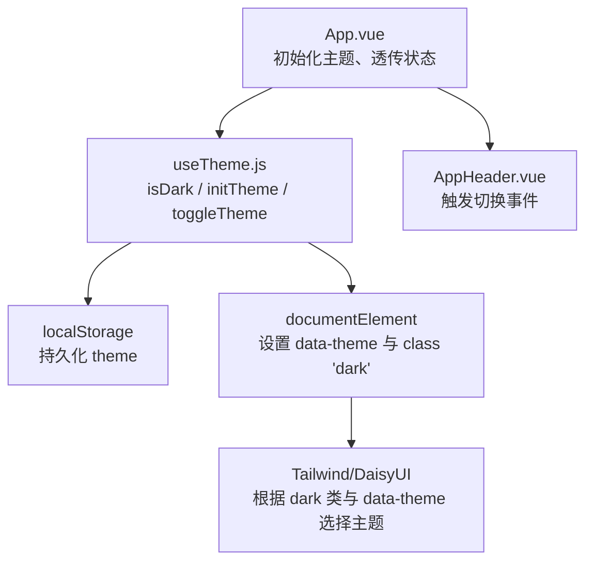
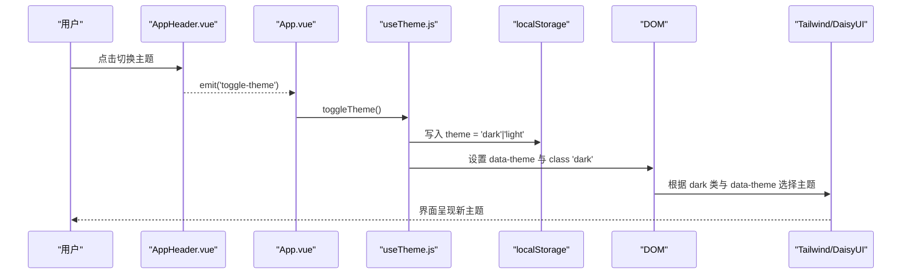
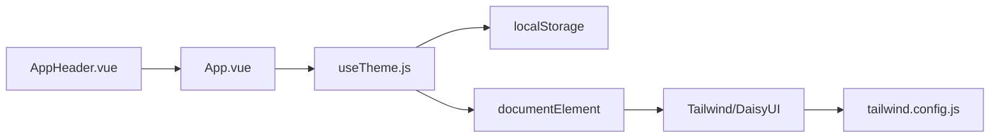

# 主题状态管理

<cite>
**本文引用的文件**
- [web/src/composables/useTheme.js](file://web/src/composables/useTheme.js)
- [web/src/App.vue](file://web/src/App.vue)
- [web/src/components/AppHeader.vue](file://web/src/components/AppHeader.vue)
- [tailwind.config.js](file://tailwind.config.js)
- [web/src/style.css](file://web/src/style.css)
- [web/src/main.js](file://web/src/main.js)
</cite>

## 目录
1. [简介](#简介)
2. [项目结构](#项目结构)
3. [核心组件](#核心组件)
4. [架构总览](#架构总览)
5. [详细组件分析](#详细组件分析)
6. [依赖关系分析](#依赖关系分析)
7. [性能考量](#性能考量)
8. [故障排查指南](#故障排查指南)
9. [结论](#结论)
10. [附录：在Vue组件中集成主题的使用示例](#附录在vue组件中集成主题的使用示例)

## 简介
本文件围绕 Stock Advisor 的前端主题状态管理进行系统化说明，重点解析 useTheme 组合式函数的实现原理与数据流，涵盖以下方面：
- 主题切换逻辑（深色/浅色）
- 本地存储持久化策略
- 动态样式应用机制（Tailwind + DaisyUI）
- 响应式更新机制
- 主题配置的读取与保存
- 在组件中使用主题状态的方法
- 主题扩展与自定义主题的实践指南

## 项目结构
Stock Advisor 前端位于 web 目录，采用 Vue 3 + Vite + TailwindCSS + DaisyUI。主题能力由组合式函数 useTheme 提供，并在根组件 App.vue 中初始化与应用；头部组件 AppHeader.vue 暴露主题切换按钮；样式层通过 Tailwind 的 class 模式与 DaisyUI 的命名主题协同工作。

图表来源
- [web/src/App.vue:1-15](file://web/src/App.vue#L1-L15)
- [web/src/composables/useTheme.js:1-25](file://web/src/composables/useTheme.js#L1-L25)
- [web/src/components/AppHeader.vue:1-64](file://web/src/components/AppHeader.vue#L1-L64)
- [tailwind.config.js:1-54](file://tailwind.config.js#L1-L54)

章节来源
- [web/src/App.vue:1-15](file://web/src/App.vue#L1-L15)
- [web/src/composables/useTheme.js:1-25](file://web/src/composables/useTheme.js#L1-L25)
- [web/src/components/AppHeader.vue:1-64](file://web/src/components/AppHeader.vue#L1-L64)
- [tailwind.config.js:1-54](file://tailwind.config.js#L1-L54)

## 核心组件
- useTheme 组合式函数：维护 isDark 响应式状态，负责从 localStorage 读取初始值、切换时写入 localStorage，并同步到 DOM（data-theme 与 class）。
- App.vue：在挂载时调用 initTheme 完成初始化，将 isDark 与 toggleTheme 传递给子组件，作为全局主题入口。
- AppHeader.vue：提供“切换主题”按钮，向父组件发出事件以触发切换。
- Tailwind/DaisyUI 配置：定义 stocklight 与 stockdark 两套主题，并通过 darkMode: 'class' 与 darkTheme 配合 <html class="dark"> 自动应用深色主题。

章节来源
- [web/src/composables/useTheme.js:1-25](file://web/src/composables/useTheme.js#L1-L25)
- [web/src/App.vue:1-15](file://web/src/App.vue#L1-L15)
- [web/src/components/AppHeader.vue:1-64](file://web/src/components/AppHeader.vue#L1-L64)
- [tailwind.config.js:1-54](file://tailwind.config.js#L1-L54)

## 架构总览
主题系统的关键交互如下：
- 页面加载时，App.vue 调用 initTheme，从 localStorage 恢复上次主题，并应用到 DOM。
- 用户点击切换按钮时，AppHeader.vue 触发事件，App.vue 调用 toggleTheme，更新 isDark、持久化到 localStorage，并刷新 DOM。
- DOM 上的 data-theme 与 class='dark' 驱动 Tailwind/DaisyUI 渲染对应主题色板。

图表来源
- [web/src/components/AppHeader.vue:34-40](file://web/src/components/AppHeader.vue#L34-L40)
- [web/src/App.vue:15-15](file://web/src/App.vue#L15-L15)
- [web/src/App.vue:121-125](file://web/src/App.vue#L121-L125)
- [web/src/composables/useTheme.js:17-21](file://web/src/composables/useTheme.js#L17-L21)
- [tailwind.config.js:6-7](file://tailwind.config.js#L6-L7)
- [tailwind.config.js:13-52](file://tailwind.config.js#L13-L52)

## 详细组件分析

### useTheme 组合式函数
- 状态与职责
  - isDark：响应式布尔值，表示当前是否为深色模式。
  - initTheme：从 localStorage 读取 theme，若不存在则默认深色；随后调用 applyTheme 应用主题。
  - toggleTheme：翻转 isDark，写入 localStorage，并调用 applyTheme。
  - applyTheme：设置 document.documentElement.dataset.theme 为 'stockdark' 或 'stocklight'，同时切换 <html> 的 class 'dark'。
- 数据流
  - 初始化：initTheme → 读取 localStorage → 设置 isDark → applyTheme → DOM 变更 → 样式生效。
  - 切换：toggleTheme → 更新 isDark → 写入 localStorage → applyTheme → DOM 变更 → 样式生效。
- 复杂度
  - 时间复杂度：O(1)，均为常量级操作。
  - 空间复杂度：O(1)，仅维护一个布尔状态与少量局部变量。
- 错误处理
  - 未捕获异常场景较少；若 localStorage 不可用，建议在生产环境增加 try/catch 保护（当前实现未包含）。
- 优化点
  - 可考虑使用 sessionStorage 或更健壮的存储封装。
  - 可在应用启动前预加载主题以避免闪烁（当前在 onMounted 中初始化，存在极小概率闪烁）。

章节来源
- [web/src/composables/useTheme.js:1-25](file://web/src/composables/useTheme.js#L1-L25)

### App.vue 中的主题集成
- 在 onMounted 生命周期中调用 initTheme，确保首次渲染前已应用主题。
- 将 isDark 与 toggleTheme 通过 props/events 传递给 AppHeader.vue，实现父子联动。
- 其他业务逻辑与主题无关，保持关注点分离。

章节来源
- [web/src/App.vue:1-15](file://web/src/App.vue#L1-L15)
- [web/src/App.vue:121-125](file://web/src/App.vue#L121-L125)
- [web/src/App.vue:132-149](file://web/src/App.vue#L132-L149)

### AppHeader.vue 的主题交互
- 接收 isDark 作为 prop，用于按钮文案与提示。
- 点击按钮时 emit('toggle-theme')，由父组件统一处理状态变更。
- 按钮图标随 isDark 变化，提升用户体验。

章节来源
- [web/src/components/AppHeader.vue:1-64](file://web/src/components/AppHeader.vue#L1-L64)

### Tailwind 与 DaisyUI 主题配置
- darkMode: 'class'：通过给 <html> 添加 class 'dark' 来启用深色主题。
- daisyui themes：定义 stocklight 与 stockdark 两套主题，分别覆盖 base-*、primary、success、warning、error 等语义化颜色。
- darkTheme: 'stockdark'：当检测到 <html class="dark"> 时，自动应用 stockdark 主题。
- 与 useTheme 的配合：applyTheme 同时设置 data-theme 与 class 'dark'，确保 DaisyUI 正确识别并应用主题。

章节来源
- [tailwind.config.js:1-54](file://tailwind.config.js#L1-L54)

### 样式层与滚动条适配
- style.css 引入 Tailwind 基础、组件与工具类。
- 对滚动条进行细粒度定制，使其在不同主题下具备良好可读性。
- 对按钮文字与背景做兼容处理，保证浅色背景下白字可见。

章节来源
- [web/src/style.css:1-34](file://web/src/style.css#L1-L34)

## 依赖关系分析
- 模块耦合
  - App.vue 依赖 useTheme 提供的状态与方法，并通过事件与 AppHeader.vue 解耦交互。
  - useTheme 仅依赖浏览器 API（localStorage、DOM），无外部库耦合。
  - 样式层通过 Tailwind/DaisyUI 配置与 DOM 状态联动，无运行时 JS 依赖。
- 直接依赖
  - App.vue → useTheme.js
  - AppHeader.vue → App.vue（事件）
  - useTheme.js → localStorage、DOM
  - Tailwind/DaisyUI → tailwind.config.js
- 潜在循环依赖
  - 无循环依赖。
- 外部依赖
  - Vue 3 响应式系统（ref）
  - TailwindCSS + DaisyUI

图表来源
- [web/src/App.vue:1-15](file://web/src/App.vue#L1-L15)
- [web/src/composables/useTheme.js:1-25](file://web/src/composables/useTheme.js#L1-L25)
- [web/src/components/AppHeader.vue:1-64](file://web/src/components/AppHeader.vue#L1-L64)
- [tailwind.config.js:1-54](file://tailwind.config.js#L1-L54)

章节来源
- [web/src/App.vue:1-15](file://web/src/App.vue#L1-L15)
- [web/src/composables/useTheme.js:1-25](file://web/src/composables/useTheme.js#L1-L25)
- [web/src/components/AppHeader.vue:1-64](file://web/src/components/AppHeader.vue#L1-L64)
- [tailwind.config.js:1-54](file://tailwind.config.js#L1-L54)

## 性能考量
- 初始化时机：在 onMounted 中初始化主题，避免阻塞首屏关键渲染；若需消除闪烁，可在 HTML 模板中内联脚本提前设置主题。
- 存储读写：每次切换均写入 localStorage，频率低，影响可忽略。
- DOM 操作：仅修改 data-theme 与 class，开销极低。
- 样式计算：Tailwind 编译后生成静态 CSS，运行时无额外计算成本。

[本节为通用指导，不直接分析具体文件]

## 故障排查指南
- 主题未生效
  - 检查 <html> 是否包含 class 'dark'，以及 data-theme 是否正确设置为 'stockdark' 或 'stocklight'。
  - 确认 Tailwind 构建产物已包含相关类名与 DaisyUI 主题。
- 本地存储异常
  - 若 localStorage 被禁用或清除，应用会回退到默认深色主题。
  - 建议在生产环境对 localStorage 访问增加 try/catch 并降级处理。
- 样式错乱
  - 检查 style.css 中的全局样式是否与主题冲突。
  - 确认 Tailwind 配置 content 路径正确，确保生成的样式覆盖所需组件。

章节来源
- [web/src/composables/useTheme.js:5-8](file://web/src/composables/useTheme.js#L5-L8)
- [tailwind.config.js:6-7](file://tailwind.config.js#L6-L7)
- [tailwind.config.js:13-52](file://tailwind.config.js#L13-L52)
- [web/src/style.css:1-34](file://web/src/style.css#L1-L34)

## 结论
Stock Advisor 的主题系统以 useTheme 为核心，结合 Tailwind 的 class 模式与 DaisyUI 的命名主题，实现了简洁、可扩展且易于维护的深色/浅色模式切换。通过 localStorage 持久化用户偏好，保证了跨会话的一致性。整体设计清晰、耦合度低，便于后续扩展更多主题或接入系统级主题检测。

[本节为总结性内容，不直接分析具体文件]

## 附录：在Vue组件中集成主题的使用示例
以下示例展示如何在任意 Vue 组件中集成主题功能（以伪代码形式描述步骤，不包含具体源码片段）：
- 引入 useTheme
  - 从 composables/useTheme.js 导入 useTheme。
- 获取状态与方法
  - 调用 useTheme() 获取 isDark、initTheme、toggleTheme。
- 在组件生命周期中初始化
  - 在 onMounted 中调用 initTheme，确保主题在首次渲染前应用。
- 绑定切换事件
  - 在按钮点击事件中调用 toggleTheme。
- 条件渲染或样式控制
  - 使用 isDark 控制组件内的显示逻辑或动态类名。

章节来源
- [web/src/composables/useTheme.js:1-25](file://web/src/composables/useTheme.js#L1-L25)
- [web/src/App.vue:1-15](file://web/src/App.vue#L1-L15)
- [web/src/App.vue:121-125](file://web/src/App.vue#L121-L125)