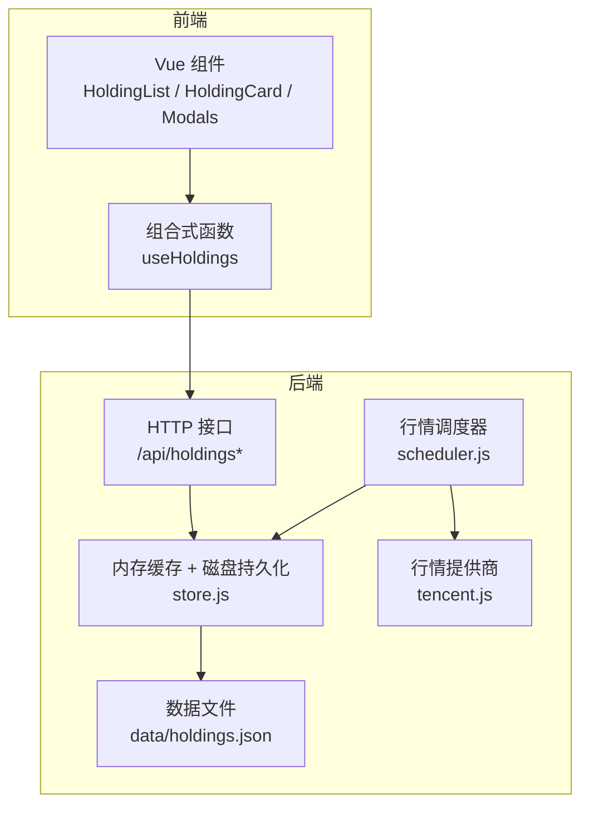
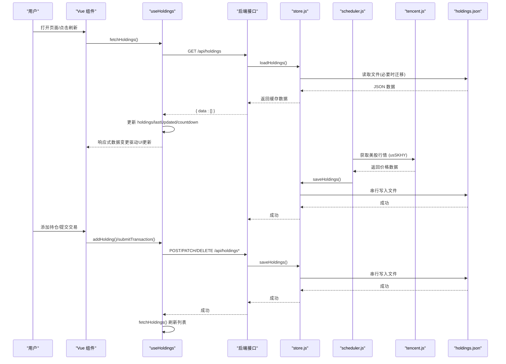
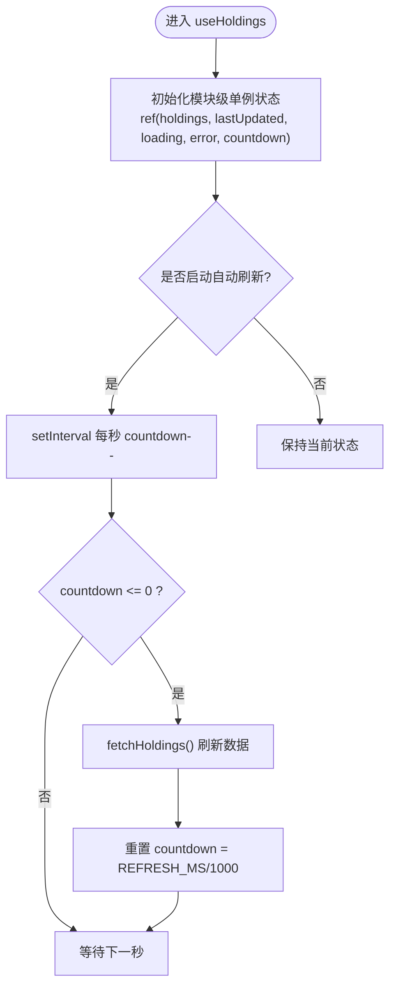
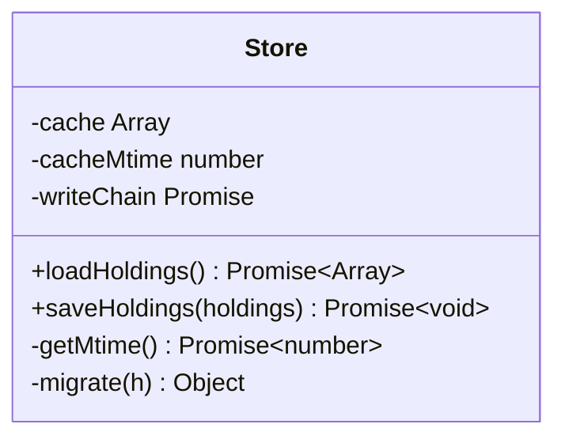
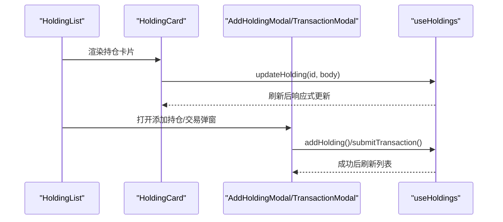
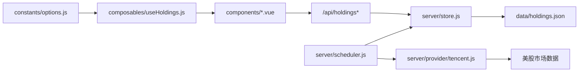

# 持仓状态管理

<cite>
**本文引用的文件**
- [useHoldings.js](file://web/src/composables/useHoldings.js)
- [store.js](file://server/store.js)
- [holdings.json](file://data/holdings.json)
- [HoldingList.vue](file://web/src/components/HoldingList.vue)
- [AddHoldingModal.vue](file://web/src/components/AddHoldingModal.vue)
- [HoldingCard.vue](file://web/src/components/HoldingCard.vue)
- [TransactionModal.vue](file://web/src/components/TransactionModal.vue)
- [options.js](file://web/src/constants/options.js)
- [index.js](file://server/index.js)
- [scheduler.js](file://server/scheduler.js)
- [tencent.js](file://server/provider/tencent.js)
- [useFormat.js](file://web/src/composables/useFormat.js)
</cite>

## 更新摘要
**变更内容**
- 新增美股持仓支持，包括SK海力士（SKHY）的完整实现
- 扩展地区标识系统，支持'msg'和'us'两种美股标识格式
- 完善价格字段处理逻辑，支持美股市场的currentPrice、prevClose等字段
- 更新前端组件以支持美股持仓的显示和操作
- 增强后端调度器对美股行情的获取和处理能力

## 目录
1. [简介](#简介)
2. [项目结构](#项目结构)
3. [核心组件](#核心组件)
4. [架构总览](#架构总览)
5. [详细组件分析](#详细组件分析)
6. [美股持仓支持详解](#美股持仓支持详解)
7. [依赖关系分析](#依赖关系分析)
8. [性能考量](#性能考量)
9. [故障排查指南](#故障排查指南)
10. [结论](#结论)
11. [附录：使用模式与示例路径](#附录使用模式与示例路径)

## 简介
本文件围绕 Stock Advisor 的"持仓状态管理"展开，重点解析前端组合式函数 useHoldings 的核心实现，包括模块级单例状态设计、响应式数据管理、自动刷新机制；并详细说明持仓数据的 CRUD（添加持仓、更新配置、交易记录管理）、计算属性（总成本、总市值、持有盈亏、今日盈亏）的实现与使用方式。同时涵盖错误处理、加载状态管理与倒计时自动刷新功能，并提供具体代码示例路径，帮助开发者正确使用该组合式函数进行持仓数据管理。

**更新** 本次更新新增了美股持仓支持，特别是SK海力士（SKHY）的完整实现，包括新的地区标识支持和相应的价格字段处理。

## 项目结构
Stock Advisor 采用前后端分离的轻量架构：
- 前端（Vue 3 + Vite）：通过组合式函数 useHoldings 集中管理持仓状态、计算汇总指标、发起 API 请求、维护自动刷新计时器。
- 后端（Node.js）：提供 RESTful 接口读写 data/holdings.json，并在内存中缓存数据，保证调度器与 HTTP 接口共享同一份数据，避免并发写冲突。
- 数据持久化：data/holdings.json 存储持仓明细与多次买入记录，支持旧版扁平结构的迁移。



**图表来源**
- [useHoldings.js:1-154](file://web/src/composables/useHoldings.js#L1-L154)
- [store.js:1-71](file://server/store.js#L1-L71)
- [scheduler.js:72-103](file://server/scheduler.js#L72-L103)
- [tencent.js:1-41](file://server/provider/tencent.js#L1-L41)
- [holdings.json:1-462](file://data/holdings.json#L1-L462)

## 核心组件
- 模块级单例状态：useHoldings 在模块作用域内定义 ref 变量 holdings、lastUpdated、loading、error、countdown，所有调用方共享同一份响应式数据，确保多组件间状态一致。
- 自动刷新机制：基于 setInterval 的倒计时 tick，每秒递减 countdown，归零时触发 fetchHoldings，刷新后重置倒计时，避免多定时器漂移。
- 计算属性：totalCost、totalMarket、totalHoldingProfit、totalTodayProfit 对 holdings 进行聚合计算，随数据变化自动更新。
- 统一写操作：addHolding、submitTransaction、savePurchase、deletePurchase、updateHolding 均通过 fetch 调用后端接口，成功后统一调用 fetchHoldings 刷新列表。
- 错误与加载状态：loading/error 在请求前设置，finally 中关闭 loading，异常信息写入 error，供 UI 展示。

**章节来源**
- [useHoldings.js:4-154](file://web/src/composables/useHoldings.js#L4-L154)
- [options.js:31-33](file://web/src/constants/options.js#L31-L33)

## 架构总览
以下序列图展示了从用户交互到数据持久化的完整流程，包括读取、新增、交易记录提交等关键路径。



**图表来源**
- [useHoldings.js:15-130](file://web/src/composables/useHoldings.js#L15-L130)
- [store.js:40-70](file://server/store.js#L40-L70)
- [scheduler.js:72-103](file://server/scheduler.js#L72-L103)
- [tencent.js:1-41](file://server/provider/tencent.js#L1-L41)
- [holdings.json:1-462](file://data/holdings.json#L1-L462)

## 详细组件分析

### 组合式函数 useHoldings：模块级单例与响应式状态
- 模块级单例：holdings、lastUpdated、loading、error、countdown 在模块顶层定义，所有组件通过 useHoldings() 获取同一引用，天然实现跨组件状态同步。
- 自动刷新：startAutoRefresh 启动单一定时器，每秒递减 countdown，当 countdown <= 0 时调用 fetchHoldings；stopAutoRefresh 清理定时器，防止重复创建。
- 数据获取：fetchHoldings 设置 loading 与清空 error，调用 /api/holdings，成功后更新 holdings、lastUpdated，并重置 countdown。
- 计算属性：totalCost、totalMarket、totalHoldingProfit、totalTodayProfit 使用 reduce 聚合 holdings 中的数值字段，空值或无效值以 0 处理，保证稳健性。
- 写操作封装：
  - addHolding：POST /api/holdings，成功后刷新列表。
  - submitTransaction：POST /api/holdings/{id}/transactions，提交 type/price/quantity/date，成功后刷新列表。
  - savePurchase：PATCH/POST /api/holdings/{id}/purchases{/:pid}，支持新增与修改买入记录，成功后刷新列表。
  - deletePurchase：DELETE /api/holdings/{id}/purchases/{id}，二次确认后删除，成功后刷新列表。
  - updateHolding：PATCH /api/holdings/{id}，更新持仓级字段（如日涨跌告警阈值），成功后刷新列表。
- 导出：暴露 holdings、lastUpdated、loading、error、countdown、计算属性以及全部操作方法，供组件按需引入。



**图表来源**
- [useHoldings.js:10-50](file://web/src/composables/useHoldings.js#L10-L50)
- [options.js:31-33](file://web/src/constants/options.js#L31-L33)

**章节来源**
- [useHoldings.js:1-154](file://web/src/composables/useHoldings.js#L1-L154)
- [options.js:31-33](file://web/src/constants/options.js#L31-L33)

### 后端存储 store.js：内存缓存与串行写盘
- 内存缓存：loadHoldings 首次或文件 mtime 变化时从 holdings.json 读取并解析，支持旧版扁平结构迁移为 purchases 数组模型，之后复用内存缓存。
- 串行写盘：saveHoldings 通过 Promise 链串行写入文件，避免调度器与 HTTP 接口并发写导致覆盖；写盘后更新 cacheMtime，避免误判外部改动。
- 数据迁移：migrate 将旧版 buyPrice/buyQuantity/snapshotDate 等字段转换为 purchases 数组，包含 targetProfitRate/stopLossRate，确保数据结构一致性。



**图表来源**
- [store.js:1-71](file://server/store.js#L1-L71)

**章节来源**
- [store.js:1-71](file://server/store.js#L1-L71)

### 数据模型 holdings.json：多次买入记录与持仓汇总
- 每个持仓对象包含基础信息（name/code/region/type/strategy/status）、价格与收益字段（currentPrice/prevClose/cost/avgCost/holdingProfit/todayProfit 等）、策略参数（targetProfitRate/stopLossRate/refillDropRate/refillPrice）、时间戳（lastUpdated/snapshotDate）与触发状态（triggerState/notifiedAt）。
- purchases 数组记录多次买入（buyPrice/buyQuantity/buyTime/targetProfitRate/stopLossRate），sells 数组记录卖出记录（sellPrice/sellQuantity/sellDate/costPrice/profit/returnRate）。
- **更新** 新增美股持仓支持，包含SK海力士（SKHY）的完整数据结构，region字段支持"美股"标识。

**章节来源**
- [holdings.json:1-462](file://data/holdings.json#L1-L462)

### 前端组件集成：列表、卡片与弹窗
- HoldingList.vue：接收 holdings 数组，渲染 HoldingCard 列表，透传事件（open-txn/open-add-buy/edit-buy/delete-buy）。
- HoldingCard.vue：展示单个持仓的汇总指标（市值/数量、成本/现价、今日收益/收益率、持仓收益/收益率、止盈止损、补仓参数、日涨跌告警），支持展开购买明细（PurchaseTable），支持行内编辑日涨跌告警阈值并通过 updateHolding 保存。
- AddHoldingModal.vue：表单收集新持仓信息，调用 addHolding 提交，成功后关闭弹窗。
- TransactionModal.vue：支持买入/卖出交易记录提交，调用 submitTransaction，成功后关闭弹窗。



**图表来源**
- [HoldingList.vue:1-36](file://web/src/components/HoldingList.vue#L1-L36)
- [HoldingCard.vue:1-161](file://web/src/components/HoldingCard.vue#L1-L161)
- [AddHoldingModal.vue:1-151](file://web/src/components/AddHoldingModal.vue#L1-L151)
- [TransactionModal.vue:1-81](file://web/src/components/TransactionModal.vue#L1-L81)
- [useHoldings.js:67-130](file://web/src/composables/useHoldings.js#L67-L130)

**章节来源**
- [HoldingList.vue:1-36](file://web/src/components/HoldingList.vue#L1-L36)
- [HoldingCard.vue:1-161](file://web/src/components/HoldingCard.vue#L1-L161)
- [AddHoldingModal.vue:1-151](file://web/src/components/AddHoldingModal.vue#L1-L151)
- [TransactionModal.vue:1-81](file://web/src/components/TransactionModal.vue#L1-L81)

## 美股持仓支持详解

### 地区标识系统扩展
**更新** 系统现在支持多种地区标识，包括：
- 'hk'：港股
- 'us'：美股（标准标识）
- 'sh'：A股（沪市）
- 'sz'：A股（深市）
- 'msg'：美股（兼容标识，用于历史数据）

地区选项在前端常量中统一定义：

```javascript
export const REGION_OPTIONS = [
  { value: 'hk', label: '港股' },
  { value: 'us', label: '美股' },
  { value: 'sh', label: 'A股(沪)' },
  { value: 'sz', label: 'A股(深)' },
];
```

**章节来源**
- [options.js:11-17](file://web/src/constants/options.js#L11-L17)

### SK海力士（SKHY）持仓实现
**更新** 新增的美股持仓示例：

```json
{
  "id": "hmss9xi4hffj3",
  "name": "SK海力士",
  "code": "SKHY",
  "status": "持有",
  "region": "美股",
  "type": "",
  "strategy": "",
  "snapshotDate": "2026-08-14",
  "position": 1509.48,
  "purchases": [
    {
      "id": "pmss9xi4hse95",
      "buyPrice": 167.72,
      "buyQuantity": 9,
      "buyTime": "2026-08-13",
      "targetProfitRate": 0,
      "stopLossRate": 0
    }
  ],
  "cost": 1509.48,
  "buyQuantity": 9,
  "avgCost": 167.72,
  "lastBuyPrice": 167.72
}
```

### 美股行情获取机制
**更新** 后端调度器支持美股行情的获取：

```javascript
// 按类型分流：基金走东方财富净值 API，股票走腾讯行情 API
const isFund = (h) => h.type && h.type.includes('基金');
const stockCodes = active.filter((h) => !isFund(h)).map((h) => h.region + h.code);
```

对于美股持仓，系统会自动生成股票代码格式（如 'usSKHY'），并通过腾讯财经API获取实时行情数据。

**章节来源**
- [scheduler.js:72-75](file://server/scheduler.js#L72-L75)
- [tencent.js:1-41](file://server/provider/tencent.js#L1-L41)

### 价格字段处理
**更新** 美股持仓的价格字段处理逻辑：

- currentPrice：当前价格，由行情API实时更新
- prevClose：昨日收盘价，用于计算今日涨跌幅
- marketValue：市值 = currentPrice × buyQuantity
- todayProfit：今日盈亏 = (currentPrice - prevClose) × buyQuantity
- holdingProfit：持仓盈亏 = (currentPrice - avgCost) × buyQuantity

这些字段在后端调度器中根据美股行情数据进行计算和更新。

**章节来源**
- [scheduler.js:97-103](file://server/scheduler.js#L97-L103)
- [server.js:182-205](file://server/server.js#L182-L205)

### 前端显示适配
**更新** 前端组件已适配美股持仓的显示：

- 地区徽章：使用 regionBadge 函数显示"美股"标签
- 价格格式化：支持美元价格的格式化显示
- 收益计算：自动计算美股持仓的盈亏情况

```javascript
export function regionBadge(region) {
  const map = {
    hk: { text: '港股', cls: 'badge badge-warning' },
    us: { text: '美股', cls: 'badge badge-info' },
    sh: { text: 'A股', cls: 'badge badge-primary' },
    sz: { text: 'A股', cls: 'badge badge-success' },
  };
  return map[region] || { text: REGION_LABEL[region] || region, cls: 'badge badge-info' };
}
```

**章节来源**
- [useFormat.js:51-60](file://web/src/composables/useFormat.js#L51-L60)
- [HoldingCard.vue:77](file://web/src/components/HoldingCard.vue#L77)

## 依赖关系分析
- 前端依赖：
  - useHoldings 依赖 constants/options.js 中的 REFRESH_MS 控制自动刷新间隔。
  - 组件通过 useHoldings 提供的响应式数据与方法驱动 UI 更新。
- 后端依赖：
  - server/index.js 启动服务与调度器，调度器负责定时抓取行情与执行策略，最终通过 store.js 写入 holdings.json。
  - store.js 作为唯一的数据访问层，保证并发安全与数据一致性。
- **更新** 美股支持依赖：
  - scheduler.js 负责美股行情的定时抓取
  - tencent.js 提供美股行情数据接口
  - 地区标识系统支持多种美股标识格式



**图表来源**
- [options.js:31-33](file://web/src/constants/options.js#L31-L33)
- [useHoldings.js:1-154](file://web/src/composables/useHoldings.js#L1-L154)
- [store.js:1-71](file://server/store.js#L1-L71)
- [index.js:1-17](file://server/index.js#L1-L17)
- [scheduler.js:72-103](file://server/scheduler.js#L72-L103)
- [tencent.js:1-41](file://server/provider/tencent.js#L1-L41)

**章节来源**
- [options.js:31-33](file://web/src/constants/options.js#L31-L33)
- [useHoldings.js:1-154](file://web/src/composables/useHoldings.js#L1-L154)
- [store.js:1-71](file://server/store.js#L1-L71)
- [index.js:1-17](file://server/index.js#L1-L17)

## 性能考量
- 自动刷新频率：REFRESH_MS 默认 20000ms，可根据网络与服务器负载调整，避免频繁请求造成压力。
- 单次定时器：startAutoRefresh 仅维护一个 setInterval，减少内存占用与定时器漂移风险。
- 计算属性优化：totalCost/totalMarket/totalHoldingProfit/totalTodayProfit 使用 reduce 聚合，复杂度 O(n)，在持仓数量较大时可考虑分页或虚拟滚动。
- 串行写盘：saveHoldings 通过 Promise 链串行写入，避免并发写冲突，但高并发下可能产生写队列延迟，需结合业务场景评估。
- **更新** 美股行情获取优化：
  - 批量获取美股行情，减少API调用次数
  - 智能缓存机制，避免重复获取相同数据
  - 错误重试机制，提高美股行情获取的稳定性

## 故障排查指南
- 获取持仓失败：
  - 现象：error 显示"获取持仓失败：..."，loading 始终为 false。
  - 排查：检查 /api/holdings 接口可用性、网络连通性与后端日志。
  - 参考路径：[useHoldings.js:15-29](file://web/src/composables/useHoldings.js#L15-L29)
- 添加/更新/删除失败：
  - 现象：弹窗显示 formError/txnError，或 alert 提示错误信息。
  - 排查：确认请求体字段是否正确、后端接口返回码与错误消息。
  - 参考路径：
    - [AddHoldingModal.vue:38-63](file://web/src/components/AddHoldingModal.vue#L38-L63)
    - [TransactionModal.vue:30-44](file://web/src/components/TransactionModal.vue#L30-L44)
    - [useHoldings.js:67-130](file://web/src/composables/useHoldings.js#L67-L130)
- 自动刷新未生效：
  - 现象：countdown 不递减或未触发刷新。
  - 排查：确认 startAutoRefresh 被调用、REFRESH_MS 配置正确、无多个定时器干扰。
  - 参考路径：[useHoldings.js:35-50](file://web/src/composables/useHoldings.js#L35-L50)、[options.js:31-33](file://web/src/constants/options.js#L31-L33)
- 数据不一致或丢失：
  - 现象：前端显示与文件内容不一致。
  - 排查：检查 store.js 的内存缓存与 mtime 判断逻辑，确认是否有外部手动修改文件导致重载。
  - 参考路径：[store.js:40-70](file://server/store.js#L40-L70)
- **更新** 美股持仓相关问题：
  - 现象：美股持仓无法显示或价格不正确
  - 排查：检查地区标识是否正确（'us'或'msg'）、美股行情API是否可用、股票代码格式是否正确
  - 参考路径：[scheduler.js:72-75](file://server/scheduler.js#L72-L75)、[tencent.js:1-41](file://server/provider/tencent.js#L1-L41)

**章节来源**
- [useHoldings.js:15-130](file://web/src/composables/useHoldings.js#L15-L130)
- [AddHoldingModal.vue:38-63](file://web/src/components/AddHoldingModal.vue#L38-L63)
- [TransactionModal.vue:30-44](file://web/src/components/TransactionModal.vue#L30-L44)
- [store.js:40-70](file://server/store.js#L40-L70)

## 结论
useHoldings 通过模块级单例与响应式数据管理，实现了持仓状态的集中化与跨组件共享；自动刷新机制保障数据时效性；计算属性提供实时汇总指标；统一的写操作封装简化了 CRUD 流程；后端 store.js 通过内存缓存与串行写盘确保数据一致性与并发安全。**更新** 新增的美股持仓支持进一步扩展了系统的投资范围，通过完善的地区标识系统和行情获取机制，为用户提供了更加全面的投资组合管理能力。整体架构清晰、职责明确，便于扩展与维护。

## 附录：使用模式与示例路径
- 在组件中使用 useHoldings：
  - 引入并使用 holdings、loading、error、countdown 及计算方法。
  - 示例路径：[useHoldings.js:132-154](file://web/src/composables/useHoldings.js#L132-L154)
- 添加持仓：
  - 使用 AddHoldingModal 收集表单并提交 addHolding。
  - 示例路径：[AddHoldingModal.vue:38-63](file://web/src/components/AddHoldingModal.vue#L38-L63)
- 提交交易记录（买入/卖出）：
  - 使用 TransactionModal 提交 submitTransaction。
  - 示例路径：[TransactionModal.vue:30-44](file://web/src/components/TransactionModal.vue#L30-L44)
- 更新持仓配置（如日涨跌告警阈值）：
  - 在 HoldingCard 中行内编辑并调用 updateHolding。
  - 示例路径：[HoldingCard.vue:43-54](file://web/src/components/HoldingCard.vue#L43-L54)
- 自动刷新配置：
  - 通过 options.js 的 REFRESH_MS 控制刷新间隔。
  - 示例路径：[options.js:31-33](file://web/src/constants/options.js#L31-L33)
- **更新** 美股持仓操作：
  - 添加美股持仓时选择地区为"美股"或使用'msg'标识
  - 美股持仓会自动获取实时行情数据
  - 示例路径：[holdings.json:424-462](file://data/holdings.json#L424-L462)