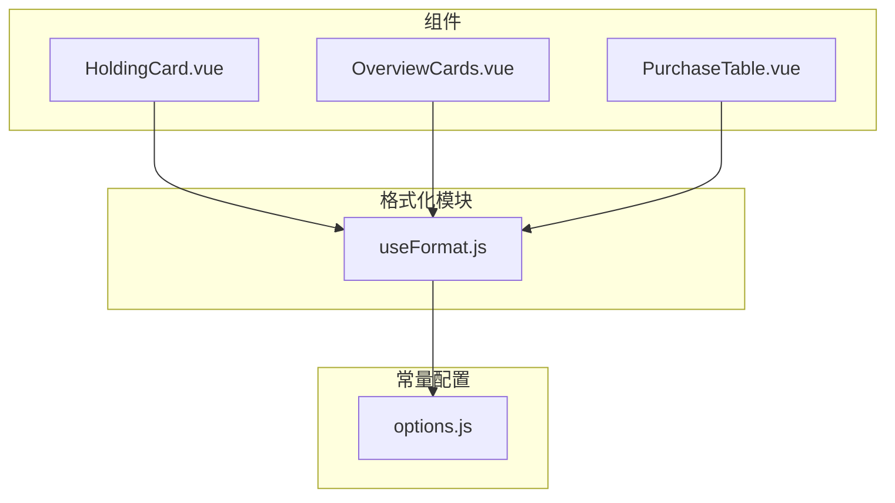
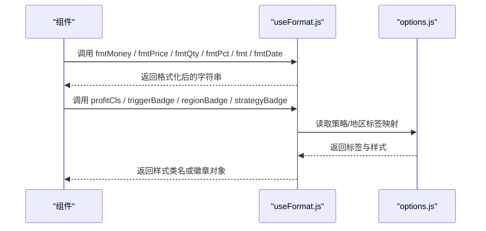
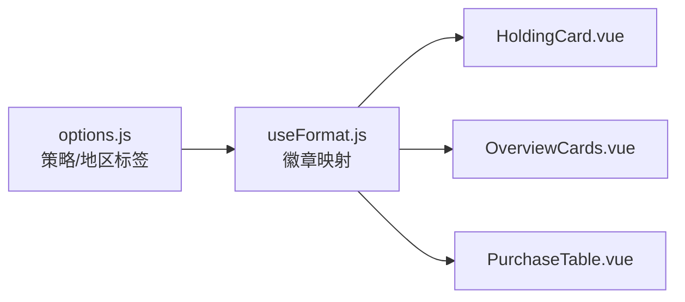

# 格式化工具函数

<cite>
**本文引用的文件**
- [useFormat.js](file://web/src/composables/useFormat.js)
- [HoldingCard.vue](file://web/src/components/HoldingCard.vue)
- [OverviewCards.vue](file://web/src/components/OverviewCards.vue)
- [PurchaseTable.vue](file://web/src/components/PurchaseTable.vue)
- [options.js](file://web/src/constants/options.js)
</cite>

## 目录
1. [简介](#简介)
2. [项目结构](#项目结构)
3. [核心组件](#核心组件)
4. [架构总览](#架构总览)
5. [详细组件分析](#详细组件分析)
6. [依赖关系分析](#依赖关系分析)
7. [性能考虑](#性能考虑)
8. [故障排查指南](#故障排查指南)
9. [结论](#结论)
10. [附录：使用示例与最佳实践](#附录使用示例与最佳实践)

## 简介
本文件为 Stock Advisor 前端中的“格式化工具函数”提供系统化文档。重点解析 useFormat 组合式函数提供的数据格式化能力，包括数字、货币、价格、数量、百分比、日期时间等；并说明各函数的参数、返回值、业务规则（如股票价格小数位、百分比显示）、以及在不同组件中的使用方式与最佳实践。同时给出性能优化建议与常见问题排查方法。

## 项目结构
- 格式化逻辑集中在 web/src/composables/useFormat.js，提供纯函数与徽章映射，无副作用、无状态，便于复用与测试。
- 组件通过 import 引入格式化函数进行展示：
  - HoldingCard.vue：综合展示持仓卡片，使用多种格式化函数呈现市值、成本、现价、收益、收益率、告警阈值等。
  - OverviewCards.vue：概览卡片，用于汇总展示总成本、总市值、今日收益、持仓收益等。
  - PurchaseTable.vue：交易明细表，展示买入/卖出记录的价格、数量、成本、市值、收益与收益率等。
- 常量配置位于 web/src/constants/options.js，提供策略与地区标签等枚举，供徽章类格式化函数使用。

图表来源
- [useFormat.js:1-70](file://web/src/composables/useFormat.js#L1-L70)
- [HoldingCard.vue:1-161](file://web/src/components/HoldingCard.vue#L1-L161)
- [OverviewCards.vue:1-41](file://web/src/components/OverviewCards.vue#L1-L41)
- [PurchaseTable.vue:1-79](file://web/src/components/PurchaseTable.vue#L1-L79)
- [options.js:1-33](file://web/src/constants/options.js#L1-L33)

章节来源
- [useFormat.js:1-70](file://web/src/composables/useFormat.js#L1-L70)
- [HoldingCard.vue:1-161](file://web/src/components/HoldingCard.vue#L1-L161)
- [OverviewCards.vue:1-41](file://web/src/components/OverviewCards.vue#L1-L41)
- [PurchaseTable.vue:1-79](file://web/src/components/PurchaseTable.vue#L1-L79)
- [options.js:1-33](file://web/src/constants/options.js#L1-L33)

## 核心组件
- 数字通用格式化：统一处理空值与 NaN，返回固定占位符或保留指定位数的小数。
- 货币格式化：以千分位分隔并固定两位小数，适用于金额展示。
- 价格格式化：与货币类似，但语义上强调“单价”，同样固定两位小数。
- 数量格式化：支持最多两位小数，不强制补零，适合股数等场景。
- 百分比格式化：自动添加正负号前缀，固定两位小数并追加百分号。
- 日期格式化：截取字符串前10个字符作为标准日期显示。
- 收益颜色类名：根据数值正负返回不同样式类，体现涨跌。
- 徽章映射：将策略、地区、触发状态映射为可读文本与样式类。

章节来源
- [useFormat.js:4-69](file://web/src/composables/useFormat.js#L4-L69)

## 架构总览
格式化模块对外暴露一组纯函数，被多个组件按需导入使用。常量模块提供策略与地区标签等映射数据。整体耦合低、职责清晰，便于扩展与维护。

图表来源
- [useFormat.js:4-69](file://web/src/composables/useFormat.js#L4-L69)
- [options.js:1-33](file://web/src/constants/options.js#L1-L33)

## 详细组件分析

### 数字与金额格式化
- 通用数字格式化
  - 用途：对任意数值进行安全格式化，空值或 NaN 时返回占位符，否则按指定小数位输出。
  - 参数：数值、可选的小数位（默认2）。
  - 返回：字符串。
  - 场景：百分比阈值、自定义比率等需要统一小数位的场景。
- 货币格式化
  - 用途：金额展示，千分位分隔且固定两位小数。
  - 参数：数值。
  - 返回：字符串。
  - 场景：总成本、总市值、收益金额等。
- 价格格式化
  - 用途：单价展示，固定两位小数。
  - 参数：数值。
  - 返回：字符串。
  - 场景：成本价、现价、补仓价等。
- 数量格式化
  - 用途：数量展示，最多两位小数，不强制补零。
  - 参数：数值。
  - 返回：字符串。
  - 场景：股数、份额等。

章节来源
- [useFormat.js:4-24](file://web/src/composables/useFormat.js#L4-L24)
- [HoldingCard.vue:92-128](file://web/src/components/HoldingCard.vue#L92-L128)
- [OverviewCards.vue:19-37](file://web/src/components/OverviewCards.vue#L19-L37)
- [PurchaseTable.vue:31-48](file://web/src/components/PurchaseTable.vue#L31-L48)

### 百分比与日期时间格式化
- 百分比格式化
  - 用途：收益率、涨跌幅等百分比展示，自动带正负号前缀，固定两位小数并追加百分号。
  - 参数：数值。
  - 返回：字符串。
  - 场景：日收益率、持仓收益率、止盈止损比例等。
- 日期格式化
  - 用途：将日期字符串标准化为“YYYY-MM-DD”。
  - 参数：字符串或可转为字符串的值。
  - 返回：字符串或占位符。
  - 场景：交易日期、买入时间等。

章节来源
- [useFormat.js:26-32](file://web/src/composables/useFormat.js#L26-L32)
- [HoldingCard.vue:102-120](file://web/src/components/HoldingCard.vue#L102-L120)
- [PurchaseTable.vue:31-48](file://web/src/components/PurchaseTable.vue#L31-L48)

### 收益颜色与徽章映射
- 收益颜色类名
  - 用途：根据数值正负返回不同样式类，体现涨跌（A股习惯：涨红跌绿）。
  - 参数：数值。
  - 返回：CSS 类名字符串。
  - 场景：收益金额、收益率、止盈止损等需要视觉提示的位置。
- 触发状态徽章
  - 用途：将触发状态映射为“待观察/买点/卖点/临近阈值”等文本与样式。
  - 参数：状态字符串。
  - 返回：包含文本与样式的对象。
  - 场景：持仓卡片的触发状态展示。
- 地区徽章
  - 用途：将地区代码映射为中文标签与样式。
  - 参数：地区代码。
  - 返回：包含文本与样式的对象。
  - 场景：持仓卡片上的地区标识。
- 策略徽章
  - 用途：将投资策略编码映射为可读文本与样式。
  - 参数：策略编码。
  - 返回：包含文本与样式的对象。
  - 场景：持仓卡片上的策略标识。

章节来源
- [useFormat.js:34-69](file://web/src/composables/useFormat.js#L34-L69)
- [HoldingCard.vue:74-81](file://web/src/components/HoldingCard.vue#L74-L81)
- [options.js:3-29](file://web/src/constants/options.js#L3-L29)

### 业务规则与格式约定
- 股票价格与金额：统一采用两位小数，便于财务对齐与阅读。
- 数量：最多两位小数，避免不必要的尾零，提升可读性。
- 百分比：固定两位小数，并显式标注正负号，避免歧义。
- 日期：统一截取前10位，确保“年-月-日”格式一致性。
- 收益颜色：遵循 A 股习惯，正值为涨（红色），负值为跌（绿色）。

章节来源
- [useFormat.js:4-32](file://web/src/composables/useFormat.js#L4-L32)
- [HoldingCard.vue:92-120](file://web/src/components/HoldingCard.vue#L92-L120)
- [PurchaseTable.vue:31-59](file://web/src/components/PurchaseTable.vue#L31-L59)

## 依赖关系分析
- useFormat.js 依赖 constants/options.js 中的策略与地区标签，保证徽章文案与样式一致。
- 组件仅依赖格式化函数，不直接操作数据源，降低耦合度。
- 徽章类函数返回对象，组件负责渲染文本与样式类，职责清晰。

图表来源
- [options.js:1-33](file://web/src/constants/options.js#L1-L33)
- [useFormat.js:1-70](file://web/src/composables/useFormat.js#L1-L70)
- [HoldingCard.vue:1-161](file://web/src/components/HoldingCard.vue#L1-L161)
- [OverviewCards.vue:1-41](file://web/src/components/OverviewCards.vue#L1-L41)
- [PurchaseTable.vue:1-79](file://web/src/components/PurchaseTable.vue#L1-L79)

章节来源
- [useFormat.js:1-70](file://web/src/composables/useFormat.js#L1-L70)
- [options.js:1-33](file://web/src/constants/options.js#L1-L33)

## 性能考虑
- 纯函数无状态：所有格式化函数均为纯函数，易于缓存与单测，减少重复计算开销。
- 本地化开销：货币与价格格式化使用本地化 API，建议在大数据量表格中谨慎批量调用，必要时在数据层预格式化或分页渲染。
- 字符串拼接：百分比与日期格式化涉及字符串操作，保持输入稳定可减少重排。
- 样式类名：profitCls 等返回类名的函数应尽量避免频繁变更，配合 Vue 的响应式更新机制，减少不必要的重渲染。

[本节为通用性能建议，不直接分析具体文件]

## 故障排查指南
- 空值与 NaN 处理
  - 现象：显示为占位符而非数字。
  - 原因：输入为空或 NaN 时，格式化函数返回占位符。
  - 处理：检查上游数据是否为空或非法，确保传入有效数值。
- 百分比符号缺失
  - 现象：百分比未显示百分号。
  - 原因：未使用专用百分比格式化函数。
  - 处理：改用百分比格式化函数以确保格式一致。
- 日期格式异常
  - 现象：日期显示不完整或格式不一致。
  - 原因：输入非字符串或长度不足。
  - 处理：确保传入可转为字符串的值，或使用日期格式化函数。
- 收益颜色不符合预期
  - 现象：涨跌颜色与预期相反。
  - 原因：数值正负判断与业务定义不一致。
  - 处理：核对业务规则，确认数值正负含义与颜色映射是否匹配。

章节来源
- [useFormat.js:4-41](file://web/src/composables/useFormat.js#L4-L41)

## 结论
useFormat 提供了覆盖数字、货币、价格、数量、百分比、日期及徽章映射的完整格式化能力，满足 Stock Advisor 前端展示需求。其纯函数设计与常量解耦，具备良好的可维护性与可扩展性。在实际使用中，应遵循统一的格式约定与业务规则，结合组件场景选择合适的格式化函数，以获得一致的用户体验。

[本节为总结性内容，不直接分析具体文件]

## 附录：使用示例与最佳实践

### 在持仓卡片中使用格式化函数
- 展示市值与数量：使用货币与数量格式化函数，确保金额与股数的格式一致。
- 展示成本与现价：使用价格格式化函数，统一两位小数。
- 展示收益与收益率：使用货币与百分比格式化函数，并结合收益颜色类名增强可读性。
- 展示告警阈值：使用通用数字格式化函数，统一小数位。

章节来源
- [HoldingCard.vue:92-128](file://web/src/components/HoldingCard.vue#L92-L128)

### 在概览卡片中使用格式化函数
- 展示总成本与总市值：使用货币格式化函数，突出金额。
- 展示今日收益与持仓收益：使用货币格式化函数，并结合收益颜色类名。

章节来源
- [OverviewCards.vue:19-37](file://web/src/components/OverviewCards.vue#L19-L37)

### 在交易明细表中使用格式化函数
- 展示交易日期：使用日期格式化函数，确保“年-月-日”格式。
- 展示价格、数量、成本、市值：分别使用价格、数量、货币格式化函数。
- 展示收益与收益率：使用货币与百分比格式化函数，并结合收益颜色类名。
- 展示止盈止损比例：使用通用数字格式化函数，统一小数位。

章节来源
- [PurchaseTable.vue:31-59](file://web/src/components/PurchaseTable.vue#L31-L59)

### 徽章映射的使用
- 地区徽章：将地区代码映射为中文标签与样式，提升可读性。
- 策略徽章：将策略编码映射为可读文本与样式，便于快速识别。
- 触发状态徽章：将触发状态映射为“待观察/买点/卖点/临近阈值”等，辅助决策。

章节来源
- [useFormat.js:43-69](file://web/src/composables/useFormat.js#L43-L69)
- [options.js:3-29](file://web/src/constants/options.js#L3-L29)

### 最佳实践
- 优先使用专用格式化函数：金额用货币格式化，单价用价格格式化，数量用数量格式化，百分比用百分比格式化，日期用日期格式化。
- 统一小数位：对于比率与阈值，使用通用数字格式化函数控制小数位，保持一致性。
- 颜色与语义一致：收益颜色遵循 A 股习惯，正值为涨（红色），负值为跌（绿色）。
- 避免在高频渲染路径中做复杂计算：尽量在数据层预处理或缓存结果。
- 保持输入健壮：对空值与 NaN 的处理要一致，避免 UI 出现异常。

[本节为通用最佳实践，不直接分析具体文件]