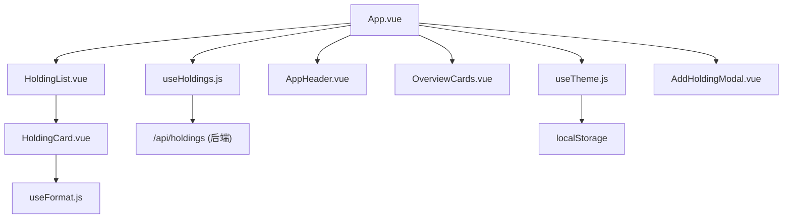
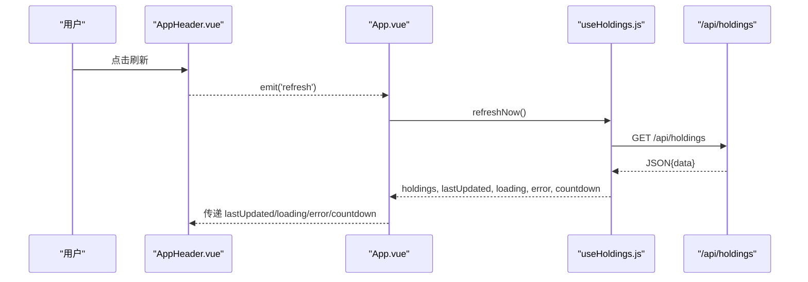
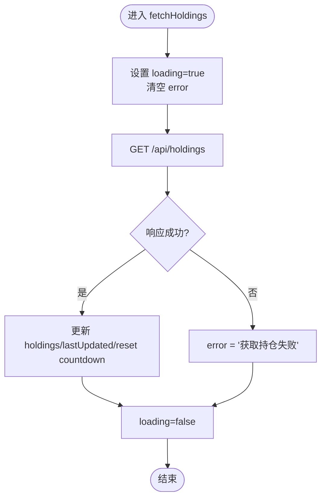
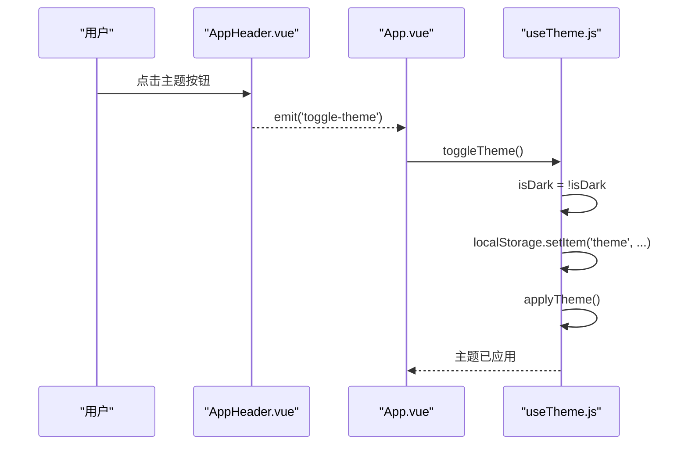
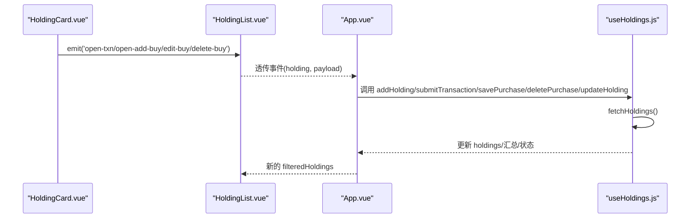
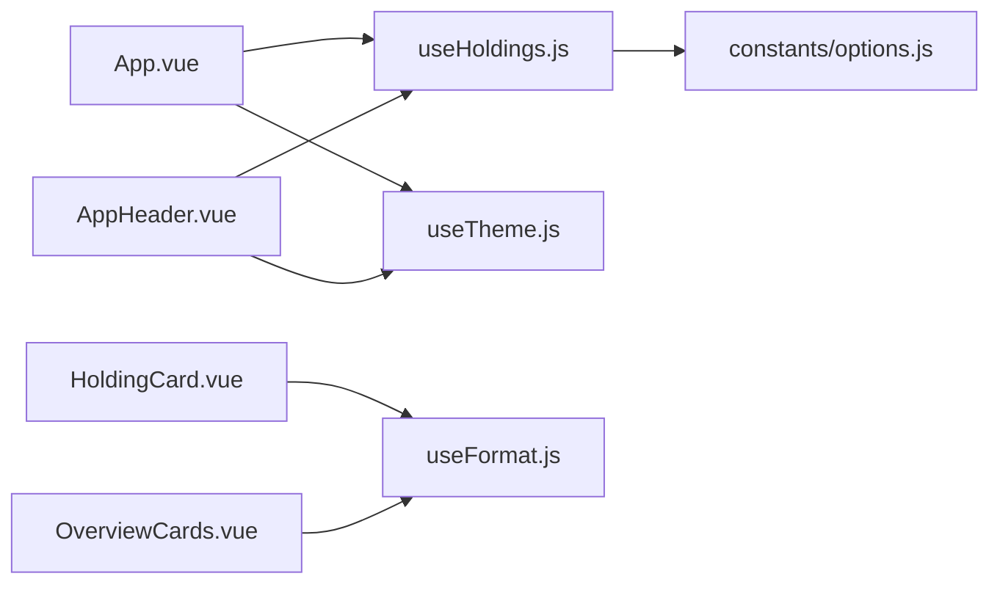

# 状态管理

<cite>
**本文引用的文件**
- [useHoldings.js](file://web/src/composables/useHoldings.js)
- [useTheme.js](file://web/src/composables/useTheme.js)
- [useFormat.js](file://web/src/composables/useFormat.js)
- [App.vue](file://web/src/App.vue)
- [AppHeader.vue](file://web/src/components/AppHeader.vue)
- [HoldingList.vue](file://web/src/components/HoldingList.vue)
- [HoldingCard.vue](file://web/src/components/HoldingCard.vue)
- [OverviewCards.vue](file://web/src/components/OverviewCards.vue)
- [AddHoldingModal.vue](file://web/src/components/AddHoldingModal.vue)
- [options.js](file://web/src/constants/options.js)
- [main.js](file://web/src/main.js)
- [holdings.json](file://data/holdings.json)
</cite>

## 目录
1. [简介](#简介)
2. [项目结构](#项目结构)
3. [核心组件](#核心组件)
4. [架构总览](#架构总览)
5. [详细组件分析](#详细组件分析)
6. [依赖关系分析](#依赖关系分析)
7. [性能与优化](#性能与优化)
8. [故障排查指南](#故障排查指南)
9. [结论](#结论)
10. [附录：数据模型与接口约定](#附录数据模型与接口约定)

## 简介
本文件聚焦 Stock Advisor 前端的状态管理方案，围绕 Vue 3 Composition API 的使用模式展开，重点解析 useHoldings 组合式函数的设计理念、响应式数据流、自动刷新机制、错误处理与缓存策略；同时说明 useTheme 主题切换的本地持久化与动态样式切换；阐述 useFormat 工具函数设计；并总结组件间状态共享与事件驱动更新机制。文末提供状态同步策略、性能优化技巧与调试方法，帮助开发者高效管理与维护前端状态。

## 项目结构
前端采用“组合式函数 + 单例模块级状态”的模式组织状态逻辑：
- composables 层集中封装业务状态与副作用（网络请求、定时器、本地存储等）
- App 作为根容器负责生命周期编排与全局状态装配
- 各展示型组件通过 props 接收状态、通过事件向上冒泡用户操作
- constants 统一枚举与配置项，避免硬编码

图表来源
- [App.vue:1-197](file://web/src/App.vue#L1-L197)
- [useHoldings.js:1-154](file://web/src/composables/useHoldings.js#L1-L154)
- [useTheme.js:1-26](file://web/src/composables/useTheme.js#L1-L26)
- [useFormat.js:1-70](file://web/src/composables/useFormat.js#L1-L70)

章节来源
- [App.vue:1-197](file://web/src/App.vue#L1-L197)
- [main.js:1-6](file://web/src/main.js#L1-L6)
- [options.js:1-33](file://web/src/constants/options.js#L1-L33)

## 核心组件
- useHoldings：模块级单例状态，集中管理持仓列表、加载态、错误、倒计时与汇总计算，并提供统一的写操作方法，所有写操作后统一拉取最新数据以保持一致性。
- useTheme：基于 ref 的主题状态，结合 localStorage 实现持久化，并通过设置 data-theme 与 dark class 完成动态样式切换。
- useFormat：纯函数集合，负责数值、金额、百分比、日期格式化以及徽章样式映射，无副作用便于复用与测试。

章节来源
- [useHoldings.js:1-154](file://web/src/composables/useHoldings.js#L1-L154)
- [useTheme.js:1-26](file://web/src/composables/useTheme.js#L1-L26)
- [useFormat.js:1-70](file://web/src/composables/useFormat.js#L1-L70)

## 架构总览
整体采用“单一事实源 + 事件驱动”的状态管理模式：
- 单一事实源：useHoldings 在模块作用域持有唯一 holdings 数组与相关元信息，所有组件共享同一份引用。
- 事件驱动：子组件通过 emit 将用户操作上报到 App，再由 App 调用 useHoldings 提供的写方法，写方法内部统一走 fetch 并刷新列表。
- 自动刷新：使用单一定时器每秒递减 countdown，归零触发一次 fetch，避免多定时器漂移。
- 主题系统：useTheme 独立于业务状态，通过 DOM 属性与类名切换主题，状态持久化至 localStorage。

图表来源
- [AppHeader.vue:1-64](file://web/src/components/AppHeader.vue#L1-L64)
- [App.vue:1-197](file://web/src/App.vue#L1-L197)
- [useHoldings.js:1-154](file://web/src/composables/useHoldings.js#L1-L154)

## 详细组件分析

### useHoldings 组合式函数
设计理念
- 模块级单例：在模块顶层定义 ref 状态，保证跨组件共享且仅一份数据源。
- 读写分离：读由 computed 派生汇总指标；写统一通过封装方法执行，并在成功后统一刷新列表，确保一致性。
- 自动刷新：单一定时器控制 countdown，避免多实例导致的多定时器问题。
- 错误与加载态：每次请求前清空错误并开启 loading，finally 关闭 loading，异常捕获写入 error。

关键流程
- 数据获取：fetch('/api/holdings') -> 赋值 holdings.value -> 更新时间 -> 重置倒计时
- 写操作：addHolding/submitTransaction/savePurchase/deletePurchase/updateHolding -> 成功后 await fetchHoldings()
- 自动刷新：startAutoRefresh 启动 setInterval，每秒递减 countdown，<=0 触发 fetchHoldings；stopAutoRefresh 清理定时器

图表来源
- [useHoldings.js:15-29](file://web/src/composables/useHoldings.js#L15-L29)

响应式数据与计算
- holdings: 原始数据数组
- lastUpdated: 最近更新时间字符串
- loading/error/countdown: UI 状态
- totalCost/totalMarket/totalHoldingProfit/totalTodayProfit: 基于 holdings 的 computed 汇总

写操作与一致性
- 所有写操作均调用对应 API，成功后统一调用 fetchHoldings 刷新，避免局部更新不一致
- 删除买入记录包含确认提示与错误弹窗

自动刷新机制
- 单一定时器 tick，每秒递减 countdown，归零即刷新
- 刷新后重置 countdown，避免重复刷新或漂移

章节来源
- [useHoldings.js:1-154](file://web/src/composables/useHoldings.js#L1-L154)

### useTheme 主题切换
实现要点
- 使用 ref 保存 isDark 状态
- initTheme：从 localStorage 读取 theme，默认深色，应用主题
- toggleTheme：切换 isDark，写入 localStorage，并调用 applyTheme
- applyTheme：设置 documentElement.dataset.theme 与 toggling dark class，配合 Tailwind/DaisyUI 完成样式切换

图表来源
- [useTheme.js:1-26](file://web/src/composables/useTheme.js#L1-L26)
- [AppHeader.vue:1-64](file://web/src/components/AppHeader.vue#L1-L64)
- [App.vue:1-197](file://web/src/App.vue#L1-L197)

章节来源
- [useTheme.js:1-26](file://web/src/composables/useTheme.js#L1-L26)
- [App.vue:121-129](file://web/src/App.vue#L121-L129)

### useFormat 工具函数
设计原则
- 纯函数：无副作用、无状态，便于复用与单元测试
- 分类清晰：数值、金额、价格、数量、百分比、日期、收益颜色、徽章映射
- 兼容空值：对 null/undefined/NaN 返回占位符，避免渲染异常

常用函数
- fmt/fmtMoney/fmtPrice/fmtQty/fmtPct/fmtDate：格式化显示
- profitCls：根据正负返回不同文本颜色类
- triggerBadge/regionBadge/strategyBadge：根据策略/地区/触发状态生成徽章文本与样式

章节来源
- [useFormat.js:1-70](file://web/src/composables/useFormat.js#L1-L70)

### 组件间状态共享与事件驱动
- 共享状态：App 通过 useHoldings 暴露的响应式对象直接绑定到模板，子组件通过 props 接收过滤后的 holdings
- 事件冒泡：HoldingList/HoldingCard 将用户操作通过 emit 上报到 App，App 调用 useHoldings 的写方法，写方法完成后统一刷新列表
- 过滤视图：App 中 computed filteredHoldings 基于 activeFilters 对 holdings 进行过滤，保持只读视图与真实数据解耦

图表来源
- [HoldingCard.vue:1-161](file://web/src/components/HoldingCard.vue#L1-L161)
- [HoldingList.vue:1-36](file://web/src/components/HoldingList.vue#L1-L36)
- [App.vue:1-197](file://web/src/App.vue#L1-L197)
- [useHoldings.js:1-154](file://web/src/composables/useHoldings.js#L1-L154)

章节来源
- [HoldingList.vue:1-36](file://web/src/components/HoldingList.vue#L1-L36)
- [HoldingCard.vue:1-161](file://web/src/components/HoldingCard.vue#L1-L161)
- [App.vue:76-119](file://web/src/App.vue#L76-L119)

## 依赖关系分析
- App.vue 依赖 useHoldings 与 useTheme，并组合多个子组件
- 子组件依赖 useFormat 进行展示格式化
- useHoldings 依赖常量 REFRESH_MS，用于自动刷新间隔
- 主题系统依赖 localStorage 与 DOM API

图表来源
- [App.vue:1-197](file://web/src/App.vue#L1-L197)
- [useHoldings.js:1-154](file://web/src/composables/useHoldings.js#L1-L154)
- [useTheme.js:1-26](file://web/src/composables/useTheme.js#L1-L26)
- [useFormat.js:1-70](file://web/src/composables/useFormat.js#L1-L70)
- [options.js:1-33](file://web/src/constants/options.js#L1-L33)

章节来源
- [App.vue:1-197](file://web/src/App.vue#L1-L197)
- [useHoldings.js:1-154](file://web/src/composables/useHoldings.js#L1-L154)
- [useTheme.js:1-26](file://web/src/composables/useTheme.js#L1-L26)
- [useFormat.js:1-70](file://web/src/composables/useFormat.js#L1-L70)
- [options.js:1-33](file://web/src/constants/options.js#L1-L33)

## 性能与优化
- 单例状态：useHoldings 在模块级持有唯一 holdings 引用，避免重复创建与内存浪费
- 计算属性：汇总指标使用 computed，仅在依赖变化时重新计算，降低重渲染成本
- 单一定时器：自动刷新使用单一 setInterval，避免多定时器导致的抖动与资源浪费
- 最小化网络请求：写操作后统一刷新一次，避免多次局部更新
- 本地缓存：主题状态使用 localStorage 持久化，减少初始化开销
- 建议优化
  - 对长列表渲染考虑虚拟滚动或分页
  - 对频繁更新的字段可引入防抖/节流（如搜索过滤）
  - 对网络请求增加重试与超时控制
  - 对大对象变更可使用结构化克隆或增量更新策略

[本节为通用指导，不直接分析具体文件]

## 故障排查指南
常见问题与定位
- 数据未更新：检查 fetch 是否成功、错误是否被捕获并写入 error；确认是否在 finally 中关闭 loading
- 自动刷新不工作：确认 startAutoRefresh 已在 onMounted 调用，onUnmounted 中 stopAutoRefresh 清理定时器
- 主题不生效：确认 initTheme 在挂载时调用，toggleTheme 正确写入 localStorage 并应用样式
- 写操作失败：查看 API 响应码与错误消息，必要时在浏览器 Network 面板抓包

调试方法
- 控制台日志：在 fetch 前后打印请求参数与响应体
- 断点调试：在关键函数入口（如 fetchHoldings、write methods）打断点
- 网络面板：观察请求 URL、Headers、Payload、Response
- 状态快照：在 DevTools 中观察 ref/computed 的值变化

章节来源
- [useHoldings.js:15-29](file://web/src/composables/useHoldings.js#L15-L29)
- [App.vue:121-129](file://web/src/App.vue#L121-L129)
- [useTheme.js:10-21](file://web/src/composables/useTheme.js#L10-L21)

## 结论
本项目采用轻量而稳健的前端状态管理方案：以组合式函数为核心，模块级单例状态保证数据一致性；通过事件驱动与统一写方法保障状态同步；自动刷新与本地持久化提升用户体验；纯函数工具库提高可维护性与可测试性。该模式适合中小型应用，易于扩展与维护。

[本节为总结性内容，不直接分析具体文件]

## 附录：数据模型与接口约定
- 数据模型
  - 持仓对象包含基础信息（id/name/code/region/type/strategy）、交易明细（purchases/sells）、行情与告警字段（currentPrice/prevClose/triggerState/dailyDropAlertPct/dailyRiseAlertPct）、汇总字段（cost/buyQuantity/avgCost/targetProfitRate/stopLossRate）等
- 接口约定
  - GET /api/holdings：返回 { data: [] }
  - POST /api/holdings：新增持仓
  - POST /api/holdings/:id/transactions：提交交易（BUY/SELL）
  - PATCH/POST /api/holdings/:id/purchases[/:pid]：保存/修改买入记录
  - DELETE /api/holdings/:id/purchases/:pid：删除买入记录
  - PATCH /api/holdings/:id：更新持仓字段（如日涨跌告警阈值）

章节来源
- [holdings.json:1-462](file://data/holdings.json#L1-L462)
- [useHoldings.js:67-130](file://web/src/composables/useHoldings.js#L67-L130)