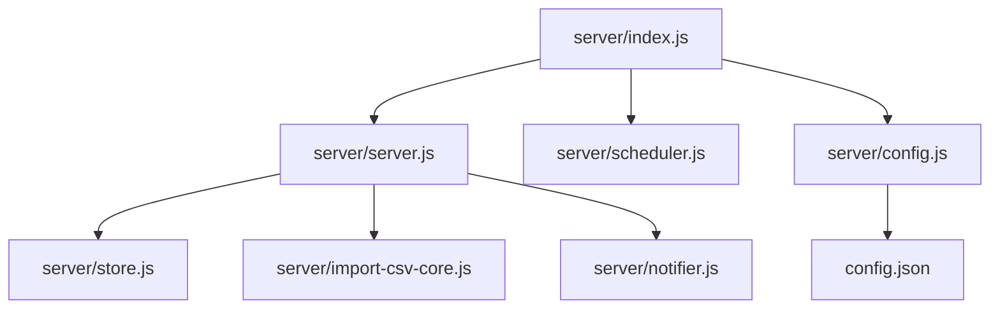
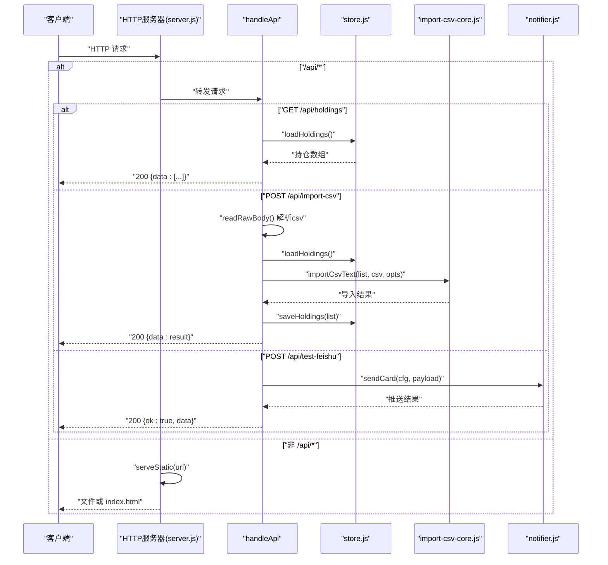
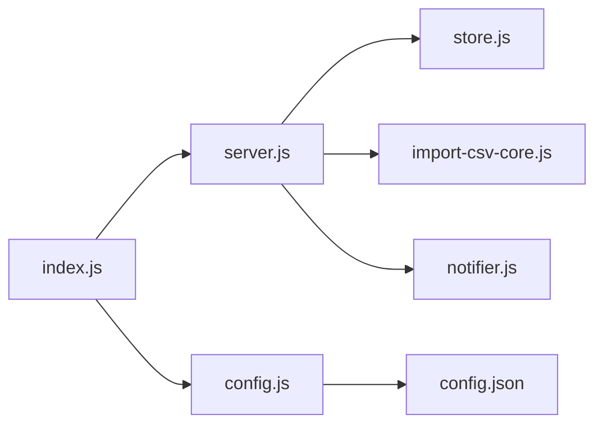

# HTTP服务器

<cite>
**本文引用的文件**
- [server/server.js](file://server/server.js)
- [server/index.js](file://server/index.js)
- [server/config.js](file://server/config.js)
- [server/store.js](file://server/store.js)
- [server/import-csv-core.js](file://server/import-csv-core.js)
- [server/notifier.js](file://server/notifier.js)
- [config.json](file://config.json)
- [package.json](file://package.json)
</cite>

## 目录
1. [简介](#简介)
2. [项目结构](#项目结构)
3. [核心组件](#核心组件)
4. [架构总览](#架构总览)
5. [详细组件分析](#详细组件分析)
6. [依赖关系分析](#依赖关系分析)
7. [性能考量](#性能考量)
8. [故障排查指南](#故障排查指南)
9. [结论](#结论)
10. [附录：API参考与扩展指南](#附录api参考与扩展指南)

## 简介
本文件为 Stock Advisor 的 HTTP 服务器文档，聚焦基于 Node.js 原生 http 模块的服务实现。内容涵盖请求处理流程、路由设计、静态资源服务（Vite 构建产物托管、SPA 回退、MIME 类型）、请求体解析（JSON 与原始文本）、错误处理机制、响应格式标准化以及中间件式路由分发模式。重点解释 API 路由处理器 handleApi 的实现逻辑，包括持仓管理 CRUD、CSV 导入接口和测试通知接口，并提供扩展建议与使用示例路径。

## 项目结构
- server/index.js：应用入口，加载配置、启动 HTTP 服务器与调度器。
- server/server.js：HTTP 服务器核心，包含路由分发、静态资源服务、请求体解析、业务处理函数与响应封装。
- server/config.js：读取根目录 config.json。
- server/store.js：持仓数据持久化（JSON 文件）与内存缓存、并发写保护。
- server/import-csv-core.js：CSV 导入核心逻辑（可复用），支持幂等导入、自动创建缺失持仓等。
- server/notifier.js：飞书机器人消息构造与发送（含签名与重试）。
- config.json：服务器端口/主机、飞书 webhook、调度间隔等配置。
- package.json：脚本与依赖声明，入口 main 指向 server/index.js。

图表来源
- [server/index.js:1-17](file://server/index.js#L1-L17)
- [server/server.js:1-594](file://server/server.js#L1-L594)
- [server/config.js:1-11](file://server/config.js#L1-L11)
- [server/store.js:1-71](file://server/store.js#L1-L71)
- [server/import-csv-core.js:1-307](file://server/import-csv-core.js#L1-L307)
- [server/notifier.js:1-112](file://server/notifier.js#L1-L112)
- [config.json:1-19](file://config.json#L1-L19)

章节来源
- [server/index.js:1-17](file://server/index.js#L1-L17)
- [package.json:1-32](file://package.json#L1-L32)

## 核心组件
- 请求处理与路由分发：统一入口根据 URL 前缀区分 /api/* 与静态资源，调用 handleApi 或 serveStatic。
- 静态资源服务：基于 Vite 构建产物 dist 目录，精确匹配文件并设置 MIME；不存在时回退到 index.html 以支持 SPA 路由。
- 请求体解析：readBody 解析 JSON；readRawBody 获取原始文本（用于 CSV 导入）。
- 数据存储：store.js 提供 loadHoldings/saveHoldings，带内存缓存与串行写盘，避免并发覆盖。
- 业务处理：handleApi 内聚所有 API 路由，包括持仓列表、新建、更新、买入/卖出记录、CSV 导入、飞书测试推送。
- 通知能力：notifier.js 构造飞书卡片消息并发送，支持签名与重试。

章节来源
- [server/server.js:35-83](file://server/server.js#L35-L83)
- [server/server.js:409-565](file://server/server.js#L409-L565)
- [server/store.js:40-70](file://server/store.js#L40-L70)
- [server/notifier.js:80-112](file://server/notifier.js#L80-L112)

## 架构总览
HTTP 服务器采用“单请求一处理”的简单模型：每个请求进入后先解析 URL，若路径以 /api/ 开头则交由 handleApi 处理；否则对 GET 请求进行静态资源服务，其他方法返回 404。

图表来源
- [server/server.js:567-593](file://server/server.js#L567-L593)
- [server/server.js:409-565](file://server/server.js#L409-L565)
- [server/store.js:40-70](file://server/store.js#L40-L70)
- [server/import-csv-core.js:170-306](file://server/import-csv-core.js#L170-L306)
- [server/notifier.js:80-112](file://server/notifier.js#L80-L112)

## 详细组件分析

### 请求处理流程与路由设计
- 入口：startServer 创建 http.createServer 回调，解析 URL，按路径前缀分流。
- API 路由：handleApi 通过 if/else 分支匹配方法与路径，执行对应逻辑并返回 JSON。
- 静态资源：serveStatic 优先尝试精确文件，失败则返回 index.html 以支持 SPA。

关键要点
- 所有 API 响应统一通过 sendJSON 封装，确保 Content-Type 与状态码一致。
- 非 /api 且非 GET 的请求直接返回 404。

章节来源
- [server/server.js:567-593](file://server/server.js#L567-L593)
- [server/server.js:55-58](file://server/server.js#L55-L58)
- [server/server.js:35-53](file://server/server.js#L35-L53)

### 静态资源服务机制
- 路径映射：将 URL pathname 映射到 dist 目录下的实际文件路径，规范化并防止目录穿越。
- MIME 类型：根据扩展名设置合适的 Content-Type，未知类型使用 application/octet-stream。
- SPA 回退：当文件不存在时，返回 index.html，使前端路由接管。

章节来源
- [server/server.js:22-53](file://server/server.js#L22-L53)

### 请求体解析器
- readBody：累积请求体数据，尝试 JSON.parse，失败抛出 invalid json。
- readRawBody：累积原始文本，适用于 CSV 等非 JSON 载荷。

章节来源
- [server/server.js:60-83](file://server/server.js#L60-L83)

### API 路由处理器 handleApi
- GET /api/holdings：返回所有持仓，并对每条记录计算派生字段（收益、均价、交易明细等）。
- POST /api/holdings：新建持仓（支持先建仓后补买入记录），校验必填字段，保存并返回派生后的数据。
- PATCH /api/holdings/:id：更新持仓级字段（如日涨跌告警阈值），重置每日告警标记。
- POST /api/holdings/:id/purchases：追加买入记录，校验数量/价格，同步汇总字段。
- PATCH /api/holdings/:id/purchases/:pid：修改某条买入记录的止盈/止亏比例或修正价格/数量/日期。
- DELETE /api/holdings/:id/purchases/:pid：删除买入记录，若无剩余买入则状态置为已卖出。
- POST /api/holdings/:id/transactions：兼容旧接口，支持买入/卖出交易，内部按 LIFO 计算成本。
- POST /api/import-csv：接收原始文本中的 CSV，解析并导入到 holdings，支持 createMissing 自动创建缺失持仓。
- POST /api/test-feishu：发送测试卡片到飞书机器人，验证推送链路。

派生与同步
- withDerived：为展示层计算市场价值、盈亏、收益率、今日涨跌、最近买入价、加权止盈/止损等。
- syncFromPurchases：落盘前从买入/卖出记录反推剩余成本/数量/均价及状态，保证数据一致性。

章节来源
- [server/server.js:89-245](file://server/server.js#L89-L245)
- [server/server.js:247-407](file://server/server.js#L247-L407)
- [server/server.js:409-565](file://server/server.js#L409-L565)

### CSV 导入接口与核心逻辑
- 表头要求：必须包含代码、操作、日期、数量、价格列，否则抛错。
- 匹配规则：精确匹配 holdings.code，或数字归一化匹配（如 hk00700 → 700）。
- 幂等性：以 (code, 操作, 日期, 数量, 价格) 作为唯一键，重复记录忽略。
- 自动创建：createMissing=true 时，若未找到持仓，按地区/类型新建持仓。
- 结果返回：added、skipped、created、missing、errors、total 等统计信息。

章节来源
- [server/import-csv-core.js:170-306](file://server/import-csv-core.js#L170-L306)
- [server/server.js:416-435](file://server/server.js#L416-L435)

### 错误处理与响应标准化
- 统一响应：sendJSON 封装状态码与 JSON 体，确保 Content-Type 正确。
- 全局异常：服务器回调 catch 中输出日志并以 500 返回错误对象。
- 业务错误：各路由在参数校验失败或外部调用失败时返回 400/404/502 等语义化状态码。

章节来源
- [server/server.js:55-58](file://server/server.js#L55-L58)
- [server/server.js:571-586](file://server/server.js#L571-L586)
- [server/server.js:416-565](file://server/server.js#L416-L565)

### 中间件模式说明
当前实现采用“单回调 + 条件分支”的路由分发方式，并非传统意义上的中间件链。但可通过以下方式演进为中间件模式：
- 将通用逻辑（鉴权、限流、日志、CORS）抽取为中间件函数，按顺序组合。
- 在 handleApi 之前插入前置中间件，之后插入后置中间件。
- 保持现有路由不变，逐步替换分支逻辑为中间件处理。

[本节为概念性说明，不直接分析具体文件]

## 依赖关系分析
- server/index.js 依赖 config.js、scheduler.js、server.js。
- server/server.js 依赖 store.js、notifier.js、import-csv-core.js。
- server/store.js 依赖文件系统读写，维护内存缓存与串行写队列。
- server/notifier.js 依赖 crypto 与 fetch，向飞书 webhook 发送消息。
- 配置来自 config.json，影响服务器监听地址/端口与飞书 webhook。

图表来源
- [server/index.js:1-17](file://server/index.js#L1-L17)
- [server/server.js:1-8](file://server/server.js#L1-L8)
- [server/config.js:1-11](file://server/config.js#L1-L11)
- [config.json:1-19](file://config.json#L1-L19)

章节来源
- [server/index.js:1-17](file://server/index.js#L1-L17)
- [server/server.js:1-8](file://server/server.js#L1-L8)
- [server/config.js:1-11](file://server/config.js#L1-L11)
- [config.json:1-19](file://config.json#L1-L19)

## 性能考量
- 内存缓存：store.js 首次加载后缓存至内存，减少磁盘 IO。
- 串行写盘：writeChain 保证多次写入顺序执行，避免并发覆盖。
- 静态资源：精确文件命中快速返回，SPA 回退仅在文件缺失时触发。
- 网络重试：notifier.js 对飞书推送进行最多 3 次重试，提升可靠性。
- 建议：在高并发场景下考虑引入连接池、请求合并与更细粒度的锁机制。

[本节为通用性能讨论，不直接分析具体文件]

## 故障排查指南
- 400 错误：常见于参数校验失败（如缺少必填字段、数值非法）、CSV 表头缺失或导入数据不合法。检查请求体与 CSV 列名。
- 404 错误：API 路径不存在或持仓/买入记录 ID 无效。确认路由与 ID。
- 500 错误：服务器内部异常，查看控制台日志定位。
- 502 错误：飞书推送失败，检查 webhook 与 secret 配置，或网络连通性。
- 静态资源 404：确认 Vite 构建产物是否存在于 dist 目录，或检查 URL 路径是否正确。

章节来源
- [server/server.js:416-565](file://server/server.js#L416-L565)
- [server/server.js:571-586](file://server/server.js#L571-L586)
- [server/notifier.js:80-112](file://server/notifier.js#L80-L112)

## 结论
该 HTTP 服务器以最小依赖实现了完整的持仓管理与通知能力，具备清晰的请求处理流程、稳健的错误处理与标准化的响应格式。通过模块化设计（store、import-csv-core、notifier），便于扩展与维护。建议在后续迭代中引入中间件模式以提升横切关注点的可维护性，并优化高并发场景下的存储与网络访问策略。

[本节为总结性内容，不直接分析具体文件]

## 附录：API参考与扩展指南

### API 端点一览
- GET /api/holdings：获取持仓列表（含派生字段）。
- POST /api/holdings：新建持仓。
- PATCH /api/holdings/:id：更新持仓级字段（如日涨跌告警阈值）。
- POST /api/holdings/:id/purchases：追加买入记录。
- PATCH /api/holdings/:id/purchases/:pid：修改买入记录（止盈/止亏、价格、数量、日期）。
- DELETE /api/holdings/:id/purchases/:pid：删除买入记录。
- POST /api/holdings/:id/transactions：兼容旧接口，提交买入/卖出交易。
- POST /api/import-csv：导入 CSV 买卖记录（原始文本 body.csv）。
- POST /api/test-feishu：发送测试飞书卡片。

章节来源
- [server/server.js:409-565](file://server/server.js#L409-L565)

### 请求体与响应格式
- JSON 请求体：通过 readBody 解析，失败返回 invalid json。
- 原始文本请求体：通过 readRawBody 获取，用于 CSV 导入。
- 响应体：统一为 JSON，包含 data 或 error 字段，状态码语义化。

章节来源
- [server/server.js:60-83](file://server/server.js#L60-L83)
- [server/server.js:55-58](file://server/server.js#L55-L58)

### 静态资源与 SPA
- 静态目录：dist（Vite 构建产物）。
- MIME 类型：根据扩展名设置，未知类型使用二进制流。
- SPA 回退：文件不存在时返回 index.html。

章节来源
- [server/server.js:22-53](file://server/server.js#L22-L53)

### 扩展指南
- 新增 API：在 handleApi 中添加新的 if/else 分支，遵循现有命名与错误处理约定。
- 新增中间件：将鉴权、日志、限流等逻辑抽取为独立函数，并在 startServer 回调中按顺序调用。
- 自定义 MIME：扩展 MIME 映射表以支持新资源类型。
- 数据源扩展：在 store.js 中抽象数据访问层，替换 JSON 文件为数据库或其他存储。
- 通知扩展：在 notifier.js 中增加其他平台的消息构造与发送逻辑。

[本节为概念性指导，不直接分析具体文件]