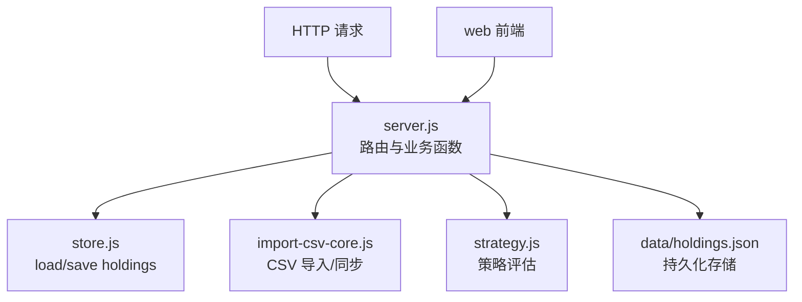
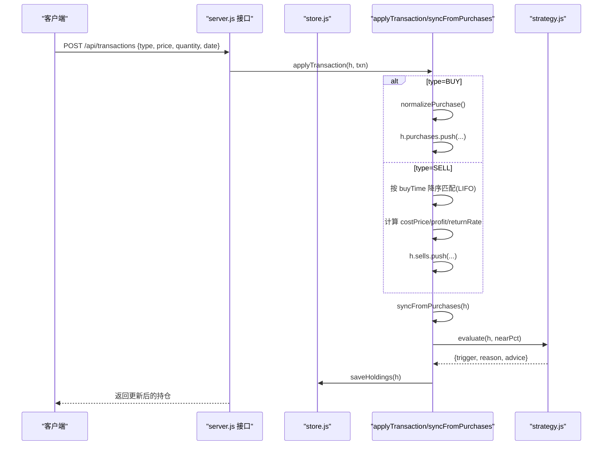
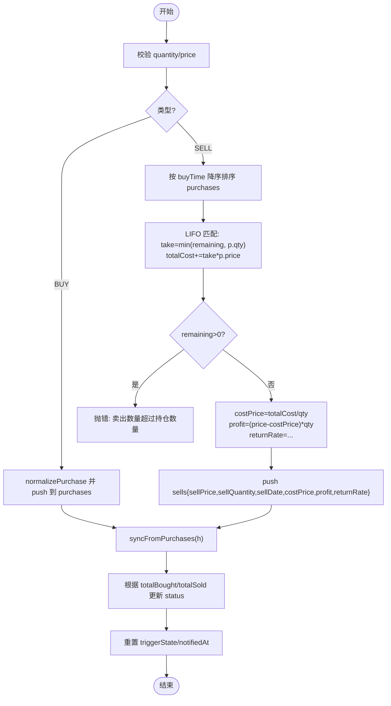
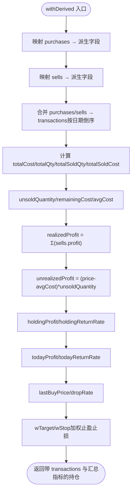
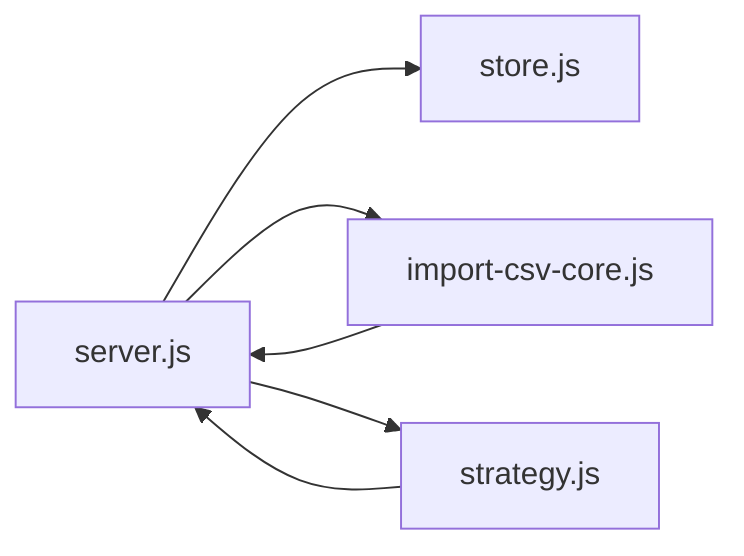

# 业务逻辑层

<cite>
**本文引用的文件**
- [server/server.js](file://server/server.js)
- [server/import-csv-core.js](file://server/import-csv-core.js)
- [server/strategy.js](file://server/strategy.js)
- [server/store.js](file://server/store.js)
- [docs/盈亏计算规则.md](file://docs/盈亏计算规则.md)
- [data/holdings.json](file://data/holdings.json)
</cite>

## 目录
1. [简介](#简介)
2. [项目结构](#项目结构)
3. [核心组件](#核心组件)
4. [架构总览](#架构总览)
5. [详细组件分析](#详细组件分析)
6. [依赖关系分析](#依赖关系分析)
7. [性能考量](#性能考量)
8. [故障排查指南](#故障排查指南)
9. [结论](#结论)
10. [附录](#附录)

## 简介
本文件聚焦 Stock Advisor 的业务逻辑层，围绕“持仓管理”的核心算法展开：包括创建持仓、买入/卖出交易处理、成本同步与 LIFO 卖出原则、派生字段计算（均价、市值、日收益、策略评估）、以及交易记录的数据模型与合并展示。目标是帮助开发者快速理解投资计算的关键路径与扩展点。

## 项目结构
后端服务以 Node.js HTTP 服务器为核心，负责：
- 数据持久化：内存缓存 + JSON 文件读写（store）
- 业务逻辑：持仓创建、交易应用、成本同步、派生字段计算（server）
- 策略引擎：基于多次买入记录的止盈/止损/补仓判断（strategy）
- CSV 导入：批量导入并复用核心逻辑（import-csv-core）
- 文档与示例数据：规则说明与样例持仓（docs、data）

图表来源
- [server/server.js:1-200](file://server/server.js#L1-L200)
- [server/store.js:40-71](file://server/store.js#L40-L71)
- [server/import-csv-core.js:80-128](file://server/import-csv-core.js#L80-L128)
- [server/strategy.js:34-90](file://server/strategy.js#L34-L90)

章节来源
- [server/server.js:1-200](file://server/server.js#L1-L200)
- [server/store.js:40-71](file://server/store.js#L40-L71)

## 核心组件
- createHolding：创建新持仓对象，初始化基础字段与空数组，随后调用 syncFromPurchases 计算初始汇总字段。
- applyTransaction：处理一笔买入或卖出交易；买入追加到 purchases，卖出按 LIFO 计算成本并写入 sells，最后同步汇总。
- syncFromPurchases：从 purchases 与 sells 反推剩余成本/数量/均价、加权止盈止损、状态等，确保落盘前一致。
- withDerived：运行时派生展示字段，包含 transactions 合并、均价、市值、今日收益、持仓收益与收益率等。
- strategy.evaluate：基于当前价与加权止盈止损、最近买入价等，输出 BUY/SELL/NONE 建议。
- normalizePurchase / deriveSell：对买入记录进行校验归一化，对卖出记录进行统一字段转换以便合并展示。

章节来源
- [server/server.js:302-344](file://server/server.js#L302-L344)
- [server/server.js:346-407](file://server/server.js#L346-L407)
- [server/server.js:247-284](file://server/server.js#L247-L284)
- [server/server.js:146-245](file://server/server.js#L146-L245)
- [server/strategy.js:34-90](file://server/strategy.js#L34-L90)
- [server/server.js:286-300](file://server/server.js#L286-L300)
- [server/server.js:120-144](file://server/server.js#L120-L144)

## 架构总览
以下序列图展示了“提交一笔交易”的端到端流程，涵盖验证、LIFO 成本计算、sells/purchases 更新、同步汇总与触发态重置。

图表来源
- [server/server.js:346-407](file://server/server.js#L346-L407)
- [server/server.js:247-284](file://server/server.js#L247-L284)
- [server/strategy.js:34-90](file://server/strategy.js#L34-L90)
- [server/store.js:62-71](file://server/store.js#L62-L71)

## 详细组件分析

### 持仓创建：createHolding
- 职责：校验必填字段、构建持仓对象、初始化空 purchases/sells、设置默认策略与告警阈值，最终调用 syncFromPurchases 计算初始汇总。
- 关键点：
  - 允许“先建仓后补记录”，purchases 可为空。
  - 所有数值型字段做 Number 兜底，避免 NaN。
  - 返回已同步的持仓对象，保证后续交易可立即使用。

章节来源
- [server/server.js:302-344](file://server/server.js#L302-L344)

### 交易处理：applyTransaction（含 LIFO 卖出）
- 买入：
  - 通过 normalizePurchase 校验并生成标准买入记录，追加至 purchases。
  - 将状态置为“持有”。
- 卖出：
  - 不修改任何买入记录，新增一条卖出记录。
  - LIFO 成本计算：将 purchases 按 buyTime 降序排序，逐笔取 min(remaining, p.buyQuantity)，累计 totalCost，直至 remaining 为 0。
  - 若循环结束后仍有剩余，抛出“卖出数量超过持仓数量”。
  - 计算 costPrice = totalCost / qty，profit = (price - costPrice) * qty，returnRate = costPrice > 0 ? (price - costPrice)/costPrice*100 : 0。
  - 写入 sells，并更新 status（全部卖出或持有）。
- 同步与重置：
  - 调用 syncFromPurchases 重新计算剩余成本/数量/均价与加权止盈止损。
  - 重置 triggerState 与 notifiedAt，使下一轮评估生效。

图表来源
- [server/server.js:346-407](file://server/server.js#L346-L407)
- [server/server.js:247-284](file://server/server.js#L247-L284)

章节来源
- [server/server.js:346-407](file://server/server.js#L346-L407)
- [server/server.js:247-284](file://server/server.js#L247-L284)

### 成本同步：syncFromPurchases
- 作用：从 purchases 与 sells 反推剩余成本/数量/均价、加权止盈止损、lastBuyPrice、status 等，确保落盘前数据一致。
- 关键步骤：
  - 总买入成本 = Σ(p.buyPrice × p.buyQuantity)
  - 总卖出成本 = Σ(s.costPrice × s.sellQuantity)
  - 剩余成本 = max(总买入成本 − 总卖出成本, 0)
  - 剩余数量 = max(总买入数量 − 总卖出数量, 0)
  - 剩余均价 = 剩余数量 > 0 ? 剩余成本 / 剩余数量 : 0
  - 加权止盈/止损：按每笔买入的成本权重计算均值，保留两位小数。
  - lastBuyPrice：最新买入价（按 buyTime 降序）。
  - status：无买入时保持原状；否则当 totalSold ≥ totalBought 时为“全部卖出”，否则“持有”。

章节来源
- [server/server.js:247-284](file://server/server.js#L247-L284)
- [server/import-csv-core.js:82-128](file://server/import-csv-core.js#L82-L128)

### 派生字段：withDerived
- 作用：在查询时动态计算展示所需指标，不改变持久化数据。
- 主要计算：
  - purchases 派生：每条买入记录计算 cost、marketValue、profit、returnRate、targetPrice、stopLossPrice。
  - sells 派生：统一字段映射为 type=SELL，并计算 cost、marketValue、profit、returnRate。
  - transactions 合并：将买入与卖出合并并按日期倒序排列，买入的收益字段置 null。
  - 汇总指标：
    - 剩余数量、剩余成本、剩余均价
    - 已实现盈利 = Σ(sells.profit)
    - 未实现盈利 = (currentPrice − avgCost) × unsoldQuantity（条件满足时）
    - 持仓总盈亏 = 未实现 + 已实现（或仅已实现）
    - 持仓收益率 = 持仓盈亏 / 总买入成本 × 100
    - 今日收益/收益率 = (currentPrice − prevClose) × unsoldQuantity / prevClose × 100
    - lastBuyPrice 与 dropRate 用于补仓判断
    - targetProfitRate/stopLossRate 采用加权均值覆盖

图表来源
- [server/server.js:146-245](file://server/server.js#L146-L245)

章节来源
- [server/server.js:146-245](file://server/server.js#L146-L245)

### 策略评估：strategy.evaluate
- 输入：持仓对象 h 与 nearPct（接近阈值百分比）。
- 逻辑：
  - 聚合买入记录：计算 totalCost、totalQty、avgCost、lastBuyPrice 与加权 wTarget、wStop。
  - 卖点①：达到预期止盈（考虑 nearPct），触发 SELL（PROFIT）。
  - 卖点②：任一买入记录触发止损（跌幅达到该笔 stopLossRate 且考虑 nearPct），触发 SELL（STOPLOSS）。
  - 买点：较最近买入价跌幅达到 refillDropRate 或触及 refillPrice，触发 BUY。
  - 否则 NONE。

章节来源
- [server/strategy.js:34-90](file://server/strategy.js#L34-L90)

### 数据模型与验证：normalizePurchase / deriveSell / transactions
- normalizePurchase：
  - 校验 buyPrice/buyQuantity 必须为正，生成 id、buyTime（支持 date 别名）、目标止盈/止损默认值。
- deriveSell：
  - 将卖出记录转换为统一字段结构，便于与买入记录合并展示；统一日期字段为 buyTime（来自 sellDate/sellTime）。
- transactions 合并：
  - 将买入与卖出合并为时间线，按日期倒序；买入收益字段置 null，卖出显示 profit/returnRate。

章节来源
- [server/server.js:286-300](file://server/server.js#L286-L300)
- [server/server.js:120-144](file://server/server.js#L120-L144)
- [server/server.js:146-164](file://server/server.js#L146-L164)

### 数据流与规则对照
- 规则文档定义了完整的成本与盈亏计算方式，与代码实现保持一致：
  - 总买入/卖出成本、LIFO 卖出成本、剩余仓位、已实现/未实现盈亏、持仓总盈亏、今日盈亏等。
  - 交易流水合并与字段覆盖规则。
  - 数据流：用户操作 → 后台刷新行情 → syncFromPurchases → withDerived 返回展示数据。

章节来源
- [docs/盈亏计算规则.md:9-228](file://docs/盈亏计算规则.md#L9-L228)

## 依赖关系分析
- server.js 依赖 store.js 进行数据加载与串行写盘，避免并发冲突。
- server.js 内部组合 normalizePurchase、deriveSell、withDerived、syncFromPurchases、applyTransaction。
- import-csv-core.js 复用 normalizePurchase、computeSellCost（LIFO）、syncFromPurchases、createHolding，实现批量导入一致性。
- strategy.js 独立于 I/O，仅依赖持仓数据与价格，提供策略信号。

图表来源
- [server/server.js:1-200](file://server/server.js#L1-L200)
- [server/store.js:40-71](file://server/store.js#L40-L71)
- [server/import-csv-core.js:80-128](file://server/import-csv-core.js#L80-L128)
- [server/strategy.js:34-90](file://server/strategy.js#L34-L90)

章节来源
- [server/server.js:1-200](file://server/server.js#L1-L200)
- [server/store.js:40-71](file://server/store.js#L40-L71)
- [server/import-csv-core.js:80-128](file://server/import-csv-core.js#L80-L128)
- [server/strategy.js:34-90](file://server/strategy.js#L34-L90)

## 性能考量
- 内存缓存与 mtime 检测：首次加载或外部文件变更时重读，减少重复 IO。
- 串行写盘：writeChain 防止调度器与接口同时写造成覆盖。
- 计算复杂度：
  - LIFO 匹配 O(n)（n 为买入记录数），通常较小。
  - withDerived 遍历 purchases/sells 计算汇总，O(n+m)。
- 优化建议：
  - 对频繁交易的持仓，可缓存部分中间结果（如 totalBuyCost、totalSellCost）。
  - 大数据量时考虑分页或增量计算。

[本节为通用指导，不直接分析具体文件]

## 故障排查指南
- 常见错误：
  - “quantity / price 必须为正”：检查传入的交易参数是否合法。
  - “卖出数量超过持仓数量”：LIFO 匹配后仍有剩余，说明卖出超出可用仓位。
  - “缺少字段”：创建持仓时缺少 name/code/region/type。
  - CSV 表头缺失必需列：需包含代码/操作/日期/数量/价格。
- 定位方法：
  - 查看日志中的错误消息与堆栈。
  - 检查 holdings.json 中对应持仓的 purchases/sells 是否完整。
  - 确认 currentPrice/prevClose 是否存在，影响 withDerived 的今日收益计算。

章节来源
- [server/server.js:346-407](file://server/server.js#L346-L407)
- [server/server.js:302-344](file://server/server.js#L302-L344)
- [server/import-csv-core.js:170-188](file://server/import-csv-core.js#L170-L188)

## 结论
Stock Advisor 的业务逻辑层围绕“多次买入记录 + 独立卖出记录”的模型，实现了稳健的 LIFO 成本计算与一致的汇总指标。createHolding/applyTransaction/syncFromPurchases 构成写入路径，withDerived 提供展示层计算，strategy.evaluate 提供买卖信号。整体设计清晰、可扩展，适合继续扩展更多策略与风控规则。

[本节为总结性内容，不直接分析具体文件]

## 附录
- 示例数据：data/holdings.json 展示了多只基金/股票的持仓、买入记录与卖出记录，可用于验证逻辑。
- 规则文档：docs/盈亏计算规则.md 提供了完整的公式与数据流说明，与代码实现一致。

章节来源
- [data/holdings.json:1-462](file://data/holdings.json#L1-L462)
- [docs/盈亏计算规则.md:9-228](file://docs/盈亏计算规则.md#L9-L228)