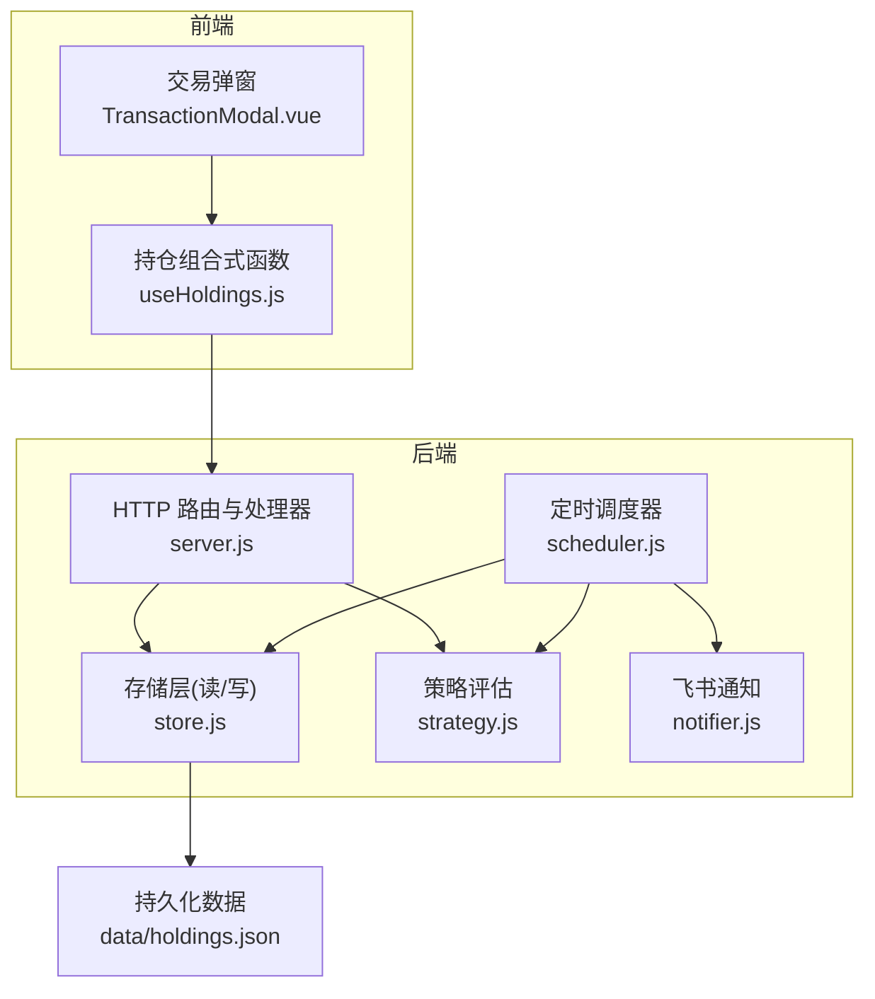
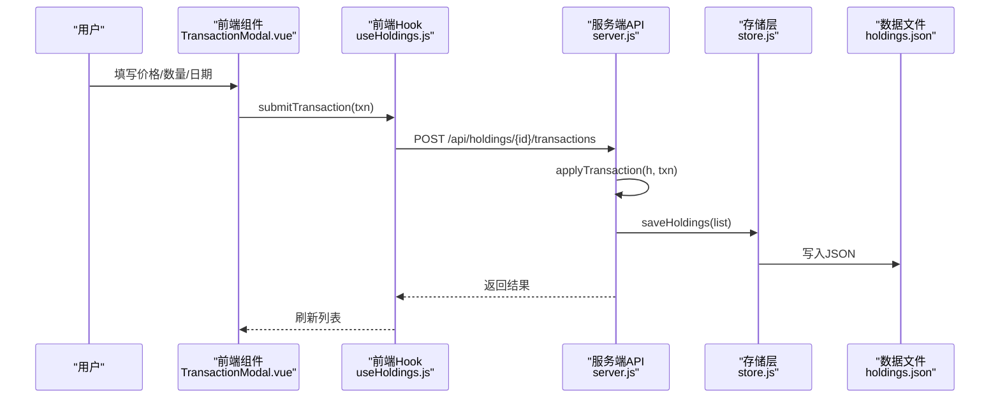
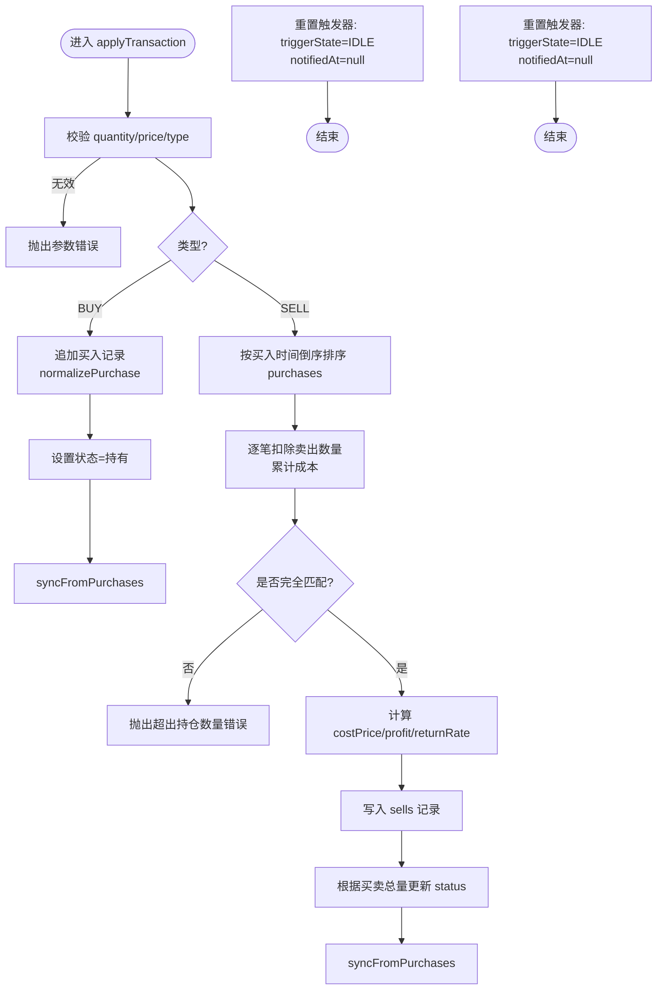
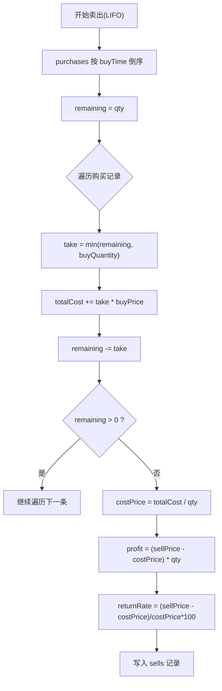
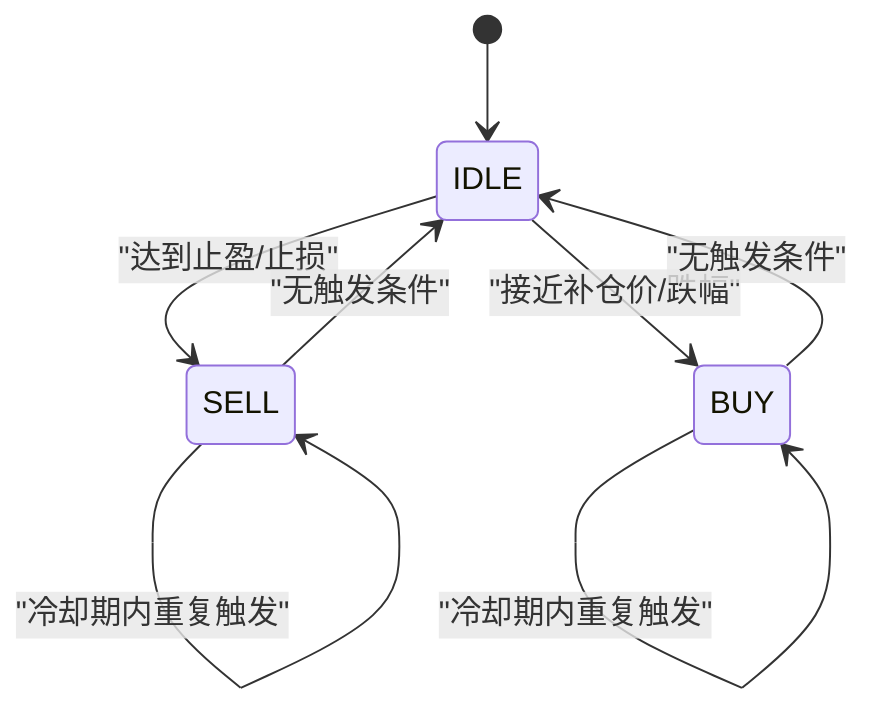
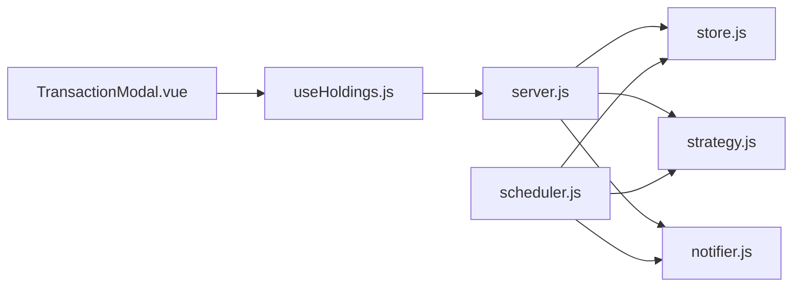

# 交易处理流程

<cite>
**本文引用的文件**
- [server.js](file://server/server.js)
- [store.js](file://server/store.js)
- [strategy.js](file://server/strategy.js)
- [scheduler.js](file://server/scheduler.js)
- [notifier.js](file://server/notifier.js)
- [useHoldings.js](file://web/src/composables/useHoldings.js)
- [TransactionModal.vue](file://web/src/components/TransactionModal.vue)
- [holdings.json](file://data/holdings.json)
</cite>

## 目录
1. [简介](#简介)
2. [项目结构](#项目结构)
3. [核心组件](#核心组件)
4. [架构总览](#架构总览)
5. [详细组件分析](#详细组件分析)
6. [依赖关系分析](#依赖关系分析)
7. [性能考量](#性能考量)
8. [故障排查指南](#故障排查指南)
9. [结论](#结论)
10. [附录](#附录)

## 简介
本文档围绕 Stock Advisor 的交易处理流程，重点解析 applyTransaction 函数对买入与卖出操作的完整处理链路：参数校验、业务规则检查、状态更新、数据持久化；深入说明买入记录创建与持仓同步、卖出交易的 LIFO（后进先出）成本结转与盈亏计算；解释交易后的触发器状态机重置；梳理异常处理机制；并给出事务一致性与审计回滚的设计建议。

## 项目结构
系统由前端 Vue 应用与 Node.js 后端服务组成。前端通过 API 提交交易请求，后端负责校验、执行业务逻辑、持久化到 JSON 文件，并在调度周期中评估策略与推送通知。

图表来源
- [server.js:409-565](file://server/server.js#L409-L565)
- [store.js:40-70](file://server/store.js#L40-L70)
- [scheduler.js:65-165](file://server/scheduler.js#L65-L165)
- [strategy.js:34-90](file://server/strategy.js#L34-L90)
- [notifier.js:81-111](file://server/notifier.js#L81-L111)

章节来源
- [server.js:1-594](file://server/server.js#L1-L594)
- [store.js:1-71](file://server/store.js#L1-L71)
- [scheduler.js:1-178](file://server/scheduler.js#L1-L178)

## 核心组件
- 交易处理入口：applyTransaction 负责单条买入/卖出交易的核心逻辑，包括参数校验、记录追加、成本结转、状态更新与触发器重置。
- 数据持久化：store.js 提供 loadHoldings/saveHoldings，使用内存缓存与串行写入保证并发安全。
- 策略评估：strategy.js 根据当前价与加权止盈/止损阈值判断买点/卖点。
- 调度器：scheduler.js 周期性拉取行情、评估策略、发送通知并维护 triggerState 与 notifiedAt。
- 前端交互：useHoldings.js 封装提交交易等写操作；TransactionModal.vue 提供用户输入与错误展示。

章节来源
- [server.js:346-407](file://server/server.js#L346-L407)
- [store.js:40-70](file://server/store.js#L40-L70)
- [strategy.js:34-90](file://server/strategy.js#L34-L90)
- [scheduler.js:65-165](file://server/scheduler.js#L65-L165)
- [useHoldings.js:78-92](file://web/src/composables/useHoldings.js#L78-L92)
- [TransactionModal.vue:30-44](file://web/src/components/TransactionModal.vue#L30-L44)

## 架构总览
下图展示了从前端发起交易到后端处理、持久化以及后续调度评估的端到端流程。

图表来源
- [TransactionModal.vue:30-44](file://web/src/components/TransactionModal.vue#L30-L44)
- [useHoldings.js:78-92](file://web/src/composables/useHoldings.js#L78-L92)
- [server.js:529-543](file://server/server.js#L529-L543)
- [store.js:62-70](file://server/store.js#L62-L70)

## 详细组件分析

### applyTransaction 函数详解
applyTransaction 是交易处理的核心，承担以下职责：
- 参数验证：确保 quantity 与 price 为正数，type 为 BUY 或 SELL。
- 买入处理：
  - 将交易归一化为买入记录，包含 buyPrice、buyQuantity、buyTime、目标止盈/止损比例。
  - 追加到 purchases 数组，并将持仓状态置为“持有”。
  - 调用 syncFromPurchases 重新计算剩余成本、数量、均价及加权止盈/止损。
- 卖出处理（LIFO）：
  - 不修改原始买入记录，新增一条 sells 记录。
  - 按买入时间倒序排序 purchases，逐笔扣除卖出数量，累计成本，得到 costPrice。
  - 若无法完全匹配卖出数量，抛出“卖出数量超过持仓数量”的错误。
  - 计算 profit 与 returnRate，写入 sells。
  - 根据 totalBought 与 totalSold 更新 status（全部卖出/持有）。
- 状态机重置：
  - 交易后重置 triggerState 为 IDLE，清空 notifiedAt，使下一轮调度重新评估。
- 数据同步：
  - 调用 syncFromPurchases 保持汇总字段与明细一致。

图表来源
- [server.js:346-407](file://server/server.js#L346-L407)
- [server.js:247-284](file://server/server.js#L247-L284)

章节来源
- [server.js:346-407](file://server/server.js#L346-L407)
- [server.js:247-284](file://server/server.js#L247-L284)

### 买入交易处理逻辑
- 记录创建：通过 normalizePurchase 生成唯一 id、标准化 buyPrice/buyQuantity/buyTime，并继承持仓级 targetProfitRate/stopLossRate。
- 状态更新：将持仓状态设置为“持有”，表示仍有未售出仓位。
- 成本同步：调用 syncFromPurchases 计算剩余成本、数量、均价，以及加权止盈/止损比例。
- 触发器管理：交易后重置 triggerState 与 notifiedAt，避免沿用旧触发态。

章节来源
- [server.js:286-300](file://server/server.js#L286-L300)
- [server.js:346-364](file://server/server.js#L346-L364)
- [server.js:247-284](file://server/server.js#L247-L284)

### 卖出交易的 LIFO 算法实现
- 排序：将 purchases 按 buyTime 倒序排列，模拟“后进先出”。
- 分批扣除：遍历排序后的购买记录，每次取 remaining 与 buyQuantity 的较小值作为扣除量，累加对应成本。
- 成本结转：totalCost / qty 得到 costPrice，用于后续盈亏计算。
- 盈亏计算：profit = (sellPrice - costPrice) * qty；returnRate = (sellPrice - costPrice) / costPrice * 100。
- 状态更新：比较 totalBought 与 totalSold，决定 status 为“全部卖出”或“持有”。

图表来源
- [server.js:364-397](file://server/server.js#L364-L397)

章节来源
- [server.js:364-397](file://server/server.js#L364-L397)

### 交易后的状态机转换
- 触发器状态：applyTransaction 将 triggerState 重置为 IDLE，notifiedAt 清空，确保下一次调度能重新评估。
- 调度器中的状态机：
  - 若无触发条件，将 triggerState 设为 IDLE。
  - 若有触发且不在冷却窗口内，发送通知并设置 triggerState 与 notifiedAt。
  - 冷却窗口由配置项 cooldownSeconds 控制，防止重复通知。

图表来源
- [scheduler.js:126-157](file://server/scheduler.js#L126-L157)
- [server.js:402-406](file://server/server.js#L402-L406)

章节来源
- [scheduler.js:126-157](file://server/scheduler.js#L126-L157)
- [server.js:402-406](file://server/server.js#L402-L406)

### 异常处理机制
- 参数校验错误：quantity/price 非正或 type 非法时抛出错误，API 层捕获并返回 400。
- 数量不足：卖出数量超过持仓数量时抛出错误，阻止不一致状态写入。
- 重复交易：前端在提交前可基于本地状态进行简单校验；后端以数据为准，通过 LIFO 与状态更新保证一致性。
- 网络与外部依赖：fetch 失败时捕获错误并返回友好提示；飞书通知失败有重试与错误日志。

章节来源
- [server.js:346-400](file://server/server.js#L346-L400)
- [server.js:529-543](file://server/server.js#L529-L543)
- [notifier.js:96-111](file://server/notifier.js#L96-L111)

### 事务一致性与数据完整性
- 原子性：applyTransaction 在内存中对 h 对象进行修改，随后通过 saveHoldings 一次性写入磁盘。若写入失败，writeChain 会记录错误但不影响内存状态；下次读取时会从磁盘恢复。
- 并发安全：saveHoldings 使用 Promise 链串行写入，避免多请求同时写造成覆盖。
- 数据迁移：首次加载时自动将旧版扁平结构迁移为 purchases 模型，并写回磁盘，保证数据结构一致性。
- 建议的事务增强：
  - 引入轻量事务包装：在执行 applyTransaction 前保存快照，若后续步骤失败则回滚到快照。
  - 增加幂等键：为每笔交易生成幂等标识，防止重复提交导致重复记录。
  - 审计日志：记录每次交易的入参、结果、时间戳与操作者，便于追踪与审计。

章节来源
- [store.js:40-70](file://server/store.js#L40-L70)
- [server.js:529-543](file://server/server.js#L529-L543)

## 依赖关系分析
- server.js 依赖 store.js 进行读写，依赖 strategy.js 进行评估，依赖 notifier.js 发送通知。
- scheduler.js 依赖 store.js、strategy.js、notifier.js，周期性运行并更新状态。
- useHoldings.js 与 TransactionModal.vue 构成前端交易入口，调用后端 /api/holdings/{id}/transactions。

图表来源
- [TransactionModal.vue:30-44](file://web/src/components/TransactionModal.vue#L30-L44)
- [useHoldings.js:78-92](file://web/src/composables/useHoldings.js#L78-L92)
- [server.js:409-565](file://server/server.js#L409-L565)
- [scheduler.js:65-165](file://server/scheduler.js#L65-L165)

章节来源
- [server.js:409-565](file://server/server.js#L409-L565)
- [scheduler.js:65-165](file://server/scheduler.js#L65-L165)

## 性能考量
- 内存缓存：loadHoldings 仅在文件 mtime 变化时重读，减少 IO 开销。
- 串行写入：saveHoldings 使用 writeChain 避免并发写冲突。
- 批量评估：调度器按市场类型分流拉取行情，降低 API 调用次数。
- 冷却机制：notifiedAt 与 cooldownSeconds 避免频繁通知。

[本节为通用指导，无需特定文件引用]

## 故障排查指南
- 交易失败（400）：检查 quantity/price 是否为正，type 是否正确；查看后端错误消息。
- 卖出数量不足：确认 purchases 总量大于等于 sellQuantity；若仍报错，检查是否存在并发修改。
- 通知未触发：检查 triggerState 与 notifiedAt；确认冷却窗口配置；查看调度器日志。
- 数据不同步：确认 syncFromPurchases 被调用；检查 holdings.json 中 purchases/sells 是否一致。

章节来源
- [server.js:529-543](file://server/server.js#L529-L543)
- [scheduler.js:126-157](file://server/scheduler.js#L126-L157)
- [store.js:40-70](file://server/store.js#L40-L70)

## 结论
applyTransaction 实现了买入与卖出的核心业务逻辑，结合 LIFO 成本结转、状态机重置与数据同步，保证了交易处理的正确性与一致性。配合调度器的策略评估与通知机制，系统能够及时提醒买卖点。建议在现有基础上引入事务包装、幂等键与审计日志，进一步提升可靠性与可追溯性。

[本节为总结，无需特定文件引用]

## 附录
- 数据结构示例：参考 holdings.json 中的 purchases/sells 字段，理解买入与卖出记录的落盘格式。
- 前端交互：TransactionModal.vue 与 useHoldings.js 展示了交易提交流程与错误处理。

章节来源
- [holdings.json:1-462](file://data/holdings.json#L1-L462)
- [TransactionModal.vue:30-44](file://web/src/components/TransactionModal.vue#L30-L44)
- [useHoldings.js:78-92](file://web/src/composables/useHoldings.js#L78-L92)