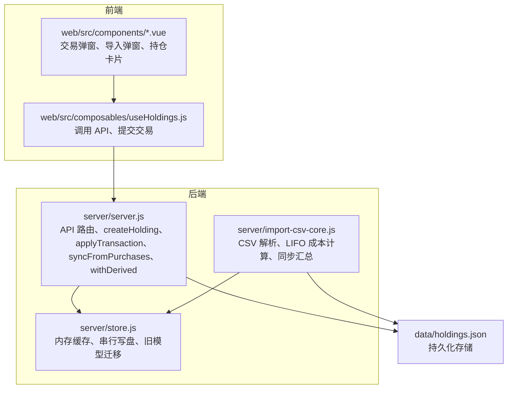
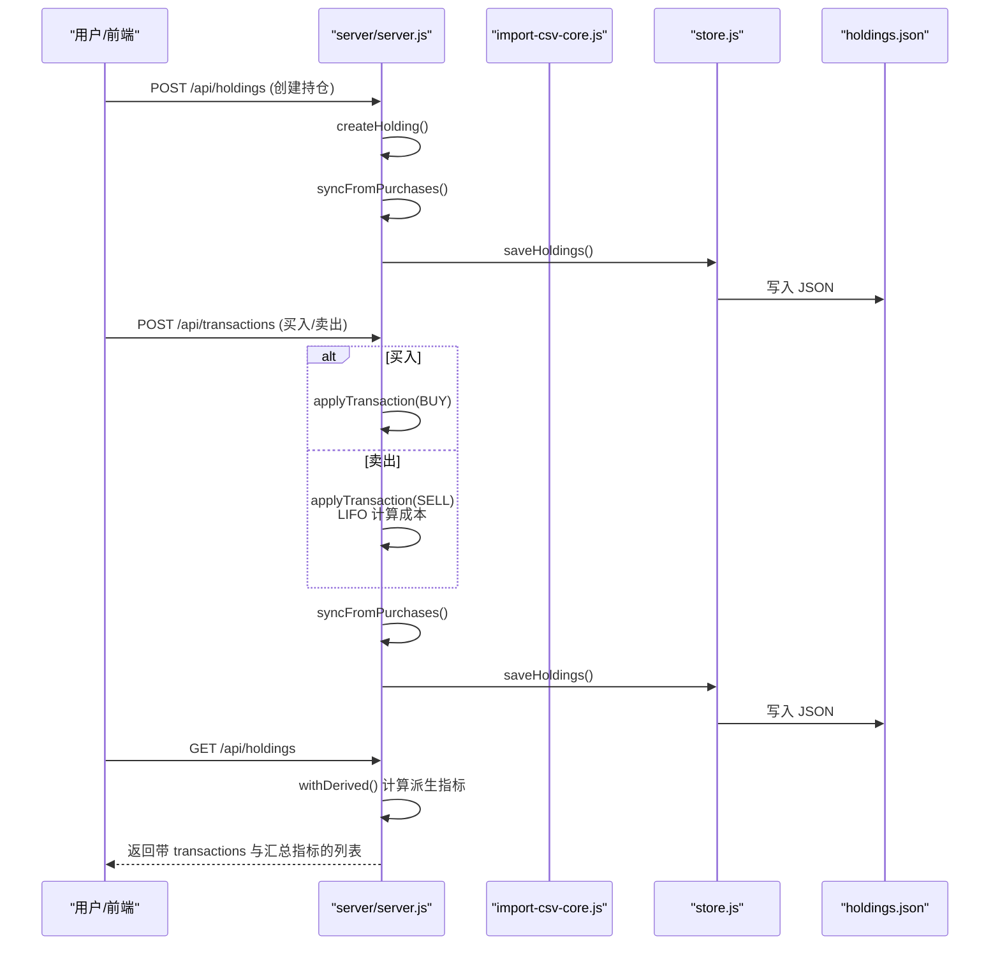
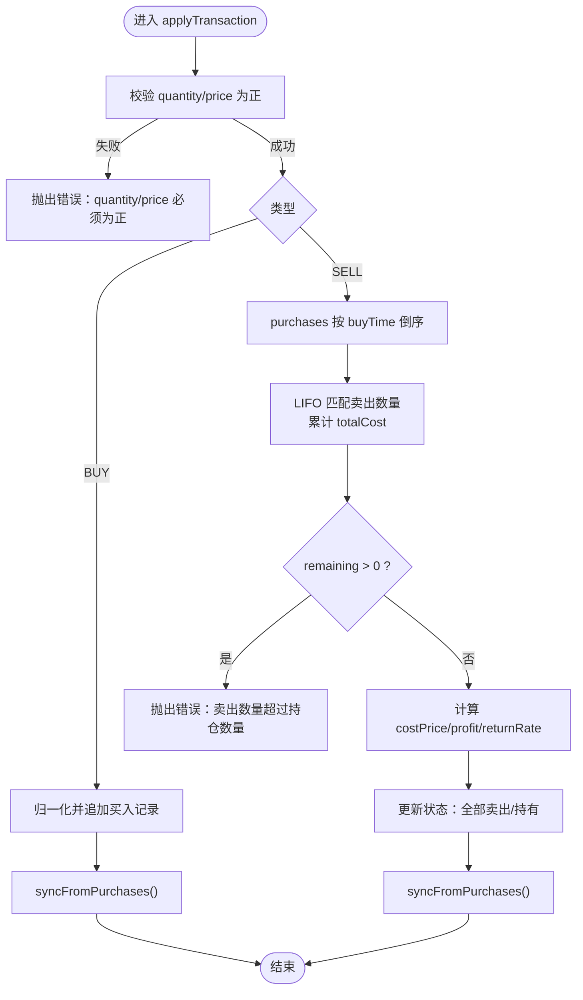
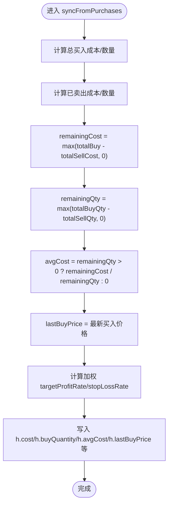
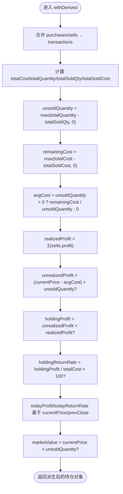
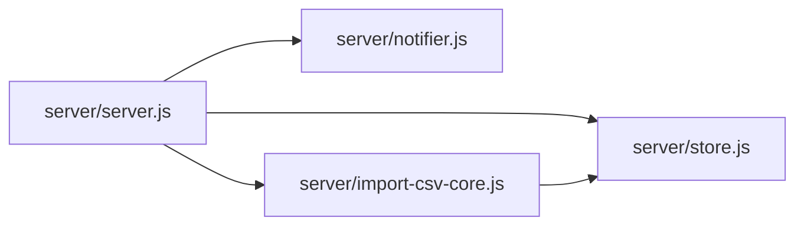

# 持仓管理核心算法

<cite>
**本文引用的文件**
- [server/server.js](file://server/server.js)
- [server/import-csv-core.js](file://server/import-csv-core.js)
- [server/store.js](file://server/store.js)
- [docs/盈亏计算规则.md](file://docs/盈亏计算规则.md)
</cite>

## 目录
1. [简介](#简介)
2. [项目结构](#项目结构)
3. [核心组件](#核心组件)
4. [架构总览](#架构总览)
5. [详细组件分析](#详细组件分析)
6. [依赖关系分析](#依赖关系分析)
7. [性能考量](#性能考量)
8. [故障排查指南](#故障排查指南)
9. [结论](#结论)
10. [附录](#附录)

## 简介
本文件聚焦 Stock Advisor 的“持仓管理核心算法”，围绕以下关键点展开：
- createHolding 创建的持仓对象结构与字段校验
- applyTransaction 的买入/卖出处理机制，重点实现 LIFO（后进先出）卖出原则
- syncFromPurchases 的成本同步与剩余仓位计算
- 派生字段的计算逻辑与边界条件（均价、市值、持有收益等）
- 业务规则示例与错误处理机制

该文档旨在帮助开发者准确理解投资计算的核心算法，并在扩展或维护时保持行为一致。

## 项目结构
本项目采用前后端分离：后端 Node.js 提供 HTTP API 与数据持久化，前端 Vue 负责交互展示。核心算法集中在后端 server 层，CSV 导入逻辑在独立模块中复用同一套计算规则。

图表来源
- [server/server.js:146-245](file://server/server.js#L146-L245)
- [server/import-csv-core.js:60-80](file://server/import-csv-core.js#L60-L80)
- [server/store.js:40-70](file://server/store.js#L40-L70)

章节来源
- [server/server.js:146-245](file://server/server.js#L146-L245)
- [server/import-csv-core.js:60-80](file://server/import-csv-core.js#L60-L80)
- [server/store.js:40-70](file://server/store.js#L40-L70)

## 核心组件
- 持仓创建与校验：createHolding
- 交易处理：applyTransaction（BUY/SELL）
- 成本同步：syncFromPurchases
- 派生指标：withDerived（均价、市值、持有收益、今日收益等）
- CSV 导入：importCsvText（复用 LIFO 与同步逻辑）

章节来源
- [server/server.js:302-344](file://server/server.js#L302-L344)
- [server/server.js:346-407](file://server/server.js#L346-L407)
- [server/server.js:247-284](file://server/server.js#L247-L284)
- [server/server.js:146-245](file://server/server.js#L146-L245)
- [server/import-csv-core.js:130-156](file://server/import-csv-core.js#L130-L156)
- [server/import-csv-core.js:170-306](file://server/import-csv-core.js#L170-L306)

## 架构总览
下图展示了从用户操作到数据落盘的完整流程，包括买入、卖出、同步与派生计算。

图表来源
- [server/server.js:302-344](file://server/server.js#L302-L344)
- [server/server.js:346-407](file://server/server.js#L346-L407)
- [server/server.js:146-245](file://server/server.js#L146-L245)
- [server/store.js:40-70](file://server/store.js#L40-L70)

## 详细组件分析

### createHolding：持仓对象结构与字段校验
- 必需字段校验：name、code、region、type 必须存在且非空字符串（trim 后）。任一缺失将抛出错误。
- 初始化字段：
  - id：唯一标识
  - name/code：标准化为字符串并去空白
  - status：初始为“持有”
  - region/type：透传
  - strategy/snapshotDate/snapshotProfit/snapshotReturnRate/position：可空或默认值
  - purchases：允许为空（支持“先建仓、后补买入记录”）
  - sells：初始为空数组
  - 补仓计划与告警阈值：refillDropRate/refillPrice/nextStrategy/dailyDropAlertPct/dailyRiseAlertPct/dailyAlertSentDate
  - 行情相关：currentPrice/prevClose/lastUpdated
  - 触发态：triggerState/notifiedAt
- 创建完成后立即调用 syncFromPurchases 以计算初始的剩余成本、数量、均价及加权止盈止损。

章节来源
- [server/server.js:302-344](file://server/server.js#L302-L344)

### applyTransaction：买入/卖出处理与 LIFO 卖出原则
- 参数校验：quantity 与 price 必须为正数，否则抛错。
- 买入（BUY）：
  - 归一化买入记录（normalizePurchase），包含 buyPrice/buyQuantity/buyTime/targetProfitRate/stopLossRate
  - 追加至 h.purchases，状态置为“持有”
- 卖出（SELL）：
  - 不修改任何买入记录，新增一条卖出记录
  - LIFO 成本计算：
    - 将 purchases 按 buyTime 倒序排序
    - 从最新买入开始匹配，累计 take = min(remaining, p.buyQuantity)，累加 totalCost += take × buyPrice
    - 若循环结束后 remaining > 0，说明卖出数量超过持仓数量，抛错
  - 计算卖出成本均价 costPrice = totalCost / qty，以及 profit 与 returnRate
  - 更新状态：当累计卖出数量 ≥ 累计买入数量时，状态变为“全部卖出”
- 交易后统一调用 syncFromPurchases 重新计算剩余成本/数量/均价，并重置触发态与通知时间。

图表来源
- [server/server.js:346-407](file://server/server.js#L346-L407)

章节来源
- [server/server.js:346-407](file://server/server.js#L346-L407)

### syncFromPurchases：成本同步与剩余仓位计算
- 总买入成本与数量：对 purchases 求和
- 已卖出成本与数量：对 sells 求和（每笔 sell 的 costPrice 已在卖出时按 LIFO 计算）
- 剩余成本与数量：
  - remainingCost = max(总买入成本 − 已卖出成本, 0)
  - remainingQty = max(总买入数量 − 已卖出数量, 0)
- 剩余均价：avgCost = remainingQty > 0 ? remainingCost / remainingQty : 0
- 最近买入价：取最新一笔买入记录的 buyPrice
- 持仓级加权止盈/止损：基于各笔买入成本加权平均
- 最终落盘前将上述结果写入 h.cost/h.buyQuantity/h.avgCost/h.lastBuyPrice 等字段

图表来源
- [server/server.js:247-284](file://server/server.js#L247-L284)

章节来源
- [server/server.js:247-284](file://server/server.js#L247-L284)

### withDerived：派生字段的计算与边界条件
- 合并交易流水：将 purchases 与 sells 合并并按日期倒序排列，形成 transactions
- 基础汇总：
  - totalCost：所有买入记录的成本之和
  - totalQuantity：所有买入数量之和
  - totalSoldQty/totalSoldCost：卖出数量与成本之和
  - unsoldQuantity：max(totalQuantity - totalSoldQty, 0)
  - remainingCost：max(totalCost - totalSoldCost, 0)
  - avgCost：unsoldQuantity > 0 ? remainingCost / unsoldQuantity : 0
- 盈亏指标：
  - realizedProfit：所有卖出记录的 profit 之和
  - unrealizedProfit：当有 currentPrice 且 unsoldQuantity > 0 且 avgCost > 0 时，(currentPrice - avgCost) × unsoldQuantity；否则为 null
  - holdingProfit：若 unrealizedProfit 不为空则为其 + realizedProfit；否则仅 realizedProfit（若非零）；否则 null
  - holdingReturnRate：holdingProfit != null 且 totalCost > 0 时，(holdingProfit / totalCost) × 100；否则 null
- 今日收益：
  - todayProfit：当有 currentPrice 与 prevClose 且 unsoldQuantity > 0 时，(currentPrice - prevClose) × unsoldQuantity；否则 null
  - todayReturnRate：prevClose > 0 时，(currentPrice - prevClose) / prevClose × 100；否则 null
- 其他：
  - marketValue：currentPrice × unsoldQuantity（若无现价则为 null）
  - lastBuyPrice：最新买入价格
  - dropRate：相对最近买入价的跌幅百分比（若有现价与 lastBuyPrice）

图表来源
- [server/server.js:146-245](file://server/server.js#L146-L245)

章节来源
- [server/server.js:146-245](file://server/server.js#L146-L245)

### CSV 导入中的 LIFO 与同步
- importCsvText 在解析 CSV 后，对每条记录：
  - 若为买入：归一化后追加至 purchases
  - 若为卖出：调用 computeSellCost（与 applyTransaction 一致的 LIFO 逻辑）计算 costPrice/profit/returnRate，并追加至 sells
- 每次处理后调用 syncFromPurchases 保证数据一致性
- 幂等性：同日期、同数量、同价格的重复明细会被跳过

章节来源
- [server/import-csv-core.js:170-306](file://server/import-csv-core.js#L170-L306)
- [server/import-csv-core.js:60-80](file://server/import-csv-core.js#L60-L80)

## 依赖关系分析
- server/server.js 依赖 store.js 进行数据读写，依赖 notifier.js 发送通知，依赖 import-csv-core.js 处理 CSV
- import-csv-core.js 复用与 server/server.js 相同的 LIFO 与同步逻辑，确保多入口一致性
- store.js 提供内存缓存与串行写盘，避免并发冲突，并在首次加载时对旧版扁平持仓模型进行迁移

图表来源
- [server/server.js:1-8](file://server/server.js#L1-L8)
- [server/store.js:40-70](file://server/store.js#L40-L70)
- [server/import-csv-core.js:60-80](file://server/import-csv-core.js#L60-L80)

章节来源
- [server/server.js:1-8](file://server/server.js#L1-L8)
- [server/store.js:40-70](file://server/store.js#L40-L70)
- [server/import-csv-core.js:60-80](file://server/import-csv-core.js#L60-L80)

## 性能考量
- LIFO 匹配复杂度：每次卖出需对 purchases 排序并线性扫描，时间复杂度 O(n log n + n)。对于常见持仓规模可接受；若未来规模显著增长，可考虑维护按 buyTime 索引的结构以减少排序开销。
- 同步频率：每次交易后调用 syncFromPurchases，保证数据一致性；在高并发场景下，store.js 的串行写盘避免了覆盖风险。
- 派生计算：withDerived 在查询时实时计算，避免冗余存储；若接口响应成为瓶颈，可对热点持仓做局部缓存。

[本节为通用指导，不直接分析具体文件]

## 故障排查指南
- 创建持仓失败：检查 name/code/region/type 是否为空或空白字符串；确认传入字段符合预期
- 交易失败：
  - quantity/price 必须为正数
  - 卖出数量不能超过当前持仓数量（LIFO 匹配后 remaining > 0 会抛错）
  - type 必须为 BUY 或 SELL
- CSV 导入异常：
  - 缺少必需列时会抛错
  - 重复明细会被跳过
  - 卖出超仓会记录到 errors 列表
- 数据不一致：
  - 确认是否调用了 syncFromPurchases（创建/交易后应自动调用）
  - 检查 store.js 的串行写盘是否被阻塞或报错

章节来源
- [server/server.js:302-344](file://server/server.js#L302-L344)
- [server/server.js:346-407](file://server/server.js#L346-L407)
- [server/import-csv-core.js:170-306](file://server/import-csv-core.js#L170-L306)
- [server/store.js:62-70](file://server/store.js#L62-L70)

## 结论
Stock Advisor 的持仓管理核心算法以“买入记录不可变、卖出记录独立”的设计为基础，通过 LIFO 精确计算卖出成本，并以 syncFromPurchases 与 withDerived 保障数据一致性与派生指标的正确性。该设计清晰、可扩展，适合后续增加更多策略与风控规则。

[本节为总结，不直接分析具体文件]

## 附录

### 关键公式与边界条件速查
- 卖出成本均价（LIFO）：costPrice = (按 buyTime 倒序匹配的买入成本之和) / sellQuantity
- 剩余成本/数量/均价：
  - remainingCost = max(总买入成本 − 已卖出成本, 0)
  - remainingQty = max(总买入数量 − 已卖出数量, 0)
  - avgCost = remainingQty > 0 ? remainingCost / remainingQty : 0
- 未实现盈亏：(currentPrice − avgCost) × unsoldQuantity（当有现价与均价时）
- 已实现盈亏：Σ(sells[].profit)
- 持仓总盈亏：未实现盈亏 + 已实现盈亏
- 持仓收益率：持仓总盈亏 / 总买入成本 × 100（分母为总买入成本）
- 今日盈亏：(currentPrice − prevClose) × unsoldQuantity（仅未卖出部分）
- 今日收益率：(currentPrice − prevClose) / prevClose × 100（prevClose > 0）

章节来源
- [docs/盈亏计算规则.md:59-143](file://docs/盈亏计算规则.md#L59-L143)
- [server/server.js:146-245](file://server/server.js#L146-L245)
- [server/server.js:247-284](file://server/server.js#L247-L284)
- [server/import-csv-core.js:60-80](file://server/import-csv-core.js#L60-L80)