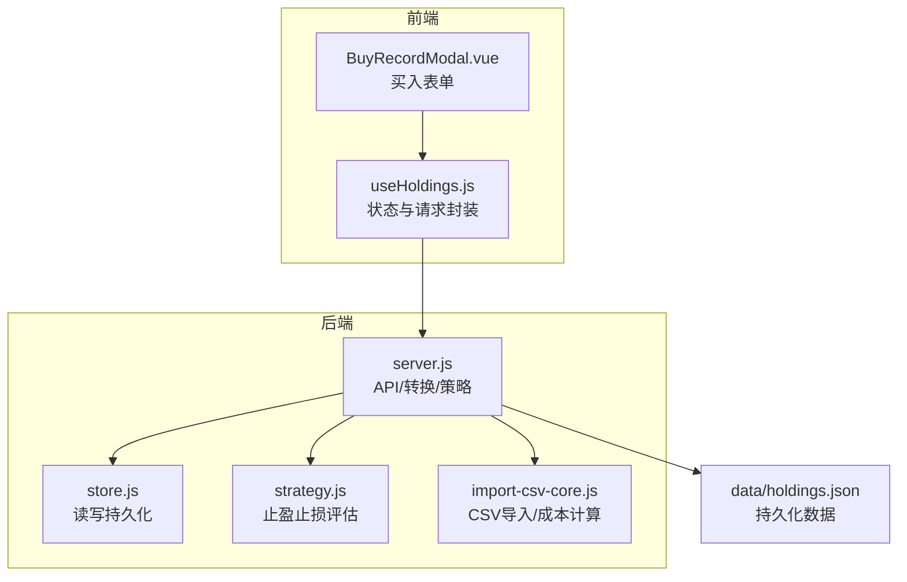
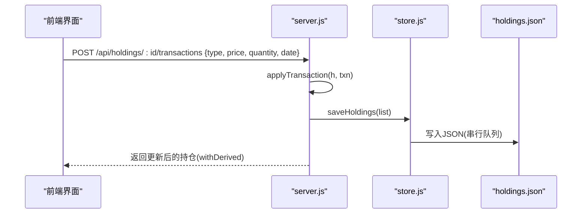
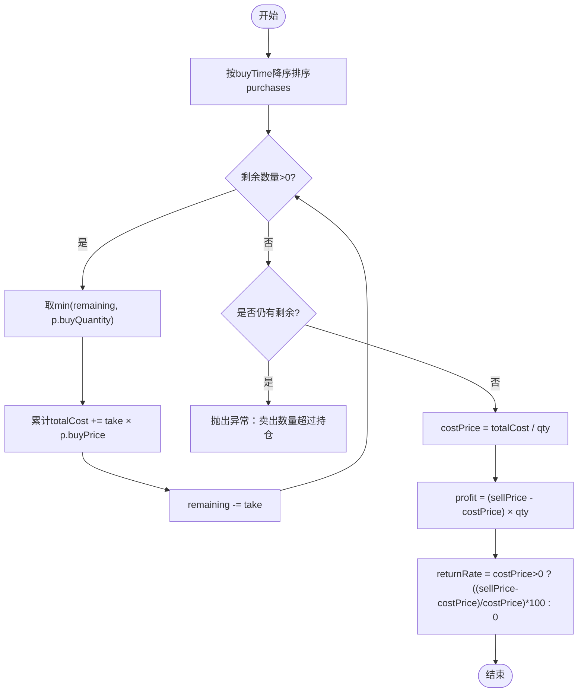
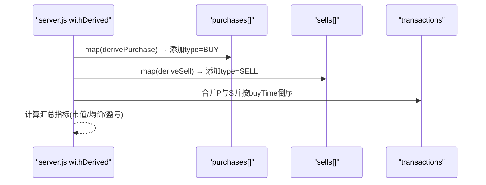
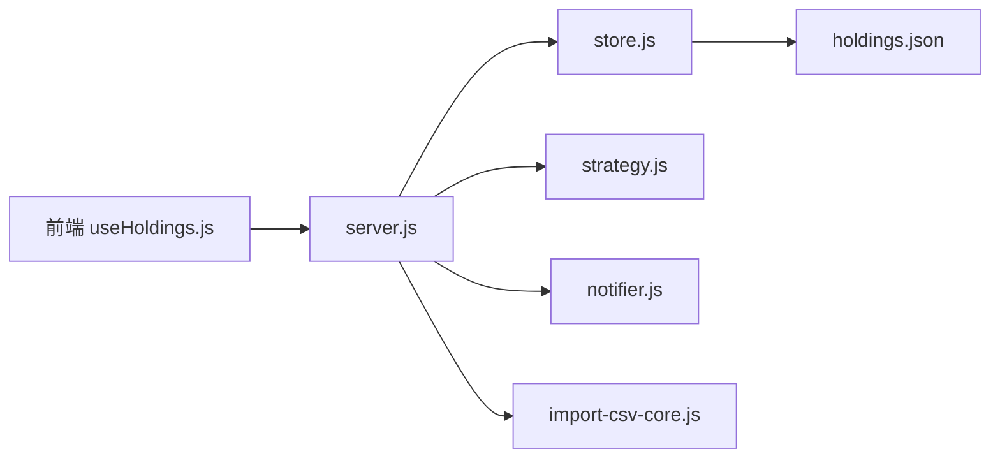

# 数据模型与转换

<cite>
**本文引用的文件**
- [server/store.js](file://server/store.js)
- [server/server.js](file://server/server.js)
- [server/strategy.js](file://server/strategy.js)
- [server/import-csv-core.js](file://server/import-csv-core.js)
- [data/holdings.json](file://data/holdings.json)
- [web/src/composables/useHoldings.js](file://web/src/composables/useHoldings.js)
- [web/src/components/BuyRecordModal.vue](file://web/src/components/BuyRecordModal.vue)
- [docs/盈亏计算规则.md](file://docs/盈亏计算规则.md)
</cite>

## 目录
1. [简介](#简介)
2. [项目结构](#项目结构)
3. [核心组件](#核心组件)
4. [架构总览](#架构总览)
5. [详细组件分析](#详细组件分析)
6. [依赖关系分析](#依赖关系分析)
7. [性能考虑](#性能考虑)
8. [故障排查指南](#故障排查指南)
9. [结论](#结论)
10. [附录](#附录)

## 简介
本文件系统性梳理 Stock Advisor 的数据模型与转换逻辑，重点覆盖：
- 买入记录的数据模型与 normalizePurchase 的字段校验、默认值与 ID 生成
- 卖出记录的 deriveSell 转换与 costPrice、profit、returnRate 的计算
- 持仓对象（Holding）的完整数据结构与约束
- transactions 合并逻辑与 BUY/SELL 类型标记
- 数据迁移、版本兼容性与数据完整性验证的最佳实践

## 项目结构
后端以 Node.js HTTP 服务为核心，负责：
- 读取/写入持久化数据 holdings.json
- 提供 REST API 管理持仓、交易与策略评估
- 将原始数据转换为前端可直接展示的派生结构

前端通过 Vue 组合式函数 useHoldings 调用后端接口，完成列表展示与写操作。

图表来源
- [server/server.js:1-200](file://server/server.js#L1-L200)
- [server/store.js:1-71](file://server/store.js#L1-L71)
- [server/strategy.js:1-91](file://server/strategy.js#L1-L91)
- [server/import-csv-core.js:38-97](file://server/import-csv-core.js#L38-L97)
- [web/src/composables/useHoldings.js:1-154](file://web/src/composables/useHoldings.js#L1-L154)
- [web/src/components/BuyRecordModal.vue:1-93](file://web/src/components/BuyRecordModal.vue#L1-L93)
- [data/holdings.json:1-462](file://data/holdings.json#L1-L462)

章节来源
- [server/server.js:1-200](file://server/server.js#L1-L200)
- [server/store.js:1-71](file://server/store.js#L1-L71)
- [server/strategy.js:1-91](file://server/strategy.js#L1-L91)
- [server/import-csv-core.js:38-97](file://server/import-csv-core.js#L38-L97)
- [web/src/composables/useHoldings.js:1-154](file://web/src/composables/useHoldings.js#L1-L154)
- [web/src/components/BuyRecordModal.vue:1-93](file://web/src/components/BuyRecordModal.vue#L1-L93)
- [data/holdings.json:1-462](file://data/holdings.json#L1-L462)

## 核心组件
- 存储层 store.js：负责加载/保存 holdings.json，并在首次加载或外部修改时进行旧版到新版模型的迁移。
- 业务层 server.js：实现 normalizePurchase、deriveSell、withDerived、applyTransaction、syncFromPurchases 等核心转换与聚合逻辑。
- 策略层 strategy.js：基于多次买入记录计算加权止盈/止损阈值，并评估触发买点/卖点。
- 导入层 import-csv-core.js：提供 CSV 导入时的归一化与 LIFO 成本计算，与后端保持一致。
- 前端 useHoldings.js：统一封装获取/提交数据的流程，保证前后端数据一致性。

章节来源
- [server/store.js:24-58](file://server/store.js#L24-L58)
- [server/server.js:85-144](file://server/server.js#L85-L144)
- [server/server.js:286-407](file://server/server.js#L286-L407)
- [server/strategy.js:5-90](file://server/strategy.js#L5-L90)
- [server/import-csv-core.js:38-97](file://server/import-csv-core.js#L38-L97)
- [web/src/composables/useHoldings.js:67-130](file://web/src/composables/useHoldings.js#L67-L130)

## 架构总览
系统围绕“多次买入 + 独立卖出”的交易模型构建。每次买入形成一条不可变的购买记录；卖出不会修改买入记录，而是追加一条卖出记录。展示层通过 withDerived 将 purchases 与 sells 合并为统一的 transactions 时间线，并计算汇总指标（市值、均价、已实现/未实现盈亏等）。

图表来源
- [server/server.js:346-407](file://server/server.js#L346-L407)
- [server/store.js:61-70](file://server/store.js#L61-L70)

章节来源
- [server/server.js:346-407](file://server/server.js#L346-L407)
- [server/store.js:61-70](file://server/store.js#L61-L70)

## 详细组件分析

### 买入记录数据模型与 normalizePurchase
- 字段定义
  - id：唯一标识，由 pid() 生成（前缀 p，时间戳+随机片段），确保全局唯一。
  - buyPrice：买入单价，必须为正数。
  - buyQuantity：买入数量，必须为正数。
  - buyTime：买入日期，若缺失则使用当前日期（YYYY-MM-DD）。
  - targetProfitRate：该笔止盈收益率%，缺省为 0。
  - stopLossRate：该笔止损收益率%，缺省为 0。
- 校验规则
  - buyPrice > 0 且 buyQuantity > 0，否则抛出错误。
- 默认值
  - buyTime：当输入为空时使用当天日期。
  - targetProfitRate、stopLossRate：缺省时为 0。
- ID 生成
  - 使用 pid() 生成稳定且唯一的 id，便于后续编辑/删除定位。

章节来源
- [server/server.js:85-118](file://server/server.js#L85-L118)
- [server/server.js:286-300](file://server/server.js#L286-L300)
- [server/import-csv-core.js:38-58](file://server/import-csv-core.js#L38-L58)
- [web/src/components/BuyRecordModal.vue:1-93](file://web/src/components/BuyRecordModal.vue#L1-L93)

### 卖出记录数据模型与 deriveSell
- 字段定义
  - id：唯一标识。
  - sellPrice：卖出单价。
  - sellQuantity：卖出数量。
  - sellDate/sellTime：卖出日期。
  - costPrice：按 LIFO 匹配的成本均价。
  - profit：该笔卖出的盈亏金额。
  - returnRate：该笔卖出的收益率%。
- 转换逻辑（deriveSell）
  - 将卖出记录标准化为与买入相同的展示结构（统一字段名 buyTime/buyPrice/buyQuantity），并补充 type='SELL'。
  - 计算 marketValue = sellPrice × sellQuantity。
  - 若未显式提供 profit/returnRate，则根据 sellPrice、costPrice、sellQuantity 计算。
- 成本计算（LIFO）
  - 将 purchases 按 buyTime 降序排序，从最新买入开始匹配卖出数量，累计成本后除以卖出数量得到 costPrice。
  - 若卖出数量超过可用持仓，抛出错误。

图表来源
- [server/server.js:364-392](file://server/server.js#L364-L392)
- [server/import-csv-core.js:60-80](file://server/import-csv-core.js#L60-L80)

章节来源
- [server/server.js:120-144](file://server/server.js#L120-L144)
- [server/server.js:364-392](file://server/server.js#L364-L392)
- [server/import-csv-core.js:60-80](file://server/import-csv-core.js#L60-L80)
- [docs/盈亏计算规则.md:59-105](file://docs/盈亏计算规则.md#L59-L105)

### 持仓对象（Holding）完整数据结构
- 基础信息
  - id、name、code、region、type、status、strategy、snapshotDate、snapshotProfit、snapshotReturnRate、position
- 交易记录
  - purchases[]：多条买入记录（不可变）
  - sells[]：多条卖出记录（追加）
- 策略配置
  - refillDropRate、refillPrice、nextStrategy
  - targetProfitRate、stopLossRate：按成本加权的均值（运行时/持久化同步）
- 行情数据
  - currentPrice、prevClose、lastUpdated
- 触发与通知
  - triggerState（IDLE/BUY/SELL）、notifiedAt
- 汇总指标（运行时派生）
  - cost、buyQuantity、lastBuyPrice、avgCost、marketValue、holdingProfit、todayProfit、realizedProfit、unrealizedProfit
- 约束与一致性
  - status 由买入/卖出总量决定（持有/全部卖出）
  - avgCost 基于剩余成本/剩余数量计算
  - holdingProfit = 未实现盈亏 + 已实现盈亏

章节来源
- [data/holdings.json:1-462](file://data/holdings.json#L1-L462)
- [server/server.js:146-218](file://server/server.js#L146-L218)
- [server/server.js:266-284](file://server/server.js#L266-L284)
- [server/server.js:394-407](file://server/server.js#L394-L407)
- [docs/盈亏计算规则.md:107-144](file://docs/盈亏计算规则.md#L107-L144)

### transactions 合并逻辑与类型标记
- 合并方式
  - 将 purchases 映射为 type='BUY' 的记录，sells 映射为 type='SELL' 的记录，合并后按 buyTime 倒序排列。
- 字段处理
  - BUY 记录：profit、returnRate 置 null（前端显示“-- / --”），targetPrice/stopLossPrice 保留。
  - SELL 记录：包含 cost、marketValue、profit、returnRate，targetProfitRate/stopLossRate 置 null。
- 用途
  - 统一时间线展示所有交易，便于用户查看买卖历史与收益明细。

图表来源
- [server/server.js:146-163](file://server/server.js#L146-L163)

章节来源
- [server/server.js:146-163](file://server/server.js#L146-L163)
- [docs/盈亏计算规则.md:147-175](file://docs/盈亏计算规则.md#L147-L175)

### 数据迁移、版本兼容性与数据完整性验证
- 数据迁移
  - 旧版持仓为扁平结构（单条买入），加载时检测 purchases 是否为数组；若不是，则迁移为「多次买入记录」模型，并写入磁盘。
  - 迁移过程中保留原 id 风格，并为新 purchases 生成新的 id。
- 版本兼容性
  - 读路径支持新旧两种结构；写路径始终输出标准 purchases[] 模型。
  - 外部手动修改文件时，通过 mtime 检测并重新加载，避免并发冲突。
- 数据完整性验证
  - normalizePurchase 强制 buyPrice、buyQuantity 为正数。
  - applyTransaction 在 SELL 时校验卖出数量不超过持仓，并抛出明确错误。
  - syncFromPurchases 在交易后重新计算剩余成本/数量/均价，保持数据一致。

章节来源
- [server/store.js:24-58](file://server/store.js#L24-L58)
- [server/server.js:346-407](file://server/server.js#L346-L407)
- [server/import-csv-core.js:60-80](file://server/import-csv-core.js#L60-L80)

## 依赖关系分析
- server.js 依赖 store.js 进行持久化读写，依赖 strategy.js 进行策略评估，依赖 notifier.js 发送通知。
- import-csv-core.js 复用 LIFO 成本计算逻辑，与后端保持一致。
- 前端 useHoldings.js 依赖后端 /api/holdings 与 /api/holdings/:id/transactions 等接口。

图表来源
- [server/server.js:1-200](file://server/server.js#L1-L200)
- [server/store.js:1-71](file://server/store.js#L1-L71)
- [server/strategy.js:1-91](file://server/strategy.js#L1-L91)
- [server/import-csv-core.js:38-97](file://server/import-csv-core.js#L38-L97)
- [web/src/composables/useHoldings.js:1-154](file://web/src/composables/useHoldings.js#L1-L154)

章节来源
- [server/server.js:1-200](file://server/server.js#L1-L200)
- [server/store.js:1-71](file://server/store.js#L1-L71)
- [server/strategy.js:1-91](file://server/strategy.js#L1-L91)
- [server/import-csv-core.js:38-97](file://server/import-csv-core.js#L38-L97)
- [web/src/composables/useHoldings.js:1-154](file://web/src/composables/useHoldings.js#L1-L154)

## 性能考虑
- 串行写盘：saveHoldings 使用 Promise 链串行写入，防止调度器与接口同时写造成覆盖。
- 内存缓存：loadHoldings 仅在首次加载或文件被外部修改时重新读盘，减少 I/O。
- 批量派生：withDerived 一次性计算 purchases/sells 的派生字段与汇总指标，避免重复计算。
- 策略评估：strategy.evaluate 基于加权阈值判断，复杂度 O(n)，n 为买入记录数。

章节来源
- [server/store.js:8-12](file://server/store.js#L8-L12)
- [server/store.js:40-58](file://server/store.js#L40-L58)
- [server/server.js:146-218](file://server/server.js#L146-L218)
- [server/strategy.js:5-90](file://server/strategy.js#L5-L90)

## 故障排查指南
- 常见错误
  - 买入价/数量非正：normalizePurchase 会抛出错误，检查输入数据。
  - 卖出数量超过持仓：applyTransaction 会抛出错误，核对 purchases 与 sells 的数量一致性。
  - JSON 解析失败：readBody 捕获 invalid json，检查请求体格式。
- 调试建议
  - 查看 holdings.json 中 purchases/sells 的结构是否符合预期。
  - 检查 withDerived 输出的 transactions 与汇总指标是否正确。
  - 确认 store.js 的 mtime 检测是否导致重复加载。

章节来源
- [server/server.js:286-300](file://server/server.js#L286-L300)
- [server/server.js:346-407](file://server/server.js#L346-L407)
- [server/server.js:60-73](file://server/server.js#L60-L73)
- [server/store.js:40-58](file://server/store.js#L40-L58)

## 结论
Stock Advisor 采用“多次买入 + 独立卖出”的交易模型，通过 normalizePurchase、deriveSell、withDerived、applyTransaction 等函数实现了严格的数据校验、一致的转换逻辑与完整的汇总计算。结合 store.js 的迁移与缓存机制，系统在版本兼容性与性能方面表现稳健。前端通过 useHoldings 统一封装接口调用，保证了用户体验与数据一致性。

## 附录
- 关键公式参考
  - 卖出成本（LIFO）：见 docs/盈亏计算规则.md §2.2
  - 持仓盈亏：未实现 + 已实现，见 docs/盈亏计算规则.md §3.2
  - 今日盈亏：仅基于剩余数量，见 docs/盈亏计算规则.md §3.2

章节来源
- [docs/盈亏计算规则.md:59-144](file://docs/盈亏计算规则.md#L59-L144)