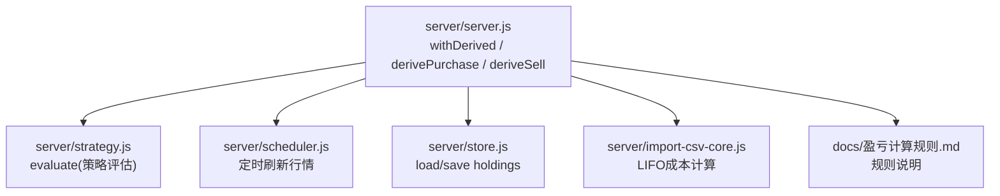
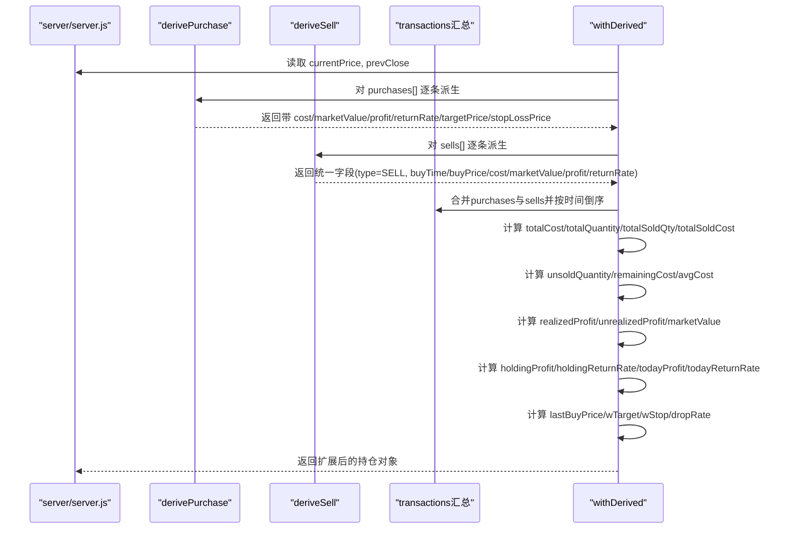
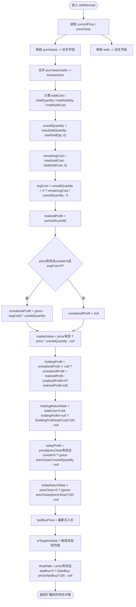
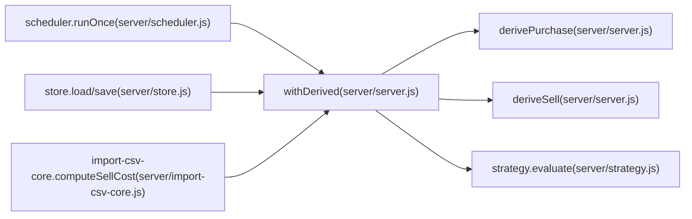

# 派生字段计算

<cite>
**本文引用的文件**
- [server/server.js](file://server/server.js)
- [server/strategy.js](file://server/strategy.js)
- [server/scheduler.js](file://server/scheduler.js)
- [server/store.js](file://server/store.js)
- [server/import-csv-core.js](file://server/import-csv-core.js)
- [docs/盈亏计算规则.md](file://docs/盈亏计算规则.md)
</cite>

## 目录
1. [简介](#简介)
2. [项目结构](#项目结构)
3. [核心组件](#核心组件)
4. [架构总览](#架构总览)
5. [详细组件分析](#详细组件分析)
6. [依赖关系分析](#依赖关系分析)
7. [性能与精度建议](#性能与精度建议)
8. [故障排查指南](#故障排查指南)
9. [结论](#结论)

## 简介
本文聚焦 Stock Advisor 中 withDerived 函数的派生字段计算逻辑，系统解释均价、市值、日收益、持有收益（未实现与已实现合并）、止盈止损阈值加权平均、跌幅 dropRate 的计算方法，并覆盖零持仓、负价格、NaN 等边界条件的安全处理。同时给出性能优化与数值精度控制的最佳实践。

## 项目结构
本项目的后端服务位于 server 目录，核心业务逻辑集中在 server/server.js（withDerived、derivePurchase、deriveSell、syncFromPurchases 等），策略评估在 server/strategy.js，行情调度与更新在 server/scheduler.js，数据持久化在 server/store.js，CSV 导入辅助在 server/import-csv-core.js，业务规则文档在 docs/盈亏计算规则.md。

图表来源
- [server/server.js:89-245](file://server/server.js#L89-L245)
- [server/strategy.js:34-90](file://server/strategy.js#L34-L90)
- [server/scheduler.js:65-133](file://server/scheduler.js#L65-L133)
- [server/store.js:40-70](file://server/store.js#L40-L70)
- [server/import-csv-core.js:60-80](file://server/import-csv-core.js#L60-L80)
- [docs/盈亏计算规则.md:50-145](file://docs/盈亏计算规则.md#L50-L145)

章节来源
- [server/server.js:89-245](file://server/server.js#L89-L245)
- [server/strategy.js:34-90](file://server/strategy.js#L34-L90)
- [server/scheduler.js:65-133](file://server/scheduler.js#L65-L133)
- [server/store.js:40-70](file://server/store.js#L40-L70)
- [server/import-csv-core.js:60-80](file://server/import-csv-core.js#L60-L80)
- [docs/盈亏计算规则.md:50-145](file://docs/盈亏计算规则.md#L50-L145)

## 核心组件
- withDerived：基于当前价与历史交易记录，计算所有展示用派生字段（均价、市值、今日收益、持有收益、跌幅、加权止盈止损等）。
- derivePurchase：为每条买入记录派生成本、市值、单笔收益率、目标价与止损价。
- deriveSell：为每条卖出记录派生成交额、实现盈亏与收益率。
- syncFromPurchases：落盘前根据买入/卖出记录反推剩余成本、数量、均价与加权阈值，保证持久化一致性。
- evaluate：策略引擎，基于均价、最近买入价与加权阈值判断卖点/买点。

章节来源
- [server/server.js:89-245](file://server/server.js#L89-L245)
- [server/server.js:247-284](file://server/server.js#L247-L284)
- [server/strategy.js:34-90](file://server/strategy.js#L34-L90)

## 架构总览
withDerived 的输入是持仓对象 h（包含 purchases[]、sells[]、currentPrice、prevClose 等），输出是扩展后的 h，新增 transactions、avgCost、marketValue、holdingProfit、todayProfit、dropRate 等字段。其调用链如下：

图表来源
- [server/server.js:89-245](file://server/server.js#L89-L245)

章节来源
- [server/server.js:89-245](file://server/server.js#L89-L245)

## 详细组件分析

### 均价计算（avgCost）
- 计算路径：先统计总买入成本 totalCost 与总买入数量 totalQuantity；再统计已卖出数量 totalSoldQty 与已卖出成本 totalSoldCost；得到未卖出数量 unsoldQuantity = max(totalQuantity - totalSoldQty, 0)；剩余成本 remainingCost = max(totalCost - totalSoldCost, 0)；最后 avgCost = unsoldQuantity > 0 ? remainingCost / unsoldQuantity : 0。
- 设计要点：使用 Math.max 避免负数；当无剩余仓位时均价归零，防止后续除零或误算。

章节来源
- [server/server.js:165-172](file://server/server.js#L165-L172)
- [docs/盈亏计算规则.md:81-92](file://docs/盈亏计算规则.md#L81-L92)

### 市场价值估算（marketValue）
- 计算路径：若 currentPrice 有效且非 NaN，则 marketValue = Number(currentPrice) * unsoldQuantity；否则为 null。
- 设计要点：仅在价格有效时计算，避免产生 NaN 或错误数值。

章节来源
- [server/server.js:182-183](file://server/server.js#L182-L183)

### 日收益统计（todayProfit / todayReturnRate）
- 计算路径：若 currentPrice 与 prevClose 均有效且 unsoldQuantity > 0，则 todayProfit = (Number(currentPrice) - Number(prevClose)) * unsoldQuantity；todayReturnRate = prevClose > 0 ? ((currentPrice - prevClose) / prevClose) * 100 : null。
- 设计要点：仅以未卖出份额计算当日浮动盈亏；昨日收盘价为零时不计算收益率。

章节来源
- [server/server.js:197-205](file://server/server.js#L197-L205)
- [docs/盈亏计算规则.md:136-143](file://docs/盈亏计算规则.md#L136-L143)

### 持有收益：未实现与已实现的合并
- 已实现收益 realizedProfit：对所有卖出记录的 profit 求和。
- 未实现收益 unrealizedProfit：若 price 有效、unsoldQuantity > 0 且 avgCost > 0，则 unrealizedProfit = (Number(price) - avgCost) * unsoldQuantity；否则为 null。
- 持有收益 holdingProfit：若 unrealizedProfit 有效，则 holdingProfit = unrealizedProfit + realizedProfit；否则若 realizedProfit 非零则取 realizedProfit；否则为 null。
- 持有收益率 holdingReturnRate：若 totalCost > 0 且 holdingProfit 有效，则 holdingReturnRate = (holdingProfit / totalCost) * 100；否则为 null。
- 设计要点：分母使用“总买入成本”而非“剩余成本”，体现全部投入的回报率；当无浮动盈亏但有已实现盈亏时仍显示已实现部分。

章节来源
- [server/server.js:174-195](file://server/server.js#L174-L195)
- [docs/盈亏计算规则.md:107-134](file://docs/盈亏计算规则.md#L107-L134)

### 止盈止损阈值的加权平均
- 单笔买入记录的目标价与止损价：targetPrice = buyPrice * (1 + targetProfitRate/100)，stopLossPrice = buyPrice * (1 - stopLossRate/100)。
- 持仓级加权均值：wTarget = Σ(targetProfitRate_i * cost_i) / totalCost；wStop = Σ(stopLossRate_i * cost_i) / totalCost。
- 最终输出：targetProfitRate = Number(h.targetProfitRate ?? wTarget) || wTarget；stopLossRate = Number(h.stopLossRate ?? wStop) || wStop。即优先使用持仓级显式设置，否则回退到按成本加权的买入记录均值。
- 设计要点：以每笔成本作为权重，反映不同批次买入对整体阈值的影响；当 totalCost 为零时阈值归零。

章节来源
- [server/server.js:100-108](file://server/server.js#L100-L108)
- [server/server.js:213-221](file://server/server.js#L213-L221)
- [server/server.js:238-239](file://server/server.js#L238-L239)
- [server/strategy.js:19-31](file://server/strategy.js#L19-L31)

### 跌幅 dropRate 的计算
- 计算路径：lastBuyPrice 为按买入时间排序的最新一笔买入价；若 currentPrice 有效且 lastBuyPrice > 0，则 dropRate = ((lastBuyPrice - currentPrice) / lastBuyPrice) * 100；否则为 null。
- 用途：用于补仓触发与策略评估中的“较最近买入价跌幅”。
- 设计要点：以最近一次买入价为基准，衡量短期回撤幅度；无有效价格或无买入记录时不计算。

章节来源
- [server/server.js:207-211](file://server/server.js#L207-L211)
- [server/server.js:240-243](file://server/server.js#L240-L243)
- [server/strategy.js:73-77](file://server/strategy.js#L73-L77)

### 交易流水与排序
- purchases 与 sells 分别映射为统一字段后，合并为 transactions，并按 buyTime 倒序排列，便于前端展示时间线。
- 买入记录在交易中 profit 与 returnRate 置空，表示未实现盈亏体现在汇总层面。

章节来源
- [server/server.js:151-163](file://server/server.js#L151-L163)
- [docs/盈亏计算规则.md:147-175](file://docs/盈亏计算规则.md#L147-L175)

### 落盘同步：syncFromPurchases
- 作用：在写入磁盘前，根据 purchases 与 sells 重新计算剩余成本、数量、均价与加权阈值，确保持久化数据与交易记录一致。
- 关键点：使用 LIFO 扣减卖出成本；对阈值进行 toFixed(2) 保留两位小数。

章节来源
- [server/server.js:247-284](file://server/server.js#L247-L284)
- [server/import-csv-core.js:60-80](file://server/import-csv-core.js#L60-L80)

### 流程图：withDerived 计算主流程

图表来源
- [server/server.js:147-245](file://server/server.js#L147-L245)

## 依赖关系分析
- withDerived 依赖 derivePurchase 与 deriveSell 完成明细派生，并依赖聚合逻辑计算汇总指标。
- strategy.evaluate 复用 avgCost、lastBuyPrice、wTarget、wStop 等值进行卖点/买点判断。
- scheduler.runOnce 负责更新 currentPrice/prevClose，并在更新后调用 evaluate 进行策略评估。
- store.loadHoldings/saveHoldings 提供内存缓存与串行写盘，避免并发冲突。
- import-csv-core.computeSellCost 与 applyTransaction 中的 LIFO 逻辑保持一致，确保 CSV 导入与在线操作的成本计算一致。

图表来源
- [server/server.js:89-245](file://server/server.js#L89-L245)
- [server/strategy.js:34-90](file://server/strategy.js#L34-L90)
- [server/scheduler.js:65-133](file://server/scheduler.js#L65-L133)
- [server/store.js:40-70](file://server/store.js#L40-L70)
- [server/import-csv-core.js:60-80](file://server/import-csv-core.js#L60-L80)

章节来源
- [server/server.js:89-245](file://server/server.js#L89-L245)
- [server/strategy.js:34-90](file://server/strategy.js#L34-L90)
- [server/scheduler.js:65-133](file://server/scheduler.js#L65-L133)
- [server/store.js:40-70](file://server/store.js#L40-L70)
- [server/import-csv-core.js:60-80](file://server/import-csv-core.js#L60-L80)

## 性能与精度建议
- 批量映射与排序：purchases 与 sells 的 map 与 sort 可考虑在数据量较大时使用稳定排序与最小化拷贝，减少临时数组创建。
- 中间变量复用：将 totalCost、totalQuantity、totalSoldQty、totalSoldCost 等重复使用的聚合结果缓存，避免多次 reduce。
- 数值精度：对百分比与金额输出统一使用 toFixed(n) 控制显示精度；内部计算保持双精度浮点，必要时引入定点运算库以避免累积误差。
- 条件短路：在计算 before 做有效性检查（如 price != null && !isNaN(price)），避免无效分支执行。
- 写盘节流：store.saveHoldings 已采用 Promise 链串行写盘，建议在高频场景下进一步合并写盘窗口或使用批处理。
- 缓存策略：对于只读派生字段（如 transactions）可在请求级别缓存，减少重复计算。

[本节为通用性能指导，不直接分析具体代码行]

## 故障排查指南
- 零持仓：当 unsoldQuantity 为零时，avgCost 归零，unrealizedProfit 与 todayProfit 均为 null，避免除零与错误收益。
- 负价格或 NaN：在 derivePurchase 中对 hasPrice 进行检查，确保 marketValue、profit、returnRate 在价格无效时为 null；withDerived 中 marketValue、todayProfit 同样进行有效性判断。
- 卖出数量超限：applyTransaction 与 computeSellCost 在 LIFO 匹配失败时抛出错误，需检查买入记录是否足以覆盖卖出数量。
- 阈值异常：当 totalCost 为零时，wTarget 与 wStop 归零；若持仓级显式设置了 targetProfitRate/stopLossRate，则以显式值为准。
- 数据不一致：通过 syncFromPurchases 在落盘前重算剩余成本/数量/均价与阈值，确保持久化数据与交易记录一致。

章节来源
- [server/server.js:90-118](file://server/server.js#L90-L118)
- [server/server.js:177-183](file://server/server.js#L177-L183)
- [server/server.js:347-379](file://server/server.js#L347-L379)
- [server/import-csv-core.js:60-80](file://server/import-csv-core.js#L60-L80)
- [server/server.js:247-284](file://server/server.js#L247-L284)

## 结论
withDerived 实现了从原始交易记录到展示层指标的完整派生链路，涵盖均价、市值、日收益、持有收益、跌幅与加权止盈止损等关键指标。其设计充分考虑了边界条件与数值安全，并通过 syncFromPurchases 保障数据一致性。结合策略评估与调度刷新，形成了从数据采集、计算到决策提示的闭环。建议在大数据量场景下进一步优化聚合与排序性能，并统一数值精度控制以提升展示与告警的稳定性。