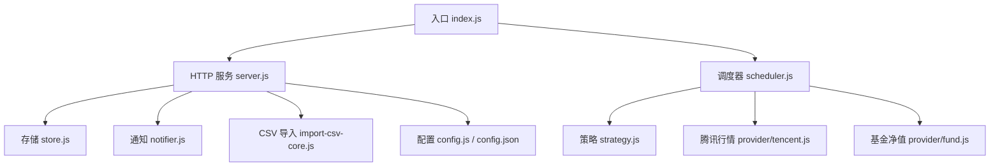
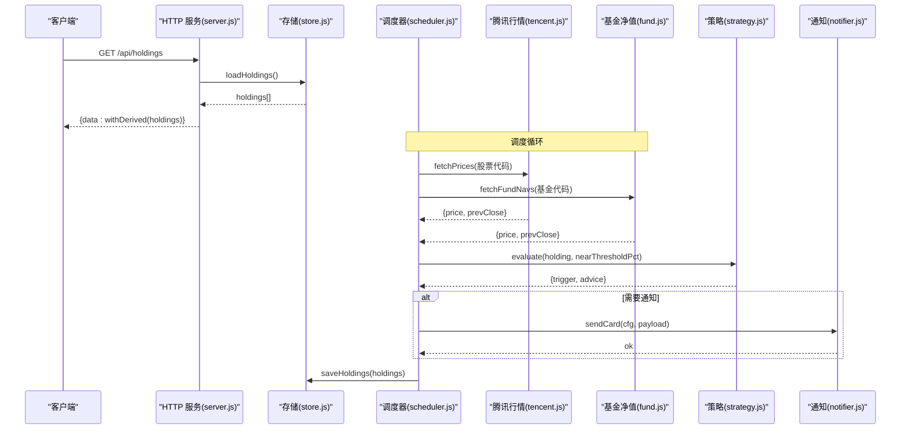
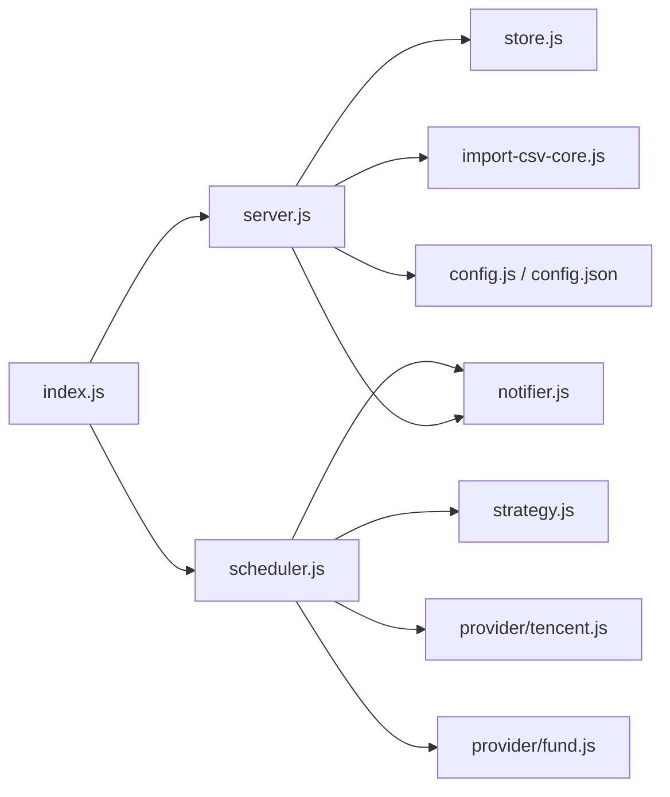

# 后端服务

<cite>
**本文引用的文件**
- [server/index.js](file://server/index.js)
- [server/server.js](file://server/server.js)
- [server/config.js](file://server/config.js)
- [config.json](file://config.json)
- [server/store.js](file://server/store.js)
- [server/notifier.js](file://server/notifier.js)
- [server/scheduler.js](file://scheduler.js)
- [server/import-csv-core.js](file://server/import-csv-core.js)
- [server/strategy.js](file://server/strategy.js)
- [server/provider/tencent.js](file://server/provider/tencent.js)
- [server/provider/fund.js](file://server/provider/fund.js)
- [package.json](file://package.json)
- [start.sh](file://start.sh)
- [docs/盈亏计算规则.md](file://docs/盈亏计算规则.md)
</cite>

## 目录
1. [简介](#简介)
2. [项目结构](#项目结构)
3. [核心组件](#核心组件)
4. [架构总览](#架构总览)
5. [详细组件分析](#详细组件分析)
6. [依赖关系分析](#依赖关系分析)
7. [性能考量](#性能考量)
8. [故障排查指南](#故障排查指南)
9. [结论](#结论)
10. [附录：API 接口规范与集成指南](#附录api-接口规范与集成指南)

## 简介
本仓库为“股票秘书”后端服务，提供持仓管理、交易记录处理、成本与盈亏计算、行情定时抓取、飞书机器人通知等能力。后端基于 Node.js HTTP 原生模块实现轻量 API，配合前端静态资源托管；通过调度器按市场交易时段动态调整刷新频率，结合策略引擎触发买卖提醒并推送至飞书。数据持久化采用 JSON 文件，支持 CSV 批量导入与幂等写入。

## 项目结构
- server：后端核心逻辑（HTTP 路由、存储、调度、策略、通知、CSV 导入、数据源适配）
- web：前端工程（Vite + Vue），构建产物由后端托管
- data：持久化数据（holdings.json 及备份）
- config.json：运行时配置（调度间隔、服务器端口、飞书 webhook、通知冷却等）
- docs：业务规则文档（如盈亏计算规则）

图表来源
- [server/index.js:1-17](file://server/index.js#L1-L17)
- [server/server.js:567-594](file://server/server.js#L567-L594)
- [server/scheduler.js:167-178](file://server/scheduler.js#L167-L178)
- [server/store.js:40-71](file://server/store.js#L40-L71)
- [server/notifier.js:81-112](file://server/notifier.js#L81-L112)
- [server/import-csv-core.js:170-307](file://server/import-csv-core.js#L170-L307)
- [server/strategy.js:34-91](file://server/strategy.js#L34-L91)
- [server/provider/tencent.js:6-42](file://server/provider/tencent.js#L6-L42)
- [server/provider/fund.js:6-55](file://server/provider/fund.js#L6-L55)
- [server/config.js:7-11](file://server/config.js#L7-L11)
- [config.json:1-19](file://config.json#L1-L19)

章节来源
- [server/index.js:1-17](file://server/index.js#L1-L17)
- [package.json:1-32](file://package.json#L1-L32)
- [start.sh:1-100](file://start.sh#L1-L100)

## 核心组件
- HTTP 服务与路由：统一处理 /api/* 接口与静态页面托管，内置请求体解析、JSON 响应封装、错误兜底
- 数据存储：内存缓存 + 文件持久化，串行写盘避免并发覆盖，支持旧模型迁移
- 调度器：按市场交易时段选择刷新间隔，拉取行情、评估策略、发送通知、落盘状态
- 策略引擎：基于多次买入记录的加权止盈/止损与补仓条件判断
- 通知系统：构造飞书卡片消息，支持签名与重试
- CSV 导入：解析 CSV、匹配代码、幂等插入、自动创建缺失持仓

章节来源
- [server/server.js:55-87](file://server/server.js#L55-L87)
- [server/store.js:8-71](file://server/store.js#L8-L71)
- [server/scheduler.js:65-178](file://server/scheduler.js#L65-L178)
- [server/strategy.js:34-91](file://server/strategy.js#L34-L91)
- [server/notifier.js:4-112](file://server/notifier.js#L4-L112)
- [server/import-csv-core.js:170-307](file://server/import-csv-core.js#L170-L307)

## 架构总览
后端以单进程模式运行，启动时加载配置，启动 HTTP 服务与调度器。HTTP 服务负责 API 与静态资源；调度器周期性执行行情抓取、策略评估与通知推送，并将结果落盘。

图表来源
- [server/server.js:409-565](file://server/server.js#L409-L565)
- [server/store.js:40-71](file://server/store.js#L40-L71)
- [server/scheduler.js:65-178](file://server/scheduler.js#L65-L178)
- [server/provider/tencent.js:6-42](file://server/provider/tencent.js#L6-L42)
- [server/provider/fund.js:6-55](file://server/provider/fund.js#L6-L55)
- [server/strategy.js:34-91](file://server/strategy.js#L34-L91)
- [server/notifier.js:81-112](file://server/notifier.js#L81-L112)

## 详细组件分析

### HTTP 服务器与路由
- 静态资源托管：优先精确匹配文件，不存在则回退到 index.html，用于 SPA 路由
- 请求体读取：JSON 与原始文本两种读取方式，分别用于常规 API 与 CSV 导入
- 路由设计：
  - GET /api/holdings：返回所有持仓及其派生字段
  - POST /api/holdings：新建持仓（可附带初始买入记录）
  - PATCH /api/holdings/:id：更新持仓级告警阈值等
  - POST /api/holdings/:id/purchases：追加买入记录
  - PATCH /api/holdings/:id/purchases/:pid：修改某笔买入记录
  - DELETE /api/holdings/:id/purchases/:pid：删除某笔买入记录
  - POST /api/holdings/:id/transactions：兼容旧接口，统一处理 BUY/SELL
  - POST /api/import-csv：导入 CSV 买卖记录
  - POST /api/test-feishu：测试飞书推送
- 中间件处理：无第三方中间件，使用 try/catch 包裹统一错误处理，未发送响应头时返回 500

章节来源
- [server/server.js:35-87](file://server/server.js#L35-L87)
- [server/server.js:409-565](file://server/server.js#L409-L565)
- [server/server.js:567-594](file://server/server.js#L567-L594)

### 数据存储与持久化
- 内存缓存：首次或文件 mtime 变化时从磁盘加载，后续复用内存对象，避免重复 IO
- 串行写盘：writeChain 保证并发写不互相覆盖，并在写后同步 mtime 防止误判外部修改
- 模型迁移：旧版扁平持仓自动迁移为 purchases 数组模型，并落盘一次

章节来源
- [server/store.js:8-71](file://server/store.js#L8-L71)

### 调度器与行情抓取
- 交易时段判断：根据持仓 region 与时区判断是否处于交易时段，非交易时段降低刷新频率
- 行情获取：股票走腾讯财经批量接口，基金走东方财富净值接口，失败时降级并记录日志
- 策略评估：对每个活跃持仓调用策略引擎，生成触发类型与建议
- 通知与冷却：同一触发态在冷却窗口内不重复推送，日涨跌告警按日期去重
- 状态落盘：变更时保存 holdings，包含 triggerState、notifiedAt、dailyAlertSentDate 等

章节来源
- [server/scheduler.js:7-63](file://server/scheduler.js#L7-L63)
- [server/scheduler.js:65-178](file://server/scheduler.js#L65-L178)
- [server/provider/tencent.js:6-42](file://server/provider/tencent.js#L6-L42)
- [server/provider/fund.js:6-55](file://server/provider/fund.js#L6-L55)

### 策略引擎与成本计算
- 聚合指标：计算总成本、总数量、均价、最近买入价、加权止盈/止损
- 卖点触发：接近加权止盈线或触及单笔止损线
- 买点触发：较最近买入价跌幅达到补仓条件或到达补仓价
- 派生展示：withDerived 计算市值、今日收益、持仓收益、交易流水合并排序等

章节来源
- [server/strategy.js:5-91](file://server/strategy.js#L5-L91)
- [server/server.js:89-245](file://server/server.js#L89-L245)
- [docs/盈亏计算规则.md:50-144](file://docs/盈亏计算规则.md#L50-L144)

### 通知系统（飞书机器人）
- 卡片模板：区分日涨跌告警与买卖提醒，头部颜色不同，内容包含品种、代码、市场/类型、当前价、建议与摘要
- 安全签名：可选 secret 签名，生成 timestamp 与 sign 参数
- 重试机制：最多 3 次尝试，指数退避式等待，失败抛错供上层捕获
- 测试接口：提供 /api/test-feishu 快速验证推送链路

章节来源
- [server/notifier.js:4-112](file://server/notifier.js#L4-L112)
- [server/server.js:545-562](file://server/server.js#L545-L562)

### CSV 导入与幂等性
- 解析与归一化：支持 BOM、引号包裹、逗号分隔；日期归一化为 YYYY-MM-DD
- 代码匹配：精确匹配与数字归一化匹配（如 hk00700 → 700）
- 幂等写入：以 (code, 操作, 日期, 数量, 价格) 为唯一键，已存在则跳过
- 自动创建：可选 createMissing，按地区/类型新建持仓
- LIFO 成本：卖出时按后进先出匹配成本，确保与交易逻辑一致

章节来源
- [server/import-csv-core.js:8-307](file://server/import-csv-core.js#L8-L307)
- [server/server.js:416-435](file://server/server.js#L416-L435)

### 配置管理
- 配置文件：config.json 集中管理调度间隔、服务器地址端口、飞书 webhook/secret、通知冷却与近阈值
- 加载方式：启动时读取根目录 config.json 并解析为配置对象
- 环境变量：入口脚本支持 ONCE 环境变量执行一次性任务；Node 版本要求 >= 18
- 热重载：当前实现未提供运行时热重载，需重启进程以生效新配置

章节来源
- [config.json:1-19](file://config.json#L1-L19)
- [server/config.js:7-11](file://server/config.js#L7-L11)
- [server/index.js:5-16](file://server/index.js#L5-L16)
- [package.json:15-17](file://package.json#L15-L17)

## 依赖关系分析
- 入口依赖：index.js 依赖配置、调度器、HTTP 服务
- HTTP 服务依赖：store、notifier、import-csv-core
- 调度器依赖：store、provider/tencent、provider/fund、strategy、notifier
- 存储依赖：文件系统读写与 mtime 监控
- 通知依赖：crypto 签名与 fetch 网络请求
- 数据源依赖：外部免费接口（腾讯财经、东方财富）

图表来源
- [server/index.js:1-17](file://server/index.js#L1-L17)
- [server/server.js:567-594](file://server/server.js#L567-L594)
- [server/scheduler.js:167-178](file://server/scheduler.js#L167-L178)
- [server/store.js:40-71](file://server/store.js#L40-L71)
- [server/notifier.js:81-112](file://server/notifier.js#L81-L112)
- [server/import-csv-core.js:170-307](file://server/import-csv-core.js#L170-L307)
- [server/strategy.js:34-91](file://server/strategy.js#L34-L91)
- [server/provider/tencent.js:6-42](file://server/provider/tencent.js#L6-L42)
- [server/provider/fund.js:6-55](file://server/provider/fund.js#L6-L55)
- [server/config.js:7-11](file://server/config.js#L7-L11)
- [config.json:1-19](file://config.json#L1-L19)

章节来源
- [server/index.js:1-17](file://server/index.js#L1-L17)
- [server/server.js:567-594](file://server/server.js#L567-L594)
- [server/scheduler.js:167-178](file://server/scheduler.js#L167-L178)

## 性能考量
- 内存缓存减少磁盘 IO：仅在文件 mtime 变化时重新加载，提升高频读取性能
- 串行写盘避免竞争：writeChain 保证一致性，避免并发覆盖导致的数据丢失
- 交易时段降频：非交易时段拉长刷新间隔，降低无效网络请求与 CPU 占用
- 批量行情请求：股票行情使用批量接口，减少请求次数
- 策略评估局部化：仅对活跃持仓进行评估，减少不必要计算

[本节为通用性能指导，无需特定文件引用]

## 故障排查指南
- 飞书推送失败：检查 webhook 与 secret 是否正确；查看 sendCard 的重试日志；使用 /api/test-feishu 进行连通性测试
- 行情获取失败：确认网络可达与外部接口可用性；查看 tencent/fund 的异常日志；关注调度器的 skip 提示
- 数据不一致：检查 store.js 的 writeChain 与 mtime 同步；确认是否有外部手动修改 holdings.json 导致频繁重载
- CSV 导入报错：核对表头必需列（代码/操作/日期/数量/价格）；检查日期格式与数值合法性；查看 errors 列表定位问题行
- 策略未触发：确认 currentPrice 与 prevClose 已正确填充；检查加权止盈/止损与 nearThresholdPct 设置

章节来源
- [server/notifier.js:81-112](file://server/notifier.js#L81-L112)
- [server/scheduler.js:72-86](file://server/scheduler.js#L72-L86)
- [server/store.js:40-71](file://server/store.js#L40-L71)
- [server/import-csv-core.js:170-307](file://server/import-csv-core.js#L170-L307)

## 结论
该后端服务以极简架构实现了完整的持仓管理与智能提醒闭环：HTTP 接口提供 CRUD 与导入能力，调度器驱动行情与策略评估，通知系统保障关键事件触达。通过内存缓存与串行写盘保障数据一致性，借助交易时段感知优化资源消耗。整体易于扩展与维护，适合个人或小团队使用。

[本节为总结性内容，无需特定文件引用]

## 附录：API 接口规范与集成指南

### 认证与授权
- 当前未实现鉴权机制，如需生产环境使用，建议在反向代理层增加基础认证或令牌校验

### 接口清单
- GET /api/holdings
  - 功能：获取所有持仓及派生字段（含交易流水、汇总指标）
  - 响应：{ data: [...] }
- POST /api/holdings
  - 功能：新建持仓（可附带 purchases）
  - 请求体：name, code, region, type, strategy, snapshotDate, position, targetProfitRate, stopLossRate, dailyDropAlertPct, dailyRiseAlertPct 等
  - 响应：{ data: withDerived(h) }
- PATCH /api/holdings/:id
  - 功能：更新持仓级告警阈值等
  - 请求体：dailyDropAlertPct, dailyRiseAlertPct
  - 响应：{ data: withDerived(h) }
- POST /api/holdings/:id/purchases
  - 功能：追加买入记录
  - 请求体：buyPrice, buyQuantity, buyTime/date, targetProfitRate, stopLossRate
  - 响应：{ data: withDerived(h) }
- PATCH /api/holdings/:id/purchases/:pid
  - 功能：修改某笔买入记录（单价/数量/日期/止盈/止损）
  - 响应：{ data: withDerived(h) }
- DELETE /api/holdings/:id/purchases/:pid
  - 功能：删除某笔买入记录
  - 响应：{ data: withDerived(h) }
- POST /api/holdings/:id/transactions
  - 功能：兼容旧接口，提交 BUY 或 SELL 交易
  - 请求体：type, price, quantity, date
  - 响应：{ data: withDerived(h) }
- POST /api/import-csv
  - 功能：导入 CSV 买卖记录
  - 请求体：csv（字符串）, createMissing（布尔）
  - 响应：{ data: { added, skipped, created, createdCodes, missing, errors, total } }
- POST /api/test-feishu
  - 功能：测试飞书推送
  - 响应：{ ok: true, data }

### 请求与响应格式
- Content-Type：application/json; charset=utf-8
- 成功响应：HTTP 2xx，JSON 包装 { data } 或 { ok }
- 错误响应：HTTP 4xx/5xx，JSON 包装 { error }

### 错误码与语义
- 400：参数校验失败（如缺少必填字段、数值非法）
- 404：资源不存在（持仓或买入记录）
- 500：服务端异常（未发送响应头时兜底）
- 502：飞书推送失败（网络或签名错误）

### 集成示例
- 新增持仓：POST /api/holdings，传入 name/code/region/type 等
- 追加买入：POST /api/holdings/:id/purchases，传入 buyPrice/buyQuantity/buyTime
- 卖出交易：POST /api/holdings/:id/transactions，传入 type=SELL/price/quantity/date
- 导入 CSV：POST /api/import-csv，传入 csv 文本与 createMissing=true 自动创建缺失持仓
- 测试通知：POST /api/test-feishu，验证飞书机器人连通性

章节来源
- [server/server.js:409-565](file://server/server.js#L409-L565)
- [server/import-csv-core.js:170-307](file://server/import-csv-core.js#L170-L307)
- [server/notifier.js:81-112](file://server/notifier.js#L81-L112)