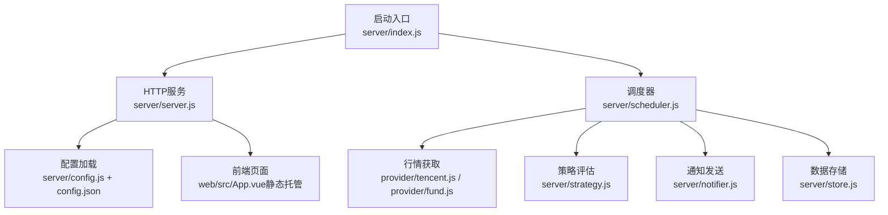
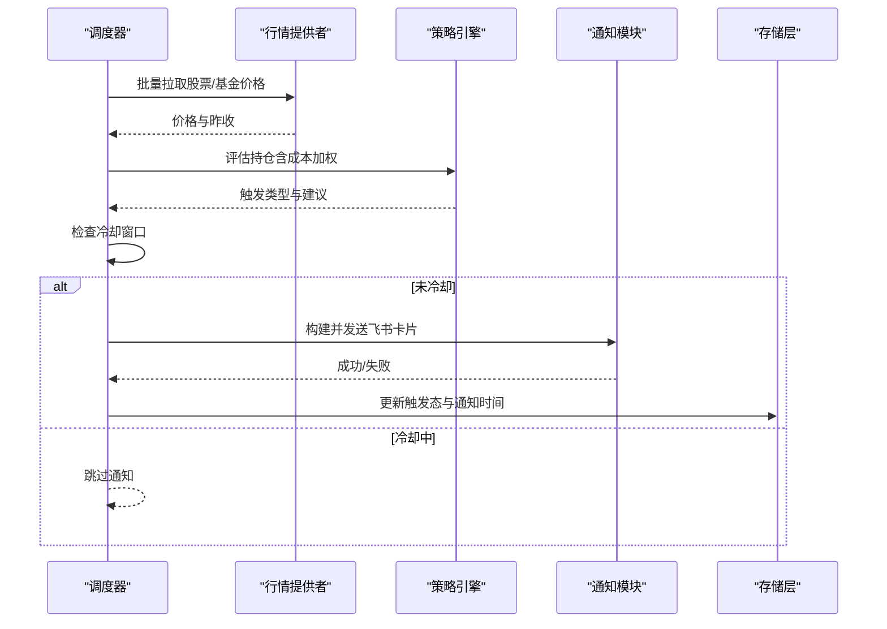
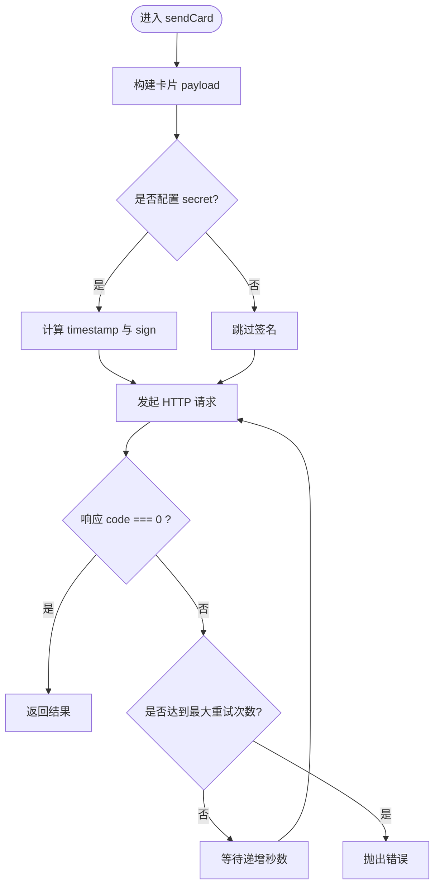
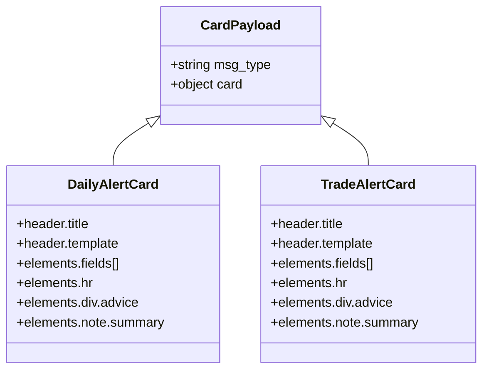
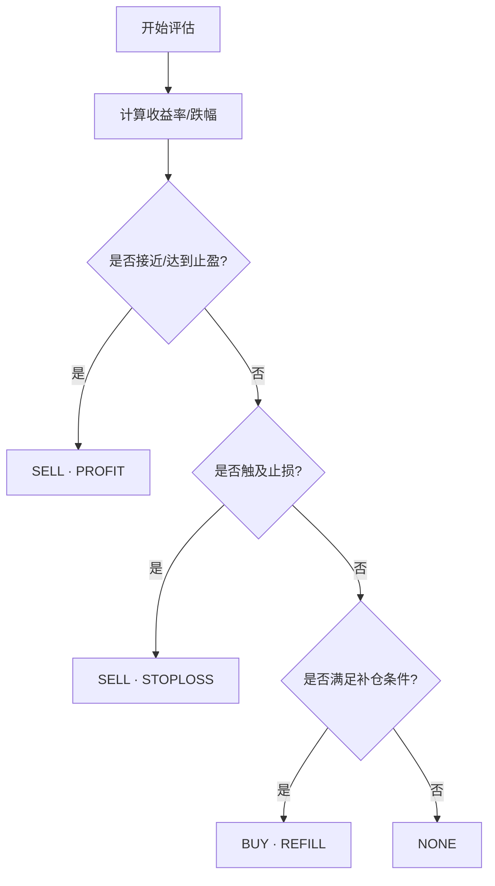
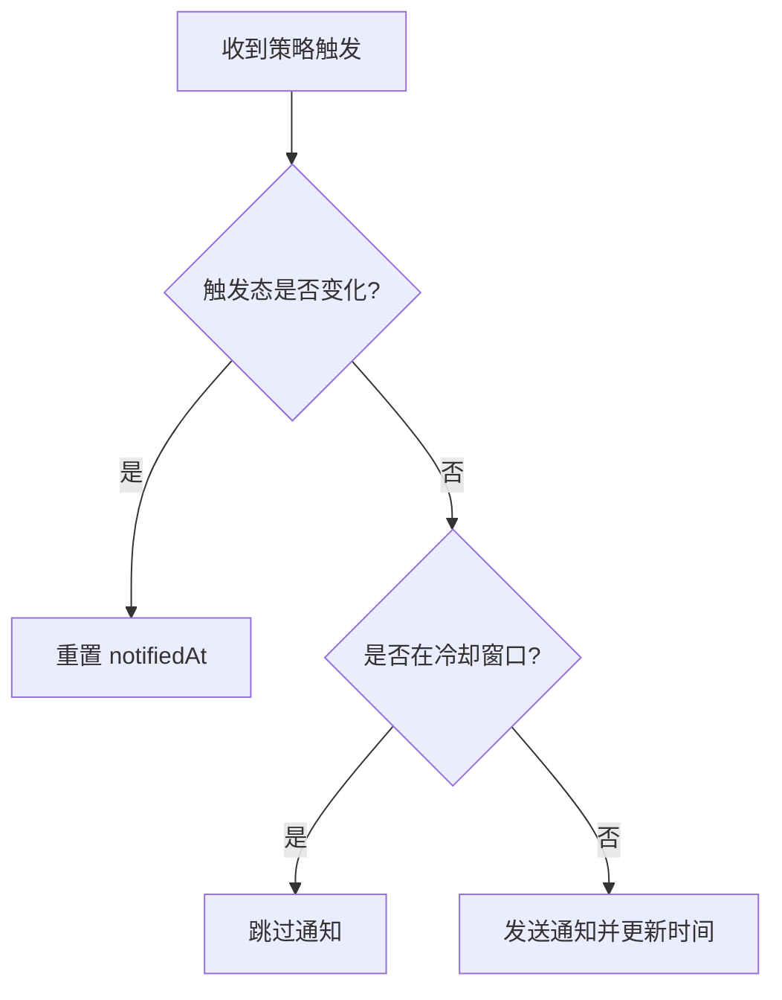
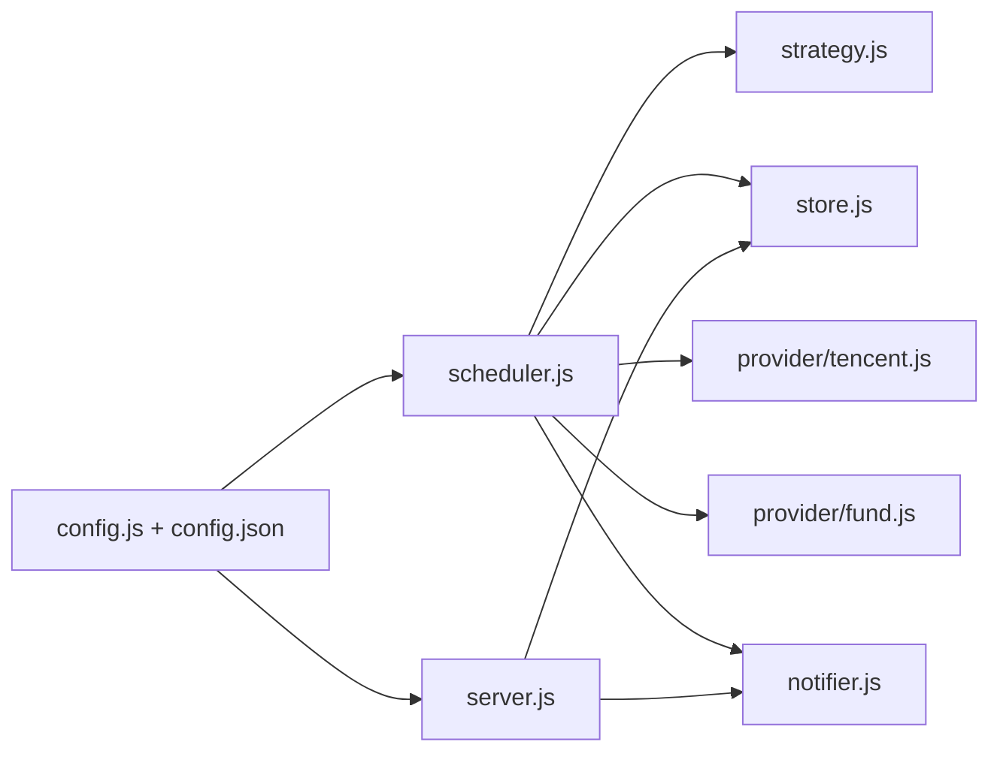

# 通知系统

<cite>
**本文引用的文件**
- [server/index.js](file://server/index.js)
- [server/config.js](file://server/config.js)
- [config.json](file://config.json)
- [server/server.js](file://server/server.js)
- [server/scheduler.js](file://server/scheduler.js)
- [server/notifier.js](file://server/notifier.js)
- [server/strategy.js](file://server/strategy.js)
- [server/store.js](file://server/store.js)
- [server/provider/tencent.js](file://server/provider/tencent.js)
- [server/provider/fund.js](file://server/provider/fund.js)
- [web/src/App.vue](file://web/src/App.vue)
</cite>

## 目录
1. [简介](#简介)
2. [项目结构](#项目结构)
3. [核心组件](#核心组件)
4. [架构总览](#架构总览)
5. [详细组件分析](#详细组件分析)
6. [依赖关系分析](#依赖关系分析)
7. [性能与可靠性](#性能与可靠性)
8. [故障排查指南](#故障排查指南)
9. [结论](#结论)
10. [附录：集成示例与调试技巧](#附录：集成示例与调试技巧)

## 简介
本文件为 Stock Advisor 通知系统的全面技术文档，聚焦飞书机器人集成的实现细节、消息模板设计、触发条件、冷却机制、错误处理与重试策略、个性化定制能力，以及扩展新渠道与优化通知效果的实践建议。系统通过定时调度拉取行情数据，基于持仓与策略引擎计算止盈止损与补仓信号，结合日涨跌阈值告警，将结果以飞书自定义机器人 Webhook 推送至群聊或用户。

## 项目结构
后端采用 Node.js 原生 HTTP 服务，提供前端静态托管与 REST API；调度器按交易时段动态调整刷新频率；策略引擎根据多次买入记录评估买卖信号；通知模块负责构建飞书卡片并发送；数据持久化使用 JSON 文件并通过内存缓存与串行写入避免并发冲突。

**图表来源**
- [server/index.js:1-17](file://server/index.js#L1-L17)
- [server/server.js:567-593](file://server/server.js#L567-L593)
- [server/scheduler.js:65-177](file://server/scheduler.js#L65-L177)
- [server/notifier.js:81-111](file://server/notifier.js#L81-L111)
- [server/config.js:7-10](file://server/config.js#L7-L10)
- [config.json:1-19](file://config.json#L1-L19)
- [server/store.js:40-70](file://server/store.js#L40-L70)
- [server/provider/tencent.js:6-41](file://server/provider/tencent.js#L6-L41)
- [server/provider/fund.js:6-54](file://server/provider/fund.js#L6-L54)

**章节来源**
- [server/index.js:1-17](file://server/index.js#L1-L17)
- [server/server.js:567-593](file://server/server.js#L567-L593)
- [server/scheduler.js:65-177](file://server/scheduler.js#L65-L177)
- [server/notifier.js:81-111](file://server/notifier.js#L81-L111)
- [server/config.js:7-10](file://server/config.js#L7-L10)
- [config.json:1-19](file://config.json#L1-L19)
- [server/store.js:40-70](file://server/store.js#L40-L70)
- [server/provider/tencent.js:6-41](file://server/provider/tencent.js#L6-L41)
- [server/provider/fund.js:6-54](file://server/provider/fund.js#L6-L54)

## 核心组件
- 配置加载：从根目录读取配置，包含调度间隔、服务器端口、飞书 Webhook 与签名密钥、通知冷却时间等。
- 调度器：判断市场交易时段，选择刷新间隔；批量拉取股票与基金价格；计算日涨跌告警与策略信号；应用冷却机制后发送通知；更新持仓状态并落盘。
- 策略引擎：基于多次买入记录的成本加权止盈/止损与补仓逻辑，输出触发类型与建议文案。
- 通知模块：构建飞书 interactive 卡片，支持可选 secret 签名；封装 fetch 调用与指数退避重试。
- 存储层：内存缓存 + 串行写盘，自动迁移旧版数据结构，避免并发覆盖。
- 行情提供者：腾讯财经（股票）与东方财富（基金净值），容错解析与降级返回空映射。
- HTTP 服务：提供持仓 CRUD、CSV 导入、测试消息等接口，并托管前端静态资源。

**章节来源**
- [server/config.js:7-10](file://server/config.js#L7-L10)
- [config.json:1-19](file://config.json#L1-L19)
- [server/scheduler.js:65-177](file://server/scheduler.js#L65-L177)
- [server/strategy.js:34-90](file://server/strategy.js#L34-L90)
- [server/notifier.js:4-111](file://server/notifier.js#L4-L111)
- [server/store.js:24-70](file://server/store.js#L24-L70)
- [server/provider/tencent.js:6-41](file://server/provider/tencent.js#L6-L41)
- [server/provider/fund.js:6-54](file://server/provider/fund.js#L6-L54)
- [server/server.js:409-564](file://server/server.js#L409-L564)

## 架构总览
系统运行流程如下：
- 启动时加载配置，启动 HTTP 服务与调度器。
- 调度器循环执行：判断交易时段 → 拉取行情 → 计算日涨跌告警与策略信号 → 应用冷却 → 发送飞书卡片 → 保存状态。
- 前端通过 HTTP 接口管理持仓与交易记录，并提供“测试飞书”按钮用于验证推送链路。

**图表来源**
- [server/scheduler.js:65-177](file://server/scheduler.js#L65-L177)
- [server/strategy.js:34-90](file://server/strategy.js#L34-L90)
- [server/notifier.js:81-111](file://server/notifier.js#L81-L111)
- [server/store.js:40-70](file://server/store.js#L40-L70)

## 详细组件分析

### 飞书机器人集成（Webhook、消息卡片、认证）
- Webhook 调用：通过内置 fetch 向配置的 webhook 地址 POST JSON 载荷，设置 Content-Type 为 application/json。
- 消息卡片构建：根据触发类型生成不同样式的 interactive 卡片，包含标题、字段区、分隔线、建议详情与底部备注。
- 认证机制：若配置了 secret，则按飞书规则计算 timestamp 与 sign，附加到请求体中完成签名校验。
- 重试机制：最多尝试 3 次，每次失败后等待递增秒数（1s、2s、3s），最终抛出异常供上层捕获。

**图表来源**
- [server/notifier.js:81-111](file://server/notifier.js#L81-L111)

**章节来源**
- [server/notifier.js:4-111](file://server/notifier.js#L4-L111)
- [config.json:10-13](file://config.json#L10-L13)

### 消息模板设计（HTML/Markdown 结构）
- 日涨跌告警卡片：标题区分大涨/大跌，头部模板色对应红/黄；字段展示品种、代码、市场/类型、当前价；详情区域显示涨跌幅与建议；底部备注标注摘要。
- 买点提醒（补仓）卡片：标题为“买点提醒·补仓”，绿色主题；字段与详情结构与日涨跌类似，强调操作建议。
- 卖点提醒（止盈/止损）卡片：标题为“卖点提醒·止盈”，红色主题；字段与详情突出收益与止损信息。
- 所有卡片均使用飞书 interactive card 的 div/fields/hr/note 元素组合，文本采用 lark_md 富文本格式。

**图表来源**
- [server/notifier.js:4-78](file://server/notifier.js#L4-L78)

**章节来源**
- [server/notifier.js:4-78](file://server/notifier.js#L4-L78)

### 通知触发条件
- 止盈止损触发：策略引擎对每只持仓计算收益率与最近买入价跌幅，当接近或达到加权止盈线或单笔止损线时，输出 SELL 触发与建议文案。
- 日涨跌阈值告警：当日涨跌幅超过配置的上涨/下跌阈值即触发 DAILY_RISE/DAILY_DROP，且每日仅推送一次（通过日期标记控制）。
- 补仓计划提醒：当价格低于补仓价或较最近买入价跌幅接近补仓降幅阈值时，输出 BUY 触发与建议文案。

**图表来源**
- [server/strategy.js:34-90](file://server/strategy.js#L34-L90)

**章节来源**
- [server/strategy.js:34-90](file://server/strategy.js#L34-L90)
- [server/scheduler.js:101-157](file://server/scheduler.js#L101-L157)

### 冷却机制（防重复通知）
- 同一触发态在冷却窗口内被忽略：比较上次通知时间与当前时间，若小于配置的冷却秒数且触发态相同，则跳过本次通知。
- 日涨跌告警额外按日期去重：仅在同一天内推送一次，次日重置。
- 交易后重置触发态与通知时间，确保下一轮重新评估。

**图表来源**
- [server/scheduler.js:126-157](file://server/scheduler.js#L126-L157)

**章节来源**
- [server/scheduler.js:126-157](file://server/scheduler.js#L126-L157)
- [server/server.js:346-407](file://server/server.js#L346-L407)

### 错误处理与重试机制
- 网络异常：fetch 抛错或响应码非 0 时视为失败，进入重试循环；三次失败后抛出错误。
- 超时控制：当前未显式设置超时，可通过外部代理或网关限制；建议在部署环境配置超时策略。
- 降级策略：行情获取失败时记录日志并返回空映射，调度继续处理其他标的；基金接口逐个查询，单条失败不影响其余。
- 存储写入：串行队列保证并发安全，写盘失败记录日志但不中断主流程。

**章节来源**
- [server/notifier.js:96-111](file://server/notifier.js#L96-L111)
- [server/scheduler.js:77-86](file://server/scheduler.js#L77-L86)
- [server/provider/tencent.js:6-41](file://server/provider/tencent.js#L6-L41)
- [server/provider/fund.js:6-54](file://server/provider/fund.js#L6-L54)
- [server/store.js:62-70](file://server/store.js#L62-L70)

### 通知内容个性化定制
- 用户偏好：持仓级可配置日涨跌告警阈值（上涨/下跌百分比）、补仓价与补仓降幅阈值、下阶段策略提示。
- 消息格式：卡片标题、字段与详情由策略与调度组装，支持 Markdown 富文本；底部备注包含摘要信息。
- 动态行为：交易后重置触发态与通知时间，确保下一次评估能正确触发；修改阈值后立即生效并在下次触发时推送。

**章节来源**
- [server/server.js:302-344](file://server/server.js#L302-L344)
- [server/server.js:452-465](file://server/server.js#L452-L465)
- [server/strategy.js:34-90](file://server/strategy.js#L34-L90)
- [server/notifier.js:4-78](file://server/notifier.js#L4-L78)

## 依赖关系分析
- 调度器依赖：存储层（持仓数据）、行情提供者（股票/基金）、策略引擎（评估）、通知模块（发送）。
- HTTP 服务依赖：存储层、通知模块（测试消息）、CSV 导入工具。
- 配置依赖：全局开关与参数集中管理，便于扩展与运维。

**图表来源**
- [server/scheduler.js:1-6](file://server/scheduler.js#L1-L6)
- [server/server.js:5-7](file://server/server.js#L5-L7)
- [server/config.js:7-10](file://server/config.js#L7-L10)
- [config.json:1-19](file://config.json#L1-L19)

**章节来源**
- [server/scheduler.js:1-6](file://server/scheduler.js#L1-L6)
- [server/server.js:5-7](file://server/server.js#L5-L7)
- [server/config.js:7-10](file://server/config.js#L7-L10)
- [config.json:1-19](file://config.json#L1-L19)

## 性能与可靠性
- 刷新频率：交易时段短间隔（默认 20 秒），非交易时段长间隔（默认 300 秒），降低资源消耗。
- 并行拉取：股票与基金价格并行获取，减少整体延迟。
- 冷却与去重：避免频繁通知与重复推送，提升用户体验。
- 容错与降级：行情接口失败不阻断主流程；基金接口逐条处理，单条失败不影响整体。
- 存储并发：串行写盘防止覆盖，内存缓存提升读性能。

[本节为通用指导，无需具体文件引用]

## 故障排查指南
- 飞书推送失败：
  - 检查 webhook 地址与 secret 是否正确配置。
  - 查看服务端日志中的 “[notify-daily]” 与 “[notify]” 错误信息。
  - 使用前端“测试飞书”功能快速验证链路。
- 行情获取异常：
  - 观察 “[stock-fetch]” 与 “[fund]” 日志，确认网络与编码解码是否正常。
  - 若某标的无行情，调度会跳过该标的并继续处理其他持仓。
- 通知未触发：
  - 检查持仓的阈值配置与冷却时间；确认交易后是否重置了触发态与通知时间。
  - 查看策略评估输出与建议文案，确认是否符合预期。
- 数据不一致：
  - 检查 store 的串行写入链与 mtime 同步逻辑，确保外部编辑不会导致重复重载。

**章节来源**
- [server/server.js:545-562](file://server/server.js#L545-L562)
- [server/scheduler.js:77-86](file://server/scheduler.js#L77-L86)
- [server/scheduler.js:101-157](file://server/scheduler.js#L101-L157)
- [server/store.js:62-70](file://server/store.js#L62-L70)

## 结论
Stock Advisor 的通知系统以调度器为核心，串联行情获取、策略评估与飞书推送，具备完善的冷却与重试机制，支持日涨跌阈值告警与补仓提醒。通过模块化设计与配置化管理，易于扩展新的通知渠道与优化通知效果。建议在生产环境中补充超时控制与监控告警，进一步提升稳定性与可观测性。

[本节为总结性内容，无需具体文件引用]

## 附录：集成示例与调试技巧
- 启用飞书签名：在配置中填写 webhook 与 secret，系统将自动附加 timestamp 与 sign。
- 调整冷却时间：修改 notify.cooldownSeconds 以平衡及时性与频率。
- 设置日涨跌阈值：在持仓级别配置 dailyDropAlertPct/dailyRiseAlertPct，实现每日阈值告警。
- 测试推送：调用 /api/test-feishu 或通过前端按钮发送测试消息，验证链路连通性。
- 调试策略：关注策略评估输出与建议文案，必要时调整 nearThresholdPct 以改变“接近阈值”的敏感度。
- 扩展新渠道：复用 notifier 的重试与签名逻辑，新增其他平台适配器（如企业微信、钉钉），保持统一接口与错误处理。

**章节来源**
- [config.json:10-17](file://config.json#L10-L17)
- [server/server.js:545-562](file://server/server.js#L545-L562)
- [web/src/App.vue:27-46](file://web/src/App.vue#L27-L46)
- [server/notifier.js:81-111](file://server/notifier.js#L81-L111)