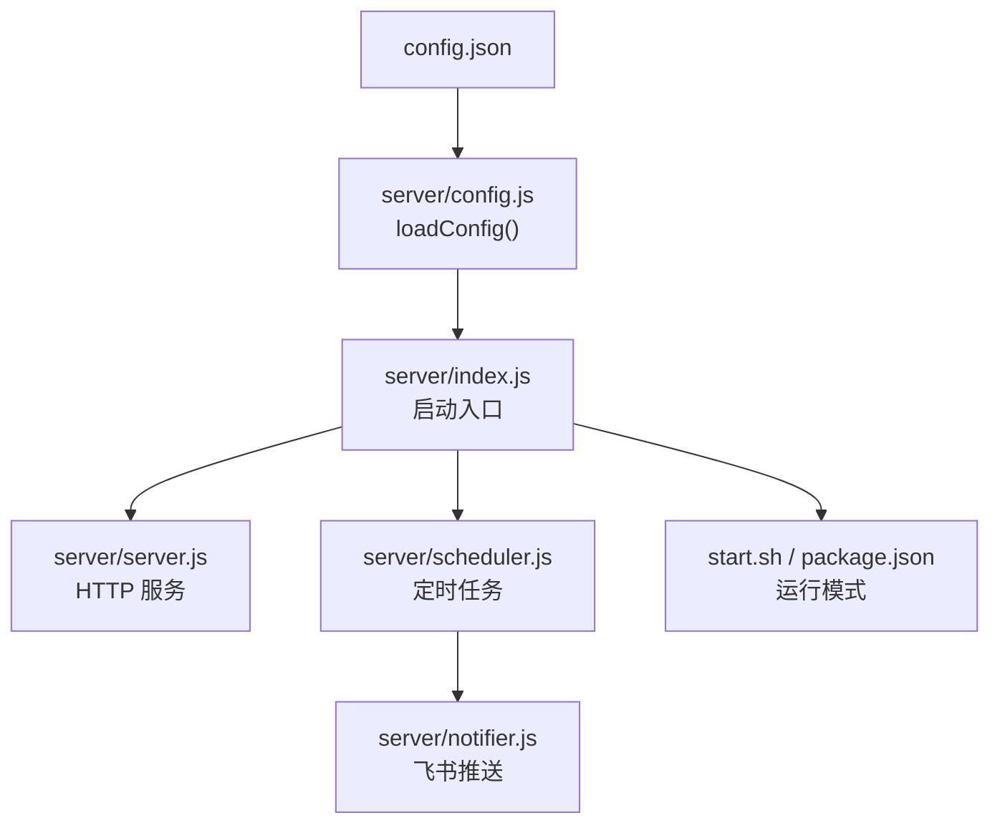
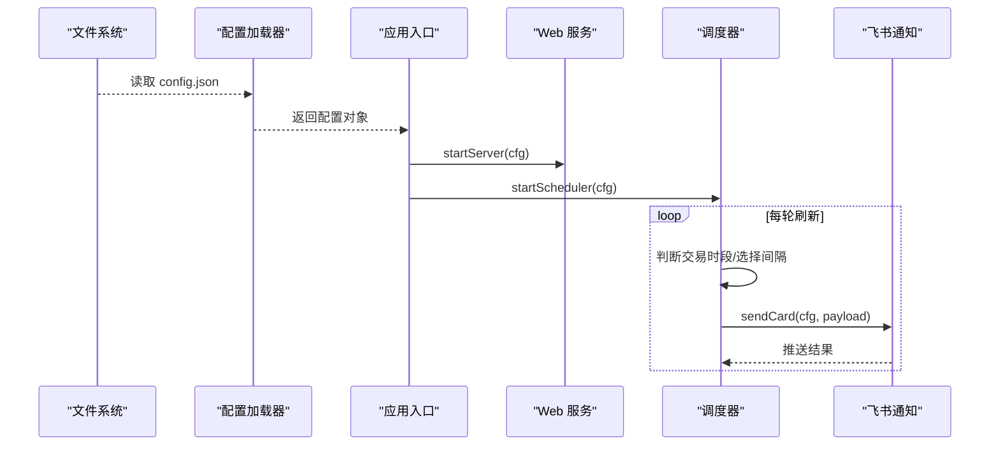
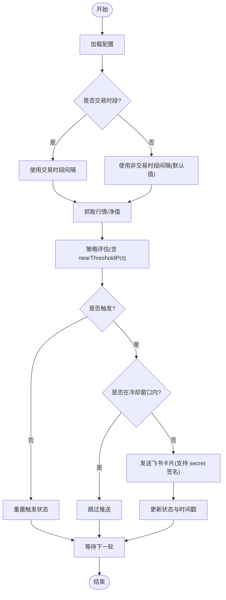
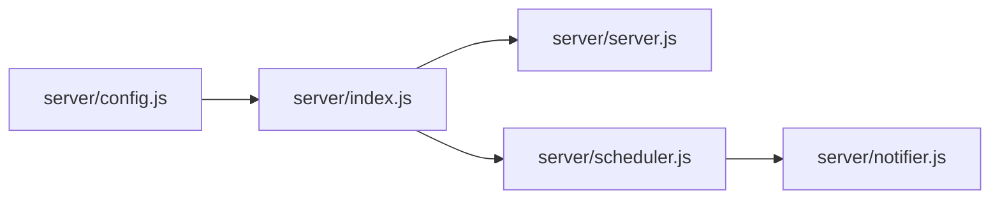

# 配置管理

<cite>
**本文引用的文件**
- [config.json](file://config.json)
- [server/config.js](file://server/config.js)
- [server/index.js](file://server/index.js)
- [server/scheduler.js](file://server/scheduler.js)
- [server/notifier.js](file://server/notifier.js)
- [server/server.js](file://server/server.js)
- [start.sh](file://start.sh)
- [package.json](file://package.json)
</cite>

## 目录
1. [简介](#简介)
2. [项目结构](#项目结构)
3. [核心组件](#核心组件)
4. [架构总览](#架构总览)
5. [详细组件分析](#详细组件分析)
6. [依赖关系分析](#依赖关系分析)
7. [性能考量](#性能考量)
8. [故障排查指南](#故障排查指南)
9. [结论](#结论)
10. [附录：配置示例与最佳实践](#附录配置示例与最佳实践)

## 简介
本文件面向 Stock Advisor（股票秘书）的配置管理系统，系统性说明配置文件结构、字段含义、运行时加载机制、验证规则、环境差异策略与安全配置项处理，并提供可操作的配置示例与最佳实践。目标是帮助开发者快速、正确地配置系统参数，确保在不同环境下稳定运行。

## 项目结构
Stock Advisor 的配置由根目录的 JSON 配置文件承载，后端在启动时读取并注入到调度器、服务器和通知模块中。关键路径如下：
- 配置文件：config.json
- 配置加载：server/config.js
- 应用入口：server/index.js
- 调度与刷新：server/scheduler.js
- 飞书通知：server/notifier.js
- Web 服务与 API：server/server.js
- 启动脚本与环境切换：start.sh
- 包管理与脚本：package.json

图表来源
- [server/config.js:7-10](file://server/config.js#L7-L10)
- [server/index.js:1-16](file://server/index.js#L1-L16)
- [server/server.js:567-593](file://server/server.js#L567-L593)
- [server/scheduler.js:58-63](file://server/scheduler.js#L58-L63)
- [server/notifier.js:80-111](file://server/notifier.js#L80-L111)
- [start.sh:48-99](file://start.sh#L48-L99)
- [package.json:7-13](file://package.json#L7-L13)

章节来源
- [config.json:1-19](file://config.json#L1-L19)
- [server/config.js:1-11](file://server/config.js#L1-L11)
- [server/index.js:1-17](file://server/index.js#L1-L17)
- [start.sh:1-100](file://start.sh#L1-L100)
- [package.json:1-32](file://package.json#L1-L32)

## 核心组件
- 配置文件 schema（config.json）
  - schedule：调度器刷新间隔（交易时段与非交易时段）
  - server：Web 服务主机与端口
  - feishu：飞书机器人 Webhook 地址与签名密钥
  - notify：通知冷却时间与“接近阈值”百分比
- 配置加载器（server/config.js）
  - 从项目根目录读取 config.json 并解析为对象
- 应用入口（server/index.js）
  - 启动时加载配置，打印日志，启动 Web 服务与调度器；支持一次性运行模式
- 调度器（server/scheduler.js）
  - 根据持仓市场判断是否处于交易时段，动态选择刷新间隔
  - 执行行情抓取、策略评估、发送飞书提醒
- 通知器（server/notifier.js）
  - 构造飞书 interactive 卡片消息，支持 secret 签名与重试
- Web 服务（server/server.js）
  - 提供静态页面托管与 REST API；使用配置中的 host/port 启动 HTTP 服务

章节来源
- [config.json:1-19](file://config.json#L1-L19)
- [server/config.js:7-10](file://server/config.js#L7-L10)
- [server/index.js:5-16](file://server/index.js#L5-L16)
- [server/scheduler.js:58-63](file://server/scheduler.js#L58-L63)
- [server/notifier.js:80-111](file://server/notifier.js#L80-L111)
- [server/server.js:567-593](file://server/server.js#L567-L593)

## 架构总览
下图展示了配置在系统中的流转与使用点：

图表来源
- [server/config.js:7-10](file://server/config.js#L7-L10)
- [server/index.js:5-16](file://server/index.js#L5-L16)
- [server/server.js:567-593](file://server/server.js#L567-L593)
- [server/scheduler.js:58-63](file://server/scheduler.js#L58-L63)
- [server/notifier.js:80-111](file://server/notifier.js#L80-L111)

## 详细组件分析

### 配置文件结构与字段说明
- schedule
  - intervalSeconds：交易时段刷新间隔（秒）
  - offHoursIntervalSeconds：非交易时段刷新间隔（秒），未设置时使用默认值
- server
  - host：监听主机地址
  - port：监听端口号
- feishu
  - webhook：飞书自定义机器人 Webhook 地址
  - secret：可选签名密钥，启用后会在请求体附加 timestamp 与 sign
- notify
  - cooldownSeconds：同一触发态的冷却时间（秒），避免重复推送
  - nearThresholdPct：用于策略评估的“接近阈值”百分比

章节来源
- [config.json:1-19](file://config.json#L1-L19)
- [server/scheduler.js:58-63](file://server/scheduler.js#L58-L63)
- [server/notifier.js:80-111](file://server/notifier.js#L80-L111)

### 运行时配置加载机制
- 加载位置与方式
  - 应用入口在启动时调用配置加载函数，读取项目根目录的配置文件并解析为对象
- 环境变量覆盖
  - 当前实现未对配置项进行 process.env 覆盖；仅通过 ONCE 环境变量控制一次性运行模式
- 热重载
  - 当前实现未实现配置文件热重载；修改配置需重启进程
- 默认值处理
  - 服务器 host/port 在启动处有默认回退
  - 非交易时段间隔在未配置时采用默认值

章节来源
- [server/config.js:7-10](file://server/config.js#L7-L10)
- [server/index.js:5-16](file://server/index.js#L5-L16)
- [server/server.js:567-593](file://server/server.js#L567-L593)
- [server/scheduler.js:58-63](file://server/scheduler.js#L58-L63)

### 配置验证规则
- 必填字段检查
  - 当前配置加载器未做必填校验；建议在新增必填项时增加校验逻辑
- 数据类型验证
  - 数值型字段（如端口、间隔、百分比）应在加载或使用时进行类型转换与范围校验
- 范围限制
  - 端口建议限定在合法范围
  - 刷新间隔应大于 0
  - 百分比应在合理区间（如 0–100）
- 建议增强
  - 在 loadConfig 中引入轻量校验，失败时抛出明确错误，便于部署前发现配置问题

章节来源
- [server/config.js:7-10](file://server/config.js#L7-L10)
- [server/server.js:567-593](file://server/server.js#L567-L593)

### 不同环境的配置管理策略
- 开发环境
  - 可通过启动脚本以开发模式运行，前端使用 Vite 热更新，后端仍读取同一配置文件
- 测试环境
  - 建议使用独立配置文件或环境变量注入（当前未实现），以便隔离数据与通知目标
- 生产环境
  - 使用构建产物并由启动脚本启动；建议将敏感信息通过外部化方式注入（见安全配置项）
- 一次性运行模式
  - 通过 ONCE 环境变量控制单次执行，适合批处理或手动触发

章节来源
- [start.sh:48-99](file://start.sh#L48-L99)
- [server/index.js:12-15](file://server/index.js#L12-L15)
- [package.json:7-13](file://package.json#L7-L13)

### 安全配置项处理
- 敏感信息
  - 飞书 secret 属于敏感信息，建议在生产环境中通过环境变量注入，避免写入配置文件
- 加密存储
  - 当前未实现配置加密；可在配置加载阶段解密后再使用
- 最小权限原则
  - 仅暴露必要配置项；对 Webhook 地址等网络凭据进行访问控制
- 传输安全
  - 飞书 Webhook 使用 HTTPS；secret 签名可防止篡改

章节来源
- [server/notifier.js:80-111](file://server/notifier.js#L80-L111)

### 调度与刷新流程（含阈值与冷却）

图表来源
- [server/scheduler.js:58-63](file://server/scheduler.js#L58-L63)
- [server/scheduler.js:65-165](file://server/scheduler.js#L65-L165)
- [server/notifier.js:80-111](file://server/notifier.js#L80-L111)

章节来源
- [server/scheduler.js:58-63](file://server/scheduler.js#L58-L63)
- [server/scheduler.js:65-165](file://server/scheduler.js#L65-L165)
- [server/notifier.js:80-111](file://server/notifier.js#L80-L111)

### Web 服务与 API（配置相关）
- 启动参数
  - host/port 来自配置，若缺失则使用默认值
- API 能力
  - 提供持仓 CRUD、CSV 导入、飞书测试消息等接口
- 配置影响
  - 刷新频率与通知行为受 schedule 与 notify 配置影响

章节来源
- [server/server.js:567-593](file://server/server.js#L567-L593)

## 依赖关系分析
- 配置加载器依赖文件系统读取
- 应用入口依赖配置加载器、调度器与 Web 服务
- 调度器依赖持仓存储、行情提供者、策略评估与通知器
- 通知器依赖 crypto 模块进行签名计算，并通过 fetch 调用飞书 Webhook

图表来源
- [server/config.js:7-10](file://server/config.js#L7-L10)
- [server/index.js:1-16](file://server/index.js#L1-L16)
- [server/server.js:567-593](file://server/server.js#L567-L593)
- [server/scheduler.js:65-165](file://server/scheduler.js#L65-L165)
- [server/notifier.js:80-111](file://server/notifier.js#L80-L111)

章节来源
- [server/config.js:1-11](file://server/config.js#L1-L11)
- [server/index.js:1-17](file://server/index.js#L1-L17)
- [server/server.js:1-594](file://server/server.js#L1-L594)
- [server/scheduler.js:1-178](file://server/scheduler.js#L1-L178)
- [server/notifier.js:1-112](file://server/notifier.js#L1-L112)

## 性能考量
- 刷新间隔
  - 交易时段较短间隔保证及时性；非交易时段较长间隔降低资源消耗
- 冷却机制
  - 通过冷却时间减少重复推送，降低网络与第三方服务压力
- 并行抓取
  - 股票与基金数据并行获取，提升整体吞吐
- 失败降级
  - 抓取失败记录日志并继续后续流程，避免单点阻塞

[本节为通用指导，不直接分析具体文件]

## 故障排查指南
- 无法启动或端口冲突
  - 检查 server.host 与 server.port 是否正确；确认端口未被占用
- 刷新不生效
  - 检查 schedule.intervalSeconds 与 offHoursIntervalSeconds；确认持仓市场与交易时段判断逻辑
- 飞书消息未送达
  - 核对 feishu.webhook 与 feishu.secret；查看通知器重试与错误日志
- 配置变更未生效
  - 当前不支持热重载，修改后需重启进程

章节来源
- [server/server.js:567-593](file://server/server.js#L567-L593)
- [server/scheduler.js:58-63](file://server/scheduler.js#L58-L63)
- [server/notifier.js:80-111](file://server/notifier.js#L80-L111)

## 结论
Stock Advisor 的配置体系简洁清晰，围绕 schedule、server、feishu、notify 四大块组织。当前实现通过启动时读取配置文件并注入各模块，具备基本的默认值与冷却机制。建议后续增强配置校验、环境变量覆盖与热重载能力，以提升多环境部署的安全性与灵活性。

[本节为总结性内容，不直接分析具体文件]

## 附录：配置示例与最佳实践
- 配置示例
  - 参考根目录配置文件结构，包含 schedule、server、feishu、notify 四个顶层键
- 最佳实践
  - 生产环境：将 feishu.secret 通过环境变量注入，避免明文落盘；使用独立配置文件区分环境
  - 刷新间隔：交易时段保持较低间隔，非交易时段提高间隔以降低负载
  - 冷却时间：根据业务容忍度调整 notify.cooldownSeconds，避免频繁打扰
  - 接近阈值：合理设置 notify.nearThresholdPct，平衡告警灵敏度与噪音
  - 启动模式：使用 ONCE 环境变量进行一次性运行，便于调试与批量处理

章节来源
- [config.json:1-19](file://config.json#L1-L19)
- [server/index.js:12-15](file://server/index.js#L12-L15)
- [server/scheduler.js:58-63](file://server/scheduler.js#L58-L63)
- [server/notifier.js:80-111](file://server/notifier.js#L80-L111)