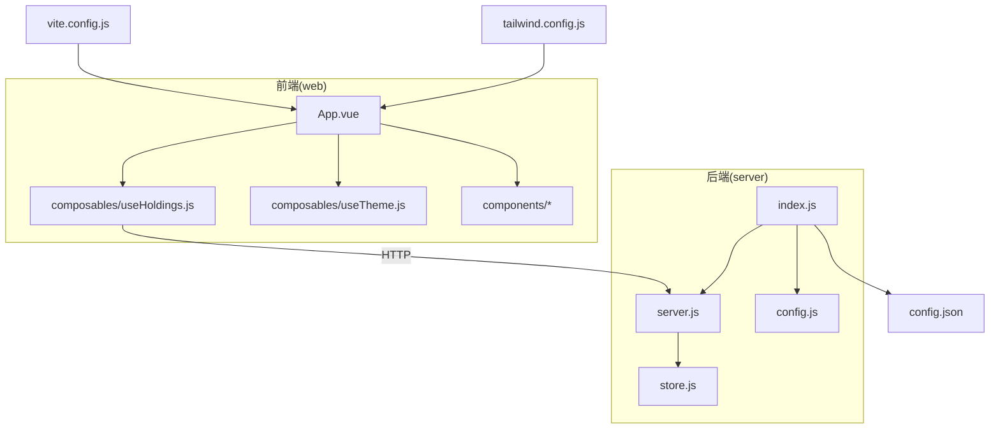
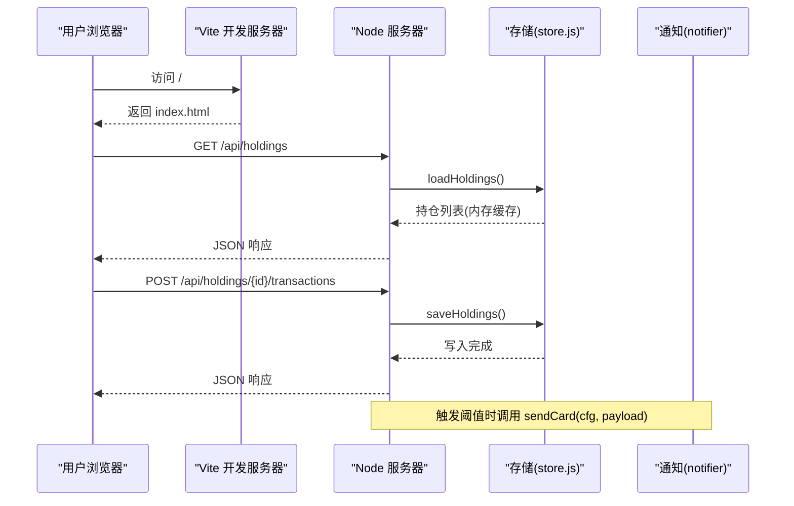
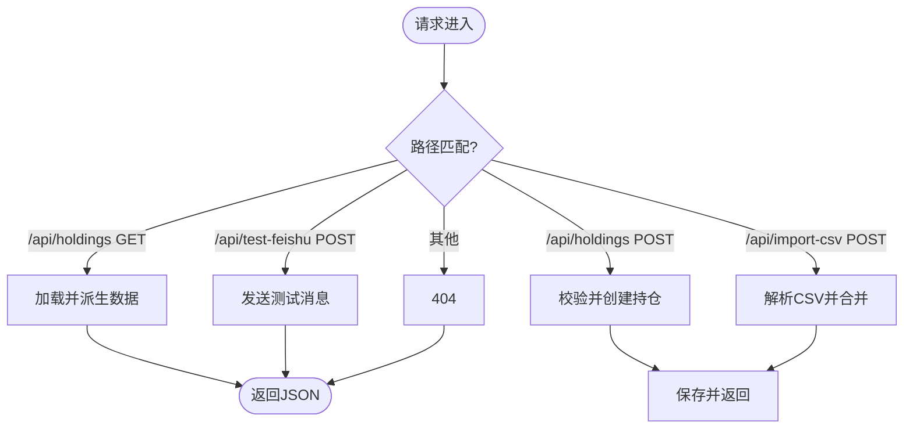
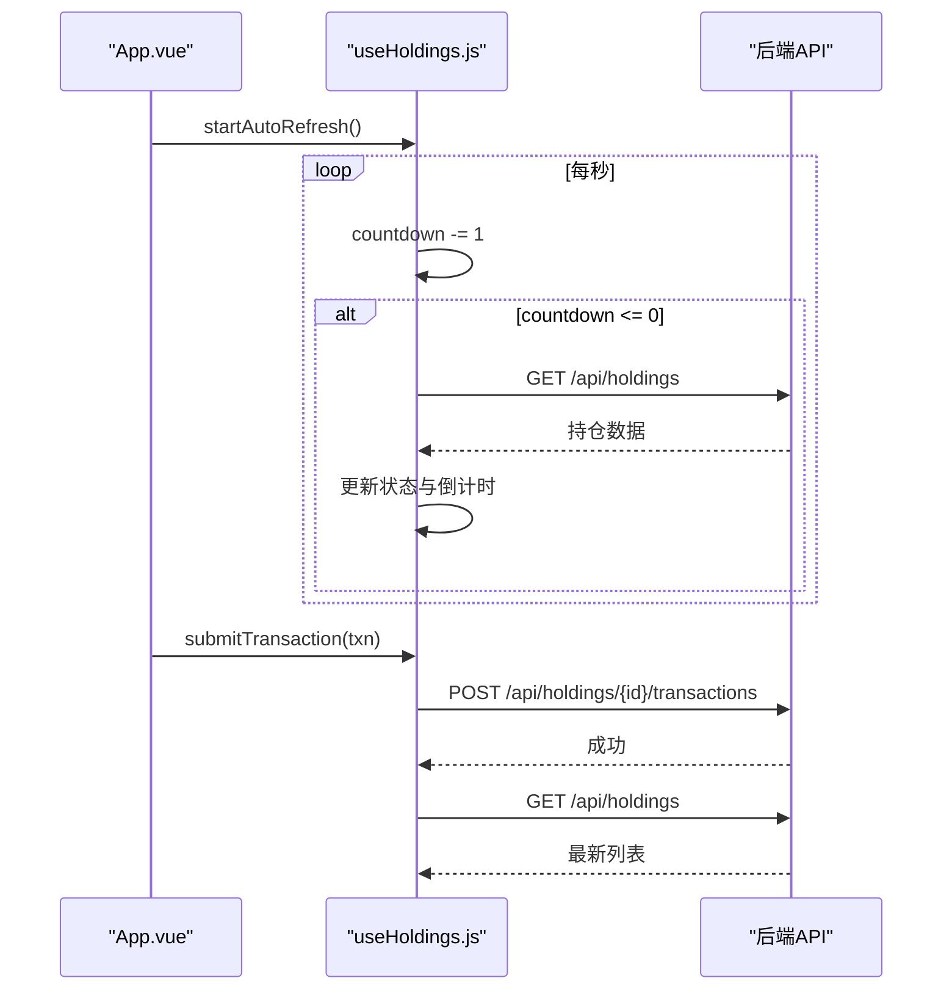
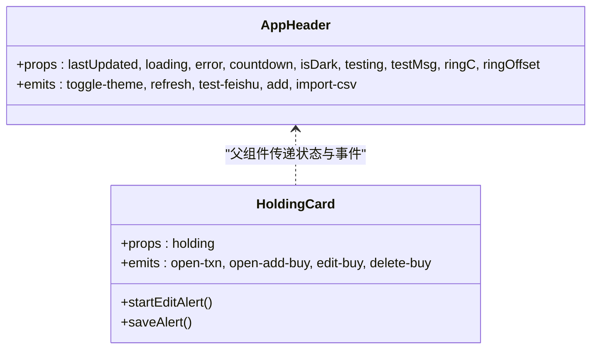
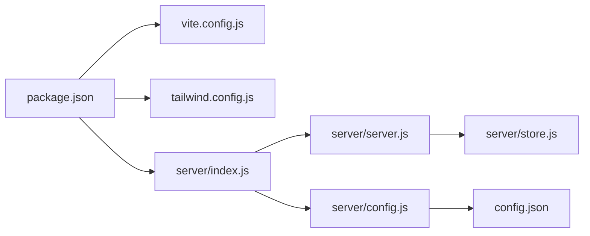

# 代码规范与最佳实践

<cite>
**本文引用的文件**
- [package.json](file://package.json)
- [config.json](file://config.json)
- [vite.config.js](file://vite.config.js)
- [tailwind.config.js](file://tailwind.config.js)
- [server/index.js](file://server/index.js)
- [server/server.js](file://server/server.js)
- [server/config.js](file://server/config.js)
- [server/store.js](file://server/store.js)
- [web/src/main.js](file://web/src/main.js)
- [web/src/App.vue](file://web/src/App.vue)
- [web/src/composables/useHoldings.js](file://web/src/composables/useHoldings.js)
- [web/src/composables/useTheme.js](file://web/src/composables/useTheme.js)
- [web/src/composables/useFormat.js](file://web/src/composables/useFormat.js)
- [web/src/constants/options.js](file://web/src/constants/options.js)
- [web/src/components/AppHeader.vue](file://web/src/components/AppHeader.vue)
- [web/src/components/HoldingCard.vue](file://web/src/components/HoldingCard.vue)
</cite>

## 目录
1. [简介](#简介)
2. [项目结构](#项目结构)
3. [核心组件](#核心组件)
4. [架构总览](#架构总览)
5. [详细组件分析](#详细组件分析)
6. [依赖关系分析](#依赖关系分析)
7. [性能优化建议](#性能优化建议)
8. [故障排查指南](#故障排查指南)
9. [结论](#结论)
10. [附录：编码规范清单](#附录：编码规范清单)

## 简介
本文件面向 Stock Advisor（股票秘书）项目的开发者与维护者，提供一套可落地的代码规范与最佳实践，覆盖以下方面：
- JavaScript/ES6+ 编码规范、函数定义、变量声明与注释约定
- Vue 3 组件开发规范（结构设计、Props、事件、生命周期）
- Git 工作流规范（分支策略、提交信息、代码审查）
- 错误处理模式（异常捕获、日志、用户体验）
- 性能优化（代码分割、懒加载、资源优化）
- 安全编码实践（输入校验、敏感信息保护、XSS 防护）

## 项目结构
项目采用前后端同仓组织：
- server：Node.js HTTP 服务，提供静态托管与 REST API，负责持仓数据持久化、调度任务与飞书通知。
- web：Vue 3 + Vite 前端，使用 TailwindCSS + DaisyUI 主题，通过 composables 管理状态与业务逻辑。
- 配置：根级 config.json 控制调度间隔、服务器端口、飞书 Webhook 等；Vite/Tailwind 配置位于根目录。

图表来源
- [server/index.js:1-17](file://server/index.js#L1-L17)
- [server/server.js:1-594](file://server/server.js#L1-L594)
- [server/store.js:1-71](file://server/store.js#L1-L71)
- [server/config.js:1-11](file://server/config.js#L1-L11)
- [web/src/App.vue:1-197](file://web/src/App.vue#L1-L197)
- [web/src/composables/useHoldings.js:1-154](file://web/src/composables/useHoldings.js#L1-L154)
- [web/src/composables/useTheme.js:1-26](file://web/src/composables/useTheme.js#L1-L26)
- [vite.config.js:1-26](file://vite.config.js#L1-L26)
- [tailwind.config.js:1-54](file://tailwind.config.js#L1-L54)

章节来源
- [package.json:1-32](file://package.json#L1-L32)
- [vite.config.js:1-26](file://vite.config.js#L1-L26)
- [tailwind.config.js:1-54](file://tailwind.config.js#L1-L54)

## 核心组件
- 服务端入口与路由
  - 启动流程：加载配置、启动 HTTP 服务、启动调度器（或单次运行）。
  - 静态资源托管：优先精确匹配文件，否则回退到 index.html（SPA）。
  - API 路由：统一在 handleApi 中按路径与方法分发。
- 数据存储
  - 内存缓存 + 文件持久化，写操作串行化避免并发覆盖。
  - 自动迁移旧版扁平结构至“多次买入记录”模型。
- 前端应用
  - 入口挂载 Vue 应用，全局主题切换。
  - useHoldings 组合式函数集中管理持仓数据、自动刷新与写操作。
  - 组件以 props + emits 进行单向数据流与事件通信。

章节来源
- [server/index.js:1-17](file://server/index.js#L1-L17)
- [server/server.js:1-594](file://server/server.js#L1-L594)
- [server/store.js:1-71](file://server/store.js#L1-L71)
- [web/src/main.js:1-6](file://web/src/main.js#L1-L6)
- [web/src/App.vue:1-197](file://web/src/App.vue#L1-L197)
- [web/src/composables/useHoldings.js:1-154](file://web/src/composables/useHoldings.js#L1-L154)

## 架构总览
前后端通过 HTTP 交互，前端由 Vite 构建并托管于 Node 静态目录；后端同时提供 REST API 与静态资源服务。

图表来源
- [server/server.js:409-565](file://server/server.js#L409-L565)
- [server/store.js:40-71](file://server/store.js#L40-L71)
- [vite.config.js:14-24](file://vite.config.js#L14-L24)

## 详细组件分析

### 服务端 API 与数据处理
- 职责划分
  - 路由分发：handleApi 根据方法与路径分派到具体处理逻辑。
  - 数据派生：withDerived 计算均价、市值、今日收益、持仓收益、交易明细等展示字段。
  - 事务处理：applyTransaction 实现买入/卖出逻辑，含 LIFO 成本分摊与状态更新。
  - 持久化：saveHoldings 串行写盘，loadHoldings 带 mtime 检测的增量重载。
- 关键流程
  - 新增持仓：校验必填字段 → 创建对象 → 追加到列表 → 持久化 → 返回派生数据。
  - 导入 CSV：读取原始文本 → 解析 → 合并/插入 → 持久化 → 返回结果。
  - 测试飞书：构造卡片消息 → 发送 → 返回成功/失败。

图表来源
- [server/server.js:409-565](file://server/server.js#L409-L565)
- [server/store.js:40-71](file://server/store.js#L40-L71)

章节来源
- [server/server.js:89-245](file://server/server.js#L89-L245)
- [server/server.js:302-407](file://server/server.js#L302-L407)
- [server/server.js:409-565](file://server/server.js#L409-L565)
- [server/store.js:24-71](file://server/store.js#L24-L71)

### 前端状态管理与自动刷新
- 状态设计
  - holdings、loading、error、countdown 等模块级 ref 作为共享状态。
  - computed 汇总总成本、总市值、总收益等指标。
- 自动刷新
  - 单一定时器每秒递减 countdown，归零触发 fetchHoldings，避免多定时器漂移。
- 写操作
  - addHolding、submitTransaction、savePurchase、deletePurchase、updateHolding 统一封装 fetch 与错误处理，成功后刷新列表。

图表来源
- [web/src/composables/useHoldings.js:15-154](file://web/src/composables/useHoldings.js#L15-L154)
- [web/src/App.vue:121-129](file://web/src/App.vue#L121-L129)

章节来源
- [web/src/composables/useHoldings.js:1-154](file://web/src/composables/useHoldings.js#L1-L154)
- [web/src/App.vue:1-197](file://web/src/App.vue#L1-L197)

### 主题与格式化
- 主题
  - useTheme 维护 isDark，读写 localStorage，动态设置 <html> 的 class 与 data-theme。
  - Tailwind/DaisyUI 配置了 stocklight/stockdark 两套主题，darkTheme 为 stockdark。
- 格式化
  - useFormat 提供金额、价格、数量、百分比、日期、收益颜色类名、徽章映射等纯函数。
  - constants/options.js 集中维护策略、地区、类型等枚举，前后端保持一致。

章节来源
- [web/src/composables/useTheme.js:1-26](file://web/src/composables/useTheme.js#L1-L26)
- [web/src/composables/useFormat.js:1-70](file://web/src/composables/useFormat.js#L1-L70)
- [web/src/constants/options.js:1-33](file://web/src/constants/options.js#L1-L33)
- [tailwind.config.js:1-54](file://tailwind.config.js#L1-L54)

### 组件结构与交互
- AppHeader
  - Props：lastUpdated、loading、error、countdown、isDark、testing、testMsg、ringC、ringOffset。
  - Emits：toggle-theme、refresh、test-feishu、add、import-csv。
- HoldingCard
  - Props：holding。
  - Emits：open-txn、open-add-buy、edit-buy、delete-buy。
  - 内联编辑日涨跌告警阈值，调用 updateHolding 后刷新本地状态。

图表来源
- [web/src/components/AppHeader.vue:1-64](file://web/src/components/AppHeader.vue#L1-L64)
- [web/src/components/HoldingCard.vue:1-161](file://web/src/components/HoldingCard.vue#L1-L161)

章节来源
- [web/src/components/AppHeader.vue:1-64](file://web/src/components/AppHeader.vue#L1-L64)
- [web/src/components/HoldingCard.vue:1-161](file://web/src/components/HoldingCard.vue#L1-L161)

## 依赖关系分析
- 前端依赖
  - Vue 3 运行时与组合式 API。
  - Vite 插件 @vitejs/plugin-vue。
  - TailwindCSS + DaisyUI 样式系统。
- 后端依赖
  - Node 内置 http/fs/promises/url/path。
  - 可选 puppeteer-core（用于扩展抓取能力，当前未在服务中直接引入）。
- 配置依赖
  - config.json 控制调度间隔、服务器地址、飞书 Webhook 与通知冷却时间。

图表来源
- [package.json:1-32](file://package.json#L1-L32)
- [vite.config.js:1-26](file://vite.config.js#L1-L26)
- [tailwind.config.js:1-54](file://tailwind.config.js#L1-L54)
- [server/index.js:1-17](file://server/index.js#L1-L17)
- [server/server.js:1-594](file://server/server.js#L1-L594)
- [server/store.js:1-71](file://server/store.js#L1-L71)
- [server/config.js:1-11](file://server/config.js#L1-L11)
- [config.json:1-19](file://config.json#L1-L19)

章节来源
- [package.json:1-32](file://package.json#L1-L32)
- [config.json:1-19](file://config.json#L1-L19)

## 性能优化建议
- 前端
  - 代码分割：按需拆分大组件与弹窗（如 ImportCsvModal、BuyRecordModal），减少首屏体积。
  - 懒加载：对非首屏图表/表格使用异步 import 或 IntersectionObserver 懒加载。
  - 资源优化：图片压缩、启用 gzip/brotli、合理使用 CDN 缓存头。
  - 渲染优化：避免在高频回调中创建新对象；使用 computed 缓存派生值；列表虚拟化（大数据量时）。
- 后端
  - 接口层：批量获取聚合数据，减少往返次数；对只读接口加缓存（内存/Redis）。
  - 存储层：保持串行写盘已实现；对高频写场景考虑 WAL 或数据库。
  - 调度器：合理设置 intervalSeconds/offHoursIntervalSeconds，避免频繁抓取导致限流。
- 网络
  - 开发环境使用 Vite 代理 /api 到后端，生产环境由同一域名提供服务以减少跨域问题。

[本节为通用指导，不直接分析具体文件]

## 故障排查指南
- 常见问题定位
  - 前端报错：检查 useHoldings 中的 fetch 错误分支与 error 状态展示。
  - 后端 404：确认路由路径与方法是否匹配 handleApi 的分发逻辑。
  - 数据不同步：检查 store.js 的 mtime 检测与串行写链是否生效。
  - 飞书推送失败：查看 /api/test-feishu 的错误码与消息体。
- 日志与调试
  - 后端 console.error 输出错误堆栈；可在 handleApi 外层 try/catch 捕获未处理异常。
  - 前端 alert 仅用于简单提示，建议替换为更友好的 UI 提示。
- 恢复步骤
  - 清理 dist 重新构建前端。
  - 重置 holdings.json 并重启服务。
  - 检查 config.json 中 schedule 与 server 配置是否正确。

章节来源
- [server/server.js:571-593](file://server/server.js#L571-L593)
- [server/store.js:61-71](file://server/store.js#L61-L71)
- [web/src/composables/useHoldings.js:15-29](file://web/src/composables/useHoldings.js#L15-L29)

## 结论
本项目采用清晰的模块化与组合式架构，前后端职责明确，数据流简洁可控。通过统一的枚举与常量、组合式状态管理、串行写盘与 SPA 静态托管，实现了良好的可维护性与可扩展性。建议在后续迭代中持续遵循本文档的编码规范与安全、性能最佳实践，以提升整体质量与稳定性。

[本节为总结性内容，不直接分析具体文件]

## 附录：编码规范清单

- JavaScript/ES6+ 编码规范
  - 使用 ES Module 语法（import/export），统一使用 const/let，避免 var。
  - 函数定义优先使用箭头函数表达纯函数；复杂逻辑拆分为小函数。
  - 字符串模板、解构赋值、可选链、空值合并等现代语法适度使用，保证可读性。
  - 注释：对外部暴露的函数添加简要说明；复杂算法处补充行内注释。
  - 命名：模块与函数使用驼峰，常量全大写；组件文件名使用 PascalCase。

- Vue 组件开发规范
  - 组件结构：单一职责，尽量将 UI 与逻辑分离；使用 <script setup> 简化样板。
  - Props：显式声明类型与默认值；禁止在组件内部修改 props。
  - 事件：使用 defineEmits 明确事件契约；事件命名使用动词短语（如 open-txn）。
  - 生命周期：onMounted/onUnmounted 中管理副作用（定时器、监听器）并确保清理。
  - 状态管理：使用 composables 封装共享状态与行为，避免全局污染。

- Git 工作流规范
  - 分支策略
    - main：稳定发布分支，仅接受经过评审的合并。
    - develop：日常集成分支，功能完成后合入。
    - feature/*：功能分支，从 develop 切出，完成后发起 PR。
    - hotfix/*：紧急修复分支，从 main 切出，修复后合并至 main 与 develop。
  - 提交信息格式
    - 类型: 描述（例如 feat: 新增持仓导入功能）
    - 类型包括：feat、fix、docs、style、refactor、test、chore。
    - 必要时附加影响范围与关联 Issue。
  - 代码审查流程
    - 所有变更需至少一名 reviewer 批准。
    - CI 通过后合并；合并前确保无冲突且通过测试。

- 错误处理模式
  - 前端：统一 catch 网络错误，设置 error 状态并展示友好提示；避免裸 alert。
  - 后端：handleApi 外层 try/catch 捕获未处理异常，返回 500 与错误信息；业务错误返回 4xx。
  - 日志：关键路径打印结构化日志（包含请求 ID、用户标识、耗时）。

- 性能优化建议
  - 前端：代码分割、懒加载、虚拟列表、防抖/节流、减少重排重绘。
  - 后端：接口聚合、缓存热点数据、限制请求体大小、连接池复用。
  - 资源：启用压缩、CDN、缓存策略；图片与字体按需加载。

- 安全编码实践
  - 输入验证：服务端对所有外部输入进行白名单校验与类型转换；拒绝非法值。
  - 敏感信息：密钥与令牌存放于环境变量或配置文件，不入库；示例配置占位符提醒替换。
  - XSS 防护：前端避免 v-html 渲染不可信内容；后端输出 JSON 时确保转义。
  - 最小权限：服务仅开放必要端口与接口；禁用不必要的调试接口。

章节来源
- [config.json:10-17](file://config.json#L10-L17)
- [server/server.js:418-435](file://server/server.js#L418-L435)
- [web/src/composables/useHoldings.js:67-130](file://web/src/composables/useHoldings.js#L67-L130)