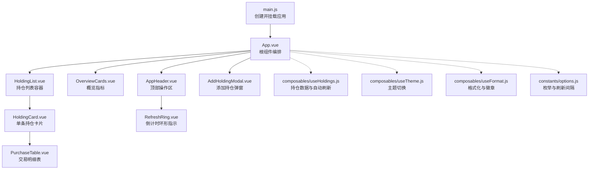
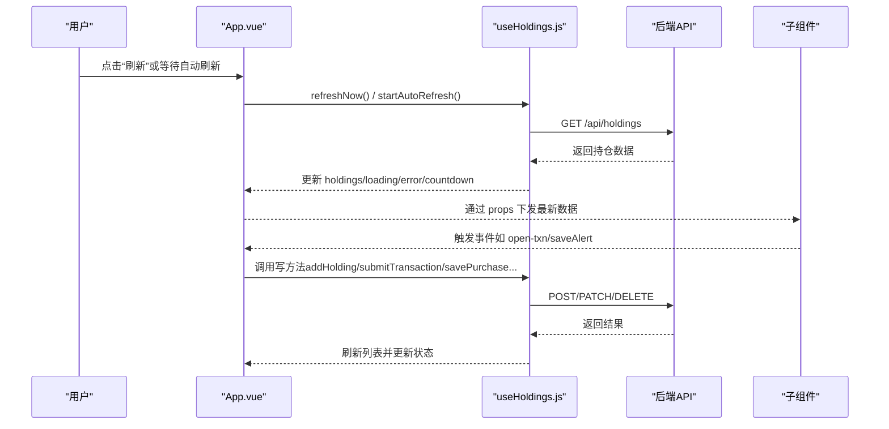
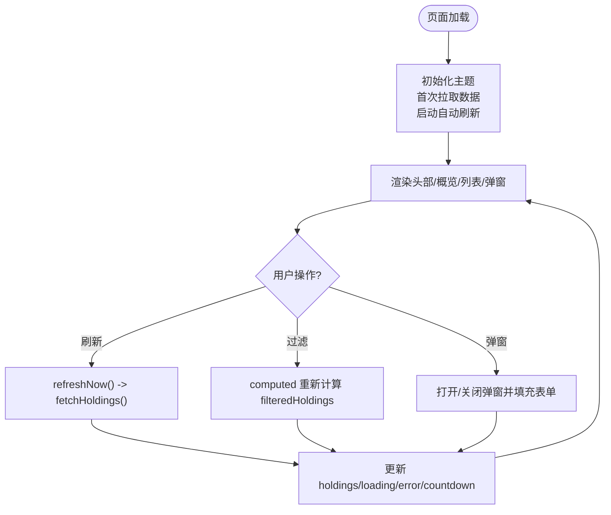
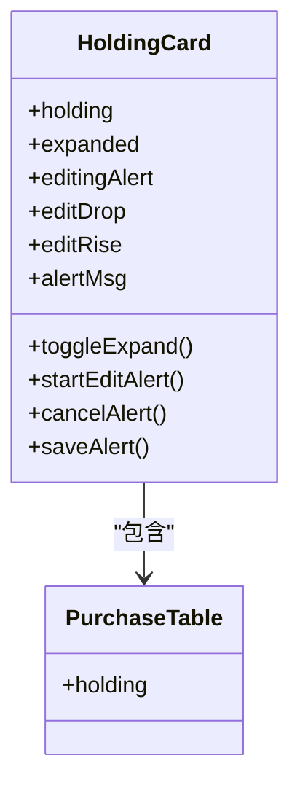
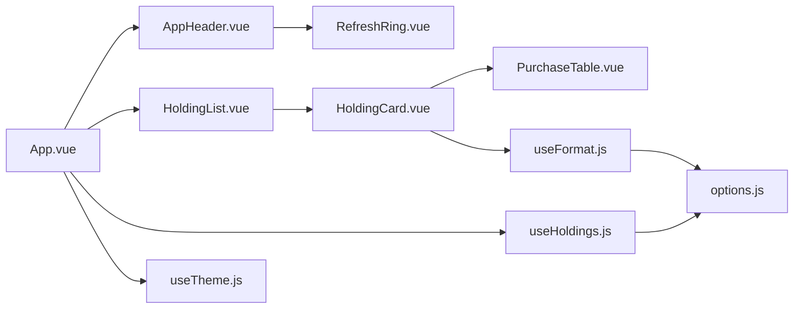

# Vue组件开发

<cite>
**本文引用的文件**
- [web/src/App.vue](file://web/src/App.vue)
- [web/src/main.js](file://web/src/main.js)
- [web/src/components/AppHeader.vue](file://web/src/components/AppHeader.vue)
- [web/src/components/HoldingCard.vue](file://web/src/components/HoldingCard.vue)
- [web/src/components/HoldingList.vue](file://web/src/components/HoldingList.vue)
- [web/src/components/OverviewCards.vue](file://web/src/components/OverviewCards.vue)
- [web/src/components/AddHoldingModal.vue](file://web/src/components/AddHoldingModal.vue)
- [web/src/components/PurchaseTable.vue](file://web/src/components/PurchaseTable.vue)
- [web/src/components/RefreshRing.vue](file://web/src/components/RefreshRing.vue)
- [web/src/composables/useHoldings.js](file://web/src/composables/useHoldings.js)
- [web/src/composables/useTheme.js](file://web/src/composables/useTheme.js)
- [web/src/composables/useFormat.js](file://web/src/composables/useFormat.js)
- [web/src/constants/options.js](file://web/src/constants/options.js)
- [vite.config.js](file://vite.config.js)
- [package.json](file://package.json)
</cite>

## 目录
1. [简介](#简介)
2. [项目结构](#项目结构)
3. [核心组件](#核心组件)
4. [架构总览](#架构总览)
5. [详细组件分析](#详细组件分析)
6. [依赖关系分析](#依赖关系分析)
7. [性能考虑](#性能考虑)
8. [故障排查指南](#故障排查指南)
9. [结论](#结论)
10. [附录](#附录)

## 简介
本指南面向Stock Advisor项目的Vue 3前端，聚焦Composition API与组合式函数的实践，覆盖setup语法、响应式数据管理、计算属性与生命周期钩子的使用；阐述组件设计原则（职责划分、props传递、事件处理、插槽使用）；详解AppHeader、HoldingCard、HoldingList等核心组件的实现细节与交互逻辑；并提供从需求到实现再到测试的完整工作流，以及组件复用模式与组合式函数编写规范。

## 项目结构
- 入口与构建
  - 应用入口：web/src/main.js 创建并挂载根组件 App.vue
  - 构建配置：vite.config.js 将 web 作为 root，打包输出至 ../dist，并在开发环境代理 /api 到本地后端
  - 包脚本：package.json 提供 dev/build/preview 等命令
- 源码组织
  - 组件：web/src/components 下按功能拆分（AppHeader、HoldingCard、HoldingList、OverviewCards、AddHoldingModal、PurchaseTable、RefreshRing 等）
  - 组合式函数：web/src/composables 封装跨组件共享状态与行为（useHoldings、useTheme、useFormat）
  - 常量：web/src/constants/options.js 集中枚举与刷新间隔等配置
  - 样式：web/src/style.css 全局样式（由 Tailwind/DaisyUI 驱动）

图表来源
- [web/src/main.js:1-6](file://web/src/main.js#L1-L6)
- [web/src/App.vue:1-197](file://web/src/App.vue#L1-L197)
- [web/src/components/AppHeader.vue:1-64](file://web/src/components/AppHeader.vue#L1-L64)
- [web/src/components/HoldingList.vue:1-36](file://web/src/components/HoldingList.vue#L1-L36)
- [web/src/components/HoldingCard.vue:1-161](file://web/src/components/HoldingCard.vue#L1-L161)
- [web/src/components/PurchaseTable.vue:1-79](file://web/src/components/PurchaseTable.vue#L1-L79)
- [web/src/components/RefreshRing.vue:1-24](file://web/src/components/RefreshRing.vue#L1-L24)
- [web/src/composables/useHoldings.js:1-154](file://web/src/composables/useHoldings.js#L1-L154)
- [web/src/composables/useTheme.js:1-26](file://web/src/composables/useTheme.js#L1-L26)
- [web/src/composables/useFormat.js:1-70](file://web/src/composables/useFormat.js#L1-L70)
- [web/src/constants/options.js:1-33](file://web/src/constants/options.js#L1-L33)

章节来源
- [web/src/main.js:1-6](file://web/src/main.js#L1-L6)
- [vite.config.js:1-26](file://vite.config.js#L1-L26)
- [package.json:1-32](file://package.json#L1-L32)

## 核心组件
- App.vue
  - 使用 Composition API 的 setup 语法，集中管理主题、持仓数据、过滤条件、弹窗状态与事件分发
  - 通过 useTheme 与 useHoldings 组合式函数获取响应式状态与方法
  - 使用 computed 派生过滤后的持仓与环形进度
  - 使用 onMounted/onUnmounted 启动/停止自动刷新与清理定时器
- AppHeader.vue
  - 接收 props（lastUpdated、loading、error、countdown、isDark、ringC/ringOffset 等）
  - 通过 defineEmits 暴露主题切换、刷新、导入CSV、添加持仓、测试飞书等事件
  - 展示更新时间、加载状态、错误提示与倒计时环形指示
- HoldingList.vue
  - 仅负责渲染 HoldingCard 列表与空态提示
  - 将子组件事件带上对应 holding 对象向上透传，保持父级统一处理
- HoldingCard.vue
  - 展示单条持仓的关键指标（市值、成本、今日收益、持仓收益、止盈止损、补仓参数、日涨跌告警阈值）
  - 支持展开/收起买入明细（PurchaseTable）
  - 支持行内编辑日涨跌告警阈值并通过 updateHolding 持久化
  - 触发“买入记录”“卖出记录”“编辑/删除买入记录”等事件
- OverviewCards.vue
  - 展示持仓数、总成本、总市值、今日收益、持仓收益等汇总指标
- AddHoldingModal.vue
  - 表单收集新增持仓信息，调用 addHolding 提交并关闭弹窗
  - 打开时重置表单，避免状态污染
- PurchaseTable.vue
  - 以表格形式展示交易明细，区分买入/卖出显示策略
- RefreshRing.vue
  - 基于 SVG stroke-dashoffset 实现倒计时环形进度

章节来源
- [web/src/App.vue:1-197](file://web/src/App.vue#L1-L197)
- [web/src/components/AppHeader.vue:1-64](file://web/src/components/AppHeader.vue#L1-L64)
- [web/src/components/HoldingList.vue:1-36](file://web/src/components/HoldingList.vue#L1-L36)
- [web/src/components/HoldingCard.vue:1-161](file://web/src/components/HoldingCard.vue#L1-L161)
- [web/src/components/OverviewCards.vue:1-41](file://web/src/components/OverviewCards.vue#L1-L41)
- [web/src/components/AddHoldingModal.vue:1-151](file://web/src/components/AddHoldingModal.vue#L1-L151)
- [web/src/components/PurchaseTable.vue:1-79](file://web/src/components/PurchaseTable.vue#L1-L79)
- [web/src/components/RefreshRing.vue:1-24](file://web/src/components/RefreshRing.vue#L1-L24)

## 架构总览
- 数据流
  - 组合式函数 useHoldings 维护模块级单例的 holdings、loading、error、countdown 等状态，并提供 fetch/add/update/delete 等方法
  - App.vue 订阅这些状态，通过 computed 派生过滤结果与环形进度，向子组件下发 props，并收集子组件事件进行业务处理
  - 子组件通过 defineProps/defineEmits 明确输入输出，保持单向数据流
- 网络与定时
  - 自动刷新：startAutoRefresh 启动每秒递减的 countdown，归零时触发 fetchHoldings，刷新后重置倒计时
  - 手动刷新：refreshNow 直接调用 fetchHoldings
  - 写操作：addHolding、submitTransaction、savePurchase、deletePurchase、updateHolding 均调用后端接口后刷新列表
- 主题与样式
  - useTheme 维护 isDark，初始化与切换时写入 localStorage 并设置 documentElement 的主题类与 data-theme
  - 样式基于 Tailwind + DaisyUI，通过 class 控制视觉表现

图表来源
- [web/src/App.vue:1-197](file://web/src/App.vue#L1-L197)
- [web/src/composables/useHoldings.js:1-154](file://web/src/composables/useHoldings.js#L1-L154)

## 详细组件分析

### App.vue：编排与状态中枢
- 使用 setup 语法组织逻辑，引入 useTheme 与 useHoldings
- 计算属性
  - progress/ringOffset：根据 countdown 与 REFRESH_MS 计算环形进度
  - filteredHoldings：根据类型与市场多选标签过滤持仓
- 生命周期
  - onMounted：初始化主题、首次拉取数据、启动自动刷新
  - onUnmounted：停止自动刷新、清理测试消息定时器
- 事件与弹窗
  - 统一管理多个弹窗的 show/hide 与表单初始值
  - 将子组件事件映射为具体业务动作（如 openTxn/openAddBuy/editBuy/deleteBuy）

图表来源
- [web/src/App.vue:1-197](file://web/src/App.vue#L1-L197)
- [web/src/composables/useHoldings.js:1-154](file://web/src/composables/useHoldings.js#L1-L154)
- [web/src/constants/options.js:1-33](file://web/src/constants/options.js#L1-L33)

章节来源
- [web/src/App.vue:1-197](file://web/src/App.vue#L1-L197)

### AppHeader.vue：顶部操作区
- Props：lastUpdated、loading、error、countdown、isDark、testing、testMsg、ringC、ringOffset
- Emits：toggle-theme、refresh、import-csv、test-feishu、add
- 职责：展示状态、触发操作、反馈错误与测试结果

章节来源
- [web/src/components/AppHeader.vue:1-64](file://web/src/components/AppHeader.vue#L1-L64)

### HoldingList.vue：列表容器
- Props：holdings
- Emits：open-txn、open-add-buy、edit-buy、delete-buy
- 职责：渲染 HoldingCard 列表，空态提示，事件透传并携带 holding 上下文

章节来源
- [web/src/components/HoldingList.vue:1-36](file://web/src/components/HoldingList.vue#L1-L36)

### HoldingCard.vue：持仓卡片
- Props：holding
- Emits：open-txn、open-add-buy、edit-buy、delete-buy
- 内部状态：expanded、editingAlert、editDrop、editRise、alertMsg
- 关键逻辑：
  - 展开/收起明细（PurchaseTable）
  - 行内编辑日涨跌告警阈值，调用 updateHolding 保存
  - 通过 useFormat 提供的工具函数格式化数值与生成徽章样式
  - 触发上级事件以完成交易与买入记录的增删改

图表来源
- [web/src/components/HoldingCard.vue:1-161](file://web/src/components/HoldingCard.vue#L1-L161)
- [web/src/components/PurchaseTable.vue:1-79](file://web/src/components/PurchaseTable.vue#L1-L79)

章节来源
- [web/src/components/HoldingCard.vue:1-161](file://web/src/components/HoldingCard.vue#L1-L161)

### OverviewCards.vue：概览指标
- Props：count、totalCost、totalMarket、totalTodayProfit、totalHoldingProfit
- 职责：展示汇总指标，使用 profitCls 着色

章节来源
- [web/src/components/OverviewCards.vue:1-41](file://web/src/components/OverviewCards.vue#L1-L41)

### AddHoldingModal.vue：添加持仓弹窗
- Props：show
- Emits：close
- 内部状态：form、formError
- 关键逻辑：
  - watch(show) 重置表单
  - submitAdd 组装 payload 并调用 addHolding，成功后关闭弹窗
  - 捕获错误并展示 formError

章节来源
- [web/src/components/AddHoldingModal.vue:1-151](file://web/src/components/AddHoldingModal.vue#L1-L151)

### PurchaseTable.vue：交易明细表
- Props：holding
- Emits：edit、delete
- 职责：展示交易明细，区分买入/卖出显示策略，展示止盈止损

章节来源
- [web/src/components/PurchaseTable.vue:1-79](file://web/src/components/PurchaseTable.vue#L1-L79)

### RefreshRing.vue：倒计时环形指示
- Props：ringC、offset
- 职责：基于 SVG 描边偏移展示倒计时进度

章节来源
- [web/src/components/RefreshRing.vue:1-24](file://web/src/components/RefreshRing.vue#L1-L24)

## 依赖关系分析
- 组件依赖
  - App.vue 依赖所有主要组件与组合式函数
  - HoldingList.vue 依赖 HoldingCard.vue
  - HoldingCard.vue 依赖 PurchaseTable.vue 与 useFormat.js
  - AppHeader.vue 依赖 RefreshRing.vue
- 组合式函数依赖
  - useHoldings.js 依赖 constants/options.js（REFRESH_MS）
  - useTheme.js 无外部依赖
  - useFormat.js 依赖 constants/options.js（INVEST_STRATEGIES、REGION_LABEL）
- 构建与运行
  - vite.config.js 定义 root、outDir、proxy
  - package.json 提供脚本与依赖版本

图表来源
- [web/src/App.vue:1-197](file://web/src/App.vue#L1-L197)
- [web/src/components/AppHeader.vue:1-64](file://web/src/components/AppHeader.vue#L1-L64)
- [web/src/components/HoldingList.vue:1-36](file://web/src/components/HoldingList.vue#L1-L36)
- [web/src/components/HoldingCard.vue:1-161](file://web/src/components/HoldingCard.vue#L1-L161)
- [web/src/components/PurchaseTable.vue:1-79](file://web/src/components/PurchaseTable.vue#L1-L79)
- [web/src/components/RefreshRing.vue:1-24](file://web/src/components/RefreshRing.vue#L1-L24)
- [web/src/composables/useHoldings.js:1-154](file://web/src/composables/useHoldings.js#L1-L154)
- [web/src/composables/useTheme.js:1-26](file://web/src/composables/useTheme.js#L1-L26)
- [web/src/composables/useFormat.js:1-70](file://web/src/composables/useFormat.js#L1-L70)
- [web/src/constants/options.js:1-33](file://web/src/constants/options.js#L1-L33)

章节来源
- [web/src/App.vue:1-197](file://web/src/App.vue#L1-L197)
- [web/src/composables/useHoldings.js:1-154](file://web/src/composables/useHoldings.js#L1-L154)
- [web/src/composables/useTheme.js:1-26](file://web/src/composables/useTheme.js#L1-L26)
- [web/src/composables/useFormat.js:1-70](file://web/src/composables/useFormat.js#L1-L70)
- [web/src/constants/options.js:1-33](file://web/src/constants/options.js#L1-L33)

## 性能考虑
- 自动刷新节流
  - 使用单一 setInterval 心跳递减 countdown，归零再请求，避免多定时器漂移与重复请求
- 计算属性缓存
  - filteredHoldings、total* 等通过 computed 缓存，仅在依赖变化时重算
- 渲染优化
  - v-for 使用稳定 key（如 h.id），减少不必要的重渲染
- 网络请求
  - 写操作后统一刷新列表，避免局部状态不一致
- 主题切换
  - 通过修改 documentElement 的 data-theme 与 class，批量生效，避免逐组件切换

[本节为通用指导，不直接分析具体文件]

## 故障排查指南
- 无法获取持仓数据
  - 检查 loading/error 状态与网络请求是否成功
  - 确认 vite.config.js 中 /api 代理目标地址是否正确
- 自动刷新未生效
  - 检查 startAutoRefresh 是否被调用，stopAutoRefresh 是否在卸载时清理
  - 核对 REFRESH_MS 与后端调度是否一致
- 主题未持久化
  - 检查 localStorage 读写与 applyTheme 是否执行
- 表单提交失败
  - 查看 AddHoldingModal 的 formError 与后端返回的错误信息
  - 确认 useHoldings 中的写方法抛出错误并被正确捕获
- 过滤无效
  - 检查 activeFilters 与 normRegion 映射是否正确
  - 确认 filteredHoldings 的计算逻辑与数据字段匹配

章节来源
- [web/src/App.vue:1-197](file://web/src/App.vue#L1-L197)
- [web/src/composables/useHoldings.js:1-154](file://web/src/composables/useHoldings.js#L1-L154)
- [web/src/composables/useTheme.js:1-26](file://web/src/composables/useTheme.js#L1-L26)
- [web/src/components/AddHoldingModal.vue:1-151](file://web/src/components/AddHoldingModal.vue#L1-L151)
- [vite.config.js:1-26](file://vite.config.js#L1-L26)

## 结论
本项目采用 Vue 3 Composition API 与组合式函数，实现了清晰的职责划分与可复用的状态管理。通过 useHoldings 统一管理持仓数据与自动刷新，App.vue 作为编排中心协调各组件与弹窗；子组件通过 props/emits 保持单向数据流与高内聚。结合 computed 与生命周期钩子，保证了良好的性能与可维护性。建议后续继续遵循现有模式扩展新功能，并保持常量集中、组合式函数纯函数化与组件职责单一。

[本节为总结，不直接分析具体文件]

## 附录

### 组件开发工作流程（需求→实现→测试）
- 需求分析
  - 明确输入（props）、输出（emits）、副作用（网络/存储）与边界情况（空数据、错误）
- 设计阶段
  - 确定组件职责与父子关系，绘制数据流图
  - 定义 props/emits 契约与常量（options.js）
- 实现阶段
  - 使用 setup 语法组织逻辑，优先使用组合式函数
  - 使用 ref/reactive 管理本地状态，computed 派生视图数据
  - 使用 onMounted/onUnmounted 管理副作用（定时器、监听器）
- 测试阶段
  - 单元测试：对组合式函数（如 useFormat）进行纯函数测试
  - 组件测试：模拟 props/emits，验证渲染与交互
  - 集成测试：验证 App.vue 与 useHoldings 的网络流程与状态流转

[本节为通用指导，不直接分析具体文件]

### 组合式函数编写规范
- 命名：useXxx，返回对象或函数集合
- 状态：模块级单例用于跨组件共享（如 holdings），或使用传入实例
- 副作用：在组合式函数内部集中管理（定时器、网络请求），对外暴露启停方法
- 纯函数：格式化与映射逻辑放入 useFormat，便于复用与测试
- 文档：为每个组合式函数说明输入、输出、副作用与异常

[本节为通用指导，不直接分析具体文件]