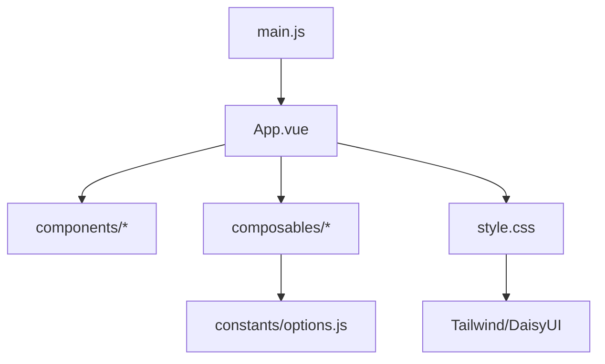
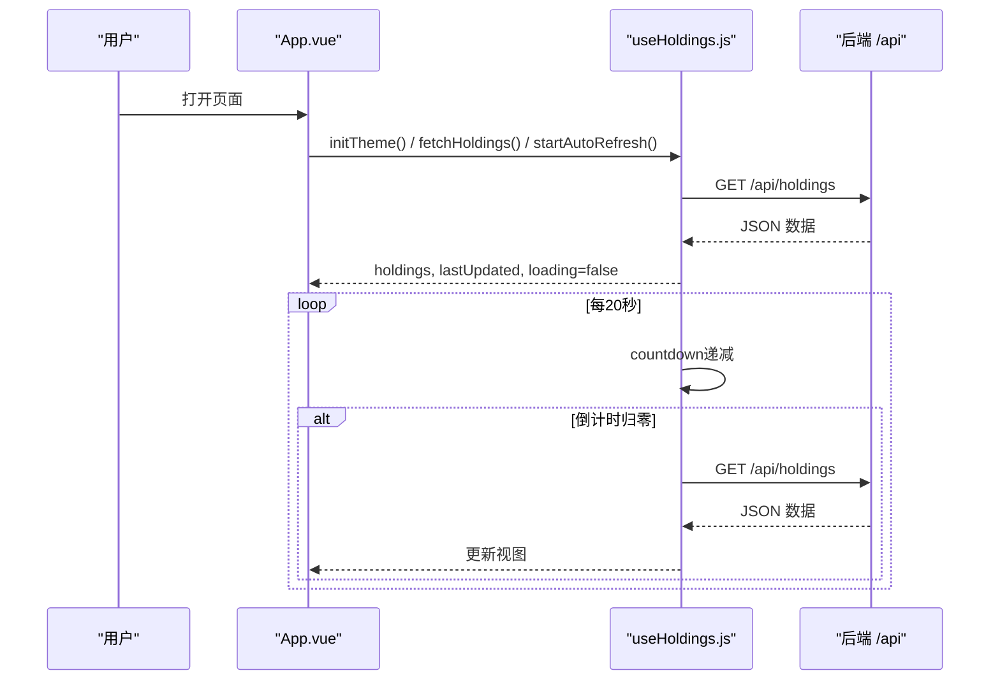
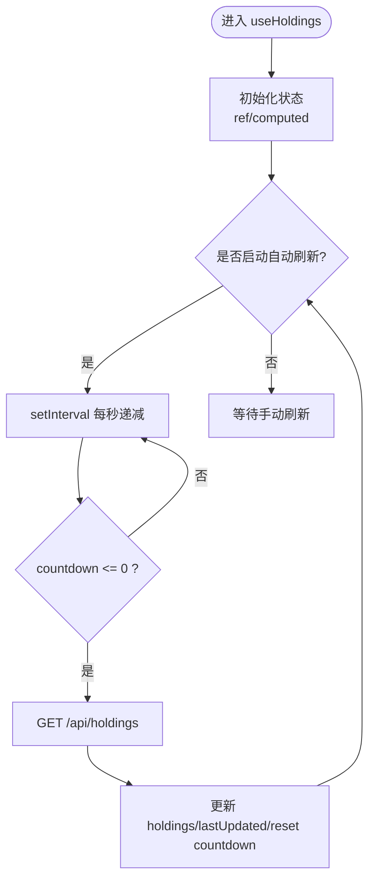
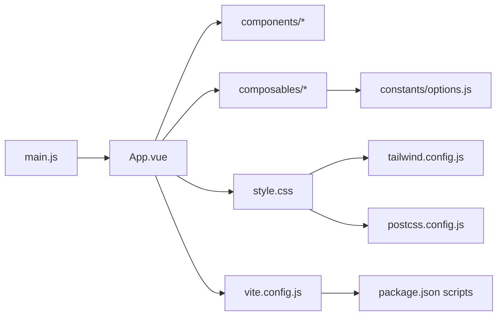

# 前端开发流程

<cite>
**本文引用的文件**
- [web/src/main.js](file://web/src/main.js)
- [web/src/App.vue](file://web/src/App.vue)
- [web/src/composables/useHoldings.js](file://web/src/composables/useHoldings.js)
- [web/src/composables/useTheme.js](file://web/src/composables/useTheme.js)
- [web/src/composables/useFormat.js](file://web/src/composables/useFormat.js)
- [web/src/constants/options.js](file://web/src/constants/options.js)
- [web/src/components/AppHeader.vue](file://web/src/components/AppHeader.vue)
- [web/src/components/HoldingCard.vue](file://web/src/components/HoldingCard.vue)
- [web/src/components/OverviewCards.vue](file://web/src/components/OverviewCards.vue)
- [vite.config.js](file://vite.config.js)
- [tailwind.config.js](file://tailwind.config.js)
- [postcss.config.js](file://postcss.config.js)
- [package.json](file://package.json)
</cite>

## 目录
1. [简介](#简介)
2. [项目结构](#项目结构)
3. [核心组件](#核心组件)
4. [架构总览](#架构总览)
5. [详细组件分析](#详细组件分析)
6. [依赖关系分析](#依赖关系分析)
7. [性能与优化](#性能与优化)
8. [故障排查指南](#故障排查指南)
9. [结论](#结论)
10. [附录](#附录)

## 简介
本指南面向Stock Advisor的前端开发，聚焦Vue 3 Composition API的使用模式、组合式函数规范、状态管理、组件开发流程（设计-实现-测试）、样式系统（Tailwind CSS + DaisyUI）集成与主题定制、Vite构建配置与优化、API调用封装与错误处理、响应式设计与移动端适配最佳实践，以及前端性能优化与调试方法。内容基于仓库中实际代码进行提炼与总结，确保可落地执行。

## 项目结构
前端源码位于 web/ 子目录，采用以功能域划分的目录组织：
- components：页面级与业务级组件
- composables：组合式函数（状态、逻辑复用）
- constants：常量与枚举
- App.vue：根组件，编排全局状态与路由级布局
- main.js：应用入口，挂载根组件并引入全局样式

图表来源
- [web/src/main.js:1-6](file://web/src/main.js#L1-L6)
- [web/src/App.vue:1-197](file://web/src/App.vue#L1-L197)
- [web/src/style.css:1-34](file://web/src/style.css#L1-L34)
- [tailwind.config.js:1-54](file://tailwind.config.js#L1-L54)

章节来源
- [web/src/main.js:1-6](file://web/src/main.js#L1-L6)
- [web/src/App.vue:1-197](file://web/src/App.vue#L1-L197)
- [package.json:1-32](file://package.json#L1-L32)

## 核心组件
- App.vue：应用根容器，负责主题初始化、数据获取与自动刷新、弹窗状态管理、过滤逻辑与整体布局。
- AppHeader.vue：顶部导航与操作区，展示更新时间、加载状态、倒计时环形进度，提供主题切换、刷新、导入CSV、添加持仓等事件。
- OverviewCards.vue：概览卡片，汇总持仓数、总成本、总市值、今日收益、持仓收益。
- HoldingCard.vue：单条持仓卡片，展示基本信息、指标、告警阈值编辑、买入明细折叠面板。

章节来源
- [web/src/App.vue:1-197](file://web/src/App.vue#L1-L197)
- [web/src/components/AppHeader.vue:1-64](file://web/src/components/AppHeader.vue#L1-L64)
- [web/src/components/OverviewCards.vue:1-41](file://web/src/components/OverviewCards.vue#L1-L41)
- [web/src/components/HoldingCard.vue:1-161](file://web/src/components/HoldingCard.vue#L1-L161)

## 架构总览
前端采用“组合式函数集中状态 + 组件按需消费”的轻量状态管理模式。useHoldings 作为模块级单例，维护持仓列表、加载态、错误信息、自动刷新计时器与汇总计算；组件通过解构使用，避免重复请求与状态分裂。

图表来源
- [web/src/App.vue:121-129](file://web/src/App.vue#L121-L129)
- [web/src/composables/useHoldings.js:15-49](file://web/src/composables/useHoldings.js#L15-L49)
- [web/src/constants/options.js:31-33](file://web/src/constants/options.js#L31-L33)

章节来源
- [web/src/composables/useHoldings.js:1-154](file://web/src/composables/useHoldings.js#L1-L154)
- [web/src/App.vue:1-197](file://web/src/App.vue#L1-L197)

## 详细组件分析

### 组合式函数：useHoldings（状态管理与API封装）
- 职责：统一持有持仓数据、加载与错误状态、自动刷新计时、汇总计算、写操作（增删改查）。
- 状态模型：
  - holdings: ref([])
  - lastUpdated: ref('')
  - loading: ref(false)
  - error: ref('')
  - countdown: ref(REFRESH_MS / 1000)
- 关键逻辑：
  - 自动刷新：单一定时器每秒递减，归零触发刷新，避免多定时器漂移。
  - 汇总计算：totalCost、totalMarket、totalHoldingProfit、totalTodayProfit 使用 computed 派生。
  - 写操作：addHolding、submitTransaction、savePurchase、deletePurchase、updateHolding 均统一调用 fetch 并在成功后刷新列表。
- 错误处理：网络异常或后端返回非 ok 时设置 error 或抛出错误，由上层捕获提示。
- 复杂度：
  - 刷新频率 O(1)，汇总计算 O(n)（n为持仓数量），在常规规模下无性能瓶颈。

图表来源
- [web/src/composables/useHoldings.js:35-49](file://web/src/composables/useHoldings.js#L35-L49)
- [web/src/composables/useHoldings.js:15-29](file://web/src/composables/useHoldings.js#L15-L29)

章节来源
- [web/src/composables/useHoldings.js:1-154](file://web/src/composables/useHoldings.js#L1-L154)

### 组合式函数：useTheme（主题切换）
- 职责：维护 isDark、持久化到 localStorage、同步 <html> class 与 data-theme。
- 行为：
  - initTheme：读取本地存储，默认深色，应用主题。
  - toggleTheme：切换 isDark，写入 localStorage，应用主题。
  - applyTheme：设置 documentElement.dataset.theme 与 class 'dark'。

章节来源
- [web/src/composables/useTheme.js:1-26](file://web/src/composables/useTheme.js#L1-L26)

### 组合式函数：useFormat（纯格式化与徽章映射）
- 职责：无副作用的格式化函数与徽章映射，便于复用与单测。
- 能力：金额、价格、数量、百分比、日期格式化；收益红绿类名；地区/策略/触发状态徽章映射。
- 设计原则：纯函数、可测试、与UI层解耦。

章节来源
- [web/src/composables/useFormat.js:1-70](file://web/src/useFormat.js#L1-L70)

### 常量与枚举：options
- 投资策略、地区选项、持仓类型、地区短标签、自动刷新间隔（毫秒）。
- 作用：前后端一致性与UI文案/样式的单一事实来源。

章节来源
- [web/src/constants/options.js:1-33](file://web/src/constants/options.js#L1-L33)

### 组件：App.vue（编排与交互）
- 生命周期：onMounted 初始化主题、拉取数据、启动自动刷新；onUnmounted 清理定时器。
- 状态：弹窗显隐、交易表单、买入记录表单、多选过滤（类型/市场）。
- 事件：向 Header 派发主题切换、刷新、测试飞书、添加、导入CSV等事件。
- 过滤：支持按类型与市场多选过滤，提供清除过滤。

章节来源
- [web/src/App.vue:1-197](file://web/src/App.vue#L1-L197)

### 组件：AppHeader.vue（头部与操作）
- 展示：更新时间、加载状态、错误信息、倒计时环形进度。
- 交互：主题切换、导入CSV、刷新、测试飞书、添加持仓。
- 事件：emit 对应动作给父组件处理。

章节来源
- [web/src/components/AppHeader.vue:1-64](file://web/src/components/AppHeader.vue#L1-L64)

### 组件：OverviewCards.vue（概览卡片）
- 展示：持仓数、总成本、总市值、今日收益、持仓收益。
- 样式：响应式网格布局，适配不同屏幕尺寸。

章节来源
- [web/src/components/OverviewCards.vue:1-41](file://web/src/components/OverviewCards.vue#L1-L41)

### 组件：HoldingCard.vue（持仓卡片）
- 展示：名称、状态、地区、类型、策略、触发状态、市值/数量、成本/现价、今日收益/收益率、持仓收益/收益率、止盈止损、补仓参数、日涨跌告警阈值。
- 交互：展开/收起明细、内联编辑告警阈值、打开买入/卖出记录弹窗。
- 复用：使用 useFormat 与 useHoldings 提供的工具与写操作。

章节来源
- [web/src/components/HoldingCard.vue:1-161](file://web/src/components/HoldingCard.vue#L1-L161)

## 依赖关系分析
- 入口：main.js 创建 Vue 应用并挂载 App.vue，引入全局样式。
- 样式链：style.css 引入 Tailwind 基础/组件/工具类；postcss.config.js 启用 tailwindcss 与 autoprefixer；tailwind.config.js 配置 DaisyUI 主题与 darkMode。
- 构建：vite.config.js 将 web 作为 root，输出到 ../dist，开发时代理 /api 到本地后端 3000 端口。
- 脚本：package.json 提供 dev/build/preview/import:csv 等命令。

图表来源
- [web/src/main.js:1-6](file://web/src/main.js#L1-L6)
- [web/src/App.vue:1-197](file://web/src/App.vue#L1-L197)
- [tailwind.config.js:1-54](file://tailwind.config.js#L1-L54)
- [postcss.config.js:1-7](file://postcss.config.js#L1-L7)
- [vite.config.js:1-26](file://vite.config.js#L1-L26)
- [package.json:1-32](file://package.json#L1-L32)

章节来源
- [vite.config.js:1-26](file://vite.config.js#L1-L26)
- [tailwind.config.js:1-54](file://tailwind.config.js#L1-L54)
- [postcss.config.js:1-7](file://postcss.config.js#L1-L7)
- [package.json:1-32](file://package.json#L1-L32)

## 性能与优化
- 自动刷新节流：使用单一定时器每秒递减，避免频繁请求与抖动。
- 计算属性缓存：汇总指标使用 computed，仅在依赖变化时重算。
- 条件渲染与折叠：明细区域按需展开，减少初始渲染压力。
- 样式优化：Tailwind 按需生成类，DaisyUI 主题变量减少自定义CSS。
- 构建优化：Vite 生产构建开启 tree-shaking 与代码分割（默认），产物输出到 dist，便于静态托管。
- 网络优化：建议在生产环境启用 gzip/brotli（服务器侧），合并小资源（Vite 默认已处理）。
- 调试技巧：
  - 开发服务器代理 /api 到后端，便于联调。
  - 浏览器开发者工具 Network 面板查看接口耗时与错误。
  - 使用 console.log 或断点调试组合式函数内部状态变化。

[本节为通用指导，不直接分析具体文件]

## 故障排查指南
- 无法获取数据：
  - 检查网络请求是否被代理到后端（/api），确认后端服务运行在 3000 端口。
  - 查看 useHoldings 中的 error 状态与控制台报错。
- 自动刷新不工作：
  - 检查 onMounted 是否调用 startAutoRefresh，onUnmounted 是否停止定时器。
  - 确认 REFRESH_MS 常量值合理。
- 主题切换无效：
  - 检查 useTheme 是否正确设置 documentElement.dataset.theme 与 class 'dark'。
  - 确认 tailwind.config.js 中 darkMode: 'class' 与 daisyui.darkTheme 配置正确。
- 样式未生效：
  - 确认 style.css 引入了 @tailwind base/components/utilities。
  - 检查 postcss.config.js 与 tailwind.config.js 的 content 路径包含 web/src/**/*.{vue,js}。
- 弹窗与表单问题：
  - 检查 App.vue 中弹窗状态绑定与事件派发是否正确。
  - 使用浏览器元素检查定位模板与 props/emits 传递。

章节来源
- [web/src/composables/useHoldings.js:15-49](file://web/src/composables/useHoldings.js#L15-L49)
- [web/src/composables/useTheme.js:5-21](file://web/src/composables/useTheme.js#L5-L21)
- [tailwind.config.js:4-12](file://tailwind.config.js#L4-L12)
- [postcss.config.js:1-7](file://postcss.config.js#L1-L7)
- [web/src/App.vue:121-129](file://web/src/App.vue#L121-L129)

## 结论
本项目采用 Vue 3 Composition API 与组合式函数实现轻量而清晰的状态管理，结合 Tailwind + DaisyUI 的主题系统与响应式布局，配合 Vite 的高效构建与开发体验，形成了稳定易维护的前端架构。遵循本文档的组合式函数编写规范、组件开发流程、样式与构建配置、API 封装与错误处理、响应式与性能优化实践，可有效提升开发效率与产品质量。

[本节为总结性内容，不直接分析具体文件]

## 附录

### Vue 3 Composition API 使用模式与规范
- 组合式函数职责单一：如 useHoldings 专注数据与刷新，useTheme 专注主题，useFormat 专注格式化。
- 状态集中管理：模块级 ref 共享状态，组件通过解构使用，避免重复状态。
- 计算属性派生：汇总指标使用 computed，保证性能与可读性。
- 生命周期管理：onMounted/onUnmounted 成对出现，确保资源释放。

章节来源
- [web/src/composables/useHoldings.js:1-154](file://web/src/composables/useHoldings.js#L1-L154)
- [web/src/composables/useTheme.js:1-26](file://web/src/composables/useTheme.js#L1-L26)
- [web/src/App.vue:121-129](file://web/src/App.vue#L121-L129)

### 组件开发流程（设计-实现-测试）
- 设计：明确组件职责、props/emits、插槽与样式边界。
- 实现：使用 <script setup> 语法，组合式函数复用逻辑，Tailwind 原子类快速构建UI。
- 测试：对纯函数（useFormat）编写单元测试；对组件可通过快照与交互测试验证；对组合式函数可模拟状态与异步行为进行测试。

章节来源
- [web/src/components/AppHeader.vue:1-64](file://web/src/components/AppHeader.vue#L1-L64)
- [web/src/components/HoldingCard.vue:1-161](file://web/src/components/HoldingCard.vue#L1-L161)
- [web/src/composables/useFormat.js:1-70](file://web/src/composables/useFormat.js#L1-L70)

### 样式系统（Tailwind + DaisyUI）集成与主题配置
- Tailwind：通过 postcss.config.js 启用，tailwind.config.js 配置 content 与 darkMode。
- DaisyUI：定义 stocklight/stockdark 两套主题，darkTheme 与 class 切换联动。
- 全局样式：style.css 引入 Tailwind 指令与自定义滚动条、按钮样式。

章节来源
- [tailwind.config.js:1-54](file://tailwind.config.js#L1-L54)
- [postcss.config.js:1-7](file://postcss.config.js#L1-L7)
- [web/src/style.css:1-34](file://web/src/style.css#L1-L34)

### Vite 构建配置与优化
- root: 'web'，outDir: '../dist'，开发服务器 host 绑定 0.0.0.0，端口 5173。
- 代理：/api 转发到 http://127.0.0.1:3000，便于前后端联调。
- 插件：@vitejs/plugin-vue 支持 .vue 单文件组件。

章节来源
- [vite.config.js:1-26](file://vite.config.js#L1-L26)

### API 调用封装与错误处理策略
- 统一封装：useHoldings 中集中处理所有 /api/holdings* 请求，统一错误处理与刷新逻辑。
- 错误处理：网络异常与后端非 ok 响应均捕获并设置 error 或抛出错误，供上层提示。
- 幂等与重试：当前未实现重试机制，可在需要时增加指数退避重试与失败降级。

章节来源
- [web/src/composables/useHoldings.js:66-130](file://web/src/composables/useHoldings.js#L66-L130)

### 响应式设计与移动端适配最佳实践
- 栅格：使用 Tailwind 的 grid-cols-* 与 sm/lg 断点实现响应式布局。
- 间距与排版：使用 flex/grid、p/margin、text-* 控制视觉层次。
- 交互：按钮与输入框在小屏上保持可点击区域与可读性。
- 主题：通过 data-theme 与 class 'dark' 切换深浅色，适配不同场景。

章节来源
- [web/src/components/OverviewCards.vue:13-41](file://web/src/components/OverviewCards.vue#L13-L41)
- [web/src/components/HoldingCard.vue:57-161](file://web/src/components/HoldingCard.vue#L57-L161)
- [tailwind.config.js:4-12](file://tailwind.config.js#L4-L12)